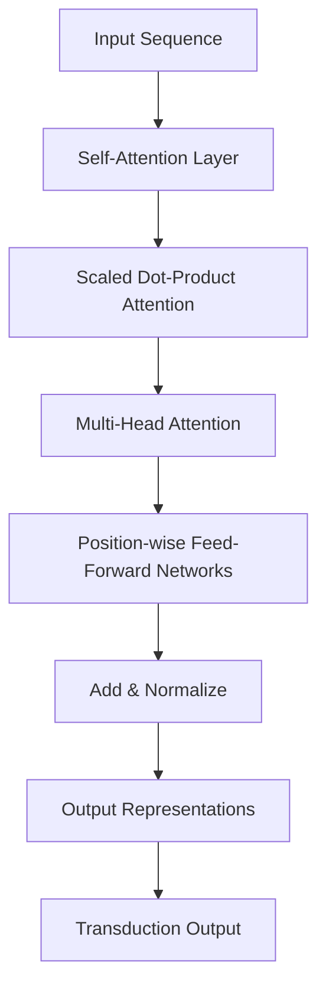

# Transformer Architecture: Attention Is All You Need

For years, the dominant approach to sequence modeling — from language translation to speech recognition — leaned on **recurrent** or **convolutional** neural networks. These architectures process a sequence step by step, carrying information forward through time. They work, but they are slow to train and struggle with long-range dependencies.

The **Transformer** changed the game. Introduced as the first transduction model that relies *entirely* on self-attention to compute representations of inputs and outputs, it removed recurrence altogether. In doing so, it achieved remarkable results on machine translation while training in a fraction of the time required by recurrent models.

This article unpacks the Transformer from the ground up. We'll look at why the authors abandoned recurrence, walk through each core building block (scaled dot-product attention, multi-head attention, and position-wise feed-forward networks), examine the reported translation results, and explore what this architectural shift means for the future of sequence transduction.

> This article is based solely on the source study document provided (`input.txt`), which presents a high-level abstract of the Transformer architecture. Where the source is terse, we explain the underlying concepts in plain terms and clearly note when specific details are not covered by the source.

## Table of Contents

- [Why Sequence Models Needed a Rethink](#why-sequence-models-needed-a-rethink)
- [Core Components of the Transformer](#core-components-of-the-transformer)
  - [Scaled Dot-Product Attention](#scaled-dot-product-attention)
  - [Multi-Head Attention](#multi-head-attention)
  - [Position-wise Feed-Forward Networks](#position-wise-feed-forward-networks)
- [How Self-Attention Replaces Recurrence](#how-self-attention-replaces-recurrence)
- [Training Speed: The Advantage of Parallelism](#training-speed-the-advantage-of-parallelism)
- [Translation Results: The BLEU Benchmark](#translation-results-the-bleu-benchmark)
- [A Real-World Walkthrough: Translating a Sentence](#a-real-world-walkthrough-translating-a-sentence)
- [The Impact: A Shift in Sequence Transduction](#the-impact-a-shift-in-sequence-transduction)
- [Key Takeaways](#key-takeaways)
- [Frequently Asked Questions](#frequently-asked-questions)
- [Related Articles](#related-articles)

## Why Sequence Models Needed a Rethink

Before the Transformer, most sequence transduction models — such as machine translation systems — were built on recurrent neural networks (RNNs) or convolutional neural networks (CNNs). RNNs process tokens one after another, maintaining a hidden state that attempts to summarize everything seen so far.

This sequential nature introduces a fundamental bottleneck: **each output position depends on the previous one, so the model cannot process a sentence in parallel**. Training a single translation batch therefore takes many sequential steps, and errors or important information can be diluted as it is passed across many time steps.

The Transformer's central claim is that recurrence is not actually required for sequence transduction. By using **self-attention**, the model can directly compute relationships between any two positions in a sequence, regardless of their distance apart. This single design decision unlocks parallel training and better long-range modeling at the same time.

## Core Components of the Transformer

The source document highlights three foundational building blocks of the architecture:

1. **Scaled Dot-Product Attention** — the mechanism that computes attention weights between positions.
2. **Multi-Head Attention** — runs several attention computations in parallel to capture different relationships.
3. **Position-wise Feed-Forward Networks** — apply non-linear transformations to each position independently.

Each component plays a distinct role. Let's examine them one by one.

### Scaled Dot-Product Attention

Scaled dot-product attention is the heart of the model. It computes how much each token in a sequence should "attend to" every other token.

Conceptually, attention can be described with three entities:

- **Query** — the position that is "asking" for information.
- **Key** — the positions that the query compares itself against.
- **Value** — the actual content that gets aggregated.

Attention is then computed by taking a dot product between the query and each key, which produces a similarity score. These scores are **scaled** (hence "scaled" dot-product attention) — typically to counteract the growth in magnitude that can occur with high-dimensional dot products and push values into the range where softmax behaves gracefully. A softmax operation then converts the scaled scores into weights that sum to one, and those weights are used to take a weighted sum of the values.

The source document does not detail the exact scaling factor or full formula, so those specifics are not covered here. What matters is the effect: each token produces a context-aware output that blends information from the whole sequence, weighted by relevance.

### Multi-Head Attention

Instead of running a single attention computation, the Transformer runs **many** of them in parallel. This is multi-head attention.

Why multiple heads? A single attention function captures one view of the relationships between tokens. By running several heads simultaneously — each with its own learned projection — the model can attend to information from different representation subspaces at different positions.

| Single Head Attention | Multi-Head Attention |
| --------------------- | --------------------- |
| One perspective on token relationships | Many parallel perspectives |
| Single learned projection | Independent projections per head |
| Captures one pattern | Captures diverse relational patterns |
| Lower capacity | Higher representational capacity |

In practice, each head might specialize in a different kind of relationship — for example, one head might track syntactic dependencies while another tracks long-distance semantic references. The outputs of all heads are then combined, giving the model a richer, multi-faceted understanding of the input.

### Position-wise Feed-Forward Networks

After self-attention has mixed information *across* positions, the Transformer applies a **position-wise feed-forward network** to each position independently.

The "position-wise" name is key: the exact same feed-forward network is applied to every position, but it processes them independently (without interacting across positions). This is where the model performs its non-linear transformation of the attention output, adding representational depth that attention alone cannot provide.

The result is a repeating pattern inside each layer:

```text
Input
  -> Multi-Head Self-Attention (mixes across positions)
  -> Add & Normalize
  -> Position-wise Feed-Forward Network (transforms each position)
  -> Add & Normalize
  -> Output of layer
```

The source document does not specify the exact layer counts, dimensions, or activation functions of these networks — those hyperparameters are not covered by the source.

## How Self-Attention Replaces Recurrence

The most profound idea in the source is that attention alone is sufficient for sequence transduction — recurrence can be dropped entirely.

In a recurrent model, each token's representation depends on a chain of previous hidden states. In the Transformer, each token's representation is computed directly from **all** tokens via self-attention, in a single pass. This means:

- **No sequential bottleneck**: all positions can be processed in parallel.
- **Constant path length**: any two positions can relate directly, even if they are far apart in the sequence.
- **Long-range dependencies** become much easier to model, because nothing is "forgotten" as information travels through time steps.

We can visualize how the data flows through the architecture with a simplified flow.



Because every element in the sequence can attend to every other element simultaneously, the whole sentence is processed in one forward pass rather than step by step.

## Training Speed: The Advantage of Parallelism

One of the most striking practical advantages the source reports is **training time**.

The Transformer achieved its translation results after training for only **3.5 days on 8 NVIDIA P100 GPUs**. The source explicitly contrasts this with recurrent models, stating it was *significantly faster* than recurrent models to train.

This speedup is a direct consequence of parallelism. Recurrent models must process a sequence token-by-token, which is inherently sequential. The Transformer's self-attention lets every position be computed simultaneously, so it uses the available hardware far more efficiently.

| Model Type | Training Characteristic | Source Coverage |
| ---------- | ----------------------- | --------------- |
| Recurrent (RNN) | Sequential token processing, slower | Contrasted in source |
| Convolutional (CNN) | Parallel but limited long-range modeling | Mentioned in source |
| Transformer | Fully parallel self-attention | 3.5 days on 8 P100 GPUs |

The source does not provide the training time of the recurrent baselines it compares against, so the exact magnitude of the speedup is not covered. What is clear is that removing recurrence made the model both faster to train and competitive — even state-of-the-art — in quality.

## Translation Results: The BLEU Benchmark

To measure translation quality, the authors used the **BLEU** score, a standard metric that compares a model's output translation against a set of human reference translations by rewarding n-gram overlap. Higher BLEU scores generally indicate closer agreement with the human references.

The source reports that the Transformer achieved **28.4 BLEU** on the **WMT 2014 English-to-German** translation task. This result represents an improvement over the previous best system on that benchmark at the time.

> Important note: A BLEU score alone does not tell the whole story of translation quality — it measures statistical overlap with reference sentences rather than full fluency or meaning. Still, the gain on a competitive benchmark like WMT 2014 was a strong signal that the attention-based approach was not only faster, but also more accurate.

The source does not provide the exact baseline BLEU scores that the Transformer improved upon, so the precise margin of improvement is not covered here. The headline figures the source gives us are:

- **Task**: WMT 2014 English-to-German translation
- **Result**: 28.4 BLEU
- **Training**: 3.5 days on 8 NVIDIA P100 GPUs

## A Real-World Walkthrough: Translating a Sentence

To see the ideas in action, let's trace how the Transformer might translate a simple English sentence into German — reasoning grounded in the components described in the source. (The specific vocabulary and internal vectors are illustrative, since the source does not include a worked example.)

Consider the input:

```text
The cat sat on the mat.
```

1. **Tokenization and embedding**: each word is converted into a vector representation, with position information added so the model knows the order of "cat" before "sat."
2. **Self-attention**: each token forms a query. The query for "sat" might produce high attention weights over "cat" (who sat?) and "mat" (on what?). The scaled dot-product attention aggregates the relevant context into a refined representation of each word.
3. **Multi-head perspectives**: separate heads might capture grammatical function (subject vs. object) and long-range meaning simultaneously.
4. **Feed-forward transformation**: each position is passed through the position-wise network to build a deeper feature representation.
5. **Decoder and output**: the encoder's representations guide a decoder that produces the German translation one token at a time, using the attention-based representations as context.

The key difference from an RNN: at every stage, the word "cat" and the word "mat" can directly influence "sat," regardless of how far apart they are. No hidden state needs to carry that relationship across many steps.

## The Impact: A Shift in Sequence Transduction

The source's concluding statement is a strong one: **"Attention mechanisms prove that recurrence is not required for sequence transduction."**

This conclusion reshaped how the field approached sequence modeling. By proving that a purely attention-based model could match or beat recurrent baselines while training faster, the Transformer opened the door to a new family of architectures that scale more readily with hardware parallelism. The practical and conceptual takeaways can be summarized as:

1. Recurrence is a design choice, not a requirement.
2. Self-attention provides a fully parallel way to model relationships in a sequence.
3. Faster training and strong results can come from the same architectural decision.
4. The combination of scaled dot-product attention, multi-head attention, and position-wise feed-forward networks forms a powerful, reusable building block.

> Caution: the broader evolution of the Transformer into modern large language models goes well beyond what this source document covers. The `input.txt` file is a brief abstract; it does not include decoder details, positional encoding specifics, layer hyperparameters, or downstream applications.

## Key Takeaways

- The Transformer is the first sequence transduction model built **entirely on self-attention**, with no reliance on recurrence or convolution to compute input/output representations.
- Its three core components are **scaled dot-product attention**, **multi-head attention**, and **position-wise feed-forward networks**.
- By removing recurrence, the Transformer processes all positions in parallel, which dramatically shortens training time.
- The source reports the model achieved **28.4 BLEU** on the **WMT 2014 English-to-German** translation benchmark, improving over the prior best result.
- Training took only **3.5 days on 8 NVIDIA P100 GPUs** — significantly faster than recurrent models, per the source.
- The central conclusion of the source is that **recurrence is not required** for sequence transduction; attention alone suffices.

## Frequently Asked Questions

**What is the main idea of the Transformer architecture?**
The Transformer is the first sequence transduction model that relies entirely on self-attention to compute input and output representations, removing the need for recurrent or convolutional mechanisms.

**What are the three named core components in the source?**
The source names scaled dot-product attention, multi-head attention, and position-wise feed-forward networks as the key components.

**Why is the Transformer faster to train than recurrent models?**
Because self-attention lets every position in a sequence be computed in parallel, whereas recurrent models process tokens one at a time. The source reports 3.5 days of training on 8 NVIDIA P100 GPUs.

**What result did the Transformer achieve on translation?**
It achieved 28.4 BLEU on the WMT 2014 English-to-German translation task, improving over the previous best result. The exact prior baseline is not stated in the source.

**Does the source describe the full architecture in detail?**
No. The `input.txt` file is a concise abstract. It does not include the complete decoder design, positional encoding formulas, layer dimensions, or activation functions; those specifics are not covered by the source.

## Related Articles

- Introduction to Sequence-to-Sequence Models
- Understanding the BLEU Metric for Machine Translation
- Recurrent Neural Networks vs. Attention-Based Models
- Scaling Deep Learning with Parallel Training