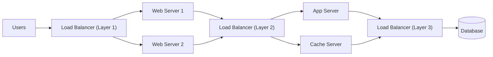
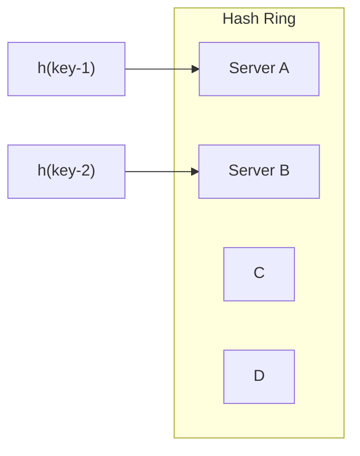

# System Design Handbook: A Practical Guide to Scalable Architectures

Designing systems that handle millions of users is one of the hardest problems in software engineering. The good news is that the core ideas — decomposition, trade-off analysis, and a toolkit of battle-tested patterns — are learnable and repeatable. This article distills the essential concepts from a classic system design handbook: from the very basics of how to approach a design problem, through load balancing, databases, the CAP theorem, caching, sharding, consistent hashing, queues, and the communication protocols that connect clients to servers.

By the end, you will understand the vocabulary and trade-offs interviewers expect, and you will be able to reason about real-world architectures with confidence.

*Image credit: [Wikimedia Commons](https://commons.wikimedia.org/wiki/File:Software_Architecture_Activities.jpg)*

## Table of Contents

- [Core Principles of System Design](#core-principles-of-system-design)
- [Load Balancing in Distributed Systems](#load-balancing-in-distributed-systems)
- [SQL vs NoSQL: Choosing Your Database](#sql-vs-nosql-choosing-your-database)
- [The CAP Theorem](#the-cap-theorem)
- [Redundancy and Replication](#redundancy-and-replication)
- [Caching Strategies](#caching-strategies)
- [Sharding and Data Partitioning](#sharding-and-data-partitioning)
- [Indexes: Speeding Up Retrieval](#indexes-speeding-up-retrieval)
- [Proxies: The Unsung Request Handlers](#proxies-the-unsung-request-handlers)
- [Queues: Taming Asynchronous Workloads](#queues-taming-asynchronous-workloads)
- [Consistent Hashing](#consistent-hashing)
- [Real-World Example: A Photo-Sharing Service](#real-world-example-a-photo-sharing-service)
- [Client-Server Communication Protocols](#client-server-communication-protocols)
- [Key Takeaways](#key-takeaways)
- [Frequently Asked Questions](#frequently-asked-questions)
- [Related Articles](#related-articles)

## Core Principles of System Design

Before you touch any diagram, the handbook emphasizes a disciplined approach to problem solving. There are three steps that frame almost every good design conversation.

### 1. Break the problem into simpler modules

Use a **top-down approach**. Instead of tackling a giant system as one monolith, split it into smaller, independent modules. Each module can then be designed, reasoned about, and scaled on its own. This is the same instinct behind microservices, separation of concerns, and layered architectures.

### 2. Talk about the trade-offs

> No solution is perfect. Every architecture decision trades something to gain something else — and being explicit about those trade-offs is what separates senior engineers from beginners.

When you propose an approach, calculate its impact on the system based on all the constraints and the end test cases. What happens to latency? What happens to cost? What happens when a node dies? If you can articulate the impact on the system under realistic conditions, you are designing rather than guessing.

### 3. Focus on the interviewer's intentions and ask questions

Ask abstract questions that clarify **constraints and functional requirements** before jumping into details. Common clarifying areas include:

- What are the expected scale, read/write ratio, and traffic patterns?
- What are the availability and consistency requirements?
- Where are the likely bottlenecks?
- What resources (architectural pieces) are available, and how must they work together?

The handbook lists the core architectural building blocks you should have in your toolbox:

1. Consistent hashing
2. CAP theorem
3. Load balancing
4. Queues
5. Caching
6. Replication
7. SQL vs NoSQL
8. Indexes
9. Proxies
10. Data partitioning

We will cover each of these in detail below.

## Load Balancing in Distributed Systems

Load balancing distributes incoming requests across a pool of servers to fully utilize scalability and redundancy. In a distributed system, traffic can be distributed using **random**, **round-robin**, or **random with weights** (weights tuned for memory and CPU cycles of each machine).

A common pattern is to place load balancers at multiple layers:

This layered setup follows the pattern: **user → web server → app server / cache server (internal platform) → database**. For full scalability and redundancy, the handbook recommends adding load balancers at all three layers.

### Smart clients

A **smart client** takes a pool of service hosts and balances the load across them. It:

- Detects hosts that are not responsive and stops sending traffic to them
- Recovers and re-adds hosts that come back online
- Incorporates newly added hosts automatically
- Can apply load-balancing functionality directly to databases, caches, and services

Smart clients are an attractive solution for developers building **small-scale systems**. However, as the system grows, teams migrate to **standalone load-balancer servers (LBS)**.

### Hardware vs software load balancers

| Type | Pros | Cons | Example |
| --- | --- | --- | --- |
| Hardware load balancers | High performance, expensive but reliable | Not trivial to configure; costly | Citrix NetScaler |
| Software load balancers | No smart-client code to write; no dedicated hardware cost | Runs on commodity machines | HAProxy |

**Hardware load balancers** are powerful but costly and hard to configure, so large companies tend to avoid managing them or use one only as the first point of contact for user requests, while the intra-network uses smart clients or a hybrid solution for load-balancing traffic.

**Software load balancers** eliminate the pain of writing a smart client and the cost of purchasing dedicated hardware. A leading open-source example is **HAProxy**, which runs either:

1. **On the client machine** (a locally bound port, e.g., `localhost:9000`), efficiently managing requests on that port.
2. **On an intermediate server**, acting as a proxy that manages health checks, removes and adds server-side machines, and balances requests across pools.

## SQL vs NoSQL: Choosing Your Database

Databases fall into two broad families with very different trade-offs.

| Dimension | SQL | NoSQL |
| --- | --- | --- |
| Data model | Structured | Unstructured |
| Schema | Predefined | Dynamic |
| Storage layout | Data in rows & columns | Distributed, schema-flexible |
| Entity model | Row = one entity; column = separate data points | Documents / key-value / wide-column |
| Examples | MySQL, Oracle, DB2, Postgres, MariaDB | Cassandra, CouchDB, and other document/column stores |

### Reasons to use SQL

1. **You need ACID compliance.** ACID compliance reduces anomalies and protects the integrity of the database. For many e-commerce and financial applications, an ACID-compliant database is the first choice.
2. **Your data is structured and unchanging.** If the business is not experiencing rapid growth or sudden changes, there is no requirement for more servers and data stays consistent. Then there is no reason to add complexity to support a variety of data and high traffic.

### Reasons to use NoSQL

When all other components of the system are fast, querying and searching for data becomes the **bottleneck** — and NoSQL prevents data from being that bottleneck. Big data is a large success case for NoSQL. Specific reasons include:

1. **Storing large volumes of data with little structure.** There is no limit on the type of data. A document DB stores all data in one place, with no need to fix the data type up front.
2. **Using cloud and storage to the fullest.** NoSQL offers excellent cost savings. Data spreads easily across multiple servers to scale up, or across affordable commodity hardware on-site. NoSQL databases like **Cassandra** are designed to scale across multiple data centers out of the box.
3. **Rapid, agile development.** If you are making quick iterations on your schema, SQL will slow you down; NoSQL keeps up.

## The CAP Theorem

The CAP theorem states that a distributed datastore cannot simultaneously provide all three of the following guarantees:

| Property | Meaning | Achieved by |
| --- | --- | --- |
| **Consistency** | All nodes see the same data at the same time; several nodes are updated before any reads are allowed | Serializing updates across nodes |
| **Availability** | Every request gets a response (success or failure); the system continues to work despite message loss | Replicating data across different servers |
| **Partition tolerance** | The system survives any amount of network failure; data is replicated enough across combinations of nodes/networks to keep the system up | Sufficient replication across nodes/networks |

Examples given for systems that prioritize availability are **Cassandra** and **CouchDB**.

### Why you cannot have all three

> We cannot build a datastore that is continually available, sequentially consistent, and partition-failure tolerant. Given the choice, systems must pick two.

To be consistent, all nodes must see the same set of updates in the same order. But if the network suffers a partition, an update in one partition might not make it to other partitions. A client that first reads from an up-to-date partition and then reads from an out-of-date partition sees stale data.

The only way to preserve consistency is to stop serving requests from the out-of-date partition — which means the service is **no longer 100% available**. That is the fundamental tension behind every distributed database design decision.

## Redundancy and Replication

**Redundancy** is the duplication of critical data and services to increase the reliability of the system. For critical services and data, ensure that multiple copies or versions are running simultaneously on different servers or databases.

Replication is the active data being mirrored to secondary servers:

- **Primary server → secondary server**: the primary's data is replicated to a secondary server, providing a standby in a crisis.
- **Secure against single-node failures**: losing one machine does not bring the system down.
- **Provides backups**: copies exist if they are needed during a crisis.

### Service redundancy and shared-nothing architecture

Service redundancy relies on a **shared-nothing architecture**: every node is independent and there is **no central service managing state**. The benefits are clear:

- More resilient to failures
- New servers can be added without special conditions
- Helps with scalability

Because no node holds exclusive responsibility for shared state, the loss of any single node is survivable.

## Caching Strategies

Load balancing scales a system horizontally; **caching** exploits the **locality-of-reference principle** and is used in almost every layer of computing. The core idea: keep frequently accessed data close to the consumer so reads never travel all the way to the origin.

### Application server cache

Placing a cache directly on a request-layer node stores responses in **local storage**. That local storage can be:

- **Memory** — very fast
- **The node's local disk** — faster than going to network storage

The bottleneck: if the load balancer distributes requests randomly, the same request can hit different nodes, each missing the cache. This is resolved by moving to **global caches** or **distributed caches**.

### Distributed cache

A distributed cache is divided using a **consistent hashing function**. It is easy to increase cache space by adding more nodes. Disadvantages:

- Storing multiple copies of data on different nodes makes resolving a missing node more complicated.
- Even if a node disappears, the request can pull data from the origin.

### Global cache

A global cache is a **single cache space for all nodes** — a cache source/file store that is faster than the original store. It is effective when:

- There is a fixed dataset that needs to be cached.
- Special hardware provides fast I/O.

It becomes difficult to manage as the number of clients or requests increases. There are forms of global cache where the database contains the hot data and the cache sits in front, and where **app logic understands the eviction strategy better than the cache does**.

### CDN (Content Distribution Network)

A CDN is a cache store for sites that serve large amounts of **static media**. If content is not available locally, the request falls back to the CDN and then to the back-end server. If the site is not large enough to justify its own CDN, teams can transition gradually: serve some static media from a **separate subdomain** (e.g., `static.yourservice.com`) using a lightweight server like **Nginx**, and later point the DNS from your service to a CDN.

### Cache invalidation

Cached data must stay coherent with the database: if data in the DB is modified, the cached copy must be invalidated. Three common schemes:

| Scheme | Behavior | Pros | Cons |
| --- | --- | --- | --- |
| **Write-through** | Data is written to cache and DB at the same time | Complete data consistency (cache = DB); fault tolerance — no data loss | High latency on writes (two write operations) |
| **Write-around** | Data is written to the DB, bypassing the cache | No cache flooding for writes | Read of newly written data is a miss → higher latency |
| **Write-back** | Data is written to the cache; the DB is written after some interval under specified conditions | Low latency and high throughput for write-intensive apps | Risk of data loss (only one copy lives in cache) |

### Cache eviction policies

When a cache is full, entries must be evicted. Common policies:

1. FIFO (First In, First Out)
2. LIFO / FILO (Last In, First Out)
3. LRU (Least Recently Used)
4. MRU (Most Recently Used)
5. LFU (Least Frequently Used)
6. Random Replacement

## Sharding and Data Partitioning

**Data partitioning (sharding)** is splitting up a DB or table across multiple machines to gain **manageability, performance, availability, and load balancing**.

> After a certain scale point, it is cheaper and more feasible to scale horizontally by adding more machines instead of scaling vertically by adding more beefiness to a single machine.

### Methods of partitioning

1. **Horizontal partitioning** — different rows go into different tables. Range-based sharding, e.g., storing locations by zip code: Table 1 holds zips with values up to 100000, Table 2 holds the next range, and so on. **Caveat**: if the range boundaries are not chosen carefully, servers become unbalanced — Table 1 may hold far more data than Table 2.
2. **Vertical partitioning** — feature-wise distribution of data across servers. Example: Instagram shards so that DB server 1 stores user info, server 2 stores followers, and server 3 stores photos. It is straightforward to implement with low impact on the app. But with additional growth, each feature-specific DB must itself be partitioned across servers — a single server could not handle all metadata queries for 10 billion photos across 140 million users.
3. **Directory-based partitioning** — a loosely coupled approach that works around the issues above. A **lookup service** holds the current partitioning scheme and maps each tuple key to a DB server, abstracting partitioning away from the DB access code. It is easy to add DB servers or change the partitioning scheme.

### Partitioning criteria

- **Key or hash-based partitioning**: a hash function maps each key to a partition number, effectively fixing the total number of servers/partitions. Adding a server or partition requires changing the hash function, causing downtime from redistribution — the solution is **consistent hashing**.
- **List partitioning**: each partition is assigned a list of values; a record's key determines the partition that stores it.
- **Round-robin partitioning**: with `n` partitions, the `i`-th tuple is assigned to partition `(i mod n)`, producing uniform data distribution.
- **Composite partitioning**: a combination of the above schemes, e.g., hash + list. Hashing reduces the key space to a size that can be listed.

### Common problems of a sharded DB

1. **Joins and denormalization** — joins on a single server are straightforward, but joins on sharded tables are infeasible and inefficient because data must be compiled from multiple servers. The workaround is to **denormalize** the DB so that queries that previously read joins can be answered from a single table. The perils of denormalization include **data inconsistency** and loss of referential integrity.
2. **Referential integrity** — foreign keys on a sharded DB are difficult, and most RDBMSs do not support foreign keys on sharded databases. If an app demands referential integrity, enforce it in app code, e.g., with SQL jobs that clean up dangling references.
3. **Rebalancing** — sharding schemes need to change when data distribution is non-uniform or request load balancing is non-uniform. The workaround is to add a new DB and rebalance, but a change in the partitioning scheme requires data movement and downtime. Directory-based partitioning can help but is highly complex and becomes a single point of failure (the lookup service or table).

## Indexes: Speeding Up Retrieval

Indexes are well known because of databases, and they **improve the speed of retrieval** — at a cost.

**What indexes give you:**

- Rapid random lookups and efficient access to ordered records
- Different views of the same data via a column → pointer-to-row data structure
- Excellent filtering and sorting of large data sets, without creating additional copies of data

**What indexes cost:**

- Increased storage overhead
- Slower writes — every write means both writing the data and updating the index

Indexes can be created on one or more columns. They matter most for datasets that are **terabytes in size with small (kilobyte) payloads**, spread across several physical devices: once data is scattered, you need some way to find the correct physical location — that is what indexes provide.

## Proxies: The Unsung Request Handlers

Proxies are useful under **high load situations**, especially when caching is limited — they can batch several requests into one. Sitting between a client and a backend server, a proxy can:

- Filter requests
- Log requests
- Transform requests — add or remove headers
- Handle encryption/decryption
- Compress data
- Coordinate requests (request traffic optimization)

Proxies can also **collapse requests for the same data into one**, minimizing reads from the origin — useful when data accesses are spatially local. This technique is sometimes called collapsed forwarding.

## Queues: Taming Asynchronous Workloads

Queues effectively manage requests in large-scale distributed systems. In small systems writes are fast; in complex systems, incoming load is high and individual writes take more time.

> To achieve high performance and availability, a system needs to be asynchronous — and a queue is the mechanism that makes that possible. Synchronous behavior degrades performance and makes fair, balanced load distribution difficult.

A queue is an **asynchronous communication protocol**:

1. The client sends a task to the queue.
2. The client gets an **ACK (receipt)** from the queue, which serves as a reference for the results in the future.
3. The client continues its own work while the task is processed.

There is a limit on the size of the request and the number of requests in the queue. Queues provide:

- **Fault tolerance** — protection from service outage or failure; the system is highly robust and can retry failed service requests
- **Quality-of-Service guarantees** — without exposing clients to outages

Popular open-source implementations include **RabbitMQ, ZeroMQ, ActiveMQ, and BeanstalkD**.

## Consistent Hashing

A distributed hash table uses an index computed by a hash function: `index = hash(key)`. If you design a distributed caching system with `n` cache servers, the naive approach is `hash(key) % n`. This has two serious drawbacks:

1. **Not horizontally scalable** — adding a new server forces a change to all existing mappings, causing system downtime.
2. **Not load balanced** — non-uniform distribution of data means some caches are hot and saturated while others are idle and empty.

### How consistent hashing works

Consistent hashing is a strategy for distributed caching that **minimizes reorganization when scaling up or down**: only `k/n` keys need to be remapped, where `k` is the total number of keys and `n` is the number of servers.

Imagine a hash function that outputs integers in the range `[0, 255]`, all placed on a ring. With three servers, A, B, and C:

1. **Hash the servers** to integers in the range — they land at points on the ring.
2. **Map a key to a server**: (a) hash the key to a single integer; (b) move clockwise around the ring until you find the first server; (c) map the key to that server.

- **Adding a new server (D)** only remaps the keys that fall in D's new clockwise interval — e.g., `key-2` moves to D, while `key-1` stays on A.
- **Removing a server (A)** only remaps the keys A owned — e.g., `key-1` moves to the next server clockwise, while `key-2` is untouched.

### Virtual replicas

In the real world, data is randomly distributed, so a naive ring can still be unbalanced. The fix is **virtual replicas**: instead of mapping each node to a single point on the ring, map it to **multiple points**. More replicas produce a more equal distribution and better load balancing.

## Real-World Example: A Photo-Sharing Service

Let us apply the patterns to the Instagram-like design mentioned in the handbook.

1. **Start with the basics.** Break the problem into modules: users, followers, photos, feeds. Clarify constraints: how many users, how many photos, read/write ratios, storage needs.
2. **Database choice.** User metadata is structured — SQL works well. Photo metadata and content are large and fast-growing — NoSQL and object/file stores scale across data centers. The handbook's example shards by feature: user info on one DB server, followers on another, photos on a third.
3. **Load balancing.** Place load balancers between users and web servers, between web and app servers, and between the internal platform and the database. Start with smart clients; graduate to software LBs like HAProxy.
4. **Caching and CDN.** Cache hot user profiles and feed metadata in a distributed cache keyed by consistent hashing; push static images to a CDN or a lightweight static subdomain served by Nginx.
5. **CAP thinking.** Decide whether the service favors availability (serve the feed even if one region partitions — Cassandra/CouchDB style) or consistency (stop serving a stale partition).
6. **Queues.** Make photo uploads and feed generation asynchronous with a queue (RabbitMQ, for example) so clients get an ACK and continue working.
7. **Replication.** Mirror primary DBs to secondaries in a shared-nothing, active-data/mirrored-data setup so a single node failure never takes the service down.

This walkthrough is a direct application of the concepts above — every piece appears in the source material.

## Client-Server Communication Protocols

Once the backend is designed, you must decide how clients talk to it in real time.

| Protocol | Direction | Description | Trade-offs |
| --- | --- | --- | --- |
| **HTTP / AJAX polling** | Client → Server | Clients repeatedly poll the server at regular intervals (e.g., every 0.5 s) | Simple, but lots of empty responses and HTTP overhead |
| **HTTP long-polling** | Client → Server | "Hanging GET": server holds the response until new data exists or timeout | Real updates with fewer empty responses; clients must reconnect after each timeout |
| **WebSockets** | Bidirectional | Full-duplex channel over a single TCP connection | Persistent, always-open, lower overheads, real-time transfer |
| **Server-Sent Events (SSE)** | Server → Client | Persistent unidirectional connection the server uses to push events | Best when the server generates a stream of events; client-to-server needs another protocol (regular HTTP) |

### AJAX polling

Clients repeatedly ask the server for new data on a timer (about 0.5 seconds), similar to plain HTTP. The drawback: the client keeps asking even when nothing changed, generating many empty responses and HTTP overhead.

### HTTP long-polling ("Hanging GET")

The server **does not send an empty response**. Instead:

1. The client makes an HTTP request and waits for the response.
2. The server delays the response until an update is available or a timeout occurs.
3. When an update arrives, the server sends the full response.
4. The client immediately (or after a short pause to allow an acceptable latency period) sends a new long-poll request.
5. Each request has a timeout, so the client must reconnect periodically.

### WebSockets

WebSockets provide a **full-duplex communication channel over a single TCP connection** — a persistent connection where the client and server can send data at any time. After a handshake request and a handshake-success response, an always-open channel enables lower-overhead, real-time data transfer in both directions.

### Server-Sent Events (SSE)

The client establishes a persistent, long-term connection with the server, and the server uses that connection to push data to the client whenever new data is available. It is an **always-open, unidirectional** channel. SSE is the best fit when:

- You need real-time data flowing from server to client.
- The server is generating data in a loop and will send multiple events to the client.

If the client must also send data to the server, that requires another technology or protocol (such as a regular HTTP request).

## Key Takeaways

- **Approach design methodically**: break the problem into modules top-down, explicitly discuss trade-offs, and clarify constraints and functional requirements before proposing solutions.
- **Load balancing** scales horizontally at every layer — user to web, web to app/cache, and platform to DB — via smart clients, hardware LBs, or software LBs like HAProxy.
- **CAP is a triangle, not a pick-all**: you cannot have consistency, availability, and partition tolerance simultaneously, so choose based on your domain (e.g., Cassandra and CouchDB favor availability).
- **Caching** leverages locality of reference everywhere — application-server caches, distributed and global caches, CDNs — but always pair it with an invalidation scheme (write-through, write-around, or write-back) and an eviction policy (LRU, LFU, and so on).
- **Sharding** splits data across machines for manageability and scale, but watch out for joins, referential integrity, and rebalancing costs; **consistent hashing** minimizes the keys that must be remapped as servers join or leave.
- **Asynchronous communication via queues** and the right real-time protocol (polling, long-polling, WebSockets, or SSE) keep the system available, fault-tolerant, and fast under load.

## Frequently Asked Questions

**Why does the source recommend breaking a design problem into modules first?**
Because a top-down decomposition makes a large system tractable: each module can be designed, reasoned about, and scaled independently, and trade-offs can be evaluated module by module against the constraints and end test cases.

**Which database should I choose, SQL or NoSQL?**
The handbook's rule of thumb: choose SQL when you need ACID compliance (common in e-commerce and financial apps) and your data is structured and unchanging. Choose NoSQL for large volumes of loosely structured data, when you need to scale across data centers cheaply (e.g., Cassandra), or when rapid, schema-flexible iterations are important.

**What problem does consistent hashing solve?**
Naive hashing with `hash(key) % n` is not horizontally scalable and not load balanced. Consistent hashing places servers and keys on a ring so that adding or removing a server remaps only `k/n` keys instead of everything, minimizing downtime.

**How do write-through, write-around, and write-back caches differ?**
Write-through writes to cache and DB together (consistent but slow writes); write-around writes only to the DB (no cache flooding, but the newest data misses the cache); write-back writes to the DB later, under specified conditions (fast writes but risk of data loss since only one copy exists in cache).

**What are the trade-offs between WebSockets and Server-Sent Events?**
WebSockets are a bidirectional, always-open channel over a single TCP connection with lower overheads and real-time transfer in both directions. SSE is a unidirectional, persistent connection for server-to-client pushes — ideal when the server streams multiple events, but client-to-server traffic still needs a separate protocol like regular HTTP.

## Related Articles

- Load Balancing at Scale: From Smart Clients to HAProxy
- The CAP Theorem Explained: Consistency, Availability, Partition Tolerance
- A Complete Guide to Caching Strategies and Cache Invalidation
- Data Partitioning and Sharding: Patterns, Pitfalls, and Rebalancing
- Consistent Hashing: How Distributed Caches Stay Balanced
