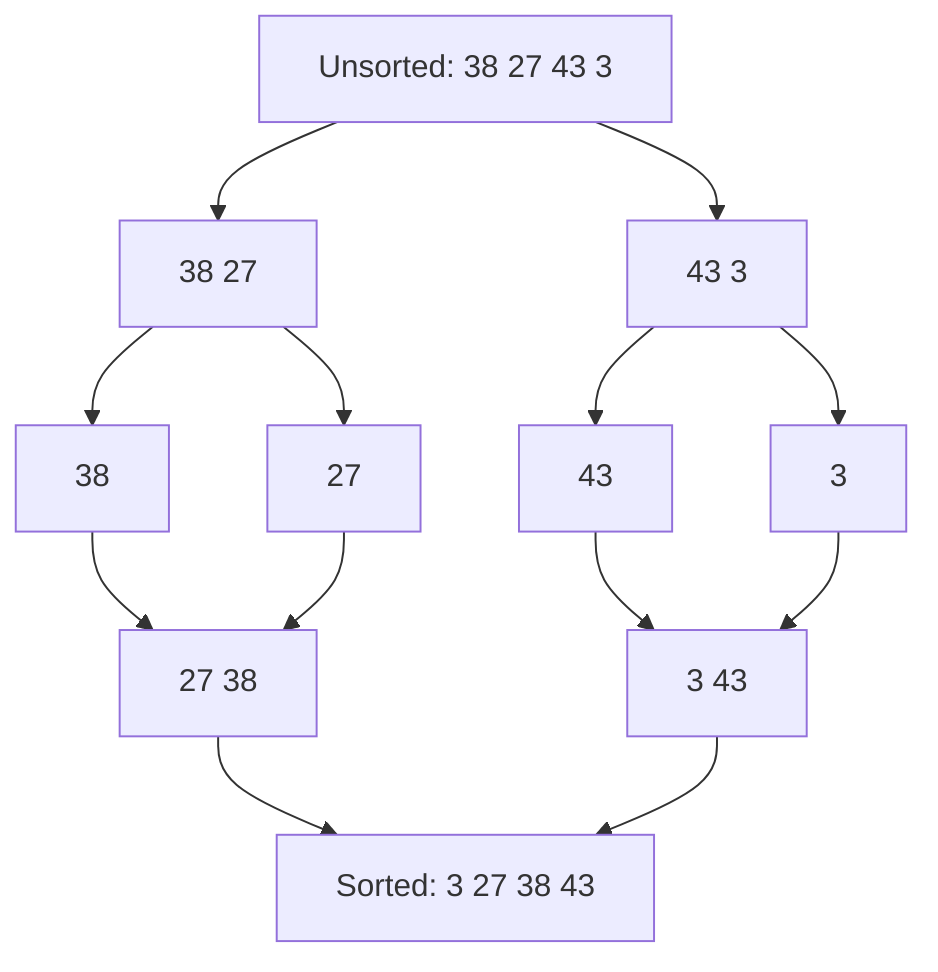
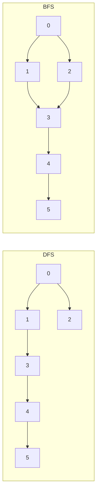

# The Complete Guide to Data Structures and Algorithms in Java

Data Structures and Algorithms (DSA) is the foundation of computer science and technical interviews. Whether you are a student preparing for campus placements, a professional brushing up before an interview, or a developer who wants to write faster and cleaner code, a solid command of the classic algorithms matters more than ever. The source study document I am basing this article on is a compact, exam-oriented cheat sheet that organizes DSA into eight clean buckets: sorting, searching, dynamic programming, graphs, greedy, backtracking, mathematical, and tree algorithms, plus a bonus section on bit manipulation.

Every algorithm in the document is accompanied by a short theory, a step-by-step algorithm, a working **Java** implementation, and a time/space complexity summary. This article restructures that material into a readable walkthrough with visual aids, tables, and real-world context, while sticking strictly to what the source covers.

## Table of Contents

- [What Are Data Structures and Algorithms?](#what-are-data-structures-and-algorithms)
- [Sorting Algorithms](#sorting-algorithms)
- [Searching Algorithms](#searching-algorithms)
- [Dynamic Programming Algorithms](#dynamic-programming-algorithms)
- [Graph Algorithms](#graph-algorithms)
- [Greedy Algorithms](#greedy-algorithms)
- [Backtracking Algorithms](#backtracking-algorithms)
- [Bit Manipulation Algorithms](#bit-manipulation-algorithms)
- [Tree Algorithms](#tree-algorithms)
- [Mathematical Algorithms](#mathematical-algorithms)
- [Putting It All Together: A Real World Example](#putting-it-all-together-a-real-world-example)
- [Key Takeaways](#key-takeaways)
- [Frequently Asked Questions](#frequently-asked-questions)
- [Related Articles](#related-articles)

## What Are Data Structures and Algorithms?

An **algorithm** is a finite, well-defined set of steps used to solve a problem. A **data structure** is the way you organize that data so the algorithm can access it efficiently. The source document groups classic algorithms into these categories:

1. **Sorting Algorithms** – Bubble Sort, Merge Sort, Selection Sort, Insertion Sort, Quick Sort, Heap Sort, Counting Sort
2. **Searching Algorithms** – Linear, Binary, Jump, Interpolation, Exponential, and Ternary Search
3. **Dynamic Programming Algorithms** – Fibonacci, 0/1 Knapsack, Longest Common Subsequence, Longest Increasing Subsequence, Matrix Chain Multiplication, Edit Distance
4. **Graph Algorithms** – DFS, BFS, Dijkstra, Bellman-Ford, Floyd-Warshall, A*, Kruskal, Prim, Tarjan, Kosaraju, Topological Sort, Union-Find, Cycle Detection
5. **Greedy Algorithms** – Activity Selection, Kruskal, Prim
6. **Backtracking Algorithms** – N-Queens, Sudoku Solver
7. **Mathematical Algorithms** – Euclidean GCD, Sieve of Eratosthenes, Modular Exponentiation
8. **Tree Algorithms** – Traversals, BST operations, LCA, AVL Tree

> The source document is a *study cheat sheet*: it covers the theory, steps, code, and complexity of each algorithm, but it does **not** discuss formal proofs, space–time trade-offs in depth, or interview strategy. Anything beyond the listed algorithms is out of scope here.

## Sorting Algorithms

Sorting puts a collection of elements into a defined order and is the most-asked topic in coding assessments. The document covers six comparison-based sorts plus one non-comparison sort.

### Bubble Sort

**Theory.** Bubble Sort repeatedly steps through the list, compares adjacent elements, and swaps them if they are in the wrong order. Smaller elements "bubble" up to the top of the list while larger elements sink to the bottom. The process repeats until no swaps are needed.

**Steps.**
1. Start from the first element and compare it with the next.
2. If the current element is greater than the next, swap them.
3. Move to the next element and repeat for all elements.
4. Keep looping until no swaps happen — the list is then sorted.

```java
public class BubbleSort {
    public static void bubbleSort(int[] arr) {
        int n = arr.length;
        boolean swapped;
        for (int i = 0; i < n - 1; i++) {
            swapped = false;
            for (int j = 0; j < n - i - 1; j++) {
                if (arr[j] > arr[j + 1]) {
                    int temp = arr[j];
                    arr[j] = arr[j + 1];
                    arr[j + 1] = temp;
                    swapped = true;
                }
            }
            if (!swapped) break;
        }
    }
}
```

| Case | Complexity |
|------|-----------|
| Best (already sorted) | O(n) |
| Average | O(n²) |
| Worst | O(n²) |

### Selection Sort

**Theory.** Selection Sort repeatedly finds the smallest element in the unsorted portion of the array and swaps it with the first unsorted element, growing the sorted section one element per pass.

**Steps.**
1. Starting at the first element, scan the array for the minimum.
2. Swap the minimum with the first element.
3. Move to the next position and repeat until the whole array is sorted.

Complexity is **O(n²)** in the best, average, and worst cases.

### Insertion Sort

**Theory.** Insertion Sort builds the final sorted array one element at a time by inserting each element into its correct position among the already-sorted elements. It is much less efficient on large lists than Quick Sort, Heap Sort, or Merge Sort, but it is efficient for **small data sets**.

```java
public class InsertionSort {
    public static void insertionSort(int[] arr) {
        int n = arr.length;
        for (int i = 1; i < n; i++) {
            int key = arr[i];
            int j = i - 1;
            while (j >= 0 && arr[j] > key) {
                arr[j + 1] = arr[j];
                j = j - 1;
            }
            arr[j + 1] = key;
        }
    }
}
```

| Case | Complexity |
|------|-----------|
| Best (already sorted) | O(n) |
| Average | O(n²) |
| Worst | O(n²) |

### Merge Sort

**Theory.** Merge Sort is a **Divide and Conquer** algorithm. It divides the input array into two halves, recursively sorts each half, and then merges the sorted halves back together.



Merge Sort is guaranteed **O(n log n)** in the best, average, and worst cases — a big advantage over quadratic sorts.

### Quick Sort

**Theory.** Quick Sort is an efficient divide-and-conquer sorting algorithm. It selects a **pivot** element and partitions the other elements into two sub-arrays — those less than the pivot and those greater than it — then recursively sorts the sub-arrays.

**Steps.**
1. Choose a pivot (first, last, or random element).
2. Partition so elements smaller than the pivot go left and larger go right.
3. Recursively apply the same process to the left and right sub-arrays.

| Case | Complexity | When it happens |
|------|-----------|-----------------|
| Best | O(n log n) | pivot splits the array into two equal parts |
| Average | O(n log n) | — |
| Worst | O(n²) | extremely unbalanced partition |

### Heap Sort

**Theory.** Heap Sort uses a binary heap. Like Selection Sort it repeatedly picks the maximum element and places it at the end of the array, but a heap lets you find that maximum efficiently.

**Steps.**
1. Build a max-heap from the input data.
2. Remove the largest element (the root) and rebuild the heap.
3. Repeat until the heap is empty.

Heap Sort is **O(n log n)** in all cases.

### Counting Sort

**Theory.** Counting Sort is the **non-comparison-based** algorithm in this list. It counts the occurrences of each unique element, then uses those counts to place elements in their correct sorted positions.

**Steps.**
1. Find the maximum (and minimum) value in the array.
2. Create a count array for each unique value.
3. Compute cumulative counts to determine positions.
4. Build the sorted array from the count array.

| Case | Complexity |
|------|-----------|
| Best | O(n + k) |
| Average | O(n + k) |
| Worst | O(n + k) |

where *k* is the range of the input. Note that Counting Sort is only practical when *k* is small.

## Searching Algorithms

Searching locates a target value inside a collection. The document presents six searches, each with a different precondition and cost profile.

### Linear Search

Linear Search checks every element one by one until the target is found or the array is exhausted. It needs **no sorting** and returns `-1` if the target is absent. Best case is O(1) (target is first), average and worst are O(n).

### Binary Search

Binary Search works **only on sorted arrays**. It repeatedly halves the search interval by comparing the target with the middle element.

```java
public class BinarySearch {
    public static int binarySearch(int[] arr, int target) {
        int low = 0, high = arr.length - 1;
        while (low <= high) {
            int mid = low + (high - low) / 2; // Avoid overflow
            if (arr[mid] == target) return mid;
            else if (arr[mid] < target) low = mid + 1;
            else high = mid - 1;
        }
        return -1;
    }
}
```

Best case is O(1); average and worst are **O(log n)**. The formula `mid = low + (high - low) / 2` is used specifically to avoid integer overflow.

### Jump Search

Jump Search works on sorted arrays. It jumps ahead in fixed blocks of size **√n**, and once it lands in the block that could contain the target, it does a linear search inside that block. Best case O(1); average and worst **O(√n)**.

### Interpolation Search

Interpolation Search is an improved variant of Binary Search for **uniformly distributed data**. Instead of always picking the middle, it estimates the likely position of the target:

```
pos = low + ((target - arr[low]) * (high - low)) / (arr[high] - arr[low])
```

Best case O(1); average **O(log log n)**; worst case O(n).

### Exponential Search

Exponential Search is useful when the **size of the array is not known in advance**. It doubles an index (1, 2, 4, 8, ...) until it finds a value greater than the target, then runs Binary Search inside that range. Best case O(1); average and worst **O(log n)**.

### Ternary Search

Ternary Search is similar to Binary Search but divides the sorted array into **three parts** using two midpoints, `mid1` and `mid2`, then narrows the search to one of the three sections. Best case O(1); average and worst **O(log₃ n)**.

### Searching algorithms at a glance

| Algorithm | Requires sorted input | Average complexity |
|-----------|-----------------------|--------------------|
| Linear Search | No | O(n) |
| Binary Search | Yes | O(log n) |
| Jump Search | Yes | O(√n) |
| Interpolation Search | Yes (uniform data) | O(log log n) |
| Exponential Search | Yes | O(log n) |
| Ternary Search | Yes | O(log₃ n) |

## Dynamic Programming Algorithms

**Dynamic Programming (DP)** solves problems by breaking them into overlapping subproblems, storing the results of each subproblem, and reusing them — instead of recomputing, which is exactly what a naive recursive solution would do.

### Fibonacci Sequence

The Fibonacci sequence is a series where each number is the sum of the two preceding ones, starting from 0 and 1. The DP version stores results in an array:

**Steps.**
1. Use an array to store Fibonacci values.
2. Set base cases: `Fib(0) = 0`, `Fib(1) = 1`.
3. For each next value, compute `Fib(n) = Fib(n-1) + Fib(n-2)` and store it.

Time complexity **O(n)**, space complexity **O(n)**.

### 0/1 Knapsack Problem

Given items with weights and values, maximize the total value without exceeding a weight limit. Each item can be taken at most once. The document builds a 2D table `dp[i][j]` storing the maximum value using the first `i` items under weight limit `j`.

```java
public class KnapsackDP {
    public static int knapsack(int[] weights, int[] values, int capacity) {
        int n = values.length;
        int[][] dp = new int[n + 1][capacity + 1];
        for (int i = 1; i <= n; i++) {
            for (int w = 1; w <= capacity; w++) {
                if (weights[i - 1] <= w) {
                    dp[i][w] = Math.max(values[i - 1] + dp[i - 1][w - weights[i - 1]], dp[i - 1][w]);
                } else {
                    dp[i][w] = dp[i - 1][w];
                }
            }
        }
        return dp[n][capacity];
    }
}
```

Time **O(n × capacity)**, space **O(n × capacity)**.

### Longest Common Subsequence (LCS)

LCS finds the longest subsequence common to two strings. Using `dp[i][j]` to hold the LCS length of the first `i` characters of `X` and first `j` of `Y`:

- If characters match: `dp[i][j] = dp[i-1][j-1] + 1`
- Otherwise: `dp[i][j] = max(dp[i-1][j], dp[i][j-1])`

Time **O(m × n)**, space **O(m × n)**.

### Longest Increasing Subsequence (LIS)

LIS finds the longest subsequence whose elements are in **strictly increasing** order. A 1D `dp[]` array records the longest increasing subsequence ending at each index. Time **O(n²)**, space **O(n)**.

### Matrix Chain Multiplication

This problem finds the most efficient way to multiply a sequence of matrices by choosing the best **parenthesization** to minimize scalar multiplications. It uses a bottom-up 2D table over different split points. Time **O(n³)**, space **O(n²)**.

### Edit Distance (Levenshtein Distance)

Edit Distance is the minimum number of **insertions, deletions, and substitutions** needed to convert one string into another. `dp[i][j]` holds the edit distance between substrings of lengths `i` and `j`; matching characters need no operation, otherwise you take the minimum of insert, delete, and replace. Time **O(m × n)**, space **O(m × n)**.

## Graph Algorithms

A graph is a set of vertices (nodes) connected by edges. Graph algorithms handle traversal, shortest paths, spanning trees, connectivity, and cycle detection. The source covers eleven of them.

### Traversal: DFS and BFS

**Depth First Search (DFS)** explores as far as possible along each branch before backtracking, using a stack (explicitly or via recursion). **Breadth First Search (BFS)** explores all neighbors at the present depth level before moving deeper, using a queue.



Both run in **O(V + E)** time and **O(V)** space, where V is the number of vertices and E is the number of edges.

### Shortest Paths

- **Dijkstra's Algorithm** finds the shortest path from a source to all nodes in a graph with **non-negative** edge weights, using a priority queue to always expand the closest unvisited node. Time **O((V + E) log V)**, space O(V).
- **Bellman-Ford Algorithm** also finds single-source shortest paths but **handles negative edge weights** and can **detect negative-weight cycles**. It relaxes every edge V-1 times, then runs one extra pass to check for negative cycles. Time **O(V × E)**, space O(V).
- **Floyd-Warshall Algorithm** computes **all-pairs** shortest paths. It supports positive or negative weights — but no negative-weight cycles — by checking every intermediate vertex k. Time **O(V³)**, space **O(V²)**.
- **A\* Search** combines Dijkstra's Algorithm with Greedy Best-First Search using a heuristic, making it popular for pathfinding in AI and games. It maintains an open list (nodes to evaluate) and closed list (nodes already evaluated) and picks the node with the lowest `f(n) = g(n) + h(n)`, where `g(n)` is the cost to reach the node and `h(n)` is the heuristic estimate to the goal (the Java example uses Manhattan distance). Time **O(b^d)** and space **O(b^d)**, where b is the branching factor and d is the depth of the solution.

### Minimum Spanning Trees: Kruskal and Prim

A **Minimum Spanning Tree (MST)** connects all vertices of a connected, undirected graph with the minimum total edge weight.

- **Kruskal's Algorithm** sorts all edges by weight and adds them one by one, using **Union-Find** to skip any edge that would form a cycle, until the MST has exactly V-1 edges. Time **O(E log E + V log V)**, space O(V).
- **Prim's Algorithm** starts from a single vertex and repeatedly adds the smallest edge connecting the tree to a vertex outside it. With an adjacency matrix it is **O(V²)**; the priority-queue version is **O(E log V)**.

### Strongly Connected Components: Tarjan and Kosaraju

A **Strongly Connected Component (SCC)** is a maximal set of vertices where every vertex is reachable from every other.

- **Tarjan's Algorithm** runs a single DFS and uses a **low-link value**; when a node's discovery time equals its low-link value, it is the root of an SCC. Time **O(V + E)**, space O(V).
- **Kosaraju's Algorithm** runs **two DFS passes**: the first records finishing times, the second explores the **reversed graph** in order of decreasing finishing times — each pass reveals one SCC. Time **O(V + E)**, space O(V).

### Topological Sorting

Topological Sorting orders the vertices of a **Directed Acyclic Graph (DAG)** so that for every edge u → v, u comes before v. It is computed via DFS, pushing vertices to a stack after their finishing times; the topological order is the reverse of the finishing order. Time **O(V + E)**, space O(V).

### Union-Find (Disjoint Set Union)

Union-Find supports two operations: `find` (which set an element belongs to, using **path compression**) and `union` (merging two sets, using **union by rank**). It is used for cycle detection in graphs and inside Kruskal's algorithm. Each operation is **O(α(n))** — the inverse Ackermann function — which is effectively constant; space is O(n).

### Cycle Detection

- **Undirected graphs:** use DFS — if you reach an already visited node that is **not the parent** of the current node, a cycle exists. Union-Find also works. Time **O(V + E)**, space O(V).
- **Directed graphs:** use DFS with an additional recursion-stack tracking array.

## Greedy Algorithms

A greedy algorithm makes the locally optimal choice at each step, hoping it leads to a globally optimal solution. The source covers three:

1. **Activity Selection Problem** — choose the maximum number of non-overlapping activities by sorting them by **finish time**, selecting the first, then repeatedly picking the next activity that starts after the last selected one finishes. Time **O(n log n)** (sorting), space O(n).
2. **Kruskal's Algorithm** — pick the smallest edge that does not form a cycle.
3. **Prim's Algorithm** — always grow the tree along the cheapest connecting edge.

> Both Kruskal's and Prim's algorithms are greedy, and both happen to be optimal for building a Minimum Spanning Tree — a classic example of where a greedy strategy provably works.

## Backtracking Algorithms

Backtracking incrementally builds candidates and abandons ("backtracks from") a candidate as soon as it is found to be invalid.

### N-Queens Problem

Place N queens on an N×N chessboard so that no two queens threaten each other (no shared row, column, or diagonal).

**Steps.**
1. Place queens one by one in different columns.
2. Check whether the current placement is safe.
3. If safe, recursively place the next queen.
4. Backtrack if placing further queens becomes impossible.

Time **O(N!)** (it explores permutations), space **O(N²)** for the board.

### Sudoku Solver

The Sudoku Solver fills a 9×9 grid so each number 1–9 appears exactly once per row, column, and 3×3 subgrid.

**Steps.**
1. Find an empty cell.
2. Try digits 1 through 9.
3. Check validity (row, column, subgrid).
4. Recursively solve the next cell; backtrack if needed.

Time **O(9^(N²))** where N is the grid size (9), space **O(1)**.

## Bit Manipulation Algorithms

Bit manipulation works directly on binary representations and is extremely fast.

### Counting Set Bits

Count how many 1-bits are in a number by ANDing the least significant bit with `1`, then right-shifting until the number becomes 0. Time **O(log n)**, space **O(1)**.

### Finding the Only Non-Duplicated Element

Given an array where every element appears twice except one, **XOR** all elements together — pairs cancel out, leaving the single unique element. Time **O(n)**, space **O(1)**.

## Tree Algorithms

Trees are hierarchical data structures. The document covers traversals, BST operations, LCA, and self-balancing AVL trees.

### Tree Traversals

Traversals visit every node of a tree in a specific order:

| Traversal | Order | Use case |
|-----------|-------|----------|
| In-order | Left, Root, Right | yields sorted order in a BST |
| Pre-order | Root, Left, Right | copying / serializing a tree |
| Post-order | Left, Right, Root | deleting a tree |

Time **O(n)**, space **O(h)** where h is the height of the tree.

### Binary Search Tree (BST)

A BST is a binary tree where every node's **left subtree holds smaller values** and **right subtree holds larger values**.

- **Insertion** – traverse to the correct position and insert the node.
- **Search** – traverse, moving left or right by comparing values.
- **Deletion** – three cases: the node is a leaf, has one child, or has two children (the hardest case, solved by finding the in-order successor or predecessor).

Insert, search, and delete all run in **O(h)** — which is why balanced trees matter.

### Lowest Common Ancestor (LCA)

The LCA of nodes p and q is the deepest node that has both p and q as descendants. Found recursively: if the current node is p or q, return it; search left and right subtrees; if both sides return non-null, the current node is the LCA. Time **O(n)**, space **O(h)**.

### AVL Tree (Self-Balancing BST)

An AVL Tree keeps the **balance factor** (height difference between left and right subtrees) at most 1 for every node. When a node's balance factor exceeds 1 or drops below -1, **rotations** restore balance — covering four cases: Left-Left, Right-Right, Left-Right, and Right-Left.

- Insertion and deletion are like a BST but update heights and re-balance with rotations.
- Insert/delete: **O(log n)**; each rotation: **O(1)**; space **O(log n)** due to the recursion stack.

## Mathematical Algorithms

### Euclidean Algorithm (GCD)

The GCD of two integers is the largest integer that divides both without remainder. The algorithm relies on the property **GCD(a, b) = GCD(b, a % b)**, repeatedly swapping until b becomes 0. Time **O(log min(a, b))**, space **O(1)**.

### Sieve of Eratosthenes

The Sieve finds all primes up to a limit n. Start with all numbers marked prime, then from 2 mark every multiple as non-prime, moving to the next still-marked number until you have processed numbers up to **√n**. Time **O(n log log n)**, space **O(n)**.

### Modular Exponentiation

Computes `(base^exponent) % mod` efficiently using **exponentiation by squaring**:

**Steps.**
1. If `exponent == 0`, return 1.
2. Recursively compute `base^(exp/2) % mod` and square it.
3. If the exponent is odd, multiply by base once more.

Time **O(log exp)**, space **O(log exp)** for the recursion.

## Putting It All Together: A Real World Example

Say a delivery company needs to route trucks through a city where road segments carry different costs. That is a classic **shortest-path** problem — solved by **Dijkstra's Algorithm** (all costs non-negative) or **Bellman-Ford** (if some roads offer negative tolls or rebates). Along the way:

- The road network is stored as a **graph**, and traversal needs **DFS/BFS** for exploration.
- If the company must connect several warehouses at minimum cable cost, **Kruskal's or Prim's MST** picks the cheapest layout, with **Union-Find** guarding against cycles.
- A logistics planner choosing the most jobs from a fixed schedule uses the **greedy Activity Selection** idea.
- Packaging products with weight and value constraints maps directly to **0/1 Knapsack** (DP).
- Ensuring no circular dependency between services mirrors **Topological Sort** on a DAG and **Cycle Detection**.

This is exactly how the categories reinforce each other: a data structure or algorithmic pattern you study in isolation becomes a building block for larger systems.

## Key Takeaways

- **Sorting** spans O(n²) simple sorts (Bubble, Selection, Insertion), O(n log n) efficient sorts (Merge, Quick, Heap), and the non-comparison Counting Sort at O(n + k) when the value range is small.
- **Searching** costs depend heavily on preconditions: Linear Search is O(n) with no assumptions, while Binary, Jump, Exponential, and Ternary Search require a sorted array and drop to O(log n)-class costs.
- **Dynamic Programming** eliminates redundant recomputation by storing subproblem results — seen in Fibonacci, Knapsack, LCS, LIS, Matrix Chain Multiplication, and Edit Distance.
- **Graph algorithms** cover traversal (DFS/BFS), shortest paths (Dijkstra, Bellman-Ford, Floyd-Warshall, A*), spanning trees (Kruskal, Prim), SCCs (Tarjan, Kosaraju), Topological Sort, and Cycle Detection, all sharing the O(V + E) family of costs for traversal-based methods.
- **Greedy** (Activity Selection, Kruskal, Prim), **Backtracking** (N-Queens, Sudoku), **Bit manipulation** (counting set bits, XOR tricks), and **Tree** algorithms (traversals, BST, LCA, AVL) round out the classic interview toolbox.
- **Complexity analysis is the through-line of the document** — every algorithm is accompanied by explicit time and space bounds, which is what you must be able to justify in interviews.

## Frequently Asked Questions

**What is the difference between Divide and Conquer and Dynamic Programming?**

Divide and Conquer (used by Merge Sort and Quick Sort) splits the problem into independent subproblems and combines their solutions. Dynamic Programming (Fibonacci, Knapsack, LCS) handles **overlapping** subproblems and stores intermediate results to avoid recomputation. The source introduces both approaches under their respective algorithm families.

**When should I use Binary Search instead of Linear Search?**

Use Binary Search when the array is **sorted** — it runs in O(log n) versus Linear Search's O(n). Linear Search requires no preconditions and wins for tiny or unsorted collections. The document notes that best-case Binary Search is O(1) when the target is the middle element.

**Can Bellman-Ford handle negative edge weights, and what is the catch?**

Yes — Bellman-Ford supports negative edge weights, unlike Dijkstra's Algorithm, but it is slower (O(V × E)). It also **detects negative-weight cycles**: if another relaxation pass still improves a distance, a negative cycle exists. This is explicitly covered in the source.

**How do Kruskal and Prim differ even though both find an MST?**

Kruskal sorts all edges and adds the cheapest ones that do not form a cycle (using Union-Find), working edge-by-edge. Prim starts from one vertex and grows the tree by adding the cheapest edge connecting the tree to an outside vertex. Both are greedy and produce an MST, just with different strategies and complexity profiles.

**Which sorting algorithm does the document recommend for small data sets?**

Insertion Sort is described as efficient for small data sets, while being much less efficient on large lists than Quick Sort, Heap Sort, or Merge Sort.

## Related Articles

- [Understanding Time and Space Complexity in Java](./understanding-time-space-complexity-java)
- [Graph Theory for Developers: BFS, DFS, and Shortest Paths](./graph-theory-for-developers)
- [Dynamic Programming Patterns Explained with Java](./dynamic-programming-patterns-java)
