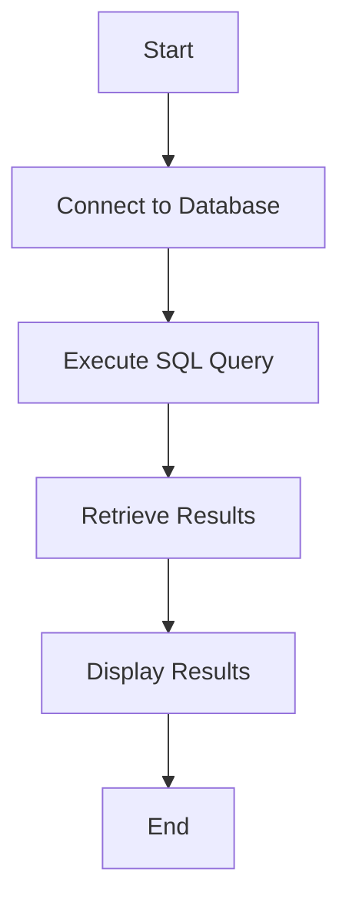

# A Comprehensive Guide to SQL: The Language for Database Communication

*Reading time: 2 min · 410 words*

> SQL (Structured Query Language) is the standard language for communicating with relational database management systems (RDBMS). This guide covers SQL's history, syntax, and key concepts, including sublanguages and practical examples. Learn how to interact with databases effectively using SQL.

## Table of Contents
- [Introduction](#introduction)
- [Key Features of SQL](#key-features-of-sql)
- [SQL Sublanguages](#sql-sublanguages)
  - [Data Definition Language (DDL)](#data-definition-language-ddl)
  - [Data Manipulation Language (DML)](#data-manipulation-language-dml)
  - [Data Query Language (DQL)](#data-query-language-dql)
  - [Data Control Language (DCL)](#data-control-language-dcl)
  - [Transaction Control Language (TCL)](#transaction-control-language-tcl)
- [SQL Syntax Example](#sql-syntax-example)
- [Mermaid Diagram: SQL Workflow](#mermaid-diagram-sql-workflow)
- [Real-World Example](#real-world-example)
- [Conclusion](#conclusion)

## Introduction
SQL (Structured Query Language) is a non-procedural language introduced by IBM in the 1970s. It is used to communicate with relational database management systems (RDBMS) and is also referred to as Sequel or Structured English Query Language (SEQUEL).

## Key Features of SQL
- **Non-Procedural Language**: SQL allows users to specify what data to retrieve or manipulate without specifying how to do it.
- **Case Insensitivity**: SQL is case-insensitive, meaning `SELECT` and `select` are treated the same.
- **Semicolon Optional**: While semicolons terminate SQL statements, they are optional in many implementations.

## SQL Sublanguages
SQL is divided into several sublanguages, each serving a specific purpose:

### Data Definition Language (DDL)
DDL is used to define and modify database structures. Key commands include:
- `CREATE`: Defines new database objects like tables.
- `ALTER`: Modifies existing database objects.
- `DROP`: Deletes database objects.
- `RENAME`: Renames database objects.

### Data Manipulation Language (DML)
DML is used to manipulate data within database tables. Key commands include:
- `INSERT`: Adds new records to a table.
- `UPDATE`: Modifies existing records.
- `DELETE`: Removes records from a table.

### Data Query Language (DQL)
DQL is used to retrieve data from databases. The primary command is:
- `SELECT`: Retrieves data from one or more tables.

### Data Control Language (DCL)
DCL is used to control access to data. Key commands include:
- `GRANT`: Grants permissions to users.
- `REVOKE`: Revokes permissions from users.

### Transaction Control Language (TCL)
TCL is used to manage transactions within a database. Key commands include:
- `COMMIT`: Saves changes made during a transaction.
- `ROLLBACK`: Reverts changes made during a transaction.

## SQL Syntax Example
Here’s an example of a basic SQL query:
```sql
SELECT first_name, last_name FROM employees WHERE department = 'Sales';
```

## Mermaid Diagram: SQL Workflow


> **Note**: SQL is a powerful language, but improper use of commands like `DROP` or `DELETE` can lead to data loss. Always double-check queries before execution.

## Real-World Example
Consider an e-commerce database. To retrieve all orders placed by a specific customer, you might use:
```sql
SELECT order_id, order_date, total_amount FROM orders WHERE customer_id = 12345;
```

## Conclusion
SQL is an essential tool for interacting with relational databases. By mastering its sublanguages and syntax, you can efficiently manage and query data in any RDBMS.

## Frequently Asked Questions

**Q: Is SQL case-sensitive?**

A: No, SQL is case-insensitive, but it’s good practice to use consistent casing for readability.

**Q: What is the difference between DDL and DML?**

A: DDL is used to define database structures, while DML is used to manipulate data within those structures.

**Q: Can I use SQL with non-relational databases?**

A: SQL is primarily designed for relational databases, but some NoSQL databases offer SQL-like query languages.

**Q: What is the purpose of the `SELECT` statement?**

A: The `SELECT` statement retrieves data from one or more tables in a database.

**Q: How do I revert changes made during a transaction?**

A: Use the `ROLLBACK` command to revert changes made during a transaction.

## Key Takeaways

- SQL is the standard language for communicating with relational databases.
- SQL is divided into sublanguages: DDL, DML, DQL, DCL, and TCL.
- SQL is case-insensitive, and semicolons are optional in many implementations.
- Use caution with commands like `DROP` and `DELETE` to avoid data loss.
- Mastering SQL syntax and sublanguages is essential for effective database management.

## Related Articles

- Database Normalization
- SQL Joins

<!-- Cover image prompts (for editors):
  - A flowchart illustrating the SQL query execution process
  - A diagram showing the relationship between SQL sublanguages
  - A screenshot of a SQL query retrieving data from a database
  - A visual representation of a relational database structure
-->