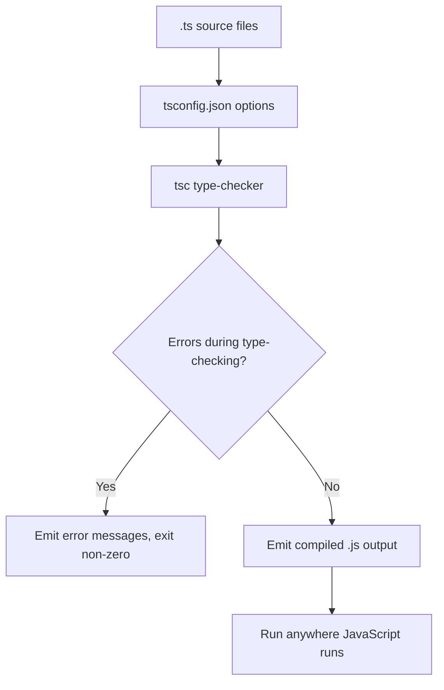

# Mastering TypeScript: The Bridge to Safer, Scalable JavaScript

JavaScript powers most of the modern web, but its dynamic, loosely typed nature is a double-edged sword. A theme typo in a config object or an unexpected `undefined` can crash an app at runtime—hours after the code shipped. TypeScript exists to move that detection earlier: from production servers back into your editor and your compile step.

TypeScript is a language and compiler built by Microsoft that layers a static type system on top of JavaScript. It is not a different runtime—your TypeScript code is transpiled to clean, standard JavaScript that runs anywhere JavaScript does. This guide walks you through why TypeScript is the default choice for serious web development in 2026, how its type system works, and how to use it effectively in real projects.

> **Note:** TypeScript is a *typed superset* of JavaScript. Everything that is valid JavaScript is also valid TypeScript, which is exactly why you can adopt it gradually on an existing codebase—file by file, function by function.

## Table of Contents
- [Why TypeScript? The Case for Static Typing](#why-typescript-the-case-for-static-typing)
- [Core Type System Fundamentals](#core-type-system-fundamentals)
- [Understanding the TypeScript Compiler](#understanding-the-typescript-compiler)
- [Advanced Patterns for Real Projects](#advanced-patterns-for-real-projects)

## Why TypeScript? The Case for Static Typing

The phrase "static type checking" can sound like bureaucracy, but it is better described as **documentation that the computer verifies for you**. When you annotate the parameters of a function, the editor and compiler enforce those contracts everywhere the function is used.

Consider a function that formats a price:

```ts
function formatPrice(value) {
  return `$${value.toFixed(2)}`;
}

formatPrice("49.99"); // Runtime error: value.toFixed is not a function
```

In plain JavaScript, the bug above surfaces only when the line executes. With types:

```ts
function formatPrice(value: number): string {
  return `$${value.toFixed(2)}`;
}

formatPrice("49.99"); // Compile error: Argument of type 'string' is not assignable to parameter of type 'number'.
```

It becomes impossible to miss this mistake even before running a test. This single property delivers benefits that compound across a codebase:

- **Earlier bug detection** — a large class of errors are caught during editing, not production.
- **Better editor experience** — autocomplete, jump-to-definition, and inline type hints free IntelliSense.
- **Self-documenting code** — the type signature is a contract that never drifts from reality.
- **Refactoring confidence** — renaming or reshaping a data model highlights every affected call site.
- **Easier onboarding** — newcomers can trust the shapes of data being passed around.

TypeScript has consistently ranked among the most-adopted, most-loved languages for developers. Its openness—being an open-source project with no vendor lock-in—has made it the default for React, Node.js, and even Deno and Bun runtimes.

## Core Type System Fundamentals

Let's build up the type system from first principles. You do not need to know everything at once; you need a strong mental model of the *core* tools.

### Primitive and Structural Types

The basic building blocks are `string`, `number`, `boolean`, `null`, `undefined`, `symbol`, and `bigint`:

```ts
let name: string = "Ada";
let lines: number = 42;
let enabled: boolean = true;
let maybeEmpty: string | null = null; // union type
```

For collections and object shapes, TypeScript relies on **structural typing** (also called duck typing). If an object has the right shape, it type-checks:

```ts
type User = {
  id: number;
  name: string;
  email?: string; // the property is optional
};

const admin = { id: 1, name: "Grace", email: "g@x.dev" };
const u: User = admin; // valid: matches the shape
```

### Interfaces vs. Type Aliases

Two features let you define named object shapes: `interface` and `type`. For most cases they behave identically; the practical differences are that `interface` can be *extended and merged, while `type` can express primitives, unions, tuples, and intersections.

| Feature | `interface` | `type` |
| ------------- | ------------ | -------- |
| Declare objects/classes | ✅ Use this | ✅ Also works |
| Define unions and tuples | ❌ No | ✅ Preferred |
| Extend other shapes | ✅ Classic use case | ✅ With intersection |
| Declaration merging | ✅ Supported | ❌ Impossible |

```ts
interface Animal {
  name: string;
}
interface Dog extends Animal {
  breed: string;
}

type Status = "active" | "inactive"; // union of literals
type Pair = [string, number];        // tuple
```

### Functions and Their Signatures

Typed functions declare parameter and return types:

```ts
type Greeter = (name: string) => string;
const greet: Greeter = (name) => "Hello, " + name;
```

Optional and default parameters, rest parameters, and function overloading are all supported. TypeScript infers the return type when you don't annotate it—though explicit annotations often read clearer.

### Generics: The Power Tool

Generics let you build reusable components that work over many types while preserving information about those types:

```ts
function identity<T>(value: T): T {
  return value;
}
const n = identity<number>(42);   // T === number
const s = identity("hi");          // T is inferred as string
```

Generics shine for robust data structures like an `Array`, `Promise`, or `Map`, which all depend on the generic type parameters.

```ts
function findFirst<T>(items: T[], predicate: (item: T) => boolean): T | undefined {
  return items.find(predicate);
}
```

## Understanding the TypeScript Compiler

TypeScript ships with `tsc`—the TypeScript compiler—which is configured through a `tsconfig.json` file at the project root. The compiler does two related jobs: **type-checking** and **emitting** JavaScript output.



The diagram shows the core loop: the checker validates the entire program, and only on success—or at least according to the emit settings—does it produce the JavaScript target.

### The Essential `tsconfig.json`

Here is a widely used, pragmatic starting point:

```json
{
  "compilerOptions": {
    "target": "ES2020",       // which JS version to output
    "module": "ESNext",       // which module system to emit
    "strict": true,           // enable the full strict-mode family
    "outDir": "./dist",
    "rootDir": "./src",
    "esModuleInterop": true,  // smooth CommonJS/ESM interoperability
    "skipLibCheck": true      // skip checking of .d.ts library files
  },
  "include": ["src"]
}
```

#### The `strict` flag family

`{"strict": true}` is the single highest-leverage option. It activates a family of strict checks, including:

- **`strictNullChecks`** — `null` and `undefined` must be handled explicitly, the source of countless bugs.
- **`noImplicitAny`** — parameters and variables must have a type; no silent `any`.
- **`strictFunctionTypes`** — stram function-parameter type checks.
- **`strictPropertyInitialization`** — class properties must be initialized or clearly optional.

> **Caution:** running a legacy JavaScript codebase, enabling `strict` all at once can overwhelm you with thousands of errors. Start with `strictNullChecks` alone, then enable the others slowly once the code is clean.

## Advanced Patterns for Real Projects

As soon as your codebase grows beyond toy examples, you reach for features that unify flexibility and safety.

### Union & Discriminated Unions

A *discriminated union* uses a special `kind` field to model state that has clearly distinguished shapes. This turns manual `if` checks into exhaustive, compiler-checked logic:

```ts
// Before: dealing with untyped 'data' using a string literal switch
type Result = {
  ok: boolean;
  data?: unknown; // the compiler can narrow this further
};
```

With a *type guard* the same branch narrows the type across the union:

```ts
function getLength(value: string | number): number {
  // TypeScript narrows 'value' inside the if-block
  return typeof value === "string" ? value.length : value;
}
```

### Utility Types (Pick, Omit, Partial, Readonly)

TypeScript ships with built-in mapped types that transform shapes:

```ts
type User = { id: number; name: string; email: string };

type PublicProfile = Omit<User, "email">;          // leave out a key
type Updater = Partial<User>;                       // every field optional
type ReadonlyUser = Readonly<User>;                 // every field readonly
type NameOnly = Pick<User, "id" | "name">;          // select specific keys
```

These utility types appear in almost every codebase and reduce repetitive annotation.

### Conditional Types and Type Guards

Conditional types let you express type-level decision in a mapped way (`type`, `extends` becomes a check). For the vast majority of projects, the more useful everyday practice is writing a **type guard** helper:

```ts
function isStringArray(value: unknown): value is string[] {
  return Array.isArray(value) && value.every((item) => typeof item === "string");
}
```

`value is string[]` tells the compiler that a `true` result proves `value` is a `string[]`, letting your code avoid repeated unsafe casts.

## Real-World Example: A Typed User Management Module

Let's pull everything together with a small but realistic example—a repository that fetches users and exposes helpers. Notice how the types and the runtime code interlock.

```ts
type User = { id: number; name: string; email: string; role: "admin" | "viewer" };

// A repository with explicit method signatures
class UserRepo {
  async findByEmail(email: string): Promise<User | null> {
    // ...fetch from database...
    return null;
  }

  list(): User[] {
    return [
      { id: 1, name: "Grace", email: "grace@dev.io", role: "admin" },
      { id: 2, name: "Linus", email: "linus@dev.io", role: "viewer" },
    ];
  }
}

// A discriminated-union result for cleaner error handling
type Result =
  | { kind: "success"; data: string }
  | { kind: "failure"; reason: Error };

function mapUser(user: User | undefined): Result {
  if (!user) {
    return { kind: "failure", reason: new Error("User not found") };
  }
  return { kind: "success", data: `Found ${user.name}` };
}

const repo = new UserRepo();
const admin = repo.list().find((u) => u.id === 1);
consolotable.log(mapData(admin));
```

> **Warning:** the snippet above contains a deliberate typo—`consolotable` instead of `console`. This is the exact class of bug that the editor and language server catch the moment you type it, because `console` (and a handful of type-checked globals) are part of the standard library types.

## Migrating to TypeScript: Practical Advice

Porting an existing JavaScript project to TypeScript is a pragmatic, gradual process:

1. **Rename to `.ts`** and run the compiler with `strict: false` and `allowJs: true` to get instant value.
2. **Write `.d.ts`** declaration files for the modules that still lack types, so you don't need `any` everywhere.
3. **Enable strictness progressively** — start with `strictNullChecks`, then the rest of the strict family.
4. **Let the compiler find the $unknowns**, then fix the code rather than annotating them as `any`.
5. **Add editor tooling** — Visual Studio Code detects `.tsconfig`; run `npx tsc --noEmit` in CI so the type-checking happens far before deployment that the user's source.

## Key Takeaways

- TypeScript is a strict, statically typed superset of JavaScript—every valid .js file is valid .ts, allowing incremental adoption.
- The **send of the type system catches a large class of errors in the editor** before they reach a running to production.
- Structural typing plus fundamental concepts like unions, generics, and utility types (`Pick`, `Omit`, `Partial`) power clear self-documenting models.
- A well-tuned `tsconfig.json`—especially the `strict` family—elevates compiler meaning, but adopt strictness progressively on legacy code.
- Real value comes from typed function signatures and discriminated unions that make state exhaustive, straightforward, and safe.
- TypeScript runs everywhere JavaScript runs: browsers, Node.js, Deno, and Bun, so learning it is future-proof.

## Frequently Asked Questions

**Is TypeScript a different language from JavaScript?**
No. It is a superset that compiles down to JavaScript. You write more code, but the compiler emits standard, runtime-agnostic JavaScript.

**How do I install TypeScript?**
Run `npm install -g typescript` (or use `npx tsc`) to get the compiler, then set up a `tsconfig.json` with your options.

**What does `strict: true` do?**
It activates a family of strict checks such as `strictNullChecks`, `noImplicitAny`, and `strictFunctionTypes`, which eliminate the majority of `null`/`undefined` and implicit `any` bugs.

**Do I need to convert my whole project at once?**
No. TypeScript is designed for gradual migration—rename files, add types, then enable strictness slowly; `allowJs: true` and `any` act as escape hatches during the transition.

**Can I call TypeScript to use web APIs, DOM, and Node.js?**
Yes. TypeScript visual checks a richly typed library of standard JavaScript runtime and DOM instructions through `@types` packages.

## Related Articles

- [The Comprehensive Guide to DevOps: Principles, Practices, and Tools](#)
- [System Design Handbook: A Practical Guide to Scalable Architectures](#)
- [Mastering Docker: A Complete Guide to Containers, Networking, Storage and Security](#)