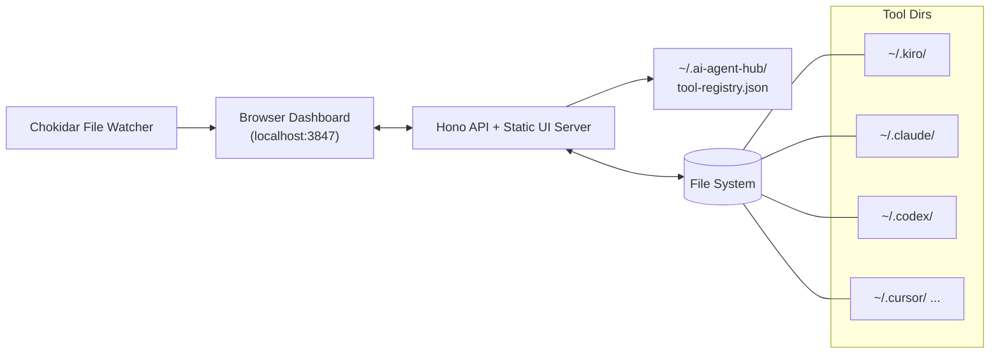

# AI Agent Hub — One Local Dashboard to Rule All Your AI Coding Tools

If you've used more than one AI coding assistant in the past year, you already know the pain. Your agents live in `~/.kiro/agents`, your Claude Code rules in `~/.claude/`, your Codex config in `~/.codex/`, and your MCP servers are scattered in JSON and TOML files across half a dozen dot-directories. Each tool has its own format, its own editor workflow, and its own silent conventions that are painful to learn twice.

**AI Agent Hub** is an open-source, MIT-licensed answer to that sprawl: a small local web dashboard that manages, creates, edits, and deletes AI coding agents across many tools from a single interface — and, crucially, it detects what's installed on your machine automatically. Run the server, and it finds what's there.

## Table of Contents

- [The Problem: Fragmented Agent Workspaces](#the-problem-fragmented-agent-workspaces)
- [What AI Agent Hub Does](#what-ai-agent-hub-does)
- [Key Features](#key-features)
- [Supported Tools at a Glance](#supported-tools-at-a-glance)
- [How Detection Works](#how-detection-works)
- [Architecture](#architecture)
- [Tech Stack](#tech-stack)
- [API Overview](#api-overview)
- [Getting Started](#getting-started)
- [Extending: Adding a New Tool](#extending-adding-a-new-tool)
- [Key Takeaways](#key-takeaways)
- [Frequently Asked Questions](#frequently-asked-questions)

## The Problem: Fragmented Agent Workspaces

Every AI coding tool follows roughly the same shape: per-user dot-directories, a config file, a folder of "rules" or "steering" documents, an MCP config, sometimes an agents folder, and session history. But the *details* are completely different.

- Kiro keeps agents as JSON under `~/.kiro/agents` and steering rules as Markdown.
- Claude Code expects Markdown rules but a JSON MCP config.
- Codex (OpenAI) lives in a `config.toml`.
- Cursor, Windsurf, and Cline each have their own flavors of config.

None of these tools know about the others. So anyone working across Kiro, Claude Code, and Codex ends up context-switching between three CLIs, three config syntaxes, and three mental models — just to keep a consistent setup.

> AI Agent Hub is a unifying layer, not a replacement. It never installs or modifies the tools themselves; it reads and writes the same files those tools use, in the same formats, so you can keep using Claude Code, Kiro, or Codex directly while managing them from one place.

## What AI Agent Hub Does

AI Agent Hub is a local web dashboard that gives you a single panel for:

- **Managing agents** — create, read, update, and delete agent definitions for tools that support them (Kiro, GitHub Copilot, Roo Code, Kibitz, and friends).
- **Editing rules and steering files** — including the Markdown rulepacks that shape model behavior.
- **Tuning MCP configs** — connect, edit, and verify the Model Context Protocol servers each tool uses.
- **Reading and writing tool configs** — JSON, TOML, YAML, and INI files without hunting down their paths.
- **Browsing sessions** — resume old conversations (`kiro-cli chat --resume {id}`, for example) without leaving the dashboard.
- **Health-checking everything** — an overview page that reports detected tools, enabled tools, and stats at a glance.

Under the hood it's a Hono HTTP server that serves a built React UI, plus a set of utility routes that wrap read/write operations against the tool files themselves.

## Key Features

The feature list is where this project gets interesting. A few highlights:

- **Layered auto-discovery** — the hub doesn't just check a fixed list. It scans your home directory for agent config folders, probes for CLI binaries on `PATH`, and finds AI tools installed anywhere on the machine.
- **Fully dynamic dashboard** — the sidebar, dashboard stats, Sessions, MCP health, and the universal editors all derive from what's *actually detected*. If a tool isn't on disk, it isn't listed.
- **Known + heuristic detection** — ~20 known tool signatures are recognized out of the box (by config path or CLI binary), and a heuristic scan auto-finds unknown tools from their config markers.
- **Refine & manage** — rename, recolor, edit paths/features/formats, enable/disable, ignore auto-found folders, or register your own tool from the Settings page.
- **Universal settings** — enable/disable tools and configure custom paths via `/api/overview/settings`.
- **Live editing** — a Monaco editor (the VS Code engine) for JSON, TOML, and Markdown.
- **CRUD operations** — create, read, update, and delete agents, rules, and configs across tools.
- **Live reload** — a file watcher detects external changes and keeps the UI in sync.
- **Dark theme** — easy on the eyes.

## Supported Tools at a Glance

Sixteen known tool signatures ship out of the box, each declaring its own config path, file formats, and managed features. The ✓ marks show which features the hub manages per tool:

| Tool | Agents | Rules | MCP | Config | Plugins | Sessions |
|------|:------:|:-----:|:---:|:------:|:-------:|:--------:|
| **Kiro** | ✓ | ✓ | ✓ | ✓ | — | ✓ |
| **Claude Code** | — | ✓ | ✓ | ✓ | ✓ | ✓ |
| **Codex (OpenAI)** | — | — | ✓ | ✓ | ✓ | ✓ |
| **Cursor** | — | ✓ | ✓ | ✓ | ✓ | — |
| **Windsurf** | — | ✓ | ✓ | ✓ | — | — |
| **Aider** | — | — | — | ✓ | — | — |
| **Continue.dev** | — | — | ✓ | ✓ | ✓ | ✓ |
| **GitHub Copilot** | ✓ | ✓ | — | ✓ | — | — |
| **Cline** | — | ✓ | ✓ | ✓ | — | ✓ |
| **Amazon Q** | — | — | ✓ | ✓ | — | — |
| **Gemini CLI** | — | — | ✓ | ✓ | — | ✓ |
| **OpenCode** | — | ✓ | ✓ | ✓ | — | ✓ |
| **Qwen Code** | — | — | ✓ | ✓ | — | ✓ |
| **DeepSeek CLI** | — | — | ✓ | ✓ | — | — |
| **Roo Code** | ✓ | ✓ | ✓ | ✓ | — | — |
| **Kibitz** | ✓ | ✓ | ✓ | ✓ | — | — |

On top of those, the heuristic scan catches any other AI tool config folder in your home directory — future or niche agents get auto-added with best-guess configs. Those auto-found tools can be renamed, recolored, and edited from the Settings page.

## How Detection Works

Detection is the heart of the project, and it's deliberately layered so that every tool has multiple chances to be found:

1. **Known signatures** — each known tool declares its config path, file formats, and features. It's detected when the path exists (primary) *or* when the CLI binary is on `PATH` (secondary fallback).
2. **Heuristic scan** — dot-folders in the home directory that carry agent markers (`agents/`, `rules/`, `steering/`, `mcp.json`, `config.yaml`/`config.toml`, session dirs, chat DBs) are auto-added as tools with best-guess configs and marked **Auto-found**.
3. **Manual refine** — the Settings page lets you fix paths, formats, and features for any tool, ignore false positives, or register a tool the scanner missed.

Every result is persisted to `~/.ai-agent-hub/tool-registry.json`, and every dashboard surface — the sidebar, dashboard, sessions, MCP health, and stats — derives from that detected set. Because preferences live in your own dot-directory, your layout and overrides are local and portable across a `~/.ai-agent-hub/` backup.

## Architecture

The system is a classic two-tier local web app: a browser front-end talking to a Hono API that reads and writes the tool files directly on your local file system.



The flow is straightforward: the browser makes REST calls to Hono routes like `/api/kiro/agents` or `/api/overview/settings`, the server resolves the request against the tool registry to locate the right files, and reads or writes them in the tool's native format. A Chokidar-based watcher picks up external changes so the UI stays current even when you edit files directly.

## Tech Stack

The project mixes a light Node backend with a modern React front-end:

| Layer | Technology |
|-------|------------|
| **Runtime** | Node.js (npm package) or Bun (single-file binary / dev) |
| **Backend** | Hono (with `@hono/node-server`) |
| **Frontend** | React 19 + Vite 8 + Tailwind CSS v4 |
| **Editor** | Monaco (`@monaco-editor/react`) |
| **State** | TanStack React Query |
| **3D dashboard** | React Three Fiber + drei + three |
| **File watching** | Chokidar |
| **Routing** | React Router |
| **Icons** | lucide-react |
| **Linting** | oxlint |

The workspace is split into a `server` and `client` package under a Bun workspace monorepo, with `package.json` scripts like `dev`, `dev:server`, and `dev:client`. The server builds to a single `server/dist/index.js` that can be published to npm or bundled into a standalone binary via the `scripts/build-binary.ts` script.

## API Overview

The REST surface is organized by tool, with a set of hub-level and utility routes:

| Endpoint | Description |
|----------|-------------|
| `GET /api/overview` | Stats for all enabled tools |
| `GET /api/overview/detect` | Auto-detect installed tools |
| `GET/PUT /api/overview/settings` | Hub settings (enable/disable tools) |
| `GET/POST/PUT/DELETE /api/kiro/agents` | Kiro agent CRUD |
| `GET/PUT /api/kiro/steering/:name` | Kiro steering files |
| `GET/PUT /api/kiro/mcp` | Kiro MCP config |
| `GET /api/kiro/kb` | Knowledge base browser |
| `GET/POST/PUT/DELETE /api/claude/rules` | Claude rules CRUD |
| `GET/PUT /api/claude/mcp` | Claude MCP config |
| `GET /api/claude/models` | Claude available models |
| `GET/PUT /api/codex/config` | Codex `config.toml` |
| `GET /api/codex/mcp` | Codex MCP servers |

Route files for automation, backup, comparison, convert, export, health, insights, projects, safety, search, sessions, sharing, sync, templates, universal, and validate round out the utilities — confirming the dashboard is far more than a config editor; it doubles as a backup, comparison, and safety/validation toolkit for your tooling.

## Getting Started

There are three supported ways to run AI Agent Hub.

### Option 1 — npm (recommended)

```bash
npx ai-agents-hub              # run without installing
# or install globally:
npm install -g ai-agents-hub
ai-agent-hub
```

Then open `http://localhost:3847`.

### Option 2 — single-file binary

Grab `ai-agent-hub` (Linux/macOS) from the GitHub releases page — one self-contained executable with no Node, npm, or Bun required:

```bash
./ai-agent-hub            # serves the dashboard at http://localhost:3847
./ai-agent-hub --port 9000 --open
```

### Option 3 — from source (dev)

```bash
# Install dependencies
cd server && bun install
cd ../client && bun install

# Run both (in separate terminals)
cd server && bun run dev    # → http://localhost:3847
cd client && bun run dev    # → http://localhost:5173
```

### CLI options

```
ai-agent-hub [--port <number>] [--host <name>] [--open] [--help]
```

- `--port` — listen port (default: `3847`)
- `--host` — bind host (default: `localhost`)
- `--open` — open the dashboard in your browser

Everything the hub stores (the tool registry, preferences, backups) is kept locally under `~/.ai-agent-hub/`. No cloud accounts, no telemetry, no syncing — your agent configs stay yours.

> **Caution:** AI Agent Hub writes directly to the configuration files your AI tools load on startup. It's a good idea to back up `~/.ai-agent-hub/` and keep your tool config folders under version control before bulk-editing — the built-in backup tooling and the validate/safety routes exist precisely to help you stay safe.

## Extending: Adding a New Tool

New tools are auto-discovered, but if you want a first-class signature with known formats, colors, and a session resume command, the path is simple:

1. Add an entry to `KNOWN_TOOL_SIGNATURES` in `server/src/universal-registry.ts`.
2. Refine paths/features live from the Settings page (stored as overrides).
3. No route or page files are needed — the universal read/write engine handles everything.

That last point is the architectural payoff: because features are declared as data (via the `UniversalTool` interface with its `features`, `paths`, and `fileFormats` maps), the same Monaco-backed editors and CRUD routes work for any tool without writing tool-specific code. The universal registry also powers the "Universal Tool" page that manages whatever is detected.

## Key Takeaways

- **AI Agent Hub is a local, MIT-licensed dashboard** that unifies management of agents, rules, MCP configs, and sessions across 16+ known AI coding tools — with zero cloud dependency.
- **Detection is layered**: known signatures, CLI-binary probing on `PATH`, and a heuristic home-directory scan all feed a single tool registry persisted to `~/.ai-agent-hub/tool-registry.json`.
- **The universal read/write engine is the extensibility win** — adding a new tool is a data entry in `KNOWN_TOOL_SIGNATURES`, not a new page or route.
- **The tech stack is modern and pragmatic**: Hono on the backend, React 19 + Vite + Tailwind v4 + Monaco on the frontend, Chokidar for live reload, and TanStack Query for state.
- **It ships three ways to run**: `npx ai-agents-hub`, a standalone binary from releases, or a Bun/source dev setup.
- **The dashboard doubles as a toolbox** — with backup, comparison, validation, safety, search, and export routes on top of the core CRUD functionality.

## Frequently Asked Questions

**Does AI Agent Hub modify or install my AI tools?**
No. It's a management layer that reads and writes the same config files the tools use natively, in their original formats (JSON, TOML, YAML, Markdown). It doesn't install agents or replace the tools themselves.

**Is any data sent to the cloud?**
No. Everything runs locally, and persisted state (tool registry, preferences, backups) lives in `~/.ai-agent-hub/` on your own machine.

**What if my AI tool isn't in the known list?**
The heuristic scan auto-detects any dot-folder with agent markers (`agents/`, `rules/`, `steering/`, `mcp.json`, config files, session dirs) and adds it as an Auto-found tool. You can then refine paths, formats, and features from the Settings page.

**Which runtime do I need?**
The npm package runs on Node.js `>= 18`. The dev workflow and the single-file binary are built with Bun, but the packaged binary itself needs no Node, npm, or Bun installed.

**How do I get first-class support for a new tool?**
Add an entry to `KNOWN_TOOL_SIGNATURES` in `server/src/universal-registry.ts`; the universal read/write engine and dynamic dashboard pick it up without new pages or routes.
