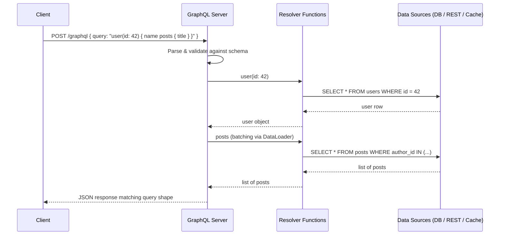

# Mastering GraphQL: A Practical Guide to Flexible, Type-Safe APIs

Modern applications talk to their backends through APIs, and for more than a decade the default conversation style has been REST. REST works, but it comes with real pain points: clients often receive far more data than they need (over-fetching), or they must make several round trips to assemble one screen (under-fetching). As two decades ago, a new player entered the conversation — **GraphQL** — and changed how many teams design the boundary between client and server.


GraphQL is not a database technology, and it is not an offshoot of REST. It is a *query language* and a *runtime* that lets a client ask for exactly the data it needs — nothing more, nothing less — through a single endpoint. Originally created at Facebook in 2012 to power the mobile News Feed and released as open source in 2015, GraphQL is now maintained by the GraphQL Foundation and backed by an open specification (spec.graphql.org) with implementations in nearly every mainstream language.

In this guide you will learn how GraphQL thinks, how to model data with a schema, how queries, mutations, and subscriptions work, how resolvers connect your schema to real data sources, and when — and when not — to choose GraphQL for your next project.


## Table of Contents

- [What Is GraphQL?](#what-is-graphql)
- [GraphQL vs REST: The Core Differences](#graphql-vs-rest-the-core-differences)
- [The Building Blocks of a GraphQL API](#the-building-blocks-of-a-graphql-api)
  - [The Schema](#the-schema)
  - [Queries, Mutations, and Subscriptions](#queries-mutations-and-subscriptions)
  - [Resolvers: Functions That Return Data](#resolvers-functions-that-return-data)
- [Writing and Executing Queries](#writing-and-executing-queries)
- [Mutations: Writing Data Through GraphQL](#mutations-writing-data-through-graphql)
- [Subscriptions: Real-Time Data Push](#subscriptions-real-time-data-push)
- [GraphQL in the Real World: A Mobile App Example](#graphql-in-the-real-world-a-mobile-app-example)
- [Performance, Batching, and the N+1 Problem](#performance-batching-and-the-n1-problem)
- [Security Considerations](#security-considerations)
- [GraphQL vs REST: How to Choose](#graphql-vs-rest-how-to-choose)
- [Key Takeaways](#key-takeaways)
- [Frequently Asked Questions](#frequently-asked-questions)
- [Related Articles](#related-articles)

## What Is GraphQL?

At its core, GraphQL is two things:

1. **A query language** — a syntax clients use to describe the shape of the data they want back. The client writes *what* it needs, and the server responds with a payload that mirrors the request structure.
2. **A runtime** — the server-side engine that interprets that query against a **schema** and executes it, walking the data graph field by field until every requested piece of data is produced.

The defining trait is the **single endpoint**. Where a REST API exposes many URLs (`/users`, `/users/1/posts`, `/users/1/posts/1/comments`), a GraphQL API exposes one (usually `/graphql`), and every operation — reading, writing, subscribing — arrives as a typed document delivered over HTTP, typically as a `POST` request whose body contains the query, its variables, and the operation name.

> **Important note:** GraphQL is transport-agnostic in principle — the specification only defines the language, execution semantics, and response format. In practice it is almost universally served over HTTP, and while the spec defines a standard JSON response, features such as automatic HTTP caching that REST developers take for granted do **not** come for free. We will revisit this in the performance section.

## GraphQL vs REST: The Core Differences

The clearest way to understand GraphQL is to contrast it with REST. Where REST treats the API as a collection of *resources accessed by URL*, GraphQL treats it as a single *graph of typed objects* traversed by the client.

| Aspect | REST | GraphQL |
| --- | --- | --- |
| Endpoints | Many, one per resource | One, typically `/graphql` |
| Data shape | Fixed by the server per endpoint | Decided by the client per request |
| Over-fetching | Common (fixed payloads) | Avoided (fields are explicit) |
| Under-fetching | Common (multiple round trips) | Avoided (single query can nest resources) |
| Contract | Implicit, documented ad hoc | Strongly typed schema, machine-readable |
| Versioning | Common (`/v1`, `/v2`) | Usually schema evolution instead of versioning |
| HTTP status codes | Used for errors | Typically `200` + structured `errors` array |
| Caching | Built-in HTTP caching | Requires explicit caching strategy |
| File upload | Native (multipart) | Possible, but tooling is less mature |

A single request can also illustrate the difference. If a mobile screen needs a user, that user's five most recent posts, and the first comment on each post, a REST client might issue four or more requests and discard unused fields from each response. A GraphQL client issues one:

```graphql
query HomeFeed {
  user(id: 42) {
    name
    avatarUrl
    recentPosts(limit: 5) {
      title
      publishedAt
      comments(first: 1) {
        body
        author { name }
      }
    }
  }
}
```

The client *defines* the response shape; the server must simply comply.

## The Building Blocks of a GraphQL API

Every GraphQL server is assembled from three connected pieces: the **schema** that describes the data graph, the **operations** clients can perform on it, and the **resolvers** that actually fetch each field.

### The Schema

The schema is the heart of your API. It is a strongly typed, self-documenting contract written in the **Schema Definition Language (SDL)**. Because it is machine-readable, tooling can generate documentation, type-safe client code, and validation for free.

```graphql
type User {
  id: ID!
  name: String!
  email: String
  posts: [Post!]!
}

type Post {
  id: ID!
  title: String!
  publishedAt: String
  author: User!
  comments(first: Int): [Comment!]!
}

type Comment {
  id: ID!
  body: String!
  author: User!
}

type Query {
  user(id: ID!): User
  post(id: ID!): Post
}

type Mutation {
  createPost(input: CreatePostInput!): Post!
}

input CreatePostInput {
  title: String!
  body: String!
}
```

A few conventions to notice:

- **Scalar types** — the leaf values: `String`, `Int`, `Float`, `Boolean`, `ID`, plus custom scalars such as `Date`, `JSON`, or `URL`.
- **Object types** — nodes in the graph, like `User` and `Post`.
- **The exclamation mark** — marks a field as non-nullable. `email: String` may be `null`; `name: String!` may not.
- **Lists** — `[Post!]!` means a non-nullable list whose items are also non-nullable.
- **`Query`, `Mutation`, `Subscription`** — the three special root types through which every operation enters the graph.
- **`input` types** — structured payloads accepted by mutations (object types with arguments).

The schema is also where you enforce relationships: note that `Post.author` resolves to a full `User`, and `User.recentPosts` — defined via arguments on the field itself — returns a filtered list. Those edges are what make the data a *graph*.

### Queries, Mutations, and Subscriptions

GraphQL exposes exactly three kinds of operations:

- **`query`** — read data (the analog of `GET`).
- **`mutation`** — write data (the analog of `POST`, `PUT`, `PATCH`, `DELETE`).
- **`subscription`** — open a persistent, usually WebSocket-based channel and receive live updates as events occur.

A request may contain only one operation of each kind, and a well-formed request names the operation so it can be tracked and logged: `query HomeFeed`, `mutation CreatePost`, `subscription OnOrderUpdated`.

### Resolvers: Functions That Return Data

The schema describes *what* exists, but something must produce the actual values — that is the job of **resolvers**, plain functions executed field by field. The server walks the query tree, calls a resolver for every field (or the field's default resolver that reads the property off the parent), and gradually assembles the response.

A resolver in JavaScript typically receives four arguments:

```javascript
async function authorResolver(parent, args, context, info) {
  // parent: the object being resolved (the Post)
  // args:   arguments passed in the query for this field
  // context: shared per-request state (DB pool, auth user, loaders)
  // info:   execution metadata about the field
  const { db } = context;
  return db.users.findById(parent.authorId);
}
```

This is where GraphQL meets your real data sources — databases, REST services, in-memory caches, or other GraphQL APIs. Resolvers are where you convert each field's expectation into a real fetch.

The flow of a single query through a server looks like this:



## Writing and Executing Queries

Queries are where GraphQL feels most different from REST. Beyond simple field selection, the query language gives you several power tools.

**Arguments** filter or transform fields. Every field can declare arguments; the client supplies them inline:

```graphql
{
  user(id: 7) {
    name
    recentPosts(first: 3) {
      title
    }
  }
}
```

**Aliases** let you request the same field twice with different arguments under different names:

```graphql
{
  draftCount: posts(status: DRAFT) { id }
  publishedCount: posts(status: PUBLISHED) { id }
}
```

**Fragments** reuse a field set across several spots in one query:

```graphql
fragment UserSummary on User {
  id
  name
  avatarUrl
}

{
  post(id: 1) {
    title
    author { ...UserSummary }
  }
  topFan: user(id: 99) { ...UserSummary }
}
```

**Variables** keep queries clean and reusable, separating the fixed document from the changing inputs:

```graphql
query PostDetail($postId: ID!, $showComments: Boolean!) {
  post(id: $postId) {
    title
    body
    comments @include(if: $showComments) {
      body
      author { name }
    }
  }
}
```

The rest of the request supplies the variables as JSON:

```json
{
  "postId": "5",
  "showComments": true
}
```

**Directives** — such as `@include(if: ...)` and `@skip(if: ...)` — conditionally include or exclude fields at runtime, which is invaluable when one query must serve slightly different UI states.

And because execution happens per operation, a query guarantees a single round trip. The server returns a JSON object whose keys mirror the query exactly:

```json
{
  "data": {
    "post": {
      "title": "Mastering GraphQL",
      "body": "...",
      "comments": [
        {
          "body": "Great read!",
          "author": { "name": "Ada" }
        }
      ]
    }
  }
}
```

## Mutations: Writing Data Through GraphQL

Reads are queries; writes are **mutations**. The syntax is identical, but the semantics are intentional:

- The server executes a mutation's fields **sequentially**, in order — not in parallel as with queries — because each field may depend on the previous one's side effects.
- A mutation should **return the affected object**, so clients can immediately update their local state with the fresh server truth.

```graphql
mutation CreatePost($input: CreatePostInput!) {
  createPost(input: $input) {
    id
    title
    createdAt
  }
}
```

```json
{
  "input": {
    "title": "My First GraphQL Mutation",
    "body": "Mutations return the object they just changed."
  }
}
```

Because an entire mutation response is delivered in one round trip, a client that creates a post and wants a fresh dashboard can in the same mutation create the post and query the updated list — an elegant solution to the "re-fetch after write" dance common in REST.

## Subscriptions: Real-Time Data Push

Subscriptions let servers push data as it happens, which is a poor fit for REST's request/response model and usually the reason teams bolt WebSockets onto a REST API. GraphQL makes it a first-class operation.

A client asks to observe a field; the server keeps the connection open and sends each event as it occurs:

```graphql
subscription OnOrderUpdated($orderId: ID!) {
  orderUpdated(orderId: $orderId) {
    status
    updatedAt
  }
}
```

Typical use cases include chat messages, live sports scores, delivery status, collaborative document edits, and notifications. Under the hood most implementations route the stream over WebSockets, and the exact behavior is defined by the extension spec for subscriptions — transport and framing are implementation-specific.

## GraphQL in the Real World: A Mobile App Example

Theory is useful; a concrete scenario makes it click. Consider a **product-detail screen in a mobile e-commerce app**. The screen must show, at once:

- The product's name, price, and main image.
- The shop that sells it and the shop's rating.
- The three most recent customer reviews.

With a REST API this screen typically triggers several cascade requests — product, then shop, then reviews — and each endpoint returns fields the mobile client never renders, wasting mobile bandwidth. The engineering team picks GraphQL instead.

The schema models the relationships:

```graphql
type Product {
  id: ID!
  name: String!
  price: Money!
  mainImage: Image
  shop: Shop!
  reviews(first: Int): [Review!]!
}
```

The mobile client sends one query:

```graphql
query ProductDetail($productId: ID!) {
  product(id: $productId) {
    name
    price { amount currency }
    mainImage { url width height }
    shop { displayName rating { average } }
    reviews(first: 3) {
      headline
      body
      reviewerName
      rating
    }
  }
}
```

The server fires the `product` resolver, then in parallel resolves the child fields — shop and reviews — and returns one JSON payload that matches the screen exactly. The app draws one network request instead of four, receives precisely the bytes it renders, and because the schema is typed, the mobile team can even generate a type-safe client that fails compilation if a field name drifts.

> **Caution:** The same flexibility that powers this example has a cost. Every query is now a potential performance hazard. A deeply nested query, or a field that triggers an expensive database call, can be executed by *any* client. Teams adopt GraphQL precisely because they also adopt **active performance management** — batching, caching, and limiting — or the single-endpoint model will come back to bite them.

## Performance, Batching, and the N+1 Problem

The poster-child performance hazard of GraphQL is the **N+1 query problem**. Consider `user(id: 42) { recentPosts { author { name } } }`. A naive resolver implementation would:

1. Run one query to fetch the user (`1` query).
2. Run one query per post to fetch each post's author (`N` queries).

That is `1 + N` database round trips for what should be a handful of statements. The standard fix is **DataLoader**, a small batching library (originally JS, with ports in other languages) that two features make invaluable:

- **Batching** — multiple resolvers requesting the same resource in a single tick are coalesced into one grouped query and one response.
- **Caching** — within one request lifecycle, repeated requests for the same key are served from memory.

```javascript
const { DataLoader } = require('dataloader');

const userLoader = new DataLoader(async (ids) =>
  db.users.findMany({ where: { id: { in: ids } } })
);

// in a resolver:
async function author(parent, args, context) {
  return context.userLoader.load(parent.authorId);
}
```

Caching between requests is an entirely separate story. REST inherits HTTP caching via `Cache-Control` and ETags; GraphQL responses are `POST`ed documents, so those mechanisms do not apply by default. Common strategies include:

- **Persisted queries** — store queries server-side by hash; clients send ids, making caching and observability easier.
- **APQ (Automatic Persisted Queries)** — first request stores the query, later requests send only the hash.
- **Client caches** — Apollo Client, Relay, and urql maintain normalized in-memory caches so identical queries cost nothing to re-serve.
- **CDN + GET** — for public read-heavy content, some deployments support caching GET requests with query bodies in headers (e.g., `persistedQueryHash`).

## Security Considerations

A single endpoint where clients choose the fields is a superpower and a target. Treat these as the minimum security baseline:

- **Parse-time query costing.** Before execution, assign a cost to nodes and return an error for queries over a budget. Two rule choices are common: **depth limiting** (reject nesting beyond, say, 10 levels) and **complexity/query-cost analysis** (weight fields by estimated expense). Both prevent the classic "deep recursive query" denial-of-service.
- **Rate limiting.** Simple per-IP or per-key rates alone miss expensive-but-shallow queries, so combine them with cost-based throttling.
- **Authentication and authorization.** Resolve `context` with the authenticated user, and enforce object- and field-level permissions inside resolvers. Never leak authorization logic by trusting the shape of a query — the *client* asks for `email`, but only the *resolver* decides whether it may have it.
- **Input validation.** Validate and sanitize every argument, especially in mutations; GraphQL validates types, not business rules.
- **Introspection control.** Introspection powers GraphiQL/Playground tooling but also hands attackers your full schema. Disable it in production unless you have a deliberate reason to expose it.
- **Allowlist / persisted-query-only mode** for high-security APIs: only pre-registered queries run.

> **Reminder:** GraphQL makes it trivial to expose private data by accident — one missing authorization check on `User.email` and every client in the world can request it. Model authorization at the resolver level and treat your schema as a public map of what *could* be queried, then enforce who *may*.

## GraphQL vs REST: How to Choose

GraphQL is not universally "better"; it is *differently powerful*. Use this guide to pick per project:

Choose **GraphQL** when:

- Clients are diverse — one mobile app, one desktop SPA, one admin tool — with genuinely different data needs.
- Screens aggregate data from several resources and must minimize round trips (the mobile bandwidth argument).
- You want a strongly typed, self-documented contract with generated client tooling.
- You need real-time updates alongside the rest of your data operations.

Choose **REST / hybrid** when:

- You are building a public API consumed by third-party developers who expect ubiquitous, predictable tooling.
- Your workload is simple, cacheable CRUD where HTTP caching avoids re-computation at scale.
- The service is file-heavy (uploads/downloads), where REST's multipart and range-request support is smoother.
- Your team lacks GraphQL experience and time to invest in batching, caching, and query-costing infrastructure.

Many mature organizations run a **hybrid**: internal microservices keep pragmatic REST interfaces, a thin GraphQL **BFF (Backend for Frontend)** layer sits in front and aggregates them, and outsiders consume a controlled REST surface.

## Key Takeaways

- GraphQL is a query language and runtime that lets clients request exactly the fields they need through a single, strongly typed endpoint.
- The schema is the contract: model objects, scalars, relationships, and the `Query`, `Mutation`, and `Subscription` roots in SDL.
- Resolvers connect schema fields to real data sources; batching with DataLoader is the standard defense against the N+1 problem.
- Mutations run sequentially and return the affected object, enabling atomic client state updates in one round trip.
- Subscriptions give you first-class real-time push, typically over WebSockets, for chat, metrics, and status feeds.
- Security requires active measures — query costing, depth limits, authorization in resolvers, persisted queries, and controlled introspection.
- Choose GraphQL for flexible multi-client, data-aggregating apps; reach for REST (or a hybrid) for public, cacheable, or file-centric APIs.

## Frequently Asked Questions

**Is GraphQL a database query language?**
No. GraphQL has nothing to do with where data is stored. It is an API-layer query language; the server resolves each field from any source — a SQL database, a NoSQL store, a REST service, or memory.

**Can GraphQL replace REST entirely?**
For some internal, client-heavy apps, yes. For public APIs with third-party consumers, REST's universality, predictable HTTP caching, and mature tooling often win. In practice many teams adopt a hybrid, using GraphQL as a BFF over REST microservices.

**What is the N+1 problem in GraphQL?**
When resolving nested fields naively, each parent row triggers its own query for child data — 1 query plus N queries for N children. DataLoader fixes it by batching and memoizing those requests within a single operation.

**Do I need to rewrite my database schema to use GraphQL?**
No. Your schema is independent of your storage. You can expose a GraphQL schema in front of existing REST endpoints or database tables with no storage changes at all.

**Which programming languages have GraphQL server support?**
Nearly every mainstream language: JavaScript/TypeScript (Apollo Server, GraphQL Yoga), Python (GraphQL-core, Strawberry, Ariadne), Java (graphql-java), Go (gqlgen), Ruby (GraphQL-Ruby), Rust (async-graphql, Juniper), and more. The specification is language-agnostic.

## Related Articles

- [API Testing Masterclass: The Complete Guide to REST API Test Automation](https://example.com/api-testing-masterclass-rest-api-test-automation)
- [gRPC Essentials: A Practical Guide to High-Performance Remote Procedure Calls](https://example.com/grpc-essentials-practical-guide)
- [Mastering TypeScript: The Bridge to Safer, Scalable JavaScript](https://example.com/mastering-typescript-bridge-safer-scalable-javascript)
- [System Design Handbook: A Practical Guide to Scalable Architectures](https://example.com/system-design-handbook-scalable-architectures)
