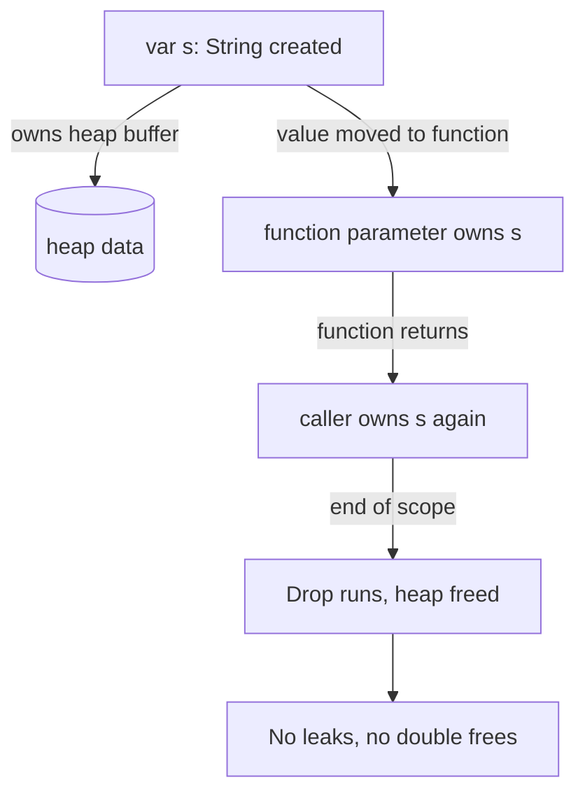

# Rust Ownership Explained: Memory Safety Without a Garbage Collector


Memory safety bugs like use-after-free, null-pointer dereferences, and data races have haunted C and C++ developers for decades, and a large share of critical security vulnerabilities still trace back to them. Rust attacks the problem from a different angle: instead of a runtime garbage collector (GC) that pauses the program, or manual `free()` calls that beg for mistakes, Rust encodes the rules of memory management into its type system, and the compiler enforces them at build time.

The ownership model is often the first wall developers hit when coming from JavaScript, Python, Java, TypeScript, or Go. This article takes you behind that wall — through the stack and heap, the three ownership rules, moves and borrows, lifetimes, and smart pointers — and finishes with a small parallel project that exercises them all.

## Introduction

The idea of correctness enforced by the compiler sounds too good to be true, and the Rust community is fond of the slogan "If it compiles, it works" — acknowledging that the compiler catches most mistakes before your code ever runs. Ownership is the heart of that guarantee. It is the mechanism that delivers:

- **No garbage collector** — no stop-the-world pauses, no tracing, no reference-counting overhead hidden from you (unless you opt in).
- **No manual memory management** — you never call `free()` or `delete`; memory is freed automatically at well-defined points.
- **Thread safety at compile time** — many data races that would race at runtime in other languages are simply rejected by `rustc`.

Below is where things are heading.

## Table of Contents

- [What Problem Does Rust Solve?](#what-problem-does-rust-solve)
- [The Stack and the Heap](#the-stack-and-the-heap)
- [The Ownership Rules](#the-ownership-rules)
- [Understanding Moves](#understanding-moves)
- [Borrowing and References](#borrowing-and-references)
- [Lifetimes: Making Borrows Safe](#lifetimes-making-borrows-safe)
- [Smart Pointers: Sharing and Interior Mutability](#smart-pointers-sharing-and-interior-mutability)
- [Real-World Example: A Parallel Word Counter](#real-world-example-a-parallel-word-counter)
- [Common Pitfalls and How to Avoid Them](#common-pitfalls-and-how-to-avoid-them)
- [Conclusion](#conclusion)
- [Key Takeaways](#key-takeaways)
- [Frequently Asked Questions](#frequently-asked-questions)
- [Related Articles](#related-articles)

## What Problem Does Rust Solve?

Consider the classic C pattern that produces a use-after-free:

```c
char *make_greeting(void) {
    char buffer[32];
    snprintf(buffer, sizeof buffer, "Hello, world!");
    return buffer; /* buffer is gone when the function returns! */
}
```

When `make_greeting` returns, `buffer` lives on the stack and is destroyed. The pointer now dangles. The C compiler will happily compile this; the bug only shows up later, unpredictably, in a crash or a security exploit. Now consider the equivalent Rust:

```rust
fn make_greeting() -> String {
    let mut buffer = String::from("Hello, world!");
    buffer.push('!');
    buffer // ownership of the String is moved to the caller
}
```

This not only compiles but is correct: the caller owns the resulting `String`, and freeing it at the right time is the compiler's responsibility. The key phrase in the Rust version is **ownership is moved**. Once you internalize that a value has exactly one owner at a time, most of the rest flows naturally.



The diagram above is the whole story in miniature: a value is born, ownership travels, and when the final owner goes out of scope, Rust inserts the free — automatically and exactly once.

## The Stack and the Heap

To understand why ownership exists, you need the memory layout that sits behind every program you write in a compiled language.

### Stack values

The stack is a contiguous block of memory that grows and shrinks like a stack of plates. Every function call pushes a *frame* containing its local variables; returning pops the frame. Stack allocation is nearly free because it is just a pointer increment, and cleanup is equally cheap.

Values on the stack (integers, `bool`, `char`, fixed-size arrays, tuples of stack-only types) have a known size at compile time, which is why they are so fast. The obvious downside: the size of everything on the stack must be known in advance.

### Heap values

Data whose size is dynamic at runtime — strings, vectors, trees, any value built up over time — must live on the heap. Instead of storing the data in the frame, the frame stores a pointer to a chunk of heap memory allocated elsewhere. `String`, for example, is a triple of (pointer, length, capacity) sitting on the stack, pointing at the actual `u8` bytes on the heap.

The trade-off table is worth memorizing:

| Property | Stack | Heap |
| --- | --- | --- |
| Allocation speed | Extremely fast (pointer bump) | Slower (allocation search, bookkeeping) |
| Size at compile time | Must be known | Can be dynamic |
| Cleanup | Automatic when frame pops | Requires a clear ownership policy |
| Typical types in Rust | `i32`, `f64`, `bool`, arrays, tuples | `String`, `Vec<T>`, `Box<T>`, `HashMap<K, V>` |

Because heap data has no natural "end of frame" to hang cleanup on, you need an explicit policy for who frees it and when. In C that policy is manual discipline; in Java and Go it is a GC; in Rust it is the ownership model.

## The Ownership Rules

Rust's whole memory story reduces to three rules, which the compiler checks on every code path:

1. **Each value in Rust has a single owner.** The owner is some variable that holds the value.
2. **There can be only one owner at a time.** When you assign or pass the value, ownership transfers to the new owner (this is a *move*).
3. **When the owner goes out of scope, the value is dropped.** Rust calls the value's `Drop` implementation, which frees its memory automatically.

```rust
fn main() {
    let data = String::from("hello"); // data owns the String
    let data2 = data;                 // owns the String now; data is invalid
    // println!("{data}");             // error: borrow of moved value
    println!("{data2}");               // fine
}
```

> **Caution:** After a move, the old owner is considered *deinitialized*. Using it is a compile-time error, not a runtime crash. This is exactly the safety guarantee languages like C++ and C cannot give you statically — in C++ this same pattern would compile and silently leave a dangling pointer.

## Understanding Moves

A move is not a deep copy. For a `String`, moving the owner merely copies the (pointer, length, capacity) triplet on the stack and makes the old `String` invalid; the heap bytes stay exactly where they are. Moving is cheap.

### Copy types vs. move types

For values that are trivially copyable — plain integers, floats, booleans, and any type implementing the `Copy` trait — assignment behaves like a copy instead of a move:

```rust
let x = 42;
let y = x;   // both x and y are valid!
println!("{x} {y}");
```

Why is this safe? An `i32` has no heap resources, no destructor worth tracking, and copying it is just copying bytes. Types that own heap memory — `String`, `Vec<T>`, `Box<T>` — deliberately do *not* implement `Copy`, because copying them naively would produce two owners of the same heap block.

| Example type | Implements `Copy`? | Behavior on assignment |
| --- | --- | --- |
| `i32`, `f64`, `bool`, `char` | Yes | Copied, both names usable |
| Tuples/arrays of `Copy` types | Yes | Copied |
| `String`, `Vec<T>`, `Box<T>` | No | Moved, old owner invalidated |

This simple distinction explains a huge number of compiler errors beginners hit: *"value moved here"* almost always means the type is not `Copy` and you transferred ownership instead of borrowing.

## Borrowing and References

Moving ownership on every function call would be tedious. Enter *borrowing*: a reference lets you **use** a value without taking ownership. An immutable reference is written `&T`, a mutable reference `&mut T`.

```rust
fn len_of(s: &String) -> usize {
    s.len() // read through the reference
}

fn main() {
    let greeting = String::from("Hello");
    let n = len_of(&greeting); // borrow, greeting still alive
    println!("length is {n}, greeting still usable: {greeting}");
}
```

### The rules of borrowing

Two rules govern all references, and the compiler enforces them anywhere in your program simultaneously:

1. At any moment, you may have **any number of immutable references** (`&T`).
2. Or you may have **exactly one mutable reference** (`&mut T`), but never both kinds at the same time for the same value.

This is the anti-data-race constraint. If you hold a `&T` and someone else holds a `&mut T` to the same location, you could read a value mid-write. The compiler refuses to even build that situation.

```rust
let mut v = vec![1, 2, 3];
let a = &v;   // immutable borrow 1
let b = &v;   // immutable borrow 2: fine, both are reads
// let c = &mut v; // ERROR: cannot borrow v as mutable because it is also borrowed as immutable
println!("{a:?} {b:?}");
let c = &mut v; // ok now: the immutable borrows have ended
c.push(4);
```

### Dangling references never compile

A reference that outlives the data it points to would dangle. Rust makes this impossible by refusing code where the reference would live longer than the data:

```rust
fn broken() -> &String { // error: missing lifetime specifier, and for good reason
    let s = String::from("temp");
    &s                    // s drops here; the returned reference would dangle
}
```

## Lifetimes: Making Borrows Safe

To know whether a reference outlives its data, the compiler tracks *lifetimes*: abstract names for how long a reference is valid. In straightforward code you never write them; the compiler infers them. When you write a function that takes or returns references, you sometimes add annotations like `'a` to connect input and output lifetimes.

```rust
fn longest<'a>(x: &'a str, y: &'a str) -> &'a str {
    if x.len() > y.len() { x } else { y }
}
```

The annotation reads: *the two inputs live at least as long as `'a`, and so does the returned reference.* If a caller passes two `&str` slices from different scopes, Rust picks the shorter lifetime for `'a` so the guarantee holds. The result: the compiler proves the returned reference cannot dangle, no matter how the function is called.

> **Note:** Lifetimes do not change how long data lives — they only describe relationships between references so the compiler can prove safety. They are erased at runtime and cost nothing.

A good intuition: a function that returns a reference must get that reference from its inputs (or from static data). If you find yourself wanting to return a reference to a temporary you created inside the function, that is a design smell — return the owned value (a `String` or `Vec`) instead.

## Smart Pointers: Sharing and Interior Mutability

The basic ownership model allows one owner. Real programs need graphs, caches, and shared state. Rust handles these with *smart pointer* types that change the meaning of ownership.

### Rc for shared read-only access

`Rc<T>` (reference-counted) lets many parts of your code share ownership of one heap value, within a single thread. Each `clone()` bumps a counter; when the last clone drops, the value is freed.

```rust
use std::rc::Rc;

fn main() {
    let data = Rc::new(String::from("shared"));
    let a = Rc::clone(&data);
    let b = Rc::clone(&data);
    println!("strong count: {}", Rc::strong_count(&data)); // 3
}
```

### RefCell for interior mutability

A `&mut` reference is exclusive — but what if you have several shared handles and need to mutate through one of them? `Rc` alone is immutable. `RefCell<T>` defers the borrow check from compile time to runtime: you call `borrow_mut()` and get a panic if you violate the "one mutable or many immutable" rule while running. Together, `Rc<RefCell<T>>` gives you a mutable, shared, single-threaded graph node.

### Arc and Mutex for threads

To share between threads you need the atomic-counter version `Arc<T>`. When values must be mutated across threads, wrap them in `Mutex<T>`, which serializes access with a runtime lock.

```rust
use std::sync::{Arc, Mutex};

let counter = Arc::new(Mutex::new(0));

// in some thread:
let guard = counter.lock().unwrap();
// *guard is the i32; guard unlocks when dropped
```

An important rule the compiler enforces for free: `Rc<T>` is **not** `Send` (it cannot move across threads), so code that tries to share `Rc` between threads fails to compile — a class of bug that in other languages ships to production.

```mermaid
sequenceDiagram
    participant Thread1
    participant Arc as Arc&lt;Mutex&lt;i32&gt;&gt;
    participant Thread2
    Thread1->>Arc: lock()
    Arc-->>Thread1: &mut i32 (exclusive)
    Thread2->>Arc: lock() [blocks until release]
    Thread1-->>Arc: unlock (guard dropped)
    Arc-->>Thread2: &mut i32
```

## Real-World Example: A Parallel Word Counter

Let's tie it together with a plausible real use: counting word occurrences across a large text file using every core, while safely accumulating results. Without ownership rules, parallel accumulation is where data races bite; with Rust, the borrow checker plus `Arc<Mutex<...>>` makes the safe version the natural one.

```rust
use std::collections::HashMap;
use std::fs;
use std::sync::{Arc, Mutex};
use std::thread;

const CHUNKS: usize = 4;

fn main() {
    let text = fs::read_to_string("book.txt").expect("failed to read");
    let totals = Arc::new(Mutex::new(HashMap::<String, usize>::new()));

    let mut handles = Vec::new();
    for chunk in text.split(|c: char| c.is_whitespace()).collect::<Vec<_>>()
        .chunks(text.split_whitespace().count() / CHUNKS.max(1))
    {
        let chunk = chunk.join(" ");
        let totals = Arc::clone(&totals);
        // 'move' sends all captured values INTO the thread; 'totals' is shared ownership
        handles.push(thread::spawn(move || {
            let mut local = HashMap::<String, usize>::new();
            for word in chunk.split_whitespace() {
                *local
                    .entry(word.to_lowercase())
                    .or_insert(0) += 1;
            }
            let mut global = totals.lock().unwrap(); // runtime, exclusive access
            for (k, v) in local {
                *global.entry(k).or_insert(0) += v;
            }
        }));
    }

    for h in handles {
        h.join().unwrap();
    }
    println!("{:#?}", totals.lock().unwrap());
}
```

Walk through what the compiler guarantees in those few lines:

- The `move` closure transfers every captured value — `chunk` and the cloned `Arc` — into the thread; nothing is shared by accident.
- `Arc<T>` is `Send`, so sharing the counter between threads compiles; `Rc<T>` would not.
- `Mutex` ensures at most one thread mutates the map at a time, and the `lock()` guard releases the lock when it drops.

## Common Pitfalls and How to Avoid Them

| Pitfall | Symptom | Fix |
| --- | --- | --- |
| Moving a `String`/`Vec` when you only meant to read it | "value moved here" | Pass `&T` instead of `T` |
| Borrowing immutably then mutably | "cannot borrow as mutable because it is also borrowed as immutable" | Limit the immutable borrow's scope, or restructure |
| Returning a reference to a local | Lifetime error | Return the owned value |
| Using `Rc` across threads | "`Rc<T>` cannot be sent between threads safely" | Switch to `Arc`, add `Mutex` for mutation |
| Fighting the borrow checker with `clone()` everywhere | Slow, noisy code | Clone the smallest thing, or restructure around borrows |

If the borrow checker ever seems to be bullying you, step back. It is usually pointing at a conflict in your design — splitting an operation across a scope, or owning data in the right place, resolves far more errors than sprinkling `.clone()`.

## Conclusion

Rust's ownership model trades a small upfront learning curve for guarantees other languages defer to runtime or human discipline: every heap value has exactly one owner, so memory is freed exactly once at the right time with no GC; borrowing rules make dangling pointers and data races compile-time errors; and smart pointers extend the model to shared graphs and concurrent code without compromising safety.

After the initial friction, most developers find the borrow checker feels like a design advisor rather than an obstacle — pushing them toward ownership structures that are easier to reason about in every language they write.

## Key Takeaways

- Ownership is compile-time memory management: one owner per value, cleanup automatic when the owner goes out of scope.
- Moves transfer ownership cheaply; `Copy` types copy instead, and only stack-only types implement `Copy`.
- Borrowing (`&T` / `&mut T`) lets you read and write without owning, enforcing "many readers OR one writer" at compile time.
- Lifetimes are compile-time only — free at runtime — and exist to prove references cannot dangle.
- `Rc`, `RefCell`, `Arc`, and `Mutex` extend ownership to shared and concurrent scenarios while keeping the guarantees intact.
- The compiler is stricter than C and C++ but catches the memory bugs they routinely ship, making Rust well suited for systems and network-adjacent code.

## Frequently Asked Questions

**Q: Do I need to understand ownership before I can write any Rust at all?**

A: Not fully — you can get working code quickly by returning owned values and passing `&T` for reads. But the moment you hit an error about a moved value or a borrow conflict, the three ownership rules are the mental model you need.

**Q: Is ownership slower than manual `free()` / `delete`?**

A: No. The rules are checked at compile time and erased at runtime; the generated assembly is comparable to a disciplined C program. Rust is a systems language precisely because ownership adds no runtime cost, unlike a garbage collector.

**Q: What is the difference between borrowing, `Rc`, and `Arc`?**

A: A borrow (`&T`) does not own anything and ends when its scope ends. `Rc` is reference-counted ownership within one thread; `Arc` is the atomic version usable across threads. Borrow whenever you only need temporary access; reach for smart pointers only when ownership must genuinely be shared.

**Q: When should I prefer Rust over Go, Java, or TypeScript for a project?**

A: When memory safety, predictability, and fine control matter most — embedded systems, game engines, databases, network services, and security-sensitive libraries. For typical business CRUD apps with fast iteration, a GC language is often the pragmatic choice.

**Q: Where can I practice these concepts safely?**

A: Rust includes built-in exercises (`rustlings`) and the official book is free at doc.rust-lang.org. Compiler errors are famously verbose and explanatory, so iterating in a small scratch project is an excellent way to build intuition quickly.

## Related Articles

- Understanding the TCP Three-Way Handshake: A Comprehensive Guide
- WebSockets Explained: A Complete Guide to Real-Time Communication
- Mastering TypeScript: The Bridge to Safer, Scalable JavaScript
