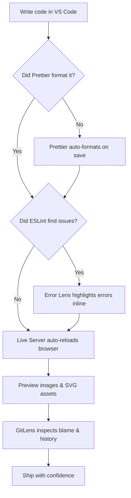

# VS Code Extensions for Developers: Must-Have Tools for a Faster Workflow

Visual Studio Code has become the editor of choice for millions of developers, and a big part of that popularity is its enormous ecosystem of extensions. The right extensions can transform a plain text editor into a powerful IDE-like environment that catches bugs before you run your code, formats your files consistently, and gives you superpowers like live reload and advanced Git insights.

This guide covers a curated set of must-have VS Code extensions grouped by workflow. Whether you are a frontend developer, a beginner, or a seasoned engineer looking to trim your toolbox, this list helps you build faster, code smarter, and boost your productivity.


## Table of Contents

- [Why Extensions Matter](#why-extensions-matter)
- [Code Formatting & Quality](#code-formatting--quality)
  - [Prettier](#prettier)
  - [ESLint](#eslint)
- [HTML & CSS Productivity](#html--css-productivity)
  - [Auto Rename Tag](#auto-rename-tag)
  - [HTML CSS Support & IntelliSense for CSS Class Names](#html-css-support--intellisense-for-css-class-names)
- [Assets & Media](#assets--media)
  - [Image Preview](#image-preview)
  - [SVG Preview](#svg-preview)
  - [SnapCode](#snapcode)
- [Live Development](#live-development)
  - [Live Server](#live-server)
  - [Live Preview](#live-preview)
- [React Development](#react-development)
  - [ES7+ React/Redux/React-Native Snippets](#es7-reactreduxreact-native-snippets)
  - [React Snippets](#react-snippets)
- [Developer Power Tools](#developer-power-tools)
  - [GitLens](#gitlens)
  - [Path Intellisense](#path-intellisense)
  - [Error Lens](#error-lens)
- [Pro Tips for Managing Extensions](#pro-tips-for-managing-extensions)
- [Recommended Frontend Stack](#recommended-frontend-stack)
- [Key Takeaways](#key-takeaways)
- [Frequently Asked Questions](#frequently-asked-questions)
- [Related Articles](#related-articles)

## Why Extensions Matter

Every developer has a slightly different workflow, and VS Code extensions let you customize your editor to fit yours. The value of extensions goes far beyond convenience: they enforce consistent code style across a team, surface errors the instant you type them, and remove repetitive manual steps that slow you down.

The extensions covered here fall into six practical categories:

| Category | What it does for you | Examples |
| --- | --- | --- |
| Code Formatting & Quality | Consistent style, catches bugs early | Prettier, ESLint |
| HTML & CSS Productivity | Faster markup and styling | Auto Rename Tag, CSS IntelliSense |
| Assets & Media | Preview and share visuals | Image Preview, SVG Preview, SnapCode |
| Live Development | Instant feedback while coding | Live Server, Live Preview |
| React Development | Rapid component generation | ES7+ React Snippets, React Snippets |
| Developer Power Tools | Git and coding insights | GitLens, Path Intellisense, Error Lens |

The flowchart below shows how these tools fit together in a typical frontend workflow:



## Code Formatting & Quality

This is the first category to install. Formatting and linting extensions work together to keep your code clean, readable, and error-free from the moment you start typing.

### Prettier

Prettier is the industry-standard opinionated code formatter. It enforces a consistent style across your entire project so that you never have to argue about tabs versus spaces or where semicolons go.

Key benefits:

- **Auto format code** on save, or on demand with one click
- **Consistent code style** across your team and every file you touch
- **One-click formatting** for a messy file

For example, a messy function like this:

```js
function add(a,b){
if(a>b){
return a+b;
}else{return a-b;}}
```

is instantly turned into clean, readable, consistently formatted code:

```js
function add(a, b) {
  if (a > b) {
    return a + b;
  } else {
    return a - b;
  }
}
```

### ESLint

While Prettier handles *how* your code looks, ESLint handles *what* your code does. ESLint statically analyzes your JavaScript to find problems without running it.

Key benefits:

- **Detect coding errors** before you even hit Run
- **Improve code quality** by flagging bad patterns
- **Fix common mistakes** automatically with safe fixes

ESLint can be configured with shareable configs and rules, making it a powerful gatekeeper that keeps junior and senior code alike on the same quality bar.

> **Pro Tip:** Use Prettier and ESLint together. Let ESLint catch logic and bug-level issues, and let Prettier handle formatting. Make sure to **disable conflicting formatters** so the two tools do not fight over the same rules.

## HTML & CSS Productivity

If you build markup and styles every day, these extensions remove a surprising amount of friction.

### Auto Rename Tag

Renaming an HTML tag usually means editing both the opening and the closing tag — and it is easy to forget the second one. Auto Rename Tag does the job for you.

- **Rename opening & closing tags automatically** as you type

```html
<div class="container">
  <h1>Hello</h1>
</div>
```

When you change `<h1>` to `<h2>`, the closing `</h1>` becomes `</h2>` automatically, keeping your markup valid with zero extra keystrokes.

### HTML CSS Support & IntelliSense for CSS Class Names

These two companions make styling much faster:

- **HTML CSS Support**: CSS class autocomplete inside your HTML files
- **IntelliSense for CSS Class Names**: smart CSS suggestions pulled from your actual stylesheets

Instead of remembering every class name you defined, you get a dropdown of valid options right where you type the `class` attribute.

## Assets & Media

Working with images and SVGs is a lot easier when you can see what you are editing without leaving the editor.

### Image Preview

Image Preview shows a thumbnail of image files directly in the editor, and even previews the image when you hover over its file reference in code. No more guessing which file is which.

### SVG Preview

SVG files are text, but you usually care how they render. SVG Preview lets you view SVG files instantly inside VS Code, so you can iterate on icons and illustrations without opening a browser or a design tool.

### SnapCode

Sometimes you want to share a snippet on social media, in a chat, or in documentation. SnapCode lets you **generate beautiful code screenshots** from your code.

- **Generate beautiful code screenshots** with a polished, presentation-ready look
- **Share code snippets easily** with teammates or the wider community

```js
function sum(a, b) {
  return a + b;
}
console.log(sum(2, 3));
```

A tool like this turns the code above into a clean, shareable image in seconds.

## Live Development

The fastest way to test frontend code is to never manually refresh your browser again.

### Live Server

Live Server starts a local development server with a single click and **auto-refreshes the browser whenever you save** a file. This is the classic go-to for static HTML/CSS/JS projects.

### Live Preview

Live Preview offers a **built-in web preview** directly inside VS Code. It gives you a **faster testing workflow** because you never leave the editor to see your changes take effect.

- Auto refresh on save (Live Server)
- Built-in web preview panel (Live Preview)
- Faster testing workflow overall

## React Development

If you work with React, snippet extensions dramatically cut down the boilerplate you type by hand.

### ES7+ React/Redux/React-Native Snippets

This extension provides **quick component creation** with a set of shorthand snippets. Typing a short prefix expands into a full, correctly structured component, so you can spin up components in seconds rather than minutes.

### React Snippets

Similarly, React Snippets offers:

- **Connect shortcuts** for quickly wiring up components
- **Lightning-fast coding** for common patterns
- **Boilerplate generation** that removes repetitive typing

```jsx
export default function MyComponent() {
  return <h1>Hello World</h1>;
}
```

With the right snippet, the scaffold for this component appears with a few keystrokes instead of manual typing.

## Developer Power Tools

This final group rounds out the toolbox with Git insights, path completion, and error visibility.

### GitLens

GitLens supercharges the built-in Git support with **advanced Git insights**. Its most famous feature is **blame annotations** that show, right on the line of code you are reading, who last changed it and when.

```js
function getData() {
  return fetch("/api/").then((res) => res.json());
}
```

With GitLens, hovering over `getData` reveals its commit history, author, and changes at a glance — invaluable for understanding why a line of code exists.

### Path Intellisense

Importing files means typing out file paths from memory. Path Intellisense provides **file path autocomplete**, so as soon as you start typing a path, valid options appear.

```js
import api from "./services/";
```

The extension fills in the correct path for you, eliminating a whole class of broken-import typos.

### Error Lens

By default, VS Code underlines errors that are easy to miss. Error Lens surfaces those problems right at the end of the line in the editor itself.

- **Highlight errors** inline, on the exact line where they occur

```js
const user = getUsers();
// ⚠ cannot find name "getUsers". ts2304
```

Instead of hunting through the Problems panel, the message `cannot find name "getUsers". ts2304` appears immediately, making it obvious what is broken and where.

## Pro Tips for Managing Extensions

An extension list grows quickly, and too many extensions can slow your editor down and create conflicts. Follow these tips to keep your setup lean and fast:

- **Install only extensions you actually use** — every extension adds startup time and surface area
- **Keep extensions updated** so you get fixes and performance improvements
- **Use Prettier + ESLint together** for both style and logic correctness
- **Disable conflicting formatters** so tools never fight each other
- **Organize extensions by workflow** (formatting, React, Git, etc.) so you can enable only what a given project needs

> **Caution:** Resist the urge to install every "popular" extension you see. The best setup is the smallest set that covers your real workflow.

## Recommended Frontend Stack

Based on the source material, here is the recommended stack for frontend developers, ordered by how they fit into a daily workflow:

1. **Prettier** — format everything consistently on save
2. **ESLint** — catch logic and bug-level issues early
3. **Live Server** or **Live Preview** — instant feedback in the browser
4. **Auto Rename Tag + CSS IntelliSense** — faster HTML/CSS editing
5. **ES7+ React Snippets** — rapid component generation for React projects
6. **GitLens** — Git blame and history insight
7. **Error Lens** — surface errors inline
8. **Image Preview / SVG Preview** — inspect assets without leaving the editor
9. **SnapCode** — produce beautiful code screenshots for sharing

All of these are available through the **Extensions Marketplace** — just use the search bar in the Extensions view (`Ctrl+Shift+X`) and look them up by name.

## Key Takeaways

- Prettier + ESLint is the backbone of code formatting and quality — use them together and disable conflicting formatters.
- Auto Rename Tag and CSS IntelliSense remove real friction from everyday HTML/CSS work.
- Image Preview, SVG Preview, and SnapCode make handling and sharing media assets much easier.
- Live Server and Live Preview eliminate manual browser refreshes for a faster testing workflow.
- React snippet extensions drastically cut boilerplate for component-based development.
- GitLens, Path Intellisense, and Error Lens turn VS Code into a more powerful tool for Git insights, imports, and error visibility.
- Only install extensions you actually use, keep them updated, and organize them by workflow.

## Frequently Asked Questions

**Which extensions should a frontend developer install first?**
Start with Prettier and ESLint for formatting and quality, then add Live Server (or Live Preview) for instant browser feedback, followed by the HTML/CSS and React productivity tools.

**Should I use both Prettier and ESLint?**
Yes. They solve different problems: ESLint catches bugs and code-quality issues, while Prettier formats your code. Use them together, and disable any conflicting formatter rules so they don't fight each other.

**How can I avoid extensions slowing down my editor?**
Install only what you actually use, keep your extensions updated, and organize them by workflow so you can enable only what each project needs.

**Does the source document cover extension configuration or settings?**
No. The source material lists the extensions and their benefits but does not cover configuration, keybindings, or workspace settings in detail.

**Are these extensions free?**
The source document does not discuss pricing or licensing. Most popular VS Code extensions from the Marketplace are free and open source, but you should verify the details on each extension's Marketplace page.

## Related Articles

- [ESLint Setup and Configuration Guide for JavaScript Projects](/tags/code-quality)
- [Building a Faster Frontend Workflow with Live Reload Tools](/tags/live-development)
- [React Development Best Practices for Modern Applications](/tags/react)
