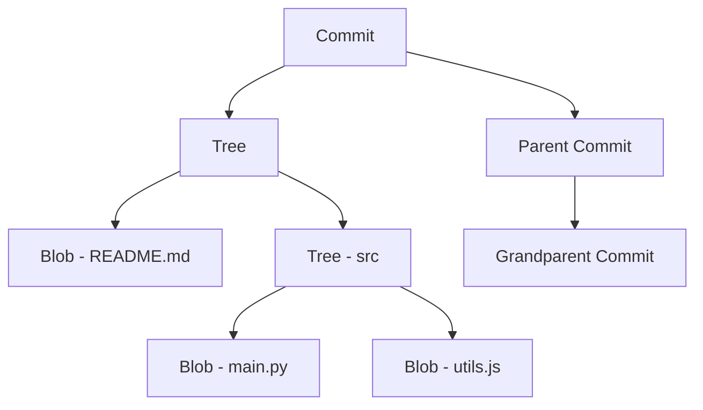
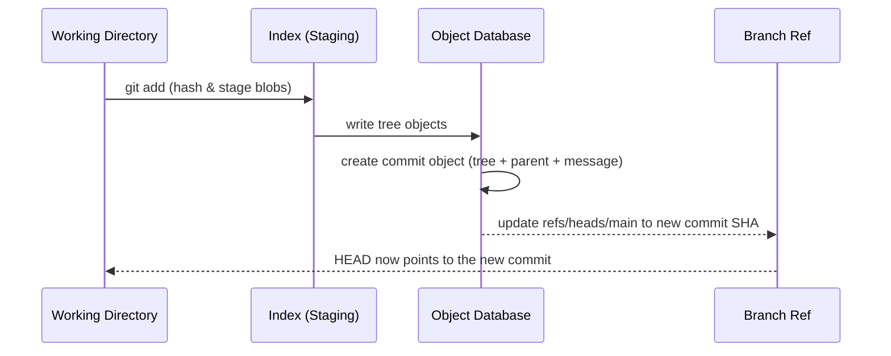
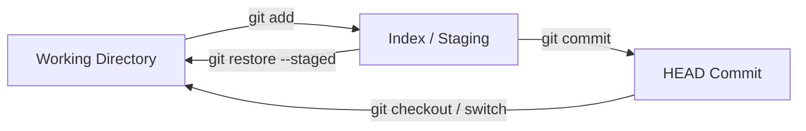
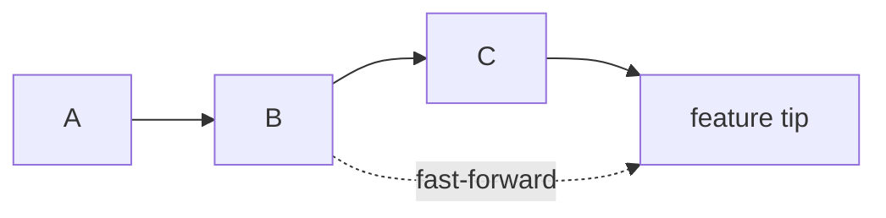

# Git Internals Explained: Objects, Branches, Rebase, and Merge Strategies

Git is the tool every developer uses daily, yet most treat it as a black box. You run `git add`, `git commit`, and `git push`, and when something goes wrong you either pray or copy-paste an internet fix. But once you understand what Git *actually* stores and how its commands manipulate that storage, the mystery disappears. Everything from `git rebase --interactive` to recovering a "deleted" commit becomes intuitive.

In this article we'll open the hood and explore Git's object model, how branches are just lightweight pointers, how the index works, and when you should rebase versus merge. By the end, you'll be able to reason about Git instead of guessing.

## Table of Contents

- [Why Git Internals Matter](#why-git-internals-matter)
- [The Git Object Model](#the-git-object-model)
- [How Git Stores Objects: Hashing and Content Addressability](#how-git-stores-objects-hashing-and-content-addressability)
- [Branches Are Just Pointers](#branches-are-just-pointers)
- [The Index and the Staging Area](#the-index-and-the-staging-area)
- [Merge Strategies Explained](#merge-strategies-explained)
- [Rebase vs Merge: Choosing the Right Tool](#rebase-vs-merge-choosing-the-right-tool)
- [Real-World Example: The Feature Branch Workflow](#real-world-example-the-feature-branch-workflow)
- [Key Takeaways](#key-takeaways)
- [Frequently Asked Questions](#frequently-asked-questions)
- [Related Articles](#related-articles)

## Why Git Internals Matter

Most developers can drive Git without knowing how it works, just as most people can drive a car without understanding the engine. But the difference between a novice and an expert Git user is the ability to *recover* from mistakes, not just make them.

Understanding internals helps you:

- **Resolve merge conflicts with confidence** instead of fear.
- **Recover lost work** when you reset or rebase incorrectly.
- **Write cleaner commit history** that your team can actually read.
- **Debug weird behaviors**, such as a commit that "disappeared" or a branch that won't push.

The most important mental model shift is this: **Git is not a storage system for files; it is a content-addressable filesystem for snapshots.**


## The Git Object Model

At the core of Git are four types of objects stored in a hidden `.git` directory:

| Object type | What it stores | Contents |
|---|---|---|
| **Blob** | A single file's contents | Raw bytes, compressed. No filename or metadata |
| **Tree** | A directory listing | Maps filenames to blob/tree SHA-1s |
| **Commit** | A snapshot of the project | Author, committer, message, parent SHA-1(s), and the root tree SHA-1 |
| **Annotated tag** | A named, fixed pointer | Tag message, tagger, and a target object |

### Blobs

A blob (binary large object) is just the compressed content of a file. It does *not* store the filename, the permissions, or even whether it's a text file. Two files with identical contents in different directories will both reference the *same* blob, which is how Git deduplicates storage.

### Trees

A tree object represents a directory. It contains entries, each pointing to either a blob (file) or another tree (subdirectory), together with the entry's file mode and name.

```text
tree c3a0c2f... "root"
  blob e69de29...  README.md
  blob c4a76b2...  src/main.py
  tree f6d10b4...  tests/
```

### Commits

A commit is a pointer to a tree (the root snapshot) plus metadata: the author, the committer, a message, and one or more parents. The parent links form the backbone of your history.

```text
commit 4f2a9b1...
  tree     a1b2c3d...
  parent   2e9c4f8...
  author   Ada Lovelace <ada@example.com>
  message  "Add user authentication"
```

> **Key insight:** A commit stores a full snapshot of the entire tree, not a diff. The "diff" you see in `git log -p` is computed on the fly by comparing two snapshots.

This object model gives Git its most important property: **data integrity**. Every object is identified by the cryptographic hash of its contents, so Git can detect any corruption or tampering immediately.

### The Object Model at a Glance



## How Git Stores Objects: Hashing and Content Addressability

Every Git object is addressed by a SHA-1 hash (GitHub now supports SHA-256 repositories too) computed from its contents. This is called **content-addressable storage**: the "address" of an object *is* its content digest.

When you run:

```bash
echo "hello" | git hash-object --stdin
```

Git prints a 40-character SHA-1 such as `ce013625030ba8dba906f756967f9e9ca394464a`. Run it again and you get the identical hash, because identical content always produces the identical address. This is what makes Git so efficient at deduplication: repeated or moved content is stored exactly once.

Internally, objects are compressed with zlib and stored under `.git/objects/`. The first two characters of the hash become the directory name, and the remaining 38 characters become the file name:

```text
.git/objects/ce/013625030ba8dba906f756967f9e9ca394464a
```

You can inspect any object directly with `git cat-file`:

```bash
git cat-file -t ce013625030ba8dba906f756967f9e9ca394464a   # type
git cat-file -p ce013625030ba8dba906f756967f9e9ca394464a   # pretty-print
```

### How a Commit is Created

The chain of events when you commit looks like this:

1. `git add` writes a blob for each changed file and records entries in the index.
2. Git builds tree objects from the index.
3. Git creates a commit object pointing at the root tree, with its parent set to the current `HEAD` commit.
4. The branch ref (e.g. `refs/heads/main`) is updated to point to the new commit.



## Branches Are Just Pointers

This is the single most liberating fact about Git: **a branch is nothing more than a movable pointer to a commit.** There is no "branch object," no heavy copy of your files, no duplication.

A branch is a file under `.git/refs/heads/` that contains a single 40-character SHA-1:

```text
$ cat .git/refs/heads/main
2e9c4f8b6a7d2f1a3c5e7b9d0f1a2b3c4d5e6f7a
```

### HEAD, Refs, and Detached State

- **`HEAD`** is a special pointer that tells Git which branch you're on. It usually reads `ref: refs/heads/main`, but when you check out a specific commit it points directly at a SHA-1 — this is the "detached HEAD" state.
- **Remote-tracking refs** (like `origin/main`) live under `.git/refs/remotes/` and track the last-known position of a remote branch.
- **Tags** are refs that never move, so they permanently mark a release point.

Because branches are cheap pointers, creating one is a near-instant operation:

```bash
git branch feature/logout        # creates a new pointer at HEAD
git checkout feature/logout      # switches HEAD to the new branch
# or the modern shorthand
git switch -c feature/logout
```

Nothing is copied. The branch is simply a bookmark, and commits accumulate onto whichever bookmark `HEAD` points to.

> **Caution:** When you see a detached HEAD warning, you have a bookmark that will be garbage-collected once you switch away. Attach it to a branch with `git switch -c <new-branch>` if you want to keep the work.

## The Index and the Staging Area

Between your working directory and the object database sits a third area: the **index** (also called the staging area). `git add` does not immediately create a permanent object; it writes blobs into the object database and records their metadata in a binary file at `.git/index`.

The index is essentially a snapshot of your planned next commit:

```text
$ git status
On branch main
Changes to be committed:
  modified:   src/app.js
```

The three-tree model is worth internalizing:

1. **Working directory** — the files you edit in your editor.
2. **Index** — your staged, planned next commit.
3. **HEAD** — the last committed snapshot.



Understanding the index explains many everyday commands:

- `git restore <file>` copies from the index back to the working tree.
- `git restore --staged <file>` un-stages a file.
- `git diff` compares working directory to index.
- `git diff --cached` compares index to HEAD.

## Merge Strategies Explained

When you merge two branches, Git doesn't blindly overlay files. It uses the common ancestor (merge base) to compute how each side diverged, then applies a strategy.

### Fast-Forward Merge

If the branch you're merging into has not moved since the branch point, Git simply slides the pointer forward. No merge commit is created — the history stays perfectly linear.

```bash
git checkout main
git merge feature     # fast-forward: main moves to feature's tip
```



### Recursive (Three-Way) Merge

If both branches have advanced, Git performs a three-way merge using the merge base, the current branch, and the incoming branch. When the same lines were changed on both sides, you get a conflict, which Git marks in the files:

```text
<<<<<<< HEAD
const retries = 3;
=======
const retries = 5;
>>>>>>> feature/retries
```

Your job is to resolve the conflict, stage the resolution, and `git commit` to finish the merge.

```bash
git checkout main
git merge feature     # creates a merge commit with two parents
```

### Other Strategies

- **Octopus merge** — merges many heads at once (used when pulling multiple branches).
- **Ours / theirs** — trivially keep one side's version.
- **Rename detection** — Git detects renames by content similarity, which is why moved files usually merge cleanly.

### Merge Conflicts Cheat Sheet

1. Run `git status` to see conflicted files.
2. Open each file and resolve the `<<<<<<<` / `=======` / `>>>>>>>` markers.
3. Stage the resolved files with `git add`.
4. Finish with `git commit` (no `-m` needed — the merge message is pre-filled).

> **Pro tip:** Configure a visual merge tool with `git config --global merge.tool vimdiff` and open conflicts via `git mergetool`. It makes three-way conflict resolution dramatically easier.

## Rebase vs Merge: Choosing the Right Tool

`git rebase` rewrites commits by applying them onto a new base, producing a clean, linear history. `git merge` preserves the true topology of what happened, including when branches diverged.

| Consideration | Rebase | Merge |
|---|---|---|
| History shape | Linear, easy to read | Shows real branch structure |
| Merge commits | None | One per merge |
| Rewrites commits | Yes (new SHA-1s) | No |
| Safe on shared branches? | No — can corrupt teammates' work | Yes |
| Best for | Local clean-up before push | Landing long-lived branches |

The classic rule: **rebase your own un-pushed commits, merge or rebase shared work with discipline.** If a commit has been pushed and pulled by others, rewriting it forces everyone to reconcile their copies — this is the source of most "I rebased and broke everything" horror stories.

### Interactive Rebase

`git rebase -i` is the power tool for crafting history. It opens an editor listing your commits with verbs you can change:

```text
pick 1a2b3c4 Add login form
pick 5d6e7f8 Fix typo in validation
pick 9a0b1c2 Add logout button

# Commands:
#  p, pick  = use commit
#  r, reword = use commit, but edit the message
#  s, squash = use commit, but meld into previous
#  d, drop  = remove commit
```

A common workflow is to squash three noisy WIP commits into one clean commit before opening a pull request:

```bash
git rebase -i HEAD~3
# change 'pick' to 'squash' on all but the first, save, and write the new message
git push --force-with-lease
```

`--force-with-lease` is the safe form of force-push: it refuses to overwrite a remote that has changed since you last fetched, protecting your teammates from accidental data loss.

## Real-World Example: The Feature Branch Workflow

Let's put it all together with a realistic scenario: you're adding a dark-mode toggle to a web app while a teammate refactors the styling module in parallel.

**Step 1 — Start from a clean, updated main:**

```bash
git switch main
git pull --rebase          # keep main linear
```

**Step 2 — Create your feature branch:**

```bash
git switch -c feature/dark-mode
```

**Step 3 — Do work in small, logical commits:**

```bash
git add src/theme.css src/app.js
git commit -m "Add dark mode color tokens"
git add src/components/Header.js
git commit -m "Wire theme toggle into header"
```

**Step 4 — Integrate upstream changes before you push:**

```bash
git fetch origin
git rebase origin/main     # replay your commits on top of the latest main
```

If your teammate's styling refactor touches the same lines, resolve conflicts, then continue:

```bash
# resolve markers, then
git add src/app.js
git rebase --continue
```

**Step 5 — Push and open a pull request:**

```bash
git push --set-upstream origin feature/dark-mode
```

**Step 6 — After review, land the branch:**

```bash
git switch main
git merge --no-ff feature/dark-mode   # keep a merge commit for the PR
git push origin main
git branch -d feature/dark-mode       # delete the local branch
```

The resulting history is both readable and truthful: a clear linear trail on main, one merge commit per feature, and never a rewritten commit that was shared.

## Key Takeaways

- Git is a content-addressable filesystem: blobs store file contents, trees store directory listings, and commits store snapshots plus parent links.
- Branches are nothing more than lightweight pointers to commits; creating them is instant and cheap.
- The staging area (index) sits between your working directory and `HEAD`, letting you craft each commit precisely.
- Fast-forward merges keep history linear; three-way merges use the merge base to reconcile divergent branches.
- Rebase rewrites commits (changing their SHA-1s), so only rebase work that hasn't been shared with others.
- Interactive rebase is your tool for squashing, reordering, and cleaning commits before opening a pull request.

## Frequently Asked Questions

**What's the difference between `git fetch` and `git pull`?**
`git fetch` downloads new commits and updates remote-tracking refs but does not touch your working files. `git pull` runs a fetch and then immediately merges (or rebases) those commits into your current branch.

**Can I recover commits lost to a `git reset --hard` or an aborted rebase?**
Usually yes. Run `git reflog` to see a history of every movement of `HEAD`, find the commit SHA you want, and reset or cherry-pick it back. The reflog is your safety net.

**Why does Git store snapshots instead of diffs?**
Snapshots make checkout and diff operations trivial and make every object independently verifiable by its hash. Diffs between any two commits are computed lazily on demand, which is fast in practice because most trees are shared.

**Is it safe to force-push to a shared branch?**
Only with extreme care. Use `git push --force-with-lease`, which refuses to overwrite changes you haven't seen, and coordinate with your team first. Never force-push over history your teammates already pulled.

**What happens when I run `git commit --amend`?**
It replaces the tip commit of your current branch with a new commit containing the staged changes. Because the parent link stays the same, the new commit gets a fresh SHA-1, so only amend commits that haven't been pushed.

## Related Articles

- [Mastering TypeScript: The Bridge to Safer, Scalable JavaScript](/mastering-typescript-bridge-safer-scalable-javascript)
- [Mastering GraphQL: A Practical Guide to Flexible, Type-Safe APIs](/mastering-graphql-practical-guide)
- [The Complete DevOps Cheat Sheet: Linux, Git, CI/CD, IaC and Beyond](/complete-devops-cheat-sheet)
