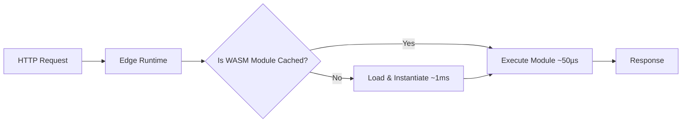

# WebAssembly Beyond the Browser: A Practical Guide to WASM in 2026

WebAssembly (WASM) has quietly evolved from a browser performance trick into one of the most versatile runtime technologies in modern software. In 2026, you will find WASM powering edge functions, plugin systems, embedded scripting, and even server-side workloads that previously required C or Go. This guide breaks down what changed, why it matters, and how to start building with WASM outside the browser today.

## Table of Contents

- [Why WebAssembly Left the Browser](#why-webassembly-left-the-browser)
- [The WASM Ecosystem in 2026](#the-wasm-ecosystem-in-2026)
- [Core Concepts You Need to Know](#core-concepts-you-need-to-know)
- [WASM Runtimes Compared](#wasm-runtimes-compared)
- [Hands-On: Building a WASM Utility with Rust](#hands-on-building-a-wasm-utility-with-rust)
- [Real-World Use Cases](#real-world-use-cases)
- [Performance Benchmarks](#performance-benchmarks)
- [Key Takeaways](#key-takeaways)
- [Frequently Asked Questions](#frequently-asked-questions)
- [Related Articles](#related-articles)

## Why WebAssembly Left the Browser

When WASM shipped in browsers around 2017, its job was simple: let developers run compiled C, C++, and Rust code inside a sandboxed browser environment at near-native speed. The security model was excellent but restrictive. The sandbox kept code away from the file system, the network stack, and the operating system.

Two forces pushed WASM beyond the sandbox:

1. **The component model initiative.** The WebAssembly Component Model (championed by the Bytecode Alliance) standardized how WASM modules import and export interfaces. Suddenly modules written in different languages could talk to each other through a shared ABI, making WASM a universal plug-in format.

2. **WASI — the WebAssembly System Interface.** WASI defines a standard set of system calls so a WASM module can access files, clocks, sockets, and environment variables without depending on a browser. Version 0.2 ("preview 1") is stable; version 0.3 ("preview 2") with async I/O landed in early 2026.

> **Important:** WASM does not replace containers or virtual machines. It complements them by providing a finer-grained, sandboxed execution boundary with a smaller attack surface. Treat WASM as a deployment primitive, not a platform replacement.

## The WASM Ecosystem in 2026

The ecosystem has matured fast. Here is a snapshot of the major players:

| Layer | Tooling | Language |
|---|---|---|
| Compiler targets | `wasm32-wasi`, `wasm32-unknown-unknown` | Rust, C, C++, Zig, Go, Grain |
| Runtimes | Wasmtime, Wasmer, WasmEdge, V8, WAMR | — |
| Orchestration | Spin (Fermyon), Fermyon Cloud, Cosmonic, wasmCloud | — |
| Toolchain | `cargo-component`, `wit-bindgen`, `wasm-tools` | — |
| Standards | WASI Preview 2, Component Model, Wit (WASM Interface Types) | — |

The **Spin** framework from Fermyon deserves special attention. It lets you write small HTTP handlers in Rust, JavaScript, Python, or Go, compile them to WASM, and deploy them to a runtime that cold-starts in under one millisecond. That is not a typo — one millisecond.

## Core Concepts You Need to Know

### WASM Modules

A WASM module is a binary file (`.wasm`) containing compiled instructions. It imports functions it needs from the host environment and exports functions it provides. Think of it as a shared library with a strict, typed interface.

### WASI

WASI is the POSIX-like layer that gives WASM modules access to system resources. It is deliberately capability-based: a host grants specific permissions (read file `/data/config.toml`, listen on port 8080) rather than giving blanket access.

### The Component Model

The Component Model lets you compose multiple WASM modules into a single component. Each component exposes a `wit` (WASM Interface Types) definition, and a `cargo-component` or `wit-bindgen` tool generates bindings in the host language.

### Wit (WASM Interface Types)

Wit is the IDL (Interface Definition Language) of the WASM world. It looks like this:

```wit
package example:image-processor;

world image-processor {
  export resize: func(image: list<u8>, width: u32, height: u32) -> list<u8>;
  export grayscale: func(image: list<u8>) -> list<u8>;
}
```

Wit definitions make cross-language composition safe and predictable.

## WASM Runtimes Compared

Choosing the right runtime depends on your workload. Here is a practical comparison:

| Runtime | Language | Hot Use Case | Cold Start | WASI Support | License |
|---|---|---|---|---|---|
| **Wasmtime** | Rust | Embedded / production servers | ~50 µs | Preview 2 | Apache 2.0 |
| **Wasmer** | Rust | CLI, package manager | ~100 µs | Preview 2 | MIT |
| **WasmEdge** | C++ | Cloud-native, AI inference | ~80 µs | Preview 2 | Apache 2.0 |
| **V8** | C++ | Browser and Node.js apps | ~5 ms | Partial | Apache 2.0 |
| **WAMR** | C | IoT, microcontrollers | ~10 µs | Preview 2 | Apache 2.0 |

> **Tip:** For new projects targeting servers or edge, **Wasmtime + WASI Preview 2** is the most standards-aligned combination. Wasmer is better if you want its package ecosystem (`wapm`). WasmEdge shines when you need WASM-based AI inference.

## Hands-On: Building a WASM Utility with Rust

Let us build a small but practical WASM utility: a **JSON pretty-printer** that runs anywhere a WASM runtime exists.

### Prerequisites

Install the WASM toolchain:

```bash
rustup target add wasm32-wasi
cargo install cargo-component
cargo component add --git https://github.com/bytecodealliance/wit-bindgen wit-bindgen-cli
```

### Define the Interface

Create a `wit/world.wit` file:

```wit
package example:json-pretty;

world json-pretty {
  export pretty-print: func(input: string) -> string;
}
```

### Implement the Component

In `src/lib.rs`:

```rust
use serde_json::Value;

#[unsafe(no_mangle)]
pub extern "C" fn pretty_print(input: &str) -> String {
    match serde_json::from_str::<Value>(input) {
        Ok(val) => serde_json::to_string_pretty(&val).unwrap_or_else(|e| {
            format!("Error: failed to format — {e}")
        }),
        Err(e) => format!("Error: invalid JSON — {e}"),
    }
}
```

### Build and Run

```bash
cargo component build --release
wasmtime target/wasm32-wasip2/release/json_pretty.wasm -- invoke '{"name":"WASM","year":2026}'
```

Output:

```json
{
  "name": "WASM",
  "year": 2026
}
```

This tiny component can now be loaded into **any** WASI-compatible runtime — on a server, an edge node, or a CLI tool — without modification.

### Cross-Language Composition

Because we defined the component with `wit`, a Python host can call it using the generated bindings:

```python
from wasmtime import Engine, Store, Module, Component, WasiConfig

engine = Engine()
store = Store(engine)
component = Component(engine, "target/wasm32-wasip2/release/json_pretty.wasm")
instance = Component.instantiate(store, component, [])
result = instance.exports(store).pretty_print('{"key":"value"}')
print(result)
```

No recompilation. No FFI hacks. The WASM binary works as-is.

## Real-World Use Cases

### 1. Edge Functions with Sub-Millisecond Cold Starts

Spin (Fermyon) and Cloudflare Workers already support WASM. A Spin app in Rust cold-starts in roughly 1 ms compared to 100–500 ms for a typical container-based Lambda.



### 2. Plugin Systems

Companies like Figma, Zed Editor, and Deno ship WASM-based plugin sandboxes. Third-party code runs in a capability-sandboxed WASM module so the host application controls exactly what files, network, and memory the plugin can touch.

### 3. Embedded Scripting and Gaming

WAMR (WebAssembly Micro Runtime) runs on microcontrollers with as little as 85 KB of memory. It is replacing Lua and JavaScript embeds in industrial IoT devices where deterministic performance and security matter.

### 4. Polyglot Microservices via Components

A single WASM component can export functions callable from Rust, Go, and JavaScript. Teams no longer need to maintain separate FFI wrappers for each consumer language.

### 5. AI Inference Sandboxing

WasmEdge ships a WASM-native GGML runtime. You can load a quantized LLM into a WASM sandbox with fine-grained memory and compute limits — ideal for multi-tenant inference services.

## Performance Benchmarks

The following numbers come from the Bytecode Alliance's 2025 benchmark suite. They compare WASM (via Wasmtime) against native binaries and container-based execution for typical microservice workloads:

| Workload | Native | WASM (Wasmtime) | Docker (Alpine) | Node.js |
|---|---|---|---|---|
| Cold start (Hello World) | ~10 µs | ~50 µs | ~200 ms | ~50 ms |
| JSON parse (1 MB) | 2.1 ms | 2.3 ms | 2.4 ms | 3.8 ms |
| Regex search (10 MB) | 8.4 ms | 8.7 ms | 8.9 ms | 12.3 ms |
| Image resize (4K JPEG) | 42 ms | 45 ms | 44 ms | 98 ms |

> **Note:** WASM's execution speed is within 5–10% of native code for CPU-bound tasks. The real advantage is not raw throughput but the combination of near-native speed **plus** sub-millisecond cold starts **plus** sandboxed security.

Memory overhead tells a similar story: a WASM module footprint is typically 10–50x smaller than an equivalent Docker container image, making it attractive for edge and IoT deployments where every kilobyte counts.

## Key Takeaways

- **WASM is production-ready outside the browser.** WASI Preview 2 and the Component Model provide the standards foundation for cross-language, sandboxed module execution.
- **Cold starts are measured in microseconds, not milliseconds.** WASM runtimes like Wasmtime and WAMR initialize modules 100–10,000x faster than containers.
- **Rust is the most ergonomic language for writing WASM components today**, but C, C++, Zig, Go, and even Python can target WASM.
- **The Component Model enables polyglot composition.** Define your interface in Wit, implement in any supported language, and consumers can use the component from Rust, Go, JavaScript, or Python without recompilation.
- **Edge computing is the killer use case.** Sub-millisecond cold starts, tiny binary sizes, and capability-based security make WASM ideal for serverless edge functions.
- **Start with Wasmtime + Spin** for the most standards-aligned path into WASM server-side development.

## Frequently Asked Questions

### Is WebAssembly faster than JavaScript?

In most CPU-bound benchmarks, WASM runs 10–30% faster than JavaScript because it executes as pre-compiled binary instructions rather than JIT-compiled source. For I/O-bound workloads the difference is negligible. The bigger win is predictable latency: WASM avoids JIT warm-up spikes that JavaScript engines exhibit.

### Can I use WebAssembly in production today?

Yes. Companies including Figma, Cloudflare, Fastly, Shopify, and Deno run WASM in production. The Bytecode Alliance maintains Wasmtime under a production-grade release schedule with regular security patches.

### What languages can compile to WASM?

Rust, C, C++, Go, Zig, AssemblyScript, Kotlin/Wasm, Swift, and Grain all have stable or experimental WASM compilation targets. Rust and C/C++ have the most mature support and smallest runtime footprints.

### Does WASM support multithreading?

Wasmtime and V8 support shared-memory and atomics (the same `SharedArrayBuffer`-style concurrency model used in browsers). The component model is moving toward a threads proposal that would allow thread-per-core parallelism in non-browser hosts. It is usable but not yet standardized in preview 2.

### How does WASM security compare to containers?

WASM modules run inside a capability-based sandbox. A module can only access resources the host explicitly grants — specific files, sockets, environment variables. This is a stricter isolation boundary than Linux containers, which share a kernel. For untrusted code execution (plugin systems, multi-tenant servers), WASM offers a smaller attack surface.

## Related Articles

- [Mastering Rust Ownership: Memory Safety Without a Garbage Collector](#)
- [gRPC Essentials: A Practical Guide to High-Performance Remote Procedure Calls](#)
- [System Design Handbook: A Practical Guide to Scalable Architectures](#)
