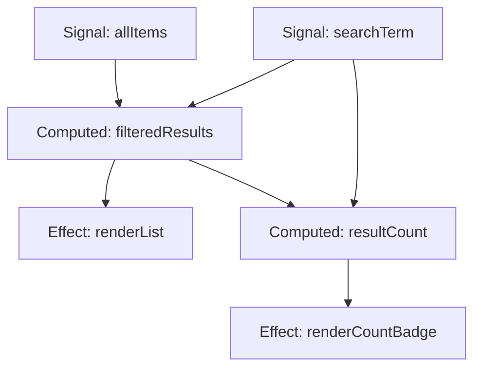

# Signals in Frontend Development: The Reactivity Pattern Reshaping Modern Web Frameworks

State management has always been one of the hardest problems in frontend development. For years, developers relied on virtual DOM diffing, centralized stores, or manual subscriptions to keep the UI in sync with underlying data. In 2026, a cleaner, more granular approach has taken center stage: **Signals**.

Signals are a fine-grained reactivity primitive that allow frameworks to track exactly which piece of state drives which part of the DOM — no virtual DOM diffing required. What started as a niche concept has become the dominant reactivity model adopted by Angular, Solid, Preact, and even influences the direction of React via the compiler.

If you write frontend code and haven't deep-dived into Signals yet, this guide covers the concept from the ground up, compares implementations across frameworks, and shows you how to use them in practice.

## Table of Contents

- [What Are Signals?](#what-are-signals)
- [How Signals Differ from Traditional Reactivity](#how-signals-differ-from-traditional-reactivity)
- [Signals Across Frameworks](#signals-across-frameworks)
- [Deep Dive: How Signal Graphs Work](#deep-dive-how-signal-graphs-work)
- [Building a Minimal Signal System](#building-a-minimal-signal-system)
- [Performance Characteristics](#performance-characteristics)
- [Signals vs. Other State Management Patterns](#signals-vs-other-state-management-patterns)
- [Real-World Example: A Search Autocomplete](#real-world-example-a-search-autocomplete)
- [Adopting Signals in Existing Projects](#adopting-signals-in-existing-projects)
- [Key Takeaways](#key-takeaways)
- [Frequently Asked Questions](#frequently-asked-questions)

## What Are Signals?

A **Signal** is a reactive container that holds a value and automatically notifies its dependents whenever that value changes. Unlike plain variables, signals are observable — the framework (or a custom runtime) knows which effects and derived computations depend on a given signal.

```javascript
// Conceptual signal API
const count = signal(0);

effect(() => {
  console.log(`Count is: ${count()}`);
});

count.value = 5; // Logs: "Count is: 5"
```

The critical insight is **automatic dependency tracking**. You don't declare dependencies explicitly (as with React's dependency arrays) or manually subscribe (as with Observable patterns). The runtime records which signals are read during a computation and re-runs that computation whenever any of them change.

### Core Concepts

| Concept | Description |
|---|---|
| **Signal** | A container holding a reactive value. Read via a getter, write via a setter. |
| **Computed** | A derived signal that recalculates when its input signals change. Pure and lazy. |
| **Effect** | A side-effect function that re-runs whenever the signals it reads change. |
| **Signal Graph** | The dependency graph connecting signals, computed values, and effects. |

## How Signals Differ from Traditional Reactivity

### Virtual DOM Diffing (React, Vue 2)

React's model is straightforward: when state changes, the component function re-executes, producing a new virtual DOM tree. A diffing algorithm compares the old and new trees and patches the real DOM.

This model is simple to reason about but has a fundamental inefficiency: **entire component subtrees re-render even if only a tiny leaf value changed**. React introduced `memo`, `useMemo`, and `useCallback` as escape hatches, but they add complexity and are frequently misused.

### Fine-Grained Reactivity (Signals)

Signals flip this model. Instead of re-running the entire component, only the specific DOM nodes or computations that depend on a changed signal are updated. There is no diffing step because the framework already knows exactly what changed.

```
Virtual DOM approach:     State change → Re-render tree → Diff → Patch DOM
Signals approach:         State change → Notify dependents → Direct DOM update
```

> **Key Insight:** Signals move the cost of dependency tracking to write-time (when a signal is created and its dependencies are recorded) rather than read-time (when the component re-renders). This makes updates O(1) in the best case rather than O(n) in component tree size.

## Signals Across Frameworks

By 2026, nearly every major framework has adopted Signals in some form:

### Angular (`@angular/core/signal`)

Angular introduced signals in v16 and made them the recommended reactivity model by v19. Angular signals integrate tightly with the change detection system, replacing Zone.js for many use cases.

```typescript
import { signal, computed, effect } from '@angular/core/signal';

@Component({ /* ... */ })
export class CounterComponent {
  count = signal(0);
  doubleCount = computed(() => this.count() * 2);

  increment() {
    this.count.update(n => n + 1);
  }
}
```

### SolidJS

Solid was the framework that popularized signals in the modern era. Every piece of reactive state in Solid is a signal, and components run once — only the signal-driven computations re-execute.

```jsx
const [count, setCount] = createSignal(0);

function Counter() {
  return (
    <button onClick={() => setCount(c => c + 1)}>
      Count: {count()}
    </button>
  );
}
```

### Preact (Signals)

Preact added a standalone signals library (`@preact/signals`) that works with any framework or vanilla JS. Its lightweight nature made it one of the most widely adopted signal implementations.

```javascript
import { signal, computed, effect } from '@preact/signals';

const count = signal(0);
const doubled = computed(() => count.value * 2);

document.body.innerHTML = `<button id="btn">Count: ${count}</button>`;
effect(() => {
  document.getElementById('btn').textContent = `Count: ${count.value}`;
});
```

### Vue (Reactive Refs)

Vue's `ref` and `reactive` are conceptually signals, though Vue predates the naming convention. Vue 3.5+ further refined its reactivity system to be even more granular, aligning more closely with the signal graph model.

### Qwik (Signals)

Qwik uses signals as the foundation of its resumability model. Signals allow Qwik to serialize reactive state and resume execution on the client without re-downloading component code.

## Deep Dive: How Signal Graphs Work

Under the hood, Signals form a **directed acyclic graph (DAG)** where nodes are reactive values (signals and computed values) and edges represent dependencies.



When `searchTerm` changes, the graph traversal proceeds:

1. The signal setter marks the signal as "dirty."
2. All direct dependents (computed values) are notified and re-evaluate.
3. If a computed value's output changes, *its* dependents (effects and other computeds) are notified.
4. Effects execute their side effects (typically DOM updates).

This process is **topologically sorted** — computeds always evaluate before the effects that depend on them. The framework may batch multiple signal writes to avoid redundant intermediate computations.

### Glitch-Free Propagation

A common concern with reactive graphs is the **glitch problem**: an effect might observe an inconsistent intermediate state when multiple signals update. Modern signal implementations use one of two strategies:

- **Push-based (push then pull):** After all signals are updated, pull the latest value through the graph. This is what Solid and Angular use.
- **Version vectors:** Each signal carries a monotonically increasing version number. Computeds check whether their inputs have all settled before propagating.

Both approaches ensure effects always see a consistent state.

## Building a Minimal Signal System

Understanding signals deeply means building one. Here's a minimal implementation in under 50 lines:

```javascript
let currentEffect = null;

function signal(initialValue) {
  let value = initialValue;
  const subscribers = new Set();

  const read = () => {
    if (currentEffect) {
      subscribers.add(currentEffect);
      currentEffect.deps.add(subscribers);
    }
    return value;
  };

  read.valueOf = read;
  read.toString = read;

  Object.defineProperty(read, 'value', {
    get: read,
    set(newValue) {
      if (Object.is(value, newValue)) return;
      value = newValue;
      for (const effect of subscribers) effect.schedule();
    },
  });

  return read;
}

function effect(fn) {
  const effect = {
    deps: new Set(),
    schedule() {
      scheduledEffects.add(effect);
      flush();
    },
    run() {
      cleanup(effect);
      currentEffect = effect;
      fn();
      currentEffect = null;
    },
  };
  effect.run();
  return () => cleanup(effect);
}

function cleanup(effect) {
  for (const dep of effect.deps) dep.delete(effect);
  effect.deps.clear();
}

const scheduledEffects = new Set();
let flushScheduled = false;

function flush() {
  if (flushScheduled) return;
  flushScheduled = true;
  queueMicrotask(() => {
    for (const effect of scheduledEffects) effect.run();
    scheduledEffects.clear();
    flushScheduled = false;
  });
}
```

This implementation covers:

- **Automatic dependency tracking** via a global `currentEffect` pointer
- **Batching** via `queueMicrotask`
- **Cleanup** to remove stale dependencies on re-evaluation

Production signal libraries like `@preact/signals` and Solid's reactivity system add scheduling strategies, debugging tools, and memory optimizations, but the core principle is the same.

## Performance Characteristics

Signals provide measurable performance advantages over virtual DOM diffing:

| Metric | Virtual DOM (React) | Signals (Solid/Angular) |
|---|---|---|
| Update granularity | Component subtree | Individual DOM nodes |
| Dependency tracking | Manual (useMemo) | Automatic |
| Re-render cost | O(tree size) | O(1) per signal |
| Memory overhead | Virtual DOM tree | Lightweight graph edges |
| Bundle impact | Framework runtime | Minimal (often < 2KB) |

In benchmarks on large lists (10,000+ rows), signal-based frameworks consistently show **2-10x faster updates** compared to virtual DOM equivalents, with lower memory allocation during updates.

> **Performance Note:** Signals don't make everything faster by default. Poorly structured signal graphs with deep dependencies can still cause cascading recomputations. The key is keeping signal graphs shallow and scoped.

## Signals vs. Other State Management Patterns

### Signals vs. Redux / Zustand / Jotai

Redux and its lightweight successors are **stores** — centralized state containers. They work well for global, shared state but introduce boilerplate and require selectors or subscriptions to connect state to components.

Signals are **distributed** by nature. Each piece of state is its own signal, and the reactivity graph connects them automatically. For component-local state, signals are significantly simpler. For global state, signal libraries often provide a "store" abstraction that groups related signals.

### Signals vs. RxJS / Observables

Observables are the original reactive primitive, but they are **pull-based** and require explicit subscription management. Signals are push-based and automatically track dependencies, making them more ergonomic for UI updates.

| Feature | Observables (RxJS) | Signals |
|---|---|---|
| Dependency tracking | Manual (subscribe, pipe) | Automatic |
| Operator richness | Extensive (map, switch, etc.) | Minimal (computed, effect) |
| Complexity | High (cold vs hot, backpressure) | Low |
| Best for | Async data streams | Synchronous UI state |

### Signals vs. MobX / Valtio

MobX and Valtio use Proxies for fine-grained reactivity, which is conceptually very similar to signals. The main difference is ergonomics: signals use explicit getter/setter functions rather than magic property access through Proxies.

## Real-World Example: A Search Autocomplete

Let's build a search autocomplete that demonstrates signals handling async state, derived computations, and DOM updates:

```javascript
import { signal, computed, effect } from '@preact/signals';

const searchInput = signal('');
const debounceTimer = signal(null);
const results = signal([]);
const isLoading = signal(false);
const error = signal(null);

const filteredResults = computed(() => {
  return results.value.filter(item =>
    item.title.toLowerCase().includes(searchInput.value.toLowerCase())
  );
});

const hasResults = computed(() => filteredResults.value.length > 0);
const resultLabel = computed(() =>
  `${filteredResults.value.length} result${filteredResults.value.length !== 1 ? 's' : ''} found`
);

effect(() => {
  const query = searchInput.value;
  if (query.length < 2) {
    results.value = [];
    isLoading.value = false;
    return;
  }

  isLoading.value = true;
  error.value = null;

  clearTimeout(debounceTimer.value);
  debounceTimer.value = setTimeout(async () => {
    try {
      const res = await fetch(`/api/search?q=${encodeURIComponent(query)}`);
      if (!res.ok) throw new Error('Search failed');
      results.value = await res.json();
    } catch (e) {
      error.value = e.message;
      results.value = [];
    } finally {
      isLoading.value = false;
    }
  }, 300);
});

// DOM rendering (vanilla or framework-agnostic)
effect(() => {
  const list = document.getElementById('results');
  if (isLoading.value) {
    list.innerHTML = '<li class="loading">Searching...</li>';
    return;
  }
  if (error.value) {
    list.innerHTML = `<li class="error">${error.value}</li>`;
    return;
  }
  if (!hasResults.value) {
    list.innerHTML = '<li class="empty">No results found</li>';
    return;
  }
  list.innerHTML = filteredResults.value
    .map(item => `<li>${item.title}</li>`)
    .join('');
});

effect(() => {
  document.getElementById('count').textContent = resultLabel.value;
});
```

Notice how each concern — input, debouncing, fetching, filtering, rendering — is a separate signal or computed value. The dependency graph handles the rest. There's no `useEffect` with a dependency array, no `useState` setter called with a function updater, and no stale closure bugs.

## Adopting Signals in Existing Projects

### Starting with Angular

If you're on Angular 18+, enable signal-based change detection:

```typescript
// In your component
count = signal(0);

// In your template
// <button (click)="count.set(count() + 1)">{{ count() }}</button>
```

For migration, convert one component at a time. Angular's signal API coexists with traditional `@Input` and `@Output` during the transition period.

### Using @preact/signals with React

Preact's signals library works with React components through a lightweight wrapper:

```jsx
import { signal, computed } from '@preact/signals';
import { useSignal } from '@preact/signals-react/runtime';

function SearchBox() {
  const query = useSignal('');
  return (
    <input
      value={query.value}
      onInput={e => query.value = e.target.value}
      placeholder="Search..."
    />
  );
}
```

### Gradual Adoption Strategy

1. **Identify high-frequency updates** — lists, animations, input debouncing, drag-and-drop — as the first candidates for signals.
2. **Convert component-local state** before tackling global stores.
3. **Keep global stores** (Redux, Zustand) for server state and cross-cutting concerns. Signals and centralized stores coexist well.
4. **Measure** before and after. Use React DevTools Profiler, Angular Profiler, or browser Performance tabs to verify improvements.

> **Caution:** Don't rewrite your entire application overnight. Signals shine in specific scenarios — granular updates, animation-heavy components, and real-time data. For simple forms or static pages, the added abstraction may not be worth the migration cost.

## Key Takeaways

- **Signals are fine-grained reactive primitives** that track dependencies automatically and update only the DOM nodes that depend on changed state.
- **Every major frontend framework** (Angular, Solid, Preact, Vue, Qwik) now uses signals or a closely related pattern as their recommended reactivity model.
- **Signals eliminate common React pain points**: stale closures, manual `useMemo`/`useCallback` usage, and unnecessary re-renders of component subtrees.
- **The performance gains are real** — O(1) updates per signal vs. O(tree size) virtual DOM diffing, especially impactful in large lists and real-time UIs.
- **Adopt incrementally.** Start with high-frequency update components, keep global stores for server state, and measure performance before and after.
- **Signal graph structure matters.** Keep graphs shallow, avoid deeply chained computed values, and scope signals to the smallest possible context.

## Frequently Asked Questions

### Are signals the same as React's useState?

No. `useState` triggers a full component re-render when called. Signals update only the specific DOM nodes or computations that depend on them. A component using signals may never re-render its function body at all — only the signal-driven expressions update.

### Can I use signals without a framework?

Yes. `@preact/signals` is framework-agnostic and works in any JavaScript environment. The signal concept is a general pattern, not tied to any specific framework. You can even build a minimal signal system in vanilla JS as shown in this article.

### Do signals support TypeScript?

All major signal libraries ship with full TypeScript support. Signal types are generic: `signal<number>(0)` returns a `Signal<number>` with proper type inference on reads and writes.

### Will signals replace React's model entirely?

Signals don't replace React — they complement or replace its reactivity layer. React's compiler (React Forget) brings automatic memoization which closes much of the gap. The industry trend is toward fine-grained reactivity, but React's ecosystem is massive and its model remains viable for many applications.

### What's the learning curve for signals?

Signals are conceptually simpler than hooks or Redux. The core API is typically 2-3 functions (`signal`, `computed`, `effect`). The main learning investment is understanding the dependency graph model and structuring state to avoid unnecessary recomputation.

## Related Articles

- [Mastering TypeScript: The Bridge to Safer, Scalable JavaScript](/mastering-typescript)
- [Mastering GraphQL: A Practical Guide to Flexible, Type-Safe APIs](/mastering-graphql)
- [VS Code Extensions for Developers: Must-Have Tools for a Faster Workflow](/vs-code-extensions)
