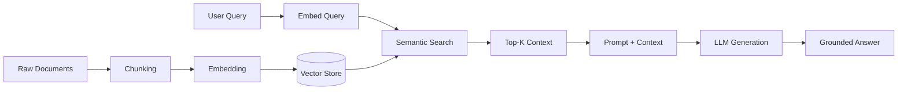
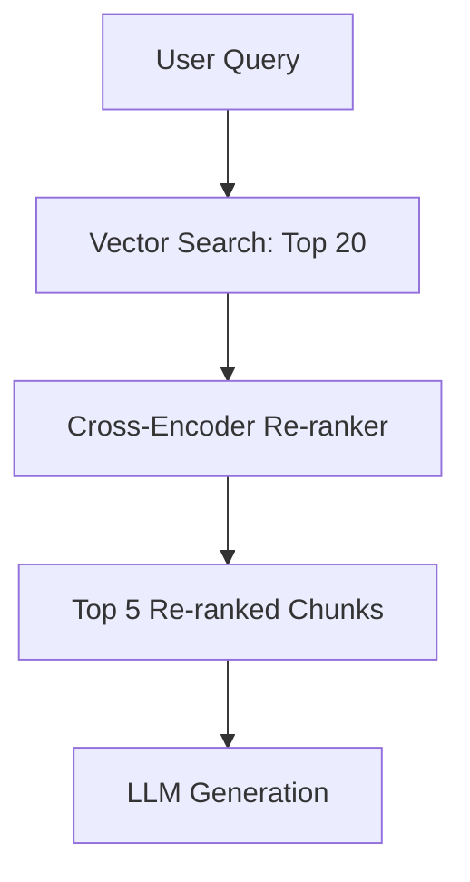

# RAG Explained: A Practical Guide to Building AI-Powered Applications with Retrieval-Augmented Generation

Large language models are powerful, but they have a fundamental limitation: they only know what they learned during training. They hallucinate, they have knowledge cutoff dates, and they cannot access your proprietary data. Retrieval-Augmented Generation — RAG — solves all three of those problems by connecting an LLM to an external knowledge source at query time.

If you are a developer looking to build AI applications that produce accurate, grounded, and up-to-date responses, RAG is the architecture you need to understand. This guide walks you through the core concepts, the architecture, the implementation details, and a real-world example you can start building today.

## Table of Contents

- [Why RAG Exists: The Problem with Pure LLMs](#why-rag-exists-the-problem-with-pure-llms)
- [How RAG Works: The High-Level Architecture](#how-rag-works-the-high-level-architecture)
- [The Indexing Pipeline: Preparing Your Knowledge Base](#the-indexing-pipeline-preparing-your-knowledge-base)
- [The Retrieval Pipeline: Finding Relevant Context](#the-retrieval-pipeline-finding-relevant-context)
- [The Generation Pipeline: Crafting Grounded Answers](#the-generation-pipeline-crafting-grounded-answers)
- [Vector Databases: The Engine Behind Semantic Search](#vector-databases-the-engine-behind-semantic-search)
- [Chunking Strategies That Actually Matter](#chunking-strategies-that-actually-matter)
- [Advanced RAG Techniques](#advanced-rag-techniques)
- [Real-World Example: Building a Documentation Q&A Bot](#real-world-example-building-a-documentation-qa-bot)
- [Evaluation and Observability](#evaluation-and-observability)
- [Key Takeaways](#key-takeaways)
- [Frequently Asked Questions](#frequently-asked-questions)
- [Related Articles](#related-articles)

## Why RAG Exists: The Problem with Pure LLMs

When you ask a vanilla LLM a question about your company's internal API documentation, two things go wrong:

1. **Hallucination** — The model confidently invents an answer because it has never seen your docs.
2. **Staleness** — Even if you fine-tuned the model on your docs last quarter, any update since then is invisible.

Fine-tuning can partially address hallucination for domain knowledge, but it is expensive, slow to iterate, and does not solve the freshness problem. RAG takes a fundamentally different approach: instead of pushing your data *into* the model's weights, you pull relevant data *alongside* the prompt at inference time.

> **Key Insight:** RAG shifts the paradigm from "teach the model everything" to "show the model exactly what it needs, right now." This makes your AI system auditable, updatable, and far more cost-effective.

## How RAG Works: The High-Level Architecture

A RAG system has two distinct phases: **indexing** (offline) and **querying** (online).



**Indexing phase** happens once (and periodically as data changes):

| Step | What Happens | Example |
|------|-------------|---------|
| Load | Ingest source documents | Parse PDFs, scrape pages, query databases |
| Chunk | Split into smaller, overlapping text segments | 512-token chunks with 50-token overlap |
| Embed | Convert each chunk into a numerical vector | OpenAI `text-embedding-3-small` |
| Store | Persist vectors in a vector database | Pinecone, Weaviate, Qdrant, ChromaDB |

**Querying phase** happens every time a user asks a question:

1. The user's query is embedded using the same embedding model.
2. A similarity search finds the top-K most relevant chunks.
3. The chunks are injected into a prompt alongside the user's question.
4. The LLM generates an answer grounded in the retrieved context.

## The Indexing Pipeline: Preparing Your Knowledge Base

### Loading and Parsing

Your documents can come from anywhere — Markdown files, PDFs, HTML pages, databases, Confluence, Notion, or even Slack messages. The key requirement is that you convert them into plain text before chunking.

```python
import os
from pathlib import Path

def load_markdown_files(directory: str) -> list[dict]:
    documents = []
    for path in Path(directory).rglob("*.md"):
        with open(path, "r", encoding="utf-8") as f:
            documents.append({
                "content": f.read(),
                "source": str(path),
                "metadata": {
                    "filename": path.name,
                    "directory": str(path.parent),
                },
            })
    return documents
```

### Chunking

Chunking is where most RAG systems succeed or fail. Too large, and you waste context window tokens on irrelevant text. Too small, and you lose surrounding context that the LLM needs to understand the fragment.

## The Retrieval Pipeline: Finding Relevant Context

### Embedding Models

An embedding model converts a piece of text into a high-dimensional vector — typically 768 to 3072 dimensions — where semantically similar texts end up close together in vector space.

Popular choices in 2026:

| Model | Dimensions | Notes |
|-------|-----------|-------|
| OpenAI `text-embedding-3-small` | 1536 | Good balance of speed and quality |
| OpenAI `text-embedding-3-large` | 3072 | Higher accuracy, higher cost |
| Cohere `embed-v4` | 1024 | Strong multilingual support |
| `bge-large-en-v1.5` | 1024 | Open-source, runs locally |
| `jina-embeddings-v3` | 1024 | Open-source, multi-task |

### Similarity Search

Once you have vectors for both the query and the documents, you need a distance metric. The two most common are **cosine similarity** and **dot product**. Cosine similarity is generally preferred because it normalizes for vector magnitude.

```
cosine_similarity(A, B) = (A · B) / (‖A‖ × ‖B‖)
```

> **Important:** The embedding model you use for indexing *must* be the same model you use for querying. Mixing models produces nonsensical similarity scores.

### Top-K Selection

How many chunks should you retrieve? The answer depends on your LLM's context window and the complexity of the question.

- **K = 3-5** works well for factual, short-answer questions.
- **K = 10-20** is better for complex, multi-part questions.
- Beyond K = 20, you often introduce more noise than signal.

## The Generation Pipeline: Crafting Grounded Answers

The retrieved chunks are combined with the user's question into a prompt. A well-structured RAG prompt looks like this:

```text
You are a helpful assistant. Answer the user's question using ONLY the
context provided below. If the context does not contain enough information
to answer, say "I don't have enough information to answer that."

Context:
---
{chunk_1}
---
{chunk_2}
---
{chunk_3}
---

User question: {query}

Answer:
```

The instruction to use *only* the provided context is critical. Without it, the LLM will fall back to its parametric knowledge and may hallucinate.

## Vector Databases: The Engine Behind Semantic Search

A vector database is purpose-built to store, index, and query high-dimensional vectors efficiently. While you *can* use a flat file and brute-force cosine similarity for a few hundred documents, production systems need an index structure like HNSW (Hierarchical Navigable Small World) to handle millions of vectors with sub-second latency.

### Choosing a Vector Database

| Database | Type | Strengths | Best For |
|----------|------|-----------|----------|
| **ChromaDB** | Embedded / server | Simple, Python-native | Prototyping, small projects |
| **Qdrant** | Server / cloud | Rich filtering, Rust core | Production with complex queries |
| **Pinecone** | Managed cloud | Zero-ops, auto-scaling | Teams without infra bandwidth |
| **Weaviate** | Server / cloud | GraphQL API, hybrid search | Complex data modeling |
| **pgvector** | PostgreSQL extension | Familiar SQL interface | Teams already on Postgres |
| **Milvus** | Distributed | High throughput, sharding | Large-scale systems |

> **Practical Tip:** If your team already runs PostgreSQL, start with `pgvector` before reaching for a dedicated vector database. The operational overhead of adding another database is non-trivial.

## Chunking Strategies That Actually Matter

### Fixed-Size Chunking

The simplest approach: split every N tokens with a sliding window.

```python
def fixed_size_chunk(text: str, chunk_size: int = 512, overlap: int = 50) -> list[str]:
    tokens = text.split()
    chunks = []
    for i in range(0, len(tokens), chunk_size - overlap):
        chunk = " ".join(tokens[i:i + chunk_size])
        chunks.append(chunk)
    return chunks
```

### Recursive Character Splitting

Respects document structure by splitting on paragraph breaks first, then sentence boundaries, then words.

### Semantic Chunking

Uses the embedding model itself to detect topic boundaries. Embed each sentence, then split where the cosine similarity between consecutive sentences drops below a threshold.

### Hybrid Approach

Use markdown-aware splitting for Markdown documents, HTML-aware splitting for web pages, and fall back to recursive character splitting for everything else.

> **Rule of Thumb:** Start with recursive character splitting with a chunk size of 512 tokens and 50-token overlap. Tune from there based on evaluation results — not intuition.

## Advanced RAG Techniques

### Re-ranking

After the initial vector search returns 20 candidates, a cross-encoder model re-scores each chunk against the query. This is slower than vector search but significantly more accurate, because cross-encoders can attend to both the query and the document simultaneously.



### HyDE (Hypothetical Document Embeddings)

Instead of embedding the user's short query directly, you first ask the LLM to generate a *hypothetical answer*, then embed that answer and search for similar real documents. This works because the hypothetical answer lives in the same semantic space as your documents, whereas a terse query might not.

### Query Transformation

Before retrieval, rewrite the user's query to improve search quality:

- **Query decomposition** — Break a complex question into sub-questions.
- **Step-back prompting** — Ask a more abstract version of the question to retrieve broader context.
- **Hybrid search** — Combine vector similarity with keyword search (BM25) for better recall.

### Self-RAG

The LLM decides dynamically whether it needs retrieval, retrieves, then evaluates whether the retrieved context is actually useful before generating an answer. This reduces latency when the model already knows the answer from its parametric knowledge.

## Real-World Example: Building a Documentation Q&A Bot

Let's build a minimal RAG system over your project's Markdown documentation using Python, OpenAI embeddings, and ChromaDB.

### Step 1: Install Dependencies

```bash
pip install openai chromadb tiktoken
```

### Step 2: Index Your Documentation

```python
import chromadb
from openai import OpenAI

client = chromadb.PersistentClient(path="./chroma_db")
collection = client.get_or_create_collection("docs")
openai_client = OpenAI()

def get_embedding(text: str) -> list[float]:
    response = openai_client.embeddings.create(
        model="text-embedding-3-small",
        input=text,
    )
    return response.data[0].embedding

def index_documents(docs: list[dict]):
    for i, doc in enumerate(docs):
        chunks = fixed_size_chunk(doc["content"])
        for j, chunk in enumerate(chunks):
            collection.add(
                ids=[f"doc{i}_chunk{j}"],
                documents=[chunk],
                metadatas=[{"source": doc["source"]}],
                embeddings=[get_embedding(chunk)],
            )
```

### Step 3: Query the System

```python
def rag_query(question: str, top_k: int = 5) -> str:
    query_embedding = get_embedding(question)
    results = collection.query(
        query_embeddings=[query_embedding],
        n_results=top_k,
    )
    context = "\n---\n".join(results["documents"][0])
    response = openai_client.chat.completions.create(
        model="gpt-4o",
        messages=[
            {
                "role": "system",
                "content": (
                    "Answer using only the context provided. "
                    "If insufficient, say so.\n\nContext:\n" + context
                ),
            },
            {"role": "user", "content": question},
        ],
    )
    return response.choices[0].message.content
```

### Step 4: Run It

```python
docs = load_markdown_files("./my-project/docs")
index_documents(docs)
answer = rag_query("How do I configure authentication?")
print(answer)
```

This gives you a fully functional prototype in under 50 lines of code. From here you would add re-ranking, metadata filtering, conversation history, and evaluation.

## Evaluation and Observability

A RAG system that you cannot measure is a RAG system you cannot improve.

### What to Measure

| Metric | What It Captures | How to Compute |
|--------|-----------------|----------------|
| **Context Precision** | Are the retrieved chunks relevant? | Manual labels or LLM-as-judge |
| **Context Recall** | Did retrieval find all necessary information? | Compare against ground-truth answer sources |
| **Answer Faithfulness** | Does the answer stay grounded in context? | LLM-as-judge with citations |
| **Answer Relevance** | Does the answer actually address the question? | LLM-as-judge or human eval |
| **End-to-end latency** | How fast is the full pipeline? | Tracing and timing instrumentation |

> **Common Pitfall:** Most teams only evaluate answer quality and ignore retrieval quality. If your retriever is returning irrelevant chunks, no prompt engineering will fix the downstream answer. Measure retrieval independently.

### Tools for RAG Observability

- **LangSmith** — Trace the full pipeline, log inputs/outputs, score quality.
- **Phoenix (Arize)** — Open-source observability for LLM applications with RAG-specific metrics.
- **RAGAS** — Framework for automated RAG evaluation using LLM-as-judge.

## Key Takeaways

- RAG connects LLMs to external knowledge at query time, eliminating hallucination and knowledge stalency without expensive fine-tuning.
- The architecture has two phases: an offline **indexing pipeline** (chunk, embed, store) and an online **retrieval pipeline** (embed query, search, generate).
- **Chunking strategy** is the highest-leverage decision in your system. Start with recursive character splitting and tune based on evaluation data.
- Use **re-ranking** and **hybrid search** (vector + BM25) when naive vector search does not return sufficiently relevant results.
- **Evaluate retrieval quality separately** from answer quality. A great LLM cannot fix a bad retriever.
- Start simple with ChromaDB and a single embedding model, then add complexity only when your evaluation metrics justify it.

## Frequently Asked Questions

### When should I use RAG instead of fine-tuning?

Use RAG when your data changes frequently, when you need cited answers, or when you want to control exactly what the model sees. Fine-tuning is better when you need to change the model's behavior, tone, or output format in ways that in-context examples cannot achieve. Many production systems use both.

### How much does RAG cost to run?

The dominant cost is the LLM inference on each query. Embedding lookups are cheap (fractions of a cent per query), and vector database hosting is modest. A typical RAG query using GPT-4o-mini with 5 retrieved chunks costs roughly $0.001–$0.005 depending on chunk sizes.

### What chunk size should I use?

512 tokens with 50-token overlap is a solid starting point. If your documents are highly structured (FAQs, API reference), smaller chunks of 256 tokens may perform better. If context continuity matters (legal documents, research papers), try 1024 tokens. Always validate with real evaluation data.

### Can RAG work with non-English languages?

Yes. Multilingual embedding models like Cohere embed-v4, `multilingual-e5-large`, and `jina-embeddings-v3` support 100+ languages. The retrieval pipeline is language-agnostic — the same vector search works regardless of the source language.

### How do I handle documents with tables and images?

Tables and images require specialized preprocessing. For tables, convert them to Markdown or JSON before chunking so the embedding model can capture their structure. For images, use a multimodal embedding model (like CLIP) or extract OCR text and index that instead. Pure text-based RAG loses information when documents are heavily visual.

## Related Articles

- [Mastering GraphQL: A Practical Guide to Flexible, Type-Safe APIs](/blog/mastering-graphql-practical-guide)
- [Mastering TypeScript: The Bridge to Safer, Scalable JavaScript](/blog/mastering-typescript)
- [System Design Handbook: A Practical Guide to Scalable Architectures](/blog/system-design-handbook)
- [AI Agent Hub — One Local Dashboard to Rule All Your AI Coding Tools](/blog/ai-agent-hub)
