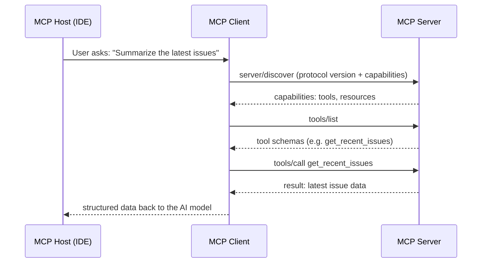

# Model Context Protocol Explained: How to Connect AI Agents to Tools and Data with MCP

Every AI-powered application eventually hits the same wall: the model is smart, but it is trapped inside its context window. It cannot query your database, read a file from your filesystem, talk to your Jira board, or invoke your internal APIs. Before 2024, that meant hand-rolling a different integration for every tool, every client, and every model provider — dozens of bespoke connectors that break the moment the vendor changes something.

The **Model Context Protocol (MCP)** exists to solve exactly that problem. It is an open, JSON-RPC-based standard that lets large language model (LLM) applications connect to external data sources and tools through a single, well-defined interface. Instead of N clients talking to M tools through N×M proprietary glue, every client speaks one protocol and every tool exposes one contract.


This article explains what MCP is, how its host–client–server architecture works, what the core primitives are, how the two transports differ, and walks through building a working MCP server — including the security pitfalls to avoid.

## Table of Contents

- [Why AI Assistants Have a Context Problem](#why-ai-assistants-have-a-context-problem)
- [What Is the Model Context Protocol?](#what-is-the-model-context-protocol)
- [Core Concepts: Hosts, Clients, and Servers](#core-concepts-hosts-clients-and-servers)
- [The Three Server Primitives: Tools, Resources, and Prompts](#the-three-server-primitives-tools-resources-and-prompts)
- [Under the Hood: JSON-RPC, Stateless Requests, and Capability Discovery](#under-the-hood-json-rpc-stateless-requests-and-capability-discovery)
- [Transports: stdio vs Streamable HTTP](#transports-stdio-vs-streamable-http)
- [Real-World Example: Building Your First MCP Server in Python](#real-world-example-building-your-first-mcp-server-in-python)
- [Security and Authorization: Read Before You Expose a Tool](#security-and-authorization-read-before-you-expose-a-tool)
- [When NOT to Use MCP — and the Alternatives](#when-not-to-use-mcp--and-the-alternatives)
- [Key Takeaways](#key-takeaways)
- [Frequently Asked Questions](#frequently-asked-questions)
- [Related Articles](#related-articles)

## Why AI Assistants Have a Context Problem

A foundation model is a prediction engine: given a prompt, it produces tokens. It cannot fetch anything on its own, and everything it "knows" was baked in at training time. For many real products that is simply not enough. A customer-support assistant needs the caller's order history. A code assistant needs the repository's current state. A data analyst needs live metrics, not a hallucinated approximation.

Developers traditionally solved this with one of two approaches:

1. **Fine-tuning or prompt stuffing** — dumping the relevant data into the prompt. Works at small scale, collapses at scale, and re-sends kilobytes (or megabytes) of context on every round trip.
2. **Per-vendor plugins** — a bespoke plugin system per tool and per model provider. Function calling on OpenAI, tools on Anthropic, plugins in an IDE, SDK hooks in Slack. Each is a separate protocol, separate docs, separate maintenance burden.

The second approach is the real killer. Every integration is a bespoke contract that can diverge, bit-rot, and fail silently. What the ecosystem needed was a common connector — a USB-C for AI tooling.

That is precisely the niche MCP fills.

## What Is the Model Context Protocol?

The **Model Context Protocol** is an open protocol that standardizes how LLM applications exchange context and capabilities with external data sources and tools. It specifies:

- a **message format** (JSON-RPC 2.0) for every interaction,
- a fixed set of **primitives** — tools, resources, and prompts — that servers can expose,
- a **capability model** so clients and servers never attempt operations the other side cannot handle, and
- a **transport abstraction** so the same messages can flow over a local process pipe or the public internet.

MCP started as a spec published by Anthropic in late 2024 and quickly grew beyond any single vendor. It now operates under an open governance model with the participation of major AI labs and cloud providers, and the specification is versioned with dated revisions (the current core revision at the time of writing is `2026-07-28`).

MCP is deliberately small. It does not tell you how to write your model logic, how to host your server, or how to structure your application. It only defines the contract **between** the application and the capabilities it needs — the same promise that TCP made for networking or SMTP for email.


> With MCP, the model decides *what* to do, and the protocol decides *how* it asks. Building on a standard contract means tool developers write one server and every MCP-compatible assistant — an IDE, a chat app, a CLI agent — can use it.

## Core Concepts: Hosts, Clients, and Servers

MCP follows a strict three-tier architecture:

| Role | What it is | Responsibility |
| --- | --- | --- |
| **Host** | An AI application — an IDE, desktop assistant, or CLI agent | Creates and manages client instances, handles user authorization, coordinates the LLM integration, and aggregates context |
| **Client** | A connector inside the host | Maintains a 1:1 connection to exactly one server; routes protocol messages bidirectionally; manages subscriptions and notifications |
| **Server** | A program that exposes context and capabilities | Provides tools, resources, and prompts; runs locally or remotely; enforces security constraints |

The key relationship to internalize is that a single host — say, your AI-enabled IDE — may run **many clients**, and each client talks to **exactly one server**. Adding a tenth tool means adding a tenth client/server pair; the host code does not change.



This indirection buys you real isolation: a misbehaving or compromised server is contained behind its own client, its own config, and — for local servers — its own process.

## The Three Server Primitives: Tools, Resources, and Prompts

Servers expose context through exactly three capabilities:

1. **Tools** — executable functions the *model* can call to take action. They may have side effects (writes, deploys, messages). Examples: `create_ticket`, `send_email`, `run_query`.
2. **Resources** — readable data surfaced to either the user or the model. They are meant to be context, not actions: file snapshots, documents, database records, structured logs.
3. **Prompts** — reusable, templated interaction patterns that a *user* can trigger. A prompt is a recipe that assembles a workflow, e.g. "summarize this PR" or "audit this diff for secrets."

| Primitive | Initiated by | Side effects? | Typical example |
| --- | --- | --- | --- |
| Tools | The AI model | Yes | `deploy_service("api")` |
| Resources | User or model reading context | Usually no | `user://me/profile`, `git://repo/status` |
| Prompts | The user | No | "Draft a release notes summary" |

Because resources are generally read-only context and tools can mutate the world, the two are treated differently in the security model — always think of them as separate risk classes. Clients and servers advertise which primitives they support, so neither side surprises the other.

## Under the Hood: JSON-RPC, Stateless Requests, and Capability Discovery

Every MCP message is a **JSON-RPC 2.0** message. Three message shapes exist:

- **Request** — a client asks the server to do something (or vice versa),
- **Response** — the result or error for a request,
- **Notification** — a fire-and-forget signal with no response expected, e.g. a change announcement.

A modern MCP core is **stateless**: every request carries all the information needed to process it, with no long-lived protocol session or handshake to remember. Requests include a `_meta` field with:

- `io.modelcontextprotocol/protocolVersion` **(required)** — the version the client is speaking,
- `io.modelcontextprotocol/clientCapabilities` **(required)** — what the client supports for *this* request,
- `io.modelcontextprotocol/clientInfo` (optional) — client name and version, for logging and diagnostics.

If a required field is missing, the server rejects the request with JSON-RPC error `-32602` (Invalid params). If a client invokes a feature it never declared it supports, the server answers with `MissingRequiredClientCapabilityError` (`-32021`).

Capability discovery is handled by the `server/discover` request. A client can send it before any other call to learn the server's supported protocol versions, its advertised primitives, and its identity. The response is cacheable, so discovery typically happens once, not per request.

A minimal `tools/list` exchange looks like this:

```json
{
  "jsonrpc": "2.0",
  "id": 1,
  "method": "tools/list",
  "params": {
    "_meta": {
      "io.modelcontextprotocol/protocolVersion": "2026-07-28",
      "io.modelcontextprotocol/clientCapabilities": {
        "tools": {}
      },
      "io.modelcontextprotocol/clientInfo": {
        "name": "my-ide",
        "version": "1.4.2"
      }
    }
  }
}
```

The server replies with the array of tool definitions — name, description, and a JSON Schema describing the parameters — and the client hands those schemas to the model. The model picks a tool, and the client sends `tools/call` with real arguments. That is the entire loop, and it is identical regardless of whether the tool is a calculator or a Kubernetes operator.

For long-running or interactive operations, the current core defines **Multi Round-Trip Requests (MRTR)**: a server that needs additional client input can return `input_required` with a list of `inputRequests`, the client gathers the missing input, and the original request is retried with `inputResponses`. Long-running background work — deployments, batch jobs, long queries — is the domain of the optional **Tasks extension**, which provides task handles and `tasks/get` / `tasks/update` lifecycle calls.

## Transports: stdio vs Streamable HTTP

The transport layer is where bytes actually travel. MCP standardizes two transports today:

| | **stdio** | **Streamable HTTP** |
| --- | --- | --- |
| Best for | Local servers launched as subprocesses | Remote, distributed, or multi-tenant servers |
| Connection | Client spawns the server process; messages over stdin/stdout | HTTP POST per request, optional Server-Sent Events (SSE) responses |
| Framing | One newline-delimited JSON message per line | HTTP requests + `text/event-stream` responses |
| Scale | Typically one client per server | Many clients per server, load-balancer friendly |
| Security | OS permissions, environment credentials | HTTPS, OAuth, API keys, custom headers |
| Status | Supported | Recommended for remote |

**stdio in practice.** The client starts your server as a child process and speaks over its standard streams. A few rules are absolute: every message must be a complete JSON-RPC message on a single line and must not contain embedded newlines; the server must **never** write non-MCP content to `stdout` (that corrupts the protocol); and `stderr` is reserved for logging. Cancellation is done with a `notifications/cancelled` message referencing the in-flight request ID. When the client closes the server's `stdin`, the server should exit promptly.

**Streamable HTTP in practice.** Every JSON-RPC message is a new HTTP POST to a single endpoint. Notifications get `202 Accepted` and no body. Requests return either `application/json` (a plain response) or `text/event-stream` (progress notifications, then the final response). Closing the SSE stream doubles as the cancellation signal. Since the modern core is stateless, requests can land on different instances behind a load balancer — no sticky sessions required. Servers should send SSE keep-alive comment lines (lines starting with `:`) to defeat idle timeouts and set `X-Accel-Buffering: no` to prevent proxy buffering of streams.

The older HTTP + SSE transport (which relied on a session-based, dual-endpoint design) is deprecated; new production integrations should target Streamable HTTP.

## Real-World Example: Building Your First MCP Server in Python

Let's build a small but complete MCP server with the official Python SDK's `FastMCP` helper, which hides the JSON-RPC plumbing behind decorators. We'll expose:

- a **tool** that looks up the latest issues for a project,
- a **resource** that exposes the current user's profile.

Install the SDK first:

```bash
pip install "mcp[cli]"
```

Then create `issues_server.py`:

```python
from mcp.server.fastmcp import FastMCP

mcp = FastMCP("issues-server")

ISSUES = [
    {"id": 101, "title": "Login page times out at 5k users", "status": "open"},
    {"id": 102, "title": "Flaky invoice PDF export", "status": "in_progress"},
    {"id": 103, "title": "Dark mode leaks into print CSS", "status": "open"},
]


@mcp.tool()
def list_issues(status: str = "open") -> list[dict]:
    """Return issues, optionally filtered by status."""
    if status:
        return [i for i in ISSUES if i["status"] == status]
    return ISSUES


@mcp.resource("user://me/profile")
def current_profile() -> dict:
    """Expose the current user profile as context."""
    return {"name": "Ada", "role": "platform engineer", "team": "Core"}


if __name__ == "__main__":
    mcp.run()
```

That's the entire server. Run it in stdio mode:

```bash
python issues_server.py
```

Then connect it to an MCP host. Command-line tools and IDEs typically let you register a server by giving it a name and the command that launches it:

```json
{
  "mcpServers": {
    "issues-server": {
      "command": "python",
      "args": ["issues_server.py"]
    }
  }
}
```

A few details worth noticing about this example:

1. The tool's Python type hints and docstring become the **JSON Schema** the model sees, so write them like API documentation.
2. The resource id `user://me/profile` uses the `user://` URI scheme, making it discoverable and readable without invoking code.
3. There is zero networking code, no message parsing, no version negotiation — the SDK handles all of it.

To turn the same server into a remotely hosted one, the SDK can run it over Streamable HTTP (typically behind a web framework), where it becomes subject to OAuth and authorization requirements instead of local OS permissions.

## Security and Authorization: Read Before You Expose a Tool

MCP significantly lowers the cost of connecting AI to your systems. It also dramatically lowers the cost of *exposing* those systems, which means security is now entirely your job.

> A tool is not documentation. A tool is arbitrary code that runs with the privileges of the server process. Every `tools/call` from a model is closer to a user executing a command than a user reading a page — treat it the same way you would treat giving shell access.

Concretely, the guidance for production deployments:

- **stdio servers**: The process runs as your OS user with your filesystem access. Launch only servers you trust, and give them a dedicated, least-privilege user where possible. Credentials come from the environment, never from the protocol.
- **Streamable HTTP servers**: Implement real authentication and authorization. The protocol recommends OAuth for obtaining tokens; support bearer tokens, API keys, or custom headers as policy dictates. Enable HTTPS everywhere, validate origins, and authorize **per tool**, not per connection — a client that can call `list_issues` must not automatically be allowed to call `delete_issue`.
- **Assume the model may be tricked**: prompt injection can steer a model into invoking a tool it should not (this is sometimes called "confused deputy" in this context). Wrap destructive tools in explicit confirmation flows and audit every call.
- **Prefer resources for read access**: if something is data, expose it as a resource rather than a tool, so it cannot be misused for side effects.
- **Design for idempotency**: since requests can be retried across instances (or after a stdio process restart), operations like email sends or payments need application-level idempotency keys — the protocol gives you no session to lean on.

MCP also ships with deprecations you should respect in new code: legacy Sampling and Roots are deprecated (integrate directly with your model provider and pass paths through tool arguments instead), and protocol-level Logging is deprecated in favor of `stderr` for stdio servers or OpenTelemetry for distributed ones.

## When NOT to Use MCP — and the Alternatives

MCP is not a silver bullet, and it is not the only pattern in town:

- **Function calling / tool calling** provided natively by your model provider remains the simplest choice when you have exactly one application and one provider, and no intention of opening the tools to other clients. MCP's value is portability; without that need, the native API is less code.
- **Plain REST/gRPC APIs** are the right interface if the consumers are *always* other servers, never AI agents. MCP's client-host architecture is optimized for interactive LLM applications, not machine-to-machine integration at scale.
- **Plugin systems inside a single product** (an IDE, a chat app) may be all you need while you stay closed. MCP is a protocol, not a plugin marketplace — it standardizes the wire contract, but you still own packaging, discovery, and distribution.
- For very high-frequency, low-latency context, keep the hot path in-process and only export coarse-grained operations over MCP rather than thousands of tiny tool calls.

The rule of thumb: if the same capabilities need to be reused across multiple AI clients and providers with minimal rework, MCP pays off quickly. If you have a single tight integration, evaluate the leaner alternatives first.

## Key Takeaways

- MCP is an open, JSON-RPC 2.0-based protocol that standardizes how LLM applications connect to external tools, resources, and prompts — one server contract reusable across every MCP-compatible client.
- The architecture is host → clients → servers, where each client holds a 1:1 connection to exactly one server, which keeps capabilities and security boundaries isolated.
- Servers expose three primitives — **tools** (actionable, side effects), **resources** (read-only context), and **prompts** (templated user workflows) — and must advertise them so clients never attempt unsupported operations.
- Modern MCP is **stateless**: every request carries its protocol version and client capabilities in `_meta`, and `server/discover` provides optional, cacheable capability discovery.
- Two transports matter: **stdio** for local subprocess servers (newline-delimited JSON, logging on stderr) and **Streamable HTTP** for remote servers (POST + SSE, OAuth and per-tool authorization).
- Treat every exposed tool as executable code, design idempotently, and prefer resources for read-only data — models can be steered, so destructive operations need confirmation and audit trails.

## Frequently Asked Questions

**Is MCP owned by a single company?**
No. MCP began as an Anthropic-published specification but operates under an open governance model with broad industry participation across major AI labs, cloud providers, and tool vendors. The specification is public and versioned by date.

**What is the difference between MCP and function calling?**
Function calling is a vendor-specific feature where a model returns a structured call that the client executes. MCP is a neutral, cross-vendor protocol that standardizes the *discovery and invocation* of those capabilities.

**Does MCP require running my own server hardware?**
No. Servers run wherever you choose: locally as a child process over stdio (great for filesystem and developer tools) or remotely over Streamable HTTP (great for shared services like issue trackers, observability platforms, and databases).

**Must every MCP server implement all three primitives?**
No. Servers implement exactly the capabilities they need. The protocol negotiates what each side supports, and clients must never use a capability the server has not advertised.

**Is MCP stateless?**
The protocol core is stateless: each request is self-contained and carries version and capability metadata, so requests can be routed freely and retried after restarts. Application-level state that must survive across requests — carts, jobs, handles — must be managed by your own application with explicit identifiers.

## Related Articles

- [RAG Explained: A Practical Guide to Building AI-Powered Applications with Retrieval-Augmented Generation](https://example.com/blog/rag-explained)
- [WebAssembly Beyond the Browser: A Practical Guide to WASM in 2026](https://example.com/blog/webassembly-beyond-the-browser)
- [Mastering GraphQL: A Practical Guide to Flexible, Type-Safe APIs](https://example.com/blog/mastering-graphql)
