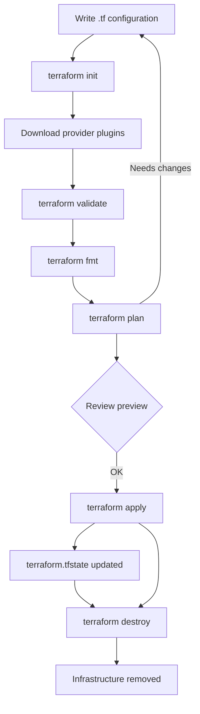
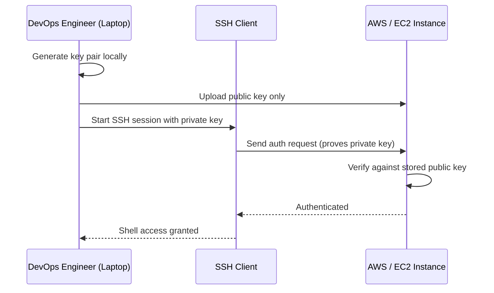

# Terraform Basics for DevOps Engineers: A Practical Introduction

Modern cloud infrastructure is complex. Spinning up an EC2 instance, wiring a VPC, creating security groups, and provisioning storage by clicking through the AWS console works for a single server, but it collapses the moment a team of engineers needs to build the same environment dozens of times, in different regions, without a single click going wrong.

Terraform, from HashiCorp, solves exactly this problem. It treats infrastructure as code — meaning your servers, networks, security groups, and cloud resources are defined in plain, reviewable, versionable files instead of being created by hand. This article is a hands-on primer for DevOps engineers who want to understand the fundamentals of Terraform: what Infrastructure as Code (IaC) really means, how the core workflow operates, and how to build your first resources with providers, variables, outputs, and remote state.

Everything covered here is drawn directly from the source study document, *Terraform Basics for DevOps Engineers*.


## Table of Contents

- [What Is Infrastructure as Code?](#what-is-infrastructure-as-code)
- [Why Terraform Is Widely Used](#why-terraform-is-widely-used)
- [The Terraform Language: HCL and .tf Files](#the-terraform-language-hcl-and-tf-files)
- [The Core Terraform Workflow](#the-core-terraform-workflow)
- [State Management: The terraform.tfstate File](#state-management-the-terraformtfstate-file)
- [Your First Resource: The Provider and EC2 Example](#your-first-resource-the-provider-and-ec2-example)
- [Using Variables to Avoid Hardcoding](#using-variables-to-avoid-hardcoding)
- [Provisioners: Only When Needed](#provisioners-only-when-needed)
- [SSH Keys: How Access Actually Works](#ssh-keys-how-access-actually-works)
- [Outputs: Surfacing Important Values](#outputs-surfacing-important-values)
- [Remote Backends: Sharing State Across Teams](#remote-backends-sharing-state-across-teams)
- [Key Takeaways](#key-takeaways)
- [Frequently Asked Questions](#frequently-asked-questions)
- [Related Articles](#related-articles)

## What Is Infrastructure as Code?

Infrastructure as Code (IaC) means defining your servers, networks, security groups, and cloud resources using code instead of clicking manually in the console. The promise of IaC is straightforward but powerful: it brings **consistency, automation, version control, and repeatability** to infrastructure.

Before IaC, provisioning typically meant a human operator opening a web console, selecting a machine size, choosing an Amazon Machine Image (AMI), and noting down the resulting IP address in a spreadsheet. Every deployment was a slightly different snowflake. With IaC, the same code produces the same infrastructure every single time, in any environment, on demand.

### Provisioning vs. Configuration Management

A common source of confusion for newcomers is the difference between the two halves of automation tooling:

| Concern | Tools | What They Handle |
| --- | --- | --- |
| System configuration | Ansible, Puppet, Chef | Packages, services, files |
| Infrastructure provisioning | Terraform | EC2, VPC, S3, IAM, RDS, and more |

Terraform focuses on the *provisioning* layer: creating the cloud building blocks themselves. Configuration management tools like Ansible, Puppet, and Chef focus on what happens *inside* those machines once they exist — installing packages, managing services, and laying down configuration files.

> Together, both tool families automate the full pipeline. Terraform creates the EC2 instance, and Ansible (or Puppet or Chef) configures what runs on it. They are complements, not competitors.

The source document captures this division clearly: Terraform handles infrastructure provisioning for resources like EC2, VPC, S3, IAM, and RDS, while tools like Ansible, Puppet, and Chef handle system configuration.

## Why Terraform Is Widely Used

Terraform has become one of the most popular IaC tools in the industry. The source document lists the key reasons:

- **Works with almost every cloud** — AWS, Azure, GCP, and OCI, plus many third-party services, are all supported through providers.
- **Infrastructure becomes version-controlled** — your entire environment is expressed as text files that live in Git, alongside your application code.
- **Consistent, repeatable deployments** — teams get the same environment every time, eliminating manual drift between engineers.
- **No drift** — Terraform maintains state of what it created, so it always knows what infrastructure it is responsible for.
- **Easy to destroy or recreate infra in minutes** — the same definition used to build an environment can tear it down or rebuild it.

That last point deserves emphasis. Because everything is defined in code, destroying a stale test environment and recreating it fresh is a matter of running a couple of commands rather than hunting through the console for orphaned resources.

## The Terraform Language: HCL and .tf Files

Terraform uses **HCL** (HashiCorp Configuration Language), not JSON. Configuration files end with the `.tf` extension. HCL is designed to be human-readable while still being expressive enough to describe complex cloud resources.

A typical Terraform configuration is split across multiple `.tf` files to keep things organized. The source document uses this structure:

```text
provider.tf      →  the provider block and credentials/region settings
vars.tf          →  variable declarations and defaults
instance.tf      →  the actual resource definitions, such as EC2 instances
```

Because files are plain text, they can be diffed, reviewed in pull requests, and audited like any other code in your repository.

## The Core Terraform Workflow

Every Terraform project follows the same lifecycle. The source document lists six commands that form the backbone of the workflow:

| Command | Purpose |
| --- | --- |
| `terraform init` | Download provider plugins |
| `terraform validate` | Syntax check |
| `terraform fmt` | Format code |
| `terraform plan` | Preview changes (adds, updates, deletes) |
| `terraform apply` | Deploy infrastructure |
| `terraform destroy` | Delete infrastructure |

The workflow below visualizes how these commands chain together in a typical provisioning cycle:



### Stepping Through the Commands

1. **`terraform init`** — The starting point for any Terraform project. It downloads the provider plugins required by your configuration (for example, the AWS provider).
2. **`terraform validate`** — A quick syntax and configuration check that catches errors before you attempt a deployment.
3. **`terraform fmt`** — Automatically formats your code to the canonical HCL style, keeping the codebase tidy and consistent across the team.
4. **`terraform plan`** — Produces a preview of the changes Terraform intends to make: which resources will be added, updated, or deleted. This is your safety net.
5. **`terraform apply`** — Executes the plan and deploys the infrastructure. Terraform records what it creates.
6. **`terraform destroy`** — Tears down the infrastructure Terraform previously created.

> **Caution:** Always run `terraform plan` and review the output before `terraform apply`. A plan tells you exactly what will be added, updated, or deleted — and it is far easier to cancel a bad plan than to undo a bad deployment.

## State Management: The terraform.tfstate File

When Terraform applies a configuration, it saves details about the infrastructure it created in a file named `terraform.tfstate`. This state file is the source of truth for everything Terraform manages: it maps your configuration to the real resources that exist in the cloud.

Two rules about the state file are non-negotiable:

1. **Never edit it manually.** The state file is machine-generated and contains a serialized snapshot of your infrastructure. Hand-editing it will corrupt Terraform's view of the world and can lead to destroyed or duplicated resources.
2. **Treat it as sensitive.** It can contain resource IDs, metadata, and other information about your environment, so it should be handled and stored carefully.

The biggest challenge with state is collaboration. If every engineer on a team keeps a local `terraform.tfstate`, their copies will quickly diverge and conflict. That is exactly the problem the remote backend solves, covered later in this article.

## Your First Resource: The Provider and EC2 Example

Let's put the workflow into practice with the simplest complete example from the source document: creating a single EC2 instance on AWS.

### The Provider Block

Every Terraform configuration that talks to a cloud must declare a provider. For AWS, the provider block looks like this:

```hcl
provider "aws" {
  region = "us-east-1"
}
```

The provider tells Terraform which cloud platform to talk to and sets defaults such as the region. `terraform init` uses this block to download the AWS provider plugin.

### The EC2 Resource

With the provider declared, you define an EC2 instance as a resource:

```hcl
resource "aws_instance" "demo" {
  ami           = "ami-0440d3b780d96b29d"
  instance_type = "t2.micro"
  key_name      = "mykey"
}
```

Here the block declares:

- **`resource`** — the Terraform type that manages a single cloud object.
- **`"aws_instance"`** — the resource type, provided by the AWS provider.
- **`"demo"`** — the logical name Terraform uses to refer to this instance inside the configuration.
- **`ami`** — the Amazon Machine Image ID the instance boots from.
- **`instance_type`** — the hardware size, here the free-tier-friendly `t2.micro`.
- **`key_name`** — the SSH key pair used to access the instance.

## Using Variables to Avoid Hardcoding

Hardcoding values such as regions, instance types, and key names directly inside resources works for a demo, but it makes configurations rigid. If you want to deploy the same setup to another region or use a bigger instance, you would have to edit multiple files.

Terraform solves this with **variables**. The source document splits the configuration into three files.

### Declaring Variables in vars.tf

```hcl
variable "REGION" { default = "us-east-1" }
variable "TYPE"   { default = "t2.micro" }
variable "KEY"    { default = "mykey" }
```

Each `variable` block declares a name and an optional default value. If a default is present, the variable can be used without requiring user input; otherwise, Terraform will prompt for a value during `apply`.

### Referencing Variables in provider.tf

```hcl
provider "aws" {
  region = var.REGION
}
```

### Using Variables in instance.tf

```hcl
resource "aws_instance" "demo" {
  ami           = "ami-0440d3b780d96b29d"
  instance_type = var.TYPE
  key_name      = var.KEY
}
```

Now the region, instance type, and key name are defined in exactly one place. Changing an environment is a matter of changing a default value — or overriding it at the command line, environment variable, or variable file — rather than hunting through resource definitions.

## Provisioners: Only When Needed

Terraform is a provisioning tool, not a configuration management tool. Still, there are times when you need to run a small script or copy a file as part of the deployment. For those cases, Terraform offers **provisioners** that run during resource creation. The source document is explicit about the guidance: use them **only when needed**.

Three provisioner types are covered:

| Provisioner | What It Does |
| --- | --- |
| `file` | Copies files to the instance |
| `remote-exec` | Runs commands inside the instance |
| `local-exec` | Runs commands on your local machine |

### Example: The file Provisioner

```hcl
provisioner "file" {
  source      = "web.sh"
  destination = "/tmp/web.sh"
}
```

This copies `web.sh` from your machine to `/tmp/web.sh` on the target instance. The `remote-exec` and `local-exec` provisioners follow the same pattern, differing only in where the commands execute.

> **Note:** The source document warns that provisioners should be a last resort. For anything beyond simple bootstrap scripts, prefer a proper configuration management tool (Ansible, Puppet, or Chef) that runs after Terraform has provisioned the infrastructure.

## SSH Keys: How Access Actually Works

To log into an EC2 instance, you need SSH keys. The source document spells out the correct flow, which is a common source of confusion:

1. **Generate the key pair locally** — you end up with a private key and a public key.
2. **Upload the public key to AWS** — the cloud stores the public half.
3. **Use the private key on your laptop** to SSH into the instance.

This is deliberately *not* the reverse. The private key never leaves your machine; only the public key is uploaded to AWS. When you connect, the SSH client proves possession of the private key, and AWS verifies it against the stored public key.

The process can be visualized as:



The `key_name = "mykey"` attribute in your EC2 resource references the key pair you uploaded.

## Outputs: Surfacing Important Values

After a deployment, you often need to know certain values — most importantly, the public IP address of your new instance. Rather than digging through the console or the state file, you declare an **output**.

```hcl
output "instance_ip" {
  value = aws_instance.demo.public_ip
}
```

This example references the `demo` resource's `public_ip` attribute and exposes it when `terraform apply` finishes. Outputs are also useful for chaining configurations — one module's output can become another module's input.

## Remote Backends: Sharing State Across Teams

As mentioned earlier, the biggest practical problem with the local `terraform.tfstate` file is collaboration. If each engineer runs `terraform apply` with their own local copy of the state, their views of the infrastructure diverge, leading to conflicts and accidental changes.

The solution is a **remote backend**. The source document shows an S3-backed backend:

```hcl
terraform {
  backend "s3" {
    bucket = "my-terraform-bucket"
    key    = "backend/statefile"
    region = "us-east-1"
  }
}
```

With this configuration, Terraform reads and writes state to the specified S3 bucket instead of a local file. The benefits are direct:

- **Shared state** — everyone on the team works against the same state file.
- **Conflict avoidance** — teams no longer clobber each other's infrastructure.
- **Durability** — state lives in cloud storage rather than on an engineer's laptop.

> **Note:** The source document does not cover S3 backend locking or DynamoDB for state locking. In real production setups, locking is commonly added to prevent concurrent applies, but that topic is beyond the scope of the source material.

## Key Takeaways

- Infrastructure as Code defines servers, networks, security groups, and cloud resources in code, delivering consistency, automation, version control, and repeatability.
- Terraform handles infrastructure provisioning (EC2, VPC, S3, IAM, RDS), while Ansible, Puppet, and Chef handle system configuration — together they automate the full pipeline.
- Configurations are written in HCL inside `.tf` files, and the core workflow is `init`, `validate`, `fmt`, `plan`, `apply`, and `destroy`.
- The `terraform.tfstate` file records what Terraform created and must never be edited manually; using variables avoids hardcoding values across your configuration.
- Provisioners (`file`, `remote-exec`, `local-exec`) run scripts or copy files but should be used only when needed, with configuration management tools preferred for anything heavier.
- Upload the public half of your SSH key pair to AWS and keep the private key on your laptop, and share state safely across teams with a remote backend such as S3.

## Frequently Asked Questions

**What is the difference between Terraform and Ansible?**
Terraform provisions infrastructure — creating resources like EC2, VPC, S3, IAM, and RDS. Ansible (along with Puppet and Chef) handles system configuration — packages, services, and files. The source document notes that both together automate the full pipeline.

**Why does Terraform use HCL instead of JSON?**
Terraform uses HCL (HashiCorp Configuration Language) because it is designed to be human-readable while still being expressive enough to define cloud infrastructure. Configuration files end with the `.tf` extension.

**What happens if I edit terraform.tfstate manually?**
You should never edit the state file manually. It is Terraform's source of truth for what it created; hand-editing it can corrupt that mapping and lead to accidental deletion or duplication of resources. The source document is unambiguous on this point.

**How do I avoid hardcoding values like region or instance type?**
Declare them as variables in `vars.tf` with defaults, then reference them with `var.NAME` in your `provider` and `resource` blocks. This keeps each value defined in a single, easily changeable place.

**How do teams share Terraform state without conflicts?**
Use a remote backend, such as the S3 backend shown in the source document. Storing state in a shared bucket ensures everyone works against the same state file and avoids the conflicts that come from divergent local copies.

## Related Articles

- [Ansible vs. Terraform: Where Each Tool Fits in Your DevOps Pipeline](#)
- [Managing AWS Security Groups as Code with Terraform](#)
- [A Guide to Terraform Remote State and Backends](#)
