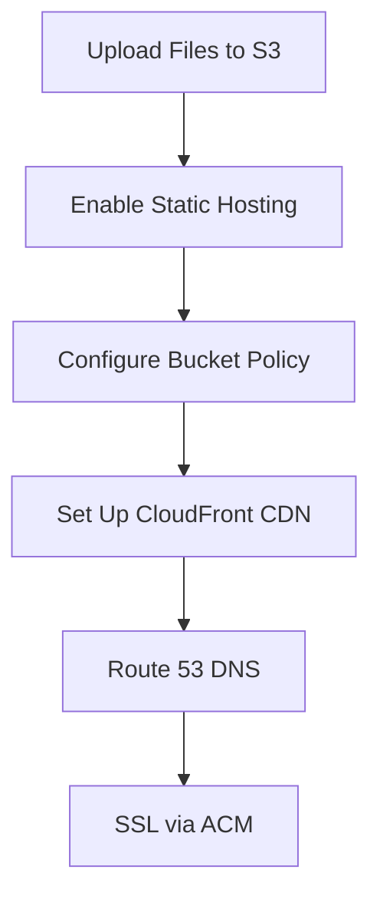
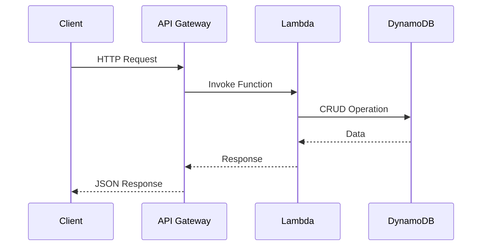
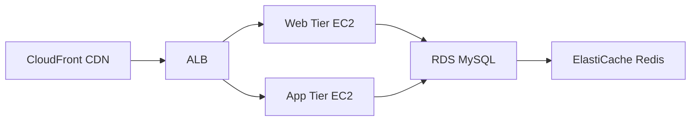

# Ultimate Guide to AWS Projects for Cloud Engineers

*Reading time: 3 min · 606 words*

> This comprehensive guide covers over 50 real-world AWS projects across web hosting, serverless applications, infrastructure as code, security, and CI/CD pipelines. Each project includes step-by-step implementation details to help cloud engineers build practical AWS skills.


*Image credit: [Wikimedia Commons](https://commons.wikimedia.org/wiki/File:AWS_Graviton_logo.jpg)*

## Table of Contents
- [Introduction to AWS Projects](#introduction-to-aws-projects)
- [Web Hosting & Deployment Projects](#web-hosting--deployment-projects)
  - [Project 1: Static Website on S3 with CloudFront](#project-1-static-website-on-s3-with-cloudfront)
  - [Project 2: WordPress on AWS Lightsail](#project-2-wordpress-on-aws-lightsail)
- [Serverless Application Projects](#serverless-application-projects)
  - [Project 6: Serverless API with Lambda & API Gateway](#project-6-serverless-api-with-lambda--api-gateway)
  - [Project 12: Serverless Image Resizer](#project-12-serverless-image-resizer)
- [Infrastructure as Code Projects](#infrastructure-as-code-projects)
  - [Project 1: Terraform AWS Infrastructure](#project-1-terraform-aws-infrastructure)
  - [Project 3: AWS CDK Deployment](#project-3-aws-cdk-deployment)
- [Security & IAM Projects](#security--iam-projects)
  - [Project 2: AWS Secrets Manager](#project-2-aws-secrets-manager)
  - [Project 8: AWS WAF Protection](#project-8-aws-waf-protection)
- [CI/CD Pipeline Projects](#cicd-pipeline-projects)
  - [Project 1: AWS CodePipeline](#project-1-aws-codepipeline)
  - [Project 4: GitOps with ArgoCD on EKS](#project-4-gitops-with-argocd-on-eks)
- [Real-World Example: Multi-Tier Application](#real-world-example-multi-tier-application)
- [Conclusion](#conclusion)

## Introduction to AWS Projects

Amazon Web Services (AWS) offers over 200 cloud services that enable developers and DevOps engineers to build scalable, secure, and high-performance applications. This guide organizes practical AWS projects into key categories:

1. Web Hosting & Deployment
2. Serverless Applications
3. Infrastructure as Code (IaC)
4. Security & IAM
5. CI/CD Pipelines
6. Database Solutions
7. Monitoring & Analytics

## Web Hosting & Deployment Projects

### Project 1: Static Website on S3 with CloudFront


Key Steps:
1. Create S3 bucket with public access
2. Enable static website hosting
3. Configure bucket policy:
```json
{
  "Version": "2012-10-17",
  "Statement": [
    {
      "Effect": "Allow",
      "Principal": "*",
      "Action": "s3:GetObject",
      "Resource": "arn:aws:s3:::your-bucket/*"
    }
  ]
}
```
4. Set up CloudFront distribution
5. Connect custom domain via Route 53

> **Note:** Always enable HTTPS and configure proper caching headers for production sites.

### Project 2: WordPress on AWS Lightsail
Lightsail provides simplified virtual servers perfect for WordPress:
1. Choose WordPress blueprint
2. Select instance size ($5/month for starters)
3. Connect via SSH to retrieve credentials:
```bash
cat bitnami_application_password
```
4. Configure static IP and domain
5. Enable SSL with Let's Encrypt

## Serverless Application Projects

### Project 6: Serverless API with Lambda & API Gateway


Implementation Steps:
1. Create Lambda function (Python/Node.js)
2. Set up API Gateway REST API
3. Configure resource methods (GET/POST)
4. Test with Postman/cURL

### Project 12: Serverless Image Resizer
Automatically resize images uploaded to S3:
1. Create source/destination S3 buckets
2. Write Lambda function with Sharp library
3. Configure S3 event trigger
4. Set IAM permissions

## Infrastructure as Code Projects

### Project 1: Terraform AWS Infrastructure
Sample Terraform for VPC, EC2, RDS:
```hcl
resource "aws_vpc" "main" {
  cidr_block = "10.0.0.0/16"
}

resource "aws_instance" "web" {
  ami           = "ami-0c55b159cbfafe1f0"
  instance_type = "t3.micro"
  vpc_security_group_ids = [aws_security_group.web.id]
}

resource "aws_db_instance" "default" {
  engine         = "mysql"
  instance_class = "db.t3.micro"
}
```

### Project 3: AWS CDK Deployment
TypeScript example for App Runner:
```typescript
new apprunner.Service(this, 'Service', {
  source: apprunner.Source.fromEcr({
    imageConfiguration: { port: 8080 },
    repository: ecr.Repository.fromRepositoryArn(...)
  })
});
```

## Security & IAM Projects

### Project 2: AWS Secrets Manager
Secure credential storage workflow:
1. Store database credentials
2. Retrieve via SDK:
```python
import boto3
client = boto3.client('secretsmanager')
secret = client.get_secret_value(SecretId='db-creds')
```
3. Automate rotation with Lambda

### Project 8: AWS WAF Protection
Critical WAF rules to enable:
1. SQL injection prevention
2. XSS attack blocking
3. Rate limiting
4. Bad bot protection

## CI/CD Pipeline Projects

### Project 1: AWS CodePipeline
Pipeline stages:
1. Source (GitHub/CodeCommit)
2. Build (CodeBuild)
3. Deploy (ECS/EC2/Lambda)

### Project 4: GitOps with ArgoCD on EKS
Kubernetes deployment workflow:
1. Set up EKS cluster
2. Install ArgoCD
3. Configure app-of-apps pattern
4. Enable auto-sync

## Real-World Example: Multi-Tier Application
Architecture diagram:


Implementation steps:
1. VPC with public/private subnets
2. NAT Gateway for outbound traffic
3. Security groups for each tier
4. Auto Scaling groups
5. Database read replicas

## Conclusion
This guide covered practical AWS projects across multiple domains. Start with foundational projects like static websites before progressing to complex architectures like event-driven microservices. Focus on security and automation from the beginning to build production-ready solutions.

## Frequently Asked Questions

**Q: Which AWS project is best for beginners?**

A: Start with Project 1 (Static Website on S3) or Project 2 (WordPress on Lightsail) to learn core AWS concepts.

**Q: How do I secure my AWS projects?**

A: Always implement IAM least privilege, enable MFA, use AWS WAF, and follow the security projects in section 4.

**Q: What's the difference between ALB and NLB?**

A: ALB (Layer 7) is best for HTTP/HTTPS traffic with path-based routing. NLB (Layer 4) handles TCP/UDP for high-performance use cases.

**Q: How much will these AWS projects cost?**

A: Many projects stay within Free Tier limits. Use the AWS Pricing Calculator to estimate costs for larger deployments.

**Q: Should I learn Terraform or CloudFormation first?**

A: Terraform is more widely used across clouds, but CloudFormation integrates tightly with AWS. Learn both for maximum flexibility.

## Key Takeaways

- Master S3 static hosting with CloudFront CDN for global performance
- Implement serverless architectures using Lambda, API Gateway, and DynamoDB
- Automate infrastructure deployment with Terraform and AWS CDK
- Secure applications using IAM, WAF, and Secrets Manager
- Set up CI/CD pipelines for automated testing and deployment
- Monitor resources with CloudWatch and implement auto-scaling

## Related Articles

- aws-certification-guide
- terraform-aws-best-practices
- Terraform Basics for DevOps Engineers: A Practical Introduction
- Mastering Docker: A Complete Guide to Containers, Networking, Storage, Registry and Security

<!-- Cover image prompts (for editors):
  - A detailed AWS architecture diagram showing components like EC2, S3, Lambda, and API Gateway connected with arrows
  - Terraform code screenshot deploying AWS infrastructure with syntax highlighting
  - AWS Management Console view showing a serverless application with Lambda and API Gateway
  - Security dashboard in AWS showing WAF rules blocking malicious traffic
-->
