# The Complete DevOps Cheat Sheet: Linux, Git, CI/CD, IaC and Beyond

DevOps is less about a single tool and more about a complete toolkit. To move fast without breaking things, a DevOps engineer has to be comfortable across an entire stack: the Linux command line, shell and Python scripting, version control, CI/CD pipelines, Infrastructure as Code, container orchestration, monitoring and security. The volume of commands, syntaxes and best practices can be overwhelming, which is why a well-organized cheat sheet is one of the most valuable references you can keep at hand.

This article distills a comprehensive DevOps study document into a practical, easy-to-navigate reference. We will walk through the fundamental skill areas of the DevOps workflow, from everyday Linux administration to advanced GitOps deployment tools, and finish with a real-world example that ties everything together. Everything covered here is drawn directly from the source cheat sheet, so you can trust it as a faithful study companion.


*Image credit: [Wikimedia Commons](https://commons.wikimedia.org/wiki/File:Devops.png)*

## Table of Contents

- [Introduction](#introduction)
- [1. System Administration and Scripting](#1-system-administration-and-scripting)
  - [Essential Linux Commands](#essential-linux-commands)
  - [Shell Scripting for Automation](#shell-scripting-for-automation)
  - [Python for DevOps](#python-for-devops)
- [2. Version Control](#2-version-control)
  - [Git Commands](#git-commands)
  - [GitHub, GitLab and Bitbucket CLIs](#github-gitlab-and-bitbucket-clis)
- [3. Continuous Integration and Continuous Deployment](#3-continuous-integration-and-continuous-deployment)
  - [Jenkins](#jenkins)
  - [GitHub Actions](#github-actions)
  - [GitLab CI/CD](#gitlab-cicd)
  - [Tekton, CircleCI, Argo CD and Flux](#tekton-circleci-argo-cd-and-flux)
- [4. Infrastructure as Code](#4-infrastructure-as-code)
  - [Terraform](#terraform)
  - [Ansible](#ansible)
- [5. Cloud, Containers and the Broader Ecosystem](#5-cloud-containers-and-the-broader-ecosystem)
- [Real-World Example: Automating an End-to-End Deployment](#real-world-example-automating-an-end-to-end-deployment)
- [Key Takeaways](#key-takeaways)
- [Frequently Asked Questions](#frequently-asked-questions)
- [Related Articles](#related-articles)

## 1. System Administration and Scripting

Every DevOps journey starts with the server. Before you can orchestrate containers or deploy to the cloud, you need to be fluent in the operating system your workloads will run on. The source document groups system administration and scripting into three pillars: **Linux commands**, **shell scripting** and **Python**.

### Essential Linux Commands

Linux commands are the bread and butter of daily operations. The cheat sheet organizes them into functional categories, each with practical examples:

**File management**

- `ls` - List directory contents (`ls -l` for a long listing with details).
- `cd` - Change directory (`cd /home/swapna`).
- `pwd` - Print the current working directory.
- `cp` - Copy files or directories (`cp file1.txt /tmp`).
- `mv` - Move or rename files or directories.
- `rm` - Remove files or directories (`rm -rf /tmp/old_directory`).
- `mkdir` - Create a new directory.
- `cat` - Concatenate and display file contents.
- `head`/`tail` - Display the first/last few lines of a file.
- `chmod`/`chown` - Change file permissions and ownership.
- `find`/`locate` - Search for files in a directory hierarchy.
- `grep` - Search text using patterns.
- `diff` - Compare two files line by line.
- `tar`/`zip`/`unzip` - Archive and compress files.
- `scp` - Securely copy files over SSH.

**System information and monitoring**

| Command | Purpose |
| --- | --- |
| `top` / `htop` | Display running processes and system usage |
| `ps` | Display current processes (`ps aux \| grep nginx`) |
| `df -h` | Show disk space usage in human-readable format |
| `du` | Show directory space usage |
| `free -m` | Show memory usage in MB |
| `uptime` | Show system uptime |
| `uname` / `whoami` | Show system information and the current user |
| `lsof` | List open files and associated processes |
| `vmstat` / `iostat` | Report virtual memory and I/O statistics |
| `netstat` / `ifconfig` | Show network connections and network interfaces |
| `ping` / `traceroute` | Check connectivity and trace packet routes |

**Package, user, network and process management**

- Package management on Ubuntu/Debian: `sudo apt-get update`, `sudo apt-get upgrade`, `sudo apt-get install nginx`, and `dpkg` for individual packages.
- User and permission management: `useradd -m newuser`, `userdel`, `usermod`, `passwd`, `groupadd`, `groups`, `su`, `sudo`, plus `chmod 755 script.sh` and `sudo chown newuser file.txt`.
- Networking: `curl`, `wget`, `ssh`, `telnet`, `nslookup`, `dig`, `iptables`, `firewalld` and `hostname`.
- Process management: `kill 1234` (terminate a process by PID), `killall`, `pkill nginx`, `bg`/`fg`/`jobs`.
- Disk management: `fdisk -l`, `mkfs`, `mount /dev/sdb1 /mnt`, `umount`, `lsblk -f`, `blkid`.

The cheat sheet also covers text processing (`awk`, `sed`, `sort`, `uniq`, `cut`, `wc`, `tr`), logging and auditing (`dmesg`, `journalctl -u nginx`, `logger`, `last`, `history`, `tail -f`), archiving and backup (`tar -cvf`, `rsync -avz`), scheduling (`crontab -e`, `at`), and service management (`systemctl restart nginx`, `service`, `timedatectl`, `reboot`, `shutdown`).

> **Note:** A handful of commands can be destructive if used carelessly. `rm -rf`, `git reset --hard`, `terraform destroy` and `docker system prune -af` all delete data permanently. Always double-check the target path or resource before running cleanup and destruction commands.

A few highlights worth memorizing for daily troubleshooting:

```bash
# Search for "error" in the system log
grep "error" /var/log/syslog

# Follow the NGINX access log in real time
tail -f /var/log/nginx/access.log

# Show all active listening ports
ss -tuln

# Trace system calls of a process (debugging)
strace -p 1234

# Show which processes are using port 8080
lsof -i :8080
```

**Cron scheduling** deserves special mention because it powers most automation. The source documents the five-field syntax clearly:

```bash
# * * * * * command_to_execute
# ┬ ┬ ┬ ┬ ┬
# │ │ │ │ └─── Day of the week (0-6, Sunday=0)
# │ │ │ └───── Month (1-12 or JAN-DEC)
# │ │ └─────── Day of the month (1-31)
# │ └───────── Hour (0-23)
# └─────────── Minute (0-59)

0 2 * * * /path/to/backup.sh       # Run every day at 2 AM
0 18 * * 1-5 /path/to/script.sh    # Run Mon-Fri at 6 PM
@reboot /path/to/script.sh         # Run on every reboot
0 * * * * flock -n /tmp/job.lock /path/to/script.sh  # Prevent overlapping runs
```

Cron logs live at `/var/log/syslog` on Ubuntu/Debian and `/var/log/cron` on Red Hat/CentOS, and the service is managed with `systemctl restart cron` and `systemctl status cron`.

### Shell Scripting for Automation

Command fluency becomes powerful only when you combine commands into scripts. The source cheat sheet provides over forty practical Bash scripts that cover nearly every recurring DevOps task. Here is a summary of the automation patterns they demonstrate:

1. **Automating server provisioning** - launching an EC2 instance with the AWS CLI using variables for instance type, AMI, key pair, security group, subnet and region.
2. **System monitoring alerts** - parsing `top` output to detect CPU usage above a threshold (e.g., 80%) and emailing an alert.
3. **Backup automation** - using `mysqldump` to dump a database, gzip the result, and store it with a date-stamped filename.
4. **Log rotation and cleanup** - compressing logs older than 7 days and deleting archived logs older than 30 days.
5. **CI/CD orchestration** - triggering a Jenkins job via `curl -X POST` using the Jenkins URL, job name and an API token.
6. **Kubernetes deployments** - using `kubectl set image` to update a deployment to a new image tag.
7. **Infrastructure as Code** - running `terraform apply -auto-approve` from a configuration directory.
8. **Database migration** - applying a SQL migration with `psql`.
9. **Security audits** - scanning `netstat -tuln` output for open ports and sending alerts.
10. **Health checks** - looping over servers and verifying `HTTP/1.1 200 OK` responses with `curl --head`.

A representative example from the source is the MySQL backup script:

```bash
#!/bin/bash

DB_USER="root"
DB_PASSWORD="password"
DB_NAME="my_database"
BACKUP_DIR="/backup"
DATE=$(date +%F)

mkdir -p $BACKUP_DIR

mysqldump -u $DB_USER -p$DB_PASSWORD $DB_NAME > $BACKUP_DIR/backup_$DATE.sql
gzip $BACKUP_DIR/backup_$DATE.sql

echo "Backup completed successfully!"
```

And the CPU usage alert, which shows a common pattern of parsing and comparing numbers:

```bash
#!/bin/bash

CPU_THRESHOLD=80
CPU_USAGE=$(top -bn1 | grep "Cpu(s)" | sed "s/.*, *\([0-9.]*\)%* id.*/\1/" | awk '{print 100 - $1}')

if (( $(echo "$CPU_USAGE > $CPU_THRESHOLD" | bc -l) )); then
  echo "Alert: CPU usage is above $CPU_THRESHOLD%. Current usage is $CPU_USAGE%" | mail -s "CPU Usage Alert" user@example.com
fi
```

> **Caution:** These scripts are templates, not production-ready code. They contain hardcoded placeholders such as `user@example.com`, `your-api-token` and plaintext passwords. Before using any of them, replace the placeholders, move secrets into environment variables or a secret manager, and test the scripts in a staging environment first.

Other patterns covered include SSL certificate renewal with `certbot`, automated API testing with `curl`, container image scanning with Trivy, disk usage alerts, load testing with Apache Benchmark (`ab -n 1000 -c 10`), email reporting with `mail`, Docker cleanup (`docker system prune -af`), release tagging with Git, deployment rollback, log collection to S3, security patch management, and Docker container auto-scaling based on `docker stats` CPU usage.

### Python for DevOps

Beyond Bash, Python is the go-to language for DevOps automation because of its rich ecosystem of libraries. The source cheat sheet lists 100 Python recipes covering the most common needs:

**Language and environment basics**

- Run a script: `python script.py`; interactive mode: `python`.
- Install packages: `pip install package_name`.
- Create and activate a virtual environment: `python -m venv venv`, then `source venv/bin/activate` on Linux/macOS or `venv\Scripts\activate` on Windows.

**Core automation modules**

| Task | Library / Approach |
| --- | --- |
| File read/write | Built-in `open()` with context managers |
| Environment variables | `os.getenv()`, `os.environ[]` |
| Run shell commands | `subprocess.run()` |
| HTTP requests | `requests` (`GET`/`POST`, JSON payloads) |
| JSON handling | `json.load()` / `json.dump()` |
| YAML config | `yaml.safe_load()` / `yaml.dump()` |
| Logging | `logging.basicConfig(level=logging.INFO)` |
| Databases | `sqlite3`, `sqlalchemy` |
| SSH automation | `paramiko`, `fabric` |
| AWS operations | `boto3` (EC2, S3, CloudFormation) |
| Docker control | `docker` SDK (`from_env()`, `containers.list()`) |
| Scheduling | `schedule` library |
| Testing | `unittest`, `pytest` (including `pytest -n 4` for parallelism) |
| Data manipulation | `pandas`, `numpy` |
| Monitoring | `psutil` (CPU and memory percentages) |
| Web/API development | `flask`, `flask_restful`, `fastapi` |
| Encryption | `cryptography.fernet.Fernet` |
| Error tracking | `sentry_sdk` |

A couple of the most reusable patterns from the source:

```python
# Run shell commands and capture output
import subprocess

result = subprocess.run(['ls', '-l'], capture_output=True, text=True)
print(result.stdout)
```

```python
# Monitor system resources with psutil
import psutil

print(f"CPU Usage: {psutil.cpu_percent()}%")
print(f"Memory Usage: {psutil.virtual_memory().percent}%")
```

```python
# Simple pytest test case
def add(a, b):
    return a + b

def test_add():
    assert add(2, 3) == 5
```

The Python section also includes a ready-made GitHub Actions CI workflow for a Python project (checkout, set up Python 3.8, install dependencies, run `pytest`), a Flask webhook receiver, a FastAPI REST API, message queues with RabbitMQ via `pika`, Redis caching with `redis-py`, Excel manipulation with `openpyxl`, web scraping with BeautifulSoup, network packet sniffing with `scapy`, and templating with Jinja2.

## 2. Version Control

Version control is the foundation of collaboration and the trigger for almost every CI/CD pipeline. The source covers Git in depth plus the command-line interfaces (CLIs) for GitHub, GitLab and Bitbucket.

### Git Commands

**Setup and configuration**

```bash
git --version                        # Check Git version
git config --global user.name "Your Name"
git config --global user.email "your.email@example.com"
git config --global core.editor "vim"
git config --global init.defaultBranch main
git config --list                    # View Git configuration
```

**Day-to-day workflow**

| Action | Command |
| --- | --- |
| Initialize/clone | `git init`, `git clone <repo_url>` |
| Stage files | `git add <file>` or `git add .` |
| Commit | `git commit -m "message"`, or `git commit -am` to add and commit at once |
| Push/pull | `git push origin <branch>`, `git pull origin <branch>` |
| Status/diff | `git status`, `git diff`, `git diff --staged` |
| History | `git log --oneline --graph --decorate --all` |

**Branching and merging**

```bash
git branch <branch_name>        # Create a branch
git checkout -b <branch_name>   # Create and switch to a new branch
git merge <branch_name>         # Merge into the current branch
git branch -d <branch_name>     # Delete a branch
```

**Undoing changes and releases**

- `git restore <file>` - unstage changes; `git restore --staged <file>` - unstage a file.
- `git reset HEAD~1` - undo the last commit but keep changes; `git reset --hard HEAD~1` - undo and discard.
- `git revert <commit_id>` - create a new commit that undoes changes.
- `git stash` / `git stash pop` - save and reapply uncommitted changes temporarily.
- Tagging: `git tag -a <tag_name> -m "message"`, `git push origin <tag_name>`, `git push --delete origin <tag_name>`.
- Submodules: `git submodule add <repo_url> <path>`, `git submodule update --init --recursive`.
- Aliases: `git config --global alias.st status` (and `co`, `br`, `cm`).

> **Caution:** `git push --force`, `git reset --hard <commit_id>` and `git clean` are destructive operations. The source explicitly labels the force-push and rollback section as *"Use with Caution."* Rely on `git reflog` to recover lost work after a bad reset, and prefer `--force-with-lease` over a bare `--force` when collaborating.

### GitHub, GitLab and Bitbucket CLIs

The three major hosting platforms each ship a CLI. The cheat sheet maps the most useful commands:

**GitHub CLI (`gh`)**

- Authentication: `gh auth status`, `gh auth refresh`, `gh auth logout`.
- Repositories: `gh repo list`, `gh repo delete`, `gh repo rename`, `gh repo fork --clone=false <url>`.
- Issues and PRs: `gh issue create`, `gh issue close <num>`, `gh pr list`, `gh pr checkout <num>`, `gh pr close <num>`.
- Actions: `gh workflow list`, `gh workflow run`, `gh run list`, `gh run rerun <run-id>`.
- Secrets: `gh secret list`, `gh secret set <NAME> --body <value>`.
- Webhooks are configured via *Repo → Settings → Webhooks → Add Webhook*, with events like `push`, `pull_request` and `issues`, and the payload sent as JSON.

**GitLab CLI (`gitlab`)**

- Projects: `gitlab project create <name>`, `gitlab repo clone <url>`, `gitlab project delete <id>`.
- Issues and merge requests: `gitlab issue create --title` / `--close` / `--reopen`, `gitlab merge_request create --source-branch ... --target-branch ...`.
- Pipelines and runners: `gitlab pipeline trigger`, `gitlab pipeline retry <id>`, `gitlab runner register`, `gitlab runner list`.
- Users and groups: `gitlab user list`, `gitlab group create --name ... --path ...`.
- Protection: `gitlab branch protect <branch>`, `gitlab repository mirror`.
- GitLab uses `.gitlab-ci.yml` at the repository root with webhook triggers for push events, tag pushes and merge requests.

**Bitbucket CLI (`bitbucket`)**

- Repositories: `bitbucket repo create`, `bitbucket repo fork`, `bitbucket repo clone`.
- Pipelines: `bitbucket pipeline run`, `bitbucket pipeline stop`, `bitbucket pipeline rerun`.
- Issues: `bitbucket issue create "<title>" --kind=bug/task/enhancement`.
- Pull requests: `bitbucket pullrequest create --source <branch> --destination <branch>`, `--approve`, `--merge`, `--decline`.
- Webhooks use event types like `repo:push` and `pullrequest:created`.

## 3. Continuous Integration and Continuous Deployment

The CI/CD toolchain is where DevOps really shows its value: every push to a repository automatically goes through build, test and deployment stages. The source document covers seven tools in detail: Jenkins, GitHub Actions, GitLab CI/CD, Tekton, CircleCI, Argo CD and Flux.

The general flow is best illustrated with a diagram:

```mermaid
flowchart LR
    A[Developer pushes code to Git] --> B[CI server detects change]
    B --> C[Build application]
    C --> D[Run automated tests]
    D --> E[Build and push Docker image]
    E --> F[Push image to container registry]
    F --> G[Update manifests in Git repo]
    G --> H[GitOps tool syncs cluster]
    H --> I[Deployment rolled out on Kubernetes]
```



### Jenkins

Jenkins is the classic self-hosted CI/CD server. Installation on Ubuntu requires Java 17, the Jenkins repository and then `sudo systemctl enable --now jenkins`. The initial admin password is available at `/var/lib/jenkins/secrets/initialAdminPassword`, and the UI runs on port 8080.

Pipelines come in two flavors. A **declarative pipeline** uses a structured `pipeline` block with `agent`, `environment`, `stages` and `steps`:

```groovy
pipeline {
    agent any
    environment {
        APP_ENV = 'production'
    }
    stages {
        stage('Checkout') {
            steps {
                git 'https://github.com/your-repo.git'
            }
        }
        stage('Build') {
            steps {
                sh 'mvn clean package'
            }
        }
        stage('Test') {
            steps {
                sh 'mvn test'
            }
        }
        stage('Deploy') {
            steps {
                sh 'scp target/*.jar user@server:/deploy/'
            }
        }
    }
}
```

A **scripted pipeline** uses a more flexible `node { ... }` block with the same stages. The cheat sheet also documents:

- Common environment variables: `JENKINS_HOME`, `BUILD_NUMBER`, `JOB_NAME`, `WORKSPACE`, `GIT_COMMIT`, `BUILD_URL`, `NODE_NAME`.
- Jenkins CLI operations: `list-jobs`, `build <job>`, `create-job`, `install-plugin`, `safe-restart`, `create-node`, `list-nodes`, and credentials via `create-credentials-by-xml`.
- Trigger types: `cron('H 4 * * *')` for scheduled builds and `pollSCM('H/5 * * * *')` for SCM polling.
- Docker pipeline agents: `agent { docker { image 'maven:3.8.7' } }`.
- Integration recipes: Docker build & push, Kubernetes deployment (`kubectl apply`), Terraform (`terraform init`/`apply`), Trivy security scanning, and SonarQube analysis with a `SONAR_TOKEN` credential.
- GitHub webhook setup at `http://<jenkins-url>/github-webhook/`.

### GitHub Actions

GitHub Actions runs automation directly inside the repository via `.github/workflows/*.yml` files. The core concepts are **workflows** (the automation definition), **jobs** (tasks within a workflow), **steps** (individual commands) and **actions** (reusable commands).

A basic CI/CD workflow from the source:

```yaml
name: CI/CD Pipeline

on:
  push:
    branches:
      - main
  pull_request:

jobs:
  build:
    runs-on: ubuntu-latest
    steps:
      - name: Checkout Code
        uses: actions/checkout@v4

      - name: Set Up Java
        uses: actions/setup-java@v3
        with:
          distribution: 'temurin'
          java-version: '17'

      - name: Build with Maven
        run: mvn clean package

      - name: Upload Build Artifact
        uses: actions/upload-artifact@v4
        with:
          name: application
          path: target/*.jar
```

The source provides ready-made workflows for Docker build & push to Docker Hub (using `${{ secrets.DOCKER_USERNAME }}`), Kubernetes deployment (`azure/setup-kubectl` then `kubectl apply`), Terraform deployment (`hashicorp/setup-terraform`), Trivy scanning, SonarQube analysis, and S3 upload with `aws s3 sync . s3://my-bucket-name --delete`.

For local testing and management you can use `act` (run workflows locally with `act -l` and `act -j <job-name>`) and the `gh` CLI (`gh workflow run`, `gh run view`, `gh run rerun`). Secrets are managed with `gh secret set <NAME> --body <value>`.

### GitLab CI/CD

GitLab CI/CD is defined by a `.gitlab-ci.yml` file at the repository root. The building blocks are **stages** (execution order such as build, test, deploy), **jobs** (specific tasks), **runners** (the machines that execute jobs) and **artifacts** (files preserved after a job).

A basic pipeline from the source:

```yaml
stages:
  - build
  - test
  - deploy

build:
  stage: build
  script:
    - echo "Building application..."
    - mvn clean package
  artifacts:
    paths:
      - target/*.jar

test:
  stage: test
  script:
    - mvn test

deploy:
  stage: deploy
  script:
    - scp target/*.jar user@server:/deploy/path
  only:
    - main
```

The source also includes GitLab equivalents for Docker registry push (`docker login` with `$CI_REGISTRY_USER`/`$CI_REGISTRY_PASSWORD`), Kubernetes deployment using the `bitnami/kubectl` image, Terraform with `hashicorp/terraform:latest`, Trivy scanning, SonarQube analysis, S3 upload with an `environment` block, and Slack notifications via a webhook URL.

### Tekton, CircleCI, Argo CD and Flux

**Tekton** is a Kubernetes-native CI/CD framework. It runs pipelines as Kubernetes custom resources: **Tasks** (the smallest execution unit), **Pipelines** (a sequence of tasks), **PipelineRuns** and **TaskRuns** (executions), **Workspaces** (shared data between tasks) and **Resources** (input/output artifacts like Git repos and images). Install it with `kubectl apply -f https://storage.googleapis.com/tekton-releases/pipeline/latest/release.yaml`, verify with `kubectl get pods -n tekton-pipelines`, and manage it with the `tkn` CLI (`tkn pipeline list`, `tkn pipeline start <name> --showlog`, `tkn taskrun logs`, etc.). Sample resources include a simple echo Task, a Pipeline chaining build and deploy tasks with `runAfter`, a Kaniko-based build-and-push task, plus Trivy, Terraform, SonarQube and Slack tasks.

**CircleCI** is a cloud-based CI/CD tool that integrates with GitHub and Bitbucket via a `.circleci/config.yml` file. Its configuration defines `jobs` (with `docker:` images) and `workflows` that control execution order. The source demonstrates advanced features including branch filters (`only: main`), dependency caching with `restore_cache`/`save_cache`, environment variables for sensitive data, conditional jobs that only run when files like `Dockerfile` change, `parallelism: 4` for parallel test jobs, multiple Docker containers (e.g., adding a PostgreSQL service), manual approval jobs (`when: manual`), and email failure notifications.

**Argo CD** is a declarative, GitOps continuous delivery tool for Kubernetes. Its core guarantee: the live state of the cluster always matches the desired state defined in Git. Install the CLI (`brew install argocd` on macOS, or download the Linux binary), create the namespace and apply the manifests, then log in with `argocd login <server> --username admin --password <password>` (the initial admin password is the name of the Argo CD server pod). Key operations include `argocd app create`, `argocd app sync`, `argocd app diff`, `argocd app refresh`, `argocd app rollback <app> <revision>`, project management (`argocd proj create`, `argocd proj add-repo`) and repository management (`argocd repo add`). Best practices from the source: keep all manifests in Git (declarative GitOps), group applications using projects and namespaces, and secure access with RBAC.

**Flux CD** is a lighter GitOps tool that also treats Git as the source of truth. Bootstrap it into a GitHub repository with `flux bootstrap github --owner=<ORG> --repository=<REPO> --branch=main --path=clusters/my-cluster --personal`. Common operations include `flux get kustomizations`, `flux reconcile kustomization <name>` (force sync), `flux suspend/resume`, creating Git sources and kustomizations, Helm chart management (`flux create source helm`, `flux create helmrelease`), and `flux trace` for debugging. Uninstall with `flux uninstall --silent`.

## 4. Infrastructure as Code

Infrastructure as Code (IaC) turns manual infrastructure provisioning into versioned, reviewable, repeatable code. The source covers Terraform, Ansible and CloudFormation in detail.

### Terraform

Terraform is a declarative IaC tool that builds infrastructure by defining resources in `.tf` files and letting Terraform reconcile the real world with the desired state. The standard workflow is: `terraform init` → `terraform plan` → `terraform apply` → `terraform destroy`.

A minimal AWS EC2 setup from the source uses three files:

**`main.tf`** defines the provider and the resource:

```hcl
terraform {
  required_providers {
    aws = {
      source  = "hashicorp/aws"
      version = "~> 4.16"
    }
  }
  required_version = ">= 1.2.0"
}

provider "aws" {
  region = "us-west-2"
}

resource "aws_instance" "app_server" {
  ami           = "ami-08d70e59c07c61a3a"
  instance_type = "t2.micro"

  tags = {
    Name = var.instance_name
  }
}
```

**`variables.tf`** declares inputs:

```hcl
variable "instance_name" {
  description = "Value of the Name tag for the EC2 instance"
  type        = string
  default     = "ExampleAppServerInstance"
}
```

**`outputs.tf`** exposes values after apply:

```hcl
output "instance_id" {
  description = "ID of the EC2 instance"
  value       = aws_instance.app_server.id
}

output "instance_public_ip" {
  description = "Public IP address of the EC2 instance"
  value       = aws_instance.app_server.public_ip
}
```

Run it with `terraform init`, `terraform apply` (confirm with `yes`), inspect with `terraform output`, and tear it down with `terraform destroy`.

The source also covers advanced topics:

- **Remote state** in S3 with locking: a `backend "s3"` block pointing at a bucket with a DynamoDB lock table.
- **Modules** for reusability, e.g., the `terraform-aws-modules/vpc/aws` module.
- **Commands**: `terraform fmt`, `terraform validate`, `terraform show`, `terraform state list`, `terraform taint <resource>`, `terraform import <resource> <id>`, `terraform providers`.
- **Best practices**: manage Terraform code in version control, break code into modules, use remote state, always run `terraform plan` before `terraform apply`, run `fmt` and `validate`, avoid hardcoding secrets, and keep configurations modular and documented.

### Ansible

Ansible is an agentless configuration management and automation tool that works over SSH. Unlike Terraform's declarative resources, Ansible uses YAML playbooks with imperative tasks.

**Inventory** defines groups of hosts. The default file is `/etc/ansible/hosts`, and a custom inventory (`inventory.ini`) might look like:

```ini
[web]
web1 ansible_host=192.168.1.10 ansible_user=ubuntu

[db]
db1 ansible_host=192.168.1.20 ansible_user=root
```

**Ad-hoc commands** handle quick operations without writing a playbook:

```bash
ansible all -m ping                     # Ping all hosts
ansible all -a "uptime"                 # Run a command on all hosts
ansible all -m copy -a "src=/etc/hosts dest=/tmp/hosts"   # Copy a file
ansible all -m apt -a "name=nginx state=present" --become # Install nginx
```

**Playbooks** are the real workhorse:

```yaml
- name: Install Nginx
  hosts: web
  become: yes
  tasks:
    - name: Install Nginx
      apt:
        name: nginx
        state: present
```

Run it with `ansible-playbook install_nginx.yml`. Key features covered in the source:

- **Variables and facts**: define variables in `vars.yml`, use them as `nginx={{ nginx_version }}`, and inspect host facts with `ansible all -m setup`.
- **Handlers and notifications**: a task can `notify: Restart Nginx`, and the handler restarts the service only when the change actually happens.
- **Loops and conditionals**: `loop:` over a list of packages, and `when: ansible_facts['pkg_mgr'] == 'apt'` for conditional execution.
- **Roles**: create reusable roles with `ansible-galaxy init my_role` and invoke them via the `roles:` list.
- **Debugging**: `ansible-playbook myplaybook.yml --syntax-check` and `--check` for dry-run mode, plus a `- debug:` task to print variables.
- **Common modules**: `command`, `copy`, `service`, `user`, `file`.

## 5. Cloud, Containers and the Broader Ecosystem

Beyond the deep dives above, the source document's table of contents maps out the remaining pillars of the DevOps toolchain. The detailed sections for some of these (database, storage and Helm cheat sheets) were not present in the extracted text, but the listed topics give a complete picture of what a well-rounded DevOps engineer should know.

**Containerization and orchestration**

- **Docker**: build and run images, manage volumes, networks and Compose (`docker ps`, `docker run -d -p 8080:80 nginx`, `docker-compose up -d`).
- **Kubernetes (K8s)**: `kubectl get pods`, `kubectl apply -f deployment.yaml`, plus `minikube` for local clusters and `helm` as the Kubernetes package manager (`helm install myapp ./myapp-chart`).

**Cloud services**

- **AWS**: EC2, S3, IAM, VPC, Lambda, plus CLI automation (Route 53 DNS updates, Auto Scaling, CloudWatch metrics).
- **Azure**: VMs, Storage, AKS, Functions.
- **GCP**: Compute Engine, GKE, Cloud Run.

**Configuration management**

- **Chef** (recipes, cookbooks), **Puppet** (manifests, modules), **SaltStack** (states, grains).

**Monitoring and logging**

- **Prometheus & Grafana** for metrics, alerts and visualization (Prometheus metrics are scrapeable at `/metrics` on port 9090).
- **ELK Stack** (Elasticsearch, Logstash, Kibana) for log aggregation - the Python section shows indexing log records into Elasticsearch.
- **Datadog** and **New Relic** for SaaS-based monitoring.

**Security and compliance**

- **SonarQube** for code analysis.
- **Trivy** for container vulnerability scanning (`trivy image --exit-code 1 --severity HIGH,CRITICAL`).
- **OWASP Dependency-Check** for dependency vulnerabilities.

**Networking, ports and load balancing**

- Networking basics and port concepts, **Nginx** and **Apache** as reverse proxies and load balancers, **HAProxy** for load balancing, and the **Kubernetes Ingress Controller** for managing external traffic.

## Real-World Example: Automating an End-to-End Deployment

Let's combine the concepts from this cheat sheet into one coherent workflow: shipping a Python application to Kubernetes in an automated, auditable way.

1. A developer pushes a feature branch to GitHub. Git tracks every change (`git add`, `git commit`, `git push`).
2. GitHub Actions detects the push via the workflow trigger (`on: push`) and runs a CI workflow that checks out the code, installs dependencies with `pip install -r requirements.txt`, and runs `pytest` to verify the tests.
3. On success, a Docker image is built (`docker build -t my-app:latest .`) and pushed to the registry (`docker push`), tagged with the build version.
4. A second pipeline stage updates the Kubernetes manifests in the repository to reference the new image tag, and applies them with `kubectl apply -f k8s/deployment.yaml`.
5. In a GitOps setup, Argo CD or Flux continuously reconciles the cluster with the repository - `argocd app sync` or `flux reconcile kustomization <name>` - so the live cluster always matches Git.
6. Trivy scans the image for HIGH and CRITICAL vulnerabilities before anything is allowed to reach production, and the whole pipeline is monitored via Prometheus/Grafana.

Each step reuses a snippet straight from the source cheat sheet, and every stage can be triggered, rolled back (`argocd app rollback <app> <revision>`) or debugged with the commands above.

## Key Takeaways

- Master the fundamentals first: Linux commands, shell scripting and Python automation form the base of every DevOps role, from file management and process control to backups, health checks and alerting.
- Version control is the backbone of the workflow: Git operations for branching, merging, stashing and tagging, plus the `gh`, `gitlab` and `bitbucket` CLIs, make collaboration and release management repeatable.
- CI/CD tools share the same mental model: build, test, deploy. Jenkins, GitHub Actions, GitLab CI/CD, Tekton and CircleCI differ in syntax but follow the same pipeline stages and can all be extended with Docker, Kubernetes, Terraform, Trivy and SonarQube steps.
- GitOps tools like Argo CD and Flux shift the source of truth to Git: the cluster's live state is continuously reconciled with the repository, enabling automatic sync and easy rollback.
- IaC makes infrastructure auditable: Terraform handles declarative resource provisioning with remote state and modules, while Ansible handles configuration management through playbooks, roles, handlers and loops.
- Always run `terraform plan` before `terraform apply`, test shell scripts in staging, avoid hardcoding secrets, and treat destructive commands like `rm -rf`, `git reset --hard` and `terraform destroy` with extreme caution.

## Frequently Asked Questions

**What are the most important Linux commands for a DevOps engineer?**

The cheat sheet emphasizes file management (`ls`, `cd`, `cp`, `mv`, `rm`, `chmod`), monitoring (`top`, `ps`, `df`, `free`, `uptime`), networking (`curl`, `ssh`, `ping`, `netstat`, `ss`), process control (`kill`, `pkill`) and scheduling (`crontab`, `systemctl`). Master these categories and you can handle the vast majority of day-to-day operations.

**What is the difference between Terraform and Ansible?**

Terraform is declarative Infrastructure as Code focused on provisioning infrastructure resources (like EC2 instances and VPCs) with `terraform init`, `plan`, `apply` and `destroy`. Ansible is a configuration management and automation tool that runs tasks over SSH using YAML playbooks - installing packages, copying files and managing services on existing hosts. Many teams use both: Terraform to build the infrastructure, Ansible to configure it.

**How do Jenkins, GitHub Actions and GitLab CI/CD differ?**

They are all CI/CD tools that build, test and deploy code, but they integrate differently. Jenkins is a self-hosted server with declarative or scripted pipelines and a large plugin ecosystem. GitHub Actions runs workflows defined in `.github/workflows/*.yml` inside the repository. GitLab CI/CD uses a `.gitlab-ci.yml` file with stages, jobs and runners. The source provides equivalent examples across all three for Docker, Kubernetes, Terraform, Trivy and SonarQube tasks.

**What is GitOps and how do Argo CD and Flux implement it?**

GitOps means Git is the single source of truth for the desired state of your infrastructure and applications. Argo CD and Flux continuously reconcile the live Kubernetes cluster with the manifests stored in Git, automatically applying changes when the repository updates and enabling rollback to previous revisions. Argo CD is managed via `argocd` CLI commands such as `app sync` and `app rollback`, while Flux uses `flux reconcile kustomization <name>`.

**Is everything in the source cheat sheet covered in this article?**

This article covers the extracted portions in depth: Linux commands, shell scripting, Python automation, version control, CI/CD (Jenkins, GitHub Actions, GitLab CI/CD, Tekton, CircleCI, Argo CD, Flux), Terraform and Ansible. Topics that the source only lists by name - such as the detailed database, storage and Helm cheat sheets, CloudFormation templates, Chef/Puppet/SaltStack internals, and Nginx/Apache/HAProxy configuration examples - are noted in the article but their detailed content was not present in the extracted text.

## Related Articles

- Getting Started with Docker and Kubernetes for DevOps
- Building Your First CI/CD Pipeline with GitHub Actions
- Terraform vs Ansible: Which IaC Tool Should You Choose?
- A Practical Guide to GitOps with Argo CD and Flux
- Monitoring Your Stack with Prometheus, Grafana and the ELK Stack
