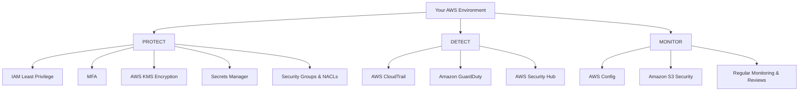

# AWS Security Best Practices: A Practical Checklist for Protecting Your Cloud Environment

Securing an AWS environment can feel overwhelming. Between IAM policies, encryption keys, security groups, and a whole alphabet soup of monitoring services, where do you even start? The good news is that AWS ships with a comprehensive set of tools designed to protect your resources and data — if you know how to configure them.

This article distills the essential AWS security best practices into a practical, action-oriented checklist. Whether you are launching a single EC2 instance or running a multi-account production environment, the practices below will help you harden your setup, detect threats early, and stay compliant over time.

> The guidance in this article is based entirely on the AWS Security Best Practices Checklist source document. Where a topic is not covered in the source, it is called out explicitly rather than invented.


## Table of Contents
- [Introduction](#introduction)
- [The Shared Responsibility Model](#the-shared-responsibility-model)
- [Protect: Securing Your Resources and Data](#protect-securing-your-resources-and-data)
  - [IAM Least Privilege](#iam-least-privilege)
  - [Multi-Factor Authentication (MFA)](#multi-factor-authentication-mfa)
  - [AWS KMS for Encryption at Rest](#aws-kms-for-encryption-at-rest)
  - [AWS Secrets Manager](#aws-secrets-manager)
  - [Security Groups and NACLs](#security-groups-and-nacls)
- [Detect: Identifying Threats Early](#detect-identifying-threats-early)
  - [AWS CloudTrail](#aws-cloudtrail)
  - [Amazon GuardDuty](#amazon-guardduty)
  - [AWS Security Hub](#aws-security-hub)
- [Monitor: Ensuring Compliance Over Time](#monitor-ensuring-compliance-over-time)
  - [AWS Config](#aws-config)
  - [Amazon S3 Security](#amazon-s3-security)
  - [Regular Monitoring and Reviews](#regular-monitoring-and-reviews)
- [A Real-World Example](#a-real-world-example)
- [Key Takeaways](#key-takeaways)
- [Frequently Asked Questions](#frequently-asked-questions)

## Introduction

The Azure → AWS cloud is powerful precisely because of its flexibility, but that same flexibility is a double-edged sword. A misconfigured S3 bucket, an over-privileged IAM role, or a hardcoded API key can turn a convenient deployment into a security incident. The checklist approach works because security is not a single action — it is a continuous cycle of protecting, detecting, and monitoring.

The overarching theme of the source document is captured in one line: **"Security is a shared responsibility. Follow best practices and stay secure!"** Let's unpack what that means and work through the specific practices that keep your environment safe.

## The Shared Responsibility Model

Before diving into individual services, it is important to understand the mental model that frames every AWS security decision. The source document's closing note—*"Security is a shared responsibility"*—is more than a slogan; it is the architectural principle behind AWS security.

While the source document does not expand on the formal AWS Shared Responsibility Model, the implication is clear: you are responsible for securing what you build *on top of* AWS, and AWS is responsible for securing the underlying infrastructure. What is not covered in the source is the full legal and contractual breakdown of that model, so treat the checklist items below as the parts that fall under your control.



As the diagram shows, the checklist is organized into three pillars: **Protect**, **Detect**, and **Monitor**. Let's walk through each one.

## Protect: Securing Your Resources and Data

The "Protect" pillar is about locking down your resources and data *before* anything bad happens. These are proactive controls that reduce your attack surface and minimize the blast radius of any breach.

### IAM Least Privilege

> **Principle:** Grant only the permissions users and applications actually need.

IAM (Identity and Access Management) is the cornerstone of AWS security. The least-privilege principle means giving each user, role, or application only the permissions required to perform its job and nothing more.

- Start with a **deny-by-default** policy and add permissions incrementally.
- Review roles and policies periodically and remove stale credentials.
- Favor temporary credentials (IAM Roles, STS) over long-lived access keys where possible.

**Why it matters:** Enforcing least privilege minimizes the risk of unauthorized access. If a credential or role is compromised, an attacker inherits only the narrow set of permissions that role holds, limiting the damage they can cause.

### Multi-Factor Authentication (MFA)

> **Principle:** Enable MFA for the root account and privileged IAM users.

Passwords alone are no longer enough. MFA adds a second layer of authentication that requires a time-based one-time code (or hardware token) in addition to your password.

- Enable MFA on the **root account** first — this is your highest-privilege identity.
- Extend MFA to all IAM users with administrative or privileged access.
- For programmatic access, consider enforcing MFA as part of the IAM policy (for example, via a `aws:MultiFactorAuthPresent` condition).

**Why it matters:** MFA adds an extra layer of security to your accounts, dramatically reducing the chance that a leaked or guessed password leads to a compromise.

### AWS KMS for Encryption at Rest

> **Principle:** Encrypt data at rest using customer-managed or AWS-managed keys.

AWS Key Management Service (KMS) is AWS's managed encryption service. It lets you create and control the keys used to encrypt your data at rest across services like EBS volumes, S3, RDS, and more.

- Use **AWS-managed keys** for a quick, low-effort encryption baseline.
- Use **customer-managed keys (CMKs)** when you need granular control over rotation, access, and audit of key usage.
- Enable automatic key rotation where the policy and compliance requirements allow.

**Why it matters:** Encrypting data at rest protects sensitive data even if storage media is compromised, exfiltrated, or accidentally exposed.

### AWS Secrets Manager

> **Principle:** Store and manage database passwords, API keys, and secrets securely.

Hardcoding secrets—in code, configuration files, or environment variables—is one of the most common and dangerous mistakes in cloud development.

- Store database passwords, API keys, and other credentials in AWS Secrets Manager.
- Retrieve secrets programmatically at runtime instead of pasting them into code.
- Use the built-in **automatic rotation** to cycle secrets on a schedule and reduce the window of exposure.
- Reference secrets by name in your application code and let your app fetch the current value.

**Why it matters:** Centralizing secrets in Secrets Manager eliminates hardcoded secrets and reduces risk, because credentials are no longer scattered across the codebase where they can leak into version control or logs.

### Security Groups and NACLs

> **Principle:** Allow only required inbound and outbound traffic.

Traffic filtering is your first line of defense at the network layer. AWS gives you two complementary tools:

- **Security Groups** act as a stateful virtual firewall at the instance level. You allow specific inbound and outbound rules, and responses are automatically allowed.
- **Network Access Control Lists (NACLs)** act as a stateless firewall at the subnet level, providing an additional layer of filtering.

```text
Cloud Traffic
     │
     v
┌───────────────┐   inbound rules   ┌────────────────┐
│     NACL      │ ────────────────► │ Security Group  │
│  (subnet,     │                   │  (instance,     │
│   stateless)  │ ◄──────────────── │   stateful)     │
└───────────────┘  outbound rules   └────────────────┘
```

- Default to **deny-all**, then explicitly allow only the ports and protocols you actually use (e.g., 443 for HTTPS, 22 for SSH from a known IP).
- Avoid opening ports to `0.0.0.0/0` (all IPs) unless absolutely necessary.
- Scope access to specific CIDR ranges or security group references rather than the whole internet.

**Why it matters:** Restricting inbound and outbound traffic reduces your attack surface by exposing only the services you intend to expose to the world.

## Detect: Identifying Threats Early

The "Detect" pillar is about visibility. Even with strong protection, you must assume breaches possible, so you need eyes on your environment to catch suspicious behavior early.

### AWS CloudTrail

> **Principle:** Record API activity and changes across your AWS accounts.

CloudTrail logs every API call made in your account—who did what, when, from where, and with what result. This forms the audit trail of your entire environment.

- Enable CloudTrail in **all** regions to get complete coverage.
- Store logs in a centralized, private S3 bucket, ideally in a separate logging account.
- Protect trail log files from tampering and build alerts around critical events.

**Why it matters:** CloudTrail is essential for auditing, compliance, and forensics. When something goes wrong, the trail tells you exactly what happened and who was responsible.

### Amazon GuardDuty

> **Principle:** Continuously monitor for suspicious activity and threats.

GuardDuty is a managed threat-detection service that uses machine learning and threat intelligence to identify anomalies—such as compromised credentials, unusual API patterns, or communications with known-bad IPs.

- Enable GuardDuty in each account and region you want to monitor.
- Review its findings in the GuardDuty console or pipe them to Security Hub.
- Feed findings into your alerting pipeline so responses are automated, not manual.

**Why it matters:** GuardDuty detects potential threats early, giving you a head start before an issue becomes a full-blown incident.

### AWS Security Hub

> **Principle:** View and manage security findings from multiple AWS services in one place.

Security Hub aggregates findings from GuardDuty, IAM, Config, and dozens of other sources into a single, prioritized view.

- Enable Security Hub as a central aggregation point for security findings.
- Use its compliance standards and control checks to identify gaps.
- Prioritize alerts by severity so your team focuses on the most critical issues first.

**Why it matters:** Security Hub centralizes and prioritizes security alerts, preventing "alert fatigue" and ensuring the truly important findings are not lost in the noise.

## Monitor: Ensuring Compliance Over Time

The "Monitor" pillar is about continuity. Security is not a one-time setup—it requires ongoing evaluation, configuration control, and deliberate review.

### AWS Config

> **Principle:** Continuously evaluate AWS resources for compliance with policies.

AWS Config records the configuration history of your resources and evaluates them against a set of rules you define.

- Define rules that represent your compliance and security posture (e.g., "encrypted EBS volumes," "MFA enabled on root").
- Use Config to detect configuration drift when resources change.
- Combine with remediation actions to automatically fix non-compliant resources.

**Why it matters:** AWS Config ensures compliance and configuration monitoring by continuously measuring your environment against your desired state and alerting you when it drifts.

### Amazon S3 Security

> **Principle:** Block public access by default, enable versioning, and encrypt data.

S3 buckets are a common source of accidental data leakage because they are easy to make public by mistake.

- **Block public access** at the account and bucket level by default.
- **Enable versioning** so accidental deletions or overwrites can be recovered.
- **Encrypt** objects at rest using S3-managed (SSE-S3) or KMS-managed keys.
- Enable server access logging and lifecycle policies to manage data over time.

**Why it matters:** These settings protect your data from leakage and loss, covering both accidental over-sharing and accidental deletion.

### Regular Monitoring and Reviews

> **Principle:** Continuously review permissions, logs, alerts, and security findings.

No checklist is complete without a cadence of review. Threats evolve, teams change, and new services get added—so your security posture must be revisited.

- Schedule regular reviews of IAM permissions and remove unused roles/users.
- Audit CloudTrail logs and GuardDuty/Security Hub findings on a recurring basis.
- Review alert rules so they remain relevant and you are not overwhelmed.
- Re-run compliance checks and remediate findings promptly.

**Why it matters:** Regular monitoring and reviews keep your environment secure over time, ensuring that today's strong posture does not quietly degrade into tomorrow's vulnerability.

## A Real-World Example

Let's put the whole checklist together with a realistic scenario. Imagine you manage a customer-facing web application backed by an RDS database and fronted by an ALB, with static assets in S3.

**Protect:**
- You define an IAM role for the application that grants *only* the permissions it needs—reading from the specific S3 bucket, writing to specific queues—and nothing else. No wildcard `*` permissions.
- You enable MFA on the root account and every IAM user with console administrator access.
- You create a customer-managed KMS key, enable automatic rotation, and encrypt both the RDS database and the EBS volumes attached to your EC2 instances.
- Database credentials live in AWS Secrets Manager, fetched at runtime, with automatic rotation every 30 days. No passwords appear in your code or environment vars.
- Security Groups allow only 443 inbound from the ALB and 22 from your office IP; NACLs add a subnet-level restriction on top.

**Detect:**
- CloudTrail is enabled in all regions, streaming into a centralized S3 bucket.
- GuardDuty monitors for unusual API calls or compromised keys.
- Security Hub aggregates GuardDuty, Config, and IAM findings into one dashboard with severity-based prioritization.

**Monitor:**
- AWS Config enforces "encrypted RDS," "S3 encryption enabled," and "no public S3 buckets" rules, alerting you to any drift.
- S3 has public access blocked, versioning enabled, and SSE-KMS encryption on.
- Your team holds a weekly review where logs, findings, and open alerts are triaged and acted upon.

> **Caution:** In this scenario, the checklist is only effective because it is run as a *cycle*—protect, detect, monitor, repeat. Security is not a one-and-done setup. If you apply the protections and never monitor, you have only built a false sense of security.

## Key Takeaways

- **Follow the three pillars:** Protect, Detect, and Monitor. Each pillar plays a distinct role in keeping your AWS environment secure, and skipping any one leaves gaps.
- **Apply least privilege everywhere.** Grant users and applications only the permissions they actually need to minimize the risk of unauthorized access.
- **Enable MFA on the root account and privileged users first.** It adds an extra layer of security and is the highest-impact, lowest-effort control.
- **Encrypt data at rest with AWS KMS** and store all secrets, API keys, and database passwords in AWS Secrets Manager to eliminate hardcoded secrets.
- **Use CloudTrail, GuardDuty, and Security Hub for detection** and continuous monitoring of suspicious activity and compliance.
- **Security is a shared responsibility.** AWS provides the tools, but you must configure them and keep reviewing your posture over time to stay secure.

## Frequently Asked Questions

**Q1: Where should I start with AWS security?**
Start with the "Protect" pillar—enable MFA on the root account, apply the least-privilege principle to your IAM roles, and block public access to S3. These low-effort, high-impact controls immediately reduce your biggest risks.

**Q2: What is the difference between AWS KMS and AWS Secrets Manager?**
AWS KMS manages the *encryption keys* used to encrypt your data at rest, while AWS Secrets Manager stores and rotates the *secrets* themselves, such as database passwords and API keys. They are complementary—you often use KMS to encrypt and Secrets Manager to store access credentials.

**Q3: Should I use Security Groups, NACLs, or both?**
Use both. Security Groups are stateful, instance-level firewalls, while NACLs are stateless, subnet-level filters. Layer them for defense in depth, but always default to deny and only allow required inbound and outbound traffic.

**Q4: Is AWS responsible for securing my applications?**
Under the shared responsibility principle, AWS secures the underlying infrastructure, but you are responsible for securing what you configure—IAM permissions, encryption, secrets, traffic rules, and ongoing monitoring. This article's guidance covers the parts you control.

**Q5: What can I do if the source document did not cover a specific AWS security topic?**
The source document focuses on this protect/detect/monitor checklist. Any topic not mentioned here—for example, the full legal detail of the Shared Responsibility Model—is explicitly not covered by the source material, so you should consult official AWS documentation for those specifics.

## Related Articles

- IAM Policies and Roles: A Beginner's Guide to Least Privilege
- Encrypting Your Cloud Workloads with AWS KMS
- From Config Drift to Catch-All: Automating Compliance with AWS Config
