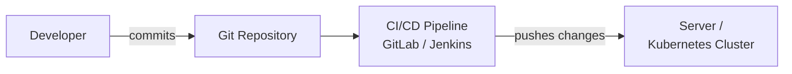
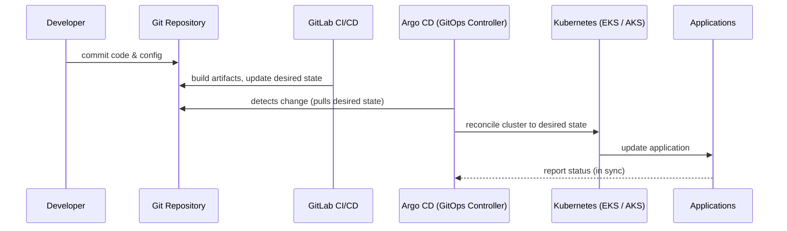

# Push vs Pull Deployment Models - Understanding GitOps and Continuous Delivery

Deploying software is no longer a manual step at the end of a sprint. Modern engineering teams automate how changes move from a developer's laptop into production. But how you deliver those changes matters a great deal — and there are fundamentally two ways to think about it: the **push model** and the **pull model**.

The source document on which this article is based outlines both approaches, explains why teams increasingly prefer the pull model (also known as GitOps), and walks through a typical GitOps flow using controllers such as Argo CD and Flux. This guide unpacks all of that in detail so you can decide which model fits your systems.

## Table of Contents

- [What Are the Two Deployment Models?](#what-are-the-two-deployment-models)
- [The Push Model - How It Works](#the-push-model---how-it-works)
- [Pros and Cons of the Push Model](#pros-and-cons-of-the-push-model)
- [The Pull Model (GitOps) - How It Works](#the-pull-model-gitops---how-it-works)
- [Pros and Cons of the Pull Model](#pros-and-cons-of-the-pull-model)
- [Why Teams Prefer GitOps](#why-teams-prefer-gitops)
- [A Typical GitOps Flow](#a-typical-gitops-flow)
- [Push vs Pull - At a Glance](#push-vs-pull---at-a-glance)
- [Key Takeaways](#key-takeaways)
- [Frequently Asked Questions](#frequently-asked-questions)
- [Related Articles](#related-articles)

## What Are the Two Deployment Models?

When continuous integration and continuous delivery (CI/CD) systems move a build or a configuration change to a target environment, they have two main strategies to choose from:

- **Push model** — the CI/CD pipeline actively *pushes* changes out to the target environment.
- **Pull model (GitOps)** — the target environment actively *pulls* its desired state from Git.

The distinction is not merely academic. It changes how you manage credentials, how you reason about security, how you detect and recover from drift, and how reliable your deployments ultimately are.

## The Push Model - How It Works

In the push model, the software delivery pipeline is the active agent. A developer commits code, then:

1. **Developer** writes and commits code.
2. **Git Repository** stores the code and configuration.
3. **CI/CD Pipeline** (such as GitLab or Jenkins) builds, tests, and packages the application.
4. **Pushes Changes** — the pipeline pushes the built artifacts directly to the target.
5. **Server / Kubernetes Cluster** receives the change and applies it to the running environment.

The key idea captured in the diagram is that the pipeline holds the responsibility and the power to write to the target environment. The environment is essentially a passive recipient waiting for the pipeline to deliver updates.



## Pros and Cons of the Push Model

The push model has been around for a long time and remains common in traditional continuous delivery setups. The source highlights several benefits and a few important trade-offs.

**Pros**

- **Fast deployments** — changes move directly from pipeline to environment with minimal indirection.
- **Simple to understand** — the flow is straightforward: commit, build, push.
- **Common in traditional CI/CD** — most legacy and well-known pipelines operate this way, so it is familiar to many teams.

**Cons**

- **Pipeline needs access and credentials to production** — the CI/CD system must hold credentials that can write to the live environment.
- **Larger security footprint** — because those production credentials are exposed inside the pipeline, there is a broader attack surface and more sensitive material to protect.

> **Important:** The whole way of working — and the larger question of why you would choose one over the other — is largely a security and reliability trade-off. Whenever your CI/CD system holds direct write credentials to production, the blast radius of a compromised pipeline is significant.

## The Pull Model (GitOps) - How It Works

The pull model inverts the relationship. Instead of the pipeline pushing changes into the environment, the target environment pulls the desired state from Git.

1. **Developer** commits changes to the Git repository.
2. **Git Repository** holds the desired state (the single source of truth).
3. **Argo CD / Flux** (the GitOps controller) detects the change.
4. **Kubernetes Cluster** pulls the updates.
5. **Application** is updated to match the desired state.

Notice that the deployment agent is now on the *environment side*. The pipeline may still build artifacts, but the action of applying state to the cluster is initiated by the GitOps controller inside the cluster, pulling from Git — never pushing into the cluster.


## Pros and Cons of the Pull Model

The pull model is the foundation of modern GitOps practice and is preferred by teams moving to declarative, cloud-native infrastructure.

**Pros**

- **More secure (no inbound deployments)** — nothing needs to reach into the cluster with write credentials; the cluster initiates the pull.
- **Git is the single source of truth** — every configuration change is captured as a versioned commit, giving you an auditable record of what changed and why.
- **Automatic drift detection** — the controller continuously compares the live state with the desired state declared in Git.
- **Self-healing** — if someone manually changes the cluster and the live state drifts from Git, the controller pulls it back into sync.
- **Preferred for GitOps** — this is the canonical way GitOps is implemented.
- **Greater consistency and reliability** — the desired state is always defined and reproducible from Git.

**Cons**

- **Requires a GitOps controller (Argo CD / Flux)** — you must install and operate an extra component.
- **Slightly more complex initially** — there is a learning curve and more moving parts to set up before you see the benefits.

## Why Teams Prefer GitOps

The combination of security, consistency, and self-healing is why GitOps has become the *preferred* model for Kubernetes workloads. Where the push model asks, "How do we get our changes into the cluster?", the GitOps mindset answers, "We declare what the cluster should look like in Git, and the cluster reconciles itself to match."

This approach removes much of the operational guesswork. Because the desired state lives in a versioned repository, rollbacks become trivial (revert a commit), audit trails become automatic, and the cluster can continuously verify that nothing has drifted out of sync.

> **Caution:** The pull model is not a silver bullet. As the source notes, it adds operational complexity and depends on a GitOps controller such as Argo CD or Flux. Teams should weigh that added tooling against the security and reliability gains.

## A Typical GitOps Flow

The source document describes a realistic end-to-end GitOps scenario. In this flow:

- **GitLab CI/CD** is used for continuous integration — building and validating the artifacts.
- **Argo CD** acts as the GitOps controller.
- The target environment is a managed **Kubernetes** cluster such as **EKS** (Amazon Elastic Kubernetes Service) or **AKS** (Azure Kubernetes Service).
- **Applications** run inside the cluster **in sync** with the desired state defined in Git.

```
GitLab CI  -->  Argo CD (GitOps Controller)  -->  Kubernetes Cluster (EKS / AKS)  -->  Applications (in sync)
```

The pipeline builds and pushes artifacts and updates the Git repository with the new desired state. Argo CD detects the change, pulls the new state from Git, and reconciles the cluster so the running applications stay in sync with what Git declares.



## Push vs Pull - At a Glance

Here is a compact comparison based directly on the source document.

| Dimension | Push Model | Pull Model (GitOps) |
| --- | --- | --- |
| Who initiates deployment | CI/CD pipeline | Target environment / controller |
| Deployment speed | Fast | Slightly more indirection |
| Complexity | Simple to understand | Slightly more complex initially |
| Production credentials in pipeline | Yes (larger security footprint) | No inbound deployments (more secure) |
| Source of truth | Pipeline artifacts | Git repository |
| Drift detection | Not inherent | Automatic |
| Self-healing | Not inherent | Yes |
| GitOps preference | Traditional CI/CD | Preferred |
| Extra tooling | None required | Requires Argo CD / Flux |

## Key Takeaways

- There are two fundamental deployment models: push (CI/CD pushes changes) and pull (the environment pulls from Git).
- The push model is fast and simple but requires production credentials inside the pipeline, creating a larger security footprint.
- The pull model, or GitOps, makes Git the single source of truth and the environment pulls the desired state from it.
- GitOps offers automatic drift detection, self-healing, and greater consistency, which is why it is the preferred approach for Kubernetes.
- The main cost of GitOps is operational complexity and the need for a GitOps controller such as Argo CD or Flux.
- A typical GitOps flow combines a CI tool like GitLab with Argo CD reconciling an EKS or AKS cluster so applications stay in sync with Git.

## Frequently Asked Questions

**What is the difference between push and pull deployment models?**
In the push model, the CI/CD pipeline pushes changes out to the environment. In the pull model (GitOps), the target environment pulls the desired state from Git.

**Why is the pull model considered more secure?**
Because the pull model has no inbound deployments — nothing pushes into the cluster with production credentials — so the pipeline's security footprint is smaller. The cluster initiates the pull from Git.

**What is drift detection in GitOps?**
It is the controller's ability to continuously compare the live state of the cluster with the desired state declared in Git. When they differ, the controller can restore them into sync.

**Which tools are used for GitOps controllers?**
The source names Argo CD and Flux as the GitOps controllers, with GitLab CI shown as the continuous integration piece in a typical flow.

**Does the source document cover how to set up Argo CD or Flux?**
No. The document explains the concepts and a high-level flow, but does not provide installation or configuration instructions for these controllers.

## Related Articles

- Continuous Integration vs Continuous Delivery: A Clear Comparison
- Getting Started with Kubernetes Deployments
- What Is Infrastructure as Code and Why It Matters