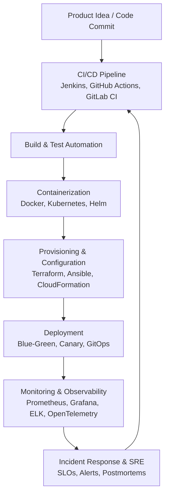
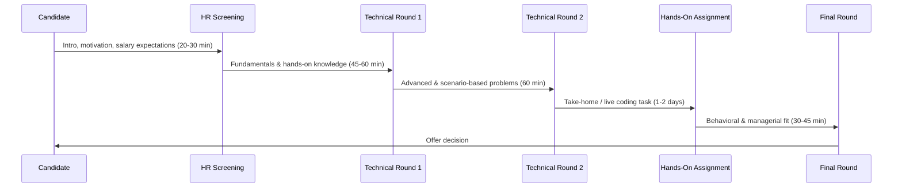

# The Complete DevOps Interview Playbook for 2026

DevOps is a rapidly evolving field that merges development and operations to improve the efficiency, quality, and speed of delivering software products. As organizations strive to streamline their processes and adapt to the fast-paced tech landscape, various specialized roles within DevOps have emerged. Each of these roles requires a unique set of skills and tools, as well as specific experience in automating processes, ensuring system reliability, managing infrastructure, and enhancing the overall software lifecycle.

The roles in DevOps vary significantly in their focus areas, but all are essential for automating and optimizing the deployment pipeline, managing cloud infrastructure, ensuring application reliability, and fostering collaboration between development and operations teams. These professionals play a critical part in improving the performance and security of systems, while also implementing practices that allow for faster delivery and better scalability.

This playbook is a condensed, practical version of a DevOps interview preparation guide. It walks you through the four major specializations covered by the source material — **DevOps Engineer**, **Site Reliability Engineer (SRE)**, **Cloud DevOps Engineer**, and **Kubernetes DevOps Engineer** — along with the career paths, certifications, tools, and expected compensation for each. Whether you are a junior engineer preparing for your first role or a senior professional aiming for a specialized position, this guide will help you structure your preparation.

## Table of Contents

- [Introduction to DevOps Roles](#introduction-to-devops-roles)
- [Career Path and Growth Opportunities](#career-path-and-growth-opportunities)
- [Certifications and Learning Path](#certifications-and-learning-path)
- [Tools and Technologies Breakdown](#tools-and-technologies-breakdown)
- [Roles and Average Salaries](#roles-and-average-salaries)
- [Interviewing for the DevOps Engineer Role](#interviewing-for-the-devops-engineer-role)
- [Interviewing for the Site Reliability Engineer Role](#interviewing-for-the-site-reliability-engineer-role)
- [Interviewing for the Cloud DevOps Engineer Role](#interviewing-for-the-cloud-devops-engineer-role)
- [Interviewing for the Kubernetes DevOps Engineer Role](#interviewing-for-the-kubernetes-devops-engineer-role)
- [A Typical DevOps Interview Process](#a-typical-devops-interview-process)
- [Key Takeaways](#key-takeaways)
- [Frequently Asked Questions](#frequently-asked-questions)
- [Related Articles](#related-articles)

## Introduction to DevOps Roles

From DevOps Engineers who focus on automating and streamlining deployments to Kubernetes Engineers who specialize in container orchestration and management, each role is crucial in creating a seamless software development lifecycle. With the advent of cloud technologies and modern tools, such as Kubernetes, Terraform, and CI/CD systems, these professionals help shape the infrastructure and operations that power today's cutting-edge applications.

The increasing demand for cloud solutions and the automation of infrastructure has led to a growth in specialized roles such as Cloud DevOps Engineers, CI/CD Engineers, and Site Reliability Engineers (SREs). These roles ensure that systems are scalable, secure, and running efficiently in highly dynamic and distributed environments. Whether managing infrastructure as code, optimizing cloud costs, or ensuring system uptime, each role brings its expertise to the table to meet the needs of organizations transitioning to cloud-native architectures.

> **Note:** The roles described here are not islands. Real DevOps teams blend these responsibilities — an SRE often writes Terraform, and a Kubernetes Engineer routinely designs CI/CD pipelines. The four roles in this guide share a common automation-first mindset.

## Career Path and Growth Opportunities

One of the first questions any DevOps professional asks is: *Where can this career take me?* The source document outlines a clear progression ladder that applies across specializations.

### Entry-Level (0-2 Years)

- Junior DevOps Engineer
- System Administrator

### Mid-Level (3-6 Years)

- DevOps Engineer
- CI/CD Engineer
- Cloud Engineer

### Senior-Level (7-10+ Years)

- Lead DevOps Engineer
- SRE (Site Reliability Engineer)
- Cloud Architect

### Leadership Roles

- DevOps Manager
- Head of DevOps
- CTO (for startups)

As organizations adopt more complex infrastructures and technologies, professionals with expertise in these specific DevOps areas are becoming indispensable. The roles are not only highly technical but also critical in ensuring smooth operations, system reliability, and the agility needed to keep up with business and technological demands.

## Certifications and Learning Path

Certifications are a reliable way to validate your skills and boost your earning potential. The source groups certifications into four tracks:

### DevOps and Cloud

- AWS Certified DevOps Engineer
- Google Professional DevOps Engineer
- Azure DevOps Expert

### Kubernetes and Containers

- CKA (Certified Kubernetes Administrator)
- CKAD (Certified Kubernetes Application Developer)

### Infrastructure as Code

- Terraform Associate
- HashiCorp Vault Associate

### Security and Monitoring

- Prometheus Certified Associate
- Certified Ethical Hacker (CEH)

The source also notes that certifications (AWS, CKA, Terraform, and similar) can boost salary potential, so they are worth treating as an investment in your career rather than just resume decoration.

## Tools and Technologies Breakdown

DevOps is a tool-driven discipline. The source document provides a handy category-level breakdown of the tools you are expected to know:

| Category | Popular Tools |
| --- | --- |
| CI/CD | Jenkins, GitHub Actions, GitLab CI/CD, ArgoCD |
| Configuration Management | Ansible, Chef, Puppet |
| Infrastructure as Code (IaC) | Terraform, AWS CloudFormation |
| Containerization & Orchestration | Docker, Kubernetes, Helm |
| Monitoring & Logging | Prometheus, Grafana, ELK Stack |
| Cloud Platforms | AWS, GCP, Azure |

> **Tip:** Don't try to master every tool at once. Pick one from each category — for example, Jenkins or GitHub Actions for CI/CD, Terraform for IaC, Kubernetes for orchestration, and Prometheus/Grafana for monitoring — and go deep before broadening out.

## Roles and Average Salaries

Compensation varies widely, but the source provides indicative salary ranges (in INR per year) for the core roles. These figures reflect the general market in India and should be treated as benchmarks rather than guarantees.

| Role | Experience Required | Average Salary (INR/year) | Key Skills & Tools | Job Focus Areas |
| --- | --- | --- | --- | --- |
| DevOps Engineer | 3-5 years | ₹12L - ₹25L | CI/CD (Jenkins, GitHub Actions), Docker, Terraform | Automating deployments, Infrastructure as Code (IaC), CI/CD pipelines |
| Cloud DevOps Engineer | 4-6 years | ₹15L - ₹30L | AWS/GCP/Azure, Kubernetes, Terraform, Serverless | Cloud infrastructure automation, cost optimization, security |
| CI/CD Engineer | 3-6 years | ₹12L - ₹28L | Jenkins, GitHub Actions, GitOps, Kubernetes, Helm | Streamlining CI/CD pipelines, release automation, GitOps |
| Kubernetes DevOps Engineer | 5-7 years | ₹18L - ₹35L | Kubernetes, Helm, Istio, Prometheus, Terraform | Kubernetes cluster management, scaling, security, monitoring |
| Site Reliability Engineer (SRE) | 5-8 years | ₹20L - ₹40L | Prometheus, Grafana, Chaos Engineering, Ansible | Reliability, observability, incident response, scaling |

### Additional Notes on Salaries

- Salary varies based on location (Bangalore, Hyderabad, Pune, etc.), company type (MNC vs. startup), and industry.
- Senior roles (8+ years) can earn ₹45L+, especially at FAANG, fintech, and product-based companies.
- Certifications (AWS, CKA, Terraform, etc.) can boost salary potential.

## Interviewing for the DevOps Engineer Role

The DevOps Engineer is the entry point into the specialization and the role most candidates interview for first. According to the source, this engineer is responsible for automating software development, deployment, and infrastructure management — bridging the gap between software development and IT operations while ensuring smooth CI/CD pipelines, infrastructure as code (IaC), and system monitoring.

### Interview Procedure Overview

The source describes a structured, multi-round process that is broadly consistent across all four roles:

1. **HR Screening Round (20-30 mins)** — cultural fit, communication, motivation, and salary expectations.
2. **Technical Round 1 (45-60 mins)** — fundamentals and hands-on knowledge.
3. **Technical Round 2 (60 mins)** — advanced and scenario-based problem solving.
4. **Hands-On Assignment (1-2 days)** — take-home or live coding task.
5. **Final Round (30-45 mins)** — behavioral and managerial assessment.

### HR Screening: Key Questions and How to Answer Them

**Question: Tell me about yourself and your DevOps experience.**

The source recommends the **Present-Past-Future method**:

- **Present:** Your current role and responsibilities.
- **Past:** Relevant experience, tools, and technologies used.
- **Future:** Your aspirations in DevOps.

Example answer from the source:

> "I am currently working as a DevOps Engineer at XYZ, where I manage CI/CD pipelines, automate deployments using Jenkins, and work with Kubernetes for container orchestration. In my previous role, I built infrastructure as code using Terraform and implemented monitoring solutions. I am looking for an opportunity where I can work on large-scale deployments and improve system reliability."

**Question: Why do you want to work with us?**

The source advises you to research the company's DevOps stack and challenges, align your skills with their requirements, and show enthusiasm for their products and mission.

### Technical Round 1: Fundamentals and Hands-On Knowledge

**Q: What is CI/CD, and how would you implement it?**

**A:** CI/CD (Continuous Integration & Continuous Deployment) automates the software delivery process. To impress interviewers, the source recommends you explain with a practical example, mention tools like Jenkins, GitHub Actions, and GitLab CI/CD, and cover rollback strategies.

Example answer:

> "CI/CD ensures rapid, reliable software delivery. I set up Jenkins pipelines with automated testing and deployment using Docker and Kubernetes. For rollbacks, I use blue-green deployments to minimize downtime."

**Q: How does Terraform differ from Ansible?**

**A:** The source's guidance:

- Terraform is **declarative** and used for infrastructure **provisioning**.
- Ansible is **procedural** and used for **configuration management**.
- Use both together for infrastructure automation.

Example answer:

> "I use Terraform for creating cloud resources (e.g., AWS EC2, S3) and Ansible for configuring servers (e.g., installing Nginx). This approach ensures repeatability and scalability."

**Q: How do you deploy a multi-container application using Kubernetes?**

**A:** Use Kubernetes manifests (YAML), define Deployments, Services, and ConfigMaps, and mention Helm for managing Kubernetes apps.

Example answer:

> "I create Kubernetes manifests for Deployments and Services, then use kubectl apply -f to deploy. I leverage Helm for package management to streamline updates."

### Technical Round 2: Advanced and Scenario-Based

**Q: A production server is down. How do you troubleshoot it?**

**A:** The source recommends:

- Check logs (journalctl, kubectl logs).
- Verify system metrics (CPU, memory usage).
- Restart services and analyze root cause.

Example answer:

> "First, I check system logs and application logs for errors. If it's a Kubernetes pod issue, I inspect kubectl logs and events. If it's a server issue, I analyze CPU and memory usage using Prometheus and Grafana."

**Q: How do you secure a Kubernetes cluster?**

**A:** The source lists three pillars:

- Implement Role-Based Access Control (RBAC).
- Enable network policies for microservices isolation.
- Use secrets management tools (Vault, AWS Secrets Manager).

Example answer:

> "I apply RBAC to restrict permissions, enforce network policies for pod security, and manage sensitive data using HashiCorp Vault."

### Hands-On Assignment and Final Round

Possible take-home tasks for the DevOps Engineer role include creating a CI/CD pipeline (writing a Jenkinsfile or GitHub Actions workflow), deploying an app using Terraform and Kubernetes, or fixing a broken pipeline. To ensure selection, the source emphasizes writing clean, well-documented code, following best practices (e.g., modular Terraform code), and providing explanations in a README file.

The final behavioral round asks questions like *How do you handle production failures?* and *Tell me about a time you improved an inefficient DevOps process.* One example answer from the source:

> "I automated a manual deployment process by implementing a CI/CD pipeline, reducing deployment time from 2 hours to 15 minutes, increasing efficiency and reliability."

## Interviewing for the Site Reliability Engineer Role

A Site Reliability Engineer (SRE) focuses on maintaining system reliability, performance, scalability, and incident response. This role is a mix of software engineering and operations, ensuring high availability and efficient monitoring of services. The source dedicates two sections to the SRE role, which underlines how important this specialization has become.

### SRE Fundamentals: SLAs, SLOs, and SLIs

This is the single most important SRE concept to master.

- **SLA (Service Level Agreement):** A business agreement defining reliability expectations and uptime guarantees.
- **SLO (Service Level Objective):** Internal targets used to meet SLAs.
- **SLI (Service Level Indicator):** Measurable metrics (e.g., latency, error rates, uptime).

Example answer from the source:

> "SLAs are contractual commitments, while SLOs define internal reliability goals. SLIs measure actual system performance against those goals. For instance, an SLA might promise 99.9% uptime, and the SLO ensures response times stay below 200ms."

### Monitoring and Observability

**Q: How do you set up monitoring for a microservices-based system?**

**A:** The source recommends using Prometheus for metrics and Grafana for dashboards, setting up the ELK Stack (Elasticsearch, Logstash, Kibana) for centralized logging, and implementing distributed tracing with OpenTelemetry.

Example answer:

> "I collect metrics using Prometheus, visualize them in Grafana, and configure alerts via Alertmanager. For logs, I use the ELK stack and implement tracing with OpenTelemetry to diagnose performance bottlenecks."

### Safe Deployments

**Q: How would you prevent a faulty deployment from impacting production?**

**A:**

- Use blue-green deployments or canary releases.
- Implement automated rollbacks based on health checks.
- Add chaos engineering for failure testing.

Example answer:

> "I use canary deployments, gradually rolling out changes while monitoring metrics. If errors exceed thresholds, the system automatically rolls back using Kubernetes and feature flags."

### Incident Response and Scaling

For a high-latency incident, the source suggests checking APM tools like New Relic, analyzing Kubernetes pod resource usage, and inspecting logs and database query performance. For traffic spikes, the recommendations are horizontal pod autoscaling in Kubernetes, caching (Redis, CloudFront), and optimizing database queries and indexing.

> **Caution:** "It's not down" is never an acceptable incident response. SRE interviews reward candidates who name the exact tool, metric, or log source they would inspect first — be specific about dashboards, log pipelines, and alert thresholds.

### SRE Hands-On Assignment and Success Strategies

Possible SRE assignments include building a Prometheus-Grafana monitoring dashboard, fixing a slow API response time issue, or simulating a system failure and auto-recovery. To ensure selection, use infrastructure as code (Terraform, Helm), follow best practices for monitoring and alerting, and provide a README with detailed explanations.

## Interviewing for the Cloud DevOps Engineer Role

A Cloud DevOps Engineer specializes in designing, deploying, and managing cloud infrastructure using AWS, Azure, or Google Cloud Platform (GCP). The focus is on CI/CD automation, infrastructure as code (IaC), security, and cloud-native services.

### Cloud Architecture

**Q: How do you design a scalable and highly available architecture on AWS?**

**A:**

- Use Auto Scaling Groups and Elastic Load Balancer (ELB).
- Implement Multi-AZ deployments for high availability.
- Optimize with CloudFront (CDN) and caching (Redis, ElastiCache).

Example answer:

> "I would use an ALB to distribute traffic across EC2 instances in an Auto Scaling Group, store data in an RDS Multi-AZ setup, and implement CloudFront for performance improvements."

### Terraform vs. CloudFormation

**Q: What are the benefits of Terraform over CloudFormation?**

**A:**

- Terraform is multi-cloud, while CloudFormation is AWS-specific.
- Terraform supports modular and reusable code.
- Terraform has a state file to track changes.

Example answer:

> "I prefer Terraform because it allows us to use the same codebase for AWS, GCP, and Azure. It also has a strong community and better support for versioning and workspaces."

### Cloud Security

**Q: How do you secure an AWS S3 bucket that holds sensitive data?**

**A:**

- Enable bucket encryption (SSE-S3 or SSE-KMS).
- Block public access and configure IAM policies.
- Enable logging and monitoring via AWS CloudTrail.

Example answer:

> "I would enforce encryption, apply least privilege IAM policies, and monitor access logs using AWS CloudTrail to prevent unauthorized access."

### Cloud CI/CD

For a cloud-native application, the source recommends GitHub Actions/GitLab CI/CD/Jenkins for automation, deployment to AWS ECS/EKS using Helm, and integrating security checks via tools like Snyk or Trivy. Cost optimization stories are highly valued in the final round — one example mentions recommending a move to AWS Fargate to save 40% on EC2 costs and setting up automated S3 lifecycle policies.

## Interviewing for the Kubernetes DevOps Engineer Role

A Kubernetes DevOps Engineer specializes in deploying, managing, and scaling containerized applications using Kubernetes (K8s), with a focus on container orchestration, networking, security, and automation using Helm, Terraform, and CI/CD pipelines.

### Kubernetes Architecture

**Q: Explain the core components of a Kubernetes cluster.**

**A:**

- **Control Plane:** API Server, Scheduler, Controller Manager, etcd.
- **Worker Nodes:** Kubelet, Kube-Proxy, Container Runtime.
- **Networking:** CNI plugins like Calico and Flannel.

Example answer:

> "A Kubernetes cluster has a control plane managing workloads and worker nodes running pods. The API server processes requests, the scheduler assigns pods, and etcd stores the cluster state."

### Scaling Applications

**Q: How do you scale applications in Kubernetes?**

**A:**

- **HPA (Horizontal Pod Autoscaler):** Scales based on CPU/memory usage.
- **Cluster Autoscaler:** Scales worker nodes dynamically.
- **VPA (Vertical Pod Autoscaler):** Adjusts pod resource requests.

Example answer:

> "I configure HPA to scale pods based on CPU usage and use Cluster Autoscaler to add nodes when needed. For performance tuning, I use VPA to adjust container resource requests."

### Services and Persistent Storage

Kubernetes services fall into several types covered by the source:

| Service Type | Purpose |
| --- | --- |
| ClusterIP | Internal-only communication |
| NodePort | Exposes service on a node's IP |
| LoadBalancer | Uses cloud provider's LB for external access |
| Ingress Controller (NGINX, Traefik) | Routes traffic via domain names |

For persistent storage, the source covers Persistent Volumes (PV) and Persistent Volume Claims (PVC), StorageClasses for dynamic provisioning with AWS EBS, GCP PD, etc., and CSI drivers for cloud-native storage integration.

### Kubernetes Security

**Q: How do you secure a Kubernetes cluster?**

**A:**

- Use RBAC to restrict permissions.
- Implement NetworkPolicies to control pod communication.
- Enable Pod Security Standards (PSS) and restrict privileged containers.
- Use service meshes (Istio, Linkerd) for secure service-to-service communication.

### Debugging and Disaster Recovery

**Q: A pod is stuck in CrashLoopBackOff. How do you debug it?**

**A:** Check logs with `kubectl logs <pod>`, inspect pod events with `kubectl describe pod <pod>`, analyze resource limits with `kubectl get pod <pod> -o yaml`, and debug interactively with `kubectl exec -it <pod> -- /bin/sh`.

**Q: How do you back up and restore a Kubernetes cluster?**

**A:**

- Use Velero for backup/restore.
- Regularly back up etcd (Kubernetes key-value store).
- Store YAML manifests and Helm charts for redeployment.

## A Typical DevOps Interview Process

All four roles share the same interview structure. Here is a visual overview of the rounds:

### Key Strategies for Success Across Roles

Across every role, the source consistently highlights the same five success levers:

1. **Prepare hands-on:** Practice with Terraform, Kubernetes, and CI/CD tools.
2. **Know real-world troubleshooting:** Logs, monitoring, and security practices.
3. **Show a problem-solving mindset:** Explain your approach, not just the answers.
4. **Demonstrate teamwork:** Explain how you work with developers, SREs, and security teams.
5. **Communicate with confidence:** Give clear, structured answers with examples.

## Key Takeaways

- DevOps offers a clear career progression from Junior DevOps Engineer to SRE, Cloud Architect, and leadership roles like Head of DevOps — with certifications (AWS, CKA, Terraform) boosting salary potential.
- The four core specializations — DevOps Engineer, SRE, Cloud DevOps Engineer, and Kubernetes DevOps Engineer — all share a common interview structure: HR screen, two technical rounds, a hands-on assignment, and a final behavioral round.
- Master the fundamentals: CI/CD pipelines, Infrastructure as Code (Terraform vs. Ansible), Docker/Kubernetes, and monitoring (Prometheus, Grafana, ELK, OpenTelemetry).
- SRE candidates must nail SLAs, SLOs, and SLIs, plus incident response, canary/blue-green deployments, and chaos engineering.
- Salary benchmarks range from ₹12L–₹25L for DevOps Engineers up to ₹20L–₹40L for SREs, with senior roles (8+ years) earning ₹45L+ at FAANG and product companies.
- Interviewers reward structured answers backed by real-world examples — the Present-Past-Future framework for "Tell me about yourself" is a proven starting point.

## Frequently Asked Questions

**Q: Which DevOps role should I apply for first?**

A: The source positions the DevOps Engineer as the entry-level specialization (3-5 years experience) with the widest focus, covering CI/CD, IaC, and monitoring. Cloud DevOps, Kubernetes, and SRE roles generally require 4-8 years and build on that foundation.

**Q: Are certifications really necessary for DevOps interviews?**

A: The source lists certifications for every track — AWS Certified DevOps Engineer, CKA, CKAD, Terraform Associate, and Prometheus Certified Associate — and notes that certifications can boost salary potential, but hands-on experience and the ability to explain your approach carry the most weight in interviews.

**Q: How many interview rounds should I expect?**

A: The source describes five rounds for every role: HR screening (20-30 mins), Technical Round 1 (45-60 mins), Technical Round 2 (60 mins), a hands-on take-home or live-coding assignment (1-2 days), and a final behavioral/managerial round (30-45 mins).

**Q: What is the difference between Terraform and Ansible?**

A: Terraform is declarative and used for infrastructure provisioning (creating cloud resources like AWS EC2 and S3), while Ansible is procedural and used for configuration management (configuring servers like installing Nginx). The source recommends using both together.

**Q: What is the single most important SRE concept to know?**

A: The relationship between SLAs (business agreements on uptime), SLOs (internal reliability targets), and SLIs (measurable metrics like latency and error rates). The source covers this in both SRE sections, and it appears repeatedly in technical interviews.

## Related Articles

- Coming soon: Building CI/CD Pipelines with GitHub Actions and Jenkins
- Coming soon: Terraform vs. Ansible: Choosing Your IaC Tools
- Coming soon: Kubernetes Security Best Practices: RBAC, NetworkPolicies, and Vault
