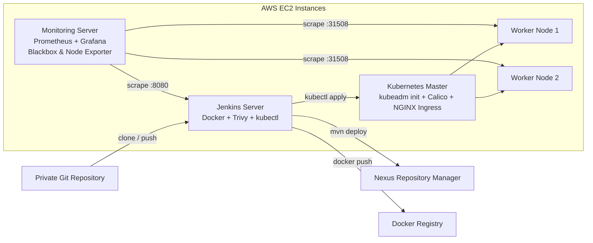

# Building an End-to-End CI/CD DevOps Pipeline with Kubernetes and Jenkins

Automating the journey from a commit in a Git repository to a live, monitored application running on Kubernetes is the heart of modern DevOps. This article walks through a complete, end-to-end CI/CD DevOps pipeline project that takes you from raw cloud infrastructure all the way to a production-style deployment with full monitoring.

The project is organized into four distinct phases: setting up the infrastructure on AWS, preparing a private Git repository, wiring up the CI/CD pipeline in Jenkins, and finally adding monitoring with Prometheus and Grafana. Along the way you will install and configure Kubernetes, Docker, Jenkins, SonarQube, Nexus, Trivy, and several Prometheus exporters.

> **Note:** All instructions in this article are based entirely on the source document. Where the source omits details (for example, exact security group rules for every port or application-specific credentials), those details are not covered here and should be checked against the official documentation of the respective tools.

## Table of Contents

- [Phase 1: Infrastructure Setup](#phase-1-infrastructure-setup)
  - [Launch an Ubuntu EC2 Instance on AWS](#launch-an-ubuntu-ec2-instance-on-aws)
  - [Set Up the Kubernetes Cluster with kubeadm](#set-up-the-kubernetes-cluster-with-kubeadm)
  - [Install Jenkins, Docker, and Trivy](#install-jenkins-docker-and-trivy)
  - [Set Up Nexus and SonarQube](#set-up-nexus-and-sonarqube)
- [Phase 2: Private Git Repository Setup](#phase-2-private-git-repository-setup)
- [Phase 3: The CI/CD Pipeline](#phase-3-the-cicd-pipeline)
  - [Jenkins Plugins](#jenkins-plugins)
  - [Tool Configuration and Credentials](#tool-configuration-and-credentials)
  - [The Jenkins Declarative Pipeline](#the-jenkins-declarative-pipeline)
  - [Pipeline Stage Overview](#pipeline-stage-overview)
  - [Email Notifications](#email-notifications)
- [Phase 4: Monitoring with Prometheus and Grafana](#phase-4-monitoring-with-prometheus-and-grafana)
  - [Installing Prometheus, Grafana, and Exporters](#installing-prometheus-grafana-and-exporters)
  - [Configuring Prometheus](#configuring-prometheus)
  - [Connecting Grafana Dashboards](#connecting-grafana-dashboards)
- [Key Takeaways](#key-takeaways)
- [Frequently Asked Questions](#frequently-asked-questions)
- [Related Articles](#related-articles)

## Phase 1: Infrastructure Setup

The entire pipeline rests on a set of Ubuntu servers hosted on AWS EC2. The first phase creates that infrastructure: one instance becomes the Kubernetes master, two more become worker nodes, one server hosts the build tooling (Jenkins, Docker, Trivy), and a final dedicated instance hosts the monitoring stack (Prometheus and Grafana).

The diagram below shows the overall architecture and the data flow between the components:



### Launch an Ubuntu EC2 Instance on AWS

The walkthrough starts by provisioning an Ubuntu EC2 instance in the AWS Management Console. The steps are:

1. **Sign in to the AWS Management Console** at `https://aws.amazon.com/console/` using your AWS account credentials.
2. **Navigate to EC2** by typing `EC2` in the search bar, or by choosing **Services → Compute → EC2**.
3. **Launch an instance** by clicking **Instances** in the sidebar, then **Launch Instance**.
4. **Choose an Amazon Machine Image (AMI)** — select **Ubuntu** and pick a version such as **Ubuntu Server 24.04 LTS**, then click **Select**.
5. **Choose an instance type** — the default (usually a `t2.micro`) is suitable for testing and small workloads.
6. **Configure instance details** — leave network settings, subnets, and IAM role at their defaults for now.
7. **Add storage** — the default root volume size is usually fine for testing.
8. **Add tags** — optional, but useful for organization and management.
9. **Configure the security group** — allow **SSH (port 22)** from your IP address, and open other ports as needed (for example HTTP/HTTPS).
10. **Review and launch**, then select or create a **key pair**, acknowledge the box, and click **Launch Instances**.
11. **Access the instance** using an SSH client such as **MobaXterm**.

> **Caution:** The security group is your first line of defense. Only open the ports you actually need, and restrict SSH access to your own IP address rather than `0.0.0.0/0` wherever possible.

### Set Up the Kubernetes Cluster with kubeadm

Once the Ubuntu instances are running, the next step is to build a Kubernetes cluster manually using **kubeadm**. The source uses Kubernetes version **1.28.1**, with the master plus two worker nodes.

All of the following steps run on **both master and worker nodes**:

```bash
# 1. Update system packages
sudo apt-get update

# 2. Install Docker and open up the socket permissions
sudo apt install docker.io -y
sudo chmod 666 /var/run/docker.sock

# 3. Install required dependencies for Kubernetes
sudo apt-get install -y apt-transport-https ca-certificates curl gnupg
sudo mkdir -p -m 755 /etc/apt/keyrings

# 4. Add the Kubernetes repository and GPG key
curl -fsSL https://pkgs.k8s.io/core:/stable:/v1.28/deb/Release.key | sudo gpg --dearmor -o /etc/apt/keyrings/kubernetes-apt-keyring.gpg
echo 'deb [signed-by=/etc/apt/keyrings/kubernetes-apt-keyring.gpg] https://pkgs.k8s.io/core:/stable:/v1.28/deb/ /' | sudo tee /etc/apt/sources.list.d/kubernetes.list

# 5. Update the package list
sudo apt update

# 6. Install the Kubernetes components
sudo apt install -y kubeadm=1.28.1-1.1 kubelet=1.28.1-1.1 kubectl=1.28.1-1.1
```

Each of the three Kubernetes tools has a specific responsibility:

| Tool | Role in the cluster |
| --- | --- |
| `kubeadm` | Bootstraps and initializes the Kubernetes cluster |
| `kubelet` | Runs on every node and is responsible for creating the pods that deploy applications |
| `kubectl` | The command-line interface used to interact with the cluster |

The following steps run **on the master node only**:

```bash
# 7. Initialize the master node with a pod network CIDR
sudo kubeadm init --pod-network-cidr=10.244.0.0/16

# 8. Configure the cluster for the current user
mkdir -p $HOME/.kube
sudo cp -i /etc/kubernetes/admin.conf $HOME/.kube/config
sudo chown $(id -u):$(id -g) $HOME/.kube/config

# 9. Deploy the Calico networking solution
kubectl apply -f https://docs.projectcalico.org/v3.20/manifests/calico.yaml

# 10. Deploy the NGINX Ingress Controller
kubectl apply -f https://raw.githubusercontent.com/kubernetes/ingress-nginx/controller-v0.49.0/deploy/static/provider/baremetal/deploy.yaml
```

When `kubeadm init` completes, the master generates a **join token** that must be copied and run on worker nodes 1 and 2 so they can join the cluster.

#### Scanning the Cluster with kubeaudit

Before moving on, the source recommends scanning the cluster for security issues. Trivy can be used, but the source notes that **Trivy may not always work for cluster scanning**, so the walkthrough uses **kubeaudit** (a Kubernetes security auditing tool from Shopify) instead:

```bash
wget <linux_amd64_download_link_from_github_releases>
tar -xvf <downloaded-file-name>
sudo mv kubeaudit /usr/local/bin/
kubeaudit all
```

The release files are available from the kubeaudit GitHub releases page; the source points to `https://github.com/shopify/kubeaudit/releases` and instructs you to copy the `linux_amd64` link for your architecture.

### Install Jenkins, Docker, and Trivy

With the cluster up, the build server needs its tooling. Jenkins is installed on Ubuntu with a script that first installs **OpenJDK 17 JRE Headless** and then configures the official Jenkins repository:

```bash
#!/bin/bash
# Install OpenJDK 17 JRE Headless
sudo apt install openjdk-17-jre-headless -y

# Download the Jenkins GPG key
sudo wget -O /usr/share/keyrings/jenkins-keyring.asc \
  https://pkg.jenkins.io/debian-stable/jenkins.io-2023.key

# Add the Jenkins repository to the package manager sources
echo deb [signed-by=/usr/share/keyrings/jenkins-keyring.asc] \
  https://pkg.jenkins.io/debian-stable binary/ | sudo tee \
  /etc/apt/sources.list.d/jenkins.list > /dev/null

# Update repositories and install Jenkins
sudo apt-get update
sudo apt-get install jenkins -y
```

Save the script as `install_jenkins.sh`, make it executable with `chmod +x install_jenkins.sh`, and run it with `./install_jenkins.sh`.

Jenkins then becomes accessible at `http://<IP>:8080`. To unlock the initial setup, retrieve the administrator password from the server:

```bash
sudo cat /var/lib/jenkins/secrets/initialAdminPassword
```

> **Caution:** The initial admin password is a secret. Treat it like any other credential, and once you have created your own user, do not leave the default setup exposed.

Next, Docker is installed on the Jenkins machine for future use (building and pushing images), again via an install script:

```bash
#!/bin/bash
sudo apt-get update
sudo apt-get install -y ca-certificates curl
sudo install -m 0755 -d /etc/apt/keyrings
sudo curl -fsSL https://download.docker.com/linux/ubuntu/gpg -o /etc/apt/keyrings/docker.asc
sudo chmod a+r /etc/apt/keyrings/docker.asc
echo "deb [arch=$(dpkg --print-architecture) signed-by=/etc/apt/keyrings/docker.asc] https://download.docker.com/linux/ubuntu \
$(. /etc/os-release && echo "$VERSION_CODENAME") stable" | \
sudo tee /etc/apt/sources.list.d/docker.list > /dev/null
sudo apt-get update
sudo apt-get install -y docker-ce docker-ce-cli containerd.io docker-buildx-plugin docker-compose-plugin
```

Save this as `install_docker.sh`, make it executable, and run it. Finally, **Trivy** — the vulnerability scanner used later in the pipeline — is installed from the Aqua Security repository:

```bash
#!/bin/bash
sudo apt-get install wget apt-transport-https gnupg lsb-release
wget -qO - https://aquasecurity.github.io/trivy-repo/deb/public.key | gpg --dearmor | sudo tee /usr/share/keyrings/trivy.gpg > /dev/null
echo "deb [signed-by=/usr/share/keyrings/trivy.gpg] https://aquasecurity.github.io/trivy-repo/deb $(lsb_release -sc) main" | sudo tee -a /etc/apt/sources.list.d/trivy.list
sudo apt-get update
sudo apt-get install trivy -y
```

After saving the script as `trivy.sh`, change its permissions with `chmod +x trivy.sh`, run it with `./trivy.sh`, and verify the installation with `trivy --version`.

### Set Up Nexus and SonarQube

Two more servers complete the toolchain. **Nexus Repository Manager 3** acts as the artifact repository where Maven builds are published, and **SonarQube** performs continuous code quality and security analysis.

Both run as Docker containers. Nexus is started with a single command:

```bash
docker run -d --name nexus -p 8081:8081 sonatype/nexus3:latest
```

The flags break down as follows:

| Flag | Purpose |
| --- | --- |
| `-d` | Detaches the container and runs it in the background |
| `--name nexus` | Names the container `nexus` |
| `-p 8081:8081` | Maps host port 8081 to container port 8081 |
| `sonatype/nexus3:latest` | The Docker image to run (latest Nexus 3 from Sonatype) |

Nexus is then accessible at `http://IP:8081`. The initial admin password is stored inside the container:

1. Find the container ID with `docker ps`.
2. Open a shell inside the container: `docker exec -it <container_ID> /bin/bash`.
3. Navigate to the configuration directory: `cd sonatype-work/nexus3`.
4. Display the password: `cat admin.password`.
5. Exit the shell with `exit`.

Keep this password secure, as it grants administrative access to the Nexus instance.

SonarQube is set up the same way:

```bash
docker run -d --name sonar -p 9000:9000 sonarqube:lts-community
```

This pulls the `sonarqube:lts-community` image if it is not already present locally, creates a container named `sonar`, and maps port 9000. The SonarQube UI is then available at `http://VmIP:9000`.

## Phase 2: Private Git Repository Setup

Before the pipeline can run, the application source code must live in a version-controlled, private repository. The source walks through creating the repository, generating a token, and pushing code:

1. **Create a private repository** on your preferred Git hosting platform (GitHub, GitLab, or Bitbucket).
2. **Generate a personal access token** from the account's Developer settings or Personal access tokens section, granting the required permissions (for example, `repo` access).
3. **Clone the repository locally**:

   ```bash
   git clone <repository_URL>
   ```

4. **Add your source code files** inside the cloned directory.
5. **Stage and commit the changes**:

   ```bash
   git add .
   git commit -m "Your commit message here"
   ```

6. **Push to the remote repository**:

   ```bash
   git push
   ```

   On the first push you may need to set the upstream branch:

   ```bash
   git push -u origin master
   ```

7. **Authenticate with the personal access token** — when prompted for credentials, enter your username (usually your email) and paste the personal access token as the password.

> **Note:** A personal access token is not a password. It carries only the scopes you grant it, which makes it a safer way to authenticate from scripts and CI systems than a plain account password.

## Phase 3: The CI/CD Pipeline

With infrastructure and source control in place, the real work begins: defining the Jenkins pipeline that automates building, testing, scanning, and deploying the application.

### Jenkins Plugins

The following plugins are installed from **Manage Jenkins → Manage Plugins → Available**:

| Plugin | What it provides |
| --- | --- |
| Eclipse Temurin Installer | Automatically installs and configures the Eclipse Temurin JDK (formerly AdoptOpenJDK) |
| Pipeline Maven Integration | Maven support inside Jenkins Pipelines |
| Config File Provider | Defines configuration files (properties, XML, JSON) centrally in Jenkins |
| SonarQube Scanner | Integrates Jenkins with SonarQube for code analysis during builds |
| Kubernetes CLI | Lets Jenkins interact with clusters using `kubectl` |
| Kubernetes | Lets Jenkins agents run as pods inside a Kubernetes cluster, enabling dynamic scaling |
| Docker | Builds Docker images and integrates with Docker registries |
| Docker Pipeline Step | Adds Docker build/publish/run steps directly to Pipeline scripts |

After installation, each plugin must be configured for your environment, which typically involves setting up credentials, configuring paths, and specifying options in the Jenkins global configuration or individual job configurations.

### Tool Configuration and Credentials

Under **Manage Jenkins → Tools**, the source configures:

- **JDK** — a JDK 17 installation (referenced in the pipeline as `jdk17`).
- **SonarQube Scanner** — the scanner tool used for analysis.
- **Maven** — a Maven installation (referenced as `maven3`).
- **Docker** — the Docker tooling used by the pipeline.

SonarQube also needs a token. Generate it from **SonarQube Administration → Security → Generate token**, then create a matching credential in Jenkins for the quality-gate check.

### The Jenkins Declarative Pipeline

The centerpiece of the project is the declarative pipeline. It performs a full build-to-deploy flow: checkout → compile → test → security scan → quality analysis → build → publish → containerize → image scan → push → deploy → verify, with email notification on completion.

```groovy
pipeline {
    agent any
    tools {
        jdk 'jdk17'
        maven 'maven3'
    }
    environment {
        SCANNER_HOME = tool 'sonar-scanner'
    }
    stages {
        stage('Git Checkout') {
            steps {
                git branch: 'main', credentialsId: 'git-cred',
                    url: 'https://github.com/ganeshperumal007/Boardgame.git'
            }
        }
        stage('Compile') {
            steps {
                sh "mvn compile"
            }
        }
        stage('Test') {
            steps {
                sh "mvn test"
            }
        }
        stage('File System Scan') {
            steps {
                sh "trivy fs --format table -o trivy-fs-report.html ."
            }
        }
        stage('SonarQube Analysis') {
            steps {
                withSonarQubeEnv('sonar') {
                    sh '''$SCANNER_HOME/bin/sonar-scanner \
                        -Dsonar.projectName=BoardGame -Dsonar.projectKey=BoardGame \
                        -Dsonar.java.binaries=.'''
                }
            }
        }
        stage('Quality Gate') {
            steps {
                script {
                    waitForQualityGate abortPipeline: false, credentialsId: 'sonar-token'
                }
            }
        }
        stage('Build') {
            steps {
                sh "mvn package"
            }
        }
        stage('Publish To Nexus') {
            steps {
                withMaven(globalMavenSettingsConfig: 'global-settings', jdk: 'jdk17',
                    maven: 'maven3', mavenSettingsConfig: '', traceability: true) {
                    sh "mvn deploy"
                }
            }
        }
        stage('Build & Tag Docker Image') {
            steps {
                script {
                    withDockerRegistry(credentialsId: 'docker-cred', toolName: 'docker') {
                        sh "docker build -t ganeshperumal007/boardshack:latest ."
                    }
                }
            }
        }
        stage('Docker Image Scan') {
            steps {
                sh "trivy image --format table -o trivy-image-report.html ganeshperumal007/boardshack:latest"
            }
        }
        stage('Push Docker Image') {
            steps {
                script {
                    withDockerRegistry(credentialsId: 'docker-cred', toolName: 'docker') {
                        sh "docker push ganeshperumal007/boardshack:latest"
                    }
                }
            }
        }
        stage('Deploy To Kubernetes') {
            steps {
                withKubeConfig(caCertificate: '', clusterName: 'kubernetes', contextName: '',
                    credentialsId: 'k8-cred', namespace: 'webapps',
                    restrictKubeConfigAccess: false, serverUrl: 'https://172.31.8.146:6443') {
                    sh "kubectl apply -f deployment-service.yaml"
                }
            }
        }
        stage('Verify the Deployment') {
            steps {
                withKubeConfig(caCertificate: '', clusterName: 'kubernetes', contextName: '',
                    credentialsId: 'k8-cred', namespace: 'webapps',
                    restrictKubeConfigAccess: false, serverUrl: 'https://172.31.8.146:6443') {
                    sh "kubectl get pods -n webapps"
                    sh "kubectl get svc -n webapps"
                }
            }
        }
    }
    post {
        always {
            script {
                def jobName = env.JOB_NAME
                def buildNumber = env.BUILD_NUMBER
                def pipelineStatus = currentBuild.result ?: 'UNKNOWN'
                def bannerColor = pipelineStatus.toUpperCase() == 'SUCCESS' ? 'green' : 'red'
                def body = """
<html>
<body>
<div style="border: 4px solid ${bannerColor}; padding: 10px;">
<h2>${jobName} - Build ${buildNumber}</h2>
<div style="background-color: ${bannerColor}; padding: 10px;">
<h3 style="color: white;">Pipeline Status: ${pipelineStatus.toUpperCase()}</h3>
</div>
<p>Check the <a href="${BUILD_URL}">console output</a>.</p>
</div>
</body>
</html>
"""
                emailext (
                    subject: "${jobName} - Build ${buildNumber} - ${pipelineStatus.toUpperCase()}",
                    body: body,
                    to: 'ganeshperumal882000@gmail.com',
                    from: 'jenkins@example.com',
                    replyTo: 'jenkins@example.com',
                    mimeType: 'text/html',
                    attachmentsPattern: 'trivy-image-report.html'
                )
            }
        }
    }
}
```

### Pipeline Stage Overview

The pipeline flow can be visualized as follows:

```mermaid
flowchart LR
    A[Git Checkout] --> B[Compile & Test]
    B --> C[Trivy File System Scan]
    C --> D[SonarQube Analysis]
    D --> E[Quality Gate]
    E --> F[Maven Build]
    F --> G[Publish to Nexus]
    G --> H[Build & Tag Docker Image]
    H --> I[Trivy Image Scan]
    I --> J[Push Docker Image]
    J --> K[Deploy to Kubernetes]
    K --> L[Verify Deployment]
```



Each stage plays a specific role:

| Stage | Purpose |
| --- | --- |
| Git Checkout | Pulls the application source from the private repository |
| Compile / Test | Runs `mvn compile` and `mvn test` |
| File System Scan | Scans the working directory with Trivy and writes a report |
| SonarQube Analysis | Runs the SonarQube scanner on the compiled code |
| Quality Gate | Waits for the SonarQube quality gate result |
| Build | Packages the application with `mvn package` |
| Publish To Nexus | Deploys the artifact to Nexus with `mvn deploy` |
| Build & Tag Docker Image | Builds and tags the Docker image |
| Docker Image Scan | Scans the image with Trivy and writes a report |
| Push Docker Image | Pushes the image to the registry |
| Deploy To Kubernetes | Applies `deployment-service.yaml` to the `webapps` namespace |
| Verify the Deployment | Lists pods and services in the namespace to confirm the rollout |

After the pipeline completes, the application is reachable on both worker nodes at `http://<your_ip>:31508/`.

> **Troubleshooting:** If a rebuild fails because the artifact is not uploaded, the source instructs you to enable re-deploy in Nexus: **Settings → Administration → Repositories → maven-releases** and enable the re-deploy option.

### Email Notifications

The `post` block runs on every build (`always`) and uses the **Email Extension** plugin. It builds an HTML email whose banner color is green on success and red otherwise, includes the build number, status, and a link to the console output, and attaches the Trivy image report (`trivy-image-report.html`). This gives the team immediate, in-context feedback on every pipeline run.

## Phase 4: Monitoring with Prometheus and Grafana

The final phase adds observability. A dedicated EC2 instance (the source uses `t2.medium`) runs the monitoring stack: **Prometheus** for metrics collection, **Grafana** for dashboards, and **Blackbox Exporter** plus **Node Exporter** to collect the raw data.

> **Caution:** These tools are sensitive (Prometheus exposes metrics, Grafana holds dashboards and potentially credentials). Restrict access to the monitoring instance and change the default `admin/admin` Grafana credentials immediately.

### Installing Prometheus, Grafana, and Exporters

Start by updating packages with `sudo apt update`, then download and extract Prometheus 2.54.0 from its GitHub release:

```bash
wget https://github.com/prometheus/prometheus/releases/download/v2.54.0/prometheus-2.54.0.linux-amd64.tar.gz
tar -xvf prometheus-2.54.0.linux-amd64.tar.gz
cd prometheus-2.54.0.linux-amd64/
./prometheus &
```

Prometheus is now available at `http://<your_server_IP>:9090/`.

Grafana is installed from a `.deb` package:

```bash
sudo apt-get install -y adduser libfontconfig1 musl
wget https://dl.grafana.com/enterprise/release/grafana-enterprise_11.1.4_amd64.deb
sudo dpkg -i grafana-enterprise_11.1.4_amd64.deb
sudo /bin/systemctl start grafana-server
```

Grafana runs at `http://<your_server_IP>:3000` with the default credentials `admin / admin`.

The **Blackbox Exporter** probes HTTP endpoints and reports whether they respond with HTTP 200:

```bash
wget https://github.com/prometheus/blackbox_exporter/releases/download/v0.25.0/blackbox_exporter-0.25.0.linux-amd64.tar.gz
tar -xvf blackbox_exporter-0.25.0.linux-amd64.tar.gz
cd blackbox_exporter-0.25.0.linux-amd64/
./blackbox_exporter &
```

It is accessible at `http://<your_server_IP>:9115/`.

### Configuring Prometheus

Prometheus needs a `prometheus.yml` that defines its scrape jobs. The source configures three jobs: Prometheus itself, the Blackbox HTTP probe (including the application running on port 31508), and — after adding it — the Node Exporter and Jenkins metrics:

```yaml
scrape_configs:
  - job_name: "prometheus"
    static_configs:
      - targets: ["localhost:9090"]

  - job_name: 'blackbox'
    metrics_path: /probe
    params:
      module: [http_2xx]
    static_configs:
      - targets:
          - http://prometheus.io
          - http://13.201.188.1:31508/
    relabel_configs:
      - source_labels: [__address__]
        target_label: __param_target
      - source_labels: [__param_target]
        target_label: instance
      - target_label: __address__
        replacement: 3.110.151.216:9115
```

To apply configuration changes, find the Prometheus process, kill it, and restart it:

```bash
pgrep prometheus
kill <process-id>
./prometheus &
```

Later, to monitor the Jenkins machine, install **Node Exporter** on the Jenkins server:

```bash
wget https://github.com/prometheus/node_exporter/releases/download/v1.8.2/node_exporter-1.8.2.linux-amd64.tar.gz
tar -xvf node_exporter-1.8.2.linux-amd64.tar.gz
cd node_exporter-1.8.2.linux-amd64/
./node_exporter &
```

Node Exporter is then visible at `http://<your_server_IP>:9100`. You also install the Prometheus metrics plugin in Jenkins and add two more jobs to `prometheus.yml`:

```yaml
  - job_name: 'node_exporter'
    static_configs:
      - targets: ['13.233.151.45:9100']

  - job_name: 'Jenkins'
    metrics_path: '/prometheus'
    static_configs:
      - targets: ['13.233.151.45:8080']
```

Remember to restart Prometheus again after editing the YAML file.

### Connecting Grafana Dashboards

Finally, wire Prometheus into Grafana:

1. Add **Prometheus as a data source** in Grafana.
2. **Import dashboard ID 7587** to create the Blackbox Exporter dashboard, which visualizes the HTTP probe results for the application.
3. **Import dashboard ID 1860** to create the Node Exporter dashboard, which visualizes the Jenkins machine's system metrics.

You now have end-to-end visibility: code quality from SonarQube, container security from Trivy, artifact storage in Nexus, application health from Blackbox Exporter, and server health from Node Exporter — all surfaced in Grafana.

## Key Takeaways

- A complete DevOps pipeline spans four phases: infrastructure on AWS, source control, CI/CD automation, and monitoring — each building on the previous one.
- Kubernetes is assembled manually with kubeadm 1.28.1, using Calico for pod networking, an NGINX Ingress controller, and kubeaudit for cluster security scanning.
- Jenkins ties the pipeline together with plugins for JDK/Temurin, Maven, SonarQube, Docker, and Kubernetes, using declarative Pipeline syntax.
- Security scanning is embedded at two points in the pipeline: Trivy scans the filesystem early and the built Docker image just before it is pushed.
- Nexus stores Maven artifacts, and Docker registries hold the container images that are deployed to the Kubernetes `webapps` namespace via `kubectl apply`.
- Prometheus plus Blackbox and Node Exporters feed Grafana dashboards (import IDs 7587 and 1860) to keep both the application and its infrastructure observable.

## Frequently Asked Questions

**Why build the Kubernetes cluster with kubeadm instead of using a managed service?**
The source uses kubeadm (version 1.28.1) on EC2 instances to assemble the cluster manually. This approach is educational and gives you full control over every component. The document does not discuss managed alternatives such as EKS.

**What is the difference between Trivy and kubeaudit?**
Trivy scans file systems and container images for vulnerabilities. The source notes that Trivy may not always work for cluster scanning, so it uses kubeaudit — a tool from Shopify that audits the running Kubernetes cluster for security issues.

**Why do we publish the artifact to Nexus before building the Docker image?**
Nexus acts as the artifact repository: `mvn deploy` uploads the packaged application to Nexus so it is stored and versioned centrally. The pipeline then builds a Docker image from the application and pushes that image to a Docker registry. Each tool serves a distinct purpose in the delivery chain.

**How do I fix the "artifacts are not uploaded" error on rebuild?**
Enable the re-deploy option for the `maven-releases` repository in Nexus via **Settings → Administration → Repositories → maven-releases** and turn on re-deploy, as described in the source.

**What ports do the different services use?**
Jenkins uses 8080, Nexus uses 8081, SonarQube uses 9000, Prometheus uses 9090, Grafana uses 3000, Blackbox Exporter uses 9115, Node Exporter uses 9100, and the deployed application is exposed on port 31508 of the worker nodes.

## Related Articles

- Getting Started with Kubernetes and kubeadm
- Containerizing Applications with Docker
- Centralized Logging and Monitoring with Prometheus and Grafana
