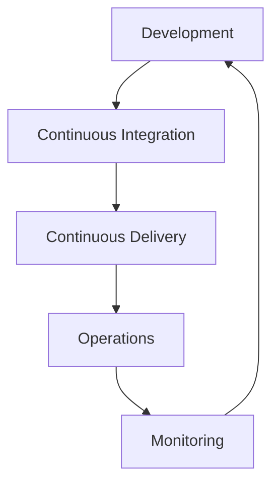

# The Comprehensive Guide to DevOps: Principles, Practices, and Tools

*Reading time: 2 min · 457 words*

> This comprehensive guide explores the fundamental principles of DevOps, including CI/CD pipelines, container orchestration with Kubernetes, infrastructure as code, and monitoring best practices. Learn how to implement DevOps methodologies to streamline software delivery and improve collaboration between teams.

## Table of Contents
- [Introduction to DevOps](#introduction-to-devops)
- [Core Principles of DevOps](#core-principles-of-devops)
  - [Automation](#automation)
  - [Continuous Integration and Delivery (CI/CD)](#continuous-integration-and-delivery-cicd)
  - [Infrastructure as Code (IaC)](#infrastructure-as-code-iac)
- [CI/CD Pipeline Components](#cicd-pipeline-components)
- [Containerization and Orchestration](#containerization-and-orchestration)
  - [Docker Basics](#docker-basics)
  - [Kubernetes Fundamentals](#kubernetes-fundamentals)
- [Monitoring and Logging](#monitoring-and-logging)
- [DevSecOps Practices](#devsecops-practices)
- [Real-World Example: E-Commerce Platform](#real-world-example-e-commerce-platform)
- [Conclusion](#conclusion)

## Introduction to DevOps

DevOps is a set of practices that combines software development (Dev) and IT operations (Ops) to shorten the systems development life cycle and provide continuous delivery with high software quality. It bridges the gap between development and operations teams through automation, collaboration, and shared responsibility.



## Core Principles of DevOps

The foundation of DevOps rests on several key principles:

### Automation
Automating repetitive tasks increases efficiency and reduces human errors. This includes:

- Automated testing
- Infrastructure provisioning
- Deployment processes

### Continuous Integration and Delivery (CI/CD)
CI/CD ensures code changes are automatically tested and deployed to production:

1. Developers commit code to version control
2. Automated builds are triggered
3. Tests are executed
4. Code is deployed to staging/production

### Infrastructure as Code (IaC)
Managing infrastructure using code and software development techniques:

```terraform
resource "aws_instance" "web" {
  ami           = "ami-0c55b159cbfafe1f0"
  instance_type = "t2.micro"
}
```

> **Key Note:** Infrastructure as Code enables version control for your infrastructure, making it reproducible and consistent across environments.

## CI/CD Pipeline Components

A typical CI/CD pipeline includes these stages:

| Stage         | Purpose                                                                 | Tools Example       |
|---------------|-------------------------------------------------------------------------|---------------------|
| Source        | Code is committed to version control                                   | Git, GitHub, GitLab |
| Build         | Code is compiled and built                                              | Maven, Gradle       |
| Test          | Automated tests are executed                                            | JUnit, Selenium     |
| Deploy        | Application is deployed to staging/production                          | Ansible, Kubernetes |
| Monitor       | Application and infrastructure are monitored                           | Prometheus, Grafana|

## Containerization and Orchestration

### Docker Basics
Docker packages applications and dependencies into containers:

```dockerfile
FROM node:14
WORKDIR /app
COPY package*.json ./
RUN npm install
COPY . .
EXPOSE 8080
CMD ["node", "server.js"]
```

### Kubernetes Fundamentals
Kubernetes automates container deployment, scaling, and management:

- **Pods**: Smallest deployable units
- **Deployments**: Manage pod replicas
- **Services**: Provide stable network access
- **ConfigMaps/Secrets**: Manage configuration

## Monitoring and Logging

Effective monitoring requires:

1. **Metrics Collection** (Prometheus)
2. **Log Aggregation** (ELK Stack)
3. **Alerting** (Grafana Alerts)
4. **Tracing** (Jaeger)

## DevSecOps Practices

Integrating security into DevOps:

- Shift Left security
- Automated security scanning
- Secrets management
- Compliance as code

## Real-World Example: E-Commerce Platform

Consider an e-commerce platform implementing DevOps:

1. Developers push code changes to Git
2. CI pipeline builds Docker images
3. Kubernetes deploys new containers
4. Canary release to 5% of users
5. Monitoring detects performance issues
6. Auto-scaling handles traffic spikes

## Conclusion

DevOps transforms software delivery through automation, collaboration, and continuous improvement. By adopting these practices, organizations can achieve faster release cycles, improved reliability, and better alignment between development and operations teams.

## Frequently Asked Questions

**Q: What is the main difference between Agile and DevOps?**

A: Agile focuses on iterative development with small, rapid releases, while DevOps extends Agile principles to include operations, aiming to automate and integrate processes between development and IT teams.

**Q: How does Kubernetes help in a DevOps environment?**

A: Kubernetes automates container deployment, scaling, and management, making it easier to maintain complex containerized applications across different environments.

**Q: What are the key benefits of Infrastructure as Code?**

A: IaC provides consistency, version control for infrastructure, repeatable deployments, and reduces manual configuration errors.

## Key Takeaways

- DevOps combines development and operations to enable continuous delivery
- Automation is crucial for efficiency and reducing human errors
- CI/CD pipelines automate testing and deployment processes
- Containerization with Docker and orchestration with Kubernetes are essential modern DevOps tools
- Monitoring and logging provide visibility into application performance
- Security should be integrated throughout the DevOps lifecycle (DevSecOps)

## Related Articles

- kubernetes-deep-dive
- terraform-for-beginners
- The Complete DevOps Interview Playbook for 2026
- Ultimate Guide to AWS Projects for Cloud Engineers

<!-- Cover image prompts (for editors):
  - A detailed illustration showing the complete DevOps lifecycle from development to monitoring with interconnected gears and arrows
  - A Kubernetes cluster diagram showing nodes, pods, and services with clear labeling of components
  - A comparison infographic of traditional deployment vs CI/CD pipeline workflow
  - A dashboard screenshot showing monitoring metrics in Grafana with CPU, memory, and network graphs
-->