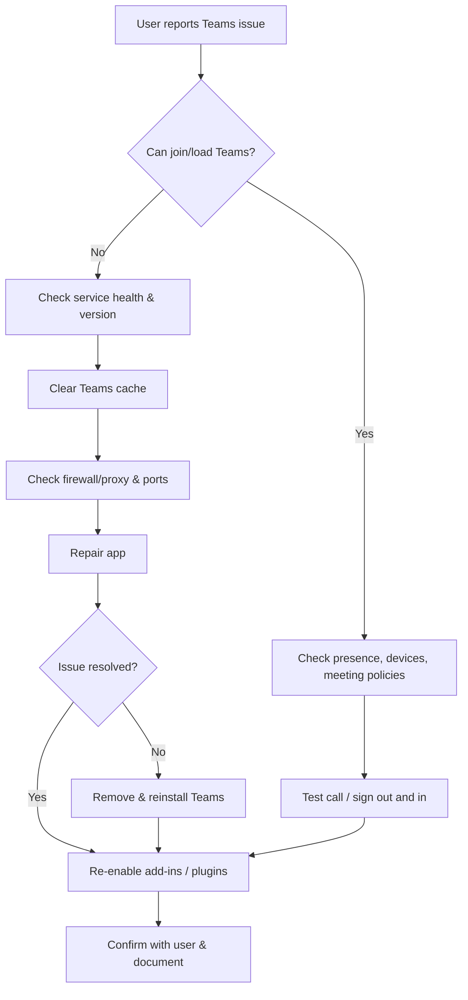

# IT Support & Administration: The Complete Interview Preparation Guide

IT Support and Administration is one of the most hands-on and demanding fields in technology. Whether you are troubleshooting a CEO's mailbox minutes before an important meeting, untangling a Microsoft Teams outage, or diagnosing a trust relationship failure on a domain-joined workstation, the way you approach a problem says as much about you as the final resolution.

This guide is compiled directly from a set of interview preparation notes covering twelve core sections of IT support work:

1. Outlook troubleshooting
2. Microsoft Teams & Outlook
3. Azure AD / Entra ID
4. Active Directory
5. Service Desk / IT Support
6. Exchange Online / M365 Advanced
7. Service Desk & ITSM
8. Active Directory & Azure AD
9. Office 365 / Outlook
10. Windows & Hardware Support
11. Scenario-Based IT Support
12. Networking & VPN

It walks through the most common scenario questions an interviewer will throw at you, plus the underlying best practices that separate an average technician from an excellent one.

## Table of Contents

- [Why This Guide Matters](#why-this-guide-matters)
- [Outlook Troubleshooting Fundamentals](#outlook-troubleshooting-fundamentals)
- [Microsoft Teams & Outlook Scenarios](#microsoft-teams--outlook-scenarios)
- [Active Directory: The Heart of On-Prem Identity](#active-directory-the-heart-of-on-prem-identity)
- [Azure AD / Entra ID: Modern Cloud Identity](#azure-ad--entra-id-modern-cloud-identity)
- [Exchange Online & Microsoft 365 Advanced](#exchange-online--microsoft-365-advanced)
- [Service Desk & ITSM Best Practices](#service-desk--itsm-best-practices)
- [Windows & Hardware Support](#windows--hardware-support)
- [Scenario-Based Problem Solving](#scenario-based-problem-solving)
- [Networking & VPN Essentials](#networking--vpn-essentials)
- [Key Takeaways](#key-takeaways)
- [Frequently Asked Questions](#frequently-asked-questions)
- [Related Articles](#related-articles)

## Why This Guide Matters

IT support interviews are almost never purely theoretical. Interviewers love *scenario questions* because they reveal how you actually think under pressure. You can memorize a definition of Active Directory, but can you explain what you would do when a user changed their domain password but the old one still works?

The good news is that nearly every scenario in IT support follows a similar pattern: **verify the basics, isolate the scope, check the most likely cause, escalate with evidence, and confirm the fix.** Master that loop and you can handle questions you have never seen before.

A recurring theme across all twelve sections is captured in one line from the source material:

> **Key Takeaway:** Stay calm, communicate clearly, prioritize smartly, follow structured troubleshooting, document everything, and continuously improve. These habits define an excellent IT Support professional.

Let's break the material down section by section so you can prepare with confidence.

## Outlook Troubleshooting Fundamentals

Outlook is the most frequently used business application at almost every organization, which is exactly why Outlook problems dominate IT support calls. The source notes cover ten scenarios that map to the most common real-world issues.

### The "Loading Profile" Freeze

When Outlook freezes on **"Loading Profile"** every morning after login, work a structured ladder:

1. Check network connectivity and VPN.
2. Ensure Outlook is not already running in the background (Task Manager).
3. Start Outlook in Safe Mode with `outlook.exe /safe`.
4. Disable all Add-ins and restart Outlook.
5. Create a new Outlook profile.
6. Repair Office: **Control Panel > Programs > Microsoft 365 > Change > Quick Repair**, then **Online Repair** if needed.
7. If the issue persists, check the OST file and recreate it if necessary.

The resolution is typically a new profile or a repaired installation.

### Emails Not Syncing

When Outlook opens but new emails do not appear while **OWA works fine**, you know the mailbox data is safe and the problem is on the client side:

- Verify Internet connectivity and VPN stability.
- Confirm Outlook is not stuck in **"Work Offline"** mode (check the Status bar).
- Trigger **Send/Receive All Folders (F9)**.
- Check **AutoArchive** settings, which may be silently moving emails.
- Verify mailbox size and item limits.
- Rebuild the OST file.
- Check Exchange Online service health.

Once the OST is rebuilt or settings are corrected, sync is typically restored.

### Can Send Internally, But Not Externally

This one points at mail flow rather than the client. Your checks should include:

1. Capture the error message shown when sending.
2. Verify SMTP settings (Exchange Online usually handles SMTP).
3. Check **Send As / Send on Behalf** permissions.
4. Verify the recipient address and any transport rules that might block it.
5. Check Exchange mail flow rules and outbound spam policy.
6. Confirm the user is not blocked or suspended.
7. Review the **NDR (Non-Delivery Report)** for details.

The fix is usually a permission, transport rule, or account issue.

### Crashes When Opening Attachments

If Outlook closes when opening PDF or Excel attachments, work through this order:

- Identify the exact file type causing the crash.
- Update Office to the latest build.
- Disable the Preview Pane and retry.
- Disable Add-ins, especially antivirus or PDF add-ins.
- Repair Office (Quick Repair then Online Repair).
- Check Windows/Office compatibility and update.
- Test in Safe Mode; if fixed, re-enable add-ins one by one.

### The Password Prompt Loop and Credential Manager

A repeated password prompt even after correct credentials are entered is classically a credential store or authentication problem:

- Clear stored credentials: **Control Panel > Credential Manager > Windows Credentials**.
- Remove old Outlook credentials.
- Ensure the correct account type (MFA / Modern Auth) is in use.
- Update Outlook and Windows.
- Create a new Outlook profile.
- On-premises: check Autodiscover and certificate trusts.

### Recovering Deleted Emails

When a user has permanently deleted emails, recovery happens through multiple Microsoft 365 layers:

1. **Deleted Items / Recoverable Items** – the user can restore within the retention period.
2. **eDiscovery** in the Microsoft 365 admin center – search and restore deleted items.
3. **Litigation Hold / In-Place Hold** – if enabled, recover from Purview eDiscovery.
4. **Backup / third-party tools** – if available.

The earlier you act within the retention window, the more options you have.

### Best Practices for Outlook Issues

The source closes the Outlook section with habits worth quoting in an interview:

- Keep Outlook and Office updated.
- Maintain an adequate mailbox quota.
- Use a consistent profile and avoid multiple profiles.
- Back up important PST/OST files.
- Monitor Exchange / Microsoft 365 Service Health.
- Educate users on email retention and cleanup.
- Always test after applying fixes.

## Microsoft Teams & Outlook Scenarios

Teams troubleshooting borrows heavily from the same principles, with a few specific twists around caching, policies, and meeting add-ins.

### Unable to Join Teams Meetings

Internet works fine, but the user cannot join a meeting. Work through:

1. Verify Teams service status at `status.office.com`.
2. Ensure the user runs the latest Teams version.
3. Clear the Teams cache (`%appdata%\Microsoft\Teams`).
4. Check firewall/proxy settings and allow Teams ports: **443, 3478, 3479, 8801, 8802, 19302, and UDP 3478–3481**.
5. Test in an InPrivate window or on a different network.
6. Check meeting policies — the user may be blocked from external or anonymous meetings.
7. Confirm the meeting link is correct and not expired.

### Teams Status Not Syncing with Outlook

Presence not updating based on calendar meetings usually comes down to settings and sign-in:

- Ensure the same account is signed in to Teams and Outlook.
- Confirm **"Automatically update my presence"** is enabled (Settings > Privacy).
- Verify Outlook is running and the calendar is not in Offline mode.
- Ensure calendar items have the correct status (Busy/Meeting).
- Restart Teams and Outlook, then sign out and back in if needed.

### Stuck on Loading Screen and Repeated Crashes

Both problems share a core set of remedies:

- End all Teams processes from Task Manager.
- Clear the cache and the contents of the `Cache`, `Code Cache`, `GPUCache`, `IndexedDB`, `Local Storage`, and `tmp` folders under `%appdata%\Microsoft\Teams`.
- Check system requirements and free disk space.
- Temporarily disable VPN/proxy and test.
- Repair Teams from Apps & Features, then reinstall if necessary.
- For crashes on launch, also check Windows Event Viewer, disable third-party plugins, and consider creating a new Windows user profile.

### Shared Mailbox and CEO Mailbox Recovery

Shared mailboxes disappearing from Outlook for multiple users calls for a back-to-basics check:

- Confirm the mailbox still exists in the Exchange Admin Center.
- Verify permissions (Full Access / Send As) are intact.
- Ensure the mailbox is not hidden from the Global Address List (GAL).
- Have users remove and re-add the mailbox (File > Account Settings > Advanced > Add).
- Rebuild the OST if a cached-mode issue is suspected.

If a CEO's mailbox was **accidentally deleted**, follow the recovery workflow:

1. Check **Deleted Users** in the Microsoft 365 admin center.
2. Restore the deleted mailbox (within 30 days).
3. If it was converted to a shared mailbox, convert it back to a user mailbox.
4. Verify licenses are assigned.
5. Verify mailbox data, folders, and permissions.
6. Escalate to backup/retention if the mailbox is beyond 30 days.

### Emails Going to Junk

Junk delivery for a specific sender across all employees points to anti-spam decisions:

- Check Junk Email Reports in Microsoft 365 Defender.
- Review mail flow rules that mark mail as spam.
- Add the sender/domain to Safe Senders (Exchange Admin Center > Threat Policies > Anti-spam).
- Check the sender domain's **SPF, DKIM, and DMARC** records.
- Ask users to mark the messages as "Not Junk."
- Monitor and release quarantined emails if needed.

## Active Directory: The Heart of On-Prem Identity

Active Directory (AD) represents a set of scenario questions that test your knowledge of replication, group policy, DNS, and profiles.

### Password Changed but Old Password Still Works

This is a classic that tests your understanding of *replication* and *caching*:

- Verify the password was actually changed in ADUC.
- Check replication status with `repadmin /replsummary`.
- Force replication if needed with `repadmin /syncall /AdeP`.
- Clear cached credentials on the client (`runas /netonly` or a restart).
- Check applications and services using old credentials (IIS, mapped drives, services).

The common causes are cached credentials on local systems, replication delay between domain controllers, and services holding stored old credentials.

### Group Policy Not Applying

If newly configured GPOs do not apply:

1. Run `gpresult /r` or `gpresult /h report.html` to see the results.
2. Verify the GPO is linked to the correct OU.
3. Check whether inheritance is blocked or the GPO is disabled.
4. Confirm the user/computer is in the correct OU.
5. Verify WMI filters and security filtering.
6. Run `gpupdate /force` on the client.
7. Review Event Viewer group policy logs.
8. Check network connectivity to the Domain Controller.

### Trust Relationship Failure

The error *"The trust relationship between this workstation and the primary domain failed"* is alarming for users but very solvable:

- Verify DNS is resolving the domain and domain controllers.
- Check the secure channel with `nltest /sc_verify:`.
- Reset the secure channel with `netdom resetpwd` or leave and rejoin the domain.
- Verify time sync between the client and the DC.
- Check for a duplicate computer account in AD and remove it if present.

### Domain Controller Not Replicating

Replication failures between domain controllers follow a predictable diagnosis:

- Check `repadmin /replsummary`.
- Look for errors with `repadmin /showrepl`.
- Verify time sync between DCs.
- Check network connectivity on ports **135, 389, 445, 5722**.
- Confirm DNS resolution between DCs.
- Review the Directory Service event log, then force replication with `repadmin /syncall /AdeP`.

### DNS Problems in the Domain

DNS is the glue of Active Directory. When users lose access to domain resources:

- Verify clients use the correct DNS server (`ipconfig /all`).
- Test resolution with `nslookup`.
- Ensure the DNS service is running on the DCs.
- Verify forward and reverse lookup zones.
- Check for duplicate or incorrect DNS records.
- Review DNS server event logs.
- Flush client caches with `ipconfig /flushdns`.
- Confirm DCs are registered correctly in DNS.

### Folder Access Denied

Access denied despite correct group membership means checking every layer:

- Verify group membership.
- Check **NTFS permissions** on the folder.
- Check **Share permissions** on the share.
- Review Effective Permissions (using tools like AccessChk).
- Look for **Deny** entries that take precedence.
- Ensure the user is using the correct UNC path.

> **Caution:** Deny permissions always override Allow permissions. If a user appears to have access through a group but is still denied, hunt for an explicit or inherited Deny entry on the NTFS or share ACL before anything else. This single detail resolves far more "Access Denied" tickets than people expect.

## Azure AD / Entra ID: Modern Cloud Identity

Azure AD — now known as **Entra ID** — is the cloud identity layer, and its scenarios revolve around authentication, MFA, Conditional Access, and synchronization.

### MFA Login Failure

When a user cannot sign in after MFA is enabled:

1. Verify the account is not locked.
2. Confirm the correct UPN and password.
3. Check that the user registered MFA methods.
4. Ensure they use the correct sign-in method (app notification, code, phone call).
5. Advise updating an outdated Microsoft Authenticator app.
6. Confirm device time and time zone are correct.
7. Check for Conditional Access policies blocking sign-in.
8. Review Sign-in logs in Entra ID for error details.
9. Test with the My Sign-Ins portal (`https://mysignins.microsoft.com`).

### Repeated Account Lockout

An account locking every few minutes even after a password reset is a red flag:

- Review recent sign-in logs for unusual activity (possible compromise).
- Look for old credentials saved on devices or applications.
- Check for password spray or brute-force attacks in the logs.
- Confirm whether a Conditional Access policy imposes sign-in restrictions.
- Review Windows event logs on the device for failed logons.
- Look for bad login attempts from legacy protocols or non-Microsoft apps.
- Force a sign-out from all sessions, reset the password, and enforce MFA.

### Conditional Access Blocking a Legitimate User

When a legitimate remote employee is blocked, work methodically:

- Review Sign-in logs for the failure reason and Conditional Access result.
- Identify the specific policy blocking the user.
- Check user location, device compliance, and risk status.
- Confirm the device meets the policy requirements (compliant / hybrid joined / trusted).
- Check that MFA was required and completed.
- Use the **What If tool** in Entra ID to evaluate policies.
- Temporarily exclude the user or adjust the policy when needed.

### Password Sync Failure from On-Prem AD

Password hash synchronization stopping between on-prem AD and Azure AD means checking the sync engine:

- Check the Azure AD Connect service status on the AAD Connect server.
- Review Azure AD Connect Health for sync errors.
- Check Event Viewer (Application log) on the AAD Connect server.
- Verify network connectivity to Microsoft endpoints: `login.microsoftonline.com` and `*.msappproxy.net`.
- Confirm Active Directory is reachable and healthy.
- Check password hash sync configuration and the last sync time.
- Run a Delta Sync or Full Sync if needed.
- Verify firewall/proxy settings are not blocking sync.

### Offboarding and Disabling a Leaver

The notes give a thorough offboarding workflow, emphasizing that "disabled" is not the same as "secure":

- Disable the account in AD and Azure AD.
- Revoke all active sessions.
- Remove the user from all groups and distribution lists.
- Remove application access and licenses.
- Transfer ownership of files, mailboxes, and resources.
- Recover and secure company assets (laptop, phone, ID cards).
- Update documentation and asset records.
- Verify access removal and review.

### Active Directory vs. Azure AD

Know the difference cold, because it is one of the most common questions:

| Area | Active Directory (On-prem) | Azure AD / Entra ID |
|------|---------------------------|---------------------|
| Deployment | On-premises in your data center | Cloud-based in Microsoft Azure |
| Management | Managed by local IT admin | Managed via Azure portal/cloud |
| Authentication | Primarily for on-prem resources | Cloud and hybrid resources |
| Access | Internal network (LAN/VPN) | Internet-based access |
| Scalability | Limited by hardware & infrastructure | Highly scalable and elastic |
| High availability | Requires manual configuration | Built-in |
| Features | Traditional AD features (GPO, etc.) | Modern identity (MFA, Conditional Access, SSO) |
| Use cases | Legacy apps, on-prem resources | SaaS apps, cloud, modern workplaces |

## Exchange Online & Microsoft 365 Advanced

The advanced section covers mail flow, search, permissions, archives, and the quirks of hybrid environments.

### Mail Flow Stopped Between Departments

When mail between two departments stops but everything else works:

1. Confirm the issue with sample emails from both sides.
2. Check if messages are stuck in Outbox/Sent Items.
3. Use **Exchange Admin Center > Mail flow > Message trace** between the two users.
4. Look for a transport rule blocking messages.
5. Verify Distribution Groups or Shared Mailboxes in the path.
6. Review mail flow connectors and domain settings.
7. Check quarantine, spam filtering, and content filter policies.
8. Review message headers for NDR or error details.

The resolution is about identifying the blocking point: a rule, connector, filter, policy, or quota.

### Shared Mailbox Permission Delay

Permissions assigned but not yet effective usually come down to replication or client state:

- Check permissions in EAC/EXO PowerShell.
- Wait for replication (this can take up to 24 hours).
- Ask the user to remove and re-add the mailbox.
- Restart Outlook or sign out and back in.
- Test using Outlook on the web.
- Check for any Conditional Access policy blocking access.

### Mailbox Converted to Shared Mailbox Incorrectly

The source flags a real-world gotcha: an admin converts a user mailbox to a shared mailbox and removes the license immediately, making data inaccessible. The explanation:

- Shared mailboxes still require an Exchange Online license (or an inactive mailbox with a license).
- Removing the license immediately can remove the mailbox from the active state.
- Data may go into an inactive mailbox state and become inaccessible without a license.
- Retention/hold settings may impact recovery.

The fix is to **re-assign an Exchange Online license**, wait for provisioning, verify the mailbox, re-add it in Outlook, and contact Microsoft support if data is still missing.

### Hybrid "DirSync Managed" Attributes

A hybrid user mailbox showing **"DirSync Managed"** means attributes (display name, email, phone, title) are controlled on-prem:

- Identify the attribute showing "DirSync Managed."
- Make changes in on-prem ADUC.
- Run `repadmin /replsummary` to ensure replication.
- Wait for the Azure AD Connect sync cycle to complete.
- Verify changes in the Microsoft 365 admin center.

### Exchange Online vs. On-Prem Exchange

This foundational comparison overlaps with the AD vs. Azure AD theme:

- **Exchange Online:** hosted by Microsoft, automatic updates, access from anywhere, highly scalable, subscription-based, built-in redundancy and a 99.9% SLA, backup/DR handled by Microsoft, meets global compliance standards.
- **On-prem Exchange:** hosted on your own servers, maintained by the IT team, manual installation, primarily internal access, limited by hardware, upfront licensing plus hardware plus maintenance, version-dependent manual updates, and your organization's responsibility for compliance.

## Service Desk & ITSM Best Practices

The Service Desk section is about process as much as technology, and it is where soft skills are tested.

### The Incident Management Process in ServiceNow

The source lays out a clean seven-step lifecycle:

1. **Identification** – incident logged via portal, email, phone, or monitoring and recorded.
2. **Logging & Categorization** – capture details, categorize, assign impact, urgency, and priority.
3. **Assignment** – assign to the right group/individual based on skill, category, and workload.
4. **Investigation & Diagnosis** – analyze, troubleshoot, identify root cause or workaround.
5. **Resolution & Recovery** – resolve and restore normal service.
6. **Closure** – confirm with the user, update the ticket, document, and close.
7. **Review & Reporting** – review metrics, trends, and root causes to prevent recurrence.

### Prioritizing P1, P2, and P3 Tickets

Know these definitions and their SLAs:

| Priority | Severity | SLA | Example |
|----------|----------|-----|---------|
| P1 – Critical | High impact, service down | 15 mins | System outage |
| P2 – High | Medium/high impact, partial outage | 1 hour | Major functionality issue with possible workaround |
| P3 – Moderate | Minor impact, few users | 4 hours | How-to requests, minor issues |

### Achieving First Contact Resolution (FCR)

FCR means resolving the issue in the first interaction without escalation or callback. The source attributes a 95% FCR to:

- Strong knowledge of systems and tools.
- Effective questioning to understand issues quickly.
- A well-documented knowledge base.
- Proper training and continuous learning.
- Ownership and follow-through until resolution.

### Incident vs. Service Request vs. Problem Management

These three terms are frequently compared:

- **Incident:** an unplanned interruption or reduction of an IT service; the goal is to restore normal service quickly.
- **Service Request:** a formal, non-urgent request for information, access, or a standard service; it does not impact availability.
- **Problem Management:** identifying the root cause of recurring incidents and implementing permanent solutions to prevent them.

## Windows & Hardware Support

This section covers the desktop side of the role.

### Slow Laptop and BSOD Troubleshooting

For a slow Windows 11 laptop:

- Check resource usage in Task Manager (CPU, Memory, Disk, Network).
- Restart the laptop.
- Apply Windows updates.
- Run a full malware scan.
- Disable unnecessary startup programs.
- Free up disk space and run Disk Cleanup.
- Check drive health (SMART) and run CHKDSK.
- Update drivers and BIOS.

For a **Blue Screen of Death (BSOD)**:

- Note the stop code and error message.
- Search the stop code online (Microsoft Docs).
- Boot into Safe Mode if possible.
- Uninstall recent updates/drivers.
- Update or rollback drivers.
- Run Windows Memory Diagnostic.
- Run `sfc /scannow` and DISM.
- Check the disk with `chkdsk /f`.
- If unresolved, collect the minidump and escalate, or perform a system restore/reset.

### Laptop Imaging and Deployment

A strong deployment process follows this order:

1. Prepare and update the master image.
2. Capture the image (sysprep).
3. Store it on a deployment server / SCCM / Intune.
4. Boot via network/USB.
5. Apply the image.
6. Install drivers and Windows updates.
7. Join the domain/Azure AD.
8. Install required applications.
9. Apply policies and configurations.
10. Run asset tagging and encryption.
11. Test, document, and hand over.

### The Three Golden Rules of Hardware Support

The hardware section reinforces habits that parallel the troubleshooting philosophy everywhere else:

- **Troubleshoot before replacing** – never swap hardware without first verifying the issue.
- **Document everything** – step taken, findings, and outcomes.
- **Test after the change** – confirm the issue is truly resolved before closing out.

## Scenario-Based Problem Solving

Interviewers love situational questions that test prioritization, communication, and composure. The source provides several strong examples.

### A VIP Cannot Access Outlook Before a Meeting

- Acknowledge immediately and apologize.
- Gather quick details (error, start time, changes).
- Check Outlook/Exchange Online service health.
- Verify account status, license, and mailbox access.
- Test OWA to confirm mailbox access.
- Clear cache or restart in Safe Mode.
- Check connectivity and DNS.
- Reset or recreate the profile if needed.
- Keep the VIP updated every few minutes.
- Confirm resolution and ensure meeting access.

### You Receive 20 Tickets After a Network Outage

- Stay calm and assess the situation.
- Identify the root cause (the network outage).
- Create a Major Incident if applicable.
- Communicate with all users.
- Prioritize and group similar tickets.
- Work with the network team to restore service.
- Update all related tickets at once.
- Resolve in bulk, close with a resolution note.
- Review and document for future improvement.

### VPN Connected but No Internal Access

- Confirm the VPN connection and the IP assigned.
- Check the user is on the correct internal IP range.
- Ping the gateway and internal resources.
- Verify DNS resolves internal domains.
- Check VPN split-tunneling settings.
- Confirm correct AD group/policy membership.
- Check firewall rules and permissions.
- Try accessing via IP address instead of hostname.
- Escalate to the network team with logs if needed.

### A Ticket Is Outside Your Scope

This tests professionalism and boundary-setting:

- Listen and empathize.
- Explain the scope of your role clearly and politely.
- Assure the user you will help by raising it with the right team.
- Create a ticket and route it appropriately.
- Escalate if urgent and keep the user informed.
- Follow up until the user is satisfied.

## Networking & VPN Essentials

The final section rounds out the foundation every support tech needs.

### DNS and DHCP, in Simple Terms

- **DNS (Domain Name System)** – the "phonebook" of the internet; it translates domain names like `google.com` into the IP addresses computers use to reach each other.
- **DHCP (Dynamic Host Configuration Protocol)** – the "automatic address provider"; it assigns IP addresses and other network settings to devices automatically.

### LAN vs. WAN

- **LAN (Local Area Network)** covers a small area such as a home or office, is high speed, privately owned, and is often an office network.
- **WAN (Wide Area Network)** spans large geographic areas such as cities or countries, has relatively lower speed (dependent on ISP), uses public/leased connections, and the Internet is the canonical example.

### Diagnostic Tools

A support professional should be fluent in the core toolset:

| Tool | Purpose |
|------|---------|
| `ping` | Tests connectivity and response time |
| `ipconfig` / `ifconfig` | Displays IP configuration |
| `tracert` / `traceroute` | Shows the path packets take |
| `nslookup` / `dig` | Queries DNS information |
| `pathping` | Combines ping and tracert |
| `netstat` | Displays network connections |
| Wireshark | Packet capture and analysis |
| Speedtest | Tests bandwidth |
| Event Viewer | Windows event logs |

### TCP/IP Basics

TCP/IP is the set of rules that lets devices communicate over a network or the internet. Two core protocols:

- **IP (Internet Protocol)** handles addressing and routing of packets between devices (IPv4, IPv6).
- **TCP (Transmission Control Protocol)** ensures reliable delivery with error checking, sequencing, and retransmission.

The four-layer TCP/IP model is worth memorizing:

- **4. Application Layer** – HTTP, DNS, SMTP, FTP.
- **3. Transport Layer** – TCP/UDP, end-to-end communication.
- **2. Internet Layer** – IP, logical addressing and routing.
- **1. Network Access Layer** – physical addressing/MAC and data transmission.

### Is It a Network Issue or an Application Issue?

This is one of the most practical diagnostic skills:

- **Network-related signs:** cannot ping the server/website, DNS resolution fails, high packet loss or latency, multiple applications affected, users on the same network impacted.
- **Application-related signs:** network tests succeed, only one application is affected, works on some devices/accounts but not others, application errors or service outages.

Start with basic network tests. If the network is healthy, focus on the application.

## Key Takeaways

- **Follow a structured loop** — verify the basics, isolate scope, check the most likely cause, escalate with evidence, and confirm the fix — for every scenario, no matter how unusual it seems.
- **Outlook and Teams problems** are usually resolved by clearing caches/credentials, rebuilding the OST, repairing Office, and re-checking service health before escalating.
- **Know your identity layers** — on-prem Active Directory (replication, GPO, DNS) and Azure AD/Entra ID (MFA, Conditional Access, provisioning, sync) are the most heavily tested areas.
- **"Disabled is not secure"** when offboarding — always revoke sessions, remove group memberships, transfer ownership, and disable forwarding and tokens.
- **Deny permissions override Allow** in both NTFS and SharePoint/Teams contexts, so hunt for Deny entries when access is mysteriously denied.
- **Communication and documentation matter as much as technical skill** — staying calm, setting expectations, updating users, and documenting actions is what makes an excellent IT support professional.

## Frequently Asked Questions

**Q1: What is the difference between an incident and a problem?**

An **incident** is an unplanned interruption or reduction of an IT service whose goal is to restore service quickly. **Problem Management** is the separate process of identifying the root cause of recurring incidents and implementing permanent fixes to prevent them.

**Q2: How do I prioritize a P1, P2, and P3 ticket?**

P1 (Critical, 15-minute SLA) is a service-down or major business impact requiring immediate attention. P2 (High, 1-hour SLA) is a partial outage with workaround possible. P3 (Moderate, 4-hour SLA) is a minor impact or how-to request affecting few users.

**Q3: Why is my Outlook password prompt looping even after correct credentials?**

Usually stale credentials. Clear them in **Control Panel > Credential Manager > Windows Credentials**, ensure correct modern auth/MFA setup, update Office and Windows, create a new profile, and (for on-prem) check Autodiscover and trusts.

**Q4: How do I recover emails that were permanently deleted?**

Restore from Deleted Items or Recoverable Items within the retention period, use eDiscovery in the Microsoft 365 admin center, recover from Purview eDiscovery if Litigation/In-Place Hold is enabled, or rely on backup/third-party tools when available.

**Q5: How do I tell whether a problem is network-related or application-related?**

If you cannot ping the server, DNS fails, there is high packet loss/latency, or multiple applications are affected, suspect the network. If network tests pass and only one application is affected (working on some devices but not others), focus on the application.

## Related Articles

- Azure AD / Entra ID for the Hybrid Workplace
- Exchange Online Troubleshooting Essentials
- Mastering the Service Desk: ITSM Fundamentals
- Windows 11 Administration and Hardware Support Basics