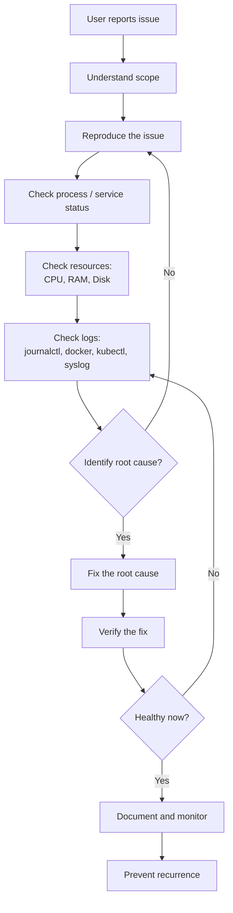

# DevOps Troubleshooting Mastery: A Practical Cheat Sheet for Common Issues

Every DevOps engineer eventually faces the same panicked moment: a user reports that the application is down, you cannot SSH into an EC2 instance, or a container is stuck in `CrashLoopBackOff`. Where do you start? Which command do you run first? And how do you answer the inevitable interview question about it?

Troubleshooting is not guesswork. It is a repeatable, methodical process that combines the right commands with a calm, logical flow. This article distills a DevOps troubleshooting cheat sheet into a complete guide: the common issues you will hit, the exact commands to diagnose each one, the recommended troubleshooting flow, and the interview questions you are likely to be asked — all drawn directly from a condensed DevOps reference document.

Whether you are a beginner learning Linux-based operations or an experienced SRE preparing for an interview, treat this as your field manual.

*Image credit: [Wikimedia Commons](https://commons.wikimedia.org/wiki/File:Devops.png)*

## Table of Contents

- [A Systematic Approach to Troubleshooting](#a-systematic-approach-to-troubleshooting)
- [Application Not Working and Website Down](#application-not-working-and-website-down)
- [SSH Connection Failed](#ssh-connection-failed)
- [High CPU and Memory Usage](#high-cpu-and-memory-usage)
- [Disk Full](#disk-full)
- [Docker Container Down and CrashLoopBackOff](#docker-container-down-and-crashloopbackoff)
- [Kubernetes ImagePullBackOff and Pod Down](#kubernetes-imagepullbackoff-and-pod-down)
- [Jenkins Build Failed](#jenkins-build-failed)
- [AWS EC2 Troubleshooting](#aws-ec2-troubleshooting)
- [Service Not Starting](#service-not-starting)
- [Quick Reference: Essential Log Locations](#quick-reference-essential-log-locations)
- [DevOps Interview Tips](#devops-interview-tips)
- [The End-to-End Troubleshooting Flow](#the-end-to-end-troubleshooting-flow-mermaid)
- [Key Takeaways](#key-takeaways)
- [Frequently Asked Questions](#frequently-asked-questions)
- [Related Articles](#related-articles)

## A Systematic Approach to Troubleshooting

The source document emphasizes a general troubleshooting methodology that applies across every scenario below. It is a nine-step flow, and internalizing it will help you remain systematic instead of panicking when things break.

1. **Understand the scope.** Identify what is broken, who reported it, and what the expected behavior should be.
2. **Reproduce the issue.** Confirm you can see the same failure before you start changing things.
3. **Gather information.** Collect logs, statuses, and metrics rather than guessing.
4. **Check process / service status.** Is the process running, exited, or restarted?
5. **Check resources.** Look at CPU, RAM, disk, and network utilization.
6. **Check logs.** The journals, application logs, and system logs are your first evidence source.
7. **Fix the root cause.** Address the underlying problem, not just the symptom.
8. **Verify the fix.** Confirm the symptom is gone and the service is healthy.
9. **Document and monitor.** Capture what happened and add monitoring so it does not recur silently.

> "The more you troubleshoot, the better you get. Troubleshooting is a superpower in DevOps." This is the core message of the source cheat sheet — skill comes from practice, not from memorizing commands alone.

This loop is iterative. You may fix one cause, reintroduce the service, and discover a second issue. That is normal. Each pass through the flow brings you closer to a stable system.

## Application Not Working and Website Down

The most common—and most urgent—incident is a user reporting that the application is not working, or that a website is unreachable. The source suggests starting from the user report and working outward, gathering evidence at every step.

### The Diagnostic Flow

1. A user reports the app is not working.
2. Check the process and service status on the host.
3. Look at application logs and resource usage.
4. Verify connectivity to the service and any dependencies.

### Useful Commands

| Purpose | Command |
| --- | --- |
| Find the running process | `ps -ef \| grep app` |
| Check CPU and memory in real time | `top` / `htop` |
| Check systemd service status | `systemctl status app` |
| View recent service logs | `journalctl -xe app` |
| List listening ports and sockets | `netstat -tulnp` |
| Trace process files | `lsof` |
| Check service configuration | `systemctl status nginx` |

The pattern is always the same: confirm the process is running, confirm the service unit is active, confirm the port is listening, and then read the logs for the actual error message. A site that returns 500 errors on the web but shows a healthy process is a clue that the problem is in the application layer, not the operating system.

## SSH Connection Failed

Being locked out of a server is frustrating because every other troubleshooting action depends on getting a shell. The source breaks the SSH failure flow into connectivity, service, security, and configuration checks.

### The Diagnostic Flow

1. Test basic ICMP connectivity with `ping`.
2. Verify DNS resolution with `nslookup` and `dig`.
3. Test the SSH port with `telnet`.
4. Try the SSH connection itself.
5. If that fails, check the SSH daemon service and configuration, plus firewall/security rules.

### Useful Commands

| Purpose | Command |
| --- | --- |
| Check basic reachability | `ping SERVERIP` |
| Verify DNS resolution | `nslookup example.com` |
| Detailed DNS lookup | `dig example.com` |
| Test port 22 reachability | `telnet SERVER 22` |
| Attempt the connection | `ssh -v user@server_ip` |
| Check SSH daemon status | `sudo systemctl status sshd` |
| Review SSH logs | `sudo journalctl -u sshd` |

The `-v` (verbose) flag on `ssh` is invaluable because it shows exactly which stage of the handshake is failing: DNS, TCP connection, authentication, or key exchange. If `ping` works but `telnet SERVER 22` fails, the problem is almost certainly a firewall or security group blocking the port rather than the server being offline.

> **Caution:** A server answering `ping` does not mean SSH will work, and a server that does not answer `ping` (many cloud firewalls block ICMP) may still accept SSH. Test the actual port and use verbose output before concluding the machine is down.

## High CPU and Memory Usage

When a system is slow, users complain about lag, and the first thing to check is resource utilization. The source provides the flow for both CPU and memory pressure.

### High CPU Usage

1. Open `top` or `htop` to see live usage.
2. Identify the CPU-hungry process.
3. Analyze with `mpstat` for per-CPU breakdown.
4. If it is excessive, terminate the process with `kill -9 ID`.

### High Memory Usage

1. Check memory pressure with `free -m`.
2. Inspect with `htop`.
3. Sort processes by memory consumption.
4. Examine kernel memory info with `cat /proc/meminfo`.

### Useful Commands

| Purpose | Command |
| --- | --- |
| Live resource overview | `top` |
| Live view with friendlier UI | `htop` |
| Sort processes by CPU | `ps aux --sort=-%cpu` |
| Per-CPU statistics | `mpstat` |
| Memory overview in MB | `free -m` |
| Sort processes by memory | `ps aux --sort=-%mem` |
| Virtual memory statistics | `vmstat` |
| Kernel memory details | `cat /proc/meminfo` |

Sorting with `ps aux --sort=-%cpu` (or `-` memory) is the fastest way to identify the top consumer and decide whether it is an expected workload, a memory leak, or a runaway process. `vmstat` gives a broader view of swap activity, which is a strong indicator of memory pressure.

## Disk Full

A full disk is one of the most common causes of sudden application failure, since processes cannot write logs, create temporary files, or update state. The source covers the flow to identify and reclaim space.

1. Check overall disk usage per filesystem.
2. Find the largest directories and files.
3. Freed space after targeting the culprits.

The `df -h` (or `df -T`) command shows you filesystem capacity and usage, while `du` and `find` help you locate the specific directories and files consuming the space. Clearing old logs, removing stale build artifacts, and pruning Docker images are typical fixes on operational servers.

## Docker Container Down and CrashLoopBackOff

In a containerized environment, the source flags two recurring failure states: a container that exits immediately, and Kubernetes pods stuck in `CrashLoopBackOff` or `ImagePullBackOff`.

### Docker Container Exits Immediately

| Purpose | Command |
| --- | --- |
| List all containers and status | `docker ps -a` |
| Read the container logs | `docker logs <container>` |
| Inspect the container configuration | `docker inspect <container>` |
| Check exposed port mappings | `docker port <container>` |

### A Typical Docker Flow

1. The container is stopped or exiting.
2. Check its logs for the error.
3. Inspect the container configuration.
4. Fix the root cause.
5. Restart or redeploy the container.

> **Caution:** `docker ps` only shows running containers. Always use `docker ps -a` to see containers that have already exited, otherwise you will miss the evidence of the failure entirely.

## Kubernetes ImagePullBackOff and Pod Down

Moving up the stack, Kubernetes adds another layer of state. The source covers both pods that keep restarting (`CrashLoopBackOff`) and pods that cannot pull an image (`ImagePullBackOff`).

| Purpose | Command |
| --- | --- |
| Get the pod status | `kubectl get pods` |
| Read pod logs | `kubectl logs <pod>` |
| Inspect the pod details and events | `kubectl describe pod <pod>` |
| Inspect a ReplicaSet | `kubectl describe rs/<rs>` |
| Redeploy after a fix | `kubectl rollout restart` |

### The Kubernetes Flow

1. Check the pod status with `kubectl get pods`.
2. Read logs for the crashing container.
3. Use `kubectl describe` to inspect the state and events.
4. Fix the identified root cause.
5. Restart the deployment or replicaset.

`kubectl describe pod` is the key debugging tool here. It surfaces events such as failed image pulls, missing registries, security policy rejections, or a container that keeps starting and then exiting. A pod in `CrashLoopBackOff` generally means the application itself is failing on startup; a pod in `ImagePullBackOff` means Kubernetes cannot fetch the container image in the first place.

## Jenkins Build Failed

A failing CI/CD pipeline blocks all further development. The source gives a clear flow for debugging a Jenkins build failure.

1. Check the console output for the failure reason.
2. Review Jenkins logs.
3. Inspect the workspace and build code.
4. Check application/Docker logs if the build runs containers.
5. Investigate stale caches or credentials.

### Useful Commands

| Purpose | Command |
| --- | --- |
| See the build console output | `journalctl -u jenkins` |
| Grep the workspace logs | `cat workspace/*/log` |
| Check logs from containerized builds | `docker logs <app>` |
| Review Jenkins service state | `systemctl status jenkins` |

Typical culprits include failed dependency downloads, changed credentials, timeout on a long-running stage, or a code error introduced in the latest commit. Start with the console output — it almost always states which stage failed and, often, the exact line of the error.

## AWS EC2 Troubleshooting

Cloud VMs add networking, security-group, and IAM considerations on top of normal host issues. The source covers the EC2-specific flow for an unreachable instance.

1. Verify the instance responds to `ping`.
2. Check instance status with `aws ec2 describe-instances`.
3. Inspect security groups with `aws ec2 describe-security-groups`.
4. Review instance status and CloudWatch logs with `aws ec2 get-instance-status` and CloudWatch.
5. Check the OS console logs for boot failures.

### Useful Commands

| Purpose | Command |
| --- | --- |
| Test reachability | `ping SERVER IP` |
| Describe instance state | `aws ec2 describe-instances` |
| Describe security groups | `aws ec2 describe-security-groups` |
| Get instance status | `aws ec2 get-instance-status` |
| Review CloudWatch logs | CloudWatch log groups |

A very common cause of an "unreachable" EC2 instance is a security group that does not allow the required inbound port, or a network ACL misconfiguration — regardless of the instance's health state. If the instance appears `running` in `describe-instances` but does not answer over SSH, check the security group inbound rules before assuming the operating system is at fault.

## Service Not Starting

Finally, a Linux systemd service that refuses to start is a classic scenario. The source lays out the diagnostic flow.

1. Check the service status with `systemctl status SERVICE`.
2. Read the service logs with `journalctl -u SERVICE`.
3. Inspect the unit configuration in `/etc/<service>.conf`.
4. Reload the daemon and re-attempt: `systemctl daemon-reload`.

### Useful Commands

| Purpose | Command |
| --- | --- |
| Check service status | `systemctl status SERVICE` |
| View verbose service logs | `journalctl -u SERVICE` |
| Inspect the unit file | `cat /etc/<service>.conf` |
| Reload after editing units | `systemctl daemon-reload` |

If a service fails to start, verify the unit file syntax, look for missing environment variables or paths, and confirm the service user has the right permissions. After fixing the configuration, run `systemctl daemon-reload` before starting the service again so systemd picks up your changes.

## Quick Reference: Essential Log Locations

The source groups a set of "golden commands" that every engineer should memorize. Rather than hunting blindly, check these standard log locations first.

| Log / Location | What It Captures |
| --- | --- |
| `journalctl` | Centralized systemd journal logs |
| `/var/log/messages` | General system messages |
| `dmesg` / kernel messages | Boot and kernel events |
| `/var/log/syslog` | System and application logs on many distros |
| Application-specific logs | e.g. `/var/log/nginx`, `/var/log/jenkins/jenkins.log` |
| `docker logs <container>` | Container stdout/stderr |
| `kubectl logs <pod>` | Pod container logs |
| `kubectl describe pod` | Pod events and state detail |

The pattern to remember: system message logs and the journal for the OS, Docker and kubectl for the container layer, and application-specific files for the app itself. Working through these in order almost always reveals the root cause.

## DevOps Interview Tips

The source closes with interview guidance, framing troubleshooting as an interview subject in its own right. The recurring questions are:

- The application is down — what will you check first?
- You are unable to SSH into EC2, how will you troubleshoot?
- CPU is at 100%, how will you fix the lag and high CPU usage?
- The system is slow due to high memory usage, what will you do?
- Disk is full, how will you free up space?
- The container is getting terminated immediately, how will you resolve it?
- The pod is in `CrashLoopBackOff` or `ImagePullBackOff`, how will you fix it?
- The Jenkins build failed, where will you check?
- The EC2 instance is not reachable, how will you troubleshoot?
- The service failed to start, what will you check?

### Golden Rules for Interview Responses

1. **Stay calm and gather information.** Do not jump to conclusions.
2. **Always check logs first.** Logs are your primary evidence.
3. **Monitor resources** — CPU, RAM, and disk.
4. **Check the process** — is it running or did it exit?
5. **Document and learn** from each incident.

> "The more you troubleshoot, the better you get." Interviewers reward a structured, step-by-step answer that shows you reason from evidence to root cause, not just a memorized list of commands.

A strong answer walks the interviewer through the full loop: identify the symptom, reproduce, gather log evidence, check resources and process state, fix the root cause, verify, and then monitor. That structure demonstrates judgment, which is what senior DevOps roles are really evaluating.

## The End-to-End Troubleshooting Flow (Mermaid)

The flowchart below summarizes the SOP applied across every scenario in this article — from the initial user report, through layered diagnosis, to verification and documentation.

## Key Takeaways

- Troubleshooting follows a predictable nine-step loop: understand the scope, reproduce, gather information, check process and service state, check resources, check logs, fix the root cause, verify, and document and monitor.
- Always start with the right command for the symptom — `journalctl` and logs are the first source of evidence for nearly every incident.
- For outbound access issues, test connectivity in layers: `ping` for reachability, `nslookup`/`dig` for DNS, and `telnet` for the actual port, since ICMP behavior can be misleading.
- Containers are invisible to `docker ps` once they exit, so use `docker ps -a`; for Kubernetes, `kubectl describe pod` reveals the events behind `CrashLoopBackOff` and `ImagePullBackOff`.
- Cloud instances introduce security groups, network ACLs, and IAM on top of host issues, so verify network rules when an EC2 instance appears unreachable.
- Interviewers reward structured reasoning from evidence to root cause over memorized commands — stay calm, check logs, monitor resources, and document what you learn.

## Frequently Asked Questions

**What should I check first when an application is down?**
Start by confirming the process is running with `ps -ef | grep app` and the service status with `systemctl status app`, then read the application and journal logs. Logs almost universally reveal the underlying error.

**Why does a server respond to ping but fail on SSH?**
Ping tests ICMP reachability only, while SSH requires the TCP port 22 (typically 22) to be open. If `telnet SERVER 22` fails but ping succeeds, the port is likely blocked by a firewall or security group. Use `ssh -v` to see the exact failing stage.

**How do I find the process consuming the most CPU or memory?**
Use `top` or `htop` for live usage, then `ps aux --sort=-%cpu` or `ps aux --sort=-%mem` to rank processes. `mpstat` and `vmstat` give deeper CPU and memory analytics.

**What is the difference between CrashLoopBackOff and ImagePullBackOff in Kubernetes?**
`ImagePullBackOff` means Kubernetes cannot pull the container image (wrong tag, missing registry access, or auth problem). `CrashLoopBackOff` means the image is pulled but the container keeps starting and immediately exiting — an application-level failure diagnosed through `kubectl logs` and `kubectl describe pod`.

**An EC2 instance is unreachable even though it is running. What do I check?**
Verify the instance with `aws ec2 describe-instances` and `get-instance-status`, review the security groups with `describe-security-groups` for the required inbound port, and check CloudWatch and OS console logs. A common cause is a misconfigured security group or network ACL rather than a host failure.

## Related Articles

The source document is a condensed cheat sheet and does not reference specific companion articles. Topics that naturally extend from it include the basics of `systemd` and `journalctl` for service management, the fundamentals of Docker container operations, getting started with Kubernetes for pod lifecycle management, and CloudWatch basics for AWS EC2 monitoring — though these are not covered in the source material itself.
