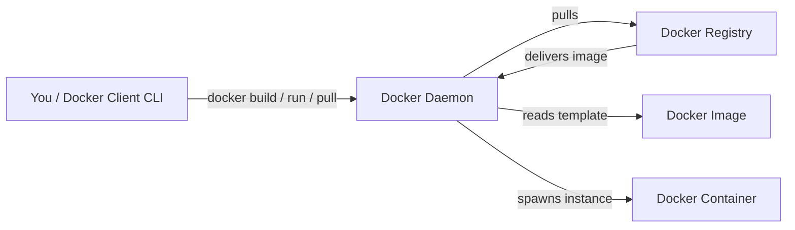
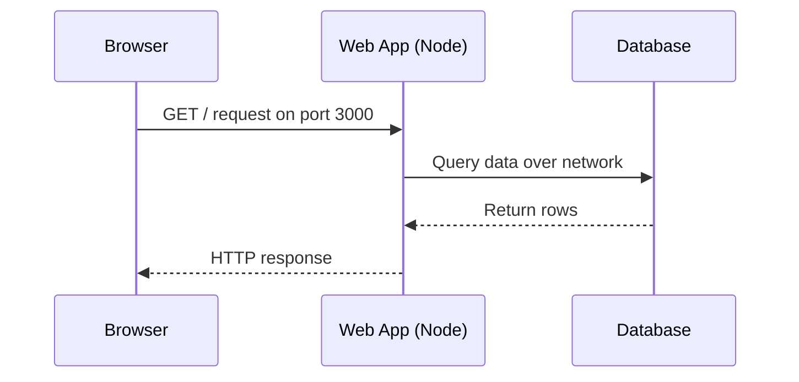

# Docker from Basic to Advanced: A Complete Hands-On Guide

Docker has become the de facto standard for building, shipping, and running applications in a reliable, reproducible way. Whether you are a developer, a tester, or a DevOps engineer, understanding containers is no longer optional — it is the foundation of modern infrastructure. This article distills a comprehensive Docker study guide into a single, structured reference that takes you from the very basics of what Docker is, through images and containers, volumes and networks, and all the way up to Docker Compose, Docker Hub, and the classic interview questions.

If you are starting from zero, don't worry. We begin with the fundamentals and build up layer by layer, exactly the way Docker builds its images.

## Table of Contents

- [Introduction to Docker](#introduction-to-docker)
- [Docker Components](#docker-components)
- [Docker Architecture](#docker-architecture)
- [Installing Docker on Linux](#installing-docker-on-linux)
- [Docker Images](#docker-images)
- [Docker Containers](#docker-containers)
- [Building Images with Dockerfiles](#building-images-with-dockerfiles)
- [Run Options and Environment Variables](#run-options-and-environment-variables)
- [Volumes for Persistent Data](#volumes-for-persistent-data)
- [Networks and Container Communication](#networks-and-container-communication)
- [Real World Example: A Node.js App with Docker Compose](#real-world-example-a-nodejs-app-with-docker-compose)
- [Docker Compose](#docker-compose)
- [Docker Registry and Docker Hub](#docker-registry-and-docker-hub)
- [Docker CLI Quick Reference](#docker-cli-quick-reference)
- [Top Docker Interview Questions](#top-docker-interview-questions)
- [Key Takeaways](#key-takeaways)
- [Frequently Asked Questions](#frequently-asked-questions)

## Introduction to Docker

Docker is an **open-source platform** used to build, ship, and run applications inside **containers**. The core idea is simple but transformative: instead of installing software directly on a host machine and hoping it behaves the same everywhere, you package your application together with everything it needs, and run that package in an isolated, lightweight environment.

The key benefits called out time and time again are:

- **Lightweight, consistent environments** — the same container runs identically on a developer laptop, a test server, and production.
- **Easy to build, ship, and run** — one workflow carries an application through the entire lifecycle.
- **Isolation with all dependencies** — an application in a container carries its Python, Node, or system libraries with it, so it does not pollute or conflict with the host or other containers.

This consistency is the heart of what makes Docker so valuable: "it works on my machine" becomes a thing of the past.

## Docker Components

Before we dive into commands, it is important to understand the four pieces that make up Docker. Each component plays a distinct role.

| Component | Description |
| --------- | ----------- |
| Docker Client | The CLI (Command-Line Interface) you interact with |
| Docker Host | The machine on which Docker runs |
| Docker Daemon | The Docker Engine that actually does the work |
| Image | A read-only template used to create containers |
| Container | A running instance created from an image |

The Flow between these pieces is easy to remember: you use the **Docker Client** to send commands to the **Docker Daemon** on the **Docker Host**. The daemon pulls or builds **images** (read-only templates) and turns them into running **containers**.

## Docker Architecture

Understanding the relationship between these parts is the single most important mental model to carry forward. Images are the blueprints; containers are the live copies.



- The **Docker Client** is your `docker` CLI.
- The **Docker Daemon** (docker engine) on the **Docker Host** performs all the heavy lifting: pulling, building, and running.
- The **Registry** (like Docker Hub) stores and distributes images.
- An **Image** is a read-only template.
- A **Container** is the running instance of that image.

This client–server architecture means you can even talk to a remote host's daemon from your local client, but for most beginners everything lives on one machine.

## Installing Docker on Linux

The source guide walks through a standard installation flow for Linux (Ubuntu). The general sequence for adding the official Docker repository is:

1. Update the package index.
2. Install dependencies: `ca-certificates`, `curl`, `gnupg`, and other prerequisites.
3. Create the keyrings directory.
4. Fetch Docker's GPG key and convert it for use with apt.
5. Add the official Docker repository to your sources list.
6. Update the index and install `docker-ce` and `docker-ce-cli`.
7. Start the service and enable it on boot.

### Common Installation Steps

```bash
# 1. Update package index
sudo apt update

# 2. Install dependencies
sudo apt install -y ca-certificates curl gnupg

# 3. Start & enable the Docker service
sudo systemctl start docker
sudo systemctl enable docker
```

The source does not cover Windows or macOS installation commands; it focuses on Linux. If you are on those platforms, that part is not covered by the source document.

## Docker Images

An **image** is a read-only template. It is like a snapshot of an application and every tool it needs. Images are built in **layers**; each instruction in a Dockerfile adds a new layer on top of the previous one, which is why images are efficient to share and cache.

### Basic Image Commands

| Command | Purpose |
| --- | --- |
| `docker pull <image>` | Pull an image from a registry |
| `docker images` | List local images |
| `docker rmi <image>` | Remove an image |
| `docker image prune` | Remove unused images |
| `docker history <image>` | Show the layers that make up an image |
| `docker build -t <name>` | Build an image with tag |

```bash
docker pull node:18-alpine
docker images
docker history node:18-alpine
```

### Building Images

To build an image from your local code you use `docker build`:

```bash
# Build an image with a tag pointing to the current directory
docker build -t <name> .
# The tag marks the image by name and optionally version
```

The tag syntax is `<username>/<repo>:<tag>`, which becomes central when you push images to a registry.

## Docker Containers

A **container** is a running instance of an image. While an image is static and read-only, a container is that image brought to life — it can be started, stopped, restarted, and inspected.

### Core Container Lifecycle Commands

| Command | Purpose |
| --- | --- |
| `docker run <image>` | Run a container from an image |
| `docker run -d <image>` | Run in detached (background) mode |
| `docker ps` | List currently running containers |
| `docker ps -a` | List all containers, including stopped |
| `docker stop <id>/<name>` | Stop a running container |
| `docker start <id>/<name>` | Start a stopped container |
| `docker restart <id>/<name>` | Restart a container |
| `docker rm <id>/<name>` | Remove a container |
| `docker rm -f <id>/<name>` | Force-remove a running container |
| `docker logs <id>/<name>` | View or follow the logs of a container |
| `docker exec -it <container> bash` | Exec (open a shell) inside a running container |

```bash
docker run -d nginx          # run in background
docker ps                    # see it running
docker exec -it <id> bash     # open a shell inside it
docker stop <id>              # stop it
docker rm <id>                # remove it
```

## Building and Images with Dockerfiles

A **Dockerfile** is a text file containing the instructions Docker uses to build an image. It is the recipe for your application's template.

### Common Dockerfile Instructions

| Instruction | Purpose |
| --- | --- |
| `FROM <image>` | Set the base image (the starting point) |
| `RUN <command>` | Run a command during the build |
| `COPY <src> <dest>` | Copy files from the build context into the image |
| `ADD <src> <dest>` | Copy files with extra features (e.g., URLs or tar extraction) |
| `WORKDIR <path>` | Set the working directory for subsequent instructions and defaults |
| `ENV <key> <value>` | Set an environment variable |
| `EXPOSE <port>` | Declare the port the container listens on |
| `USER <user>` | Set the user for subsequent commands |
| `HEALTHCHECK <cond>` | Define a check that verifies the container is healthy |
| `CMD` | Provide the default command run when the container starts |

### Example Dockerfile

The source guide gives a concrete example for a Node.js application:

```dockerfile
FROM node:18-alpine
WORKDIR /app
COPY . /app
RUN npm install
EXPOSE 3000
CMD ["node", "app.js"]
```

Let's read this line by line:

1. **FROM** `node:18-alpine` — start from the official lightweight Alpine Node 18 image.
2. **WORKDIR** `/app` — set the working directory for anything that follows.
3. **COPY . /app** — copy the application code from the build context into the container.
4. **RUN npm install** — install the application dependencies.
5. **EXPOSE 3000** — declare that the app container listens on port 3000.
6. **CMD** `["node", "app.js"]` — define the process to launch when the container runs.

### The Difference Between COPY and ADD

Both copy files, but they differ in capability:

- `COPY <src> <dest>` — the plain, recommended way to copy files into an image.
- `ADD <src> <dest>` — **COPY with extra features**, such as auto-extracting a tar archives and fetching files from a URL.

Best practice is to prefer `COPY` unless you specifically need ADD's extra features. You can also **create an image from an existing container** using `docker commit`:

```bash
docker commit <container> <image>
docker commit -m "message" -a "author" <container> <image>   # with message & author
```

> **Caution:** Relying on `docker commit` to capture container changes is a quick way to produce images. It is an anti-pattern for reproducible builds. Prefer declaring everything in a Dockerfile so your images are built the same way every time.

## Run Options and Environment Variables

When you run a container you frequently want to go deeper with options: expose ports so host can reach the app, mount host directories into the container, attach labels, and supply environment variables.

### Useful `docker run` Options

| Option | Purpose |
| --- | --- |
| `-d` | Detach: run the container in the background |
| `-it` | Interactive + allocate a pseudo-TTY, to use a shell |
| `-p <host>:<container>` | Map a host port to a container port |
| `-v <host>:<container>` | Mount a host path as a volume inside the container |
| `--name <name>` | Give the container a name |
| `--rm` | Remove the container automatically when it stops |
| `-e <key>=<value>` | Set an environment variable |
| `--env-file <file>` | Load environment variables from a file |

### Environment Variables

Environment variables are how configuration gets into containers without baking secrets or settings into the image:

```bash
# Set one variable inline
docker run -e DB_HOST=localhost -d myapp

# Load many variables from a file
docker run --env-file .env myapp
```

Using an `.env` file keeps your configuration in one, reviewable place rather than scattering it across run commands.

## Volumes for Persistent Data

Containers are ephemeral: when you remove a container, everything written to its file system disappears. That is where **volumes** come in. A volume is storage managed by Docker that exists independently of any container's lifecycle, so data survives restarts and container removal.

### Volume Commands

| Command | Purpose |
| --- | --- |
| `docker volume ls` | List all volumes |
| `docker volume create <name>` | Create a named volume |
| `docker volume inspect <name>` | Inspect volume details |
| `docker volume rm <name>` | Remove a volume |
| `docker volume prune` | Remove all unused volumes |

```bash
docker volume create mydata
docker run -v mydata:/app/data myapp   # mount the volume into the container
docker volume inspect mydata            # do not forget to inspect
```

Volumes are also a natural fit for databases and any stateful service that must keep data after its container is destroyed. Since containers are ephemeral, persistent data absolutely depends on volumes (or host bind mounts via `-v`).

## Networks and Understanding Container Communication

By default, Docker containers run in isolation. To let them talk to each other, or to manage how they reach the outside world, Docker provides **networks**.

### Network Commands

| Command | Purpose |
| --- | --- |
| `docker network ls` | List all networks |
| `docker network create <name>` | Create a new network |
| `docker network inspect <name>` | Inspect network details |
| `docker network connect <net> <cont>` | Connect a running container to a network |
| `docker network disconnect <net> <cont>` | Disconnect a container from a network |
| `docker network rm <name>` | Remove a network |
| `docker network prune` | Remove all unused networks |

```bash
docker network create mynet
docker network connect mynet web
docker network inspect mynet
```

Container-to-container networking is where this becomes powerful: two containers attached to the same custom network can do name resolution against each other without manually managing IP addresses. This is exactly what Docker Compose relies on for service discovery (real-world example below).

## Real World Example: A Node.js Application with Docker Compose

To bring everything together, let's build a small but realistic setup: a Node.js web application backed by a database, defined and run together with Docker Compose. This is the classic stack the concepts of the guide map onto.



A `docker-compose.yml` defines the app and the database as two services on a shared network. Because they are on the same Compose network, the web app can reach the database by service name — no hardcoded IPs.

```yaml
version: "3"
services:
  web:
    build: .
    ports:
      - "3000:3000"
    depends_on:
      - db
  db:
    image: postgres:16
    volumes:
      - dbdata:/var/lib/postgresql/data
    environment:
      POSTGRES_PASSWORD: secret
volumes:
  dbdata:
```

Here the Dockerfile (from the example earlier) handles the web image build, `ports` maps port 3000, `depends_on` orders startup, and the `dbdata` named volume survives any container restarts. One `docker compose up -d` brings the whole stack to life.

## Docker Compose

**Docker Compose** is a tool for defining and running **multi-container applications**. Where `docker run` handles one container, Compose lets you describe an entire stack — several services, their volumes, networks, and environment — in a single file called `docker-compose.yml`, and control it all with a few commands.

### Compose Lifecycle Commands

| Command | Purpose |
| --- | --- |
| `docker compose up` | Start all services |
| `docker compose up -d` | Start in detached mode |
| `docker compose ps` | List containers in the stack |
| `docker compose logs` | View the logs of the services |
| `docker compose build` | Build all image for the services |
| `docker compose down` | Stop and remove all services' containers |

```bash
docker compose up -d
docker compose ps
docker compose logs
docker compose down
```

Compose is the glue that lets a "one-command stack" spin up an entire development or production architecture, which is why it has become indispensable for local development and CI/CD alike.

## Docker Registry and Docker Hub

A **registry** is the cloud-based service that stores and distributes your images. **Docker Hub** (`hub.docker.com`) is the official, most widely used deployed public registry.

### Registry Commands

| Command | Purpose |
| --- | --- |
| `docker login` | Log in to the registry |
| `docker search <image>` | Search for an image |
| `docker pull <image>` | Pull an image |
| `docker tag <image> <user>/<repo>:<tag>` | Tag an image for the registry |
| `docker push <user>/<repo>:<tag>` | Push the image to the registry |
| `docker logout` | Log out of the registry |

The full publish flow for pushing your own image works like this:

```bash
docker login                # log in to Docker Hub
docker tag myapp john/app: v1   # tag an image for your namespace
docker push john/app:v1     # push it to Docker Hub
```

Once pushed, the image is shareable and can be pulled from anywhere, which is exactly why having permission models and careful tagging matter in real workflows.

## Docker CLI Quick Reference

Here is a compact cheat sheet for keeping your Docker host clean and healthy.

| Command | Purpose |
| --- | --- |
| `docker version` | Print the Docker version |
| `docker info` | Show system-wide information |
| `docker system df` | Show disk usage across images, containers, volumes |
| `docker image prune -a` | Clean up all unused images |
| `docker container prune` | Clean up all stopped containers |
| `docker system prune -a` | Clean everything that is unused |

```bash
docker info
docker system df
docker system prune -a
```

> **Caution:** `docker system prune -a` will remove all dangling and unused images, containers, networks, and caches. Make sure you actually want that, and push or back anything image you might need again before running it.

## Top Docker Interview Questions

The study guide closes with the ten questions interviewers most often ask. Knowing these cold will serve you well:

1. **What is Docker?** An open-source platform to build, ship, and run applications inside containers.
2. **What is an image?** A read-only template used to create containers.
3. **What is a container?** A running instance of an image.
4. **What is the difference between an image and a container?** An image is a static, read-only template; a container is that template's live, running instance.
5. **How do volumes work?** They store data outside a container's ephemeral layer so data survives container lifecycle.
6. **What is Docker Compose?** A tool for defining and running multi-container applications from a single file.
7. **How does Docker networking work?** It creates virtual networks that allow containers to communicate; containers on the same network reach each other by name.
8. **What is the difference between COPY and ADD?** Both copy files, but ADD has extra features like archive extraction and URL fetching; prefer COPY unless needed.
9. **What is Docker Hub?** The official cloud registry service used to store and share images.
10. **What is the benefit of using Docker?** Consistent, lightweight, isolated, portable environments that make builds easier and deployment reliable.

## Key Takeaways

- Docker is an open-source platform for **building, shipping, and running** applications in isolated, lightweight **containers**.
- Client commands and the **Daemon** to pull, build, and run **images** (read-only templates) into **containers** (running instances).
- A **Dockerfile** defines an image; key instructions are `FROM`, `RUN`, `COPY`, `ADD`, `WORKDIR`, `ENV`, `EXPOSE`, `USER`, `HEALTHCHECK`, and `CMD`. Prefer `COPY` over `ADD` unless you need the extra features.
- **Volumes** give containers persistent data; **networks** let them communicate, and both are managed with dedicated `docker` subcommands.
- **Docker Compose** orchestrates multi-container stacks from a single `docker-compose.yml` (e.g., `up`, `down`, `logs`, `build`).
- **Docker Hub** is the registry where you log in, tag, push, and pull images; regular pruning keeps the host clean.

## Frequently Asked Questions

### How is a Docker image different from a Docker container?

An image is a **read-only template** describing an application and its dependencies. A **container** is a **running instance** created from that template. You can have many containers from one image.

### What does the `FROM` instruction do in a Dockerfile?

`FROM` sets the **base image** — the starting point every other instruction in the Dockerfile layers on top of. Almost every image you build begins with a standard programming-language base like `node:18-alpine`.

### Why do volumes exist for containers with `-v` / volumes?

Containers are ephemeral: any data written to their filesystem is lost when the container is removed. **Volumes** are named, Docker-managed and persist independently of container lifecycle, so database data, uploads, and other state survive restarts.

### What is the practical difference between `COPY` and `ADD`?

Both copy files into an image, but `ADD` adds "extra features" such as automatically expanding local tarballs and fetching remote URLs. The recommendation is to use the simpler `COPY` unless you specifically need ADD's behavior.

### Can I bypass docker compose by using multiple `docker run` commands?

Yes, technically, but **Docker Compose** exists precisely to avoid that. It declares all services, ports, volumes, and environment once in one file with dependencies, and controls them with a single command like `up` or `down`, which is far easier to read and maintain.