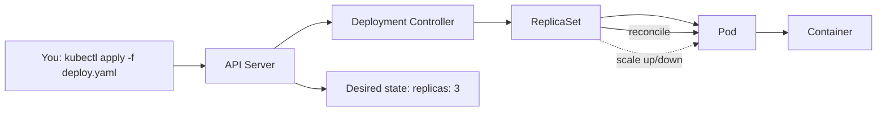
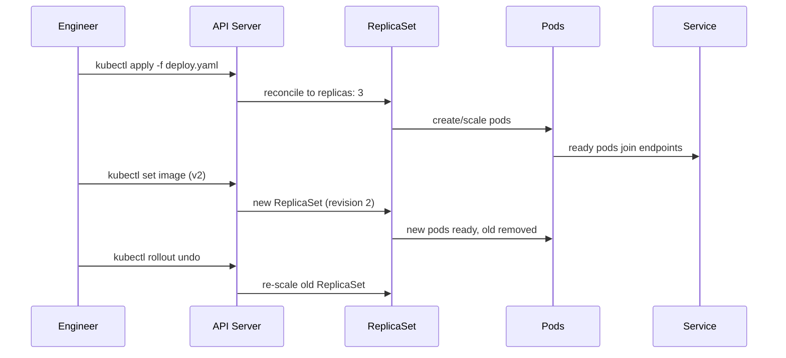

# Kubernetes in 100 Scenarios: A Complete Field Guide from Core Concepts to Advanced Workloads

Kubernetes has become the de-facto orchestration platform for modern infrastructure, yet it remains famously steep — not because the concepts are hard, but because knowledge is scattered across hundreds of docs, blog posts, and Stack Overflow threads. This article distills a field guide of 100 real situations a Kubernetes engineer actually faces, each paired with the concept behind it, the exact manifest or `kubectl` command, the output you should expect, and a line-by-line explanation.

The source material is organised into 11 categories spanning beginner to expert: Core Concepts and `kubectl`, Pods and Containers, Deployments and ReplicaSets, Services and Networking, ConfigMaps and Secrets, Storage, Scheduling and Resources, Health/Probes and Autoscaling, RBAC and Security, Observability and Troubleshooting, and Advanced Workloads and Tooling. Everything below is drawn directly from that material.


*Image credit: [Wikimedia Commons](https://commons.wikimedia.org/wiki/File:Kubernetes.png)*

## Table of Contents

- [Introduction](#introduction)
- [Why 100 Scenarios?](#why-100-scenarios)
- [Core Concepts and kubectl](#core-concepts-and-kubectl)
- [Pods and Containers](#pods-and-containers)
- [Deployments and ReplicaSets](#deployments-and-replicasets)
- [Services and Networking](#services-and-networking)
- [ConfigMaps and Secrets](#configmaps-and-secrets)
- [Storage: Volumes, PV and PVC](#storage-volumes-pv-and-pvc)
- [Scheduling and Resources](#scheduling-and-resources)
- [Health, Probes and Autoscaling](#health-probes-and-autoscaling)
- [RBAC and Security](#rbac-and-security)
- [Observability and Troubleshooting](#observability-and-troubleshooting)
- [Advanced Workloads and Tooling](#advanced-workloads-and-tooling)
- [A Real-World Walkthrough](#a-real-world-walkthrough)
- [Key Takeaways](#key-takeaways)
- [Frequently Asked Questions](#frequently-asked-questions)
- [Related Articles](#related-articles)

## Introduction

Before you can operate a cluster, you need to understand its mental model. At the heart of it sits the **API server** — the single front door to Kubernetes and the cluster's source of truth. Every action `kubectl` performs goes through it, whether you are listing nodes, applying a manifest, or rolling back a deployment.

From there, a small set of building blocks does the heavy lifting:

- **Nodes** are the machines (VMs or bare metal) that run your pods.
- **Pods** are the smallest deployable unit — one or more containers sharing a network and storage context.
- **Controllers** such as Deployments and ReplicaSets continuously reconcile reality to match your declared desired state.
- **Services** give ephemeral pods a stable virtual IP and DNS name.
- **ConfigMaps, Secrets, PersistentVolumes, RBAC, and autoscalers** layer configuration, durability, access control, and elasticity on top.

The single most important idea in this guide: **you declare desired state, and controllers make reality match it — self-healing included.** Almost every scenario in the source is a variation on that theme.

## Why 100 Scenarios?

The source document is explicitly "built to teach the why, not just the how." Instead of a reference manual of flags, it presents 100 situations a Kubernetes engineer really faces, each with:

1. **A Scenario** — the real-world problem, e.g. "a container keeps restarting and you need the logs from the crashed instance."
2. **A Concept** — the idea behind it, e.g. `kubectl logs --previous` shows the last terminated container's logs.
3. **The Command or Manifest** — the exact thing to run or apply.
4. **The Expected Output** — so you know you did it right.
5. **An Explanation** — a line-by-line walkthrough.

The scenarios scale from beginner to expert, so the same guide covers someone pointing `kubectl` at a cluster for the first time and someone hardening workloads with Pod Security Standards.

## Core Concepts and kubectl

The first nine scenarios establish the foundation: verifying your environment, navigating clusters, and adopting a reproducible workflow.

### Verify the cluster and client

When you point `kubectl` at a new cluster, confirm both sides are healthy:

```bash
kubectl version --short
kubectl cluster-info
```

You should see a client and server version (a small skew is fine; a large one can cause odd behaviour) and the control plane endpoint:

```
Client Version: v1.30.2
Server Version: v1.30.1
Kubernetes control plane is running at https://10.0.0.1:6443
CoreDNS is running at https://10.0.0.1:6443/...
```

If the server line errors, your kubeconfig or the network path to the API server is wrong.

### Nodes, namespaces, and contexts

Node health drives scheduling — the scheduler only places pods on nodes that are `Ready`:

```bash
kubectl get nodes -o wide
```

```
NAME       STATUS   ROLES          AGE   VERSION   INTERNAL-IP
cp-1       Ready    control-plane  40d   v1.30.1   10.0.0.1
worker-1   Ready    <none>         40d   v1.30.1   10.0.0.11
worker-2   NotReady <none>         40d   v1.30.1   10.0.0.12
```

A `NotReady` node removes capacity; pods scheduled there get rescheduled elsewhere if possible.

**Namespaces** partition a cluster into virtual sub-clusters for isolation, quotas, and access control. Most resources live in a namespace; a few (like nodes) are cluster-wide. To create one and make it your default:

```bash
kubectl create namespace nimbus
kubectl config set-context --current --namespace nimbus
```

**Contexts** bundle a cluster, user, and namespace. Switching contexts changes which cluster `kubectl` talks to:

```bash
kubectl config get-contexts
kubectl config use-context prod
```

> **Caution:** Always confirm your context before running anything destructive. Staging-versus-prod mistakes are among the most expensive errors a Kubernetes engineer can make. The `*` in `get-contexts` marks the current context — check it first.

### Inspect and select resources

`kubectl get` gives a compact list view; `kubectl describe` shows full detail plus an **Events** section, which is usually where the real reason for a problem appears:

```bash
kubectl describe pod web-1 | tail -6
```

```
Events:
  Normal  Scheduled  5m  default-scheduler  Successfully assigned nimbus/web-1
  Normal  Pulled     5m  kubelet            Container image already present
```

**Labels** are key/value tags on objects, and **selectors** query by them. This label-and-select model is the glue linking Services, Deployments, and pods:

```bash
kubectl get pods -l app=web,tier=frontend
kubectl label pod web-1 canary=true
```

### Declarative over imperative

The most important workflow decision is captured in scenario 005: imperative commands (`run`, `create`) act once; declarative `apply` reconciles the cluster to match a YAML file you can commit:

```bash
kubectl run tmp --image=nginx --restart=Never   # imperative, one-off
kubectl apply -f deploy.yaml                    # declarative, reproducible
```

`apply` is idempotent and diffable — the basis of GitOps. Use imperative commands to explore; use `apply -f` for anything real.

You can also scaffold correct YAML without touching the cluster:

```bash
kubectl create deployment web --image=nginx:1.27 \
  --dry-run=client -o yaml > deploy.yaml
```

And query the API server's own schema documentation with `kubectl explain`, so you never have to guess field paths:

```bash
kubectl explain deployment.spec.strategy
kubectl explain pod.spec.containers.resources --recursive
```

## Pods and Containers

### The pod is the atomic unit

A pod is the smallest deployable unit — one or more containers that share a network and storage context. Containers in a pod share the pod's IP and can talk over localhost:

```yaml
apiVersion: v1
kind: Pod
metadata: { name: web, labels: { app: web } }
spec:
  containers:
    - name: nginx
      image: nginx:1.27-alpine
      ports: [ { containerPort: 80 } ]
```

You rarely create bare pods in production — higher objects like Deployments manage pods for you — but understanding them is foundational. `1/1` in `kubectl get pod` means one of one containers is ready and running.

### Sidecars and init containers

A pod can hold multiple containers that share volumes and the network. The **sidecar pattern** runs a helper (logging, proxy) alongside the main app:

```yaml
spec:
  containers:
    - name: app
      image: nimbus-app:1.0
      volumeMounts: [ { name: logs, mountPath: /var/log } ]
    - name: log-shipper
      image: fluent-bit:2.2
      volumeMounts: [ { name: logs, mountPath: /var/log } ]
  volumes: [ { name: logs, emptyDir: {} } ]
```

Both containers mount the same `logs` volume — the app writes, the sidecar reads and ships. `2/2` confirms both containers are ready.

**Init containers** run to completion, in order, before app containers start, guaranteeing prerequisites (waiting on dependencies, migrations) are met first:

```yaml
spec:
  initContainers:
    - name: wait-db
      image: busybox
      command: ['sh','-c','until nc -z db 5432; do sleep 2; done']
  containers:
    - name: app
      image: nimbus-app:1.0
```

While the init container runs, the pod shows `Init:0/1`; once it succeeds, the app container starts and the pod becomes `1/1 Running`.

### Exec, logs, and debugging

To get inside a running container:

```bash
kubectl exec -it web -- sh
```

For multi-container pods, add `-c <container>`. `exec` starts a process inside the existing container — it doesn't restart it.

To read logs including the crashed instance — essential for crash loops:

```bash
kubectl logs web -c nginx --tail 3
kubectl logs web --previous
```

```
10.244.1.1 - GET / 200
10.244.1.1 - GET /health 200
panic: cannot connect to db
```

For pods with no shell at all (distroless images), `kubectl debug` attaches an ephemeral container sharing the target's namespaces — without restarting the pod:

```bash
kubectl debug -it web --image=busybox --target=nginx -- sh
```

### Configuration and resources

Environment variables are the simplest config mechanism; for shared or sensitive values prefer ConfigMaps and Secrets:

```yaml
spec:
  containers:
    - name: app
      image: nimbus-app:1.0
      env:
        - { name: LOG_LEVEL, value: debug }
        - { name: APP_ENV, value: staging }
```

Resource `requests` and `limits` deserve careful attention:

```yaml
resources:
  requests: { cpu: 250m, memory: 256Mi }
  limits:   { cpu: '1',  memory: 512Mi }
```

- **Requests** are what the scheduler reserves; they drive placement.
- **Limits** are the hard cap the kubelet enforces; exceeding the memory limit triggers an **OOM kill**, while CPU over the limit is throttled, not killed.

### Restart policies

`restartPolicy` (`Always`, `OnFailure`, `Never`) controls whether the kubelet restarts containers. Deployments require `Always`; Jobs typically use `OnFailure` or `Never`. A command that always fails yields `CrashLoopBackOff` with growing backoff delays — check `kubectl logs --previous` to see why.

## Deployments and ReplicaSets

A **Deployment** manages a ReplicaSet, which keeps a desired number of pod replicas running:

```yaml
apiVersion: apps/v1
kind: Deployment
metadata: { name: web }
spec:
  replicas: 3
  selector: { matchLabels: { app: web } }
  template:
    metadata: { labels: { app: web } }
    spec:
      containers: [ { name: nginx, image: nginx:1.27-alpine } ]
```

The selector must match the pod template's labels. The Deployment creates a ReplicaSet that maintains the three pods — declare the desired state, and the controller reconciles reality to match.



### Scaling and rollouts

Scaling changes the desired replica count; the ReplicaSet adds or removes pods to match — instant and safe for stateless workloads:

```bash
kubectl scale deployment web --replicas=5
```

Updating a Deployment's image triggers a **rolling update**: new pods come up and old ones are removed gradually, keeping the app available throughout:

```bash
kubectl set image deployment/web nginx=nginx:1.27.1-alpine
kubectl rollout status deployment/web
```

```
Waiting for rollout: 2 of 3 updated...
deployment "web" successfully rolled out
```

Rollbacks are fast and safe because Kubernetes keeps a **rollout history** of ReplicaSets:

```bash
kubectl rollout history deployment/web
kubectl rollout undo deployment/web        # revert to previous revision
kubectl rollout undo deployment/web --to-revision=1
```

Each Deployment revision creates a new ReplicaSet; the current one has the desired replicas and old ones scale to zero but are kept for rollback history. The chain is **Deployment → ReplicaSet → Pods**, and rollbacks simply re-scale an old ReplicaSet.

### Tuning the update strategy

`maxUnavailable` and `maxSurge` control a `RollingUpdate`'s pace:

```yaml
spec:
  strategy:
    type: RollingUpdate
    rollingUpdate:
      maxUnavailable: 1
      maxSurge: 1
```

During the rollout, at most one pod is down and at most one extra pod exists. Lower values are safer but slower; higher values are faster but riskier.

The **Recreate** strategy terminates all old pods before creating new ones — downtime, but guaranteed no overlap between versions. Use it when your app can't run two versions at once (for example, a schema-locking migration).

You can also pause a rollout, batch multiple changes, and resume so they land as a single rollout:

```bash
kubectl rollout pause deployment/web
kubectl set image deployment/web nginx=nginx:1.27.2-alpine
kubectl set resources deployment/web -c nginx --limits=memory=256Mi
kubectl rollout resume deployment/web
```

### The selector trap

A Deployment's `selector.matchLabels` must match the pod template labels, and a Service selects the same labels. A mismatch silently breaks the wiring:

```yaml
# Deployment
selector: { matchLabels: { app: web } }
template: { metadata: { labels: { app: web, tier: frontend } } }
# Service must select a subset that pods actually have
selector: { app: web }
```

Label typos are a top cause of "Service has no endpoints". Preview changes before applying with `kubectl diff -f deploy.yaml`.

## Services and Networking

Pods are ephemeral and their IPs change. A **Service** gives a stable virtual IP and DNS name that load-balances across the pods matching its selector:

```yaml
apiVersion: v1
kind: Service
metadata: { name: web }
spec:
  selector: { app: web }
  ports:
    - { port: 80, targetPort: 80 }
```

### Service types

| Type | Purpose | Notes |
|------|---------|-------|
| **ClusterIP** | Stable virtual IP inside the cluster | Default; load-balances across matching pods |
| **NodePort** | Fixed high port on every node | Port range 30000–32767; dev/on-prem use |
| **LoadBalancer** | Cloud-provisioned external LB | Requires a cloud controller; `<pending>` until provisioned |
| **ExternalName** | DNS CNAME to an external hostname | Pure DNS — no selectors or endpoints |

For NodePort, pin the external port:

```yaml
spec:
  type: NodePort
  selector: { app: web }
  ports:
    - { port: 80, targetPort: 80, nodePort: 30080 }
```

Reachable at `http://<any-node-ip>:30080`.

### port vs targetPort

`port` is what the Service exposes; `targetPort` is the container port it forwards to. They needn't match:

```yaml
spec:
  selector: { app: api }
  ports:
    - { port: 80, targetPort: 8080 }
```

Clients hit `web:80`; traffic forwards to the container's `8080`. The Endpoints object shows the real pod IPs and target port.

### DNS, endpoints, and headless Services

Cluster DNS (CoreDNS) gives every Service a record like `name.namespace.svc.cluster.local`:

```bash
kubectl run tmp --rm -it --image=busybox --restart=Never -- \
  wget -qO- http://web.nimbus.svc.cluster.local | head -1
```

Same-namespace calls can use the short name `web`; cross-namespace needs the full DNS name.

Check a Service's endpoints — empty endpoints mean the selector matches zero ready pods:

```bash
kubectl get endpoints web
kubectl get pods -l app=web -o wide
```

> **Key diagnostic:** "Service has no endpoints" almost always means a label/selector mismatch. Compare the Service selector with the pods' actual labels before anything else.

A **headless Service** (`clusterIP: None`) returns the pods' individual IPs instead of load-balancing, giving StatefulSet pods stable per-pod DNS names like `db-0.db`:

```yaml
spec:
  clusterIP: None
  selector: { app: db }
  ports: [ { port: 5432 } ]
```

### Port-forwarding and NetworkPolicies

To reach an internal pod from your laptop without exposing it, tunnel through the API server:

```bash
kubectl port-forward deployment/web 8080:80
```

By default all pods can talk to each other. A **NetworkPolicy** restricts traffic by pod selector, implementing least-privilege networking — everything not explicitly allowed is denied once a policy selects a pod:

```yaml
kind: NetworkPolicy
spec:
  podSelector: { matchLabels: { app: backend } }
  policyTypes: [ Ingress ]
  ingress:
    - from: [ { podSelector: { matchLabels: { app: frontend } } } ]
```

This allows `frontend -> backend` only. Note that NetworkPolicies need a supporting CNI (Calico, Cilium) to take effect — the source is explicit on this point.

## ConfigMaps and Secrets

**ConfigMaps** store non-confidential configuration as key/value pairs, decoupling config from images:

```bash
kubectl create configmap app-config \
  --from-literal=LOG_LEVEL=info \
  --from-literal=APP_ENV=prod
```

Consume them three ways:

1. **As individual env vars** via `env` + `configMapKeyRef`.
2. **As all keys at once** via `envFrom` + `configMapRef` — each key becomes a variable of the same name.
3. **As files** by mounting the ConfigMap as a volume — each key becomes a file, and mounted file updates propagate (with a short delay).

```yaml
spec:
  containers:
    - name: app
      image: nimbus-app:1.0
      volumeMounts: [ { name: cfg, mountPath: /etc/app } ]
  volumes:
    - name: cfg
      configMap: { name: app-config }
```

**Secrets** hold sensitive data — passwords, tokens, and keys — base64-encoded:

```bash
kubectl create secret generic db-cred \
  --from-literal=username=nimbus \
  --from-literal=password=s3cr3t
kubectl get secret db-cred -o jsonpath='{.data.password}' | base64 -d
```

Inject Secret keys as env vars via `secretKeyRef`, or mount them as files (typically backed by tmpfs/in-memory), which is preferred for certificates and keys:

```yaml
volumeMounts: [ { name: tls, mountPath: /etc/tls, readOnly: true } ]
volumes:
  - name: tls
    secret: { secretName: web-tls }
```

> **Security note:** Base64 is encoding, not encryption, by itself. Pair Secrets with RBAC and encryption at rest to truly protect them.

Two final ConfigMap gotchas from the source:

- Mark stable config **immutable** (`immutable: true`) to block accidental live edits and cut API server watch load. Updates are then rejected; you must delete and recreate.
- ConfigMap values injected as **env vars are read only at pod start** — they don't update live. After changing env-based config, run `kubectl rollout restart deployment/web` so pods pick up the new value. Mounted ConfigMap files do update live; env vars do not.

## Storage: Volumes, PV and PVC

An **emptyDir** volume is created when a pod starts and deleted when it stops — ephemeral scratch space shared by the pod's containers. Its lifetime is the pod's; data is lost when the pod dies.

For durable storage, a **PersistentVolumeClaim (PVC)** requests storage of a given size and access mode, and a **StorageClass** provisions a matching PersistentVolume dynamically:

```yaml
kind: PersistentVolumeClaim
metadata: { name: pgdata }
spec:
  accessModes: [ ReadWriteOnce ]
  resources: { requests: { storage: 10Gi } }
  storageClassName: standard
```

The PVC binds to a PV (`Bound`), and pods reference the PVC by `claimName`, not the underlying PV, for portability:

```yaml
volumes:
  - name: data
    persistentVolumeClaim: { claimName: pgdata }
```

Data written there survives pod restarts and rescheduling.

### Access modes and reclaim policy

| Access mode | Meaning | Typical backend |
|-------------|---------|-----------------|
| **RWO** (ReadWriteOnce) | One node mounts read-write | Most block storage (EBS, PD) |
| **ROX** (ReadOnlyMany) | Many nodes read-only | Shared filesystems |
| **RWX** (ReadWriteMany) | Many nodes read-write | NFS, CephFS, some CSI |

Requesting a mode the backend can't provide leaves the PVC `Pending`. The PV's **reclaim policy** decides the volume's fate when its PVC is deleted: `Delete` destroys it, `Retain` keeps it for manual recovery — use `Retain` for critical data.

### Dynamic provisioning, expansion, and the hostPath warning

A **StorageClass** describes a provisioner (a CSI driver); a PVC referencing it triggers automatic PV creation, so you never hand-create PVs. If the class has `allowVolumeExpansion: true`, you can grow a PVC in place:

```bash
kubectl patch pvc pgdata -p '{"spec":{"resources":{"requests":{"storage":"20Gi"}}}}'
```

PVCs can grow but never shrink.

**hostPath** mounts a directory from the node's filesystem. It ties a pod to one node's disk and is unsafe in multi-node clusters — rescheduling to another node finds a different (often empty) directory:

```yaml
# fragile:
volumes:
  - name: data
    hostPath: { path: /mnt/data }
```

Avoid hostPath for app data in multi-node clusters — use PVCs. A PVC stuck `Pending` almost always means a missing/unknown StorageClass; read its events:

```bash
kubectl describe pvc pgdata | grep -A3 Events
# Warning ProvisioningFailed: storageclass "fast" not found
```

## Scheduling and Resources

**nodeSelector** is the simplest scheduling constraint — a pod runs only on nodes whose labels match; it's a hard requirement:

```yaml
spec:
  nodeSelector: { hardware: gpu }
```

The pod stays `Pending` until a labelled node is available. **nodeAffinity** adds expressive operators (`In`, `NotIn`) and both hard and soft rules — `preferred...` is a soft preference with a weight, `required...` is a hard rule:

```yaml
affinity:
  nodeAffinity:
    preferredDuringSchedulingIgnoredDuringExecution:
      - weight: 100
        preference:
          matchExpressions: [ { key: disk, operator: In, values: [ ssd ] } ]
```

**Pod anti-affinity** keeps pods apart for resilience; pod affinity draws them together for latency. Both use a `topologyKey`:

```yaml
affinity:
  podAntiAffinity:
    requiredDuringSchedulingIgnoredDuringExecution:
      - labelSelector: { matchLabels: { app: web } }
        topologyKey: kubernetes.io/hostname
```

Two `web` pods now refuse to share a node.

**Taints and tolerations** reserve nodes: a taint repels pods unless they carry a matching toleration:

```bash
kubectl taint nodes worker-4 dedicated=ml:NoSchedule
```

```yaml
tolerations:
  - { key: dedicated, operator: Equal, value: ml, effect: NoSchedule }
```

Taints repel; tolerations permit — together they reserve nodes. For maintenance, `cordon` marks a node unschedulable and `drain` evicts its pods (respecting disruption budgets) so they reschedule elsewhere:

```bash
kubectl cordon worker-1
kubectl drain worker-1 --ignore-daemonsets --delete-emptydir-data
```

Use `--ignore-daemonsets` to skip per-node DaemonSet pods that can't move.

Cluster-wide guardrails complete the picture:

- **ResourceQuota** limits aggregate CPU, memory, and object counts per namespace — new pods that would exceed it are rejected at creation.
- **LimitRange** backfills `default` and `defaultRequest` so no pod escapes resource accounting.
- **PriorityClass** ranks pods; under pressure the scheduler can preempt lower-priority pods to make room for higher ones.
- **topologySpreadConstraints** balance replicas across zones within a `maxSkew`, improving fault tolerance.

When a pod stays `Pending`, read its events — the `FailedScheduling` event names the exact reason, e.g. `0/3 nodes are available: 3 Insufficient cpu`.

## Health, Probes and Autoscaling

The three probes answer three different questions:

| Probe | Question | On failure |
|-------|----------|------------|
| **Liveness** | Is the container alive? | Kubelet restarts it |
| **Readiness** | Should it receive traffic? | Removed from Service endpoints, not restarted |
| **Startup** | Has it finished booting? | Disables liveness/readiness until it succeeds |

```yaml
livenessProbe:
  httpGet: { path: /healthz, port: 8080 }
  initialDelaySeconds: 10
  periodSeconds: 10
  failureThreshold: 3
readinessProbe:
  httpGet: { path: /ready, port: 8080 }
  periodSeconds: 5
```

A failing readiness probe excludes the pod from Service endpoints without restarting it; a failing liveness probe restarts the container. A **startup probe** protects slow booters from being killed by liveness before they finish initialising — the budget is `failureThreshold × periodSeconds`.

Probes support three mechanisms; pick the one that reflects real health:

```yaml
# HTTP:  httpGet: { path: /healthz, port: 8080 }
# TCP:   tcpSocket: { port: 5432 }
# EXEC:  exec: { command: ['sh','-c','pg_isready -U postgres'] }
```

### Horizontal Pod Autoscaling

A **HorizontalPodAutoscaler (HPA)** adjusts a Deployment's replica count to keep a metric near a target. It needs CPU requests set and the metrics-server installed:

```bash
kubectl autoscale deployment web --cpu-percent=60 --min=2 --max=10
```

```
NAME  REFERENCE        TARGETS  MINPODS  MAXPODS  REPLICAS
web   Deployment/web   35%/60%  2        10       2
```

Watch it react under load:

```
web  Deployment/web  35%/60%  2  10  2
web  Deployment/web  88%/60%  2  10  2
web  Deployment/web  72%/60%  2  10  4
```

The HPA scales up quickly but down slowly — stabilisation prevents flapping. With `autoscaling/v2` you can scale on memory or custom/external metrics too (custom metrics need an adapter such as the Prometheus adapter).

**PodDisruptionBudgets** protect availability during voluntary disruptions: a drain or node upgrade respects `minAvailable`, keeping at least that many pods of a set up at all times. PDBs guard against drains/upgrades, not crashes.

Probe failures surface as `Unhealthy` Warning events on the pod — read them before blaming the app:

```
Warning  Unhealthy  kubelet  Liveness probe failed: HTTP probe failed
                              with statuscode: 500
```

## RBAC and Security

Every pod runs as a **ServiceAccount** — its identity to the API server. Give each workload its own so you can scope permissions:

```bash
kubectl create serviceaccount nimbus-api
```

```yaml
# in the pod spec:
serviceAccountName: nimbus-api
```

Grant namespaced access with a **Role + RoleBinding** — least privilege in one namespace:

```yaml
kind: Role
metadata: { name: pod-reader }
rules:
  - apiGroups: ['']
    resources: [pods]
    verbs: [get, list, watch]
---
kind: RoleBinding
subjects: [ { kind: ServiceAccount, name: nimbus-api } ]
roleRef: { kind: Role, name: pod-reader }
```

For cluster-scoped resources (like nodes) or cross-namespace access, use **ClusterRole + ClusterRoleBinding**. Verify permissions without deploying anything:

```bash
kubectl auth can-i list pods \
  --as=system:serviceaccount:nimbus:nimbus-api
kubectl auth can-i delete nodes --as=system:serviceaccount:nimbus:nimbus-api
```

```
yes
no
```

### Hardening workloads

A `securityContext` runs containers as non-root:

```yaml
securityContext: { runAsNonRoot: true, runAsUser: 1000, fsGroup: 2000 }
```

`runAsNonRoot: true` blocks the pod if the image would run as root; `runAsUser` pins a specific non-root UID; `fsGroup` sets group ownership for mounted volumes. Strong, low-effort hardening per container:

```yaml
securityContext:
  allowPrivilegeEscalation: false
  readOnlyRootFilesystem: true
  capabilities: { drop: [ ALL ] }
```

**Pod Security Admission** enforces the Pod Security Standards (`privileged`, `baseline`, `restricted`) per namespace via labels, rejecting non-compliant pods at admission:

```bash
kubectl label namespace nimbus \
  pod-security.kubernetes.io/enforce=restricted
```

A privileged pod is now rejected with `Error: violates PodSecurity "restricted"`.

For private registries, an `imagePullSecret` holds registry credentials; attach it via `spec.imagePullSecrets` or to the ServiceAccount so all its pods can pull privately:

```bash
kubectl create secret docker-registry regcred \
  --docker-server=registry.nimbus.io --docker-username=ci --docker-password=$PASS
```

Without it, private pulls fail with `ImagePullBackOff`.

## Observability and Troubleshooting

`kubectl top` reports live CPU/memory using the metrics-server:

```bash
kubectl top pods --sort-by=memory
kubectl top nodes
```

Events sorted by time reconstruct an incident timeline:

```bash
kubectl get events --sort-by=.lastTimestamp | tail -6
```

```
5m  Warning  Failed   pod/web-1  Failed to pull image "nginx:typo"
5m  Normal   BackOff  pod/web-1  Back-off pulling image
2m  Normal   Scheduled pod/db-0   Successfully assigned...
```

Two crash states dominate troubleshooting, and both are diagnosed the same way:

- **ImagePullBackOff** — the kubelet can't pull the image (typo, missing tag, or missing registry credentials). The pod event names the image and reason (e.g. `Failed to pull image "nginx:1.99": not found`).
- **CrashLoopBackOff** — the container starts then exits repeatedly. `kubectl logs app --previous` shows the crashed instance's output — e.g. `FATAL: DATABASE_URL is not set`.

Aggregate logs across replicas with a label selector:

```bash
kubectl logs -l app=web --tail=2 --prefix
```

```
[pod/web-1] 10.0.0.5 GET / 200
[pod/web-2] 10.0.0.7 GET /health 200
```

Make `kubectl` scriptable with `jsonpath` and custom-columns:

```bash
kubectl get pods -o jsonpath='{range .items[*]}{.metadata.name}{"\t"}{.spec.containers[0].image}{"\n"}{end}'
```

`--watch` turns any `get` into a live view of state transitions:

```bash
kubectl get pods -l app=web --watch
```

```
web-abc  0/1  Pending            0  0s
web-abc  0/1  ContainerCreating  0  2s
web-abc  1/1  Running            0  8s
```

Finally, `kubectl api-resources` lists every resource type, its API group, namespaced status, and short names (`deploy`, `ing`, `hpa`) — a map of what the cluster can manage.

## Advanced Workloads and Tooling

The final eight scenarios cover production-grade patterns:

- **StatefulSet** gives pods stable ordinal names (`db-0`, `db-1`, `db-2`), ordered rollout, and a unique PVC per pod via `volumeClaimTemplates` — the right fit for databases.
- **DaemonSet** runs one pod per node — perfect for node-level agents like log collectors and CNI components; new nodes automatically get the pod.
- **Job** runs finite work to completion with a `backoffLimit` capping retries — Deployments run services forever, Jobs don't.
- **CronJob** creates Jobs on a cron schedule (`schedule: '0 2 * * *'`) for backups, reports, and cleanups.
- **Ingress** defines host- and path-based routing rules that an ingress controller (e.g. nginx) implements — one entry point instead of many LoadBalancers:

```yaml
kind: Ingress
metadata: { name: nimbus }
spec:
  ingressClassName: nginx
  rules:
    - host: shop.nimbus.io
      http:
        paths:
          - path: /
            pathType: Prefix
            backend: { service: { name: web, port: { number: 80 } } }
```

- **Helm** packages manifests into versioned charts; installs create a tracked release you can upgrade and roll back as a unit. Helm tracks each change as a numbered revision:

```bash
helm install cache bitnami/redis --set architecture=standalone
helm upgrade cache bitnami/redis --set replica.replicaCount=3
helm history cache
helm rollback cache 1
```

- **Kustomize** (built into `kubectl` via `-k`) layers environment-specific overlays on a common base with declarative patches — no templating, no duplicated manifests:

```bash
kubectl apply -k overlays/prod
```

## A Real-World Walkthrough

Let's trace one end-to-end scenario combining several of these ideas: deploying a new version of a stateless web app to production with zero downtime, then handling a bad release.

1. **Deploy declaratively** — commit `deploy.yaml` with `replicas: 3` and `kubectl apply -f deploy.yaml`. The Deployment creates a ReplicaSet; the ReplicaSet creates three pods.
2. **Expose it** — a ClusterIP Service with `selector: { app: web }` gives the pods a stable virtual IP and DNS name; a readiness probe on `/ready` gates which pods receive traffic, so a warming pod never gets hit.
3. **Autoscale** — `kubectl autoscale deployment web --cpu-percent=60 --min=2 --max=10` grows the fleet as traffic rises (the HPA needs requests and the metrics-server).
4. **Roll out a new image** — `kubectl set image deployment/web nginx=nginx:1.27.1-alpine`. The rolling update brings new pods to Ready before removing old ones, so the Service keeps serving throughout.
5. **Roll back on failure** — if the new version is bad, `kubectl rollout undo deployment/web` instantly re-scales the previous ReplicaSet. The release history makes this a safe, atomic operation.
6. **Protect availability during maintenance** — a PodDisruptionBudget with `minAvailable: 2` ensures a node drain never takes down the whole service.



The same walkthrough generalises to databases (StatefulSet + PVCs + headless Service), batch jobs (Job/CronJob), and per-node agents (DaemonSet) using the patterns from the previous sections.

## Key Takeaways

- **Everything flows through the API server** — `kubectl` is a client, the API server is the cluster's single source of truth, and `kubectl explain` documents every manifest field straight from it.
- **Declare, don't command** — use `apply -f` (idempotent, diffable, GitOps-friendly) for anything real; imperative commands are only for exploration.
- **Labels and selectors are the glue** — a "Service has no endpoints" bug is almost always a label/selector mismatch; check labels first.
- **Requests drive scheduling, limits protect nodes** — always set both in production; exceeding a memory limit causes an OOM kill while CPU is throttled.
- **Rolling updates plus rollout history** give you zero-downtime deploys and instant rollbacks; Recreate trades availability for no version overlap.
- **Base64 is encoding, not encryption** — protect Secrets with RBAC and encryption at rest; use `immutable: true` on stable config and `rollout restart` after env-based config changes.
- **Read the events** — whether `Pending`, `ImagePullBackOff`, `CrashLoopBackOff`, or a failing probe, `describe`/sorted events and `logs --previous` almost always name the exact cause.

## Frequently Asked Questions

**What is the difference between a Deployment, a ReplicaSet, and a Pod?**

A Deployment declares desired state and manages a ReplicaSet; the ReplicaSet keeps a desired number of pod replicas running; pods are the smallest deployable unit. Each rollout creates a new ReplicaSet, and old ones are kept for rollback history.

**When should I use `kubectl apply -f` versus imperative commands like `kubectl run`?**

Use imperative commands to explore or scaffold quickly (optionally with `--dry-run=client -o yaml`); use `apply -f` for anything real, because it reconciles the cluster to a committed manifest and is idempotent and diffable — the basis of GitOps.

**What should I do first when a pod is stuck in CrashLoopBackOff?**

Run `kubectl logs <pod> --previous` to see the crashed instance's output — the source shows a missing `DATABASE_URL` env var being caught exactly this way. Then check the pod's Events via `kubectl describe pod <pod>` for restart and probe warnings.

**How do liveness, readiness, and startup probes differ?**

Liveness restarts a hung container; readiness removes a pod from Service endpoints without restarting it; startup disables liveness/readiness until the app finishes booting, protecting slow starters. A common pattern is an HTTP readiness probe on `/ready` and a cheap liveness probe on `/healthz`.

**Why is my HPA not scaling?**

The HPA needs resource requests set on the pods and the metrics-server installed to compute utilisation, and it scales down slowly to avoid flapping. For custom or memory metrics you need `autoscaling/v2`, which supports resource, pods, and external/custom metric types (custom ones require an adapter such as Prometheus).

## Related Articles

- Getting Started with `kubectl`: 9 Essential Commands for Every Cluster
- Deployments, ReplicaSets, and Rolling Updates Explained
- Zero-Downtime Deployments: Readiness, Startup, and Liveness Probes in Practice
- Securing Workloads with Pod Security Standards and RBAC
- From Docker Compose to Helm Charts: Packaging Your Stack

---

*Source material: "Kubernetes — 100 Scenarios, Explained" by EngiDock — learn once, own for life. Practical DevOps education, built by engineers, for engineers. All scenarios, commands, and explanations in this article are drawn directly from that document.*
