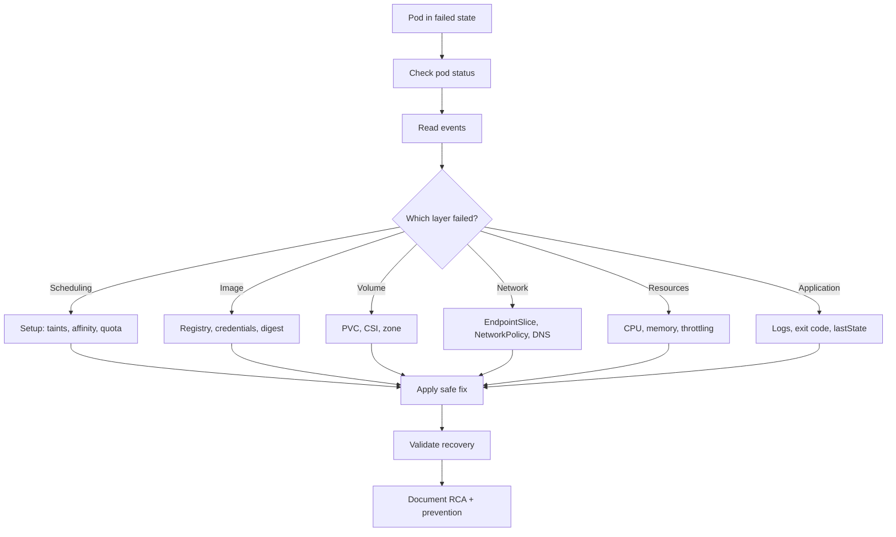

# Kubernetes Pod Troubleshooting in Production: 25 Real-World Interview Scenarios

Running Kubernetes in production is only half the battle. When a pod stops behaving — stuck `Pending`, trapped in `CrashLoopBackOff`, silently exceeding memory, or failing to receive traffic — you need a structured, evidence-driven approach rather than a grab-bag of ad-hoc `kubectl` commands. This article distills a set of **25 real-world Kubernetes pod troubleshooting scenarios** designed both for production support engineers and for technical interviews.

Each scenario follows the same notebook-style structure you will use on the job and in interviews:

- **Symptoms** — what you actually observe.
- **Possible Causes** — ordered reasons to consider.
- **Troubleshooting Commands** — the relevant `kubectl` incantations.
- **Solution and Validation** — the safe remediation and how to prove it worked.
- **Production / Interview Tip** — the insight interviewers care about.

By the end you will have a reusable mental model and a single troubleshooting workflow that applies to almost every pod failure.

> Note: The source document that this article is based on covers only the topic of Kubernetes pod troubleshooting. Where a scenario would benefit from additional facts (for example, exact CoreDNS tuning parameters or service mesh specifics), those details are not provided by the source and are therefore not covered here.


## Table of Contents

- [Why a Structured Workflow Beats Memorized Fixes](#why-a-structured-workflow-beats-memorized-fixes)
- [1. Scheduling and Startup Scenarios](#1-scheduling-and-startup-scenarios)
  - [Pod Stuck in Pending](#pod-stuck-in-pending)
  - [ImagePullBackOff](#imagepullbackoff)
  - [Pod Stuck in ContainerCreating](#pod-stuck-in-containercreating)
  - [Free Nodes but Pod Is Not Scheduled](#free-nodes-but-pod-is-not-scheduled)
  - [FailedScheduling Events](#failedscheduling-events)
  - [Missing ConfigMap or Secret](#missing-configmap-or-secret)
- [2. Restarts and Probes](#2-restarts-and-probes)
  - [CrashLoopBackOff](#crashloopbackoff)
  - [Pod Continuously Restarting](#pod-continuously-restarting)
  - [Container Terminated with OOMKilled](#container-terminated-with-oomkilled)
  - [Pod Crashes After a Few Minutes](#pod-crashes-after-a-few-minutes)
  - [Pod Stuck in Terminating](#pod-stuck-in-terminating)
- [3. Configuration and Storage](#3-configuration-and-storage)
- [4. Service, Networking and DNS](#4-service-networking-and-dns)
  - [Pod Running but Application Not Responding](#pod-running-but-application-not-responding)
  - [Pod Not Receiving Service Traffic](#pod-not-receiving-service-traffic)
  - [Pod-to-Pod Communication Failure](#pod-to-pod-communication-failure)
  - [Cross-Namespace Service Connectivity](#cross-namespace-service-connectivity)
  - [DNS Resolution Failure](#dns-resolution-failure)
- [5. CPU, Memory and Throttling](#5-cpu-memory-and-throttling)
  - [High CPU: Application or Configuration?](#high-cpu-application-or-configuration)
  - [High Memory but No Restart](#high-memory-but-no-restart)
  - [CPU Throttling](#cpu-throttling)
- [6. Logs, Distroless and Evidence](#6-logs-distroless-and-evidence)
  - [Pod Has No Logs](#pod-has-no-logs)
  - [Collect Previous Container Logs](#collect-previous-container-logs)
  - [Debugging a Distroless Container](#debugging-a-distroless-container)
  - [Evidence Before Restarting a Production Pod](#evidence-before-restarting-a-production-pod)
- [7. Environment Comparison](#7-environment-comparison)
- [The Unified Pod Troubleshooting Workflow](#the-unified-pod-troubleshooting-workflow)
- [Key Takeaways](#key-takeaways)
- [Frequently Asked Questions](#frequently-asked-questions)

## Why a Structured Workflow Beats Memorized Fixes

Production incidents are rarely clean. A pod can be `Running` yet unresponsive, or a cluster can have plenty of free capacity on paper while a pod refuses to schedule. The disciplined way to work is a sequence that the source document calls the **Structured Answer Flow**:

1. **Check status**
2. **Read events**
3. **Inspect state / exit code**
4. **Read current & previous logs**
5. **Verify configuration**
6. **Check resources / dependencies**
7. **Apply safe fix**
8. **Validate and document RCA**

Let's visualize how evidence flows through a troubleshooting session.



The rest of this article walks through each scenario grouped by coverage area.

## 1. Scheduling and Startup Scenarios

### Pod Stuck in Pending

**Interview question:** A pod is stuck in `Pending` state. How do you troubleshoot it?

**Symptoms:** The pod remains in `Pending` and no container starts. It may have no node assigned, or it may be waiting for storage.

**Possible Causes:**

- Insufficient CPU, memory, ephemeral storage, GPU, or maximum pod capacity.
- Node selector, affinity, topology-spread, or taint/toleration mismatch.
- PVC is `Pending`, unavailable in the required zone, or cannot be mounted.
- `ResourceQuota`, `LimitRange`, scheduler, or cluster-autoscaler constraints.

**Troubleshooting Commands:**

```bash
kubectl get pod <pod> -n <ns> -o wide
kubectl describe pod <pod> -n <ns>
kubectl get events -n <ns> --sort-by=.lastTimestamp
kubectl top nodes && kubectl describe node <node>
kubectl get pvc,pv -n <ns>
```

**Solution and Validation:** Read the `FailedScheduling` or volume event before changing anything. Correct requests, affinity, selectors, tolerations, quota, or PVC configuration. Add or scale eligible nodes when capacity is genuinely insufficient. Verify the pod becomes `Scheduled`, containers start, and readiness turns `True`.

> **Production / Interview Tip:** The interviewer focus here is that the scheduler evaluates *resource requests and constraints*, not merely current node usage. Memorize that distinction — it explains why a node can look underused yet reject a pod.

### ImagePullBackOff

**Interview question:** A pod is showing `ImagePullBackOff`. How do you resolve it?

**Symptoms:** The node repeatedly fails to download the container image, and events show `ErrImagePull` followed by `ImagePullBackOff`.

**Possible Causes:**

- Incorrect repository, image name, tag, or digest.
- Private registry credentials missing, expired, or attached to the wrong `ServiceAccount`.
- Registry unavailable, rate-limited, blocked by DNS/network, or using an untrusted certificate.
- Node runtime cannot reach the registry or lacks required proxy configuration.

**Troubleshooting Commands:**

```bash
kubectl describe pod <pod> -n <ns>
kubectl get pod <pod> -n <ns> -o jsonpath="{.spec.containers[*].image}"
kubectl get secret -n <ns>
kubectl get serviceaccount <sa> -n <ns> -o yaml
crictl pull <image>   # run on the affected node when permitted
```

**Solution and Validation:** Correct the image reference and confirm the tag/digest exists. Create or repair `imagePullSecrets` and attach them to the pod or `ServiceAccount`. Restore registry/DNS/network access and trusted CA configuration. Recreate or restart the rollout and verify the image is pulled successfully.

> **Production / Interview Tip:** The exact event message usually tells you whether the failure is *not found*, *unauthorized*, *timeout*, or *certificate-related*. Read it before guessing.

### Pod Stuck in ContainerCreating

**Interview question:** A pod is stuck in `ContainerCreating`. What could be the reasons?

**Symptoms:** The pod is scheduled to a node, but one or more containers never enter `Running`. The status often remains `ContainerCreating` while kubelet prepares the sandbox, volumes, and image.

**Possible Causes:**

- CNI failed to create the pod network or IP allocation is exhausted.
- CSI/volume mount, attach, permission, or zone error.
- Missing ConfigMap/Secret, failed projected volume, or image pull delay.
- Container runtime, kubelet, node disk/inodes, or sandbox creation failure.

**Troubleshooting Commands:**

```bash
kubectl describe pod <pod> -n <ns>
kubectl get events -n <ns> --sort-by=.lastTimestamp
kubectl describe node <node>
kubectl get pvc -n <ns> && kubectl describe pvc <pvc> -n <ns>
journalctl -u kubelet --since "30 min ago"   # node access
```

**Solution and Validation:** Use pod events to separate network, storage, image, and node-runtime failures. Repair the failing CNI/CSI component or missing object. Free node disk/inodes or recover kubelet/container runtime when unhealthy. Confirm sandbox creation, volume mounts, and container start complete.

> **Production / Interview Tip:** `ContainerCreating` is a *phase*, not a root cause — the event text is the root-cause starting point.

### Free Nodes but Pod Is Not Scheduled

**Interview question:** A pod is not getting scheduled even though nodes appear to have free resources. What could be the reason?

**Symptoms:** `kubectl top` shows free CPU/memory, but the scheduler still reports no eligible node. The pod remains `Pending` with `FailedScheduling` events.

**Possible Causes:**

- Scheduler uses requested resources and node *allocatable*, not current utilization.
- Resource fragmentation: no single node satisfies all CPU/memory/extended-resource requests.
- Taints, affinity, topology spread, `hostPort` conflict, `maxPods`, or PVC zone constraints.
- Reserved resources, DaemonSets, quotas, hugepages, GPU, or architecture requirements.

**Troubleshooting Commands:**

```bash
kubectl describe pod <pod> -n <ns>
kubectl describe nodes | grep -A8 -E "Allocated resources|Taints"
kubectl get pod <pod> -n <ns> -o yaml
kubectl get pvc <pvc> -n <ns> -o yaml
kubectl get nodes -L topology.kubernetes.io/zone,kubernetes.io/arch
```

**Solution and Validation:** Read the scheduler event count and reason for every rejected node. Right-size requests or change constraints only when justified. Defragment/scale node groups or create a node group matching architecture/zone/GPU needs. Verify the resulting placement still meets availability and compliance requirements.

> **Production / Interview Tip:** A cluster can have enough *total free capacity* but still lack one node that satisfies a pod as a whole.

### FailedScheduling Events

**Interview question:** A pod shows `FailedScheduling`. What events and configurations do you check?

**Symptoms:** Pod events contain `Warning FailedScheduling` from the default scheduler, and the message usually lists how many nodes failed and why.

**Possible Causes:**

- Insufficient requested resource, pod count, or extended resource.
- Untolerated taints; required node/pod affinity or anti-affinity mismatch.
- Unbound immediate PVC, zone conflict, topology-spread constraint, or `hostPort` conflict.
- `ResourceQuota`, `LimitRange`, preemption, or cluster-autoscaler limitations.

**Troubleshooting Commands:**

```bash
kubectl describe pod <pod> -n <ns>
kubectl get events -n <ns> --field-selector involvedObject.name=<pod>
kubectl get pod <pod> -n <ns> -o yaml
kubectl get nodes --show-labels
kubectl get resourcequota,limitrange,pvc -n <ns>
```

**Solution and Validation:** Translate each scheduler reason into the corresponding configuration check. Correct only the violated constraint: resources, taints, affinity, topology, port, quota, or storage. Check autoscaler events when the pod should trigger new capacity. Confirm scheduling and ensure the fix does not weaken placement or security controls.

> **Production / Interview Tip:** In interviews, quote the event *reason* first. Do not start by randomly editing the manifest.

### Missing ConfigMap or Secret

**Interview question:** A pod is not starting because a ConfigMap or Secret is missing. How do you identify the issue?

**Symptoms:** The pod shows `CreateContainerConfigError`, `FailedMount`, or a "secret/configmap not found" message. The object may exist in another namespace, or the referenced key may be absent.

**Possible Causes:**

- Incorrect resource name, key, namespace, or Helm/Kustomize release order.
- ConfigMap/Secret deleted, not deployed, or generated with a different suffix.
- Volume, env, `envFrom`, projected volume, or `imagePullSecret` reference is wrong.
- RBAC is usually not required for kubelet object mounting, but external secret controllers may have identity issues.

**Troubleshooting Commands:**

```bash
kubectl describe pod <pod> -n <ns>
kubectl get configmap,secret -n <ns>
kubectl get pod <pod> -n <ns> -o yaml
kubectl get configmap <name> -n <ns> -o yaml
kubectl get secret <name> -n <ns> -o jsonpath="{.data}"
```

**Solution and Validation:** Match every reference name and key with an object in the same namespace. Deploy or regenerate the missing object without printing sensitive values. Correct the workload manifest and perform a controlled rollout restart if needed. Validate the pod starts and the application reads the expected configuration.

> **Production / Interview Tip:** Use metadata and key names as evidence; avoid decoding or sharing secret values unless strictly required and authorized.

## 2. Restarts and Probes

### CrashLoopBackOff

**Interview question:** A pod is in `CrashLoopBackOff`. What checks do you perform?

**Symptoms:** The container starts, exits, and Kubernetes restarts it with increasing backoff. Restart count rises, and the pod may briefly show `Running`.

**Possible Causes:**

- Application exception, invalid command/args, or missing environment variables.
- ConfigMap, Secret, certificate, file permission, or dependency failure.
- Liveness probe kills the container before it becomes healthy.
- `OOMKilled`, wrong port, bad migration, or database/cache unavailability.

**Troubleshooting Commands:**

```bash
kubectl describe pod <pod> -n <ns>
kubectl logs <pod> -n <ns> -c <container> --timestamps
kubectl logs <pod> -n <ns> -c <container> --previous --timestamps
kubectl get pod <pod> -n <ns> -o jsonpath="{.status.containerStatuses[*].lastState}"
kubectl top pod <pod> -n <ns> --containers
```

**Solution and Validation:** Use exit code, termination reason, events, and previous logs to identify the restart trigger. Fix application/configuration/dependency issues rather than only deleting the pod. Tune startup/liveness probes when the application needs more initialization time. Roll out the fix and confirm restart count stops increasing.

> **Production / Interview Tip:** Make it a habit to capture previous logs and `lastState` *before* a restart removes useful evidence.

### Pod Continuously Restarting

**Interview question:** A pod is continuously restarting. How do you identify the root cause?

**Symptoms:** Restart count keeps increasing even when the pod occasionally becomes `Ready`. The restart may be application-driven, probe-driven, resource-driven, or externally triggered.

**Possible Causes:**

- Main process exits with an error or completes unexpectedly.
- Liveness/startup probe repeatedly fails.
- `OOMKilled`, signal termination, node pressure, or container runtime issue.
- Controller rollout, sidecar failure, or configuration reload triggers replacement.

**Troubleshooting Commands:**

```bash
kubectl get pod <pod> -n <ns> -w
kubectl describe pod <pod> -n <ns>
kubectl logs <pod> -n <ns> -c <container> --previous
kubectl get pod <pod> -n <ns> -o jsonpath="{range .status.containerStatuses[*]}{.name}{\" reason=\"}{.lastState.terminated.reason}{\" exit=\"}{.lastState.terminated.exitCode}{\"\n\"}{end}"
kubectl top pod <pod> -n <ns> --containers
```

**Solution and Validation:** Identify which container restarts and whether the last exit was error, OOM, signal, or probe kill. Correlate restart time with logs, probes, metrics, deployments, and node events. Fix the actual trigger and validate over a period longer than the previous restart interval.

> **Production / Interview Tip:** Do not treat every restart as `CrashLoopBackOff` — a healthy pod can restart intermittently due to probes or resource limits.

### Container Terminated with OOMKilled

**Interview question:** A container is terminated with `OOMKilled`. How do you troubleshoot it?

**Symptoms:** Container termination reason is `OOMKilled`, commonly with exit code `137`. Memory usage reaches the cgroup limit, or the node experiences severe memory pressure.

**Possible Causes:**

- Memory limit too low for normal workload or peak traffic.
- Application memory leak, oversized heap/cache, large payload, or excessive concurrency.
- Native/off-heap memory not included in application heap sizing.
- Node-level memory pressure can evict pods even when a container limit is not exceeded.

**Troubleshooting Commands:**

```bash
kubectl describe pod <pod> -n <ns>
kubectl logs <pod> -n <ns> -c <container> --previous
kubectl top pod <pod> -n <ns> --containers
kubectl describe node <node> | sed -n "/Conditions:/,/Addresses:/p"
# Check historical working-set/RSS and OOM metrics in Prometheus/Grafana
```

**Solution and Validation:** Confirm whether it was a container cgroup OOM or node-pressure eviction. Compare historical peak usage with requests/limits and application heap settings. Fix leaks or concurrency, then right-size memory with safe headroom. Add alerts and validate that memory stabilizes without repeated restarts.

> **Production / Interview Tip:** Increasing the limit is a *mitigation* — the RCA must explain why memory grew and whether the growth is bounded.

### Pod Crashes After a Few Minutes

**Interview question:** A pod starts successfully but crashes after a few minutes. How do you investigate?

**Symptoms:** Startup succeeds and the pod may become `Ready` before a delayed failure. The failure repeats after a similar duration or under a particular load.

**Possible Causes:**

- Memory leak, connection leak, file descriptor exhaustion, or disk filling.
- Liveness probe begins after its initial delay and then fails.
- Token/certificate expiry, scheduled background job, cache warm-up, or dependency timeout.
- Traffic spike or workload event pushes the app beyond resources.

**Troubleshooting Commands:**

```bash
kubectl logs <pod> -n <ns> -c <container> --previous --timestamps
kubectl describe pod <pod> -n <ns>
kubectl top pod <pod> -n <ns> --containers
kubectl get pod <pod> -n <ns> -o yaml | sed -n "/livenessProbe:/,/readinessProbe:/p"
# Correlate restart timestamp with metrics, traces, alerts, and deployments
```

**Solution and Validation:** Build a timeline from startup to failure and compare repeated instances. Check exit reason, previous logs, resource trend, probe timing, and downstream errors. Fix the leak, timeout, probe, credential, or capacity issue. Observe *longer than the old failure interval* before declaring recovery.

> **Production / Interview Tip:** A delayed crash often requires historical metrics and timestamps — a single `kubectl top` snapshot may look normal.

### Pod Stuck in Terminating

**Interview question:** A pod is stuck in `Terminating` state. How do you remove it safely?

**Symptoms:** A deletion timestamp is set, but the pod remains `Terminating` beyond the grace period. A replacement may be blocked, or storage may stay attached.

**Possible Causes:**

- Application does not finish `preStop` or ignores `SIGTERM`.
- Finalizer is not completed, node is unreachable, or kubelet cannot report termination.
- Volume unmount/detach, CSI, network teardown, or container runtime is stuck.
- A long `terminationGracePeriodSeconds` is working as configured.

**Troubleshooting Commands:**

```bash
kubectl get pod <pod> -n <ns> -o yaml
kubectl describe pod <pod> -n <ns>
kubectl get pod <pod> -n <ns> -o jsonpath="{.metadata.finalizers}"
kubectl describe node <node>
kubectl get volumeattachment   # when storage is involved
```

**Solution and Validation:** First confirm the process is not completing a valid graceful shutdown. Resolve finalizer, node, runtime, or volume teardown issues where possible. Use force deletion only as a last resort:

```bash
kubectl delete pod <pod> -n <ns> --grace-period=0 --force
```

After force deletion, verify no orphaned process, duplicate writer, or attached volume remains.

> **Production / Interview Tip:** Force deletion removes the API object immediately; it does **not** guarantee the process stopped on an unreachable node.

## 3. Configuration and Storage

The configuration-related scenarios (missing ConfigMap/Secret) and storage-related failures (stuck on PVC/CSI volume mounts) are unfolded in the sections above within `ContainerCreating` and `Missing ConfigMap or Secret`. The core discipline is identical: read the event, match the reference to an object in the *same namespace*, and validate with an actual application transaction rather than a shallow connectivity test.

When a pod fails with storage issues, check the PVC binding state, the zone, and the `volumeattachment` status, and always separate network, storage, image, and runtime causes using the pod and node events.

## 4. Service, Networking and DNS

### Pod Running but Application Not Responding

**Interview question:** A pod is running, but the application inside it is not responding. What do you check?

**Symptoms:** The pod phase is `Running`, but health checks, requests, or business transactions fail. The container process exists, but the application may be hung, slow, or listening incorrectly.

**Possible Causes:**

- Application listens on the wrong address/port, or the main process is deadlocked.
- Readiness/liveness endpoint is wrong or not representative of real health.
- Thread pool, connection pool, GC, CPU, memory, or file descriptor exhaustion.
- Downstream database, cache, queue, API, certificate, or DNS failure.

**Troubleshooting Commands:**

```bash
kubectl logs <pod> -n <ns> -c <container> --timestamps
kubectl describe pod <pod> -n <ns>
kubectl exec -n <ns> <pod> -- sh -c "ss -lntp || netstat -lntp"
kubectl exec -n <ns> <pod> -- curl -sv localhost:<port>/<health>
kubectl top pod <pod> -n <ns> --containers
```

**Solution and Validation:** Test the application locally inside the pod to separate an app failure from a Service/network failure. Check process, listening port, logs, thread/connection pools, and dependencies. Correct probes and resource settings, or restart only after collecting evidence. Validate both the health endpoint and a real business request.

> **Production / Interview Tip:** `Running` only means a container process is running — it does not prove the application is healthy or ready.

### Pod Not Receiving Service Traffic

**Interview question:** A pod is running, but it is not receiving traffic from the Service. How do you troubleshoot?

**Symptoms:** The pod responds through its Pod IP, but requests through the Service fail or bypass it. The Service has no endpoints, or only some replicas receive traffic.

**Possible Causes:**

- Service selector does not match pod labels.
- Pod is not `Ready`, so it is excluded from the EndpointSlice.
- Wrong Service port, `targetPort`, named port, protocol, or application listen port.
- `NetworkPolicy`, kube-proxy/eBPF dataplane, CNI, or node networking issue.

**Troubleshooting Commands:**

```bash
kubectl get svc <svc> -n <ns> -o yaml
kubectl get pod <pod> -n <ns> --show-labels
kubectl get endpoints <svc> -n <ns> -o yaml
kubectl get endpointslice -n <ns> -l kubernetes.io/service-name=<svc>
kubectl exec -n <ns> <debug-pod> -- curl -sv http://<svc>:<port>
```

**Solution and Validation:** Match Service selectors with pod labels and confirm pod `Ready=True`. Correct port/`targetPort` and ensure the app listens on the expected interface. Test Pod IP, ClusterIP, and DNS separately to isolate the layer. Repair `NetworkPolicy` or dataplane issues and verify endpoints receive traffic.

> **Production / Interview Tip:** No endpoints usually means selector/readiness; endpoints present but unreachable points to port or networking.

### Pod-to-Pod Communication Failure

**Interview question:** A pod cannot connect to another pod in the same namespace. How do you troubleshoot?

**Symptoms:** A source pod cannot reach the destination Pod IP or application port. The failure may occur only across nodes or only in one direction.

**Possible Causes:**

- Destination app binds to `127.0.0.1`, uses the wrong port, or is not healthy.
- Ingress/egress `NetworkPolicy` blocks the selected pods.
- CNI, routing, overlay, MTU, node firewall, or security group issue.
- Destination pod IP changed and the caller uses a stale direct IP instead of a Service.

**Troubleshooting Commands:**

```bash
kubectl get pod -n <ns> -o wide
kubectl exec -n <ns> <src-pod> -- nc -vz <dst-pod-ip> <port>
kubectl exec -n <ns> <dst-pod> -- sh -c "ss -lnt || netstat -lnt"
kubectl get networkpolicy -n <ns> -o yaml
kubectl describe node <src-node> && kubectl describe node <dst-node>
```

**Solution and Validation:** Confirm destination readiness, listening address, port, and current Pod IP. Test same-node versus cross-node connectivity to isolate CNI/routing. Correct `NetworkPolicy` or node networking and prefer Service discovery over direct Pod IPs. Validate bidirectional traffic where the protocol requires it.

> **Production / Interview Tip:** Same namespace does not automatically mean unrestricted traffic when default-deny `NetworkPolicies` exist.

### Cross-Namespace Service Connectivity

**Interview question:** A pod cannot connect to a Service in another namespace. What do you check?

**Symptoms:** The short Service name fails from another namespace, or the FQDN resolves but traffic does not reach endpoints. The target Service may be healthy for callers inside its own namespace.

**Possible Causes:**

- Incorrect DNS name; short names search the caller's namespace first.
- Service, port, `targetPort`, or EndpointSlice is incorrect.
- Source egress or destination ingress `NetworkPolicy` does not allow cross-namespace traffic.
- Service mesh authorization, mTLS, or namespace labels block the caller.

**Troubleshooting Commands:**

```bash
kubectl exec -n <src-ns> <pod> -- nslookup <svc>.<dst-ns>.svc.cluster.local
kubectl get svc,endpoints,endpointslice -n <dst-ns>
kubectl exec -n <src-ns> <debug-pod> -- curl -sv http://<svc>.<dst-ns>.svc:<port>
kubectl get networkpolicy -n <src-ns> -o yaml
kubectl get networkpolicy -n <dst-ns> -o yaml
```

**Solution and Validation:** Use `<service>.<namespace>` or the full cluster DNS name. Verify target endpoints, readiness, and Service port mapping. Allow the correct namespace/pod selectors in both egress and ingress policies. Check mesh authorization and validate the actual application protocol.

> **Production / Interview Tip:** Namespace is part of the Service DNS identity; RBAC does not control ordinary network connections.

### DNS Resolution Failure

**Interview question:** A pod is unable to resolve DNS names. How do you troubleshoot?

**Symptoms:** `nslookup`/`dig`/`curl` reports name resolution failure or intermittent timeouts. Cluster Service names, external names, or both may be affected.

**Possible Causes:**

- CoreDNS pods, the kube-dns Service/EndpointSlice, or NodeLocal DNS is unhealthy.
- Incorrect `dnsPolicy`, `dnsConfig`, `hostNetwork` behavior, or malformed `/etc/resolv.conf`.
- `NetworkPolicy`/firewall blocks UDP or TCP port 53.
- CoreDNS ConfigMap, upstream resolver, loop, overload, or node networking issue.

**Troubleshooting Commands:**

```bash
kubectl exec -n <ns> <pod> -- cat /etc/resolv.conf
kubectl exec -n <ns> <pod> -- nslookup kubernetes.default.svc.cluster.local
kubectl get pods,svc,endpoints -n kube-system | grep -E "dns|coredns"
kubectl logs -n kube-system deployment/coredns
kubectl get configmap coredns -n kube-system -o yaml
```

**Solution and Validation:** Determine whether only cluster DNS, only external DNS, or all DNS fails. Restore CoreDNS/NodeLocal DNS health and correct `resolv.conf`/`dnsPolicy`. Allow DNS traffic and repair upstream resolver or CNI issues. Retest using both a Service FQDN and an external domain.

> **Production / Interview Tip:** DNS commonly uses UDP 53 but can fall back to TCP 53 — policies must allow both where required.

## 5. CPU, Memory and Throttling

### High CPU: Application or Configuration?

**Interview question:** A pod has high CPU usage. How do you identify whether the problem is application-related or configuration-related?

**Symptoms:** CPU usage is high, latency may increase, and replicas may approach their limits. High CPU may be legitimate load, inefficient code, busy loops, GC, or insufficient capacity.

**Possible Causes:**

- Traffic/request rate increased or work per request became heavier.
- Application regression, infinite loop, excessive serialization, logging, encryption, or GC.
- CPU request too low for scheduling/HPA signals; CPU limit too low and causing throttling.
- Too few replicas, imbalanced traffic, noisy node, or sidecar overhead.

**Troubleshooting Commands:**

```bash
kubectl top pod <pod> -n <ns> --containers
kubectl get pod <pod> -n <ns> -o jsonpath="{.spec.containers[*].resources}"
kubectl top node <node>
# Compare CPU with request rate, latency, errors, GC, and throttling metrics
kubectl exec -n <ns> <pod> -- <runtime-specific-profile-or-thread-dump>
```

**Solution and Validation:** Correlate CPU with load: proportional growth suggests capacity; flat load with CPU growth suggests an application regression. Check per-container usage, profiles/thread dumps, GC, sidecars, requests, limits, and throttling. Optimize the hot path or scale/right-size resources based on evidence. Validate latency, throughput, errors, and CPU after the change.

> **Production / Interview Tip:** CPU percentage alone is incomplete — compare it with traffic, CPU limit, throttling, and application profiles.

### High Memory but No Restart

**Interview question:** A pod is consuming high memory but is not getting restarted. What do you check?

**Symptoms:** Memory usage is high or steadily increasing, but the container remains `Running`. The pod may be close to node eviction, or it may simply have no memory limit.

**Possible Causes:**

- No memory limit configured, or usage is still below the configured limit.
- Memory request is only a scheduling guarantee; it does not trigger restart when exceeded.
- Page cache, heap, native memory, memory-mapped files, or sidecar usage is high.
- A leak is gradual and has not yet reached OOM; the node has not entered memory pressure.

**Troubleshooting Commands:**

```bash
kubectl top pod <pod> -n <ns> --containers
kubectl get pod <pod> -n <ns> -o jsonpath="{.spec.containers[*].resources}"
kubectl describe node <node> | grep -A6 -i pressure
# Review historical working_set, RSS, cache, heap, GC, and node memory metrics
kubectl exec -n <ns> <pod> -- <runtime-specific-heap-or-memory-tool>
```

**Solution and Validation:** Check whether a limit exists and distinguish request, limit, working set, RSS, cache, and heap. Look for an unbounded trend and correlate with traffic, GC, and object/cache growth. Fix leaks or cache policy and set a tested limit with headroom. Alert *before* node pressure or OOM rather than waiting for a restart.

> **Production / Interview Tip:** Kubernetes does not restart a container merely because it exceeds its memory *request*; OOM is tied to limits or node pressure.

### CPU Throttling

**Interview question:** A pod is getting CPU throttled. How do you identify and resolve it?

**Symptoms:** Latency spikes while CPU usage may appear capped near the container limit. Prometheus shows increasing throttled periods or throttled seconds.

**Possible Causes:**

- CPU limit is too low for bursts or normal peak workload.
- Application uses many runnable threads or performs CPU-heavy work.
- Too few replicas or uneven load creates per-pod saturation.
- Node contention can add latency, but cgroup throttling specifically follows the CPU quota.

**Troubleshooting Commands:**

```bash
kubectl get pod <pod> -n <ns> -o jsonpath="{.spec.containers[*].resources}"
kubectl top pod <pod> -n <ns> --containers
# PromQL: rate(container_cpu_cfs_throttled_seconds_total[5m])
# PromQL: rate(container_cpu_cfs_throttled_periods_total[5m]) / rate(container_cpu_cfs_periods_total[5m])
kubectl get hpa -n <ns>
```

**Solution and Validation:** Correlate throttling with latency, load, CPU demand, and the configured limit. Raise or remove the CPU limit only after capacity and multi-tenant impact review. Scale replicas and optimize CPU-heavy code or excessive concurrency. Validate reduced throttling without causing node saturation.

> **Production / Interview Tip:** High CPU usage and CPU throttling are *different*; throttling proves the cgroup quota actively delayed execution.

## 6. Logs, Distroless and Evidence

### Pod Has No Logs

**Interview question:** A pod has no logs. How do you troubleshoot the application?

**Symptoms:** `kubectl logs` returns empty output, an error, or no useful application messages. The pod may have multiple containers, or the app may log only to files.

**Possible Causes:**

- Wrong container selected, container never started, or init container failed.
- Application logging level is disabled or startup fails before logger initialization.
- Application writes to a file instead of stdout/stderr.
- Runtime log rotation, node issue, sidecar collector failure, or pod replacement removed local logs.

**Troubleshooting Commands:**

```bash
kubectl get pod <pod> -n <ns> -o jsonpath="{.spec.containers[*].name}"
kubectl logs <pod> -n <ns> --all-containers --timestamps
kubectl logs <pod> -n <ns> -c <container> --previous
kubectl describe pod <pod> -n <ns>
kubectl logs <pod> -n <ns> -c <init-container>
```

**Solution and Validation:** Confirm container name, state, start time, and whether an init container failed. Check events and termination reason when no process ran long enough to log. Standardize application output to stdout/stderr and repair the logging sidecar/agent. Use centralized logs and node runtime logs when local pod logs are unavailable.

> **Production / Interview Tip:** An empty log stream is evidence too — check container state and events before assuming the logging system is broken.

### Collect Previous Container Logs

**Interview question:** How do you collect logs from the previous instance of a restarted container?

**Symptoms:** Current logs show only the new container instance after a restart. The failure message is expected in the immediately previous terminated instance.

**Possible Causes:**

- `kubectl logs` defaults to the current container instance.
- The pod has multiple containers, so a correct container name is required.
- Previous logs may be unavailable after pod replacement, node loss, or runtime log cleanup.

**Troubleshooting Commands:**

```bash
kubectl logs <pod> -n <ns> -c <container> --previous --timestamps
kubectl describe pod <pod> -n <ns>
kubectl get pod <pod> -n <ns> -o jsonpath="{.status.containerStatuses[?(@.name==\"<container>\")].lastState.terminated}"
kubectl logs <pod> -n <ns> --all-containers --prefix=true
# Query centralized logging by pod UID/container/restart timestamp when local previous logs are gone
```

**Solution and Validation:** Run `--previous` *before* deleting or recreating the pod. Capture `lastState` reason, exitCode, signal, start time, and finish time with the logs. Use centralized logging for older restarts or replaced pods. Attach timestamps and correlation/request IDs to the incident evidence.

> **Production / Interview Tip:** Kubelet normally exposes only the *immediately previous* container instance, not an unlimited restart history.

### Debugging a Distroless Container

**Interview question:** How do you debug a distroless container that has no shell or troubleshooting utilities?

**Symptoms:** `kubectl exec` with sh/bash, curl, ps, or netstat fails because the image intentionally contains no tools. The application may still expose logs, metrics, ports, and process information.

**Possible Causes:** Distroless/minimal images reduce the attack surface and do not include a package manager or shell. Traditional in-container troubleshooting commands are therefore unavailable *by design*.

**Troubleshooting Commands:**

```bash
kubectl debug -it pod/<pod> -n <ns> --image=nicolaka/netshoot --target=<container>
kubectl debug pod/<pod> -n <ns> -it --copy-to=<debug-pod> --container=<container> -- sh
kubectl debug node/<node> -it --image=nicolaka/netshoot   # node-level network checks
kubectl logs <pod> -n <ns> -c <container> --timestamps
kubectl get pod <pod> -n <ns> -o yaml
```

**Solution and Validation:** Use an ephemeral debug container that shares the pod network namespace; target the process namespace when runtime support allows. Use a copied debug pod when filesystem/process inspection needs a modified image. Rely on logs, metrics, traces, probes, and remote profiling for repeatable production diagnostics. Remove temporary debug resources and document every production access.

> **Production / Interview Tip:** Do not rebuild the production image with a shell during an incident — use controlled ephemeral debugging and keep the secure image unchanged.

### Evidence Before Restarting a Production Pod

**Interview question:** What evidence do you collect before restarting a failed production pod?

**Symptoms:** A restart may restore service but can erase the state needed for RCA. The goal is to preserve evidence without unnecessarily extending customer impact.

**Possible Causes:** Logs, exit state, metrics, events, thread/heap data, and node conditions can change after restart. Deleting a pod can also replace the pod UID, IP, image pull context, and local previous logs.

**Troubleshooting Commands:**

```bash
kubectl get pod <pod> -n <ns> -o wide && kubectl get pod <pod> -n <ns> -o yaml
kubectl describe pod <pod> -n <ns>
kubectl logs <pod> -n <ns> -c <container> --timestamps
kubectl logs <pod> -n <ns> -c <container> --previous --timestamps
kubectl top pod <pod> -n <ns> --containers && kubectl describe node <node>
```

**Solution and Validation:** Capture impact/timeline, pod status, UID, node, image digest, restart count, exit reason, events, current/previous logs, and resource metrics. Capture Deployment/ReplicaSet revision, recent changes, ConfigMap/Secret versions, Service endpoints, dependency errors, traces, and alert screenshots. Record the restart decision, owner, approval, rollback option, and customer-risk assessment. After restart, validate readiness, traffic, latency, errors, dependencies, and recurrence — then complete the RCA.

> **Production / Interview Tip:** A safe sequence is **evidence → controlled remediation → validation → RCA**, unless immediate life-safety or severe outage risk requires faster action.

## 7. Environment Comparison

### Works in Dev but Fails in Production

**Interview question:** A pod works in Dev but fails in Production. How do you compare and troubleshoot the environments?

**Symptoms:** The same application appears healthy in Dev but fails startup, readiness, connectivity, or load in Prod. The difference may be image, configuration, infrastructure, permissions, traffic, or dependency behavior.

**Possible Causes:**

- Different image tag/digest, Helm values, environment variables, ConfigMaps, or Secrets.
- Different requests/limits, replicas, probes, Service ports, storage class, or node architecture.
- Prod-only `NetworkPolicy`, firewall, IAM/RBAC, `ServiceAccount`, DNS, proxy, or TLS requirements.
- Higher traffic/data volume exposes race conditions, timeouts, or scaling limits.

**Troubleshooting Commands:**

```bash
kubectl get deploy <app> -n dev -o yaml > /tmp/dev.yaml
kubectl get deploy <app> -n prod -o yaml > /tmp/prod.yaml
diff -u /tmp/dev.yaml /tmp/prod.yaml
kubectl get pod <pod> -n <ns> -o jsonpath="{.status.containerStatuses[*].imageID}"
helm get values <release> -n <ns>   # when Helm is used
```

**Solution and Validation:** Compare the immutable image digest first, then configuration, identity, network, storage, and resources. Reproduce the exact Prod dependency and traffic condition in a safe environment. Remove unintended drift and promote the same tested artifact through environments. Document intentional differences so future comparisons are faster.

> **Production / Interview Tip:** "Same code" is not the same runtime — prove the image digest and effective configuration are identical.

## The Unified Pod Troubleshooting Workflow

The source document concludes with a single reusable workflow that ties every scenario together. It is more valuable than memorizing individual fixes.

1. **Confirm application impact** — Which users, APIs, namespaces, and replicas are affected?
2. **Check pod and controller status** — Pod phase, `Ready` condition, restarts, owner Deployment/StatefulSet/Job.
3. **Describe pod and read events** — Scheduling, image, mount, probe, eviction, and sandbox messages.
4. **Inspect container state and exit code** — Waiting, running, terminated, `lastState`, reason, signal, exit code.
5. **Collect current and previous logs** — Include timestamps, container name, correlation IDs, and centralized logs.
6. **Verify configuration and dependencies** — Image digest, command, env, ConfigMap, Secret, certificate, DB/cache/queue.
7. **Check resources and scheduling** — CPU, memory, throttling, OOM, requests/limits, affinity, taints, quotas.
8. **Verify Service, networking, and DNS** — Readiness, labels, endpoints, ports, `NetworkPolicy`, CNI, CoreDNS.
9. **Check storage and node health** — PVC/CSI, disk/inodes, kubelet/runtime, node pressure, zone and attachment.
10. **Apply safe remediation** — Fix the root cause; use rollback/restart/force deletion only with impact review.
11. **Validate and complete RCA** — Health, traffic, latency, errors, recurrence, timeline, root cause, prevention.

An interview-ready closing line, straight from the source, is:

> "I collect evidence first, isolate the failing layer, apply the safest targeted fix, validate service recovery, and document the RCA and preventive action."


## Key Takeaways

- **A structured workflow beats memorized fixes** — the eight-step flow (status → events → state → logs → config → resources → safe fix → validate/RCA) applies to nearly every pod failure.
- **`Pending`/`FailedScheduling` is a scheduler story** — the scheduler judges requests and constraints against node *allocatable*, not current utilization, so total free capacity does not imply an eligible node.
- **`Running` does not mean healthy** — a running container process can be hung, slow, misconfigured, or blocked by probes; always verify with real business requests and episodes in the EndpointSlice.
- **Logs and `lastState` are time-sensitive evidence** — collect `--previous` logs and termination reason *before* restarting or deleting a pod, because restarts erase the state needed for RCA.
- **CPU and memory need context** — compare CPU against load, traffic, throttling, and profiles; remember that Kubernetes only OOM-kills on *limits or node pressure*, not on exceeding a memory *request*.
- **Fix root causes, not symptoms** — treat force deletion and limit bumps as last-resort mitigations, and always complete an RCA with preventive action.

## Frequently Asked Questions

**What is the first thing to check when a pod is stuck in `Pending`?**
Read the pod and scheduler events — typically `kubectl describe pod <pod>` and `kubectl get events --sort-by=.lastTimestamp`. The `FailedScheduling` message usually names the failing constraint (resources, taints, affinity, quota, or PVC).

**How is `CrashLoopBackOff` different from a pod that keeps restarting?**
`CrashLoopBackOff` shows a growing backoff on repeated failure, whereas a continuously restarting pod may occasionally become `Ready` and be up for reasons like probes, resource limits, or external triggers. Inspect the exit reason, `lastState`, and previous logs to tell them apart.

**Why does a pod keep getting killed even though memory usage is high but below its limit?**
Container OOM is tied to the memory *limit* or node memory pressure, not the memory *request*. If there is no limit, the pod may only be evicted when the node enters memory pressure. Check `kubectl describe node` for pressure conditions and historical metrics.

**Why can a pod reach its own Pod IP but not the Service?**
That typically points to the Service layer: selector/label mismatch, the pod not `Ready` (so it is absent from the EndpointSlice), wrong port/`targetPort`, or a `NetworkPolicy`/dataplane issue. Test Pod IP, ClusterIP, and DNS separately to isolate the failing layer.

**How do you debug a distroless container that has no shell?**
Use `kubectl debug` to run an ephemeral debug container (for example `nicolaka/netshoot`) that shares the pod network namespace, or use `--copy-to` for a modified debug pod. Rely on logs, metrics, traces, and remote profiling, and never rebuild the production image with a shell during an incident.

## Related Articles

- Kubernetes Scheduling Deep Dive: Requests, Limits, and the Scheduler
- Networking in Kubernetes: Services, EndpointSlices, and DNS
- CPU and Memory Right-Sizing in Container Workloads
- Observability for Kubernetes: Logs, Metrics, and Traces
