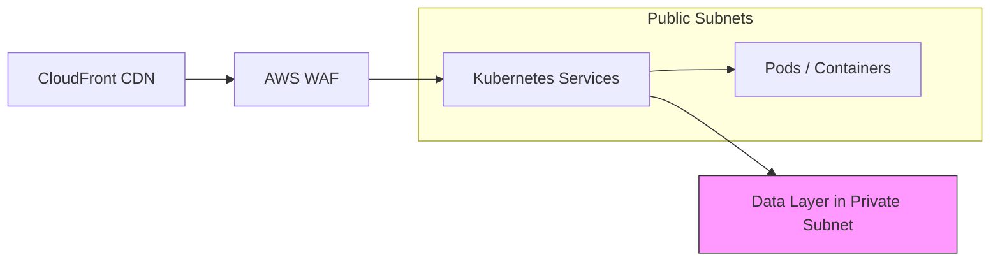
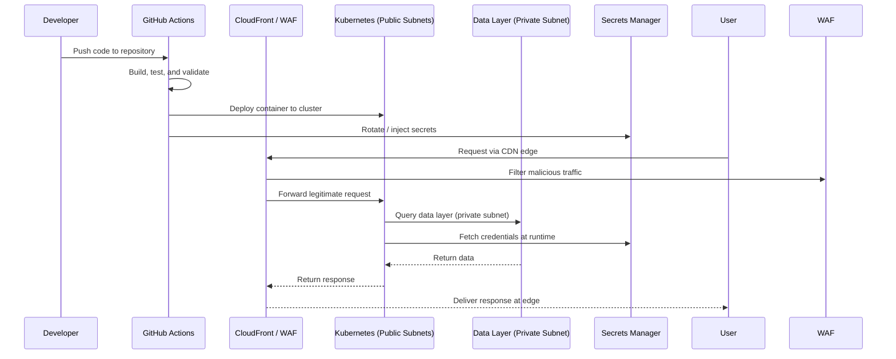

# Production-Grade Architecture: The Complete Code-to-Cloud Lifecycle with AWS

Shipping software in the real world means far more than writing functions and pushing commits. A truly *production-grade* architecture spans the entire journey from a developer's editor all the way to a live, load-balanced cloud deployment. This article walks through exactly such a reference architecture: the **complete lifecycle from code to cloud**, built on GitHub Actions for continuous integration and delivery, and a hardened AWS cloud infrastructure for production hosting.

The ideas presented here are drawn from a single architectural diagram. That diagram sketches the full pipeline—from the developer, through the CI/CD stage, into AWS infrastructure made up of publicly exposed edge layers, a Kubernetes workload tier, and a private, heavily secured data layer. Because the source material is a visual blueprint rather than prose, the article treats each labelled component, ties it to real-world practice, and explicitly calls out where the source does not provide further detail.

> **Important note:** This article is based exclusively on the source diagram. Where the diagram labels a concept but does not explain it (for example exact VPC CIDR ranges, instance types, or Kubernetes manifests), that detail is not covered by the source and is flagged as such rather than invented.

## Table of Contents

- [From Code to Cloud: The Complete Lifecycle](#from-code-to-cloud-the-complete-lifecycle)
- [The Developer and the CI/CD Pipeline (GitHub Actions)](#the-developer-and-the-cicd-pipeline-github-actions)
- [AWS Cloud Infrastructure in Production](#aws-cloud-infrastructure-in-production)
- [Public Subnets and Kubernetes Services](#public-subnets-and-kubernetes-services)
- [CloudFront and AWS WAF at the Edge](#cloudfront-and-aws-waf-at-the-edge)
- [The Data Layer in the Private Subnet](#the-data-layer-in-the-private-subnet)
- [Security: Security Groups, Encryption, and Secrets Manager](#security-security-groups-encryption-and-secrets-manager)
- [A Real-World Deployment Flow](#a-real-world-deployment-flow)
- [Why Production Grade Matters](#why-production-grade-matters)
- [Key Takeaways](#key-takeaways)
- [Frequently Asked Questions](#frequently-asked-questions)
- [Related Articles](#related-articles)

## From Code to Cloud: The Complete Lifecycle

The headline of the source diagram is unambiguous: **"Production Grade Architecture – Complete Lifecycle: Code to Cloud."** The lifecycle is captured in a single directed sequence:

| Stage | What happens |
|-------|--------------|
| **Code** | The developer writes and commits source code |
| **Test** | Automated checks validate the build and behaviour of the change |
| **Deploy** | The validated artifact is pushed toward the target environment |
| **Monitor** | Running services are observed for health, throughput, and errors |
| **Operate** | Day-to-day management, scaling, and maintenance keep the service alive |

The diagram also decorates the whole system with six expectations that together define what "production grade" actually means:

1. **Automated** — no manual, error-prone deployment steps
2. **Secure** — security is baked into networking, identity, and secrets
3. **Scalable** — the platform can grow with demand
4. **Resilient** — the system tolerates and recovers from failures
5. **High Availability** — services remain reachable even when components go down
6. **Production Ready** — the architecture is fit to serve real users and real traffic

In practice these are not optional extras; they are the acceptance criteria for any infrastructure that leaves a laptop and meets the internet.

## The Developer and the CI/CD Pipeline (GitHub Actions)

Every deployment starts with a developer committing code. In this lifecycle the **developer** sits at the very beginning of the chain, and their work is immediately handed to a **CI/CD Pipeline (GitHub Actions)**.

GitHub Actions is GitHub's built-in automation engine. It lets you define *workflows* written in YAML that run on GitHub's hosted runners (or your own self-hosted runners) whenever events occur—a pull request, a push to `main`, or a scheduled trigger.

```yaml
name: Code to Cloud
on:
  push:
    branches: [ main ]
  pull_request:
    branches: [ main ]

jobs:
  build-test:
    runs-on: ubuntu-latest
    steps:
      - uses: actions/checkout@v4
      - uses: actions/setup-go@v5
        with:
          go-version: '1.22'
      - run: make build
      - run: make test

  deploy:
    needs: build-test
    if: github.ref == 'refs/heads/main'
    runs-on: ubuntu-latest
    environment: production
    steps:
      - name: Configure AWS credentials
        uses: aws-actions/configure-aws-credentials@v4
        with:
          role-to-assume: ${{ secrets.AWS_DEPLOY_ROLE }}
          aws-region: us-east-1
      - name: Deploy to cluster
        run: make deploy
```

This is one reasonable shape for a pipeline, but the specifics of the checklist used by the source diagram's individual steps are **not covered by the source**. What the source does make central is that the pipeline sits between the developer and the production infrastructure, acting as an automated gatekeeper.


The value of this arrangement is a repeatable, auditable path to production: the same commands, the same credentials, the same result, every time.

## AWS Cloud Infrastructure in Production

Once the pipeline passes, the application lands in **AWS Cloud Infrastructure (PRODUCTION)**. The diagram clearly treats the cloud tier as the target environment, separate from the developer and the pipeline. Two workload tiers are visible:

- A **public-facing tier** built around **Kubernetes Services** hosted in **public subnets**, with edge delivery through **CloudFront** and protection from **AWS WAF**.
- A **private data layer** living in what the diagram labels the **prat subnet**—almost certainly a typo for *private subnet*—that houses databases and storage.

The distinction between public and private subnets is a cornerstone of AWS networking. Public subnets route to the internet through an Internet Gateway; private subnets intentionally have no direct inbound internet path, forcing traffic through controlled entry points. This layout keeps your most sensitive components off the direct internet attack surface.

## Public Subnets and Kubernetes Services

The workload tier is orchestrated by **Kubernetes**, the container-orchestration platform. Kubernetes gives you:

- **Autoscaling** of containers based on demand
- **Self-healing** — restarts failed containers, reschedules crashed pods
- **Service discovery and load balancing** between pods
- **Rolling updates and rollbacks** for zero-downtime deploys

Every rule for the workflow tier is set by the underlying AWS VPC. The diagram's **public subnets** host the application services; requests arrive through the edge and are forwarded to the Kubernetes *Services* that expose running pods.




## CloudFront and AWS WAF at the Edge

Before traffic reaches the application it passes through two cloud-facing components:

- **CloudFront** is AWS's content delivery network. It caches static content and dynamic API responses at edge locations around the world, cutting latency for users and offloading work from origin servers. The diagram places it as the internet-facing front door of the architecture.
- **AWS WAF** is the Web Application Firewall. It filters web traffic with rulesets that block common attacks such as SQL injection, cross-site scripting, and bad bot traffic before requests ever reach the compute tier.

Together they form a classic "edge → protection → application" path. The exact WAF rule set, cache TTLs, and CloudFront distribution settings used in the source architecture are **not specified in the source** and would need to be derived from the actual deployment requirements.

## The Data Layer in the Private Subnet

The diagram shows a distinct lower tier: the **DATA LAYER (Prat/Private Subnet)**. This compartmentalises the crown jewels—databases, caches, and storage—away from the internet.

Putting the data layer in a private subnet means:

- No direct public IP is exposed to the internet
- Access is mediated only through the application tier and tightly scoped security rules
- Sensitive data sits behind the entire network perimeter, not merely behind a load balancer

This is a textbook security boundary: even if the public tier were compromised, the data tier is still protected by an additional network layer that attackers must traverse. The specific database engines, backup strategies, and storage classes are **not detailed in the source diagram**.

## Security: Security Groups, Encryption, and Secrets Manager

The final defining theme of the blueprint is security. Four tools appear prominently:

| Tool | Role |
|------|------|
| **Security Groups** | Instance- and service-level firewall rules controlling inbound and outbound traffic |
| **Encryption** | Protecting data at rest (storage/DB) and in transit |
| **AWS Parameter Store** | Managed storage for configuration values and non-sensitive parameters |
| **AWS Secrets Manager** | Managed, automatically-rotating storage for credentials and secrets |

The design separates "configuration" from "credentials": Parameter Store handles ordinary settings, while Secrets Manager holds the things that must never leak—API keys, database passwords, and service credentials. Hard-coding these into images or source control is one of the most common production mistakes; centralised secret management is the antidote.

> **Caution:** Never embed secrets in Git history, container images, or environment files. Centralise credentials in a dedicated store such as AWS Secrets Manager, grant the least privilege possible, and rotate them automatically. A leak that reaches the data layer is a breach, and prevention is far cheaper than remediation.

The exact Key Management Service (KMS) keys, rotation schedules, and Security Group rules applied in this architecture are **not covered in the source diagram**.

## A Real-World Deployment Flow

Bringing the pieces together, a single change to production can be described as an end-to-end sequence. This sequence diagram captures the realistic runtime interactions implied by the architecture's topology:



This single flow shows why each layer exists: automation moves code forward, the edge absorbs and filters traffic, Kubernetes carries the workload, the private data layer holds state, and Secrets Manager delivers credentials only where and when they are needed.

## Why Production Grade Matters

It is easy to run a service locally; it is hard to keep it running safely for real users at scale. "Production grade" summarises the difference. The source diagram compresses that difference into a checklist, and each item maps to an engineering practice:

- **Automated** → CI/CD reduces human error and makes deployments repeatable
- **Secure** → firewalls, encryption, and secret management shrink the attack surface
- **Scalable** → Kubernetes and AWS elasticity absorb traffic spikes
- **Resilient** → self-healing and redundancy keep the service up during failures
- **High Availability** → edge caching and multi-layer redundancy maintain uptime
- **Production Ready** → all of the above combined equals something you can trust with real traffic

The blueprint is a reminder that infrastructure is a product with its own lifecycle, not a one-time setup. Configuration, networking, secrets, and delivery all have to evolve together as the application grows.

## Key Takeaways

- A production-grade architecture spans the **complete code-to-cloud lifecycle** and is automated, secure, scalable, resilient, highly available, and production ready.
- **GitHub Actions** provides the CI/CD pipeline that gates and automates the movement of code from the developer into the cloud.
- The AWS tier is split into a **public edge/workload layer** (CloudFront, WAF, Kubernetes in public subnets) and a **private data layer** that keeps databases and storage off the internet.
- **CloudFront + AWS WAF** combine fast edge delivery with web application protection at the front door of the architecture.
- Security is layered through **Security Groups, encryption, AWS Parameter Store, and AWS Secrets Manager**, separating plain configuration from sensitive credentials.
- The source material is a diagram; specifics such as database engines, exact firewall rules, minute criteria, and cache settings are **not covered by the source** and must be defined during implementation.

## Frequently Asked Questions

**What does "code to cloud" mean in this architecture?**
It describes the full journey a change takes: a developer writes code, a CI/CD pipeline (GitHub Actions) builds and tests it, and a deployment pushes it into AWS production infrastructure, where it is hosted, exposed, and monitored.

**Why are the data layer and workload tier in different subnets?**
Separating the public, internet-exposed workload from a private data layer is a core security boundary. Even if the application tier were compromised, the databases and storage remain behind an additional network layer with no direct internet path.

**What is the role of AWS WAF next to CloudFront?**
WAF sits in front of the application and filters web traffic—blocking SQL injection, cross-site scripting, and other threats—before requests are forwarded to the Kubernetes workload tier, while CloudFront delivers content quickly from edge locations.

**What is the difference between AWS Parameter Store and AWS Secrets Manager?**
Parameter Store is for ordinary configuration values and non-sensitive settings, while Secrets Manager stores sensitive credentials (API keys, passwords) and supports automatic rotation. Both were shown in the source as part of the security layer.

**Does the source document specify the concrete AWS resource configuration?**
No. The source is an architectural diagram and labels the components—public and private subnets, Kubernetes, CloudFront, WAF, security groups, encryption, and secret stores—but does not provide implementation details such as database engines, CIDR ranges, cache settings, or firewall rules.

## Related Articles

- [Getting Started with Terraform for Infrastructure as Code](./getting-started-with-terraform)
- [CI/CD with GitHub Actions: A Practical Guide](./github-actions-ci-cd-practical-guide)
- [Securing Production Secrets with AWS Secrets Manager](./securing-secrets-aws-secrets-manager)