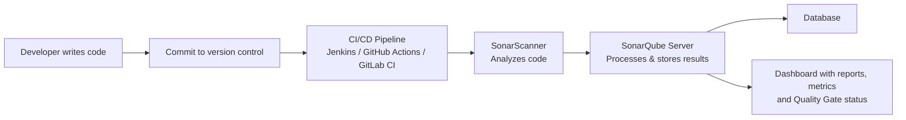

# SonarQube Complete Guide — Static Code Analysis and Quality Gates

Writing code that works is only half the battle. The other half is writing code that is clean, secure, and easy to maintain in the long run. As projects grow, defects, security flaws, and outdated patterns inevitably creep in. Manually reviewing every line becomes impossible. This is where automated static code analysis tools step in — and SonarQube is among the most widely adopted open-source platforms for exactly this purpose.

SonarQube is an open-source tool for static code analysis. It inspects your source code without executing it, hunting for bugs, code smells, security vulnerabilities, duplication, and coverage gaps, and it enforces the rules you value through configurable **Quality Gates**.

This guide walks through everything a developer starting with SonarQube needs: what it is, how it fits into the CI/CD pipeline, its architecture and components, the metrics it tracks, how Quality Gates work, the SonarScanner CLI commands, and a set of best practices for keeping your code healthy.

## Table of Contents

- [What is SonarQube?](#what-is-sonarqube)
- [Key Features](#key-features)
- [How SonarQube Works](#how-sonarqube-works)
- [Architecture and Components](#architecture-and-components)
- [Supported Languages](#supported-languages)
- [Common Metrics](#common-metrics)
- [Understanding Quality Gates](#understanding-quality-gates)
- [Integration with Your Toolchain](#integration-with-your-toolchain)
- [SonarScanner CLI Commands](#sonarscanner-cli-commands)
- [Best Practices](#best-practices)
- [Key Takeaways](#key-takeaways)
- [Frequently Asked Questions](#frequently-asked-questions)

## What is SonarQube?

SonarQube is an **open-source platform used for Continuous Code Quality**. Its core job is to inspect source code and detect bugs, code smells, and security vulnerabilities before they reach production.


At its simplest, SonarQube is an open-source tool for static code analysis that:

- Finds bugs, code smells, security vulnerabilities, and code duplications.
- Provides metrics and enforces Quality Gates.
- Helps improve code quality and maintainability.
- Supports many programming languages.

Because it runs analysis without executing the code, it is fast, safe, and catches a wide range of issues that automated tests may miss.

> **Note:** SonarQube performs *static* analysis. It reviews the structure and content of the code rather than its runtime behavior, so it complements — but does not replace — unit tests, integration tests, and performance testing.

## Key Features

SonarQube ships with a rich set of features designed to make quality visible across the entire team:

- Static code analysis.
- Detection of bugs, code smells, and security issues.
- Code coverage integration (so you can see how much of your code is exercised by tests).
- Duplication detection.
- Quality Gates that gate releases on quality thresholds.
- Dashboards and reports for a shared view of the project's health.
- Multi-language support.
- Integration with CI/CD tools.

The combination of these features means quality is not a one-off review — it is a continuous, automated discipline embedded in your delivery pipeline.

## How SonarQube Works

The workflow is straightforward and slots neatly into a typical developer workflow:

1. A developer writes code and commits it to the version control system.
2. The CI/CD pipeline triggers **SonarScanner** to run an analysis.
3. SonarScanner analyzes the code and sends the results to the **SonarQube Server**.
4. SonarQube processes the results and stores them in its database.
5. Reports, metrics, and Quality Gate status are shown on the dashboard for the team to review and act on.

The diagram below summarizes this flow in a typical developer pipeline:



## Architecture and Components

SonarQube is composed of several distinct components that work together:

| Component | Role |
|----------|------|
| **SonarQube Server** | The main application that processes analysis and stores results. |
| **SonarScanner** | Scans the code and sends the results back to the server. |
| **Database** | Stores all SonarQube data — supported backends include MySQL, PostgreSQL, and Oracle. |
| **Plugins** | Provide support for multiple languages and integrations. |

The **SonarQube Server** is the brain of the platform: it receives analysis reports, computes metrics, evaluates Quality Gate conditions, and renders the dashboards. The **SonarScanner** is the client that actually inspects the files in your project. Their results are persisted in a dedicated database, while **plugins** extend the tool to understand additional languages and connect to other systems.

## Supported Languages

SonarQube has broad multi-language support, which makes it a pragmatic choice for heterogeneous codebases. According to the source document, it supports:

- Java
- Python
- JavaScript
- TypeScript
- C##
- C / C++
- Go
- PHP
- Ruby
- Kotlin
- Swift

And many more via the plugin ecosystem.

## Common Metrics

SonarQube organizes its findings into a small set of core metrics that give an at-a-glance view of code health:

- **Bugs** — Potential issues in the code that could cause incorrect behavior.
- **Vulnerabilities** — Security flaws that could be exploited.
- **Code Smells** — Maintainability issues that signal the code may be hard to modify.
- **Coverage** — Unit test coverage indicating how much of the code is tested.
- **Duplications** — The percentage of duplicate code that should be consolidated.
- **Lines of Code** — The total size of the codebase.

Keeping an eye on these metrics over time helps teams spot regressions early and prioritize cleanup work. Clean code generally has few bugs, no known vulnerabilities, little duplication, and high coverage.

## Understanding Quality Gates

A **Quality Gate** is a set of rules or conditions that must be passed for code to be considered "good." Gates are defined on metrics — for example, "no new critical bugs," "coverage must stay above a threshold," or "duplicated code must not rise."

- Conditions are defined against the metrics discussed above.
- If the conditions fail, the build is marked as **FAILED**.
- Common statuses are **PASSED** (green), **FAILED** (red), and **WARN** (yellow).

Quality Gates are powerful because they tie quality to the build: a team can configure the pipeline to stop a release when a gate fails, ensuring bad code never ships silently.

> **Caution:** A Quality Gate is only as meaningful as its thresholds. Set thresholds that reflect your team's real standards — too strict and you block delivery, too loose and the gate adds little value. Review the conditions regularly.

## Integration with Your Toolchain

SonarQube is designed to fit into existing developer tooling:

- **CI/CD tools** — Jenkins, GitHub Actions, GitLab CI, Azure DevOps, Bamboo.
- **Version control** — Git, Bitbucket, GitHub, GitLab.
- **IDE** — IntelliJ, Eclipse, VS Code (via plugins).

Because analysis is triggered from CI/CD pipelines, every commit or pull request can be inspected automatically, giving developers feedback right where they work — both in the pipeline and inside their IDE.

## SonarScanner CLI Commands

You interact with SonarScanner from the command line using properties passed with the `-D` (define) flag. The key commands from the source document are:

| Command | Purpose |
|---------|---------|
| `sonar-scanner --help` | Show help. |
| `sonar-scanner` | Run analysis with default configuration. |
| `sonar-scanner -Dsonar.projectKey=myproj` | Specify the project key. |
| `sonar-scanner -Dsonar.sources=src` | Specify the source directory. |
| `sonar-scanner -Dsonar.host.url=http://localhost:9000` | Specify the SonarQube server URL. |
| `sonar-scanner -Dsonar.login=TOKEN` | Authenticate with a token. |

A typical invocation combines several of these flags in a single command, for example:

```bash
sonar-scanner \
  -Dsonar.projectKey=myproj \
  -Dsonar.sources=src \
  -Dsonar.host.url=http://localhost:9000 \
  -Dsonar.login=TOKEN
```

In modern SonarQube setups, token-based authentication (`-Dsonar.login=TOKEN`) is the preferred way to authenticate the scanner rather than hard-coding credentials.

## Best Practices

The source document closes with a concise list of best practices that teams should adopt:

1. Run analysis in every CI/CD pipeline so quality is checked continuously, not occasionally.
2. Define and enforce Quality Gates to block regressions.
3. Keep code coverage above 70%.
4. Fix issues continuously rather than letting the backlog pile up.
5. Exclude third-party code from analysis so the metrics reflect your own code.
6. Use proper issue severity levels so teams can prioritize what matters.
7. Review and act on reports regularly.
8. Keep SonarQube and its plugins updated to stay current with language support and new rules.

## Key Takeaways

- SonarQube is an open-source platform for continuous code quality that performs static code analysis on source files.
- Its components are the SonarQube Server, SonarScanner, the database, and language/integration plugins.
- It tracks bugs, vulnerabilities, code smells, coverage, duplications, and lines of code.
- Quality Gates are rules defined on metrics that mark a build PASSED, FAILED, or WARN — a failed gate fails the build.
- Analysis is triggered by the CI/CD pipeline via SonarScanner and results are stored and visualized on the server dashboard.
- Following best practices such as running analysis on every build, enforcing gates, keeping coverage high, and updating the tool keeps your codebase healthy.

## Frequently Asked Questions

**Is SonarQube open source?**
Yes. The source document explicitly describes SonarQube as an open-source platform used for continuous code quality.

**What kind of analysis does SonarQube perform?**
Static code analysis. It inspects source code to detect bugs, code smells, and security vulnerabilities without executing the code.

**How does SonarQube integrate with a build pipeline?**
The CI/CD pipeline triggers SonarScanner, which analyzes the code and sends results to the SonarQube Server; status is shown on the dashboard. It integrates with Jenkins, GitHub Actions, GitLab CI, Azure DevOps, and Bamboo.

**What does a Quality Gate do?**
It defines conditions on metrics that must pass for code to be considered good. If the conditions fail, the build is marked as FAILED; statuses are PASSED (green), FAILED (red), and WARN (yellow).

**Which databases does SonarQube support for storage?**
According to the source, MySQL, PostgreSQL, and Oracle are supported backend databases.

## Related Articles

- Continuous Integration and Continuous Delivery (CI/CD) fundamentals
- Jenkins Pipelines for Automated Builds
- Getting Started with Static Analysis for Security

---

*Based on the study document "SonarQube — Complete Notes" by Abhishek Singh.*