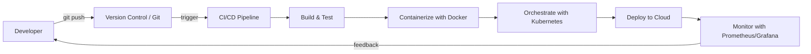
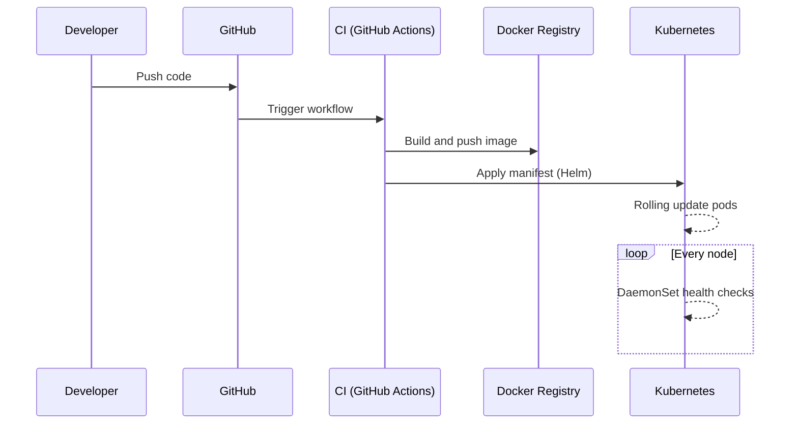
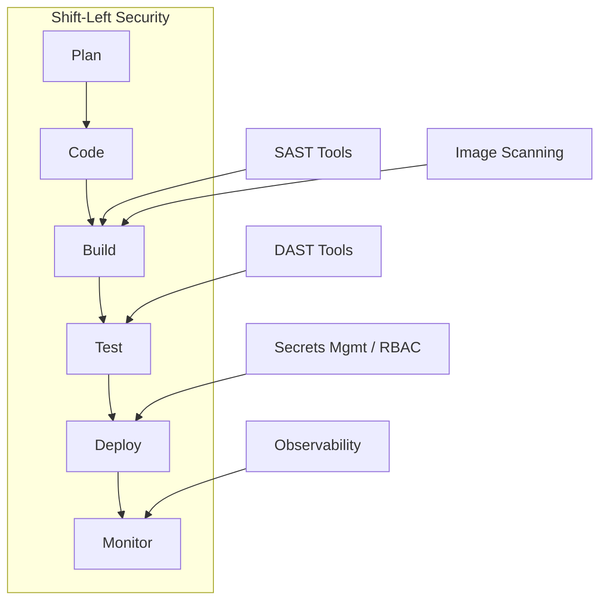

# Top 100 DevOps Interview Questions and Answers to Master in 2025

DevOps has grown from a buzzword into the backbone of modern software delivery. It unifies development and operations teams, automates repetitive work, and turns infrastructure into code that anyone can review, version, and improve. Interviewers no longer ask only about tools—they probe your understanding of culture, reliability, security, and the whole delivery lifecycle.

This article distills a comprehensive interview bank covering 100 questions across twenty categories. Whether you are preparing for your first DevOps role or brushing up before a senior-level loop, this guide walks you through fundamentals, version control, CI/CD, configuration management, containers, cloud, monitoring, security, SRE, and the emerging trends shaping DevOps in 2025. Every answer is drawn strictly from the source material so you can learn exactly what hiring teams expect.

## Table of Contents

- [1. What Is DevOps and Why Does It Matter](#1-what-is-devops-and-why-does-it-matter)
- [2. Version Control and Git](#2-version-control-and-git)
- [3. CI/CD and Automation](#3-cicd-and-automation)
- [4. Configuration Management and Infrastructure as Code](#4-configuration-management-and-infrastructure-as-code)
- [5. Containers and Orchestration](#5-containers-and-orchestration)
- [6. Cloud and Terraform](#6-cloud-and-terraform)
- [7. Monitoring, Observability, and Logging](#7-monitoring-observability-and-logging)
- [8. Security in DevOps: DevSecOps](#8-security-in-devops-devsecops)
- [9. SRE and Reliability Engineering](#9-sre-and-reliability-engineering)
- [10. Deployments and Advanced CI/CD](#10-deployments-and-advanced-cicd)
- [11. Infrastructure Automation and GitOps](#11-infrastructure-automation-and-gitops)
- [12. Kubernetes Advanced Topics](#12-kubernetes-advanced-topics)
- [13. Observability and Tracing in Depth](#13-observability-and-tracing-in-depth)
- [14. DevOps Culture and Process](#14-devops-culture-and-process)
- [15. Performance and Cloud Economics](#15-performance-and-cloud-economics)
- [16. Incident Management and Disaster Recovery](#16-incident-management-and-disaster-recovery)
- [17. Emerging Trends for 2025](#17-emerging-trends-for-2025)
- [Key Takeaways](#key-takeaways)
- [Frequently Asked Questions](#frequently-asked-questions)

## 1. What Is DevOps and Why Does It Matter

DevOps is a software development methodology that integrates development (Dev) and operations (Ops) to improve collaboration, automation, and efficiency. Instead of treating coding and deployment as separate silos, DevOps treats them as one continuous, shared responsibility across the entire lifecycle.

### Key Principles of DevOps

The practice rests on five core pillars:

- **Collaboration** — breaking down walls between teams
- **Automation** — removing manual, repetitive toil
- **Continuous Integration and Deployment** — delivering small, frequent, reliable changes
- **Monitoring and Feedback** — closing the loop with visibility into production
- **Security and Compliance** — baking guardrails into every stage

### How DevOps Differs from Agile

Agile focuses on software development processes—how teams plan, build, and iterate. DevOps extends that philosophy to operations, ensuring that what is built is delivered faster and released reliably. Agile answers "how do we build the right thing quickly?" while DevOps answers "how do we run and ship it reliably?"

### Key Benefits

| Benefit | What It Means in Practice |
| --- | --- |
| Faster software releases | Smaller, automated delivery cycles reach users sooner |
| Improved collaboration | Shared ownership across Dev and Ops |
| Higher efficiency and scalability | Automation lets teams handle more with less effort |
| Better system reliability | Monitoring and feedback reduce surprise failures |

### The Key DevOps Toolkit

A DevOps engineer is expected to be fluent across an ecosystem of tools:

- **CI/CD**: Jenkins, GitLab CI, GitHub Actions
- **Containerization**: Docker, Podman
- **Orchestration**: Kubernetes, OpenShift
- **Monitoring**: Prometheus, Grafana
- **Configuration Management**: Ansible, Puppet, Chef
- **Version Control**: Git

## 2. Version Control and Git

Git is a distributed version control system for tracking source code changes. It is the foundation every other DevOps tool builds on, because it provides a single source of truth for both code and, increasingly, infrastructure.

### Git vs. GitHub/GitLab

Git is the version control system itself. GitHub and GitLab are web-based platforms that host Git repositories and layer collaboration features on top—pull requests, issue trackers, code review, and CI/CD integrations.

### git pull vs. git fetch

- **git fetch** downloads changes from the remote repository but does not merge them into your working branch.
- **git pull** fetches the changes and merges them into the current branch in one step.

The rule of thumb: if you want to inspect changes before integrating them, use `fetch`; if you want the latest integrated, use `pull`.

### Branching Strategies

Interviewers like to hear that you understand trade-offs, not just syntax.

- **Feature Branching**: develop each feature in an isolated branch, then merge it back.
- **Gitflow**: a structured model using `main`, `develop`, `feature`, `release`, and `hotfix` branches.
- **Trunk-based development**: continuously integrate small changes into `main` to reduce merge conflicts and enable CI.

### Resolving a Merge Conflict

A conflict happens when two branches change the same lines of code. The resolution workflow is:

1. Identify conflicting files using `git status`.
2. Manually edit the conflicting files to resolve the differences.
3. Stage the resolved files with `git add`, then commit with `git commit -m "Resolved conflict"`.

> **Note:** Never force-push a conflict resolution without confirming intent. A clean, well-explained merge commit is far easier for a team to audit than a rewritten history.

## 3. CI/CD and Automation

### Continuous Integration and Continuous Deployment

Continuous Integration (CI) automates integrating code from multiple developers into a shared repository, catching integration problems early. Continuous Deployment (CD) automates the delivery of software from testing all the way to production.

### Jenkins Pipelines

Jenkins offers two ways to define a pipeline:

- A **Declarative Pipeline** defines the entire CI/CD process inside a `Jenkinsfile` using a structured, readable syntax.
- A **Scripted Pipeline** provides greater flexibility but requires writing Groovy scripting.

### How Do You Secure Jenkins?

Because Jenkins often holds deployment credentials, security is a common question:

- Use Role-Based Access Control (RBAC) to limit who can do what.
- Encrypt secrets using Jenkins credentials.
- Enforce HTTPS and monitor plugin vulnerabilities.

### GitHub Actions

GitHub Actions is a CI/CD automation tool integrated directly with GitHub. Its advantages are easy setup, a built-in marketplace of reusable actions, and YAML-based workflow definitions that live right next to your code.

## 4. Configuration Management and Infrastructure as Code

Configuration Management in DevOps is about managing system configurations to ensure consistency and scalability across environments. Instead of configuring each server by hand, teams describe the desired state and let tooling enforce it.

### Ansible vs. Puppet vs. Chef

The three configuration tools take different architectural approaches:

| Tool | Model | Language | Approach |
| --- | --- | --- | --- |
| **Ansible** | Agentless | YAML | Push model |
| **Puppet** | Agent-based | Puppet DSL | Pull model |
| **Chef** | Agent-based | Ruby DSL | Client/server |

Ansible is agentless and YAML-based, uses a push model, and is famous for its low learning curve. Puppet uses agents and a pull model with its own DSL. Chef uses a Ruby DSL and is also agent-based.

### Playbooks and Roles

An **Ansible Playbook** is a YAML file that defines automation tasks. An **Ansible role** is a structured way to organize Playbooks—reusing and packaging them so automation stays maintainable at scale.

### Infrastructure as Code (IaC)

Infrastructure as Code means automating infrastructure provisioning using code—for example with Terraform or Ansible. Infrastructure becomes reviewable, versionable, and reproducible just like application code.

## 5. Containers and Orchestration

### Docker

Docker is a containerization platform that packages applications together with their dependencies so they run consistently anywhere. A **Dockerfile** is a script containing the instructions used to build a Docker image.

### Kubernetes

Kubernetes is an orchestration platform for managing containerized applications. If Docker provides the packaging, Kubernetes provides the coordination—scaling, scheduling, and healing workloads.

- **Pods** are the smallest deployable unit in Kubernetes, containing one or more containers that share the same network and storage namespace.
- **Helm** is a package manager for Kubernetes that simplifies application deployment by packaging charts of related Kubernetes resources.

> **Note:** A Pod is the smallest unit you schedule, not a single container. Multiple tightly coupled containers can share one Pod, which is a distinction that frequently trips up candidates.

## 6. Cloud and Terraform

### Terraform

Terraform is an open-source Infrastructure as Code tool for managing cloud infrastructure declaratively. You describe the desired state, and Terraform figures out how to reach it.

### Terraform vs. CloudFormation

- **Terraform**: multi-cloud, uses its own state management, declarative.
- **CloudFormation**: AWS-specific and tightly integrated with AWS services, managed as stacks.

### The Terraform State File

The state file stores infrastructure state to track changes over time. It is what lets Terraform plan a diff against reality and apply only what changed. Best practice—covered later—is to store it remotely and lock it.

### AWS IAM and Auto-Scaling

An **AWS IAM role** is a set of permissions that AWS services use to securely access resources, without needing long-lived user credentials. **Auto-scaling** automatically adjusts the number of instances based on demand, turning capacity up and down as load changes.

## 7. Monitoring, Observability, and Logging

### Prometheus and Grafana

- **Prometheus** is an open-source monitoring system for collecting and querying time-series data.
- **Grafana** is a visualization tool for rendering those monitoring metrics into dashboards.

### The ELK Stack

The ELK Stack is a trio for centralized logging:

- **Elasticsearch**: the search engine that indexes and queries logs.
- **Logstash**: handles log ingestion and processing.
- **Kibana**: provides visualization and exploration of the logs.

### Observability and SLOs

Observability is the ability to measure system health through logs, metrics, and traces. Service-Level Objectives (SLOs) are defined targets for system performance and availability—the concrete numbers your monitoring is meant to verify.

## 8. Security in DevOps: DevSecOps

DevSecOps means integrating security into DevOps workflows rather than treating it as a final gate. Two pillars stand out:

- **OWASP** — the Open Web Application Security Project, which provides widely referenced security guidelines for web applications.
- **Shift-Left Security** — incorporating security early in the software development lifecycle, before problems become expensive to fix.

### Securing a Containerized Environment

- Use minimal base images to shrink the attack surface.
- Implement RBAC in Kubernetes to limit privileges.
- Scan images for vulnerabilities.

### Secrets Management

Tools for protecting credentials include HashiCorp Vault, AWS Secrets Manager, and Kubernetes Secrets. The pattern is always the same: never commit secrets, and never hard-code them in code or configuration.

### Security Scanning Tools

In a secure pipeline you typically layer automated testing:

- **SAST** (Static Application Security Testing), e.g., SonarQube and Snyk—analyzes source for vulnerabilities without running it.
- **DAST** (Dynamic Application Security Testing), e.g., OWASP ZAP and Burp Suite—tests a running application against known attack patterns.
- **Container image scanning**, using tools like Trivy or Clair, catches vulnerabilities inside images before deployment.

Least privilege is applied across the board with IAM roles, RBAC, and enforced multi-factor authentication (MFA).

## 9. SRE and Reliability Engineering

Site Reliability Engineering (SRE) is a discipline that applies software engineering to infrastructure operations. It treats ops problems as software problems to be solved with code and automation.

### SLAs, SLOs, and SLIs

| Term | Meaning |
| --- | --- |
| **SLA** | Service Level Agreement — a contractual commitment |
| **SLO** | Service Level Objective — an internal performance target |
| **SLI** | Service Level Indicator — the actual measured value |

### Error Budgets and Blameless Postmortems

An **error budget** is the acceptable downtime limit before affecting SLOs—it gives teams permission to ship changes as long as the budget is intact. **Blameless postmortems** are incident reviews focused on learning and system improvement rather than assigning blame.

### Chaos Engineering

Chaos engineering is the practice of testing system resilience through controlled failures. By deliberately breaking components in a controlled way, teams learn where their systems are fragile before a real outage does it for them.

## 10. Deployments and Advanced CI/CD

### Deployment Strategies

- **Blue-Green Deployment**: maintain two environments—Blue (live) and Green (new). After testing Green, switch traffic over.
- **Canary Deployment**: release gradually to a small subset of users before a full rollout.
- **Rolling Update**: gradually replace old instances with new ones without downtime.

### Handling Secrets in CI/CD

Use environment variables, HashiCorp Vault, or AWS Secrets Manager to inject secrets at runtime rather than baking them into builds.

### Preventing Deployment Failures

Guard against failures with automated testing, clear rollback strategies, and feature flags that let you toggle behavior in production without redeploying.

## 11. Infrastructure Automation and GitOps

### What Is GitOps?

GitOps is a DevOps model where infrastructure changes are managed via Git repositories. Unlike traditional IaC, GitOps enforces version-controlled infrastructure and automatic reconciliation—the system continuously works to bring reality into line with the declared state in Git.

### Terraform State Best Practices

- Store state in remote backends (S3, Azure Blob) so the whole team shares one source.
- Use state locking to prevent concurrent modification conflicts.

A **Terraform module** is a reusable, parameterized collection of Terraform configurations. **Drift detection** is the process of detecting changes in real infrastructure that are not reflected in the Terraform state, a crucial hygiene check for any IaC practice.

## 12. Kubernetes Advanced Topics

### Workload Control and Routing

- **DaemonSet** ensures a Pod runs on every node in the cluster—ideal for logs, monitoring, or networking agents.
- **StatefulSet** is used for stateful applications, providing stable network IDs and persistent storage.
- **Ingress** is a resource that manages external access to services over HTTP/HTTPS.

### Autoscaling and Access Control

The **Horizontal Pod Autoscaler (HPA)** adjusts the number of pods based on CPU or memory metrics. **Kubernetes RBAC** is the Role-Based Access Control system for managing permissions in a cluster—who can do what against which resources.

### Rollback

When a deployment goes wrong, use `kubectl rollout undo` to revert to a previous deployment.

## 13. Observability and Tracing in Depth

### Querying Metrics

**PromQL** is the query language used to fetch Prometheus metrics in Prometheus.

### Monitoring Kubernetes

Monitor clusters with a combination of Prometheus, Grafana, and the Kubernetes Metrics Server, which supplies resource usage data for HPA and dashboards.

### Centralized Logging and the Three Pillars

In a distributed system, centralize logs using the ELK Stack or Fluentd for aggregation. Two observability concepts are frequently conflated:

- **Logging** captures discrete events.
- **Tracing** follows a single request's lifecycle across services.

**OpenTelemetry** helps by providing unified telemetry—logs, metrics, and traces—across services, so you have one consistent vendor-neutral way to instrument everything.

## 14. DevOps Culture and Process

### Implementing DevOps in a Large Enterprise

Start with CI/CD adoption, then layer in Infrastructure as Code, monitoring, and DevSecOps practices. Culture change is gradual and measured.

### Key DevOps KPIs

- Deployment frequency
- Mean time to recover (MTTR)
- Change failure rate

### Handling Failure

Implement rollback strategies, conduct blameless postmortems, and use chaos engineering. A **postmortem** is a retrospective analysis of an incident aimed at preventing recurrence. A **runbook** is a predefined set of procedures for handling incidents, while an incident-response **playbook** is a detailed action plan for mitigating specific security or system issues.

### Feature Flags

Feature flags are a mechanism for toggling features on or off in production, enabling incremental rollouts and instant disable without a redeploy.

## 15. Performance and Cloud Economics

### Content Delivery Networks

A **Content Delivery Network (CDN)** caches content closer to users to reduce latency.

### Optimizing CI/CD Performance

- Use parallel builds
- Implement caching
- Use selective testing so only what changed gets exercised

### Database Performance

Improve database performance with indexing, caching, and database partitioning.

### Microservices Patterns

The **sidecar pattern** deploys an auxiliary container alongside the main service—typically for logging, monitoring, or security—without changing the service itself.

### Controlling Cloud Costs

Reduce costs with auto-scaling, spot instances, and cost monitoring tools. Related disciplines include **FinOps**—financial operations to optimize cloud spending—and **AIOps**, AI-driven operations that automate incident detection and resolution.

## 16. Incident Management and Disaster Recovery

### RTO and RPO

- **RTO (Recovery Time Objective)**: the time it takes to restore services after an outage.
- **RPO (Recovery Point Objective)**: the maximum acceptable data loss in the event of a failure.

### Testing Disaster Recovery

Conduct failover tests and simulate outages so that recovery steps are proven before a real incident, rather than assumed.

### Additional Security Definitions

When asked about defense, be ready to explain:

- **Zero Trust**: a model where no one is trusted by default, requiring strict identity verification for every request.
- **WAF (Web Application Firewall)**: protects applications from web-based threats such as SQL injection and XSS.
- **DDoS protection**: use CDNs, rate limiting, and services like AWS Shield or Cloudflare.
- **Service Mesh**: a dedicated infrastructure layer for managing service-to-service communication (e.g., Istio, Linkerd), often used with mutual TLS to secure microservices.

## 17. Emerging Trends for 2025

The final category of the interview set looks ahead. Emerging trends in DevOps for 2025 include:

- **AI-driven automation** — smarter pipelines and incident response
- **GitOps adoption** — Git as the control plane for infrastructure
- **Enhanced Kubernetes security** — hardening workloads and clusters
- **Observability improvements** — deeper, unified telemetry

Related modern practices worth knowing include **Policy-as-Code**, defining security and compliance policies in code with tools like OPA and AWS SCPs, and **serverless architectures** such as AWS Lambda, which let you run applications without managing infrastructure.

## Key Takeaways

- DevOps unifies development and operations through collaboration, automation, continuous integration and deployment, monitoring, and security.
- Git is the foundation: understand the difference between `fetch` and `pull`, branching strategies like Gitflow and trunk-based development, and the conflict-resolution workflow.
- CI/CD tools like Jenkins, GitLab CI, and GitHub Actions automate the path from commit to production; learn declarative vs. scripted pipelines.
- Distinguish configuration tools—Ansible (agentless, YAML, push) vs. Puppet and Chef (agent-based, pull)—and grasp Infrastructure as Code with Terraform state management.
- Containers (Docker) and orchestration (Kubernetes) sit at the center of the stack, along with Pods, Helm, DaemonSets, StatefulSets, Ingress, and HPA.
- Observability, reliability, and security are inseparable: SLOs/SLIs, chaos engineering, blameless postmortems, DevSecOps, SAST/DAST, and least privilege are all fair game.

## Frequently Asked Questions

### What are the core pillars of DevOps?

The key principles are collaboration, automation, continuous integration and deployment, monitoring and feedback, and security and compliance.

### What is the difference between continuous integration and continuous deployment?

Continuous Integration automates integrating code from multiple developers into a shared repository, while Continuous Deployment automates delivering software from testing all the way to production.

### How is Ansible different from Puppet and Chef?

Ansible is agentless, YAML-based, and uses a push model; Puppet uses agents, Puppet DSL, and a pull model; Chef uses a Ruby DSL and is agent-based.

### What distinguishes an SLO from an SLA?

An SLA is a contractual service level agreement, an SLO is an internal performance target, and an SLI is the measured indicator a team uses to track whether it is meeting objectives.

### What are the emerging DevOps trends for 2025?

According to the source, emerging trends include AI-driven automation, GitOps adoption, enhanced Kubernetes security, and observability improvements.

## Related Articles

- How Git Branching Strategies Improve Team Delivery
- Continuous Integration and Deployment Explained
- A Practical Introduction to Kubernetes Workloads
- Infrastructure as Code with Terraform and Ansible

---

*This article is based entirely on the source document "Top 100 DevOps Engineer Interview Questions & Answers for 2025." Topics not present in that source—such as specific interview etiquette, salary expectations, or hands-on coding exercises—are not covered here.*
