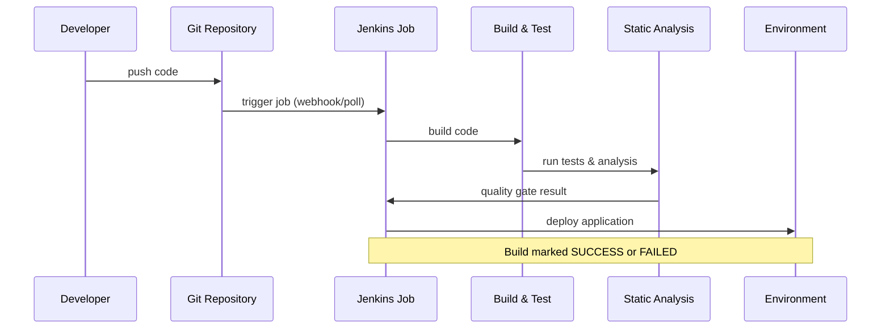
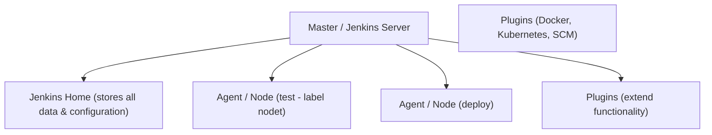

# Jenkins Architecture, Declarative Pipelines, and CI/CD Explained


Continuous Integration and Continuous Delivery (CI/CD) have become the backbone of modern software engineering. Teams ship faster, catch bugs earlier, and deploy with confidence because every commit flows through an automated, repeatable pipeline. At the center of thousands of these pipelines sits **Jenkins**, one of the most widely used open-source automation servers in the world.

This article walks through what Jenkins is, how its architecture is organized, how declarative pipelines are written "as code," and how the entire CI/CD process connects developer, build, test, and deploy stages. It also includes a set of commonly asked Jenkins interview questions with concise answers, all grounded directly in the source document.

## Table of Contents

- [What is Jenkins?](#what-is-jenkins)
- [CI/CD Pipeline Explained](#cicd-pipeline-explained)
- [The Continuous Integration and Continuous Delivery Model](#the-continuous-integration-and-continuous-delivery-model)
- [Jenkins Architecture](#jenkins-architecture)
  - [Agents and Nodes](#agents-and-nodes)
  - [Plugins](#plugins)
  - [Jenkins Home](#jenkins-home)
- [Declarative Pipeline as Code](#declarative-pipeline-as-code)
  - [Anatomy of a Declarative Pipeline](#anatomy-of-a-declarative-pipeline)
- [A Real World Example Pipeline](#a-real-world-example-pipeline)
- [Common Jenkins Interview Questions](#common-jenkins-interview-questions)
- [Key Takeaways](#key-takeaways)
- [Frequently Asked Questions](#frequently-asked-questions)

## What is Jenkins?

> Jenkins is an open-source automation server used for CI/CD.

In short, Jenkins watches your source code, and every time a change is pushed, it automatically builds, tests, and prepares your application for release. Instead of leaving these steps to individual developers, Jenkins centralizes and automates the workflow so the same process runs every single time.

At its core, Jenkins turns a manual, error-prone process into a repeatable, scripted workflow. It is deeply plugin-driven, which means its core functionality can be extended to integrate with virtually any tool in your ecosystem.

## CI/CD Pipeline Explained

The source document describes a step-by-step CI/CD pipeline that ties version control, build automation, and deployment together. Let's walk through the high-level flow:


1. **Developer pushes code to Git.** Every meaningful change to the codebase is committed and pushed to a central repository.
2. **A Jenkins job is triggered.** This can happen automatically (for example, through a webhook) whenever new code arrives.
3. **The code is built.** The freshly pushed code is compiled, packaged, and prepared into a runnable artifact.
4. **Automated tests run.** Unit tests and integration tests execute against the new build to catch regressions early.
5. **Static code analysis runs.** The pipeline analyzes code quality, scans for bugs, and measures code coverage and security.
6. **A quality gate validates and sends the result back to Jenkins.** If the quality gate passes, the pipeline proceeds; if it fails, the build is marked as **SUCCESS or FAILED**.
7. **Artifacts are stored and the application is deployed** to staging and eventually to production.

A build is ultimately marked as either SUCCESS or FAILED, and this single status tells the team whether a change is safe to promote further.

The following sequence diagram illustrates how these components cooperate:



The document's **key points** reinforce the philosophy behind this flow:

> **KEY POINTS** — Automate everything. Build fast, test early. Deploy often, monitor always. CI gives confidence, CD delivers value, and quality code matters.

## The Continuous Integration and Continuous Delivery Model

The source material clearly distinguishes two complementary practices:

### Continuous Integration (CI)

- Developers integrate code **frequently**, rather than in large, risky spurts.
- Automated **builds and tests** run on every change, so problems surface almost immediately.
- The result is **confidence**: because code is constantly integrated and verified, teams trust that the shared branch remains healthy.

### Continuous Delivery and Continuous Deployment (CD)

- CD itself works to ship the tested code artifact to a staging environment and make it ready **for deployment to production**.
- **Continuous Delivery** typically stops before production, often gated behind a **manual approval** for the production step.
- **Continuous Deployment** goes further and **automates** delivering that last mile to production without human intervention.
- Common **deployment tools** referenced in the source include Docker, Kubernetes, AWS, and Ansible, while **artifact repositories** such as Nexus and Artifactory store the built artifacts.

| Practice | Focus | Typical Gate |
| --- | --- | --- |
| Continuous Integration | Integrate code + automated build/test | Feedback on each commit |
| Continuous Delivery | Package and ready for release | Manual approval before production |
| Continuous Deployment | Automatically ship to production | No manual step |

## Jenkins Architecture

Understanding Jenkins architecture helps you design pipelines that scale and run reliably. The document describes four key building blocks:



### Agents and Nodes

**Agents and Nodes** execute the jobs and steps assigned by the master server. A **node** is a machine (an agent) on which Jenkins executes jobs. By distributing work across multiple agents, your pipeline can run builds in parallel and scale beyond a single machine.

### Plugins

**Plugins extend Jenkins functionality.** They let Jenkins talk to external systems, such as version control, testing tools, artifact repositories, and cloud providers. Almost every capability beyond the core build is added through a plugin. Examples of common integrations include `docker {...}`, `kubernetes {...}`, and test environments with a label such as `label 'nodet'`.

### Jenkins Home

**Jenkins Home** stores all data and configuration for a Jenkins instance — the master's settings, build records, and metadata. This is the central directory that keeps your entire automation server persistent across restarts.

If any part of the document omits details — for example, how to configure distributed agents across cloud platforms — you should know that such specifics are not covered by the source material.

## Declarative Pipeline as Code

Modern Jenkins emphasizes **Pipeline as Code**, expressed through a `Jenkinsfile`. Instead of configuring everything by hand in the web UI, the entire pipeline is written as a text file, checked into your repository, and version controlled alongside your application.

### Anatomy of a Declarative Pipeline

A declarative pipeline is built around a top-level `pipeline` block, and within it three key constructs:

- **`agent`** — Declares the agents or nodes where jobs should run. An agent defines where execution happens (for example, a node labeled `node`).
- **`stages`** — A list of stages. Each stage groups related activities, for example `Build`, `Test`, `Deploy`.
- **`steps`** — The individual tasks that actually execute inside each stage.

The skeleton looks like this:

```groovy
pipeline {
    agent any

    stages {
        stage('Build') {
            steps {
                echo 'Building the application'
            }
        }
        stage('Test') {
            steps {
                // run test suites
            }
        }
        stage('Deploy') {
            steps {
                // deploy to target environment
            }
        }
    }
}
```

In the source extract, environments are configured with agent entries like `agent { label 'nodet' }`, plus plugin environments such as `docker {...}` and `kubernetes {...}`. This lets a single `Jenkinsfile` describe the full CI/CD lifecycle — from building to testing to deploy — in one version-controlled file.

There are also environment variables set within the pipeline (for example, an `APP_NAME` used by the build), keeping configuration declarative and uniform across environments.

## A Real World Example Pipeline

Let's combine what we have learned into a single, complete `Jenkinsfile` that mirrors the flow described in the document. It defines an application name, a build stage, a test stage, a quality gate, and a deploy stage:

```groovy
pipeline {
    agent { label 'node1' }
    environment {
        APP_NAME = 'DemoApp'
    }
    stages {
        stage('Build') {
            steps {
                echo "Building ${APP_NAME}..."
            }
        }
        stage('Test') {
            steps {
                echo "Testing ${APP_NAME}..."
            }
        }
        stage('Quality Gate') {
            steps {
                echo 'Analyzing code quality, bugs, coverage, and security...'
            }
        }
        stage('Deploy') {
            steps {
                echo "Deploying ${APP_NAME} to environment..."
            }
        }
    }
}
```

> Note: The example above is a simplified illustration based on the document's structure. Actual production `Jenkinsfile`s typically include credential lookups, plugin settings, and environment-specific conditional logic beyond what the source document covers.

If a stage fails, the build is marked as FAILED; if everything succeeds, the build is marked SUCCESS and the artifact moves on to artifact storage and deployment.

## Common Jenkins Interview Questions

The source material includes a set of frequently asked Jenkins interview questions. Here they are with their answers:

1. **What is Jenkins?**
   Jenkins is an open-source automation server used for CI/CD.

2. **What is the difference between Continuous Integration (CI) and Continuous Delivery (CD)?**
   CI focuses on integration and testing, while CD focuses on delivering code to environments.

3. **What is a `Jenkinsfile`?**
   A `Jenkinsfile` is a text file that contains the definition of a Jenkins pipeline, written as code and version controlled.

4. **What is a node in Jenkins?**
   A node is a machine (agent) on which Jenkins executes jobs.

5. **What are plugins in Jenkins?**
   Plugins are extensions to the functionality of Jenkins.

6. **What is the difference between a Freestyle job and a Pipeline?**
   A Freestyle job is UI based and manual, while a Pipeline is code-based (a `Jenkinsfile`) and version controlled.

7. **How do you trigger a job in Jenkins?**
   By Poll SCM, webhooks, timers, or manually.

8. **How do you handle credentials in Jenkins?**
   By using the Jenkins Credentials Plugin.

9. **How do you archive artifacts in Jenkins?**
   By using the "Archive the artifacts" option in post-build actions.

10. **How can you send email notifications?**
   By using the Email Extension Plugin.

11. **How do you roll back a failed deployment?**
    By deploying the previous stable build or using versioned artifacts.

## Key Takeaways

- **Jenkins is an open-source automation server** that orchestrates the entire CI/CD workflow from code commit to deployment.
- **The pipeline** flows from a developer push to Git, to a triggered Jenkins job, to build, automated testing, static analysis, a quality gate, storage, and deployment.
- **Continuous Integration** integrates and tests code frequently, giving the team confidence in every commit; **Continuous Delivery/Deployment** quickly ships the value to staging and production.
- **Pipeline as Code** uses a `Jenkinsfile` with a `pipeline` block built from `agent`, `stages`, and `steps`, all version controlled alongside the code.
- **Key components of Jenkins** include agents/nodes, plugins, and the Jenkins Home directory, which stores all configuration.
- **Common interview topics** include the difference between Freestyle jobs and pipelines, credential handling, artifact archiving, and email notifications.

## Frequently Asked Questions

**What is the difference between CI and CD?**
CI focuses on integrating code and running automated builds and tests, while CD delivers the tested code to environments — either through manual approval (Continuous Delivery) or automatically (Continuous Deployment).

**How can agents are different from nodes in Jenkins?**
The source document treats the terms as closely related: an agent is a machine on which Jenkins executes jobs, and a node is that same class of machine/work automatically. For fully formal distinctions, consult the official Jenkins documentation, which is not covered by this source.

**How do I trigger a Jenkins job?**
Jobs can be triggered by polling SCM, webhook, a timer, or manually, as listed in the document.

**How do I store passwords and secrets safely in Jenkins?**
Use the Jenkins Credentials Plugin to store and inject credential information — the document lists it as a supported answer.

**How do I roll back a bad deployment?**
Deploy the previous stable build or rely on versioned artifacts to restore a known-good release.

## Related Articles

- CI/CD Pipeline Explained
- Declarative Pipelines in Jenkins
- Automating Your Build, Test, and Release Workflow with DevOps
