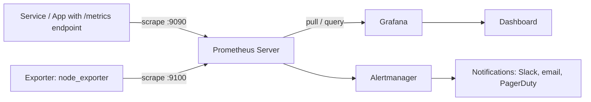
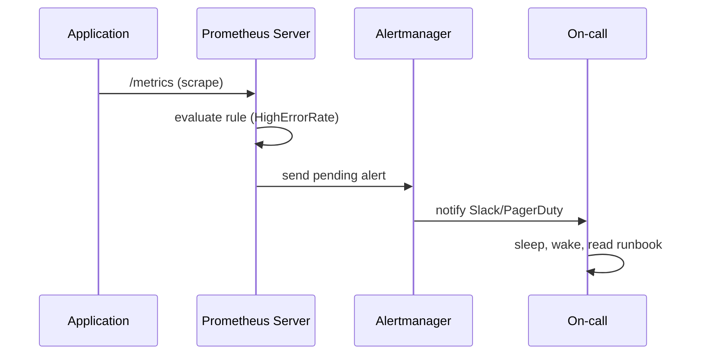

# Mastering Observability with Prometheus and Grafana: From Metrics to Actionable Insights

DevOps teams often confuse **monitoring** with **observability** — but they are not the same thing. Monitoring asks *"is the system up?"* Observability asks *"why is it down, and can I answer that question without shipping new code?"* As architectures shift from monoliths toward microservices, containers, and serverless functions, traditional "is it green?" dashboards stop being enough. You need a system you can interrogate, not just watch.

This article walks you through building a modern, production-grade observability stack using **Prometheus** for collection and storage and **Grafana** for visualization and alerting. We will cover the core concepts, the PromQL query language, metric exporters, alerting rules, and a real-world example you can replicate in a few hours. Whether you are an SRE, a platform engineer, or a DevOps generalist, by the end you will have a mental model of how the two tools fit together — and the practical commands to prove it.

## Table of Contents

- [Why Observability Matters](#why-observability-matters)
- [The Three Pillars of Observability](#the-three-pillars-of-observability)
- [Prometheus Architecture: How It Works](#prometheus-architecture-how-it-works)
- [Metric Types and the Data Model](#metric-types-and-the-data-model)
- [Collecting Metrics with Exporters](#collecting-metrics-with-exporters)
- [Writing Powerful Queries with PromQL](#writing-powerful-queries-with-promql)
- [Visualizing Data with Grafana](#visualizing-data-with-grafana)
- [Alerting: From Dashboards to Pagers](#alerting-from-dashboards-to-pagers)
- [Real-World Example: Monitoring a Web Service](#real-world-example-monitoring-a-web-service)
- [Key Takeaways](#key-takeaways)
- [Frequently Asked Questions](#frequently-asked-questions)
- [Related Articles](#related-articles)

## Why Observability Matters

Modern distributed systems fail together. A single slow database query can cascade into timeouts, retries, queue backlogs, and finally a visible outage — even though every individual service appears healthy. If you only track "HTTP 200 vs HTTP 500," you will remain blind to the real cause.

Observability changes the approach from *known unknown* ("we know we have a health endpoint") to *unknown unknown* ("we do not know what we do not know"). The goal is that a teammate can ask an arbitrary question about the current system state without writing new code first.

> **Key insight:** Monitoring is a *practice*, observability is a *capability*. Monitoring tells you the service is slow; observability tells you *which dependency*, *which request*, and *which metric* caused the slowdown.


## The Three Pillars of Observability

Industry convention (popularized by Google's SRE practices and the DevOps community) groups observability into three signals, sometimes called the "three pillars":

| Pillar | What it answers | Prometheus & Grafana coverage |
|--------|-----------------|------------------------------|
| **Metrics** | *How many? How fast? How long?* Aggregated numeric data over time | Native — this is Prometheus's core strength |
| **Logs** | *What happened?* Individual events with context | Companion tools like Loki (part of the Grafana stack) |
| **Traces** | *Where did time go?* End-to-end request journeys across services | Companion tools like Tempo, or integrate with Jaeger |

While Prometheus and Grafana form the **metrics** backbone, Grafana Labs offers **Loki** for logs and **Tempo** for traces, letting you build a unified stack. This article focuses on the metrics pillar, which is where most teams should start.

## Core Architecture: How Prometheus Works

Prometheus uses a **pull-based** model. Rather than having servers push data, the Prometheus *server* reaches out on a schedule and scrapes metrics over HTTP at a designated endpoint (usually `/metrics`). This design has important consequences:

1. **Discovery-driven:** The server can discover targets dynamically via Prometheus, Kubernetes, or DNS-based service discovery.
2. **Reliability:** If the server is briefly down, scrapes simply resume on the next interval; nothing is permanently lost or queued unboundedly.
3. **Single source of truth:** Target health is measured from the collector's perspective, so you always know the scrape succeeded.

### Prometheus components

The overall system is made up of several components working together:



- **Prometheus Server** — ingests scrapes, stores time-series data in a local TSDB, and evaluates recording/alerting rules.
- **Exporters** — small processes that expose metrics from systems that cannot expose them natively (the OS, a database, a queue).
- **PromQL** — the query language used to retrieve and aggregate those metrics.
- **Alertmanager** — handles alerts generated by the server, deduplicating, grouping, and routing them to notification channels.

## Metric Types and the Data Model

Prometheus identifies each time series by a **metric name** and a set of **key/value labels**. For example:

```
http_requests_total{method="GET", status="200", endpoint="/api/v1/users"} 1047
```

The metric name is `http_requests_total`, and `method`, `status`, and `endpoint` are labels. Labels are what make PromQL powerful: you can aggregate, slice, and sum to subsets, and _across_ label dimensions.

Four metric types matter most in practice:

| Type | Description | Typical example |
|------|-------------|-----------------|
| **Counter** | A cumulative counter that only increases | Requests served, errors, bytes sent |
| **Gauge** | A value that can go up and down | Current CPU load, memory in use, active sessions |
| **Histogram** | Observations buffered into configurable buckets | Request latency distribution, response times |
| **Summary** | Like a histogram with pre-computed quantiles | Latency percentiles (p50, p95, p99) |

This is a crucial distinction:

> **Caution:** Use a **Counter** for things that only ever increase (completed requests), and a **Gauge** for things that fluctuate (current CPU usage). Using the wrong type produces meaningless graphs — computing a rate over a gauge that oscillates around zero is a classic beginner mistake.

## Collecting Metrics with Exporters

Most applications won't expose Prometheus natively from the start. The solution is an **exporter** — a tiny service that translates existing health or instrumentation data into Prometheus's format.

The most common exporters you will meet:

- **node_exporter** — OS and host-level metrics (CPU, memory, disk, network).
- **cadvisor** — container-level metrics for Docker.
- **blackbox_exporter** — probes HTTP, TCP, ICMP endpoints (the "can I reach it?" check).
- **mysqld_exporter / postgres_exporter** — database metrics.
- **kube-state-metrics** — Kubernetes object states (Deployments, Pods, etc.).

Scraping job configuration in `prometheus.yml` typically looks like this:

```yaml
global:
  scrape_interval: 15s

scrape_configs:
  - job_name: "node"
    static_configs:
      - targets: ["localhost:9100"]

  - job_name: "app"
    metrics_path: "/metrics"
    static_configs:
      - targets: ["app-server:8080"]
```

A genuinely complete stack is often started with **docker-compose** before moving to Kubernetes:

```yaml
    services:
      prometheus:
        image: prom/prometheus:latest
        volumes:
          - ./prometheus.yml:/etc/prometheus/prometheus.yml
        ports:
          - "9090:9090"
      grafana:
        image: grafana/grafana:latest
        ports:
          - "3000:3000"
      node-exporter:
        image: prom/node-exporter:latest
        ports:
          - "9100:9100"
```

## Writing Powerful Queries with PromQL

PromQL is the heart of using Prometheus effectively. Below are the building blocks you will use daily.

### Rates and increase

For a counter like `http_requests_total`, you rarely plot the raw cumulative value. Instead you compute a **rate** (per second) filtered to the last 5 minutes:

```promql
rate(http_requests_total[5m])
```

### Aggregation across dimensions

To total requests across all endpoints and methods:

```promql
sum(rate(http_requests_total[5m]))
```

To break down by a label (e.g., per status code):

```promql
sum by (status) (rate(http_requests_total[5m]))
```

### Histograms and quantiles

Histogram quantiles give you latency percentiles to answer "how slow are the slowest users?":

```promql
histogram_quantile(0.99, sum by (le) (rate(http_request_duration_seconds_bucket[5m])))
```

### Recording rules

Complex queries are expensive and slow. Recording rules precompute them every `interval` and store a fresh, fast metric:

```yaml
groups:
  - name: latency.rules
    interval: 1m
    rules:
      - record: job:http_request_duration:99quantile
        expr: histogram_quantile(0.99, sum by (le) (rate(http_request_duration_seconds_bucket[5m])))
```

## Visualizing Data with Grafana

Prometheus is a champion at storing and serving metrics; Grafana is its face. Grafana connects to Prometheus as a **data source** and gives you interactive dashboards, panels, and variable-based filtering.

A pragmatic dashboard layout often follows this pattern:

- **Top row:** request rate, error rate, and duration (the classic "USE" / "RED" method overview).
- **Middle row:** breakdowns by endpoint, status code, and host.
- **Bottom row:** infrastructure resource panels (CPU, memory, disk, network) for digging into cause.


The **USE** and **RED** methods are worth knowing before you build your first dashboard:

- **USE** (utilization, saturation, errors) — for infrastructure resources, e.g., CPU, memory, disk.
- **RED** (rate, errors, duration) — for requests, e.g., request throughput, error rate, latency.

Choose one method per panel and label the panel clearly; a dashboard littered with unlabeled panels is useless in an incident.

## Alerting: From Standing and Dashboards to Noise

Dashboards are for humans who are *looking*; alerting knows for when no one is. Prometheus has a notion of an alerting rule that fires when an expression stays above a threshold, and Alertmanager handles *what to do with it*.

A simple alerting rule:

```yaml
groups:
  - name: service-alerts
    rules:
      - alert: HighErrorRate
        expr: sum(rate(http_requests_total{status=~"5.."}[5m]))
               / sum(rate(http_requests_total[5m])) > 0.05
        for: 10m
        labels:
          severity: critical
        annotations:
          summary: "High error rate on {{ $labels.job }}"
```

> **Caution:** Every alert you add has a cost: on-call fatigue and noise. Prefer fewer, more meaningful alerts that fire for *fewer* than 1 minute of repeat pages, and always write a runbook. An alert without a runbook is just a panic with extra steps.

The general flow from metric to incident looks like this:



## Real-World Example: Monitoring a Web Service

Let's assume you run a small e-commerce API (`checkout-service`) on a single VM. You want to catch a degradation before users complain. Here is a realistic, minimal setup.

**Step 1 — Instrument the app.** Your API exposes a `/metrics` endpoint with a Prometheus client library (e.g., `prom-client` for Node.js). It records `http_requests_total` (a counter with `status` and `endpoint` labels) and `http_request_duration_seconds` (a histogram).

```js
const client = require("prom-client");
const httpRequests = new client.Counter({
  name: "http_requests_total",
  help: "Total HTTP requests",
  labelNames: ["status", "endpoint"]
});
app.get("/metrics", (_req, res) => res.send(client.register.metrics()));
```

**Step 2 — Scrape and store.** Add the service to `prometheus.yml`:

```yaml
scrape_configs:
  - job_name: "checkout"
    static_configs:
      - targets: ["checkout-service:8080"]
```

**Step 3 — Record latency rules and alerts.** Add the recording rule and the `HighErrorRate` alert you saw above.

**Step 4 — Build Grafana dashboards.** Add Prometheus as a data source and create panels:

```promql
sum(rate(http_requests_total{job="checkout"}[5m]))                 # request rate
sum(rate(http_requests_total{job="checkout", status=~"5.."}[5m]))  # 5xx rate
histogram_quantile(0.95, sum by (le) (rate(http_request_duration_seconds_bucket[5m])))  # p95 latency
```

**Step 5 — Test it.** Use `hey` or `ab` to hammer the endpoint and watch the dashboard move; intentionally break the DB and confirm the alert fires within the `for` window and the runbook steps get exercised in a safe place.

### Reading the numbers

Once everything is wired up, your dashboard answers the incident questions directly:

- **HTTP 5xx rate** crosses 5% for 10 minutes → `HighErrorRate` fires.
- **p95 latency** climbs while **5xx** stays flat → likely latency-driven, not a crash.
- A single **endpoint** label spikes → the problem is isolated to that endpoint, not the whole app.

That is the difference observability makes: instead of paging based on "site is down", you can page based on "the `/api/v1/cart` endpoint is slow" — a page that your on-call can actually start to act on immediately.

## Key Takeaways

- **Observability is a capability, not a tool-install.** Monitoring answers known questions; observability lets you ask new questions without deploying new code.
- **Prometheus is pull-based and meticulous.** It scrapes targets over HTTP and stores time series in a local TSDB; exporters bridge the gap for anything that cannot expose metrics natively.
- **PromQL is built on counter-gauge-histogram types and the labels.** Mastering `rate`, `sum by`, and `histogram_quantile` unlocks almost everything you'll want.
- **Grafana is the visualization layer.** Use dashboard namespaces the USE and RED methods to keep panels meaningful and actionable during incidents.
- **Alerting is a discipline on metric ethics.** Fewer, well-runbooked alerts beat a thousand noisy pages; always measure in a small container (`for`) window test.
- **Start with metrics, extend to logs and traces.** Prometheus + Grafana for metrics, then Loki (logs) and Tempo (traces) as your system evolves.

## Frequently Asked Questions

**Q: Do I need Prometheus AND Grafana, or can I use just one?**
A: They serve different roles. Prometheus is the *data store* and the query engine; Grafana is the *visualization and alerting front-end* that reads from Prometheus (and many other sources). Most teams use them together, and Grafana can also query separate data sources like Loki, Tempo, and CloudWatch.

**Q: Is Prometheus good for log data?**
A: No — Prometheus is designed for numeric time-series metrics, not plain text logs. For log aggregation, pair Grafana with Loki (or ELK/OpenSearch) instead. Keeping prometheus to metrics, and feeding it only metrics, is the mistake beginners make.

**Q: What is the difference between a Counter and a Gauge?**
A: A Counter only increases over time and should be used with `rate()` (e.g., total requests). A Gauge can go up and down and reflects a current value (e.g., CPU percent, active connections). Mixing them breaks the meaning of your graphs.

**Q: How do I avoid alert fatigue?**
A: Only alert on patient/paging conditions, tune the `for` duration so transient blips don't page, group/de-duplicate alerts in Alertmanager, and always pair each alert with a written runbook. Alert on the severity that means (a human must wake up now)).

**Q: How does Prometheus discover targets in Kubernetes?**
A: Via Kubernetes service discovery (`kubernetes_sd_configs`), which lets Prometheus automatically find pods, services, and nodes using labels and annotations, rather than static config lists. This is essential as cluster size scales.

## Related Articles

- [Building an End-to-End CI/CD DevOps Pipeline with Kubernetes and Jenkins](https://example.com)
- [Kubernetes Pod Troubleshooting in Production](https://example.com)
- [Production-Grade Architecture: The Complete Code-to-Cloud Lifecycle with AWS](https://example.com)
- [A Comprehensive Guide to DevOps: Principles, Practices, and Tools](https://example.com)
