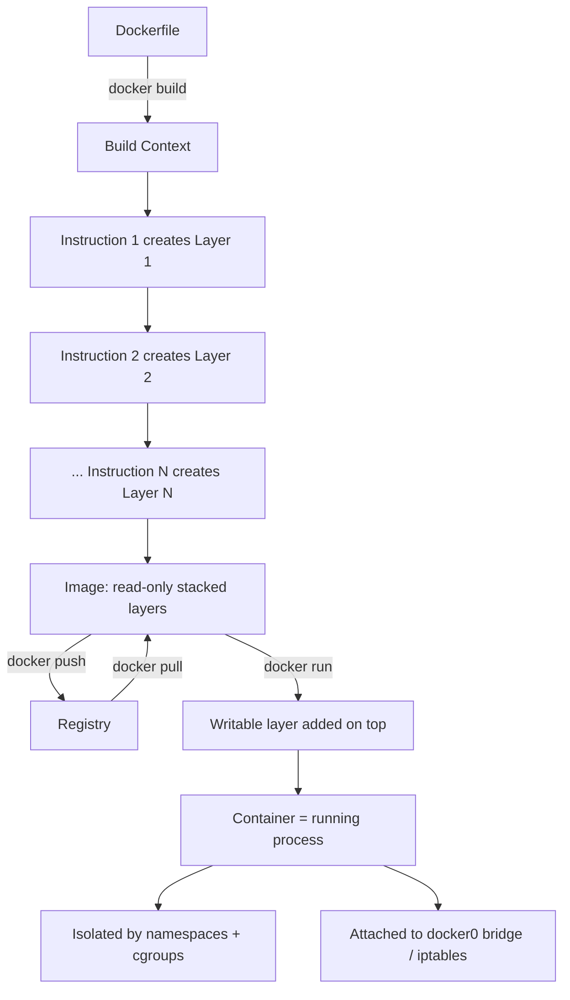
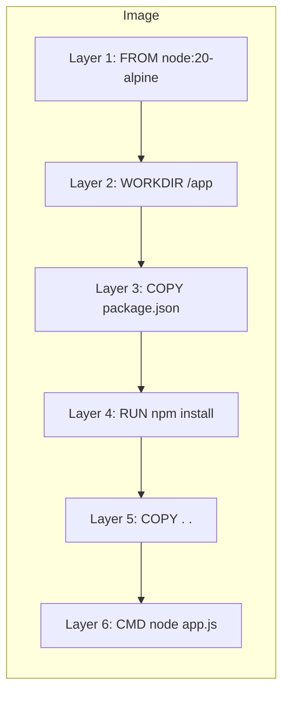
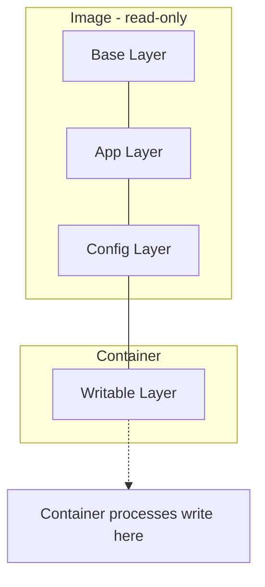
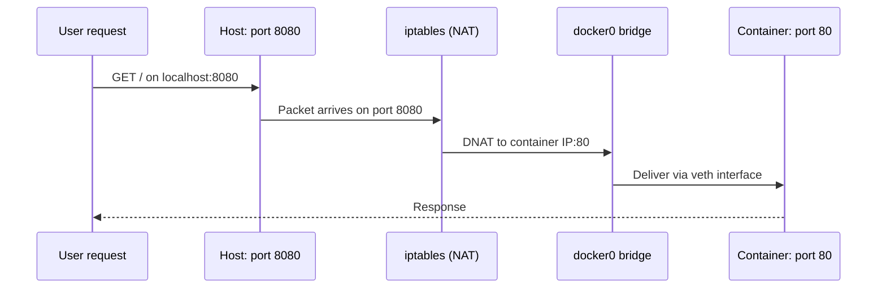

# How Docker Works Internally: Layers, Namespaces, and Networking Explained


If you have ever run `docker build`, `docker run`, or `docker push` without thinking too much about what happens underneath, you are not alone. Docker hides an enormous amount of machinery behind a few simple commands. Most developers understand *what* Docker does — it packages applications into containers — but far fewer understand *how* it actually does it.

That is exactly what this article covers. We will walk through Docker's internals step by step: how a `Dockerfile` becomes an image, how image layers are stacked using a union filesystem like OverlayFS, how a container becomes a running process isolated with Linux namespaces and cgroups, how networking reaches the container through the `docker0` bridge and `iptables`, how the Docker daemon and CLI communicate, and how volumes and content-based hashing make everything shareable and persistent.

## Table of Contents

- [The Big Picture: From Dockerfile to Running Container](#the-big-picture-from-dockerfile-to-running-container)
- [Inside docker build: The Build Context](#inside-docker-build-the-build-context)
- [Layers: The Foundation of Images](#layers-the-foundation-of-images)
- [OverlayFS: Stacking Layers into One Filesystem](#overlayfs-stacking-layers-into-one-filesystem)
- [docker run: Adding the Writable Layer](#docker-run-adding-the-writable-layer)
- [A Container Is Just a Process](#a-container-is-just-a-process)
- [Namespaces: Isolating the Process](#namespaces-isolating-the-process)
- [cgroups: Controlling Resource Usage](#cgroups-controlling-resource-usage)
- [Networking: veth, docker0, and iptables](#networking-veth-docker0-and-iptables)
- [The Docker Daemon and the REST API](#the-docker-daemon-and-the-rest-api)
- [Volumes: Persisting Data Beyond the Container](#volumes-persisting-data-beyond-the-container)
- [Content-Based Hashing: Reusable and Cacheable Layers](#content-based-hashing-reusable-and-cacheable-layers)
- [A Real-World Walkthrough](#a-real-world-walkthrough)
- [Conclusion](#conclusion)
- [Key Takeaways](#key-takeaways)
- [Frequently Asked Questions](#frequently-asked-questions)
- [Related Articles](#related-articles)

## The Big Picture: From Dockerfile to Running Container

Docker's core workflow is often summarized in three words: **build, ship, run**. Internally, each of these stages maps to a very specific piece of machinery:

1. **Build** — `docker build` reads your `Dockerfile` line by line and produces an image.
2. **Ship** — images are pushed to and pulled from a registry, layer by layer, so only what is missing is transferred.
3. **Run** — `docker run` turns an image into a container: a single, isolated process on your host.

The whole flow looks like this:



Each arrow in that diagram is powered by a specific internal component, and the rest of this article explains each one in detail.

## Inside docker build: The Build Context

Everything starts when you run `docker build`. Docker does two things immediately:

1. It reads the `Dockerfile` in your project **line by line**.
2. It treats your **current folder as the build context** — the set of files available to the build process.

```bash
docker build -t myapp:latest .
```

The `.` at the end is the build context. Docker packages that directory (minus anything excluded via a `.dockerignore` file) and sends it to the daemon so that instructions like `COPY` can reference files in it.

> **Note:** The build context can be large. Because it is bundled and sent to the Docker daemon on every build, it is good practice to keep the context small and use `.dockerignore` to exclude caches, logs, and other junk.

## Layers: The Foundation of Images

The most important idea in Docker's internals is the **layer**.

Each line in the `Dockerfile` creates a new image layer. Consider this example:

```dockerfile
FROM node:20-alpine
WORKDIR /app
COPY package.json .
RUN npm install
COPY . .
EXPOSE 3000
CMD ["node", "app.js"]
```

Each of those instructions produces one layer. The layers are saved as **compressed files inside Docker's storage** on the host.

Why does this matter? Layers are the reason Docker can:

- **Cache builds** — if a layer's inputs have not changed, Docker reuses the cached layer instead of rebuilding it.
- **Share storage** — many images that share a common base (like `node:20-alpine`) share those base layers locally.
- **Transfer efficiently** — pushing and pulling happens per layer, not per image.



## OverlayFS: Stacking Layers into One Filesystem

If an image is just a stack of layers, how does the container see one normal filesystem? The answer is a **union filesystem**, and the one Docker commonly uses is **OverlayFS**.

OverlayFS takes all the individual layers and **stacks them on top of each other** to form a single container filesystem. When a process inside the container reads `/etc/hostname`, or opens `/app/app.js`, the union filesystem resolves that path across the whole stack and returns the correct file — as if it were a plain directory.

```
Container filesystem view (unified)
┌─────────────────────────────────────┐
│  Layer N   (top of stack)           │
│  Layer ...                           │
│  Layer 3   RUN npm install          │
│  Layer 2   COPY package.json        │
│  Layer 1   FROM node:20-alpine      │  ← base layer
└─────────────────────────────────────┘
```

This stacking is what makes images so cheap to store and instantiate. A single base layer can be shared by hundreds of derived images, because each derived image only stores its own additional layers.

## docker run: Adding the Writable Layer

When you run `docker run`, Docker takes the image and **adds a writable layer on top**. This new layer is where your container does all its writing — installing files, creating logs, writing temp data.

```bash
docker run -d -p 8080:80 --name web myapp:latest
```

The image layers stay **read-only**. Only the thin writable layer on top accepts changes. This design gives you two huge benefits:

- The image is never modified, so it can be reused for thousands of containers without copying.
- Multiple containers from the same image each get their **own private writable layer**, so they never interfere with each other.



## A Container Is Just a Process

Here is the key insight that surprises most beginners: **a container is not a virtual machine**. There is no hypervisor, no guest operating system, and no heavy boot process.

A container is simply **a process on your machine** — usually one or a few processes started from the command defined in the image (like `CMD ["node", "app.js"]`). What makes it special is that it runs with its **own isolated environment**, created using two Linux kernel features:

- **Namespaces** — isolation of what the process can *see*.
- **cgroups** — control over what the process can *use*.

Because containers share the host kernel instead of running their own, they start in seconds and use far fewer resources than virtual machines.

## Namespaces: Isolating the Process

Namespaces give each container its own private view of the system. According to the source document, namespaces isolate:

- **Process IDs** — a container sees its own PID space (PID 1 inside, unrelated to the host).
- **Hostname** — each container can have its own hostname and domain name.
- **Network** — each container gets its own network stack, interfaces, and routing tables.
- **Mount points** — each container has its own filesystem layout.
- **Shared memory** — inter-process communication (IPC) resources are isolated per container.

| Namespace | What it isolates |
|-----------|------------------|
| PID       | Process IDs and the process tree |
| Network   | Network interfaces, stacks, ports |
| Mount     | Filesystem mount points |
| UTS       | Hostname and domain name |
| IPC       | Shared memory and inter-process communication |

## cgroups: Controlling Resource Usage

If namespaces answer *"what does the process see?"*, **cgroups** (control groups) answer *"how much can the process use?"*

Cgroups are the kernel mechanism that **controls CPU, RAM, and I/O usage** for each container. When you run a container, Docker places its processes into a dedicated cgroup, then applies the limits you requested.

```bash
docker run --cpus=0.5 --memory=512m myapp:latest
```

| Resource | Controlled by cgroups |
|----------|------------------------|
| CPU      | CPU shares and quotas |
| RAM      | Memory limits |
| I/O      | Block device I/O limits |

This is what stops a runaway container from exhausting the entire host — and it is also what lets you pack many containers onto one machine safely.


The diagram above shows how Docker and its execution backends (such as `libcontainer`) sit on top of the Linux kernel, using cgroups, namespaces, and related kernel features to provide isolation.

## Networking: veth, docker0, and iptables

A container is isolated, but it still needs to reach the outside world and receive traffic. Docker handles this in two steps.

### The Virtual Ethernet Interface

When a container starts, Docker gives it a **virtual Ethernet interface** (a `veth` pair). By default, one end of that interface is connected to the **`docker0` bridge** — a virtual switch that Docker creates on the host. All containers attached to `docker0` can talk to each other, and the bridge provides a path to the host's network.

### Port Mapping with iptables

If you use the `-p` flag, Docker sets up **iptables rules** to forward traffic. For example, `-p 8080:80`:

1. Docker binds host port `8080` to the container's port `80`.
2. Docker creates iptables rules in the NAT table.
3. When a packet arrives on the host at port `8080`, iptables rewrites its destination and forwards it to the container's IP on `docker0`.



The result: from the outside, your app simply appears to be running on port `8080` of the host.

## The Docker Daemon and the REST API

Two distinct components run Docker: the **daemon** and the **CLI**.

The Docker daemon, called **`dockerd`**, runs in the background on your host. It is the engine that actually does the work: handling builds, managing containers, images, volumes, and networks.

The **Docker CLI** (`docker`) is only a client. It does not build images or run containers itself — it sends commands to the daemon using a **REST API** over a **Unix socket** or **TCP**.

```bash
# The CLI talks to dockerd over a Unix socket by default
docker ps
```

This client-server split is why you can run Docker commands on your machine while the daemon runs elsewhere (for example, on a remote server) just by changing the endpoint the CLI connects to.

> **Caution:** Anyone with access to the Docker daemon effectively has root access to the host. Never expose the daemon's TCP socket to untrusted networks — it is a well-known way to get your machine compromised.

## Volumes: Persisting Data Beyond the Container

Because container writes go into the writable layer, they are **temporary**. If you delete the container, the changes are gone — unless you saved them to a volume or an image.

**Volumes** solve the persistence problem. They live **outside the container layer** and are stored on the host in `/var/lib/docker/volumes`. Because they are independent of the container's lifecycle, they **survive container restarts** — and even container deletion.

```bash
# Create a volume and mount it into a container
docker volume create mydata
docker run -v mydata:/data myapp:latest
```

This is how you persist databases, user uploads, logs, and any other data that must outlive a container. When a new container starts from the same image, it simply mounts the volume again and picks up right where the old one left off.

## Content-Based Hashing: Reusable and Cacheable Layers

The final piece of the puzzle is how Docker identifies and shares layers.

Docker uses **content-based hashes for layers**. Each layer's content is hashed, and that hash is used as the layer's identity. This has three powerful consequences:

1. **Reusable** — if two images contain a byte-identical layer, that layer is stored once and shared.
2. **Cacheable** — during `docker build`, if the current instruction's inputs produce the same hash as a cached layer, Docker skips the work.
3. **Easy to share** — registries and clients refer to layers by hash, so integrity is guaranteed.

### Only What Is Missing Gets Uploaded

This hashing also makes `docker push` efficient. When you push an image, Docker **checks which layers are already in the registry** and only uploads what is missing.

If your new image only changed one line of source code, the rebuilt layer — and only that layer — is pushed. Everything else is reused from the registry.


## A Real-World Walkthrough

Let's put all of this together with a concrete example. Suppose you have a small Node.js application:

```bash
myapp/
├── Dockerfile
├── package.json
└── app.js
```

**Step 1 — Build.** You run `docker build -t myuser/myapp:1.0 .`. The daemon reads the `Dockerfile` line by line, treats the current folder as the build context, and creates one layer per instruction. Each layer is stored as a compressed file in Docker's storage, and the layers are joined into a single filesystem using OverlayFS.

**Step 2 — Push.** You run `docker push myuser/myapp:1.0`. Docker computes content hashes for all layers and asks the registry which ones already exist. If a previous version of your app shared the base and dependency layers, only the changed layers are uploaded.

**Step 3 — Run.** You run `docker run -d -p 8080:3000 myuser/myapp:1.0`. The daemon adds a writable layer on top of the image, creates namespaces to isolate the container's PIDs, network, mount points, hostname, and IPC, applies cgroups limits for CPU, RAM, and I/O, and attaches a virtual Ethernet interface to the `docker0` bridge. The `-p 8080:3000` flag triggers iptables rules that forward traffic from host port `8080` to the container's port `3000`.

**Step 4 — Persist.** If your app writes to `/data`, you mount a volume so the data survives restarts:

```bash
docker run -d -p 8080:3000 -v mydata:/data myuser/myapp:1.0
```

Deleting the container later removes the writable layer, but `mydata` in `/var/lib/docker/volumes` remains intact.

## Conclusion

Underneath the friendly `docker` command lies a well-designed stack of Linux kernel features:

- **`docker build`** reads your `Dockerfile` line by line and produces image layers stored as compressed files.
- **OverlayFS** stacks those layers into a single container filesystem.
- **`docker run`** adds a writable layer, and the container runs as an ordinary process — isolated by **namespaces** and limited by **cgroups**.
- **Virtual Ethernet + `docker0` + iptables** connect the container to the network and forward published ports.
- **`dockerd`** orchestrates everything, while the **CLI** talks to it over a REST API on a Unix socket or TCP.
- **Volumes** persist data outside the container lifecycle, and **content-based hashing** makes layers reusable, cacheable, and cheap to push.

Once you understand these pieces, Docker stops feeling like magic and becomes a set of familiar, predictable mechanisms you can reason about — which is exactly what you need when debugging builds, diagnosing networking issues, or designing efficient CI/CD pipelines.

## Key Takeaways

- A container is not a virtual machine — it is a **process** running with an isolated environment on the host kernel.
- Each `Dockerfile` instruction creates an **image layer**, stored as a compressed file in Docker's storage.
- **OverlayFS**, a union filesystem, stacks all layers into one unified container filesystem.
- **`docker run`** adds a writable layer on top of the read-only image; container writes are temporary by default.
- **Namespaces** isolate what a container sees (PIDs, hostname, network, mounts, IPC), while **cgroups** control what it can use (CPU, RAM, I/O).
- Networking works through a **virtual Ethernet interface**, the **`docker0` bridge**, and **iptables** rules for `-p` port mapping.

## Frequently Asked Questions

**Q1: Is a Docker container a lightweight virtual machine?**

No. A container is a regular process on your host that is isolated with Linux namespaces and cgroups. Unlike a VM, it shares the host kernel and has no guest operating system, which is why it starts in seconds and uses minimal resources.

**Q2: Why does each line in a Dockerfile create a layer?**

Layers are the unit of reuse and caching. Storing each instruction as a separate layer means unchanged layers can be cached during builds, shared across images, and skipped during pushes — only what actually changed gets rebuilt or transferred.

**Q3: What happens to data written inside a running container when I delete it?**

It is lost. Changes are written to the temporary writable layer on top of the image, so deleting the container destroys them unless the data was written to a volume (stored under `/var/lib/docker/volumes`) or committed to an image.

**Q4: How does `docker run -p 8080:80` forward traffic to the container?**

Docker sets up iptables NAT rules that rewrite packets arriving on host port `8080` and forward them to the container's port `80` through the `docker0` bridge and the container's virtual Ethernet interface.

**Q5: Why does pushing an image upload so little data?**

Docker identifies each layer by a content-based hash. When pushing, it queries the registry to see which layer hashes already exist and only uploads the layers that are missing, so unchanged layers are reused instead of re-uploaded.

## Related Articles

- [A Beginner's Guide to Docker: Images, Containers, and Registries](#)
- [Mastering Dockerfile Best Practices for Smaller, Faster Builds](#)
- [Container Networking Explained: From bridge Networks to Port Mapping](#)
