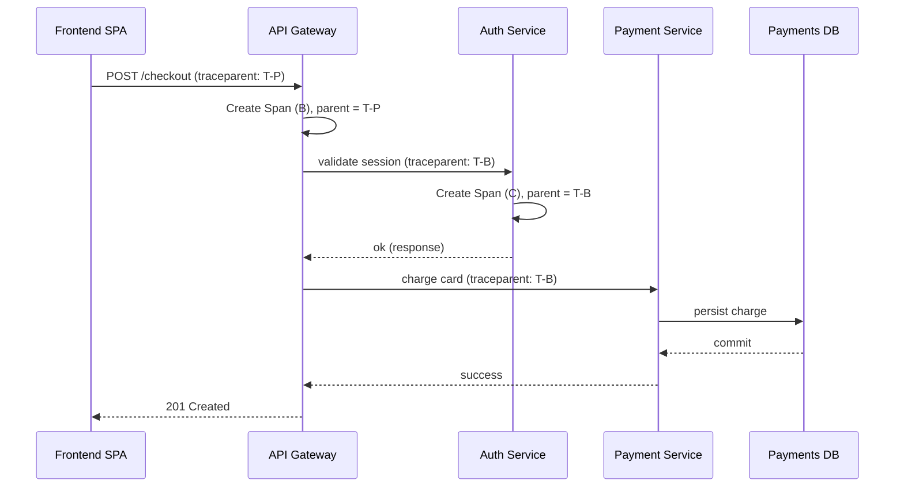

# OpenTelemetry in DevOps: Unified Traces, Metrics, and Logs for Modern Observability

Every year, the surface area of a production system grows: more services, more cloud providers, more serverless functions, more queues, more databases. Along the way, most teams end up stitching together monitoring from two or three fragmented tools, each with its own agent, its own data model, and its own dashboard. The result is context switching, vendor lock-in, and painful `trace id` ↔ `log line` correlation when an incident hits at 2 a.m.

OpenTelemetry (often shortened to "OTel") is the industry answer to this fragmentation. It is a set of open-source APIs, SDKs, tooling, and a collection protocol that lets you generate, collect, and export telemetry data — traces, metrics, and logs — in a single, vendor-neutral format. This article walks through what OpenTelemetry actually is, how its components fit together, and how a DevOps team can adopt it without rewriting their entire stack.

## Table of Contents

- [Why Observability Needs a Standard](#why-observability-needs-a-standard)
- [The Signals: Traces, Metrics, Logs, and Baggage](#the-signals-traces-metrics-logs-and-baggage)
- [Anatomy of an OpenTelemetry Deployment](#anatomy-of-an-opentelemetry-deployment)
- [How Context Propagation Works](#how-context-propagation-works)
- [The Collector: Take It All In, Send It Where You Want](#the-collector-take-it-all-in-send-it-where-you-want)
- [A Real-World Example: Instrumenting a Checkout Service](#a-real-world-example-instrumenting-a-checkout-service)
- [Sampling: Keeping Telemetry Affordable](#sampling-keeping-telemetry-affordable)
- [Best Practices and Common Pitfalls](#best-practices-and-common-pitfalls)
- [Key Takeaways](#key-takeaways)
- [Frequently Asked Questions](#frequently-asked-questions)
- [Related Articles](#related-articles)

## Why Observability Needs a Standard

Before OpenTelemetry, the observability ecosystem was a tower of Babel. Zipkin had its trace format, Jaeger had another, Prometheus exposed a metrics wire format, ELK and Loki argued about logs, and every commercial vendor pushed a proprietary agent you were expected to scatter across your fleet.

That model breaks down the moment you run a distributed system. A single user request can fan out to dozens of services on different runtimes — Java here, Python there, a Lambda function in the middle — and if each runtime ships telemetry in a different dialect, correlating that request across hops becomes detective work.

OpenTelemetry addresses this by standardizing three things:

1. **APIs and SDKs** per language, so your code emits telemetry the same way regardless of vendor.
2. **Semantic conventions**, so field names mean the same thing everywhere (`http.request.method`, `db.system`, `service.name`).
3. **OTLP**, the OpenTelemetry Protocol, a unified transport for traces, metrics, and logs.

Because the output is vendor-neutral, you can **export to any backend** — a self-hosted Jaeger, a Prometheus-compatible store, or a commercial SaaS product — and switch later without re-instrumenting your code. That single decision, de-coupling instrumentation from backend, is what makes OpenTelemetry such a high-leverage DevOps choice.

## The Signals: Traces, Metrics, Logs, and Baggage

Teams often talk about "signals" as if they were interchangeable, but each one answers a different question:

| Signal | Question it answers | Example |
| --- | --- | --- |
| **Trace** | *Where does the request go, and how slow is each hop?* | A checkout request spans auth, inventory, and payment microservices |
| **Metric** | *What is happening over time, aggregated?* | Request rate, p99 latency, error rate, CPU utilization |
| **Log** | *What happened in a specific moment?* | A stack trace, a DB connection warning, an auth failure reason |
| **Baggage** | *What context should travel with the request?* | A user ID or tenant name added to every downstream span via span attributes |
| **Profiling** (experimental) | *Where is CPU/wall time actually spent?* | Flame graphs for a hot code path |

The key insight of OpenTelemetry is **correlation**. A trace's `trace_id` and `span_id` can be injected into log records, so you can start from a dashboard alert, jump to the exact trace, and then find the matching log lines — a workflow that was previously a manual slog across tools.

Semantic conventions matter here too. Instead of inventing `latency_ms`, `elapsed`, or `duration` depending on which developer wrote the instrumentation, OTel defines canonical names. This is a quiet but enormous win: it makes queries, dashboards, and alerting rules portable across teams and services.

## Anatomy of an OpenTelemetry Deployment

An OpenTelemetry setup has a small number of moving parts:

```text
Application code → Auto/Manual instrumentation → SDK (spans, metrics, logs)
                                                            ↓
                                                    OTLP exporter
                                                            ↓
                                          Collector daemon (optional)
                                             │        │        │
                                             ↓        ↓        ↓
                                     Tracing backend  Metrics    Log store
```

The pieces:

- **API** — a set of stable, vendor-agnostic interfaces your code calls (creating spans, recording metrics, emitting logs).
- **SDK** — the implementation behind the API that builds the actual telemetry, applies sampling, and hands data to exporters. You can disable or replace parts of it at runtime.
- **Instrumentation libraries** — pre-built hooks for popular frameworks (HTTP servers, gRPC, SQL clients, message queues). They wire into your app **without you writing tracing code**.
- **Zero-code (auto) instrumentation** — for many languages you never touch your source files: you add a runtime agent (Java via `-javaagent`, Node via `NODE_OPTIONS`, Python via a distro) and telemetry starts flowing.
- **Exporters** — SDKs ship with OTLP exporters plus backends for Jaeger, Zipkin, Prometheus, and more.
- **The Collector** — an optional daemon that receives telemetry, processes it, and forwards it to one or more backends.

## How Context Propagation Works

Tracing only delivers value when a single request can be followed across process boundaries. OpenTelemetry borrows the standard technique from distributed tracing: each span carries a **context** — headers containing the parent trace and span IDs.

The most common wire format is the **W3C Trace Context** (`traceparent` header), which lets OTel interoperate with other trace tools that honor the same standard. On the way in, a service reads the header, creates a child span linked to the incoming parent span, and on the way out injects its own context into the next request.



Because the context is propagated via standard headers, every hop in the chain lands under the same `trace_id`, and the tracing backend can render the whole request as one waterfall.

## The Collector: Take It All In, Send It Where You Want

For a single service you can point exporters straight at a backend. As your fleet grows, you almost always want the **OpenTelemetry Collector** in the middle. It runs as a daemon (typically a sidecar or a dedicated pool of pods) and operates as a pipeline of three stages:

1. **Receivers** — ingest telemetry. `otlp`, `jaeger`, `zipkin`, `prometheus`, `filelog`, and many others.
2. **Processors** — transform and enrich the data. Normalize attributes, filter noisy signals, add cluster metadata (unit tests worth automating), batch before export, and sample.
3. **Exporters** — deliver the polished output to backends: OTLP, Jaeger, Prometheus, or any of the dozens of vendor endpoints.

```mermaid
flowchart LR
    A[App 1 - service A] -->|OTLP/gRPC| R1[Receiver: otlp]
    B[App 2 - service B] -->|OTLP/HTTP| R1
    C[Prometheus scrapes] --> R2[Receiver: prometheus]
    Logs from files --> R3[Receiver: filelog]
    R1 --> P[Processor: batch/resource/filter]
    R2 --> P
    R3 --> P
    P --> E1[Exporter: OTLP -> tracing backend]
    P --> E2[Exporter: Prometheus remote write]
    P --> E3[Exporter: Elasticsearch]
```

A minimal Collector configuration file looks like this:

```yaml
receivers:
  otlp:
    protocols:
      grpc:
      http:

processors:
  batch:

exporters:
  otlp/traces:
    endpoint: "jaeger-collector:4317"
    tls:
      insecure: true
  prometheusremotewrite:
    endpoint: "http://prometheus:9090/api/v1/write"

service:
  pipelines:
    traces:
      receivers: [otlp]
      processors: [batch]
      exporters: [otlp/traces]
    metrics:
      receivers: [otlp]
      processors: [batch]
      exporters: [prometheusremotewrite]
```

The Collector is powerful because it is **the single choke point** for policy. You can strip sensitive attributes team-wide, add a consistent `cluster`/`environment` resource to everything, and buffer and retry exports — all without touching application code.

> **Caution:** The Collector is not a database. It is a processing layer with buffers. Under sustained back-end outages you can still lose telemetry if the queue fills and the disk for the file-queue fills too. Size your queue, monitor the Collector itself, and never treat it as a long-term data store.

## A Real-World Example: Instrumenting a Checkout Service

Let's put it together with a concrete scenario: a team in charge of a payment-backed checkout API. They want end-to-end tracing and a few key metrics, and they want output that works with whatever backend they settle on later.

### Step 1 — Add auto-instrumentation

For the Python FastAPI service, the quickest path is the bootstrap-with-auto method, which pulls in the appropriate instrumentation libraries:

```bash
pip install opentelemetry-distro opentelemetry-exporter-otlp-proto-http
opentelemetry-bootstrap -a install
```

Then launch the service with the tool configured via environment variables:

```bash
OTEL_SERVICE_NAME=checkout-service \
OTEL_EXPORTER_OTLP_ENDPOINT=http://otel-collector:4318 \
OTEL_METRICS_EXPORT_INTERVAL=30000 \
python app/main.py
```

No source code changes are required for the happy path: HTTP calls, the SQLAlchemy database driver, and outbound requests are instrumented automatically.

### Step 2 — Add manual spans for business logic

Auto-instrumentation knows about frameworks, not business intent. For example a manual span gives a distinct, semantic name for the charge step:

```python
import opentelemetry.trace as trace

tracer = trace.get_tracer("checkout")

def charge_card(card, amount):
    with tracer.start_as_current_span("payment.charge") as span:
        span.set_attribute("payment.method", card["method"])
        span.set_attribute("payment.amount", amount)
        status = gateway.charge(card, amount)
        if not status.ok:
            span.set_status(trace.Status(trace.StatusCode.ERROR))
            span.record_exception(status.error)
        return status
```

### Step 3 — Correlate logs with traces

In the same handler, emit a log record that carries the active span context. With the Python logging integration, `trace_id` and `span_id` are added automatically when a span is active:

```python
import logging

logging.basicConfig(level=logging.INFO)
log = logging.getLogger("checkout")

def handler(request):
    with tracer.start_as_current_span("checkout.handle"):
        log.warning("payment retry required: %s", request.get("txn_id"))
```

The resulting log line contains the `trace_id`, so a support engineer can jump from the log directly into the distributed trace.

### Step 4 — Deploy the Collector alongside

In Kubernetes, add the Collector as a DaemonSet (one pod per node) or a lightweight sidecar. The application's OTLP exporter points at `http://otel-collector:4318`, and the Collector forwards to the team's tracing and metrics backends. Because the app only knows about OTLP, swapping vendors later means editing one Collector config, not redeploying services.

## Sampling: Keeping Telemetry Affordable

Not every request deserves a full trace. At high traffic, storing 100% of traces is expensive and noisy. The two main strategies are:

- **Head sampling** — decide *before* the decision to keep is fully known, at the first span of the request (e.g., keep 10% of all traces). Simple and cheap, but you may drop the very trace you later need because the decision was made up front.
- **Tail sampling** — collect everything and decide *after* spans arrive, based on criteria such as "keep every trace that has a `span.status == ERROR` or contains a slow span." Far more useful for debugging, but only practical if you route spans to a central Collector that can see the whole trace.

A typical rule set for the Collector's `tail_sampling` processor:

```yaml
processors:
  tail_sampling:
    decision_wait: 10s
    policies:
      - name: keep-errors
        type: status_code
        status_code:
          status_codes: [ERROR]
      - name: keep-slow
        type: latency
        latency:
          threshold_ms: 500
```

> **Caution:** Tail sampling means the decision point moves to the Collector, so *all* spans for a trace must arrive at the same Collector instance (or an identically-configured pool). If spans are load-balanced randomly to different Collectors, each one sees only fragments and the sampling decision becomes wrong. Pin traces per instance or accept the tradeoff.

## Best Practices and Common Pitfalls

A few lessons that teams consistently learn the hard way:

- **Set a service name on everything.** `OTEL_SERVICE_NAME` must be unique per deployable. Without it, traces from different apps merge into one anonymous blob.
- **Know where your SDK sends data.** Before wiring the Collector, verify with `OTEL_EXPORTER_OTLP_ENDPOINT` that traffic arrives (the Collector exposes its own `/metrics` for this exact purpose).
- **Don't scatter direct vendor exporters.** If every service exports straight to a proprietary agent, you've re-created the lock-in problem OTel was meant to solve. Prefer OTLP → Collector → backend.
- **Keep cardinality in check.** Attributes with unbounded values (like a raw customer ID on metrics) can explode the number of time series and destroy your metrics backend. Use attributes on spans, not labels on metrics.
- **Upgrade the SDKs on a schedule.** The OTel spec is evolving toward stability; silently running year-old SDKs means your otel pipeline behavior and your mental model drift apart.
- **Instrument net-new services early.** Auto-instrumentation costs minutes at startup and pays dividends the moment an incident style your new service later.
- **Monitor the Collector.** If the collector is down, your telemetry is silently dropping. Alert on its exporter failure rate and queue depth.

## Key Takeaways

- OpenTelemetry standardizes traces, metrics, and logs behind one API, one set of semantic conventions, and the OTLP transport — ending vendor lock-in for how telemetry is produced.
- The four pillars — traces, metrics, logs, and baggage — stay distinct but link together through shared `trace_id` correlation.
- The Collector is the single policy engine for filtering, enriching, batching, and routing telemetry, and it should be preferred over per-service vendor exporters.
- Zero-code and auto-instrumentation let you add distributed tracing without rewriting your application source.
- Sampling (head and tail) is how you keep telemetry affordable at production scale; just understand where the decision is made.
- Adopt it early for net-new services and pin `service.name` everywhere, or your traces will be unreadable before you even start exploring.

## Frequently Asked Questions

**What is the difference between OpenTelemetry and Prometheus?**
Prometheus specializes in metrics: it scrapes, stores, and queries time series, and it has become the de facto metrics backend for Kubernetes. OpenTelemetry is a broader standard that also covers logs and traces, and it can *export* metrics to a Prometheus-compatible backend. You can use OpenTelemetry for instrumentation and Prometheus (or remote-write storage such as VictoriaMetrics or Thanos) for the metrics store.

**Do I need to rewrite my application to adopt OpenTelemetry?**
No. For most mainstream languages and frameworks, auto-instrumentation agents add telemetry with configuration only — no code changes. You add manual instrumentation later for business-specific spans and attributes.

**Which languages are supported?**
The most mature implementations are Go, Java, Python, Node.js, .NET, and C++ (via OpenTelemetry C++), with JavaScript for browsers and others at earlier stability stages. Compatibility status per language is tracked in the OpenTelemetry repository.

**Can I use OpenTelemetry and keep my existing vendor?**
Yes. Most major monitoring vendors accept OTLP or provide OTLP endpoints, so instrumentation stays intact if you switch backends. The Collector also has exporters for Jaeger, Zipkin, Prometheus, and many commercial platforms.

**Is OpenTelemetry a CNCF project, and is it free?**
Yes. It graduated into a CNCF incubating project and remains fully open source. Note that a free standard does not remove running cost — the Collector takes hardware, and the storage backend you feed is still your responsibility.

## Related Articles

- [Mastering Observability with Prometheus and Grafana: From Metrics to Actionable Insights](#)
- [Building an End-to-End CI/CD DevOps Pipeline with Kubernetes and Jenkins](#)
- [The Comprehensive Guide to DevOps: Principles, Practices, and Tools](#)
