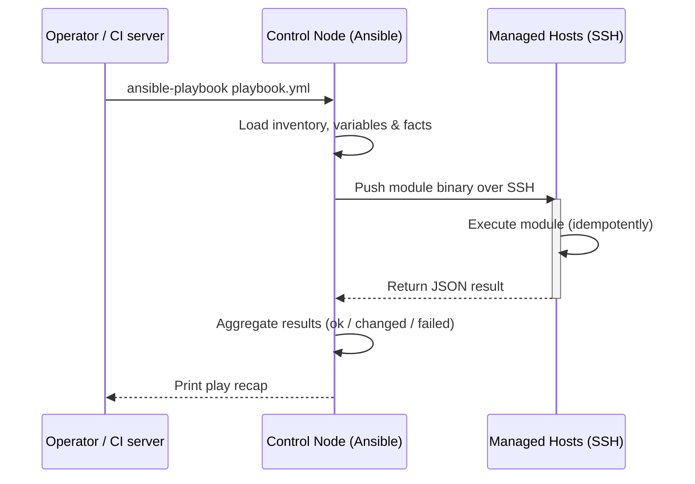
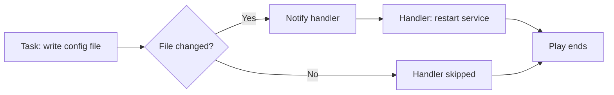

# Ansible for DevOps Engineers: A Complete Guide to Agentless Automation, Playbooks and Best Practices


"Automate everything. Simplify operations."

That is the promise behind Ansible — and for DevOps engineers and SREs, that promise has made it one of the most widely used automation tools in the industry. Whether you are provisioning servers, deploying applications, managing configuration drift, or orchestrating multi-server workflows, Ansible gives you a simple, secure, and agentless way to bring order to your infrastructure.

This article is a practical, concepts-first walkthrough built from a set of handwritten Ansible study notes for DevOps engineers. It covers what Ansible is, its core features, architecture, components, inventory, ad-hoc commands, playbooks, variables, handlers, tags, dry-run checking, facts, and best practices — everything you need to start automating your environment with confidence.

## Table of Contents

- [What is Ansible?](#what-is-ansible)
- [Core Features of Ansible](#core-features-of-ansible)
- [Ansible Architecture](#ansible-architecture)
- [Ansible Components](#ansible-components)
- [Inventory: Your List of Hosts](#inventory-your-list-of-hosts)
- [Ad-hoc Commands: Quick Actions Without Playbooks](#ad-hoc-commands-quick-actions-without-playbooks)
- [Playbook Basics](#playbook-basics)
- [Variables and Conditions](#variables-and-conditions)
- [Handlers: Run Only When Notified](#handlers-run-only-when-notified)
- [Tags: Run Specific Tasks](#tags-run-specific-tasks)
- [Dry Run and Syntax Checks](#dry-run-and-syntax-checks)
- [Gathering Facts](#gathering-facts)
- [Best Practices](#best-practices)
- [A Real-World End-to-End Example](#a-real-world-end-to-end-example)
- [Key Takeaways](#key-takeaways)
- [Frequently Asked Questions](#frequently-asked-questions)

## What is Ansible?

Ansible is an open-source automation tool used for **configuration management**, **application deployment**, **task automation**, and **orchestration**. If you have ever needed to install the same packages on hundreds of servers, roll out a new version of your application across a fleet, or uniformly change system settings, Ansible is built to make that repeatable and safe.

What makes Ansible different from many of its peers?

- **Agentless:** Ansible connects to managed nodes over **SSH**, so there is no need to install and maintain a dedicated agent on every machine.
- **Simple:** It is written in **Python** and uses **YAML** for its playbooks — a human-readable format that is easy to learn, review, and share.
- **Secure:** Connectivity relies on SSH, which means you leverage an existing, battle-tested authentication and encryption layer.
- **Ready to use:** With an agentless architecture, you can start automating almost immediately — your existing SSH access to a host is usually all you need.


At its heart, Ansible makes automation simple while remaining powerful enough for serious production workloads used every day by DevOps and SRE teams.

## Core Features of Ansible

The study notes highlight five core traits that make Ansible the go-to choice for automation:

1. **Simple YAML-based language** — Playbooks are written in YAML, which reads almost like plain English. This lowers the barrier to entry and makes automation reviewable even by people who do not code daily.
2. **Agentless architecture** — Since Ansible pushes commands over SSH, managed nodes stay lightweight and there is no extra daemon to patch, secure, or monitor.
3. **Idempotent** — Ansible modules are built to be run safely multiple times. If a package is already installed or a service is already running, running the playbook again produces no change. This makes automation repeatable without fear of breaking systems.
4. **Large community** — An extensive ecosystem of community modules, plugins, roles, and documentation means you rarely have to start from scratch. A module almost certainly already exists for the technology you manage.
5. **Extensible** — If the built-in library is not enough, you can write **custom modules and plugins** to tailor Ansible to your own workflows.

> **Important:** Idempotence is one of the most valuable properties of a good automation tool. It means your playbooks converge to the desired state — running the same playbook a hundred times yields the same result as running it once.

## Ansible Architecture

Ansible follows a **push-based, controller-to-node** model. One machine — the **control node** — runs Ansible and connects out to the hosts it manages. There is no messaging bus to maintain and no permanent agent process on the managed hosts; the control node pushes modules over SSH and waits for the results.



The flow illustrated above reflects the notes' architecture diagram:

1. The operator (or a CI/CD pipeline) invokes Ansible.
2. The control node reads the **inventory** and any **variables**.
3. Over SSH, Ansible pushes the required **module** to each managed host.
4. The module executes on the host and returns a structured result.
5. The control node aggregates the results and reports them in the play recap.

Because everything is driven from a single control node, Ansible offers a simple mental model: *write once, run against many hosts, get consistent output.*

## Ansible Components

Mastering Ansible means understanding its building blocks. The notes define the six components you will use constantly:

| Component | What it is |
|-----------|-----------|
| **Inventory** | A list of hosts and groups that Ansible manages. |
| **Modules** | Reusable units of code that perform tasks (e.g., install a package, copy a file, restart a service). |
| **Playbooks** | YAML files containing the tasks, variables, and configuration that drive automation. |
| **Roles** | A way to organize playbooks, files, templates, handlers, and variables into reusable, shareable units. |
| **Plugins** | Extend Ansible functionality — connection, action, callback, and other plugin types. |
| **Facts** | Information gathered about managed hosts, such as OS family, IP addresses, and available memory. |

These components work together elegantly: the **inventory** tells Ansible *which hosts* to touch, **playbooks** define *what to do*, **modules** perform *the actual work*, **plugins** extend *how things connect and behave*, **facts** give you *context about each host*, and **roles** keep everything *organized and reusable*.

## Inventory: Your List of Hosts

The **inventory** is the source of truth for the servers Ansible manages. It can be a simple INI-style file, a YAML file, or a dynamic inventory generated from a cloud provider (for example, from AWS, Azure, or GCP).

A basic INI inventory groups hosts like this:

```ini
[webservers]
web1.example.com
web2.example.com
```

Groups can also include variables and even IP ranges:

```ini
[appservers]
192.168.4.[10:20]
```

With the range syntax above, Ansible expands `[10:20]` into the hosts `192.168.4.10` through `192.168.4.20` — a quick way to manage a whole subnet without typing every IP.

**An inventory typically contains:**

- **Hosts** — the individual machines (hostnames or IP addresses).
- **Groups** — logical collections of hosts (e.g., `webservers`, `dbservers`).
- **Variables** — host-specific or group-specific settings that your playbooks consume.

> **Note:** Good inventory design — meaningful groups, clear naming, separated variables — is the foundation of maintainable automation. A messy inventory makes even the best playbooks confusing.

## Ad-hoc Commands: Quick Actions Without Playbooks

Not every automation task deserves a full playbook. For one-off checks and quick actions, Ansible provides **ad-hoc commands** — single tasks executed directly from the command line without writing any YAML.

The notes demonstrate several everyday examples:

```bash
# Test SSH connectivity to all hosts in the inventory
ansible all -m ping

# Run an arbitrary command and show the output
ansible all -m command -a "uptime"

# Work against a single specific host
ansible host 192.168.4.20 -m ping

# Install a package with the package manager
ansible all -m yum -a "name=nginx state=present"
```

Here is the general syntax to remember:

```text
ansible <pattern> -m <module> -a "<module arguments>"
```

- The **pattern** tells Ansible which hosts to target — `all`, a group name like `webservers`, or a single host.
- The **module** (`-m`) is the action to perform — `ping`, `command`, `copy`, `yum`, `apt`, `service`, and so on.
- The **arguments** (`-a`) are the module-specific parameters, such as `"ncname=nginx state=present"`.

Ways ad-hoc commands are commonly used:

- Checking connectivity (`ansible all -m ping`) before a maintenance window.
- Looking at system state (`ansible all -m command -a "uptime"`).
- Pushing a file to many servers with the `copy` module.
- Installing or removing packages in a hurry.

Ad-hoc mode is perfect when you need *speed over reuse* — but once a task becomes something you repeat, it belongs in a playbook.

## Playbook Basics

A **playbook** is Ansible's way of codifying automation as a repeatable, version-controlled file. Playbooks are written in **YAML**, so they are readable from the moment you open one.

Key ideas:

- A playbook contains **one or more plays**.
- Each **play** runs against a **set of hosts** (selected from the inventory).
- Each play contains a list of **tasks**.
- Tasks run **in order, top to bottom**, on every host in the play.

The notes share a classic example — installing and starting Nginx:

```yaml
- name: Install and start Nginx
  hosts: webservers
  become: true
  tasks:
    - name: Install Nginx
      yum:
        name: nginx
        state: present

    - name: Start Nginx Service
      service:
        name: nginx
        state: started
        enabled: yes
```

Let's break down what happens here:

1. `hosts: webservers` — this play targets the `webservers` group from the inventory.
2. `become: true` — the tasks run with elevated privileges (sudo), which is usually required to install packages and manage services.
3. The first task uses the `yum` module to ensure Nginx is **present**.
4. The second task uses the `service` module to make sure Nginx is **started** and **enabled** on boot.

Because each task declares a *desired state* (`present`, `started`, `enabled`), the same playbook is safe to run over and over — a perfect illustration of idempotence in action.

## Variables and Conditions

Good playbooks are rarely hard-coded. **Variables** allow the same playbook to behave differently on different hosts, environments, or projects.

The notes capture a typical example where a service is started with a port that comes from a variable:

```yaml
- name: Start application
  command: /opt/app -port {{ app_port }}
```

Here `{{ app_port }}` is a **Jinja2 template expression**. When Ansible runs the task, it replaces `{{ app_port }}` with the variable's actual value — from the inventory, from a playbook `vars` block, from group/host variables, or from another source.

Variables can be defined in several places:

- **Inline in the playbook** under a `vars:` section.
- **In the inventory** as host or group variables.
- **In separate files** that the playbook includes.
- **Passed on the command line** with `--extra-vars` for win-time overrides.

The notes also raise the important question: *how do you run a task only when a condition is true?* The answer is the `when` keyword. Conditions let you skip tasks that do not apply to a given host — for example, only restart a service when the operating system matches a certain distribution, or only apply a change when a variable has an expected value:

```yaml
- name: Apply config only on the app tier
  template:
    src: app.conf.j2
    dest: /etc/app/app.conf
  when: inventory_hostname in groups['appservers']
```

Combining variables and conditions turns static playbooks into smart, environment-aware automation.

## Handlers: Run Only When Notified

**Handlers** are a specialized kind of task. Unlike regular tasks, handlers **run only when notified by another task** — and, crucially, they run **once**, at the end of the play.

The classic use case is restarting a service after its configuration file changes. You do not want to restart Nginx on every playbook run; you only want to restart it *when the config actually changed*.

```yaml
- name: Configure Nginx
  hosts: webservers
  become: true
  tasks:
    - name: Ensure Nginx config is correct
      template:
        src: nginx.conf.j2
        dest: /etc/nginx/nginx.conf
      notify: Restart Nginx

  handlers:
    - name: Restart Nginx
      service:
        name: nginx
        state: restarted
```

How it works:

1. The `template` task writes the config file.
2. If the file changed, the task **notifies** the `Restart Nginx` handler.
3. At the end of the play, the notified handler runs the service restart.
4. If nothing changed, the handler is **not notified** and never executes.



Handlers give you **trigger-based behavior**: act on *change*, not on *every run*. They keep playbooks efficient, idempotent, and safe.

## Tags: Run Specific Tasks

As playbooks grow, you will not always want to run them from start to finish. **Tags** let you mark tasks so you can execute only the relevant subset.

Tag a task with a simple label:

```yaml
- name: Install Nginx
  yum:
    name: nginx
    state: present
  tags: nginx
```

Then run only the tasks carrying that tag:

```bash
ansible-playbook playbook.yml --tags nginx
```

This is hugely useful when a playbook handles several concerns — for example, tagging **install**, **configure**, and **security** tasks separately so you can run the *security* pass without touching the rest. Tags are also a great way to speed up iteration during development: run only the section you are currently working on.

## Dry Run and Syntax Checks

Safety first. Before you point automation at production servers, Ansible gives you two lightweight verification tools.

**Syntax check** — validates that the playbook parses correctly, without executing anything:

```bash
ansible-playbook playbook.yml --syntax-check
```

**Dry run / check mode** — executes the playbook in a "check mode" that reports what *would* change, without actually making any changes:

```bash
ansible-playbook playbook.yml --check
```

In check mode, Ansible predicts every `changed` result so you can review the impact of a playbook before it touches real infrastructure. Combined with the **best practice of testing in a lower environment first**, these flags become your first line of defense against broken production changes.

## Gathering Facts

Ansible can collect detailed information about each managed host — known as **facts** — and automatically uses them to make decisions inside playbooks.

To see all facts for a host, the notes point to the `setup` module:

```bash
ansible all -m setup
```

Facts include things like:

- Operating system family and distribution.
- Architecture and available memory.
- IP addresses and network interfaces.
- Hostname, disk space, and much more.

Inside a playbook, facts are available as variables and can drive conditional logic — for example, choosing the right package manager or the right package name based on the detected OS family:

```yaml
- name: Install package per OS family
  package:
    name: "{{ 'httpd' if ansible_os_family == 'RedHat' else 'apache2' }}"
```

Because fact gathering happens automatically at the start of a play, you rarely need to write `ansible all -m setup` yourself in day-to-day work — but knowing facts exist (and how to inspect them) is essential for writing portable playbooks.

## Best Practices

The handwritten notes close with a pragmatic checklist of habits that separate tidy, reliable automation from unmaintainable scripts:

- **Keep your inventory organized** — use clear groups, hosts, and a structure you can actually grep through.
- **Use groups and variables** — push environment, host, and app specifics into variables rather than hard-coding them.
- **Use roles for reusable code** — package related tasks, handlers, templates, and defaults into roles instead of duplicating them across playbooks.
- **Keep playbooks idempotent** — always declare desired state so re-runs are safe and predictable.
- **Use meaningful names** — name plays and tasks so their intent is obvious in the output log.
- **Use version control (Git)** — your playbooks are code; treat them with the same review, history, and collaboration discipline you apply to application code.
- **Test playbooks in a lower environment first** — validate in dev or staging before anything touches production.
- **Use tags to run specific tasks** — keep full-playbook runs fast and targeted.

> **Caution:** The most common automation failures are not syntax errors — they are *unexpected side effects in production*. Idempotent playbooks, dry-run checks, and lower-environment testing exist precisely so that a scripted change never turns into an outage.

## A Real-World End-to-End Example

Let's tie every concept together. Imagine you need a small playbook that provisions a web server: installs Nginx, copies a config, restarts the service *only* when the config changes, and then reports the host facts you care about.

```yaml
- name: Provision and harden a web server
  hosts: webservers
  become: true

  tasks:
    - name: Install Nginx
      yum:
        name: nginx
        state: present
      become: true

    - name: Deploy our site configuration
      template:
        src: site.conf.j2
        dest: /etc/nginx/conf.d/site.conf
      notify: Restart Nginx
      tags: config

    - name: Enable and start Nginx
      service:
        name: nginx
        state: started
        enabled: yes

  handlers:
    - name: Restart Nginx
      service:
        name: nginx
        state: restarted
```

Put it into practice with this workflow:

1. Write the playbook (e.g., `site.yml`) and check the syntax:

   ```bash
   ansible-playbook site.yml --syntax-check
   ```

2. Inspect the impact without applying anything:

   ```bash
   ansible-playbook site.yml --check
   ```

3. Run it for real after reviewing the dry-run output:

   ```bash
   ansible-playbook site.yml
   ```

4. Verify the result is idempotent — run it again, and notice the output shows `ok` instead of `changed`.

5. Confirm the service is healthy and, when you need to inspect the host, query its facts:

   ```bash
   ansible all -m setup | grep hostname
   ```

From a single YAML file and two command-line flags, you have deployed a configured, running service — reproducibly, safely, and ready to be version-controlled. That is the everyday experience Ansible offers DevOps and SRE teams: **automation that is simple, secure, and powerful**.

## Key Takeaways

- Ansible is an **agentless** automation tool for configuration management, application deployment, task automation, and orchestration; it talks to nodes over **SSH** and uses **Python + YAML**.
- Its five defining features are a simple YAML language, agentless architecture, **idempotence**, a large community, and extensibility through custom modules and plugins.
- The six core components are **inventory, modules, playbooks, roles, plugins, and facts**.
- **Ad-hoc commands** handle quick tasks (`ansible all -m ping`, `ansible all -m command -a "uptime"`), while **playbooks** encode repeatable automation made of plays and tasks.
- **Handlers** run only when notified — ideal for restarting a service only when its config actually changes — and **tags** let you run just the tasks you need.
- Always verify with `--syntax-check` and `--check`, gather facts with `ansible all -m setup`, and follow best practices: organized inventory, variables, roles, version control, and testing in lower environments first.

## Frequently Asked Questions

**What are the advantages of Ansible?**
It is **agentless** (no software to install on managed hosts), uses **simple YAML** that is easy to learn and review, is **secure** because it works over SSH, and is **idempotent** — you can run the same playbook safely again and again. These traits make it a favorite for DevOps and SRE teams.

**What is inventory in Ansible?**
The inventory is the **list of hosts and groups** that Ansible manages, along with related variables. It may be a static file (INI or YAML) or a dynamic inventory generated from a cloud provider, and it defines the targets for every ad-hoc command and playbook run.

**How do I run a task only when a condition is true?**
Use the `when` conditional. A task is executed only when its `when` expression evaluates to true, which lets you target specific groups, OS families, variables, or facts — for example, `when: inventory_hostname in groups['appservers']`.

**How do handlers work in Ansible?**
Handlers are tasks that **run only when notified** by another task, and they execute once at the end of the play. They are typically used with `notify` to restart a service only when a related configuration file actually changed.

**How do I gather facts in Ansible?**
Run `ansible all -m setup` to see all gathered facts about your hosts. Inside a playbook, facts are collected automatically into variables (like `ansible_os_family`) that you can use in conditions and templates.

## Related Articles

- Continuous Integration / Continuous Deployment pipelines with Ansible
- Getting started with Terraform for Infrastructure as Code
- Containerized deployments with Docker and Ansible
