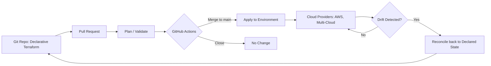

# Top 20 DevOps and Cloud Use Cases: A Curated Engineering Field Guide

## Introduction

DevOps and cloud engineering have moved from "nice to have" buzzwords to the day-to-day operating reality of modern software teams. Every week, platform engineers pick up new practices: right-sizing container images, keeping Kubernetes clusters healthy, taming cloud bills, and wiring infrastructure-as-code pipelines. The sheer number of topics, however, makes it hard to know where to focus.

This article is a curated field guide built directly from a roundup of **the top 20 DevOps and cloud use cases**. The source document lists the topics only by title, so this guide extracts each one, groups it into a theme, and explains what the use case is about — while being explicit about which technical details the source does **not** cover. Where an important metric appears (such as a 98% reduction in Lambda cold starts or a 15% cloud-bill cut), it comes straight from the original title.

The twenty topics cluster naturally into seven themes:

1. AWS architecture, scaling and cost
2. Kubernetes and container orchestration
3. Docker and container image best practices
4. Infrastructure as code and GitOps
5. Cloud cost optimization (FinOps)
6. Cloud security
7. Disaster recovery and multi-cloud

## Table of Contents

- [The 20 Use Cases at a Glance](#the-20-use-cases-at-a-glance)
- [AWS Architecture, Scaling, and Cost](#aws-architecture-scaling-and-cost)
- [Kubernetes and Container Orchestration](#kubernetes-and-container-orchestration)
- [Docker and Container Best Practices](#docker-and-container-best-practices)
- [Infrastructure as Code and GitOps](#infrastructure-as-code-and-gitops)
- [Cloud Cost Optimization (FinOps)](#cloud-cost-optimization-finops)
- [Cloud Security](#cloud-security)
- [Disaster Recovery and Multi-Cloud](#disaster-recovery-and-multi-cloud)
- [Real-World Example: Rolling Out the Use Cases in Practice](#real-world-example-rolling-out-the-use-cases-in-practice)
- [Key Takeaways](#key-takeaways)
- [Frequently Asked Questions](#frequently-asked-questions)
- [Related Articles](#related-articles)

## The 20 Use Cases at a Glance

The following table maps every topic in the source roundup to the theme it belongs to. Use it as a quick reference before reading the detailed sections.

| # | Use case | Theme |
|---|----------|-------|
| 1 | AWS Architecture: To Overcome API Gateway Pay | AWS architecture & cost |
| 2 | Kubernetes: Pod Disruption Budget Practical Guide | Kubernetes |
| 3 | AWS Lambda: Provisioned Concurrency Cuts Cold Starts by 98% | AWS scaling |
| 4 | Docker: How to Reduce Docker Image Size | Docker |
| 5 | Multi Cloud: GitOps Workflow for Kubernetes Management | GitOps & multi-cloud |
| 6 | GitHub Actions: Workflow for Terraform workspaces | Infrastructure as Code |
| 7 | How To Convert Existing Cloud Infrastructure To Terraform | Infrastructure as Code |
| 8 | Kubernetes: Node Not Ready - How To Fix It | Kubernetes |
| 9 | CloudCost: How One BigQuery Query Costs Shopify $1M a Month | Cloud cost |
| 10 | AWS: How AWS Handled 2024 Prime Day's Record Breaking Traffic | AWS scaling |
| 11 | Kubernetes: Hidden Risk Of Relying On Labels In K8s Security | Kubernetes & security |
| 12 | Docker: Detecting and Mitigating Image Vulnerabilities with Scout | Docker & security |
| 13 | Security Researcher Exposed AWS Secrets of $1B VC Firm | Cloud security |
| 14 | Terraform: Guide to a Well Structured Terraform Project | Infrastructure as Code |
| 15 | Multi Cloud: Cloud Disaster Recovery Strategies | Disaster recovery |
| 16 | Docker: Why should a container have only one process? | Docker |
| 17 | AWS: VPC Gateway Endpoints - The Most Underrated Cost Savers | AWS cost |
| 18 | Terraform: The Problem With Overusing Terraform Dynamic Blocks | Infrastructure as Code |
| 19 | CloudCost: How Levels.fyi Cuts Cloud Bill By 15% | Cloud cost |
| 20 | Kubernetes: Air Gap Implementation | Kubernetes & security |

## AWS Architecture, Scaling, and Cost

Four use cases in the roundup focus on how teams get the most out of AWS: reducing architecture-driven costs, eliminating cold starts, surviving the biggest traffic event of the year, and discovering underrated cost savers.

### AWS Architecture to Overcome API Gateway Pay

The first use case is about the cost profile of **AWS API Gateway**. As the title notes, teams need architecture that lets them *overcome* what API Gateway charges — the service bills per request, and costs can climb as call volume grows. The source title tells us this is purely an architecture-level concern; the specific patterns (private endpoints, caching, request aggregation, or moving to alternate invocation paths) are **not detailed in the source**.

### AWS Lambda: Provisioned Concurrency Cuts Cold Starts by 98%

The third use case centers on **AWS Lambda cold starts** — the latency penalty when an idle function spins up a new execution environment. The title claims provisioned concurrency cuts cold starts by **98%**, which is the headline metric of the topic.

> **Note:** Provisioned concurrency keeps a pre-warmed pool of function instances ready, trading a small run cost for predictable latency. The source provides only the title and the 98% figure — the exact workloads it benefits most are not covered there.

### How AWS Handled 2024 Prime Day's Record-Breaking Traffic

Prime Day is one of the highest-traffic retail events on the internet. The tenth use case explores **how AWS absorbed 2024 Prime Day's record-breaking request volume**. This is a classic case study in horizontal scaling, elasticity, and capacity planning at planet scale. The source title confirms the event and its scale, but the specific numbers and architecture details are **not included in the source** beyond the title itself.

### VPC Gateway Endpoints: The Most Underrated Cost Savers

Every public VPC route that traverses a NAT gateway, internet gateway, or VPN carries a per-gigabyte charge. The seventeenth use case highlights **VPC Gateway Endpoints** as an underused mechanism: endpoints route S3 and DynamoDB traffic privately — without the traffic passing through a NAT gateway — which cuts both networking cost and data-transfer exposure. The source title frames them as cost savers; the specific savings figures are **not provided**.

## Kubernetes and Container Orchestration

Kubernetes appears four times in the roundup, covering availability, troubleshooting, security, and offline deployment.

### Pod Disruption Budget Practical Guide

A **Pod Disruption Budget (PDB)** is the Kubernetes mechanism that protects a workload during voluntary disruptions — node drains, cluster upgrades, or maintenance windows — by constraining how many pods may be unavailable at once. The second use case is a practical walkthrough of configuring PDBs so that availability goals survive intentional disruption. Cluster-autoscaler logic and other operational details are **not elaborated in the source**.

### Node Not Ready - How To Fix It

A `NodeNotReady` status means the kubelet on a worker node has stopped heartbeating to the control plane, and the scheduler stops placing new pods there. The eighth use case is a troubleshooting guide for this state: checking kubelet status, resource pressure, and network connectivity. The step-by-step diagnostics are **not enumerated in the source document**.

### The Hidden Risk of Relying on Labels in Kubernetes Security

Kubernetes labels are key-value tags used for grouping and selecting resources — and network policies, role bindings, and selectors often depend on them. As the title warns, this creates a **hidden risk**: if labels drive security decisions, a mislabel or a missing selector can silently widen or break access. The source states the risk; the concrete attack or misconfiguration scenarios are **not covered**.

### Kubernetes Air Gap Implementation

Air-gapped clusters run in environments with **no inbound or outbound internet** — a requirement in defense, government, and tightly regulated industries. Everything, from container images to Helm charts to system components, must be pulled, mirrored, and served from internal registries. The twentieth use case covers implementing this offline deployment; the source does **not** provide the migration procedure.

## Docker and Container Best Practices

The Docker cluster of use cases is about making images small, keeping the container runtime supply chain safe, and honoring a core process-model principle.

### How to Reduce Docker Image Size

Smaller images mean faster pulls, lower registry cost, less disk, and a smaller attack surface. The fourth use case is about **reducing Docker image size** — multi-stage builds, slim and Alpine base images, caching layers wisely, and pruning dependencies. The specific techniques are **not listed in the source**; only the topic itself.

### Detecting and Mitigating Image Vulnerabilities with Scout

The twelfth use case pairs Docker with **Docker Scout**, the supply-chain analysis tool that compares image contents against vulnerability databases. The title frames a two-stage workflow: *detect* known vulnerabilities in an image, then *mitigate* them — by rebuilding with patched base images or pinning fixed versions. Command examples and policy details are **not in the source**.

> **Caution:** Scanning is only half of the job. An image scanned at build time can drift out of date before it ever runs — vulnerability scans should be part of the pipeline, not a one-time check.

### Why Should a Container Have Only One Process?

Containers are built to run a single unit of work. Running multiple competing processes inside one container — a web server and a cron job together, for example — makes the container harder to scale, restart, and monitor, and it complicates signal handling and logging. The sixteenth use case argues for **one concern per container** and orchestrating multi-process workloads as separate containers or sidecars. Supervision tools are mentioned nowhere in the source.

## Infrastructure as Code and GitOps

Five use cases — the largest cluster — revolve around managing infrastructure declaratively through version control and automation.

### A GitOps Workflow for Kubernetes Management

GitOps makes the Git repository the single source of truth: any change to a cluster must first land as a commit, and an operator continuously reconciles the cluster to that declared state. Applied across multiple clouds, this gives teams a **multi-cloud GitOps workflow** for managing Kubernetes clusters from one pipeline. The source presents the concept by title only.

### GitHub Actions Workflow for Terraform Workspaces

Terraform workspaces let you isolate states for different environments — typically `dev`, `staging`, and `prod`. The sixth use case wires these into **GitHub Actions**, so a pull request triggers a plan against one workspace and a merge triggers an apply against another. The exact YAML workflow is **not supplied in the source**.

### Convert Existing Cloud Infrastructure to Terraform

Brownfield adoption is the hard part of IaC: you did not start with Terraform, so your live infrastructure was built by hand or by another tool. The seventh use case (the title is partially garbled in the source: "ue lac") covers **converting existing cloud infrastructure to Terraform** — importing existing resources into state, reconciling drift, and adopting gradually. The source provides no detailed steps.

### Guide to a Well-Structured Terraform Project

A maintainable Terraform project needs a deliberate layout: modules with clear boundaries, consistent file conventions, careful state management, and environment separation. The fourteenth use case is exactly that — a **guide to well-structured Terraform projects**. The naming conventions in the source's title are general; the concrete recommended folder structure is **not included**.

### The Problem with Overusing Terraform Dynamic Blocks

`dynamic` blocks in HCL generate repeated nested configuration blocks from a loop. They are powerful — and easy to abuse. Overusing them turns readable code into inscrutable generated logic where a simple explicit block, or a list, would be clearer. As the title stresses, this is a case study in **judicious use of dynamic blocks**, though the source details none of the trade-offs beyond the headline.

The mental model behind this entire cluster is a loop: codify the environment, push the change, let automation apply it, and reconcile continuously.

## Cloud Cost Optimization (FinOps)

Two use cases make cloud cost the protagonist rather than a footnote — the discipline known as FinOps.

### How One BigQuery Query Costs Shopify $1M a Month

The ninth use case is the cautionary cost story: a quoted figure of **one BigQuery query costing Shopify $1,000,000 a month**. BigQuery bills by the amount of data scanned, so an unoptimized, frequently re-run query over a wide table can generate extraordinary spend. The title states the impact; the specific query, table, and fix are **not covered by the source**.

### How Levels.fyi Cuts Cloud Bill By 15%

On the brighter side, the nineteenth use case reports that **Levels.fyi cut its cloud bill by 15%**. Cost optimization here is a process — right-sizing resources, cutting unused capacity, and imposing architecture-level efficiencies. The exact mix of measures is **not detailed in the source**, only the outcome.

## Cloud Security

Security threads through the roundup in three separate places: Kubernetes identity, Docker supply chain, and AWS secrets.

### Security Researcher Exposed AWS Secrets of a $1B VC Firm

The thirteenth use case recounts a **security researcher exposing the AWS secrets of a venture capital firm with $1 billion in assets**. The recurring theme is that secrets arrive in the wrong places — leaked in code, in build logs, in CI configuration, or committed to repositories. The source describes the event by title only; the firm, the exposure path, and timeline are **not in the document**.

> **Caution:** Assume compromised secrets will eventually be found and abused. Practice invariant rotation: if a secret is ever exposed beyond a controlled runtime, treat it as burned and rotate it immediately.

The three security themes echo one another: labels that gate access, image supply chains that carry known vulnerabilities, and secrets that leak into version control are all cases of **relying on the wrong trust boundary**.

## Disaster Recovery and Multi-Cloud

### Cloud Disaster Recovery Strategies

Relying on a single cloud (or a single region, or a single provider) concentrates risk. The fifteenth use case surveys **cloud disaster recovery strategies** — backup-and-restore, pilot light, warm standby, and active-active/multi-site architectures as the spectrum from slowest to fastest recovery. The specific checklist is **not provided in the source**.

**Typical DR trade-offs, by strategy:**

1. **Backup & restore** — lowest cost, slowest recovery (hours+).
2. **Pilot light** — core services running, cheap, minutes-to-hours recovery.
3. **Warm standby** — a scaled-down copy ready to scale up, faster, pricier.
4. **Active-active / multi-site** — full traffic across regions, fastest failover, highest cost.

Combined with the multi-cloud **GitOps workflow** (#5), teams can keep the same declarative infrastructure across providers and make region or provider failover a matter of applying an existing state rather than rebuilding it.

## Real-World Example: Rolling Out the Use Cases in Practice

None of these twenty topics exists in isolation; in a real platform team they arrive together. Here is how the use cases interlock on a typical path:

1. **Baseline the bill.** Start with cost visibility (#9 and #19): measure what actually spends money — data-scanning queries, egress, and idle capacity.
2. **Codify everything.** Bring hand-built cloud resources under Terraform (#7), organized into a clean module structure (#14), avoiding dynamic-block overuse (#18). Wire plans and applies into GitHub Actions per workspace (#6).
3. **Harden the build.** Shrink images (#4), scan them with Docker Scout before anything ships (#12), and keep one process per container (#16).
4. **Operate the cluster.** Apply pod disruption budgets for upgrades (#2), keep a runbook for `NotReady` nodes (#8), and stop trusting labels for security scope (#11) — or, in restricted environments, operate fully air-gapped (#20).
5. **Put traffic on it.** Largely via Lambda with provisioned concurrency to erase cold starts (#3), behind architecture that keeps API Gateway spend in check (#1) and uses VPC gateway endpoints to avoid NAT egress charges (#17) — borrowing the elasticity story of Prime Day (#10).
6. **Plan for the worst.** Select a DR posture (#15) and keep GitOps ready across clouds (#5) so failure is a dry-run apply away.
7. **Keep secrets out.** Enforce that no AWS credentials ever land in a repository (#13).

The cycle then repeats: cost numbers inform capacity, capacity changes become Terraform diffs, and every diff is a pull request.

## Key Takeaways

- The roundup spans **seven recurring themes**: AWS architecture, Kubernetes, Docker, infrastructure as code, cloud cost, security, and disaster recovery.
- **Cost is a first-class concern.** Data-scanning bills, API Gateway request pricing, and NAT egress charges are all called out — one source title alone cites a $1M/month query.
- **Kubernetes reliability and security** hinge on small, practical controls: disruption budgets, node health, label hygiene, and air-gapped distribution.
- **A bigger image is a bigger liability** — smaller images, supply-chain scanning, and single-purpose containers are the Docker trio.
- **GitOps plus Terraform is the operating model** — five of twenty use cases orbit declarative, reviewable, automated infrastructure.
- Where the source only provided titles, the article explicitly says so rather than inventing specifics.

## Frequently Asked Questions

**What is a Kubernetes Pod Disruption Budget?**
A Pod Disruption Budget limits how many pods of a workload can be unavailable during voluntary disruptions such as node drains or cluster upgrades, helping you keep availability targets during maintenance.

**What does "GitOps workflow for Kubernetes" mean?**
It means Git is the single source of truth for cluster state: changes are made via commits, and an automation layer continuously reconciles the cluster to match the declared state.

**How do you reduce a Docker image's size?**
Typical levers include multi-stage builds, slimmer base images, avoiding unnecessary packages, and keeping only runtime dependencies — common techniques, though the source only lists the topic and does not detail the steps.

**What is AWS Lambda provisioned concurrency?**
It pre-warms a configured number of function instances so requests skip the cold-start penalty; the source title cites a 98% reduction in cold starts.

**Is the cloud cost content in this article based on the source?**
Partially. The article includes exactly the figures present in the source titles — the $1M/month BigQuery cost, the 98% cold-start reduction, and the 15% bill cut. Any other implementation detail is marked as not covered by the source.

## Related Articles

The source roundup only lists titles, so the following related items reference topics from the roundup rather than external links:

- Kubernetes: Pod Disruption Budget Practical Guide (topic #2 from the roundup)
- Terraform: Guide to a Well Structured Terraform Project (topic #14 from the roundup)
- Cloud Disaster Recovery Strategies (topic #15 from the roundup)
- AWS: How AWS Handled 2024 Prime Day's Record Breaking Traffic (topic #10 from the roundup)
