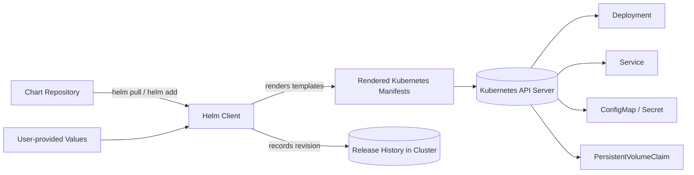
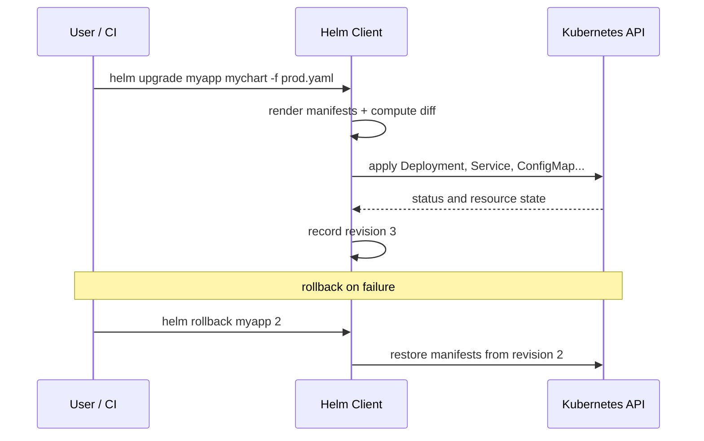

# Mastering Helm: The Complete Guide to Kubernetes Package Management

If you have ever deployed the same application to Kubernetes more than three times, you have probably felt the pain: dozens of YAML files, subtle differences between environments, tricky upgrades, and rollbacks that require a guest appearance by your site reliability team. Helm exists to turn that messy pile of manifests into a clean, versioned, shareable package.

Helm is the de facto standard package manager for Kubernetes. It is to Kubernetes what pip is to Python or npm is to JavaScript. In this guide you will learn how Helm is architected, how charts are built and templated, how releases are installed, upgraded, and rolled back, and how to apply sensible security and operational good practices. By the end you will be able to package your own application, publish it to a repository, and manage it confidently through its entire lifecycle.


## Table of Contents

- [What Is Helm and Why Do You Need It?](#what-is-helm-and-why-do-you-need-it)
- [Helm Architecture: The Core Components](#helm-architecture-the-core-components)
- [Understanding Charts: The Kubernetes Application Package](#understanding-charts-the-kubernetes-application-package)
- [Templating with Go Templates and Values](#templating-with-go-templates-and-values)
- [The Helm Release Lifecycle: Install, Upgrade, Rollback](#the-helm-release-lifecycle-install-upgrade-rollback)
- [Dependencies, Repositories, and Sharing Charts](#dependencies-repositories-and-sharing-charts)
- [Helm Best Practices and Security](#helm-best-practices-and-security)
- [A Real-World Example: Deploying a Web Application](#a-real-world-example-deploying-a-web-application)
- [Helm and GitOps: Working with Argo CD and Flux](#helm-and-gitops-working-with-argo-cd-and-flux)
- [Key Takeaways](#key-takeaways)
- [Frequently Asked Questions](#frequently-asked-questions)
- [Related Articles](#related-articles)

## What Is Helm and Why Do You Need It?

Helm packages Kubernetes resources into a **chart** — a collection of template files that describe a related set of Kubernetes objects. Where a plain Kubernetes deployment scatters manifests across folders and relies on `kubectl apply -f ./directory`, Helm gives you:

- **Parameterization.** The same chart can deploy to dev, staging, and production with different settings via a single `values.yaml` overlay.
- **Reproducible releases.** Every deployment is recorded as a numbered revision, so you can inspect what is actually running and roll back to any previous revision.
- **Dependency management.** Charts can declare and bundle upstream dependencies, much like a package manifest.
- **Standard packaging and sharing.** Chart repositories and OCI registries make it trivial to distribute applications.

> Many teams start with raw YAML and only reach for Helm after their second on-call incident caused by a manually edited manifest drift. Helm does not replace Kubernetes manifests — it manages them, versions them, and makes their differences explicit.

Statistically, Helm is among the most widely used Kubernetes tools in production, and it has become the delivery format of choice for open source projects such as Prometheus, Grafana, Jenkins, and countless operator-driven workloads. Understanding Helm is a core DevOps skill precisely because it sits at the intersection of packaging, continuous delivery, and cluster operations.

## Helm Architecture: The Core Components

### Chart Repositories, Charts, and Releases

Three concepts underpin everything Helm does:

1. **Chart:** A bundle of templates, metadata, and default values describing an application or service.
2. **Repository:** A location, HTTP-based or OCI-based, where charts are indexed and published.
3. **Release:** A deployed instance of a chart in a cluster, tracked with a revision number.

The following diagram shows how these pieces fit together at install time:



### The Helm Client Only

In Helm v2, a server-side component called **Tiller** ran inside the cluster and performed the actual installs. Helm v3 removed Tiller, and today the **Helm client** talks to the Kubernetes API server directly using the same credentials as `kubectl`. This change simplified security: you no longer need a powerful in-cluster service account, and the client works with standard RBAC. The heavy work happens locally — templating, validation, and diffing — before manifests are sent to the cluster.

### Where Release State Lives

Helm stores release metadata as Secrets in the `kube-system` namespace (or the namespace you configure). Each release revision is a Secret, which means Helm history is queryable with the same tools you already use for other cluster data.

## Understanding Charts: The Kubernetes Application Package

The fastest way to see a chart's anatomy is to scaffold one:

```
helm create mychart
```

This produces a directory layout that looks like this:

```
mychart/
├── Chart.yaml          # chart metadata and dependencies
├── values.yaml         # default configuration values
├── values.schema.json  # optional JSON schema for validation
├── charts/             # bundled third-party dependencies
├── crds/               # optional CustomResourceDefinitions
└── templates/
    ├── NOTES.txt       # user-facing notes after install
    ├── _helpers.tpl    # reusable template functions
    ├── deployment.yaml
    ├── service.yaml
    ├── configmap.yaml
    ├── ingress.yaml
    └── tests/
        └── test-connection.yaml
```

| File or Directory | Purpose |
| --- | --- |
| `Chart.yaml` | Name, version, appVersion, and dependency list |
| `values.yaml` | Default configuration values consumed by templates |
| `templates/` | Go-template files rendered into Kubernetes manifests |
| `_helpers.tpl` | Named templates you can reuse across other templates |
| `/charts` | Physical copies of third-party charts bundled with this one |
| `/crds` | CustomResourceDefinitions installed before the rest |
| `NOTES.txt` | Helpful instructions shown to the user after install |
| `values.schema.json` | JSON schema used to reject invalid values early |

The `Chart.yaml` file is the chart's identity card. A minimal example:

```yaml
apiVersion: v2
name: mywebapp
description: A sample stateless web application
type: application
version: 0.1.0
appVersion: "1.0"
dependencies:
  - name: postgresql
    version: "15.5.0"
    repository: "https://charts.bitnami.com/bitnami"
```

> The `version` field is the chart's version, while `appVersion` is the version of the packaged application. Bump `version` whenever you change templates; bump `appVersion` when the underlying app image changes. Confusing the two is a common source of version-tracking mistakes.

## Templating with Go Templates and Values

Helm templates use Go's `text/template` syntax extended with Sprig functions and Helm's own template helpers. Your Kubernetes YAML files become templates whose values are injected from `values.yaml`.

### A Template Example

A trimmed-down `deployment.yaml` template:

```yaml
apiVersion: apps/v1
kind: Deployment
metadata:
  name: {{ include "mychart.fullname" . }}
  labels:
    {{- include "mychart.labels" . | nindent 4 }}
spec:
  replicas: {{ .Values.replicaCount }}
  selector:
    matchLabels:
      {{- include "mychart.selectorLabels" . | nindent 6 }}
  template:
    metadata:
      labels:
        {{- include "mychart.selectorLabels" . | nindent 8 }}
    spec:
      containers:
        - name: {{ .Chart.Name }}
          image: "{{ .Values.image.repository }}:{{ .Values.image.tag }}"
          imagePullPolicy: {{ .Values.image.pullPolicy }}
          ports:
            - containerPort: {{ .Values.service.port }}
```

And the matching `values.yaml`:

```yaml
replicaCount: 3

image:
  repository: nginx
  tag: "1.27"
  pullPolicy: IfNotPresent

service:
  type: ClusterIP
  port: 80

resources:
  requests:
    cpu: 100m
    memory: 128Mi
  limits:
    cpu: 250m
    memory: 256Mi
```

The `{{ .Values.replicaCount }}` directive reads the `replicaCount` key, while `{{ .Chart.Name }}` and `{{ .Release.Name }}` expose chart and release metadata. The `{{- ... -}}` dashes trim surrounding whitespace and newlines so the rendered YAML stays clean.

### Precedence of Values

When several sources define the same value, Helm resolves them in this order (highest wins):

1. `--set` flags on the command line
2. `--set-file`, `--set-json`, and `--set-string`
3. A `-f` values file you pass explicitly
4. `values.yaml` shipped inside the chart

This precedence is what makes environment overlays practical: the chart ships sane defaults, and you layer on dev or production deviations without editing the chart itself.

### Helpers and Functions

Reusable logic lives in `_helpers.tpl`. A typical helper renders a fully qualified name:

```gotemplate
{{- define "mychart.fullname" -}}
{{- printf "%s-%s" .Release.Name .Chart.Name | trunc 63 | trimSuffix "-" -}}
{{- end -}}
```

Useful built-in functions include `default`, `required`, `quote`, `nindent`, and the Sprig string and list functions. For raw strings that must not be templated, wrap them in `{{ raw }}...{{ end }}`.

### Debugging Templates

Never guess what a template will render. Verify before installing:

```bash
helm template mychart .                    # render manifests to stdout
helm template mychart . --debug            # include computed values
helm lint mychart                          # static lint of the chart
helm diff upgrade myapp mychart ./values-prod.yaml   # preview changes if plugin installed
```

> Always run `helm template` (and ideally `helm lint`) before `helm install` or `helm upgrade` on a shared cluster. A single unresolved value, such as a missing key producing an empty string, can turn into a broken Pod that looks healthy until traffic arrives.


## The Helm Release Lifecycle: Install, Upgrade, Rollback

Every `helm install`, `helm upgrade`, and `helm rollback` creates a new released revision. Helm tracks these revisions, making upgrades safe and reversible.



### Install

```bash
helm repo add bitnami https://charts.bitnami.com/bitnami
helm repo update
helm install myrelease bitnami/wordpress --namespace wordpress --create-namespace
```

The `--namespace` flag scopes the release, and `helm upgrade --install` is the idempotent form that installs if missing and upgrades otherwise — ideal for CI pipelines:

```bash
helm upgrade --install myrelease bitnami/wordpress --namespace wordpress \
  --values ./values-prod.yaml --atomic
```

The `--atomic` flag rolls the deployment back automatically if any Kubernetes object fails during the install.

### Upgrade and Rollback

Upgrading follows the same path as a normal install but applies only the diff:

```bash
helm upgrade myrelease bitnami/wordpress --set wordpress.username=admin
helm status myrelease
helm history myrelease
helm rollback myrelease 2
```

List common lifecycle commands:

| Command | What it does |
| --- | --- |
| `helm install` | Creates a release from a chart |
| `helm upgrade` | Upgrades a release to a new chart version or values |
| `helm rollback` | Restores a previous revision |
| `helm history` | Lists all revisions of a release |
| `helm status` | Shows the current release state |
| `helm list` | Lists releases in a namespace or cluster |
| `helm uninstall` | Deletes a release (keeps revision history unless `--keep-history`) |
| `helm dependency update` | Downloads declared chart dependencies |

Rollbacks are cheap because Helm restores the exact manifests of the target revision. This is a decisive advantage over manual `kubectl` editing, where your only rollback strategy is often re-cutting YAML from memory.

## Dependencies, Repositories, and Sharing Charts

### Declaring Dependencies

Dependencies are declared in `Chart.yaml` and resolved with:

```bash
helm dependency update
helm dependency build
```

The `update` command downloads each dependency into the `charts/` directory and writes a `Chart.lock` file whose checksums guarantee reproducibility. If you have ever built the same application twice on different days and gotten different results because a transitive dependency drifted, you will appreciate the lockfile.

### Publishing Charts

Charts can be published to a classic HTTP chart repository (an index file plus packaged `.tgz` files) or to an OCI registry:

```bash
helm package ./mychart
helm push mychart-0.1.0.tgz oci://registry.example.com/helm
helm install myrelease oci://registry.example.com/helm/mychart --version 0.1.0
```

OCI registries give you the existing registry infrastructure you already run, including authentication, access controls, and audit logs.

## Helm Best Practices and Security

- **Never commit real secrets to `values.yaml`.** Default values are baked into the chart and published with it. Use Secrets created outside the chart, `--set-file` with files pulled from your secret store, or external secrets controllers.
- **Pin versions in production.** Always pass `--version` when installing and upgrading so a floating tag never silently changes what lands in your cluster.
- **Validate inputs with `values.schema.json`.** A JSON schema catches typos and wrong types before deployment instead of during a production incident.
- **Keep releases small and focused.** A chart that tries to deploy the entire platform is a maintenance liability. Prefer small charts with clear dependencies.
- **Use `--atomic` and `--wait` in pipelines.** These flags make CI waits for readiness and rolls back on failure instead of reporting a half-success.
- **Scope permissions carefully.** Since Helm acts as the user running it, the RBAC permissions Helm needs are the same as the user's — least privilege still applies end to end.
- **Regularly audit release history.** Old revision Secrets accumulate. Uninstall with `--keep-history` only when you truly need forensic history, and clean unused namespaces.

> Helm is a delivery mechanism, not a security boundary. It cannot protect you from a container image with a known vulnerability any more than `apt install` can. Layer scanners, policy engines, and admission controllers on top of your package pipeline.

## A Real-World Example: Deploying a Web Application

Let us walk through a realistic scenario: shipping a small containerized web app to a production namespace with a single command and full rollback capability.

1. **Scaffold the chart.**

   ```bash
   helm create webapp
   ```

2. **Add environment overlays.** Create `values-dev.yaml` and `values-prod.yaml` both inheriting the chart defaults, with production raising replicas and resource limits.

   ```yaml
   # values-prod.yaml
   replicaCount: 5
   image:
     tag: "2.4.1"
   resources:
     requests:
       cpu: 500m
       memory: 512Mi
   ```

3. **Lint and review before touching the cluster.**

   ```bash
   helm lint webapp
   helm template webapp --values values-prod.yaml | kubectl diff -f -
   ```

4. **Install to production atomically.**

   ```bash
   helm upgrade --install webapp webapp \
     --namespace prod --create-namespace \
     --values values-prod.yaml --atomic --wait --timeout 5m
   ```

5. **Bump the image and upgrade.**

   ```bash
   sed -i 's/tag: "2.4.1"/tag: "2.4.2"/' values-prod.yaml
   helm upgrade webapp webapp --values values-prod.yaml --atomic
   helm history webapp
   ```

6. **Roll back a bad release.** If version 2.4.2 breaks health checks, restore revision 1:

   ```bash
   helm rollback webapp 1 --wait
   helm status webapp
   ```

This workflow — render, diff, apply atomically, rollback by revision number — is exactly what makes Helm the backbone of thousands of production delivery pipelines. Nothing here requires a human to hand-edit a running Deployment.

## Helm and GitOps: Working with Argo CD and Flux

Helm is frequently used alongside GitOps tools such as Argo CD and Flux. In GitOps, the desired state of the cluster lives in a Git repository, and an operator continuously reconciles the cluster toward it.

- **Argo CD** can render a chart from a repository, use the `values` from Git, and track the chart version. It effectively replaces `helm upgrade` as the actor, while Helm still handles templating and versioned upgrades inside the tool's reconciliation loop.
- **Flux's Helm controller** provides a `HelmRelease` custom resource that does the same: it watches Git for chart and values changes and applies them continuously.

In this model, Helm becomes the packaging convention while the GitOps controller owns deployment and drift correction. You still get Helm's versioning and templating semantics, but the cluster converges automatically toward the state committed in Git.

## Key Takeaways

- Helm turns Kubernetes YAML into versioned, parameterized, shareable charts and tracks every deployment as a numbered release revision.
- A chart is a directory of templates plus defaults; values flow through a well-defined precedence that allows clean dev, staging, and production overlays.
- Helm v3 removed the server-side Tiller, so the client talks directly to the Kubernetes API with the current user's RBAC permissions.
- The release lifecycle — install, upgrade, rollback, history — makes deployments auditable and reversible, which is a step change from hand-editing manifests.
- Always render and lint charts before install, pin versions in production, and keep secrets out of `values.yaml`.
- Helm composes naturally with GitOps tools like Argo CD and Flux, which drive the reconciliation while Helm provides packaging.
- Dependencies are locked with a `Chart.lock` file, so rebuilds are reproducible.

## Frequently Asked Questions

### What is the difference between a Helm chart and a Helm release?

A chart is a package of template files and metadata that describes an application. A release is a running, versioned instance of that chart in a specific namespace. Installing the same chart twice creates two independent releases, each with its own revision history.

### How does Helm compare to Kustomize?

Kustomize applies declarative patches on top of plain YAML without any templating logic, which some teams prefer for simplicity and readability. Helm offers richer parameterization, dependency management, and a true release/rollback model. Many teams use both: Helm for application packaging and Kustomize for environment-specific customizations layered on rendered output.

### Are Helm charts secure to run?

Charts themselves are just YAML and Go templates; the risk comes from what they deploy. Public charts should be reviewed, pinned to exact versions, and scanned. Follow least privilege in RBAC, avoid baking secrets into defaults, and treat the chart's admission into your supply chain like any dependency.

### Why does the same `values.yaml` not always produce the same result?

Because `--set` flags, `-f` files, chart defaults, and dependency versions all participate in the final result. Check your command-line overrides, verify the `Chart.lock` is in place, and render with `helm template` to see exactly what would be applied.

### Can Helm work with GitOps tools like Argo CD and Flux?

Yes. In a GitOps setup, the controller reconciles the cluster toward Git, resolving the Helm chart and values stored there. Helm's templating and versioning are preserved, but the controller, not a human, issues the upgrades or rollbacks.

## Related Articles

- [Push vs Pull Deployment Models - Understanding GitOps and Continuous Delivery](https://blog.example.com/gitops-push-pull)
- [Kubernetes in 100 Scenarios: A Complete Field Guide from Core Concepts to Advanced Workloads](https://blog.example.com/kubernetes-100-scenarios)
- [Building an End-to-End CI/CD DevOps Pipeline with Kubernetes and Jenkins](https://blog.example.com/ci-cd-kubernetes-jenkins)
