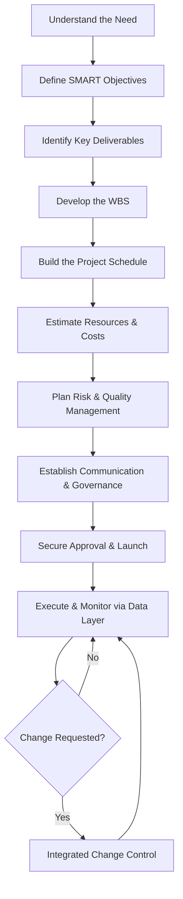

# How to Write a Master Project Plan: A Complete Guide to Planning Excellence

Every successful project begins long before the first line of code is written or the first task is executed. It starts with a **Master Project Plan** — a single, authoritative document that defines how the entire project will be managed, controlled, and delivered. Without one, teams struggle with misaligned priorities, unchecked scope growth, unclear responsibilities, and unpredictable outcomes.

A master project plan transforms ambiguity into clarity. It creates one source of truth that every stakeholder can reference, ensuring that strategy aligns with execution. Whether you are managing a large-scale infrastructure rollout or a complex software development initiative, the discipline of building a comprehensive plan is what separates high-performing teams from the rest.

This guide walks you through exactly what a master project plan is, the key knowledge areas it covers, a proven 10-step framework for building one, and the architectural layers that hold it all together.

## Table of Contents

- [What Is a Master Project Plan?](#what-is-a-master-project-plan)
- [Key Components of a Master Project Plan](#key-components-of-a-master-project-plan)
- [The Master Planning Process](#the-master-planning-process)
- [10 Steps to Build the Master Plan](#10-steps-to-build-the-master-plan)
- [Master Plan Architecture: The Four-Tier Model](#master-plan-architecture-the-four-tier-model)
- [Benefits of a Master Project Plan](#benefits-of-a-master-project-plan)
- [Key Takeaways](#key-takeaways)
- [Frequently Asked Questions](#frequently-asked-questions)
- [Related Articles](#related-articles)

## What Is a Master Project Plan?

A Master Project Plan is a comprehensive document that integrates every management area of a project into a single, cohesive framework. It answers the fundamental questions that determine project success:

- **Why** are we doing this?
- **What** exactly will be delivered?
- **When** will each phase of work happen?
- **Who** is responsible for each deliverable?
- **How** will we control changes, manage risks, and communicate progress?

Think of it as the blueprint for the entire project lifecycle. It does not replace individual management plans (like a risk register or a communication matrix); instead, it **integrates** them and provides a top-level view that allows leadership and team members to see the full picture at a glance.

> **Important:** A master project plan is not a one-time document that gets filed away. It is a living framework that must be updated as the project evolves. Integrated change control ensures the plan stays current and useful throughout execution.

## Key Components of a Master Project Plan

A well-structured master project plan addresses **ten knowledge areas**, each answering a critical question and producing a tangible output. Below is a summary of each area:

| Knowledge Area | Key Question | Main Output | Control Method | Success Indicator |
|---|---|---|---|---|
| **Integration** | How will everything work together? | Master Plan | Integrated Change Control | Strategic Alignment |
| **Scope** | What exactly will be delivered? | Scope Baseline / WBS | Scope Validation | Controlled Scope |
| **Schedule** | When will work happen? | Project Schedule | Critical Path / Milestones | On-Time Delivery |
| **Cost** | How much will it cost? | Cost Baseline | EVM / Variance Analysis | Budget Compliance |
| **Quality** | What standards must be met? | Quality Plan | QA / QC | Acceptance |
| **Resources** | Who will do the work? | Resource Plan / RACI | Capacity Monitoring | Resource Efficiency |
| **Communication** | Who needs what information? | Communication Matrix | Reporting | Information Flow |
| **Risk** | What could affect objectives? | Risk Register | Risk Reviews | Exposure Reduction |
| **Procurement** | What must be purchased? | Procurement Plan | Contract Control | Supplier Performance |
| **Stakeholders** | Who influences success? | Engagement Plan | Stakeholder Analysis | Strong Support |

### Integration

Integration is the glue that holds the entire plan together. It ensures that decisions made in one area — such as schedule changes — are reflected across all others. The primary control method is **Integrated Change Control**, which prevents unauthorized changes from cascading through the project unmanaged.

### Scope

The scope baseline, often expressed through a **Work Breakdown Structure (WBS)**, defines exactly what is and is not included in the project. This is critical for preventing scope creep — one of the most common causes of project failure.

### Schedule and Cost

The project schedule maps work against time, identifying critical paths and key milestones. The cost baseline tracks spending against budget using techniques like **Earned Value Management (EVM)** and variance analysis. Together, schedule and cost form the backbone of project performance monitoring.

### Quality, Resources, and Communication

Quality standards ensure deliverables meet stakeholder expectations. Resource planning (often using a RACI matrix) clarifies who is responsible, accountable, consulted, and informed. The communication matrix defines the flow of information so that no stakeholder is left in the dark.

### Risk, Procurement, and Stakeholders

The risk register captures threats and opportunities, enabling proactive management. Procurement plans control external vendor relationships. Stakeholder engagement ensures that the people who influence project success remain supportive throughout the lifecycle.

## The Master Planning Process

Building a master project plan is not a single-session activity. It is an iterative process that requires input from multiple sources and evolves as understanding deepens. The general flow looks like this:

1. **Understand the need** — Clarify why the project exists and what problem it solves.
2. **Gather inputs** — Collect requirements, constraints, assumptions, and stakeholder expectations.
3. **Define the framework** — Establish scope, schedule, cost, and quality baselines.
4. **Integrate all areas** — Ensure every knowledge area is addressed and connected.
5. **Validate and approve** — Secure leadership buy-in and formal sign-off.



## 10 Steps to Build the Master Plan

The source material provides a clear 10-step framework for constructing the master plan from scratch. Each step builds on the previous one, creating a layered and robust planning foundation.

### Step 1: Understand the Need

Before any planning begins, answer the foundational question: **Why does this project exist?** This means understanding the business need, the problem being solved, and the expected value. A project without a clearly articulated need is a project without direction.

### Step 2: Define SMART Objectives

Objectives must be **Specific, Measurable, Achievable, Relevant, and Time-bound**. Vague goals like "improve performance" are useless. Instead, write objectives like "Reduce deployment time by 40% within Q3 2026." SMART objectives become the yardstick against which all progress is measured.

### Step 3: Identify Key Deliverables

What will the project produce? List every major deliverable — tangible outputs, documentation, training materials, system components, or process changes. This step ensures nothing falls through the cracks.

### Step 4: Develop the WBS

The **Work Breakdown Structure** decomposes deliverables into manageable work packages. A good WBS follows the **100% rule**: it must capture 100% of the project scope, including project management work. Each work package should be small enough to estimate, assign, and track.

### Step 5: Build the Project Schedule

Using the WBS as input, sequence the work packages, identify dependencies, and assign durations. Highlight the **critical path** — the longest sequence of dependent tasks that determines the project's minimum duration. Establish milestones as checkpoints for progress validation.

### Step 6: Estimate Resources and Costs

Assign people, equipment, and materials to each work package. Estimate costs using **bottom-up estimation** (aggregating individual work package costs) where possible, and validate with analogous or parametric techniques. The result is a cost baseline that serves as the project budget.

### Step 7: Plan Risk and Quality Management

Identify risks early and document them in a risk register. For each risk, assess probability and impact, define response strategies, and assign owners. Simultaneously, establish quality standards and the QA/QC processes that will be used to verify deliverables meet expectations.

### Step 8: Establish Communication and Governance

Define who gets what information, when, and in what format. The communication matrix prevents information silos and ensures transparency. Governance defines decision-making authority, escalation paths, and reporting cadences.

### Step 9: Define Governance and Approval Processes

This goes beyond communication to formalize the project's control structure. Define the change control board, approval thresholds, and how deviations from the plan will be handled. Strong governance prevents ad-hoc decision-making during execution.

### Step 10: Secure Approval and Launch

With the plan complete, present it to key stakeholders and leadership for formal approval. This sign-off transforms the plan from a draft into an authorized baseline. Only after approval should execution begin.

## Master Plan Architecture: The Four-Tier Model

The master plan is structured in four architectural tiers, each serving a distinct purpose and operating at a different level of detail:

### Tier 1: Strategy and Alignment Layer

This is the "why" layer. It captures the project's strategic objectives, business case, and alignment with organizational goals. All decisions made in lower tiers must trace back to this layer.

### Tier 2: Planning and Baseline Layer

This is the "what and when" layer. It contains the scope baseline, schedule, cost baseline, quality standards, and all supporting management plans. This is the bulk of the master plan document.

### Tier 3: Execution and Data Layer

This is the "doing" layer. It tracks tasks, actuals, issues, KPIs, and progress data. During execution, this layer feeds real-time information back into the planning layer for comparison and adjustment.

### Tier 4: Control and Feedback Layer

This is the "adjusting" layer. It houses the integrated change control process, variance analysis results, risk review outcomes, and stakeholder feedback. It closes the loop between planning and execution.

```mermaid
graph TB
    subgraph Tier 1: Strategy & Alignment
        S1[Business Case]
        S2[Strategic Objectives]
        S3[Stakeholder Expectations]
    end
    subgraph Tier 2: Planning & Baseline
        P1[Scope Baseline / WBS]
        P2[Project Schedule]
        P3[Cost Baseline]
        P4[Quality Standards]
    end
    subgraph Tier 3: Execution & Data
        E1[Tasks & Actuals]
        E2[Issues & Blockers]
        E3[KPIs & Progress Data]
    end
    subgraph Tier 4: Control & Feedback
        C1[Change Control]
        C2[Variance Analysis]
        C3[Risk Reviews]
    end
    Tier 1 --> Tier 2
    Tier 2 --> Tier 3
    Tier 3 --> Tier 4
    Tier 4 --> Tier 2
```

## Benefits of a Master Project Plan

A master project plan delivers measurable benefits across the entire project lifecycle:

- **Creates one source of truth** — Eliminates conflicting information and ensures everyone works from the same baseline.
- **Prevents uncontrolled scope growth** — A validated scope baseline with integrated change control stops scope creep before it starts.
- **Makes responsibilities clear** — Resource plans and RACI matrices remove ambiguity about who owns what.
- **Strengthens schedule and cost control** — Critical path analysis and EVM provide early warning when projects drift off track.
- **Improves risk preparedness** — A maintained risk register ensures teams are proactive, not reactive.
- **Supports faster decision-making** — With governance structures in place, decisions happen at the right level without bottlenecks.
- **Creates measurable baselines** — KPIs and progress data allow objective assessment of project health.
- **Improves stakeholder confidence** — Transparent reporting and consistent communication build trust.
- **Increases project predictability** — A well-integrated plan reduces surprises and increases the likelihood of on-time, on-budget delivery.

> **Key Insight:** The master plan is more than a document — it is the project's operating system. Just as an operating system manages resources and processes for a computer, the master plan manages scope, time, cost, and risk for a project. Without it, execution becomes chaotic and outcomes become unpredictable.

## Key Takeaways

- A **Master Project Plan** integrates all ten knowledge areas into a single authoritative framework, serving as the project's one source of truth.
- The **10-step framework** — from understanding the need through securing approval — provides a repeatable, structured approach to building any plan.
- The **four-tier architecture** (Strategy, Planning, Execution, Control) ensures alignment between high-level goals and day-to-day work.
- **SMART objectives** and a well-built **WBS** form the foundation of scope and schedule control.
- **Integrated change control** is essential for managing the inevitable changes that occur during project execution without losing alignment.
- A master project plan is a **living document** that must be maintained throughout the project lifecycle, not a one-time deliverable.

## Frequently Asked Questions

### What is the difference between a project plan and a master project plan?

A project plan may refer to a single management plan (e.g., a schedule or risk plan). A **master project plan** integrates all management areas — scope, schedule, cost, quality, resources, communication, risk, procurement, and stakeholder management — into one comprehensive framework. It provides the top-level view that ties everything together.

### How long does it take to create a master project plan?

The time required depends on project complexity. For a small project, a basic master plan might take one to two weeks. For large, complex programs with multiple stakeholders and vendors, the planning phase can take several weeks or even months. The key is to invest enough time upfront to avoid costly rework later.

### Can a master project plan be used for agile projects?

Yes, with adaptation. While the terminology may differ (e.g., product backlog instead of WBS, sprint goals instead of milestones), the underlying principles of integration, scope control, risk management, and stakeholder alignment apply universally. The four-tier architecture is flexible enough to accommodate iterative approaches.

### What role does the master project plan play during execution?

During execution, the master plan serves as the **baseline against which performance is measured**. Progress data, KPIs, and issue logs (from Tier 3) are compared against planned baselines (from Tier 2). Deviations trigger the integrated change control process (Tier 4), which feeds decisions back into the plan.

### What happens if a project doesn't have a master plan?

Without a master plan, projects are far more likely to suffer from scope creep, budget overruns, schedule delays, miscommunication, and unmanaged risks. Teams lack a shared understanding of objectives and responsibilities, leading to duplicated effort, conflicting priorities, and ultimately, project failure.

## Related Articles

- Understanding Earned Value Management for Project Control
- Building an Effective Work Breakdown Structure (WBS)
- Risk Management Best Practices for Complex Projects
- How to Create a Stakeholder Engagement Plan
- Integrated Change Control: Keeping Projects on Track
