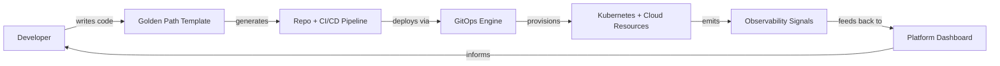
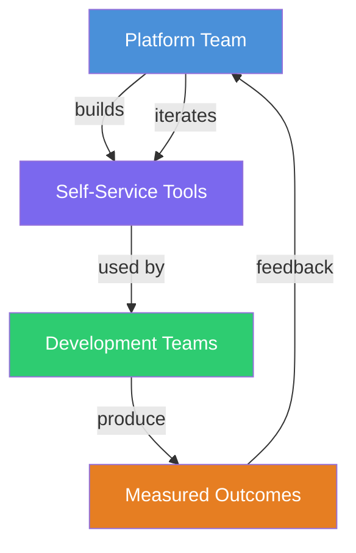

# Platform Engineering in 2026: Building Your Internal Developer Platform from Scratch

The DevOps movement promised to break down walls between development and operations. Years later, most teams achieved that goal — but created a new problem. Developers now shoulder a sprawling cognitive burden: Kubernetes manifests, Terraform modules, CI/CD pipeline YAML, secrets management, observability configs, and a dozen other tools they never signed up to master. Platform engineering emerged as the answer — a discipline focused on building Internal Developer Platforms (IDPs) that abstract away infrastructure complexity behind self-service interfaces.

In 2026, platform engineering is no longer a buzzword. It is a first-class engineering function inside organizations of every size. This article walks through the core concepts, architecture decisions, tooling choices, and real-world patterns behind building an effective IDP.

## Table of Contents

- [What Is Platform Engineering?](#what-is-platform-engineering)
- [Why Now? The Forces Driving Adoption](#why-now-the-forces-driving-adoption)
- [Core Principles of an Internal Developer Platform](#core-principles-of-an-internal-developer-platform)
- [Architecture of a Modern IDP](#architecture-of-a-modern-idp)
- [The Backstage Ecosystem](#the-backstage-ecosystem)
- [Building Self-Service Interfaces](#building-self-service-interfaces)
- [Real-World Example: Standing Up an IDP with Backstage and Crossplane](#real-world-example-standing-up-an-idp-with-backstage-and-crossplane)
- [Measuring Platform Success](#measuring-platform-success)
- [Common Pitfalls](#common-pitfalls)
- [Key Takeaways](#key-takeaways)
- [Frequently Asked Questions](#frequently-asked-questions)
- [Related Articles](#related-articles)

## What Is Platform Engineering?

Platform engineering is the discipline of designing, building, and maintaining toolchains and workflows that enable self-service capabilities for software engineering teams. The primary artifact is an **Internal Developer Platform** — a curated layer of abstractions, APIs, and golden paths that hide infrastructure complexity while preserving flexibility.

Unlike a traditional operations team that acts as a gatekeeper, a platform team builds products for developers. Those products include:

- **Service catalogs** that track every microservice, its ownership, and its dependencies.
- **Golden path templates** that scaffold new projects with pre-configured CI/CD, monitoring, and security policies baked in.
- **Self-service provisioning** that lets developers spin up databases, queues, or environments without filing a ticket.
- **Unified dashboards** that surface deployment status, cost attribution, and reliability metrics in one place.

> Platform engineering does not replace DevOps — it operationalizes DevOps by productizing the toolchain. The goal is not fewer ops people but fewer friction points.

## Why Now? The Forces Driving Adoption

Several converging forces made platform engineering inevitable in 2025 and 2026:

1. **Cloud-native complexity explosion.** A typical microservice stack in 2026 touches Kubernetes, Helm, Terraform, Argo CD, Prometheus, Grafana, OpenTelemetry, Vault, and a service mesh. Expecting every developer to master all of them is unrealistic.
2. **Developer experience as a competitive advantage.** Companies like Spotify, Netflix, and Zalando publicly credit their platform teams with measurably higher developer satisfaction and faster shipping cadence.
3. **The "you build it, you run it" ceiling.** DevOps empowers developers to own the full lifecycle, but without scaffolding, many teams default to tribal knowledge and inconsistent practices.
4. **AI-augmented development.** With LLM-powered coding assistants generating more code faster, the bottleneck has shifted from writing code to provisioning and operating the infrastructure it runs on.



## Core Principles of an Internal Developer Platform

Not every toolset qualifies as an IDP. A well-designed platform adheres to several non-negotiable principles.

### 1. Self-Service by Default

Developers should be able to provision infrastructure, deploy services, and configure environments without waiting on another team. Every manual handoff is a signal that the platform is incomplete.

### 2. Opinionated Golden Paths

A platform provides recommended defaults, not just raw tools. A golden path might prescribe a specific CI/CD pipeline structure, logging format, or database provisioning workflow. Developers can deviate, but the default path is secure, compliant, and production-ready.

### 3. API-Driven Everything

Every capability exposed through a UI should also be available through an API. This enables automation, programmatic consumption by CI/CD pipelines, and future integration with AI agents.

### 4. Abstraction Without Lock-in

The platform should abstract infrastructure details without hiding them entirely. Developers should be able to inspect the underlying Terraform, Helm charts, or Kubernetes manifests when they need to debug or customize.

### 5. Measurable Outcomes

A platform team that cannot articulate its impact in terms of lead time for changes, deployment frequency, or developer NPS will struggle to justify its existence. Instrumentation is not optional.

## Architecture of a Modern IDP

An Internal Developer Platform is not a single product — it is a composition of layers. The following table breaks down a reference architecture:

| Layer | Purpose | Example Tools |
|---|---|---|
| **Developer Portal** | Service catalog, scorecards, templates, docs | Backstage, Port, Cortex |
| **Service Orchestration** | Golden path scaffolding, pipeline generation | Cookiecutter, Yeoman, Backstage Scaffolder |
| **GitOps Engine** | Declarative deployment, drift detection, rollback | Argo CD, Flux |
| **Infrastructure Provisioning** | Cloud resources as code, dynamic environments | Crossplane, Terraform, Pulumi |
| **Policy Enforcement** | Security, compliance, cost guardrails | OPA/Gatekeeper, Kyverno, Sentinel |
| **Observability** | Metrics, traces, logs, alerting | OpenTelemetry, Prometheus, Grafana |
| **Secrets Management** | Dynamic credentials, rotation, access control | HashiCorp Vault, AWS Secrets Manager |

### How the Layers Interact

A developer interacts with the top layer (the portal or CLI) to create or deploy a service. The portal triggers a scaffolding engine that generates a repository with a pre-configured pipeline. When code is pushed, the GitOps engine reconciles the desired state declared in Git against the live cluster. Infrastructure changes are applied via Crossplane or Terraform. Policy engines validate every change before it reaches production. Observability signals flow back into the portal to populate scorecards and dashboards.

## The Backstage Ecosystem

Backstage, originally created by Spotify and now a CNCF incubating project, has become the de facto standard for the developer portal layer. Its plugin architecture makes it extensible for nearly any organization.

Key Backstage components include:

- **Software Catalog** — A centralized registry of all services, APIs, libraries, and resources with ownership metadata.
- **Scaffolder** — A template engine that generates new repositories from opinionated blueprints.
- **TechDocs** — Built-in documentation that renders Markdown alongside code.
- **Plugins** — Integrations with Kubernetes, Argo CD, Grafana, PagerDuty, and hundreds of other tools.

```yaml
# Example Backstage scaffolder template for a new microservice
apiVersion: scaffolder.backstage.io/v1beta3
kind: Template
metadata:
  name: node-service-template
  title: Production-Ready Node.js Service
  description: Scaffolds a Node.js service with CI/CD, monitoring, and security
spec:
  owner: platform-team
  system: default
  type: service
  steps:
    - id: fetch-template
      name: Fetch Template
      action: fetch:template
      input:
        url: ./skeleton
        values:
          serviceName: ${{ parameters.serviceName }}
          team: ${{ parameters.team }}
    - id: create-repo
      name: Create Repository
      action: github:repo:create
      input:
        repoName: ${{ parameters.serviceName }}
        description: ${{ parameters.description }}
    - id: register-catalog
      name: Register in Catalog
      action: catalog:register
      input:
        catalogInfoPath: /catalog-info.yaml
  output:
    links:
      - title: Open in Catalog
        url: ${{ steps.register-catalog.output.catalogInfoPath }}
```

### Choosing Backstage vs. Alternatives

Backstage is powerful but requires significant customization. Smaller teams may prefer managed alternatives like Port or Cortex, which offer similar catalog and scorecard functionality without the operational overhead of self-hosting. The decision often comes down to team size, plugin needs, and whether you want to own the portal codebase.

## Building Self-Service Interfaces

Self-service is the heart of a platform. Here are the most common self-service patterns:

### Environment Provisioning

Developers request ephemeral environments (with databases, queues, and stubbed external services) for feature branches. Crossplane compositions or Terraform workspaces behind an API make this possible.

### Database Provisioning

Rather than asking an ops team to create a PostgreSQL instance, a developer declares their need through the platform. The platform provisions the database, configures backups, sets up monitoring, and returns connection details — all in minutes.

### Secret Injection

Instead of copying secrets between environments, the platform integrates with Vault to dynamically generate short-lived credentials scoped to a specific service and environment.

### Incident Response Playbooks

When an alert fires, the platform presents a runbook with one-click remediation actions — restart a pod, scale a deployment, or roll back a release — reducing mean time to recovery.

> A common mistake is building self-service for infrastructure while ignoring self-service for day-2 operations. A platform that makes provisioning easy but debugging hard will not earn developer trust.

## Real-World Example: Standing Up an IDP with Backstage and Crossplane

Consider a mid-size SaaS company with 40 microservices, 60 developers, and a small platform team of three engineers. Here is how they might approach building an IDP in phases:

### Phase 1: Catalog and Discovery (Weeks 1–4)

Deploy Backstage with the software catalog plugin. Ingest all existing services from GitHub repositories. Tag each service with ownership, tier, and lifecycle metadata. This alone eliminates the "who owns this service?" question.

### Phase 2: Golden Path Templates (Weeks 5–10)

Build scaffolder templates for the three most common service archetypes: REST API, event consumer, and frontend application. Each template generates a repository with a pre-configured GitHub Actions workflow, Dockerfile, Kubernetes manifests, and OpenTelemetry instrumentation.

### Phase 3: Self-Service Infrastructure (Weeks 11–20)

Deploy Crossplane with composite resource definitions (XRDs) for common infrastructure needs: PostgreSQL, Redis, S3 buckets, and SQS queues. Expose these through the Backstage portal so developers can provision resources without platform team involvement.

### Phase 4: Observability and Scorecards (Weeks 21–26)

Integrate Prometheus, Grafana, and OpenTelemetry into the platform. Build scorecards that track service maturity: Does the service have runbooks? Is it instrumented for tracing? Are its dependencies documented? Surfaces these metrics in the portal.

### Phase 5: Policy as Code (Weeks 27–32)

Deploy OPA/Gatekeeper policies that enforce standards at the cluster level: image scanning, resource limits, label requirements, and network policies. Developers get fast feedback through admission webhook rejections rather than late-stage security reviews.

## Measuring Platform Success

A platform team should track metrics across four dimensions:

1. **Developer Velocity** — Lead time for changes, deployment frequency, time to provision a new environment.
2. **Platform Adoption** — Percentage of services registered in the catalog, percentage of deployments through golden paths vs. ad-hoc methods.
3. **Reliability** — Change failure rate, mean time to recovery, number of security incidents related to misconfigurations.
4. **Developer Satisfaction** — Quarterly developer experience surveys, support ticket volume directed at the platform team.



## Common Pitfalls

Building an IDP is a long-term investment. Teams frequently stumble on these mistakes:

- **Building without consulting developers.** The platform exists to serve developers. If the platform team works in isolation, the result will be a tool nobody uses. Start with user research.
- **Boiling the ocean.** Trying to build every capability at once leads to burnout and half-finished features. Phased delivery with incremental wins builds momentum.
- **Treating the platform as a side project.** Without dedicated staffing, executive sponsorship, and a product roadmap, platform initiatives quietly die.
- **Over-abstracting.** Hiding too much behind magic makes debugging impossible. Developers need escape hatches and visibility into what the platform does on their behalf.
- **Ignoring migration paths.** Existing services will not magically adopt the platform. Provide clear migration guides, incentives, and tooling to onboard legacy workloads.

## Key Takeaways

- Platform engineering productizes the DevOps toolchain into self-service capabilities for developers.
- An Internal Developer Platform is a composition of layers — portal, GitOps, infrastructure provisioning, policy, and observability — not a single product.
- Backstage has emerged as the leading open-source developer portal, but managed alternatives exist for teams that want less operational overhead.
- Phased delivery is essential: start with cataloging and golden paths, then layer on self-service infrastructure and policy enforcement.
- Measure success through developer velocity metrics, adoption rates, and satisfaction surveys — not just technical output.
- Consult developers early and often; a platform nobody uses is just expensive shelfware.

## Frequently Asked Questions

### What is the difference between DevOps and platform engineering?

DevOps is a cultural and organizational philosophy that emphasizes shared responsibility between development and operations. Platform engineering is the practice of building tools and abstractions that make DevOps workflows self-service. Platform engineering operationalizes DevOps principles by productizing the toolchain.

### Do we need a dedicated platform team?

Not necessarily. In smaller organizations, a single senior engineer who dedicates part of their time to platform concerns can be effective. As the organization grows and the number of services and teams increases, a dedicated platform team with a product manager becomes essential.

### How long does it take to build an Internal Developer Platform?

A minimal viable platform — catalog, golden path templates, and basic GitOps — can be standing in 8–12 weeks. A mature platform with self-service infrastructure, policy enforcement, and full observability typically takes 6–12 months to develop and iterate on.

### Is Backstage the only option for a developer portal?

No. Port, Cortex, OpsLevel, and Humanitec are commercial alternatives. Backstage is open source and highly extensible, but it requires significant customization effort. The right choice depends on team size, budget, and how much control you want over the portal codebase.

### How do you get developer buy-in for a new platform?

Start by solving a real pain point. If developers spend two days provisioning a new environment, build a self-service solution that reduces it to ten minutes. Demonstrate the value concretely, then expand. Mandating adoption without demonstrating value is a recipe for resistance.

## Related Articles

- [HashiCorp Vault for DevOps: The Complete Guide to Secrets Management and Dynamic Credentials](/hashicorp-vault-secrets-management)
- [Mastering Helm: The Complete Guide to Kubernetes Package Management](/mastering-helm-kubernetes-package-management)
- [OpenTelemetry in DevOps: Unified Traces, Metrics, and Logs for Modern Observability](/opentelemetry-devops-observability)
- [Top 20 DevOps and Cloud Use Cases: A Curated Engineering Field Guide](/top-devops-cloud-use-cases)
