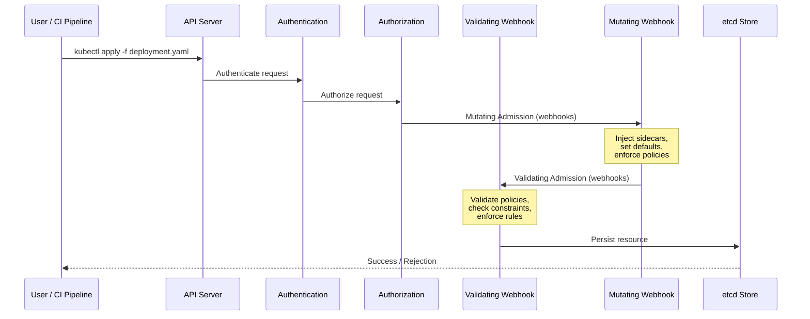

# Policy as Code: Securing Kubernetes with Open Policy Agent and Kyverno

As organizations scale their Kubernetes deployments, manually enforcing security and compliance policies becomes a bottleneck. Misconfigured deployments, unauthorized images, and privilege escalations are some of the most common attack vectors in cloud-native environments. Policy as Code (PaC) addresses this by codifying your governance rules and enforcing them automatically at the Kubernetes admission control layer.

This guide walks you through the core concepts of Policy as Code, compares the two leading solutions — Open Policy Agent (OPA) with Gatekeeper and Kyverno — and shows you how to deploy and use both in real-world Kubernetes clusters.

## Table of Contents

- [What Is Policy as Code?](#what-is-policy-as-code)
- [Why Policy as Code Matters for Kubernetes](#why-policy-as-code-matters-for-kubernetes)
- [Kubernetes Admission Control Explained](#kubernetes-admission-control-explained)
- [Open Policy Agent (OPA) and Gatekeeper](#open-policy-agent-opa-and-gatekeeper)
- [Kyverno: Policies as Kubernetes Resources](#kyverno-policies-as-kubernetes-resources)
- [OPA Gatekeeper vs. Kyverno: A Comparison](#opa-gatekeeper-vs-kyverno-a-comparison)
- [Real-World Example: Enforcing Pod Security Policies](#real-world-example-enforcing-pod-security-policies)
- [Best Practices for Rolling Out Policy as Code](#best-practices-for-rolling-out-policy-as-code)
- [Key Takeaways](#key-takeaways)
- [Frequently Asked Questions](#frequently-asked-questions)
- [Related Articles](#related-articles)

---

## What Is Policy as Code?

Policy as Code is the practice of defining organizational rules, compliance requirements, and security guardrails as machine-readable code that is automatically enforced by your infrastructure. In the Kubernetes context, these policies are evaluated every time a resource is created, updated, or deleted.

Instead of relying on manual reviews or ad-hoc scripts, PaC ensures that every deployment is validated against a consistent set of rules. Policies are version-controlled, peer-reviewed, tested, and deployed just like application code.

### Common Policy Categories in Kubernetes

| Category | Examples |
|---|---|
| **Security** | Prevent running containers as root, block privileged mode, enforce read-only root filesystems |
| **Compliance** | Require resource limits, mandate labels, enforce image registry restrictions |
| **Cost Management** | Limit resource requests/replicas, prevent oversized node selectors |
| **Operational** | Require readiness/liveness probes, enforce naming conventions, mandate namespace labels |
| **Supply Chain** | Require signed images, block images from untrusted registries, enforce digest pinning |

---

## Why Policy as Code Matters for Kubernetes

Kubernetes clusters are multi-tenant by nature. Multiple teams deploy workloads into shared clusters, each with different requirements and varying levels of security maturity. Without automated policy enforcement, several problems emerge:

1. **Configuration drift** — Teams configure clusters inconsistently over time.
2. **Security vulnerabilities** — Privileged containers, host network access, and unrestricted capabilities open attack paths.
3. **Compliance violations** — Regulations like SOC 2, HIPAA, and PCI DSS demand auditable controls.
4. **Resource waste** — Without limits, a single team can consume an entire cluster's resources.

> **Important:** Policy as Code does not replace security audits or penetration testing. It complements them by providing continuous, automated guardrails that catch misconfigurations before they reach production.

---

## Kubernetes Admission Control Explained

To understand how policy enforcement works in Kubernetes, you need to understand the admission control pipeline. Every API request — whether from `kubectl`, a CI/CD pipeline, or a controller — passes through a sequence of stages.



### Mutating vs. Validating Webhooks

- **Mutating webhooks** intercept requests and can modify the resource before it is stored. Kyverno uses this to auto-inject defaults (e.g., adding resource limits if missing).
- **Validating webhooks** inspect requests and can accept or reject them. OPA Gatekeeper primarily operates as a validating webhook.

Both OPA Gatekeeper and Kyverno implement these webhooks as Kubernetes admission controllers, but they differ significantly in how policies are authored and managed.

---

## Open Policy Agent (OPA) and Gatekeeper

### What Is OPA?

Open Policy Agent (OPA) is a general-purpose policy engine originally created by Styra. It uses a domain-specific language called **Rego** to express policies. OPA is not Kubernetes-specific — it can enforce policies across APIs, CI/CD pipelines, service meshes, and more.

### What Is Gatekeeper?

**Gatekeeper** is the Kubernetes-native integration for OPA. It runs as a pair of controllers (audit and webhook) inside your cluster and evaluates Rego policies against every admission request.

### Key Concepts

- **ConstraintTemplate** — Defines a reusable policy template using Rego. It declares the schema for policy parameters.
- **Constraint** — A specific instantiation of a ConstraintTemplate with concrete parameter values. For example, a template might define "block images from untrusted registries," and a constraint specifies which registries are trusted.
- **Audit Controller** — Periodically scans existing resources and flags violations, not just new ones.

### Example: Blocking Privileged Containers with OPA Gatekeeper

First, apply a ConstraintTemplate:

```yaml
apiVersion: templates.gatekeeper.sh/v1
kind: ConstraintTemplate
metadata:
  name: k8spspprivilegedcontainer
spec:
  crd:
    spec:
      names:
        kind: K8sPSPPrivilegedContainer
  targets:
    - target: admission.k8s.gatekeeper.sh
      rego: |
        package k8spspprivilegedcontainer

        violation[{"msg": msg}] {
          container := input.review.object.spec.containers[_]
          container.securityContext.privileged == true
          msg := sprintf("Privileged container %v is not allowed", [container.name])
        }
        violation[{"msg": msg}] {
          container := input.review.object.spec.initContainers[_]
          container.securityContext.privileged == true
          msg := sprintf("Privileged init container %v is not allowed", [container.name])
        }
```

Then create a Constraint that activates it:

```yaml
apiVersion: constraints.gatekeeper.sh/v1beta1
kind: K8sPSPPrivilegedContainer
metadata:
  name: deny-privileged-containers
spec:
  match:
    kinds:
      - apiGroups: [""]
        kinds: ["Pod"]
    namespaces:
      - production
      - staging
```

### Pros and Cons

| Pros | Cons |
|---|---|
| Battle-tested at scale (used by Google, Microsoft, etc.) | Rego has a steep learning curve |
| General-purpose — same language across all platforms | More verbose for simple policies |
| Strong audit capabilities | Requires understanding of ConstraintTemplate structure |
| Large ecosystem and community | Debugging Rego can be frustrating |

---

## Kyverno: Policies as Kubernetes Resources

### What Is Kyverno?

Kyverno is a Kubernetes-native policy engine that stores policies as standard Kubernetes resources (CRDs). Unlike OPA, there is no new language to learn — policies are written in YAML with simple `match`/`exclude` blocks and JSONPath-like expressions.

### Key Concepts

- **ClusterPolicy / Policy** — Defines the rules. ClusterPolicy is cluster-scoped; Policy is namespace-scoped.
- **Validation** — Rejects requests that violate the policy.
- **Mutation** — Modifies resources to enforce defaults (e.g., auto-adding labels or resource limits).
- **Generation** — Creates or updates resources based on policy triggers (e.g., auto-creating NetworkPolicies).
- **Background Scanning** — Scans existing resources and reports violations.

### Example: Requiring Labels with Kyverno

```yaml
apiVersion: kyverno.io/v1
kind: ClusterPolicy
metadata:
  name: require-team-label
  annotations:
    policies.kyverno.io/title: Require Team Label
    policies.kyverno.io/category: Best Practices
    policies.kyverno.io/severity: medium
spec:
  validationFailureAction: Enforce
  background: true
  rules:
    - name: check-for-team-label
      match:
        any:
          - resources:
              kinds:
                - Deployment
                - StatefulSet
                - DaemonSet
      validate:
        message: "The label `team` is required for all Deployments, StatefulSets, and DaemonSets."
        pattern:
          metadata:
            labels:
              team: "?*"
```

### Auto-Mutating Policies

One of Kyverno's most powerful features is the ability to auto-mutate resources. For example, ensure every container has resource limits:

```yaml
apiVersion: kyverno.io/v1
kind: ClusterPolicy
metadata:
  name: add-default-resource-limits
spec:
  rules:
    - name: add-cpu-limit
      match:
        any:
          - resources:
              kinds:
                - Pod
      mutate:
        patchStrategicMerge:
          spec:
            containers:
              - (name): "*"
                resources:
                  limits:
                    cpu: "500m"
                    memory: "256Mi"
```

### Pros and Cons

| Pros | Cons |
|---|---|
| Kubernetes-native — policies are just YAML CRDs | Kubernetes-specific only (no broader ecosystem) |
| No new language to learn | Can become verbose for very complex multi-resource policies |
| Built-in mutation, validation, and generation | Newer project — smaller community than OPA |
| Excellent documentation and policy library | Fewer enterprise support options historically |

---

## OPA Gatekeeper vs. Kyverno: A Comparison

Choosing between OPA Gatekeeper and Kyverno depends on your organization's needs, existing tooling, and team expertise. Here is a side-by-side comparison:

| Feature | OPA Gatekeeper | Kyverno |
|---|---|---|
| **Policy Language** | Rego (DSL) | YAML (Kubernetes-native) |
| **Learning Curve** | High (Rego) | Low (familiar YAML) |
| **Scope** | General-purpose (APIs, CI/CD, etc.) | Kubernetes-specific |
| **Mutation** | Limited (via Gatekeeper mutate) | First-class support |
| **Validation** | Primary use case | Primary use case |
| **Resource Generation** | Not supported | Supported (generation rules) |
| **Audit Mode** | Yes (audit controller) | Yes (background scanning) |
| **Community Maturity** | Very mature (CNCF Graduated) | Mature (CNCF Incubating) |
| **Enterprise Support** | Styra DAS, others | Nirmata, others |
| **Best For** | Organizations needing cross-platform policy | Kubernetes-native teams wanting simplicity |

> **Caution:** Regardless of which tool you choose, always start with `audit` or `warn` mode before switching to `enforce`. This gives you visibility into which existing resources would be affected without breaking anything.

---

## Real-World Example: Enforcing Pod Security Policies

Let's walk through a complete, practical example using Kyverno to enforce a comprehensive set of pod security rules that mirror what the deprecated PodSecurityPolicy (PSP) used to provide.

### Scenario

Your security team requires that all pods in production:

1. Do not run as root.
2. Do not use privileged mode.
3. Drop all Linux capabilities.
4. Use a read-only root filesystem.
5. Run from a specific set of approved registries.

### Kyverno Policy

```yaml
apiVersion: kyverno.io/v1
kind: ClusterPolicy
metadata:
  name: baseline-pod-security
  annotations:
    policies.kyverno.io/title: Baseline Pod Security Standards
    policies.kyverno.io/category: Security
    policies.kyverno.io/severity: high
    policies.kyverno.io/subject: Pod
spec:
  validationFailureAction: Enforce
  background: true
  rules:
    - name: disallow-privileged
      match:
        any:
          - resources:
              kinds:
                - Pod
      validate:
        message: "Privileged mode is not allowed."
        pattern:
          spec:
            containers:
              - securityContext:
                  privileged: false

    - name: require-non-root
      match:
        any:
          - resources:
              kinds:
                - Pod
      validate:
        message: "Containers must not run as root (runAsNonRoot must be true)."
        pattern:
          spec:
            securityContext:
              runAsNonRoot: true

    - name: drop-all-capabilities
      match:
        any:
          - resources:
              kinds:
                - Pod
      validate:
        message: "Containers must drop all capabilities and only add what is needed."
        pattern:
          spec:
            containers:
              - securityContext:
                  capabilities:
                    drop:
                      - ALL

    - name: require-read-only-rootfs
      match:
        any:
          - resources:
              kinds:
                - Pod
      validate:
        message: "Root filesystem must be read-only."
        pattern:
          spec:
            containers:
              - securityContext:
                  readOnlyRootFilesystem: true

    - name: restrict-registries
      match:
        any:
          - resources:
              kinds:
                - Pod
      validate:
        message: "Images must come from an approved registry (registry.example.com or docker.io/library)."
        pattern:
          spec:
            containers:
              - image: "registry.example.com/* | docker.io/library/*"
```

### Deploying and Testing

```bash
# Apply the policy
kubectl apply -f baseline-pod-security.yaml

# Test with a compliant deployment
kubectl apply -f - <<EOF
apiVersion: apps/v1
kind: Deployment
metadata:
  name: nginx-compliant
  namespace: production
spec:
  replicas: 1
  selector:
    matchLabels:
      app: nginx
  template:
    metadata:
      labels:
        app: nginx
    spec:
      securityContext:
        runAsNonRoot: true
      containers:
        - name: nginx
          image: docker.io/library/nginx:1.25
          securityContext:
            privileged: false
            readOnlyRootFilesystem: true
            capabilities:
              drop:
                - ALL
EOF

# Test with a non-compliant deployment (should be rejected)
kubectl apply -f - <<EOF
apiVersion: apps/v1
kind: Deployment
metadata:
  name: nginx-non-compliant
  namespace: production
spec:
  replicas: 1
  selector:
    matchLabels:
      app: nginx
  template:
    metadata:
      labels:
        app: nginx
      spec:
        containers:
          - name: nginx
            image: docker.io/library/nginx:1.25
            securityContext:
              privileged: true
EOF
```

The second deployment will be **rejected** with clear error messages explaining each violated policy.

---

## Best Practices for Rolling Out Policy as Code

Deploying policy enforcement in a production cluster requires careful planning. Follow these practices to avoid disrupting teams:

### 1. Start in Audit Mode

Both OPA Gatekeeper and Kyverno support a mode where policies are evaluated and violations are reported but not enforced. Run in this mode for at least one sprint before switching to enforcement.

### 2. Use Namespaced Rollout

Apply policies per namespace, starting with dev/test, then staging, then production. This limits blast radius.

### 3. Provide Clear Error Messages

A rejected deployment with a cryptic error is frustrating. Always write descriptive `message` fields in your policies so developers know exactly what to fix.

### 4. Version-Control Your Policies

Store policies in a dedicated Git repository (or a directory in your platform repo). Require pull requests and reviews for any policy changes, just like application code.

### 5. Test Policies in CI

Both Kyverno and OPA Gatekeeper provide CLI tools for offline testing:

```bash
# Kyverno CLI — test policies locally
kyverno test ./policies/ --detailed-results

# OPA Gatekeeper — test with gator CLI
gator verify ./policies/
gator test ./tests/
```

### 6. Monitor Policy Violations

Feed policy violations into your observability stack. Kyverno can export metrics to Prometheus, and Gatekeeper has built-in Prometheus endpoints. Dashboard these metrics in Grafana to track compliance over time.

### 7. Create a Policy Exceptions Process

Not every rule can apply universally. Build a documented process for teams to request temporary or permanent policy exceptions. Both OPA Gatekeeper (via `Config` resource) and Kyverno (via `PolicyException` CRD) support exception mechanisms.

---

## Key Takeaways

- **Policy as Code** codifies security and compliance rules as version-controlled, automated, and auditable Kubernetes admission policies.
- **OPA Gatekeeper** uses the Rego language and is best for organizations that need cross-platform policy enforcement beyond Kubernetes.
- **Kyverno** uses plain YAML and is ideal for Kubernetes-native teams who want a low learning curve with first-class mutation support.
- **Always start in audit mode** before enforcing to avoid disrupting existing workloads.
- **Test policies offline** using CLI tools like `kyverno test` or `gator` before deploying them to your cluster.
- **Monitor violations** with Prometheus and Grafana to maintain visibility into your cluster's compliance posture over time.

---

## Frequently Asked Questions

### Can I use OPA Gatekeeper and Kyverno together?

While technically possible, running both simultaneously is not recommended. They both operate as admission webhooks and can create conflicts or performance overhead. Choose one and commit to it.

### What replaced PodSecurityPolicy in Kubernetes?

PodSecurityPolicy was deprecated in Kubernetes 1.21 and removed in 1.25. It was replaced by **Pod Security Admission** (built into Kubernetes), which supports three tiers (privileged, baseline, restricted). Policy as Code tools like OPA Gatekeeper and Kyverno provide more flexibility than Pod Security Admission alone.

### Do policies affect existing resources in the cluster?

The **validation** rules only evaluate new or updated resources. However, both tools support background scanning that audits existing resources against active policies. OPA Gatekeeper's audit controller and Kyverno's `background: true` feature both surface violations in existing workloads.

### Which tool is better for beginners?

Kyverno is generally easier to learn because policies are written in YAML using concepts familiar to any Kubernetes user. OPA Gatekeeper requires learning Rego, which has a steeper learning curve but offers more expressiveness for complex policy logic.

### How do Policy as Code tools impact cluster performance?

Both OPA Gatekeeper and Kyverno add latency to the admission webhook path, typically in the range of 5-50ms per request depending on policy complexity. For most workloads, this is negligible. Both tools also support **fail-open** and **fail-closed** modes to control behavior during outages.

---

## Related Articles

- [HashiCorp Vault for DevOps: The Complete Guide to Secrets Management and Dynamic Credentials](/blog/hashicorp-vault-secrets-management-devops)
- [Kubernetes Pod Troubleshooting in Production: 25 Real-World Interview Scenarios](/blog/kubernetes-pod-troubleshooting-production-interview)
- [Mastering Observability with Prometheus and Grafana: From Metrics to Actionable Insights](/blog/prometheus-grafana-observability-monitoring)
- [Building an End-to-End CI/CD DevOps Pipeline with Kubernetes and Jenkins](/blog/ci-cd-devops-pipeline-kubernetes-jenkins)
- [AWS Security Best Practices: A Practical Checklist for Protecting Your Cloud Environment](/blog/aws-security-best-practices-checklist)
