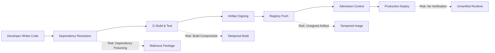
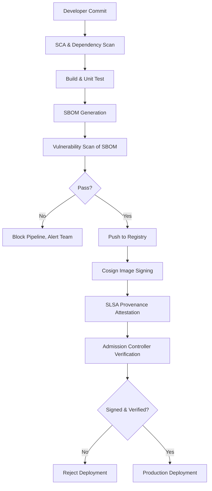

# Supply Chain Security in DevOps: Securing Your CI/CD Pipeline from Code to Container

Software supply chain attacks have emerged as one of the most damaging threat vectors in modern software development. From the SolarWinds breach to the Codecov incident and the xz-utils backdoor, adversaries have shifted their focus from attacking individual applications to compromising the build pipelines, dependencies, and artifacts that feed into every release. For DevOps teams, securing the software supply chain is no longer optional — it is a foundational requirement for trustworthy deployments.

This article walks you through the key concepts, frameworks, and practical tooling needed to build a secure CI/CD pipeline that protects your software from the moment a developer writes code to the moment a container runs in production.

## Table of Contents

- [Why Software Supply Chain Security Matters](#why-software-supply-chain-security-matters)
- [Understanding the Attack Surface](#understanding-the-attack-surface)
- [Core Frameworks: SLSA and the Supply Chain Levels](#core-frameworks-slsa-and-the-supply-chain-levels)
- [Software Bill of Materials (SBOM)](#software-bill-of-materials-sbom)
- [Image Signing and Verification with Sigstore](#image-signing-and-verification-with-sigstore)
- [Provenance Attestation in Practice](#provenance-attestation-in-practice)
- [Securing Dependencies with SCA and Version Pinning](#securing-dependencies-with-sca-and-version-pinning)
- [Harden Your CI/CD Runner and Secrets Management](#harden-your-cicd-runner-and-secrets-management)
- [End-to-End Example: A Secured GitHub Actions Pipeline](#end-to-end-example-a-secured-github-actions-pipeline)
- [Putting It All Together: A Supply Chain Security Workflow](#putting-it-all-together-a-supply-chain-security-workflow)
- [Key Takeaways](#key-takeaways)
- [Frequently Asked Questions](#frequently-asked-questions)
- [Related Articles](#related-articles)

## Why Software Supply Chain Security Matters

Traditional application security focuses on runtime vulnerabilities — patching CVEs in deployed services, hardening network policies, and scanning for misconfigurations. Supply chain security extends this boundary upstream to every component, tool, and process that contributes to building and releasing your software.

The implications are severe. A compromised build server can inject malicious code into every artifact it produces. A poisoned dependency can exfiltrate secrets from your build environment. A tampered container image can introduce a backdoor into production with no visible change in your application code.

According to the 2025 Sonatype State of the Software Supply Chain report, supply chain attacks increased by 245% year-over-year, with open-source ecosystems being the primary vector. The cost of a single supply chain compromise now averages over $4.6 million when accounting for incident response, lost trust, and regulatory penalties.

> **Important:** Supply chain security is not a single tool or a one-time audit. It is a set of practices embedded into every stage of your CI/CD pipeline — from dependency selection to artifact delivery.

## Understanding the Attack Surface

A modern DevOps pipeline involves multiple touchpoints, each of which can be exploited:

- **Source Code Repositories:** Compromised developer credentials, malicious pull requests, or branch protection bypass.
- **Dependencies:** Transitive dependencies pulling in malicious packages (typosquatting, dependency confusion).
- **Build Systems:** Unpinned build runner images, exposed build logs, or compromised build agents.
- **Artifact Registries:** Unsigned images, unsigned packages, or misconfigured registry access controls.
- **Deployment Pipelines:** Overly permissive service accounts, plaintext secrets in pipeline configs, or unvalidated image signatures.



Each arrow in the diagram above represents a trust boundary. Your job is to verify integrity at every handoff.

## Core Frameworks: SLSA and the Supply Chain Levels

[SLSA](https://slsa.dev) (Supply-chain Levels for Software Artifacts) is an open-source framework created by Google that defines progressive security levels for software supply chains. Think of it as an OWASP-style maturity model specifically for CI/CD integrity.

| SLSA Level | Requirement | Example Controls |
|---|---|---|
| Level 0 | No guarantees | Manual builds, no audit logs |
| Level 1 | Build process documented | Build scripts in source control, basic logging |
| Level 2 | Hosted build service with provenance | GitHub Actions with SLSA provenance generation |
| Level 3 | Hardened build platform, isolated, non-falsifiable provenance | Hermetic builds, Sigstore signing, reproducible builds |
| Level 4 | Two-person review, hermetic, signed provenance | Dual-approver gates, verified build environments |

Most organizations should target SLSA Level 2 or 3 as a practical starting point. Reaching Level 3 requires hermetic builds and non-falsifiable provenance, which significantly raises the bar against pipeline compromise.

## Software Bill of Materials (SBOM)

An SBOM is a machine-readable inventory of every component, library, and dependency that went into building your software artifact. It is the foundational artifact for supply chain security — without it, you cannot identify vulnerable components, license violations, or compromised packages.

### Popular SBOM Formats

- **SPDX (Software Package Data Exchange):** An ISO standard (ISO/IEC 5962:2021) maintained by the Linux Foundation. Widely adopted in enterprise and regulatory contexts.
- **CycloneDX:** An OWASP project focused on application security use cases. Integrates tightly with vulnerability scanning and license compliance tools.
- **Syft:** A CLI tool by Anchore that generates SBOMs in both SPDX and CycloneDX formats from container images, filesystems, and archives.

### Generating an SBOM

With Syft installed, generating an SBOM for a Docker image is straightforward:

```bash
# Generate an SPDX SBOM for a container image
syft myregistry.io/myapp:latest -o spdx-json > sbom-spdx.json

# Generate a CycloneDX SBOM
syft myregistry.io/myapp:latest -o cyclonedx-json > sbom-cdx.json
```

Once generated, you can scan the SBOM for known vulnerabilities using tools like Grype:

```bash
grype sbom:./sbom-spdx.json --fail-on high
```

> **Caution:** Generating an SBOM does not by itself secure your pipeline. The SBOM must be generated deterministically (same input produces the same output), stored alongside the artifact, and verified before deployment.

## Image Signing and Verification with Sigstore

Image signing ensures that the container image your cluster pulls is the exact image your CI pipeline produced — unaltered and untampered. [Sigstore](https://www.sigstore.dev/) provides a keyless signing infrastructure that eliminates the need to manage long-lived signing keys.

### How Keyless Signing Works

With Sigstore's `cosign` tool, signing uses short-lived certificates issued by a Fulcio certificate authority. The certificate is tied to your identity (OIDC token from GitHub Actions, for example) and the resulting signature is stored in Rekor, a tamper-proof transparency log.

```bash
# Sign a container image (keyless, using OIDC identity)
cosign sign myregistry.io/myapp:latest

# Verify the signature
cosign verify myregistry.io/myapp:latest \
  --certificate-identity=github.com/myorg/myapp/.github/workflows/build.yml@refs/heads/main \
  --certificate-oidc-issuer=https://token.actions.githubusercontent.com
```

### Enforcing Signature Verification at the Cluster

With [Kyverno](https://kyverno.io/) or [OPA Gatekeeper](https://open-policy-agent.github.io/gatekeeper/), you can enforce that only signed images are admitted into your cluster:

```yaml
# Kyverno ClusterPolicy to enforce image signature verification
apiVersion: kyverno.io/v1
kind: ClusterPolicy
metadata:
  name: require-image-signature
spec:
  validationFailureAction: Enforce
  background: false
  rules:
    - name: check-image-signature
      match:
        any:
          - resources:
              kinds:
                - Pod
      verifyImages:
        - imageReferences:
            - "myregistry.io/*"
          attestors:
            - entries:
                - keys:
                    publicKeys: |-
                      -----BEGIN PUBLIC KEY-----
                      <YOUR_COSIGN_PUBLIC_KEY>
                      -----END PUBLIC KEY-----
                  rekor:
                    url: https://rekor.sigstore.dev
```

## Provenance Attestation in Practice

Provenance answers the question: "How exactly was this artifact built?" It is a signed, verifiable record of the build process that includes the source repository, build instructions, build environment, and output artifact.

SLSA provenance is typically generated as an in-toto attestation attached to the OCI image or stored alongside the SBOM. GitHub Actions provides built-in SLSA provenance generation through the `slsa-framework/slsa-github-generator` action:

```yaml
# Generate SLSA provenance as part of the build
- name: Build and push
  id: build
  uses: docker/build-push-action@v6
  with:
    push: true
    tags: myregistry.io/myapp:${{ github.sha }}

- name: Generate SLSA provenance
  uses: slsa-framework/slsa-github-generator/actions/generator/container@v2.1.0
  with:
    image: myregistry.io/myapp
    digest: ${{ steps.build.outputs.digest }}
    registry-username: ${{ secrets.REGISTRY_USERNAME }}
    registry-password: ${{ secrets.REGISTRY_PASSWORD }}
```

When a deployment system pulls the image, it can verify provenance attestation to confirm the image was built by the expected pipeline, from the expected source, using unmodified build instructions.

## Securing Dependencies with SCA and Version Pinning

Software Composition Analysis (SCA) tools scan your dependencies against known vulnerability databases. Pairing SCA with strict version pinning drastically reduces the risk of dependency confusion and typosquatting attacks.

### Best Practices for Dependency Security

1. **Pin all dependencies** with exact versions and checksums. In npm, use `package-lock.json` and a lockfile-only install. In Python, use `pip-compile` or `poetry.lock`. In Go, ensure `go.sum` is committed.
2. **Use a private registry mirror** (Artifactory, Nexus, or GitHub Package Registry) that proxies public registries and blocks packages that fail integrity checks.
3. **Run SCA scans in CI** using tools like Snyk, Trivy, or OWASP Dependency-Check. Fail the build on critical or high-severity vulnerabilities.
4. **Enable Dependabot or Renovate** for automated dependency update PRs with security priority.
5. **Audit transitive dependencies.** A direct dependency might be safe, but a sub-dependency may not be.

```bash
# Trivy filesystem scan for vulnerable dependencies
trivy fs --severity HIGH,CRITICAL --exit-code 1 .
```

## Harden Your CI/CD Runner and Secrets Management

Your CI/CD runner is the crown jewel of your pipeline. If an attacker can execute arbitrary code on the build agent, every other control becomes moot.

### Runner Hardening Checklist

- Use **ephemeral runners** that spin up fresh instances for every build (GitHub-hosted runners, self-hosted autoscaling runners via Kubernetes).
- **Never store secrets in environment variables** that are logged. Use encrypted secret stores (HashiCorp Vault, GitHub Actions encrypted secrets with masking).
- **Restrict network access** from build runners. Build agents should only be able to reach artifact registries, package managers, and the source repository — nothing else.
- **Sign build artifacts inside the pipeline** rather than relying on external signing processes that introduce additional trust boundaries.
- **Enable audit logging** on your CI/CD platform. Monitor for unusual patterns: unexpected network calls, unexpected file writes, or credential exfiltration attempts.

## End-to-End Example: A Secured GitHub Actions Pipeline

Here is a consolidated example that ties together SBOM generation, image signing, provenance attestation, and vulnerability scanning in a single GitHub Actions workflow:

```yaml
name: Secure Build Pipeline

on:
  push:
    branches: [main]

permissions:
  id-token: write   # Required for Sigstore keyless signing
  contents: read
  packages: write

jobs:
  build-and-sign:
    runs-on: ubuntu-latest
    steps:
      - name: Checkout source
        uses: actions/checkout@v4

      - name: Run dependency vulnerability scan
        uses: aquasecurity/trivy-action@master
        with:
          scan-type: fs
          severity: HIGH,CRITICAL
          exit-code: 1

      - name: Build Docker image
        run: docker build -t myregistry.io/myapp:${{ github.sha }} .

      - name: Generate SBOM
        run: |
          syft myregistry.io/myapp:${{ github.sha }} -o spdx-json > sbom.json

      - name: Scan SBOM for vulnerabilities
        run: grype sbom:./sbom.json --fail-on critical

      - name: Login to registry
        run: echo "${{ secrets.REGISTRY_PASSWORD }}" | docker login myregistry.io -u "${{ secrets.REGISTRY_USERNAME }}" --password-stdin

      - name: Push image
        run: docker push myregistry.io/myapp:${{ github.sha }}

      - name: Sign image with Cosign
        uses: sigstore/cosign-installer@v3
      - run: cosign sign --yes myregistry.io/myapp:${{ github.sha }}

      - name: Attach SBOM to image
        run: cosign attach sbom --sbom sbom.json myregistry.io/myapp:${{ github.sha }}
```

This workflow enforces multiple supply chain controls in a single pipeline:

1. Dependency scanning **before** the build.
2. Vulnerability scanning of the SBOM **after** generation.
3. Image signing with Sigstore for tamper-proof provenance.
4. SBOM attachment so downstream consumers can inspect components.

## Putting It All Together: A Supply Chain Security Workflow

The following diagram illustrates how all these pieces fit into a complete supply chain security posture:



## Key Takeaways

- **Treat your CI/CD pipeline as a production system.** Harden runners, restrict network access, use ephemeral build agents, and log everything.
- **Generate and verify SBOMs for every artifact.** Use Syft to produce SPDX or CycloneDX SBOMs and Grype to scan them for known vulnerabilities.
- **Sign images with Sigstore/Cosign.** Keyless signing eliminates the operational burden of key management while providing cryptographic verification of image integrity.
- **Enforce SLSA Level 2 or higher.** Hosted builds with provenance generation dramatically reduce the risk of build tampering.
- **Adopt admission control at the cluster level.** Use Kyverno or OPA Gatekeeper to reject unsigned or unverified images before they reach your pods.
- **Scan dependencies early and often.** Run SCA tools before the build, pin all versions, and use private registry proxies to block suspicious packages.

## Frequently Asked Questions

### What is the difference between an SBOM and software composition analysis (SCA)?

An SBOM is a static inventory of components — it lists what is in your software. SCA is the analysis process that uses the SBOM (or scans source/lockfiles directly) to identify vulnerabilities, license risks, and outdated components. You need both: the SBOM provides the data, and SCA provides the actionable intelligence.

### How does Sigstore keyless signing work without managing private keys?

Sigstore uses short-lived OIDC tokens (for example, from GitHub Actions) to request a temporary signing certificate from the Fulcio CA. The private key for that certificate exists only in memory during the signing operation and is discarded immediately after. The signature and certificate are recorded in the Rekor transparency log, creating a tamper-proof, auditable record.

### Is SLSA Level 4 realistic for most organizations?

SLSA Level 4 requires hermetic builds, a hardened build platform, and two-person review for every change. This is achievable for high-value targets (cryptography libraries, base images, infrastructure code) but is often impractical for day-to-day application releases. Target Level 2 or 3 as your baseline and consider Level 4 for critical-path artifacts.

### What if my pipeline uses a monorepo with multiple services?

Apply supply chain controls per-service or per-artifact. Generate separate SBOMs and signatures for each image produced by the monorepo. Use build matrix strategies or monorepo-aware tools like Nx or Turboreto partition builds, and ensure each partition runs dependency scanning and signing independently.

### Can I retrofit supply chain security into an existing CI/CD pipeline?

Yes, but incrementally. Start with the highest-impact, lowest-effort controls: enable dependency scanning (Trivy, Snyk), generate SBOMs (Syft), and sign images (Cosign). Once those are in place, layer on provenance attestation and admission control. Trying to implement everything simultaneously often leads to pipeline fragility and developer friction.

## Related Articles

- [Policy as Code: Securing Kubernetes with Open Policy Agent and Kyverno](/blog/policy-as-code-securing-kubernetes-with-open-policy-agent-and-kyverno)
- [How Docker Works Internally: Layers, Namespaces, and Networking Explained](/blog/how-docker-works-internally-layers-namespaces-and-networking-explained)
- [Mastering Helm: The Complete Guide to Kubernetes Package Management](/blog/mastering-helm-the-complete-guide-to-kubernetes-package-management)
