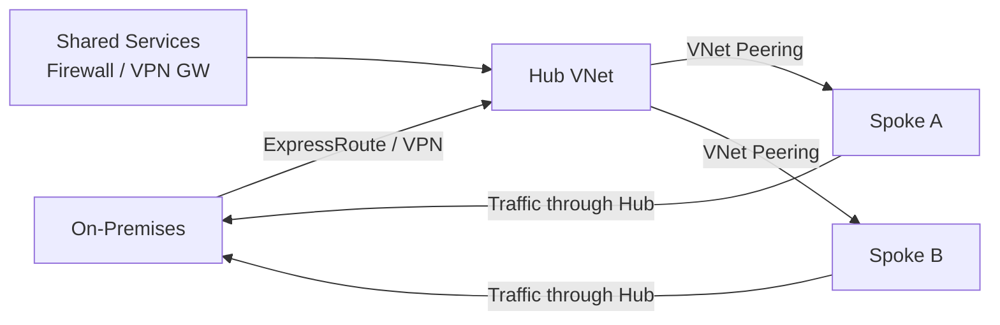
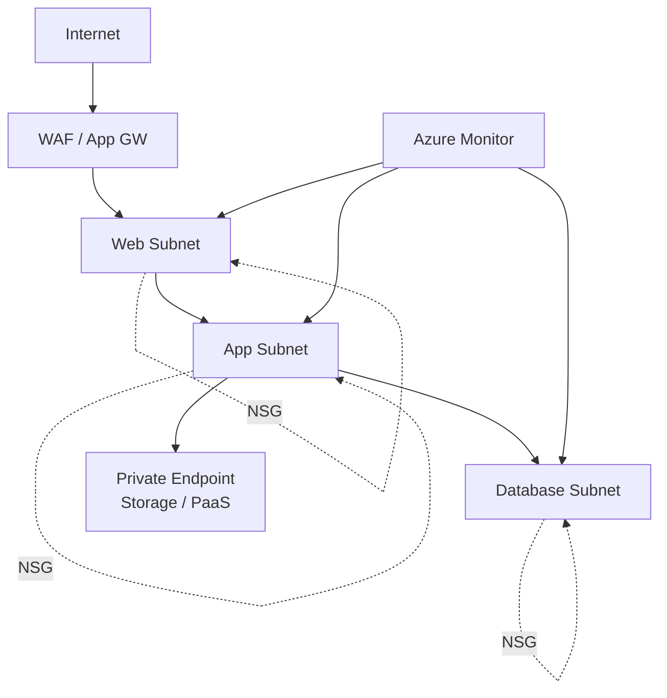

# Azure Administrator and Infrastructure Engineer Interview Handbook: 150 Questions You Must Know

Cloud infrastructure roles demand more than textbook definitions. A strong Azure Administrator or Infrastructure Engineer candidate must explain *why* a design was chosen, *how* access is secured, *what* fails, *how* recovery works, and *how* to prove the result. This guide distills 150 interview questions across the core Azure domains you need to master.

Prepared by Harish Kannuru (2026 Edition), the handbook covers Networking, Compute, Storage, Identity, Monitoring, Backup, Automation, Linux/Windows operations, and scenario-based troubleshooting. Below we walk through the key topics, recommended answer strategies, and the most important concepts you should commit to memory.

## Table of Contents

- [How to Approach Azure Interview Questions](#how-to-approach-azure-interview-questions)
- [Azure Foundations, Governance and Cost](#azure-foundations-governance-and-cost)
- [Virtual Networks, Subnets, IP and DNS](#virtual-networks-subnets-ip-and-dns)
- [Peering, VPN, ExpressRoute and Routing](#peering-vpn-expressroute-and-routing)
- [Network Security: NSGs, Firewalls and DDoS](#network-security-nsgs-firewalls-and-ddos)
- [Load Balancing and Traffic Management](#load-balancing-and-traffic-management)
- [Azure Virtual Machines and Managed Disks](#azure-virtual-machines-and-managed-disks)
- [Availability, VMSS and Patching](#availability-vmss-and-patching)
- [Storage Accounts, Blobs and Data Protection](#storage-accounts-blobs-and-data-protection)
- [Azure Files, SMB, NFS and File Sync](#azure-files-smb-nfs-and-file-sync)
- [Identity, Entra ID, RBAC and Managed Identities](#identity-entra-id-rbac-and-managed-identities)
- [Monitoring, Log Analytics and Alerts](#monitoring-log-analytics-and-alerts)
- [Backup, Recovery and Business Continuity](#backup-recovery-and-business-continuity)
- [Automation, ARM, Bicep, CLI and PowerShell](#automation-arm-bicep-cli-and-powershell)
- [Linux and Windows Operations on Azure](#linux-and-windows-operations-on-azure)
- [Scenario-Based Troubleshooting](#scenario-based-troubleshooting)
- [Key Takeaways](#key-takeaways)
- [Frequently Asked Questions](#frequently-asked-questions)

## How to Approach Azure Interview Questions

The handbook recommends a three-pass approach to every question:

1. **First pass** — Answer aloud in 60–90 seconds.
2. **Second pass** — Add a practical example.
3. **Third pass** — Explain how you would validate or troubleshoot the design.

### The Four-Part Answer Structure

Strong infrastructure answers follow a consistent structure that interviewers look for:

| Step | Purpose | Example |
|------|---------|---------|
| **Define** | State what the service or feature does | "Azure Bastion provides RDP/SSH access through the portal without public IPs on VMs" |
| **Compare** | Explain when to choose it and what trade-offs matter | "Choose Bastion over direct RDP when you want to eliminate public endpoint exposure" |
| **Operate** | Cover security, monitoring, backup and cost | "Deploy in a dedicated AzureBastionSubnet and enable diagnostic logging" |
| **Troubleshoot** | Give a verification path | "Verify NSG rules allow 443 inbound and test with portal connectivity" |

> **Important:** A strong Azure infrastructure answer is not only a definition. It explains why the design was selected, how access is secured, how health is observed, what fails, how recovery works, and how the administrator proves the result.

## Azure Foundations, Governance and Cost

Every Azure deployment starts with understanding the resource hierarchy and governance model. Interviewers test whether you can navigate the relationship between management groups, subscriptions, resource groups, and resources.

### Resource Hierarchy and RBAC

Management groups sit above subscriptions and provide policy and access inheritance. Subscriptions define billing and quota boundaries. Resource groups are lifecycle containers, and individual resources are deployed inside them.

**Azure RBAC vs. Azure Policy** is a frequent question:

- **RBAC** controls *who* can perform *actions* (authorization).
- **Azure Policy** evaluates or *enforces* what configurations are allowed (governance).

Use both together — RBAC for authorization and Policy for governance compliance.

### Cost Control Strategies

Interviewers expect a layered approach to cost management:

1. Budgets and alerts for proactive notification
2. Rightsizing VMs based on actual utilization metrics
3. Reservations or savings plans for predictable workloads
4. Autoscaling to match demand
5. Shutdown schedules for non-production environments
6. Lifecycle policies to tier or delete stale data
7. Regular cost reviews tied to business constraints

> **Key insight:** Every cost recommendation should be tied to workload usage patterns and business constraints, not just theoretical savings.

### Landing Zones

A landing zone is a pre-configured governed Azure environment with identity, networking, management, security, and subscription design ready for workloads. Microsoft distinguishes between **platform landing zones** (shared services) and **application landing zones** (workload-specific).

### Preventing Unauthorized Deployments

Assign Azure Policy at management-group or subscription scope to allow only approved locations. Use exemptions with ownership and expiry dates when exceptions are needed.


*Azure management groups, subscriptions, and resource groups form a hierarchy for policy inheritance.*

## Virtual Networks, Subnets, IP and DNS

Networking is the backbone of any Azure deployment. Start with CIDR planning to avoid overlap, since overlapping address ranges prevent direct peering.

### VNet Fundamentals

An Azure VNet is a logically isolated private network providing address space, subnets, routing, DNS, and connectivity for resources. VNets are divided into subnets to segment workloads and apply security boundaries.

**Critical fact:** Azure reserves five addresses in each subnet — the first four and the last address. Always calculate usable addresses before choosing subnet size.

### Public vs. Private IP

- **Private IP** supports internal connectivity.
- **Public IP** provides internet-reachable addressing when security rules allow it.

Prefer private access with controlled ingress whenever possible. Use static private IPs when applications or allowlists require predictable addressing.

### DNS Resolution

Azure provides default name resolution for resources in a VNet. For advanced or hybrid scenarios, configure custom DNS or Azure Private DNS zones. Private endpoints commonly depend on private DNS zones — the service FQDN must resolve to the private endpoint IP.

To validate DNS resolution, use `nslookup`, `dig`, or `Resolve-DnsName`, then verify the returned IP and DNS server. Separate name-resolution failures from transport failures.

```bash
# Validate DNS resolution for a storage account
nslookup mystorageaccount.blob.core.windows.net

# Verify the correct DNS server is responding
dig mystorageaccount.blob.core.windows.net @168.63.129.16
```

## Peering, VPN, ExpressRoute and Routing

### Hub-and-Spoke Topology

A hub-and-spoke architecture centralizes shared connectivity and security services in the hub while keeping workloads isolated in spokes.



### VNet Peering vs. VPN Gateway

| Feature | VNet Peering | VPN Gateway |
|---------|-------------|-------------|
| Connectivity | Direct Microsoft backbone | Encrypted tunnel over internet |
| Latency | Low | Higher |
| Encryption | By default, no (use NSG/Firewall) | Yes (IPsec/IKE) |
| Transitivity | Non-transitive by default | N/A |
| Cost | No gateway charge | Gateway SKU charges |

**Gateway transit** lets a peered VNet use the VPN or ExpressRoute gateway in another VNet. Configure "Use remote gateways" on one side and "Allow gateway transit" on the other.

### Routing Fundamentals

**User-Defined Routes (UDRs)** override or supplement system routes to control next-hop behavior. Common next hops include virtual appliances, gateways, and the internet.

**Forced tunneling** sends internet-bound traffic through a central security appliance or on-premises path instead of direct internet egress. Always validate return routes to avoid asymmetric routing.

Azure selects routes using **longest-prefix match** — the most specific route prefix wins. Use effective routes to confirm the actual routing decision.

### BGP

BGP dynamically exchanges routes between Azure and external networks through VPN Gateway or ExpressRoute. Avoid advertising overlapping or unintended prefixes.

## Network Security: NSGs, Firewalls and DDoS

### NSG Fundamentals

Network Security Groups filter inbound and outbound traffic using priority-based allow or deny rules at subnet or NIC scope. Lower priority numbers are evaluated first.

When NSGs exist on both subnet and NIC, traffic must be allowed by applicable rules at **both** scopes. Use effective security rules to see the combined result.

### Application Security Groups (ASGs)

ASGs logically group NICs so NSG rules can reference workload roles instead of IP addresses. They simplify rule management for dynamic environments.

### Azure Firewall vs. NSG

- **NSGs** provide distributed layer 3 and 4 filtering.
- **Azure Firewall** provides centralized, stateful network and application filtering with richer logging.

Use them as complementary controls — NSGs for distributed segmentation and Azure Firewall for centralized inspection.

### Azure Bastion

Bastion provides RDP and SSH access to VMs through the Azure portal without assigning public IPs to the VMs. Always deploy in a dedicated `AzureBastionSubnet`.

### DDoS Protection

Azure provides enhanced mitigation and monitoring for protected public IP resources in VNets. Differentiate between platform-level default protections (always on) and enhanced DDoS Protection plans.

> **Caution:** Allowing Any-to-Any traffic in NSG rules removes segmentation and increases lateral-movement exposure. Always use least privilege, ASGs, and explicit management paths.

## Load Balancing and Traffic Management

### Layer 4 vs. Layer 7

| Service | Layer | Protocol | Features |
|---------|-------|----------|----------|
| Azure Load Balancer | 4 | TCP/UDP | HA Ports, health probes, session persistence |
| Application Gateway | 7 | HTTP/S | Host/path routing, WAF, SSL termination |
| Front Door | 7 (Global) | HTTP/S | Edge-based routing, acceleration, WAF |

### Health Probes

Health probes check backend availability so unhealthy instances stop receiving new flows. A probe's path, port, and NSG access must all be correct. A healthy probe does **not** guarantee the application path is correct — always test the exact probe protocol, port, and path.

### NAT Gateway

NAT Gateway provides scalable, predictable outbound connectivity for resources in an associated subnet. It is outbound only and supports static public egress IPs.

### Session Persistence

Session persistence attempts to send a client to the same backend. Prefer stateless applications where possible to improve scalability.

## Azure Virtual Machines and Managed Disks

### VM Lifecycle States

A common interview trap: **Stopped vs. Deallocated**. A VM stopped inside the OS may still consume allocated compute. A deallocated VM releases compute allocation and compute billing stops, but disk and networking charges can continue.

### Choosing VM Sizes

Match CPU, memory, disk throughput, network bandwidth, accelerator needs, availability, and quota to workload demand. Always benchmark and rightsize using metrics.

### Managed Disks

| Disk Type | Use Case | Performance Tier |
|-----------|----------|-----------------|
| OS Disk | Operating system | Standard/Premium SSD, Ultra |
| Data Disk | Persistent application data | Standard/Premium SSD, Ultra |
| Temporary Disk | Non-persistent local storage | D/E-series local NVMe |

> **Never store irreplaceable data on temporary storage.** Temporary disks are non-persistent and can be lost during maintenance events.

### Azure Compute Gallery

The Compute Gallery stores and distributes image versions across regions and subscriptions for consistent VM deployments. Use versioning and replication for controlled rollout.

- **Generalized images** remove machine-specific identity for reusable deployment (run `deprovision` or Sysprep).
- **Specialized images** retain original machine state.

## Availability, VMSS and Patching

### Availability Sets vs. Availability Zones

- **Availability Sets** spread VMs across fault and update domains *within* a datacenter.
- **Availability Zones** place resources in *separate datacenters* within a region for broader fault isolation.

### VM Scale Sets (VMSS)

VMSS manages a group of load-balanced VMs with consistent configuration and scaling. Key concepts include:

- **Uniform orchestration** — identical instances using a scale-set model.
- **Flexible orchestration** — broader VM management and high-availability patterns.
- **Autoscale** — changes instance count based on metrics, schedules, and rules with limits and cooldown periods.
- **Automatic instance repair** — replaces unhealthy instances after a configured grace period.

### Patching

Use Azure Update Manager for assessment, schedules, and maintenance controls. Pilot patches and define rollback procedures before broad deployment.

**Ephemeral OS disks** store the OS disk on local VM storage for fast reimage and stateless use cases, but they are not suited for persistent OS-state requirements.

## Storage Accounts, Blobs and Data Protection

### Blob Types

| Blob Type | Access Pattern |
|-----------|---------------|
| Block Blob | Files and objects |
| Append Blob | Append-heavy logs |
| Page Blob | Random read/write, VHD scenarios |

### Redundancy Options

| Option | Description |
|--------|-------------|
| LRS | Three copies in one datacenter |
| ZRS | Three copies across three availability zones |
| GRS | LRS in primary + asynchronous secondary region |
| GZRS | ZRS in primary + asynchronous secondary region |

### Storage Tiers

Hot, cool, cold, and archive tiers trade storage cost against access and retrieval cost or latency. Use lifecycle management based on actual access patterns.

### Access Control

A **Shared Access Signature (SAS)** grants scoped, time-limited access to storage resources. Prefer least privilege, short expiry, and user-delegation SAS where applicable.

**Account key vs. Entra ID access:** Account keys provide broad shared-secret access. Entra ID uses identity and RBAC for controlled authorization. Prefer identity-based access and disable key access when feasible.

> **Key insight:** A successful backup job is not proof of recoverability. A successful storage configuration does not guarantee security. Always validate with independent tests.

## Azure Files, SMB, NFS and File Sync

Azure Files exposes managed SMB or NFS shares. Blob Storage provides object storage accessed through APIs and tools — choose based on file-system semantics versus object access.

| Protocol | Common Use | Port |
|----------|-----------|------|
| SMB | Windows, identity-integrated sharing | TCP 445 |
| NFS | Linux, POSIX-style workloads | TCP/UDP 2049 |

### Troubleshooting Mount Failures

For SMB mount failures, check DNS, TCP 445 reachability, credentials or identity, firewall, private endpoint, share name, and OS support. **Test network before authentication.**

For NFS mount failures, check NFS support, network access, DNS, export configuration, port 2049, and mount options. Use `mount` output and system logs for diagnostics.

### Azure File Sync

Azure File Sync synchronizes Azure file shares with Windows Servers and can provide cloud tiering for hybrid file-server scenarios.

## Identity, Entra ID, RBAC and Managed Identities

### Microsoft Entra ID

Microsoft Entra ID is the cloud identity and access service for users, groups, applications, and devices. Separate the **identity plane** from **resource authorization**.

### Role Assignment

A role assignment combines:

1. **Security principal** — user, group, service principal, or managed identity
2. **Role definition** — set of permissions (built-in or custom)
3. **Scope** — management group, subscription, resource group, or resource

### Managed Identities

- **System-assigned** — shares the resource lifecycle.
- **User-assigned** — independent and reusable across resources.

Managed identities let Azure resources obtain tokens without storing application credentials, but the identity still needs least-privilege role assignments.

### Privileged Identity Management (PIM)

PIM supports time-bound, approval-based, and audited privileged role activation. Use eligible assignments instead of permanent standing access.

### Conditional Access

Conditional Access evaluates identity and context signals to enforce access controls like MFA or compliant device requirements. Use report-only testing before broad enforcement.

> **Common mistake:** The Contributor role does not automatically grant every data action. Control-plane roles manage resources; data-plane roles authorize access to service data. Always verify both.

## Monitoring, Log Analytics and Alerts

### Azure Monitor Fundamentals

Azure Monitor collects and analyzes metrics, logs, traces, and events. Connect signals to action — dashboards alone are insufficient.

| Signal Type | Description | Best For |
|-------------|-------------|----------|
| Metrics | Numeric time-series | Fast alerting, dashboards |
| Logs | Rich records queried with KQL | Investigation, deep analysis |

### Diagnostic Settings

Diagnostic settings route platform logs and metrics to destinations such as Log Analytics, storage, or Event Hubs. Configure them explicitly per supported resource.

### Designing Actionable Alerts

Every alert should lead to a clear response. Design alerts with:

1. A meaningful signal and threshold
2. An appropriate evaluation window
3. Correct severity level
4. Defined owner and runbook
5. A suppression strategy to avoid alert storms

### Data Collection Rules

A DCR defines what telemetry is collected and where it is sent. Check associations when expected logs are missing.


*Azure Monitor collects signals from Azure resources and routes them for analysis and alerting.*

## Backup, Recovery and Business Continuity

### RPO and RTO

- **RPO (Recovery Point Objective)** — acceptable data loss measured in time.
- **RTO (Recovery Time Objective)** — acceptable service restoration time.

Drive architecture decisions from business-defined RPO and RTO targets.

### Backup vs. Snapshot

A snapshot is a point-in-time copy tied closely to the storage platform. Backup adds policy, retention, and recovery management. Clarify operational recovery versus long-term protection.

### Backup Consistency Levels

| Level | Description |
|-------|-------------|
| Application-consistent | Captures data after coordinating application writes |
| File-system-consistent | Ensures file system integrity |
| Crash-consistent | No application coordination — equivalent to power loss |

### Azure Site Recovery (ASR)

ASR orchestrates replication, failover, and failback for supported workloads. Test failover without affecting production. Cross-region restore allows recovery from a secondary region when configured and available.

### Multi-Tier DR Planning

For disaster recovery of multi-tier applications:

1. Map dependencies between tiers
2. Sequence recovery operations
3. Replicate required data
4. Pre-build networking in the DR region
5. Automate failover procedures
6. Test regularly and include DNS, identity, and external integrations

> **Critical reminder:** A successful backup job is not proof of recoverability. Periodic restore tests are essential.

## Automation, ARM, Bicep, CLI and PowerShell

### Infrastructure as Code (IaC)

IaC provides repeatability, version control, review, consistency, and automation. Treat templates and modules as production code.

### ARM Templates vs. Bicep

Bicep is a concise Azure-native declarative language that compiles to ARM templates. Use modules and parameter files for reuse across environments.

**Idempotent** deployments mean repeated runs converge on the declared state without unnecessarily recreating unchanged resources. Understand resource-specific replacement behavior.

### Deployment Modes

- **Incremental** — adds or updates declared resources.
- **Complete** — can remove undeclared resources at the target scope (use carefully).

### Secrets in Automation

Use managed identities, Key Vault references, and secure pipeline secret handling. **Never commit secrets to source control.**

### Production-Ready Scripts

Scripts should include validation, idempotency, structured logging, error handling, retry logic, least privilege, and tests. Include a safe rollback or remediation path.

```bash
# Example: checking Azure CLI context before deployment
az account show --output table
az deployment group what-if \
  --resource-group myResourceGroup \
  --template-file main.bicep \
  --parameters parameters.json
```

## Linux and Windows Operations on Azure

### Linux Operations

Key commands every Azure admin should know:

| Purpose | Command |
|---------|---------|
| Service health | `systemctl status <service>` |
| Service logs | `journalctl -u <service>` |
| Listening ports | `ss -tulpn` |
| Disk usage | `df -h` |
| NFS verification | `mount \| grep nfs` |
| Package update | `apt update` |
| Package upgrade | `apt upgrade` |

For Linux disk pressure, use `df`, `du`, inode checks, logs, and process/file inspection. Check deleted-but-open files that still consume disk space.

### Windows Operations

For RDP failures, check VM state, NSG, route, public/private path, Windows firewall, RDP service, NLA, and credentials. Use Bastion or VMAccess where appropriate.

Inspect Windows events using Event Viewer or PowerShell to review System, Application, and service-specific logs. Correlate timestamps with platform activity logs.

### Securing Admin Access

Use private connectivity, Bastion or approved jump paths, MFA, PIM, JIT, and endpoint controls. Avoid persistent public management ports.

> **Best practice:** Always monitor the Azure VM agent. The agent supports extensions and management operations — agent failure can break extension provisioning and automation.

## Scenario-Based Troubleshooting

The final section of the handbook presents real-world scenarios. Here are the most critical ones:

### VM Cannot Reach a Storage Private Endpoint

Start with DNS — public resolution is the most frequent cause. Then validate private DNS resolution, endpoint approval, subresource, VNet connectivity, NSG, route, storage firewall, and client authentication.

### Load Balancer Reports Unhealthy Backends

Check application listener, probe protocol/port/path, NSG, host firewall, backend pool, route, and service binding. Test locally and from the network path.

### Peered Spoke Cannot Reach On-Premises

Gateway transit, remote-gateway use, UDRs, BGP routes, security rules, or return paths may be missing. Remember: peering is not automatically transitive.

### Storage Access Works with Key but Fails with Entra ID

The identity may lack the required data-plane role, scope, token audience, or propagation. Management-plane Contributor may be insufficient for data operations.

### Designing a Secure Three-Tier Application

Use segmented subnets, least-privilege NSGs or ASGs, controlled ingress, private endpoints, managed identity, diagnostics, backup, and zone-aware availability. Explain traffic flow and failure handling end to end.



## Key Takeaways

- **Structure every answer** using the Define → Compare → Operate → Troubleshoot framework.
- **DNS is the first thing to check** in most networking and connectivity failures — public resolution often overrides private endpoints.
- **Prefer identity-based access** over account keys for storage and service access.
- **Never trust a backup job alone** — validate recoverability with periodic restore tests.
- **Peering is non-transitive by default** — design routing explicitly for hub-and-spoke topologies.
- **Minimize public exposure** — use Bastion, private endpoints, NAT Gateway, and least-privilege NSG rules.

## Frequently Asked Questions

### What is the difference between Azure RBAC and Azure Policy?

RBAC controls *who* can perform actions (authorization), while Azure Policy evaluates or enforces *what* configurations are allowed (governance). Use both together — RBAC for access control and Policy for compliance enforcement.

### When should I use Azure Load Balancer vs. Application Gateway?

Use Azure Load Balancer (layer 4) for TCP/UDP workloads that don't need HTTP inspection. Use Application Gateway (layer 7) when you need HTTP/S routing, host headers, path-based routing, SSL termination, or WAF protection.

### How do I troubleshoot a VMSS that fails to scale out?

Check quota limits, regional capacity, image availability, networking constraints, extension health, and policy restrictions. Review the activity log and instance provisioning state to identify the specific failure point.

### What is the difference between stopped and deallocated VM states?

A stopped VM (via the OS) still consumes allocated compute and incurs charges. A deallocated VM releases compute allocation, stopping compute billing. However, disk and networking charges may continue in both states.

### How should I approach multi-tier disaster recovery planning?

Map all dependencies between tiers, sequence recovery operations by priority, replicate required data to the secondary region, pre-build networking configuration, automate failover procedures, and test regularly. Include DNS, identity, and external integrations in your DR plan.

## Related Articles

- Azure Networking Deep Dive: Hub-and-Spoke vs. Virtual WAN
- Mastering Azure RBAC: From Built-in Roles to Custom Policies
- Azure Site Recovery Step-by-Step: Protecting Multi-Tier Applications
- Infrastructure as Code with Bicep: Patterns for Enterprise Deployments
