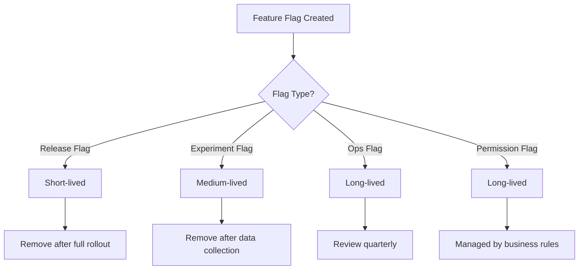
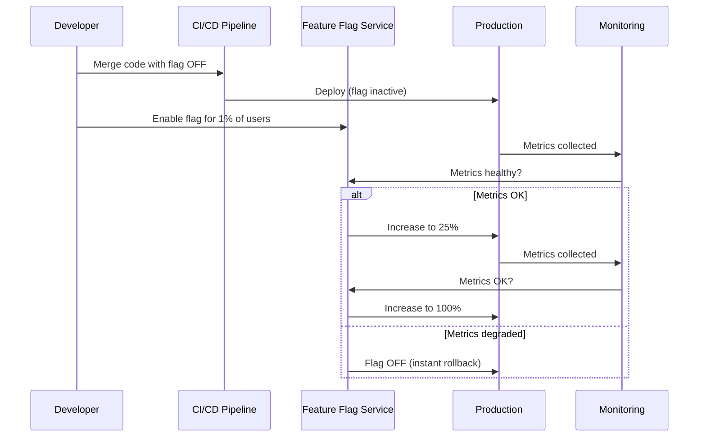

# Feature Flags in DevOps: The Complete Guide to Progressive Delivery and Safe Releases

Deploying code to production and actually releasing it to users are two fundamentally different activities. For decades, these two actions were tightly coupled — you deployed, and everyone got the new version simultaneously. Feature flags break this coupling, giving engineering teams surgical control over who sees what, when, and why. In a DevOps culture that prizes velocity and reliability in equal measure, feature flags have become one of the most powerful — and most underestimated — tools in the modern delivery toolkit.

This guide covers what feature flags are, how they fit into a progressive delivery strategy, the different types you will encounter, implementation patterns, tooling, governance best practices, and real-world examples of teams using feature flags to ship faster with less risk.

## Table of Contents

- [What Are Feature Flags?](#what-are-feature-flags)
- [Why Feature Flags Matter in DevOps](#why-feature-flags-matter-in-devops)
- [Types of Feature Flags](#types-of-feature-flags)
- [Progressive Delivery: The Bigger Picture](#progressive-delivery-the-bigger-picture)
- [Implementation Patterns](#implementation-patterns)
- [Tooling Landscape in 2026](#tooling-landscape-in-2026)
- [Governance and Flag Hygiene](#governance-and-flag-hygiene)
- [Real-World Example: Canary Rollout with Feature Flags](#real-world-example-canary-rollout-with-feature-flags)
- [Common Pitfalls](#common-pitfalls)
- [Key Takeaways](#key-takeaways)
- [Frequently Asked Questions](#frequently-asked-questions)
- [Related Articles](#related-articles)

## What Are Feature Flags?

A feature flag (also called a feature toggle or feature switch) is a boolean or multi-variant variable in your codebase that controls whether a specific piece of functionality is active or inactive at runtime. Instead of deploying new code and immediately exposing it to all users, you wrap the new behavior behind a flag and evaluate it in real time.

At its simplest, a feature flag looks like this:

```python
if feature_flags.is_enabled("new_checkout_flow", user=current_user):
    return new_checkout_page()
else:
    return legacy_checkout_page()
```

The flag acts as a gate. The code is already deployed, but the experience is not yet turned on. This decoupling of **deployment** (getting code to production) from **release** (making it visible to users) is the foundational concept behind modern progressive delivery.

Feature flags are not a new idea — they have roots in conditional compilation and compiler directives going back decades. But the cloud-native DevOps movement has elevated them from a niche technique to a first-class practice in continuous delivery pipelines.

> **Important:** Feature flags introduce conditional branches into your code. Every flag is a decision point, and decision points accumulate technical debt. Treat feature flags as temporary code that must be cleaned up, not permanent architecture.

## Why Feature Flags Matter in DevOps

Feature flags address several pain points that DevOps teams face daily:

### 1. Reduced Deployment Risk

Instead of a single "big bang" release, feature flags let you deploy code that is inactive by default and then gradually expose it to a small percentage of users. If something goes wrong, you toggle the flag off — no rollback, no redeployment.

### 2. Faster Feedback Loops

You can release features to internal teams first, then to a beta cohort, then to the general public — all without new deployments. This accelerates the feedback loop between building and learning.

### 3. A/B Testing and Experimentation

Multi-variant flags allow you to serve different experiences to different user segments simultaneously and measure which performs better. This data-driven approach replaces opinions with evidence.

### 4. Environment-Specific Behavior

Flags let you enable a feature in staging while keeping it off in production, or enable it only in a specific geographic region. This granularity is difficult to achieve with branch-based workflows alone.

### 5. Instant Rollback

When a production incident occurs, the fastest mitigation is often to turn off the offending feature flag. There is no code change, no deployment, and no pipeline to re-run — just a configuration change that propagates in seconds.

| Benefit | Traditional Release | Feature Flag Release |
|---|---|---|
| Rollback speed | Minutes (redeploy) | Seconds (toggle off) |
| Blast radius | 100% of users | Configurable (1% → 50% → 100%) |
| Testing in prod | Not possible | Canary and ring-based rollouts |
| Experimentation | Separate tooling | Built-in via multi-variant flags |

## Types of Feature Flags

Not all feature flags are created equal. Understanding the different types helps you apply the right governance model and avoid turning your codebase into a maze of unmanaged toggles.

### Release Flags

Release flags control the rollout of new features. They are short-lived by design — created when a feature enters development and removed after the feature is fully rolled out and stable. This is the most common type of feature flag in a DevOps context.

### Experiment Flags

Experiment flags power A/B tests and multivariate experiments. They are typically medium-lived and are tied to a specific hypothesis. The flag does not go away until the experiment has collected enough data to reach a statistically significant conclusion.

### Ops Flags

Ops flags control operational behavior. Think of them as circuit breakers or rate limiters: they let you degrade gracefully under load, disable a non-essential feature during an incident, or switch between infrastructure backends without redeploying.

### Permission Flags

Permission flags control access based on user attributes — entitlements, subscription tier, or admin status. These are long-lived and often managed by business logic rather than engineering.



## Progressive Delivery: The Bigger Picture

Feature flags are a critical building block, but they are most powerful when combined into a broader **progressive delivery** strategy. Progressive delivery is the evolution of continuous delivery — it adds controlled exposure and real-time feedback on top of the deployment pipeline.

The progressive delivery pipeline typically follows these stages:

1. **Deploy** — Ship the code to production with the feature flag off.
2. **Canary** — Enable the flag for 1% of traffic. Monitor error rates, latency, and business metrics.
3. **Ramp** — Gradually increase exposure: 5%, 25%, 50%, 100%.
4. **Complete** — Remove the flag and clean up the code.

This is sometimes called a **ring-based rollout** or **percentage-based deployment**. Tools like Flagger, Argo Rollouts, and LaunchDarkly integrate with your service mesh or load balancer to automate this progression.



## Implementation Patterns

There are several established patterns for implementing feature flags. Each has trade-offs in terms of simplicity, flexibility, and maintenance burden.

### Simple Boolean Toggle

The most basic pattern — a true/false check that gates a code path:

```java
if (featureService.isEnabled("dark_mode")) {
    applyDarkTheme();
} else {
    applyLightTheme();
}
```

This works well for release flags but becomes unwieldy for multi-variant experiments.

### User Segmentation

Flag evaluations are based on user attributes rather than a simple boolean:

```javascript
const variant = featureFlags.getVariant("pricing_page_redesign", {
    userId: user.id,
    country: user.country,
    plan: user.subscriptionTier
});
```

This pattern is essential for A/B testing and targeted rollouts.

### Configuration-Based Flags

Instead of a boolean, the flag returns a configuration object:

```yaml
# Flag configuration
new_search_algorithm:
  enabled: true
  variants:
    control:
      weight: 50
    algorithm_v2:
      weight: 30
    algorithm_v3:
      weight: 20
  parameters:
    max_results: 20
    timeout_ms: 500
```

This approach is common in experimentation platforms and supports complex feature behavior beyond on/off.

### Kill Switch Pattern

Ops flags used as emergency circuit breakers:

```python
try:
    result = call_expensive_third_party_api()
except Exception:
    if feature_flags.is_enabled("third_party_api_fallback"):
        return cached_response()
    raise
```

## Tooling Landscape in 2026

The feature flag management space has matured significantly. Here is a comparison of the leading options:

| Tool | Type | Open Source | Self-Hosted | Notable Feature |
|---|---|---|---|---|
| **Unleash** | Platform | Yes | Yes | Strong open-source community, proxy architecture |
| **LaunchDarkly** | SaaS | No | No | Enterprise-grade, deep integrations |
| **Flipt** | Platform | Yes | Yes | Lightweight, Git-backed configuration |
| **Flagsmith** | Platform | Yes | Yes | Remote config + feature flags combined |
| **OpenFeature** | SDK Standard | Yes | N/A | Vendor-neutral flag evaluation API |
| **ConfigCat** | SaaS | No | Yes | Developer-friendly, simple SDK |

> **Caution:** Avoid hardcoding feature flags directly in environment variables or config files without a management layer. Without a central dashboard, flag states become invisible to the team and impossible to audit or roll back quickly.

### OpenFeature: The Vendor-Neutral Standard

One notable development in 2026 is the maturation of **OpenFeature**, a CNCF sandbox project that provides a vendor-neutral specification for feature flag evaluation. It defines a common API and SDK contract so that teams can switch between flag providers without rewriting application code. This is analogous to what OpenTelemetry did for observability — abstracting the vendor layer and giving teams flexibility.

## Governance and Flag Hygiene

Feature flags are powerful, but they carry a hidden cost: every flag is a branch in your code, and every branch is a testing surface. Without governance, flag debt accumulates silently and makes your codebase brittle.

### The Flag Lifecycle

Every feature flag should have a documented lifecycle:

1. **Creation** — Log the flag, its purpose, owner, and expected removal date.
2. **Evaluation** — Periodically check whether the flag is still needed.
3. **Removal** — Once the feature is stable, remove the flag and the old code path.

A useful heuristic is the **flag budget**: each team agrees on a maximum number of active flags at any time. When the budget is full, a flag must be cleaned up before a new one is created.

### Best Practices

- **Name flags semantically**, not functionally. Use `enable_new_checkout_flow` rather than `flag_123`.
- **Set expiry dates** on release flags. If a flag has been active for more than 90 days, it needs a review.
- **Use a central dashboard** so every engineer can see which flags are on, who owns them, and when they expire.
- **Audit flag changes** alongside code changes. Treat flag state changes as events worth tracking.
- **Test both paths.** Your CI pipeline should exercise code with the flag both on and off to catch regressions in dormant code paths.

## Real-World Example: Canary Rollout with Feature Flags

Imagine your team is rolling out a new payment processing service. Here is how feature flags enable a safe canary deployment:

**Step 1: Deploy with the flag off**

```yaml
# feature-flags.yaml
payment_service_v2:
  enabled: false
  description: New payment service with Stripe Connect integration
  owner: payments-team
  expiry: 2026-12-15
```

The code is in production but inactive. All existing requests continue to hit the legacy payment service.

**Step 2: Enable for internal users**

The team flips the flag on for internal email addresses only. They process test transactions and verify logging, error handling, and monitoring dashboards.

**Step 3: Canary at 1%**

The flag is opened to 1% of production traffic. The monitoring system watches for:

- Error rate spike in `payment_service_v2`
- Latency P99 exceeding SLA thresholds
- Revenue impact compared to the legacy service

**Step 4: Ramp to 25%, then 50%, then 100%**

Each stage is gated by an automated check. If any metric degrades beyond the defined threshold, the rollout pauses or reverses.

**Step 5: Clean up**

Once the new payment service is handling 100% of traffic and running stably for two weeks, the team removes the flag and decommissions the legacy code path.

## Common Pitfalls

Even experienced teams stumble with feature flags. Here are the most frequent mistakes:

- **Flag proliferation** — Creating too many flags without a removal strategy leads to combinatorial explosion in testing.
- **Dead code** — Forgetting to remove old code paths after a flag is fully rolled out. Over time, this bloats the codebase.
- **Inconsistent state** — Services in a microservices architecture may have different flag states, leading to subtle integration bugs.
- **Lack of observability** — Not tracking which flag variant a request used makes debugging production issues harder.
- **Shared flag namespaces** — Multiple teams using the same flag name without coordination causes conflicts.

> **Tip:** Instrument your application to log the flag state for every request. When a bug surfaces in production, you should be able to correlate the issue with the active feature flags. Tools like OpenTelemetry can attach flag state as span attributes.

## Key Takeaways

- **Feature flags decouple deployment from release**, allowing teams to ship code safely and control exposure at runtime.
- **There are four main types of flags** — release, experiment, ops, and permission — each with different lifecycle and governance needs.
- **Progressive delivery** combines feature flags with automated rollouts to provide canary deployments, instant rollbacks, and data-driven release decisions.
- **Flag hygiene is critical.** Treat flags as temporary code with expiry dates, ownership, and budgets to prevent technical debt.
- **OpenFeature** is emerging as a vendor-neutral standard for feature flag evaluation, much like OpenTelemetry did for observability.
- **Invest in observability.** Log flag state as part of every request to make production debugging faster and more reliable.

## Frequently Asked Questions

### Do feature flags replace CI/CD pipelines?

No. Feature flags complement CI/CD pipelines. The pipeline handles build, test, and deployment automation. Feature flags handle runtime behavior control. You still need a robust pipeline — feature flags add a layer of release management on top of it.

### How many feature flags is too many?

There is no universal number, but teams typically find that more than 50 active flags per service becomes difficult to manage. Establish a **flag budget** per team or service and enforce cleanup sprints when the budget is exceeded.

### Can feature flags be used in mobile apps?

Yes. Mobile teams use feature flags extensively. SDKs from providers like LaunchDarkly and Unleash support iOS, Android, and Flutter. The key difference is that mobile deployments are slower (app store review cycles), so release flags tend to be longer-lived than on web platforms.

### What is the difference between feature flags and configuration management?

Configuration management controls infrastructure and environment settings (database URLs, API endpoints, feature toggles). Feature flags specifically control application-level behavior visible to users. In practice, there is overlap — some teams store feature flags within their configuration management system. The distinction matters more for governance than for technical implementation.

### How do feature flags affect testing?

Feature flags increase the number of code paths your tests must cover. Best practices include: testing both the enabled and disabled states in CI, using a flag-aware test harness, and maintaining a test matrix for multi-variant flags. Without this, dormant code paths can rot and break when finally activated.

## Related Articles

- [Push vs Pull Deployment Models — Understanding GitOps and Continuous Delivery](/blog/push-vs-pull-deployment-models)
- [OpenTelemetry in DevOps: Unified Traces, Metrics, and Logs for Modern Observability](/blog/opentelemetry-devops)
- [Supply Chain Security in DevOps: Securing Your CI/CD Pipeline from Code to Container](/blog/supply-chain-security-devops)
- [Platform Engineering in 2026: Building Your Internal Developer Platform from Scratch](/blog/platform-engineering-2026)
