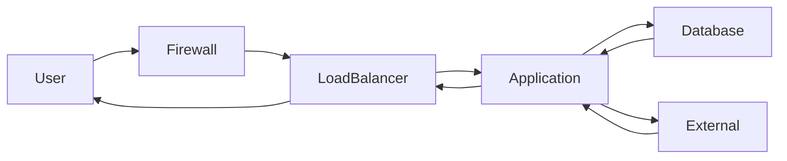
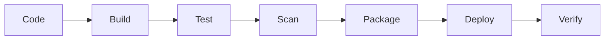

# What It Actually Takes to Become a Senior DevOps Engineer

The title "Senior DevOps Engineer" isn't earned by memorizing a handful of CLI commands or deploying a single Kubernetes cluster. It's earned by understanding how systems connect, fail, and recover — and by thinking beyond the immediate task to consider the blast radius of every decision.

This guide distills the core competencies that define senior-level DevOps work, drawn from production realities across Linux, networking, cloud architecture, infrastructure as code, containers, CI/CD, observability, reliability engineering, security, data, performance, disaster recovery, and cost management. If you're building toward that senior role, this is the map.

## Table of Contents

- [Think in Systems, Not Tools](#think-in-systems-not-tools)
- [Linux Beyond Basic Commands](#linux-beyond-basic-commands)
- [Networking You Must Actually Understand](#networking-you-must-actually-understand)
- [Cloud Architecture and Failure Domains](#cloud-architecture-and-failure-domains)
- [Infrastructure as Code](#infrastructure-as-code)
- [Kubernetes Beyond kubectl](#kubernetes-beyond-kubectl)
- [Containers in Production](#containers-in-production)
- [CI/CD as a Production System](#cicd-as-a-production-system)
- [Production Deployment Strategies](#production-deployment-strategies)
- [Observability and Production Signals](#observability-and-production-signals)
- [Reliability Engineering](#reliability-engineering)
- [Incident Response and On-Call](#incident-response-and-on-call)
- [Production Troubleshooting](#production-troubleshooting)
- [Security in DevOps](#security-in-devops)
- [Data, Databases, and Caches](#data-databases-and-caches)
- [Performance Engineering](#performance-engineering)
- [Disaster Recovery and Resilience](#disaster-recovery-and-resilience)
- [Change Management](#change-management)
- [Cost, FinOps, and Engineering Tradeoffs](#cost-finops-and-engineering-tradeoffs)
- [Key Takeaways](#key-takeaways)
- [Frequently Asked Questions](#frequently-asked-questions)

---

## Think in Systems, Not Tools

A production system is far more than an application. It includes users, DNS, load balancers, firewalls, application servers, containers, databases, external services, monitoring, and more. Senior DevOps engineers understand how all the pieces connect and trace a request end to end.

### Understanding the Complete Production System

Consider a typical request flow:



Each hop is a potential failure point. A senior engineer can walk through this entire path, identify every component, and explain what happens when any one of them degrades.

### Key System-Level Concepts

- **Dependencies and Failure Domains:** Every component depends on others. A failure in one area can cascade across multiple services. Map dependencies and their impact.
- **Control Plane vs Data Plane:** The control plane manages the system (e.g., Kubernetes API server, etcd), while the data plane runs workloads (Pods, containers, traffic). They fail differently and require different troubleshooting.
- **Stateful vs Stateless:** Stateless components (web servers) don't persist data between requests. Stateful components (databases, caches, queues) need special care for backups, scaling, and failover.
- **Upstream and Downstream:** Upstream means services your application depends on. Downstream means services that depend on yours. Know both to understand the full impact of changes.
- **Blast Radius:** Always ask: *What services, users, or regions will be affected?* Consider dependencies, shared resources, and data. Make changes safely with smaller rollouts and a rollback plan.

> **Senior Mindset:** It's not just about what you change. It's about what else will be affected. Consider the full impact, communicate clearly, and plan for failure.

---

## Linux Beyond Basic Commands

Linux is the foundation of DevOps. Senior engineers go beyond basic commands — they understand how the OS works under the hood.

### Processes, Signals, and Process Trees

A process is a running program, potentially with multiple threads, forming a parent-child tree. Signals (SIGTERM, SIGKILL) control process lifecycle. Useful commands include `ps aux`, `pstree`, `top`, `kill`, and `pkill`.

### CPU, Memory, Load Average, and Pressure

Monitor CPU usage, memory usage, and system load. Load average shows processes waiting for CPU. Use real-time tools like `top`, `htop`, `vmstat`, `free`, `uptime`, and `sar` to identify resource pressure before the system becomes unstable.

### File Descriptors and Open Files

Every process uses file descriptors for files, network connections, and other resources. Too many open files causes application failures. Check with `lsof`, `ulimit -n`, and `cat /proc/<PID>/limits`.

### Filesystems, Mounts, Inodes, and Disk Pressure

Understand filesystem types (ext4, xfs). Disk full or inode full breaks applications. Use `df -h`, `du -sh`, `df -i`, `findmnt`, `mount` to diagnose.

### systemd and Service Management

systemd manages services, processes, and startup. Control services with `systemctl` and view logs with `journalctl`.

### Kernel and System Logs

Kernel logs show low-level events. System logs help troubleshoot service and application issues. Use `dmesg`, `journalctl`, and `tail -f /var/log/syslog`.

### Diagnosing a Sick Linux Host Systematically

1. Identify the symptom (slow, high CPU, no disk space, service down).
2. Check system resources (CPU, memory, disk, load).
3. Look at running processes and services.
4. Check logs (system, application, kernel).
5. Identify recent changes (deployments, config, packages).
6. Find the root cause.
7. Apply the fix.
8. Verify the system is healthy.

> Look at the whole system, not just one error. Correlate logs, metrics, and system state. Think about what changed. Solve the root cause, not just the symptom.

---

## Networking You Must Actually Understand

The network is the invisible backbone of everything you run. Understanding it deeply makes you a stronger DevOps engineer.

### Core Networking Concepts

| Concept | What It Means | Key Tools |
|---|---|---|
| **TCP/IP** | Foundation of networking; IP handles routing, TCP provides reliable delivery | `ip addr`, `ping` |
| **DNS** | Converts domain names to IP addresses; issues can break entire applications | `dig`, `nslookup` |
| **TCP Lifecycle** | 3-way handshake (SYN, SYN-ACK, ACK); connection states like ESTABLISHED, TIME_WAIT | `ss -t`, `netstat` |
| **TLS** | Encrypts data in transit; certificate issues cause connectivity failures | `openssl`, `curl -v` |
| **Routing** | Determines where packets go; understand route tables and next hops | `ip route`, `route -n` |
| **Load Balancing** | Distributes traffic across servers; L4 vs L7, health checks, session persistence | `curl -I`, cloud CLIs |
| **NAT** | Translates private IPs to public; common in cloud and home networks | `iptables -t nat -L` |
| **CIDR** | Defines IP address ranges (e.g., `192.168.1.0/24` = 256 IPs) | Manual calculation |
| **Firewalls** | Control network traffic; misconfigured rules are a common cause of outages | `iptables -L`, `ufw status` |

### Diagnosing Network Failures

- **DNS failure:** `dig`, `curl -v` — cannot resolve name, no response
- **Connection refused:** Service not listening on expected port
- **TLS failure:** Certificate or handshake issues
- **Timeout:** Packet loss, firewall blocking, wrong routing

> Use evidence, not assumptions. Check DNS, network, security, and application layers. Think about failure domains and blast radius.

---

## Cloud Architecture and Failure Domains

Senior DevOps engineers design for failure. Good cloud architecture isn't about using more services — it's about designing simple, reliable, secure, and cost-effective systems that can survive failure.

### Regions and Availability Zones

A region is a separate geographic location (e.g., `us-east-1`). An availability zone (AZ) is an isolated data center within a region with independent power, network, and cooling. Deploy across multiple AZs for resilience.

### High Availability vs Fault Tolerance

- **High Availability (HA):** Keeps your system running with minimal downtime when a component fails.
- **Fault Tolerance (FT):** Eliminates single points of failure entirely. More reliability, more cost.

### Horizontal vs Vertical Scaling

- **Vertical:** Increase CPU, memory, or storage on a single server.
- **Horizontal:** Add more servers and distribute traffic. More resilient and commonly used in the cloud.

### Autoscaling

Automatically increases or decreases instances based on demand. Uses metrics like CPU, memory, or custom metrics. Reduces costs during low traffic.

### Stateless Architecture

Stateless services don't store data locally. Any instance can handle any request. Store data in external services (databases, object storage, caches). Improves disaster recovery and global availability.

> **Senior Engineer Mindset:** What happens if this component fails? Is there a single point of failure? How will this scale? Have we tested failure scenarios? Will the system recover automatically?

---

## Infrastructure as Code

Senior DevOps engineers use IaC to build, manage, and scale reliable, secure, and repeatable infrastructure.

### Terraform Architecture

Terraform uses providers to communicate with cloud platforms. You define desired infrastructure in HCL files, and Terraform creates an execution plan and applies changes through APIs.

### State and Remote Backends

State files keep track of real infrastructure. Use remote backends (S3, Azure Storage, GCS) for team collaboration. **Never use local state in production.**

```hcl
terraform {
  backend "s3" {
    bucket = "veriqta-terraform-state"
    key    = "prod/terraform.tfstate"
    region = "us-east-1"
  }
}
```

### State Locking

Prevents multiple people from making changes simultaneously. Use DynamoDB (AWS), Blob Storage (Azure), or GCS for locking to avoid state corruption.

### Modules and Reusable Infrastructure

Modules help you reuse code and keep configurations clean. Use community or private modules, and pass variables to make them flexible.

### Environment Separation

Use separate environments (dev, staging, prod). Keep state files and configurations separate. Use workspaces or separate folders.

### Safe Infrastructure Changes

1. Use small, incremental changes.
2. Test in non-prod first.
3. Have a rollback plan.
4. Use code reviews and team approvals.
5. **Always review the execution plan before applying.** Check what will be created, changed, or destroyed.
6. Verify after apply.

### Policy as Code

Use tools like Sentinel, OPA (Open Policy Agent), or Terraform Cloud policies to enforce security, cost, and compliance rules. Prevent risky changes before they are applied.

---

## Kubernetes Beyond kubectl

Kubernetes is more than `kubectl`. Understand how it works, plan for failure, and design resilient, secure, and scalable systems.

### Control Plane Components

- **API Server:** Front end for all requests (kubectl, UI, CI/CD).
- **etcd:** Distributed database storing cluster state. If etcd is unhealthy, the cluster behaves unpredictably.
- **Scheduler:** Decides which node a Pod runs on, using resource requests, labels, taints/tolerations, and affinity rules.
- **Controller Manager:** Ensures desired state is maintained (e.g., Deployment controller recreates failed Pods).

### Core Workloads

| Workload | Purpose |
|---|---|
| **Pods** | Smallest deployable unit |
| **Deployments** | Manage stateless applications |
| **StatefulSets** | Manage stateful applications |
| **DaemonSets** | Run a Pod on every node |
| **Jobs** | Run tasks to completion |
| **CronJobs** | Run scheduled jobs |

### Health Checks

- **livenessProbe:** Restart if unhealthy.
- **readinessProbe:** Remove from service if not ready.
- **startupProbe:** Give time to start before checking.

### Services and Ingress

Services provide stable network access to Pods (ClusterIP, NodePort, LoadBalancer, Headless). Ingress manages HTTP/HTTPS routing via controllers like Nginx or AWS ALB.

### Common Failures and Debugging

| Issue | What It Means | Debug Command |
|---|---|---|
| **CrashLoopBackOff** | Container keeps failing | `kubectl logs <pod>` |
| **Pending** | Cannot schedule (resources, taints, PVCs) | `kubectl describe pod` |
| **OOMKilled** | Out of memory | `kubectl logs <pod> --previous` |
| **ImagePullBackOff** | Cannot pull image | `kubectl describe pod` |

---

## Containers in Production

Senior DevOps engineers understand how containers work under the hood, so they can troubleshoot, secure, and operate them in production.

### Images vs Containers

An image is a read-only template. A container is a running instance of an image. Many containers can be created from the same image.

### Image Layers

Images are built in layers. Layers are cached to make builds faster — only changed layers are rebuilt. Each layer represents a set of changes: base OS, runtime, dependencies, application code.

### Namespaces and cgroups

- **Namespaces** isolate container processes, network, filesystem, users, etc.
- **cgroups** limit and manage resource usage (CPU, memory).

This makes containers lightweight and isolated.

### Container Networking and Volumes

Each container gets its own network namespace. Containers are ephemeral — volumes persist data outside the container. Use bind mounts, named volumes, or volume drivers for databases and stateful apps.

### Container Security

- Scan images for vulnerabilities (e.g., `trivy image nginx:latest`).
- Use minimal base images (distroless, alpine).
- Run containers without root privileges.
- Set CPU and memory limits to prevent resource exhaustion.
- Avoid hardcoded secrets.

> Containers are ephemeral, so externalize state. Keep images small, secure, and updated. Design for observability and easy debugging.

---

## CI/CD as a Production System

Senior DevOps engineers treat CI/CD as a production system. Design, secure, monitor, and continuously improve your pipelines.

### Pipeline Architecture

A CI/CD pipeline automates the entire software delivery process through stages:



### Key Principles

- **Artifact Immutability:** Build artifacts should not change after creation. Use versioned, immutable artifacts stored in registries (Docker Hub, ECR, ACR).
- **Build Once, Deploy Everywhere:** The same artifact moves through dev, staging, and production.
- **Secrets Management:** Never hardcode secrets. Use HashiCorp Vault, AWS Secrets Manager, or Azure Key Vault.
- **Deployment Approvals:** Use manual approvals for production. Keep an audit trail. Automate checks before approval.
- **Pipeline Observability:** Monitor pipeline success and failure rates, build and deployment times. Alert on failures. Use dashboards.

### Rollbacks

Have a clear rollback strategy. Use previous immutable artifacts. Automate rollback where possible. Test rollback procedures regularly.

> A CI/CD pipeline is not just a tool. It is a critical production system. Design it to be reliable, secure, observable, and scalable.

---

## Production Deployment Strategies

Senior DevOps engineers choose the right deployment strategy for the right situation — based on risk, not fashion.

### Strategy Comparison

| Strategy | Downtime | Risk | Use Case |
|---|---|---|---|
| **Rolling** | None | Medium | Stateless apps, Kubernetes |
| **Recreate** | Yes | High | Non-critical, stateful |
| **Blue-Green** | None | Low | Critical services |
| **Canary** | None | Low | High-risk changes |
| **Feature Flags** | None | Low | Gradual rollout, A/B testing |

### Progressive Delivery

Use a combination of canary, feature flags, and A/B testing. Gradually roll out changes based on real user feedback. Monitor business and technical metrics. Minimizes risk and improves confidence.

### Database and Backward Compatibility

- Design database changes to be backward compatible.
- Use expand-and-contract pattern (add new, then remove old).
- Use versioning for APIs and schemas.
- Avoid breaking changes to contracts.

### Health Verification and Blast Radius

Check application health after deployment — monitor metrics, logs, and traces. Verify key user flows. Understand what will be affected by the deployment and limit blast radius using strategies like canary or regional rollout.

> Choose the simplest strategy that fits your risk level. Focus on reliability, not popularity.

---

## Observability and Production Signals

Observability is not just about collecting data. It is about turning data into insight, finding problems faster, and building more reliable systems.

### The Four Pillars

| Pillar | Description | Examples |
|---|---|---|
| **Metrics** | Numerical data over time showing system health | CPU, memory, request count, latency, error rates |
| **Logs** | Time-stamped text records of events | Structured JSON logs with request ID, user ID, service |
| **Traces** | Track a request through its full path across services | OpenTelemetry, Jaeger, Tempo |
| **Events** | Discrete signals of state changes | Kubernetes events, cloud provider events |

### Monitoring Methods

- **RED Method** (services): Request rate, Error rate, Duration (latency).
- **USE Method** (infrastructure): Utilization, Saturation, Errors.
- **Golden Signals** (Google): Latency, Traffic, Errors, Saturation.

### Structured Logging and Distributed Tracing

Use consistent JSON format for logs with timestamps, log level, service name, and context. Distributed tracing tracks requests across multiple services — visualize the full request flow, identify latency and failures.

### OpenTelemetry

An open standard for collecting metrics, logs, and traces. Vendor-neutral, works with many tools (Prometheus, Grafana, Jaeger, Datadog). Helps avoid vendor lock-in.

### Alerting and Cardinality

Alert on symptoms and user impact, not just infrastructure. Integrate with Slack, PagerDuty, etc. Control cardinality — high cardinality (user IDs, session IDs) increases costs and degrades performance.

> Correlate metrics, logs, traces, and events using a common identifier (trace ID, request ID) to see the full story across services.

---

## Reliability Engineering

Reliability is not an accident — it is a design choice. SRE principles help you build and operate reliable systems at scale.

### SLIs, SLOs, SLAs, and Error Budgets

- **SLIs** are measurable indicators (availability, latency, throughput, error rate).
- **SLOs** are target values for SLIs (e.g., 99.9% availability in a month).
- **SLAs** are formal contracts with customers defining consequences if SLOs aren't met.
- **Error Budget** is the failure you can afford while meeting your SLO (e.g., 99.9% SLO = 0.1% error budget = ~43 minutes downtime per month).

### Availability in Practice

Even 99.9% means real downtime:

| Target | Monthly Downtime |
|---|---|
| 99% | 7.2 hours |
| 99.9% | 43 minutes |
| 99.99% | 4.3 minutes |
| 99.999% | 26 seconds |

### Toil Reduction

Toil is manual, repetitive work that adds no long-term value — manual restarts, manual deployments, responding to repetitive alerts. SREs reduce toil through automation, better tooling, and system improvements.

### Reliability vs Delivery Speed

SREs find the right balance between shipping features and maintaining reliability. Use error budgets and risk assessment to make decisions. Faster delivery can increase risk if not managed well.

> 100% availability is usually the wrong target. All systems can and will fail. Focus on reliability, resilience, and fast recovery instead.

---

## Incident Response and On-Call

Incidents are inevitable. A structured response, clear communication, and continuous learning turn incidents into stronger, more reliable systems.

### The Incident Response Process

1. **Detect** — through monitoring, alerts, logs, user reports. Confirm it's real, not a false alarm.
2. **Triage** — quickly understand the issue: what's affected, when it started, symptoms.
3. **Classify Severity** — Critical, High, Medium, Low based on business impact.
4. **Assign Incident Commander** — to lead response with clear, centralized communication.
5. **Mitigate First** — focus on reducing user impact immediately (workarounds, scaling, failover, feature disablement).
6. **Communicate** — early, clearly, and regularly. Keep stakeholders informed. Be honest about what you know and don't know.
7. **Escalate** — when the incident is beyond your scope. Don't hesitate to call for help early.
8. **Recover** — restore full service, verify stability, monitor for recurrence.
9. **Post-Incident Review** — blameless postmortem focusing on systems, processes, and prevention.

> > A backup you have never restored is an assumption, not a recovery strategy. Don't assume — verify.

---

## Production Troubleshooting

Good engineers find the symptom. Senior engineers find the cause.

### The Senior Troubleshooting Loop

1. What is happening?
2. How big is the impact?
3. Collect data (logs, metrics, traces).
4. What could be the cause?
5. Verify your hypothesis.
6. Identify the root cause.
7. Implement the solution.
8. Confirm the issue is resolved.

If not resolved, repeat the loop.

### What Changed?

Check recent deployments, configuration changes, auto-scaling events, code commits, dependency changes (database, third-party services). Use change logs, deployment tools, and monitoring timelines.

### Common Failure Categories

| Category | Examples |
|---|---|
| **Application failures** | Bugs, memory leaks, unhandled exceptions, bad requests |
| **Infrastructure failures** | Compute, network, storage, load balancers, DNS, cloud provider issues |
| **Dependency failures** | Databases, APIs, message queues, caches |
| **Network failures** | DNS resolution, connectivity, routing, firewalls |
| **Resource exhaustion** | CPU, memory, disk full, network utilization |
| **Configuration changes** | Environment variables, feature flags, secrets, permissions |

> Be methodical and patient. Change one thing at a time. Preserve evidence. Learn and prevent recurrence.

---

## Security in DevOps

Security is not a separate team's job. It is everyone's responsibility. Build, deploy, and operate securely from day one.

### Core Security Principles

- **Least Privilege:** Give only the minimum access needed. Reduce permissions, scope, and duration. Review access regularly.
- **IAM:** Manage users, roles, and policies. Use roles instead of long-lived credentials. Apply MFA for human users.
- **Workload Identity:** Use service accounts and IAM roles for workloads. Avoid hardcoded credentials. Use short-lived, automatically rotated credentials.
- **Secrets Management:** Store in dedicated managers (Vault, AWS Secrets Manager). Never in code, images, or config files.
- **Encryption:** Encrypt data at rest and in transit. Use managed encryption services. Don't disable encryption for convenience.
- **TLS:** Use TLS for all services. Enforce modern versions (1.2 or 1.3). Manage certificates properly.
- **Network Segmentation:** Separate environments. Use VPCs, subnets, and security groups. Apply least access between tiers.
- **Container Security:** Use minimal base images, scan for vulnerabilities, avoid running as root, use read-only file systems, apply security policies (seccomp, AppArmor).
- **Kubernetes Security:** Use RBAC and least privilege. Enable pod security standards. Keep the cluster up to date.
- **Supply-Chain Security:** Use trusted sources, verify image signatures, pin versions, scan third-party components.
- **Audit Logging:** Enable logs for critical services, send to central systems, monitor for suspicious activity, keep logs immutable.

> Never trade security for a quick production fix. Temporary shortcuts create bigger incidents tomorrow.

---

## Data, Databases, and Caches

Reliable systems require reliable data. Senior DevOps engineers understand data because state changes everything.

### Relational vs NoSQL

- **Relational** (PostgreSQL, MySQL): Structured data, ACID, SQL, strong consistency.
- **NoSQL** (MongoDB, DynamoDB): Flexible schema, horizontal scale, different consistency models.

Choose based on use case, not trends.

### Key Data Concepts

- **Connection Pools:** Databases have limited connections. Use pools (HikariCP, PgBouncer). Monitor and tune pool size.
- **ACID Transactions:** Atomicity, Consistency, Isolation, Durability. Use for related changes. Keep transactions short to avoid locks.
- **Indexes:** Speed up reads. Too many indexes slow writes. Monitor and remove unused indexes.
- **Replication:** Keep multiple copies across nodes or regions for HA and read scaling. Be aware of replication lag.
- **Failover:** Automatically switch to a healthy node when primary fails. Test failover regularly.
- **Backups:** Follow the 3-2-1 rule (3 copies, 2 different media, 1 offsite). Automate backups, test restores, store in different region.

### Redis and Caching

Redis is an in-memory data store used for caching, sessions, and queues. Use TTL, event-driven invalidation, or write-through strategies. Avoid stale data. Monitor memory usage and evictions.

> State changes everything. Design infrastructure with data in mind. Reliable data means reliable systems.

---

## Performance Engineering

Good engineers make it work. Great engineers make it fast, reliable, and scalable. Measure, plan, optimize, grow.

### Core Performance Metrics

| Metric | What It Measures | Why It Matters |
|---|---|---|
| **Latency** | Time for request to get a response | Affects user experience |
| **Throughput** | Requests/tasks processed per second | Capacity planning |
| **Saturation** | Resource at or near its limit | Leads to latency, errors, timeouts |
| **CPU** | Processing and system tasks | High CPU = slow responses |
| **Memory** | Data storage for fast write | Leaks cause slowdown or crashes |
| **Disk I/O** | Read/write performance | High latency slows databases |
| **Network Throughput** | Data transferred per second | Bottlenecks impact application performance |

### Bottlenecks and Load Testing

Bottlenecks limit overall system performance — in CPU, memory, disk, network, database, or external services. Use metrics, tracing, and profiling to find them. Simulate real traffic with tools like k6, JMeter, or Locust. Test for normal, peak, and failure scenarios.

### Capacity Planning and Autoscaling

Estimate future resource needs based on growth. Consider seasonal spikes. Plan for headroom. Use real metrics (CPU, memory, custom metrics, queue depth) to trigger autoscaling. Set appropriate thresholds and cooldown periods.

### Performance Baselines

You cannot troubleshoot effectively without knowing normal behavior. Baseline key metrics, logs, and patterns. Use baselines to detect anomalies. Always ask: *Is this normal for our system?*

> Performance and capacity are not one-time tasks. They are continuous processes. Measure, plan, optimize, and improve.

---

## Disaster Recovery and Resilience

Systems will fail. Resilient engineers prepare, test, and recover. Hope is not a strategy — resilience is a design choice.

### Failure Domains and Redundancy

Understand what can fail (instance, AZ, region, service, network, power). Design to limit blast radius. Remove single points of failure. Use multiple instances, AZs, or regions.

### RTO and RPO

- **RTO (Recovery Time Objective):** Maximum acceptable time to restore service after failure.
- **RPO (Recovery Point Objective):** Maximum acceptable amount of data loss.

Both are defined per system based on business needs.

### Multi-AZ and Multi-Region

Deploy across multiple AZs to survive single-AZ failures. Use managed services (RDS Multi-AZ, EKS, ALB). For higher resilience, deploy in multiple regions using replication and global DNS.

### Circuit Breakers, Retries, and Graceful Degradation

- **Circuit Breakers:** Stop calling a failing service after repeated failures. Prevent cascading failures. Allow recovery time.
- **Retries with Exponential Backoff:** Retry with increasing delays and jitter to prevent retry storms. Set maximum retries.
- **Graceful Degradation:** Keep core functionality running during partial failures. Show fallback responses (cached data, read-only mode). Prioritize critical user journeys.

### Disaster Recovery Exercises

Run regular DR drills. Test failover and full restore processes. Validate RTO and RPO targets. Involve the whole team. Update runbooks based on lessons learned.

> A backup you have never restored is an assumption, not a strategy. A backup you can restore is real protection.

---

## Change Management

Control changes. Reduce risk. Keep systems reliable. Good change management helps you move fast without breaking things.

### Core Practices

- **Assess Risk:** Evaluate potential impact before every change. Consider what can break, likelihood, and business impact.
- **Peer Review:** Have another engineer review your changes. Catch mistakes early. Ensure standards and best practices.
- **Infrastructure Review:** Review infrastructure changes (Terraform, CloudFormation, Kubernetes manifests). Check for security, cost, scalability, and reliability.
- **Maintenance Windows:** Schedule changes during approved windows with lowest user impact.
- **Change Records:** Document every change — what, why, who, when, result. Keep records for audits and troubleshooting.
- **Deployment Verification:** Check key functionality, metrics, and logs. Confirm no unintended side effects.
- **Feature Flags:** Release features gradually without redeploying. Reduce risk by testing in production with a small percentage of users.
- **Rollback Plans:** Have a clear rollback plan before every change. Know how to quickly revert. Test rollback regularly.
- **Drift Detection:** Detect when actual infrastructure differs from expected state. Use `terraform plan`, Ansible, or Kubernetes drift detection.

> Always ask: *How do we recover if this goes wrong?* Plan for failure, not just success. This mindset separates senior engineers from the rest.

---

## Cost, FinOps, and Engineering Tradeoffs

Good engineers build systems that work. Great engineers build systems that are reliable, scalable, and cost efficient.

### Cloud Cost Fundamentals

Understand how cloud providers price services. Know the main cost drivers: compute, storage, network, and managed services. Use cost management tools (AWS Cost Explorer, Azure Cost Management). Set budgets and alerts.

### Where Costs Hide

- **Idle Resources:** Unused instances, volumes, load balancers, and IP addresses waste money. Automate cleanup.
- **Over-provisioning:** Choose the right instance type. Rightsize based on actual usage.
- **Data Transfer:** Transfer between regions and to the internet is expensive. Keep resources in the same region/VPC. Use CDNs.
- **Kubernetes:** Optimize resource requests/limits. Use cluster autoscaling. Remove unused namespaces.
- **Observability:** Logs, metrics, and traces at scale are expensive. Set retention periods, filter and sample data, choose the right storage tier.

### Rightsizing and Reserved Capacity

Continuously rightsize based on real data. Use Reserved Instances, Savings Plans, or Committed Use Discounts for predictable workloads. Compare on-demand vs reserved pricing.

### Cost Attribution

Tag resources properly (team, environment, project, cost center). Use cost allocation reports. Make cost visible to engineering teams. Hold teams accountable.

### The Reliability-Cost-Performance Triangle

Every design decision has a financial consequence. Higher reliability costs more. Higher performance costs more. The right answer is the balance that serves the business — not the most expensive or cheapest option.

> Senior engineers understand financial consequences. Consider total cost of ownership, not just initial cost.

---

## Key Takeaways

- **Think in systems, not tools.** Understand how everything connects — users, networks, DNS, load balancers, applications, databases, and monitoring.
- **Design for failure.** Assume any component can and will fail. Use redundancy, health checks, retries, and graceful degradation.
- **Observability is your superpower.** Correlate metrics, logs, traces, and events to turn data into insight and find problems faster.
- **Reliability is a design choice.** Use SLOs, error budgets, automation, and good engineering practices to build reliable, scalable systems.
- **Security is everyone's job.** Apply least privilege, encrypt everything, scan for vulnerabilities, and never trade security for a quick fix.
- **Own outcomes, not tickets.** Focus on solving real problems, communicate clearly, mentor others, and take responsibility for the impact of your work.

---

## Frequently Asked Questions

### What separates a mid-level DevOps engineer from a senior one?

It's not just about tools — it's about how you think, solve problems, and take responsibility. Senior engineers understand systems beyond individual components, predict blast radius, challenge unsafe changes, design for failure, communicate during incidents, mentor others, and own outcomes rather than merely closing tickets.

### How important is Linux knowledge for a senior DevOps engineer?

Linux is the foundation. You need to go beyond basic commands — understand processes, signals, file descriptors, systemd, kernel logs, filesystem internals, and how to systematically diagnose a sick host. The better you understand Linux, the faster you can troubleshoot, automate, and keep production systems running.

### How should I approach learning all these domains?

Start with systems thinking — understand how components connect. Then build depth in areas most relevant to your current role (Linux, networking, cloud, Kubernetes, etc.). Focus on production realities, not just certifications. Practice by building, breaking, and debugging real systems.

### What is the most common mistake junior engineers make when trying to reach senior level?

Focusing on learning many tools without understanding the underlying systems. Senior engineers don't need to know everything — they need to know how to find answers, think critically, and understand the broader impact of their decisions.

---

## Related Articles

- Understanding Kubernetes Resource Requests and Limits
- A Practical Guide to Terraform State Management
- How to Build Effective CI/CD Pipelines in 2026
- Observability vs Monitoring: What's the Difference?
- Designing for Failure: Cloud Architecture Best Practices
