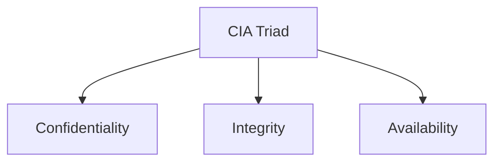
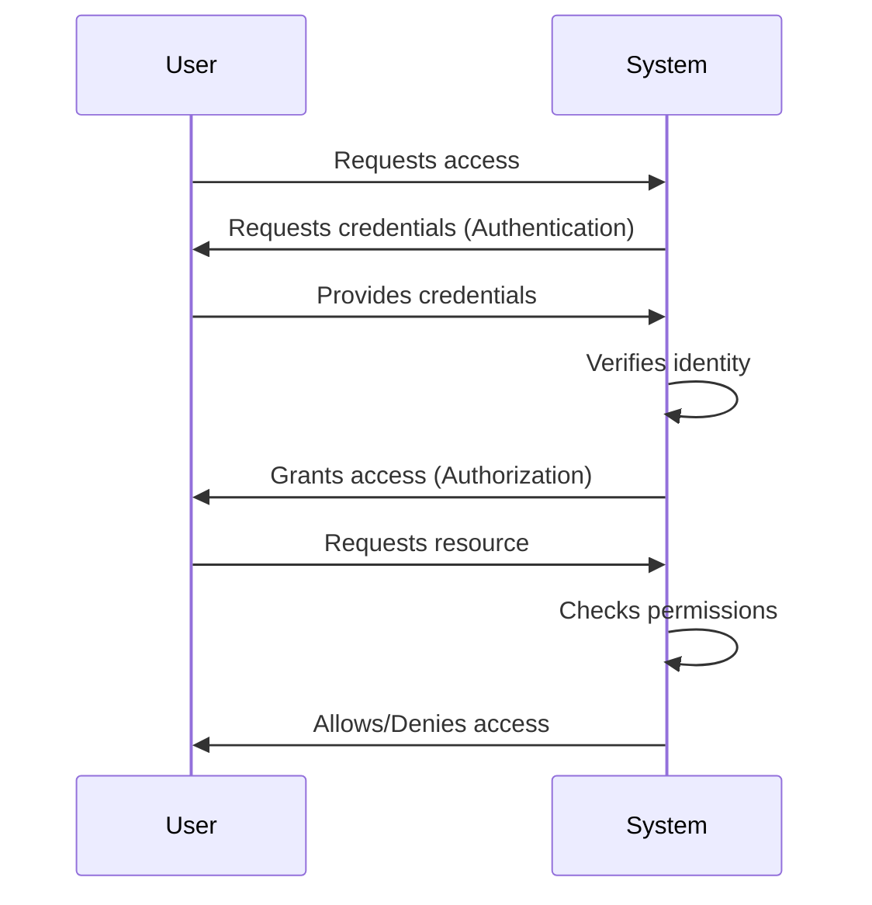
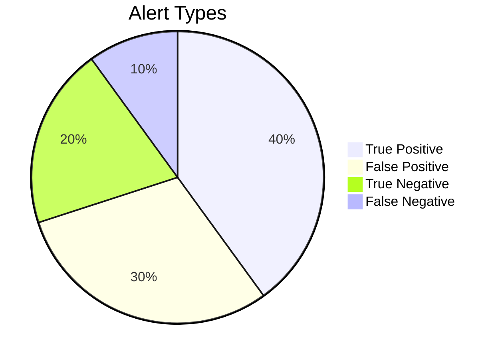

# Mastering Security Fundamentals: A Comprehensive Guide to Cybersecurity Basics

*Reading time: 4 min · 895 words*

> This comprehensive guide covers core cybersecurity concepts including the CIA triad, threat vs vulnerability, authentication vs authorization, hashing vs encryption, malware types, and defense strategies. Learn with practical examples and interview-ready explanations.

## Table of Contents
- [Core Security Concepts](#core-security-concepts)
  - [The CIA Triad](#the-cia-triad)
  - [Threat, Vulnerability, and Risk](#threat-vulnerability-and-risk)
- [Access Control Fundamentals](#access-control-fundamentals)
  - [Authentication vs Authorization](#authentication-vs-authorization)
- [Data Protection Methods](#data-protection-methods)
  - [Hashing vs Encryption](#hashing-vs-encryption)
- [Common Attack Vectors](#common-attack-vectors)
  - [Malware Types](#malware-types)
  - [Phishing Techniques](#phishing-techniques)
- [Credential Attacks](#credential-attacks)
  - [Brute Force vs Password Spraying](#brute-force-vs-password-spraying)
- [Post-Compromise Activities](#post-compromise-activities)
  - [Privilege Escalation](#privilege-escalation)
  - [Data Exfiltration](#data-exfiltration)
- [Detection and Analysis](#detection-and-analysis)
  - [Indicators of Compromise (IOC) vs Indicators of Attack (IOA)](#indicators-of-compromise-ioc-vs-indicators-of-attack-ioa)
  - [Alert Types](#alert-types)
- [Practical Investigation Scenarios](#practical-investigation-scenarios)
- [Key Security Controls](#key-security-controls)
- [Interview Preparation Tips](#interview-preparation-tips)

## Core Security Concepts

The foundation of cybersecurity begins with understanding three fundamental principles:

### The CIA Triad

- **Confidentiality**: Ensures data is accessible only to authorized individuals
  - Example: HR payroll files visible only to HR personnel
  - Controls: Access control, encryption, data classification

- **Integrity**: Maintains accuracy and consistency of data
  - Example: Preventing unauthorized changes to bank account details
  - Controls: Hashing, digital signatures, change control

- **Availability**: Guarantees systems and data are accessible when needed
  - Example: Ensuring website uptime during business hours
  - Controls: Redundancy, failover systems, disaster recovery

> **Key Note**: The CIA triad forms the basis for all security controls - every security measure should protect at least one aspect of the triad.

### Threat, Vulnerability, and Risk

| Concept | Definition | Example |
|---------|------------|---------|
| Threat | Potential cause of harm | Cybercriminal, ransomware |
| Vulnerability | Weakness that can be exploited | Unpatched server, weak passwords |
| Risk | Likelihood and impact of threat exploiting vulnerability | Data breach leading to financial loss |

**Real-world scenario**: An internet-facing server with outdated software:
- Threat: Cybercriminal
- Vulnerability: Outdated software
- Risk: Server compromise exposing customer data
- Controls: Patching, WAF, network segmentation

## Access Control Fundamentals

### Authentication vs Authorization

1. **Authentication** verifies identity using:
   - Something you know (password)
   - Something you have (security token)
   - Something you are (biometrics)

2. **Authorization** determines access rights after authentication:
   - Role-Based Access Control (RBAC)
   - Attribute-Based Access Control (ABAC)
   - Principle of least privilege

## Data Protection Methods

### Hashing vs Encryption

| Feature | Hashing | Encryption |
|---------|---------|------------|
| Purpose | Data integrity verification | Data confidentiality |
| Reversibility | One-way process | Reversible with key |
| Key Usage | No keys (uses salt) | Requires key |
| Common Uses | Password storage, file verification | Secure communications, data at rest |

**Best practice**: Always use salted, slow hashing algorithms (like bcrypt) for password storage.

## Common Attack Vectors

### Malware Types

1. **Virus**: Attaches to files, requires user action to spread
2. **Worm**: Self-replicating, spreads without user interaction
3. **Trojan**: Disguised as legitimate software
4. **Ransomware**: Encrypts data for extortion
5. **Spyware**: Secretly monitors user activity
6. **Rootkit**: Maintains privileged access while hiding
7. **Botnet**: Network of compromised devices

### Phishing Techniques

- **Spear phishing**: Targeted at specific individuals
- **Whaling**: Targets high-profile executives
- **Smishing**: Phishing via SMS
- **Vishing**: Phishing via voice calls

**Red flags to spot phishing**:
- Urgent or threatening language
- Mismatched sender addresses
- Suspicious links or attachments
- Requests for sensitive information

## Credential Attacks

### Brute Force vs Password Spraying

| Attack Type | Method | Prevention |
|-------------|--------|------------|
| Brute Force | Many passwords against one account | Account lockout, MFA |
| Password Spraying | Few common passwords across many accounts | Banned password lists, smart detection |

## Post-Compromise Activities

### Privilege Escalation

- **Vertical**: Gaining higher privileges (user → admin)
- **Horizontal**: Accessing other accounts at same level

### Data Exfiltration

Signs of data exfiltration:
- Large data transfers to external locations
- Unusual compression activities
- Connections to unknown cloud services

## Detection and Analysis

### Indicators of Compromise (IOC) vs Indicators of Attack (IOA)

| IOC Examples | IOA Examples |
|--------------|--------------|
| Known malicious file hashes | PowerShell downloading code |
| Suspicious IP addresses | Security tools being disabled |
| Malicious domains | Mass file encryption |

### Alert Types

- **False positive**: Legitimate activity flagged as malicious
- **False negative**: Malicious activity not detected

> **Critical Consideration**: While false positives waste analyst time, false negatives allow attacks to proceed undetected - requiring careful balance in detection tuning.

## Practical Investigation Scenarios

1. **Phishing Incident**: User opens macro-enabled file triggering PowerShell download
   - Initial access: Phishing
   - Delivery: Trojan document
   - IOA: PowerShell process chain

2. **Brute Force Attempt**: 5,000 failed logins to admin account
   - Check for eventual success
   - Review MFA prompts
   - Investigate source IP reputation

3. **Data Exfiltration**: Service account uploading large data volumes to unknown cloud domain
   - Validate authorization
   - Contain the account
   - Assess data exposure

## Key Security Controls

1. Implement multi-factor authentication (MFA)
2. Enforce principle of least privilege
3. Maintain regular patching schedule
4. Deploy endpoint detection and response (EDR) solutions
5. Conduct security awareness training
6. Implement data loss prevention (DLP) controls
7. Monitor for unusual authentication patterns
8. Establish incident response procedures

## Interview Preparation Tips

When explaining security concepts:
1. Provide clear definition
2. Give practical example
3. Explain security impact
4. Mention relevant controls

For example, when asked about the CIA triad:
- Define each component (Confidentiality, Integrity, Availability)
- Example: Online banking system
  - Confidentiality: Account details visible only to owner
  - Integrity: Preventing unauthorized balance changes
  - Availability: Ensuring 24/7 access to banking services
- Explain business impact if any component fails
- Mention controls like encryption, hashing, and redundancy

## Frequently Asked Questions

**Q: What's the difference between authentication and authorization?**

A: Authentication verifies identity (who you are), while authorization determines access rights (what you're allowed to do). Authentication comes first, then authorization follows.

**Q: Why should passwords be hashed rather than encrypted?**

A: Hashing is one-way, making it safer for password storage - even if the database is compromised, attackers can't reverse the hashes. Encryption is reversible, creating potential exposure if keys are compromised.

**Q: How does password spraying differ from brute force attacks?**

A: Brute force tries many passwords against one account, while password spraying tries a few common passwords across many accounts to avoid lockouts.

## Key Takeaways

- The CIA triad (Confidentiality, Integrity, Availability) forms the foundation of all security controls
- Authentication verifies identity while authorization controls access permissions
- Hashing provides integrity verification while encryption ensures confidentiality
- Different attack types require specific defenses (MFA for brute force, banned password lists for spraying)
- Monitor for both IOCs (evidence of compromise) and IOAs (suspicious behaviors)
- Balance detection tuning to minimize both false positives and false negatives

## Related Articles

- network-security-basics
- incident-response-process

<!-- Cover image prompts (for editors):
  - A shield protecting three icons representing confidentiality (lock), integrity (checkmark), and availability (up arrow) on dark background
  - Side-by-side comparison illustration of brute force attack (many arrows targeting one lock) vs password spraying (few arrows targeting many locks)
  - Infographic showing authentication factors with icons for knowledge (key), possession (phone), and biometrics (fingerprint)
  - Flowchart diagram tracing a phishing attack from initial email through compromise to data exfiltration
-->