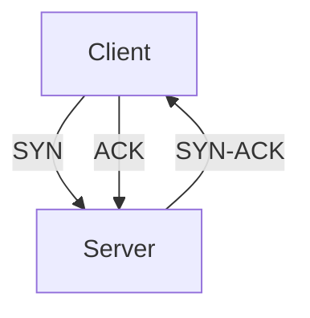

# Understanding the TCP Three-Way Handshake: A Comprehensive Guide

*Reading time: 2 min · 325 words*

> The TCP Three-Way Handshake is a fundamental process in network communication that establishes a reliable connection between two devices. This article explains how the handshake works, its steps, and its significance in cybersecurity, particularly for SOC Analysts.

## Table of Contents
- [Introduction](#introduction)
- [What is TCP?](#what-is-tcp)
- [The Three-Way Handshake Process](#the-three-way-handshake-process)
- [Importance in Cybersecurity](#importance-in-cybersecurity)
- [Real-World Example](#real-world-example)
- [Conclusion](#conclusion)

## Introduction

The TCP Three-Way Handshake is a crucial process in network communication, ensuring that a reliable connection is established between two devices before data transmission begins. This process is particularly important for SOC (Security Operations Center) Analysts who monitor and secure network traffic.

## What is TCP?

Transmission Control Protocol (TCP) is one of the core protocols of the Internet Protocol (IP) suite. It provides reliable, ordered, and error-checked delivery of data between applications running on hosts communicating via an IP network.

## The Three-Way Handshake Process

The Three-Way Handshake involves three steps:

1. **SYN (Synchronize):** The client sends a SYN packet to the server to initiate a connection.
2. **SYN-ACK (Synchronize-Acknowledge):** The server responds with a SYN-ACK packet to acknowledge the client's request.
3. **ACK (Acknowledge):** The client sends an ACK packet back to the server, completing the handshake.

## Importance in Cybersecurity

For SOC Analysts, understanding the TCP Three-Way Handshake is essential for identifying and mitigating potential security threats. By monitoring the handshake process, analysts can detect unusual patterns or anomalies that may indicate malicious activity.

> **Note:** The TCP Three-Way Handshake is a fundamental concept in network security. Mastery of this process is crucial for effective threat detection and response.

## Real-World Example

Consider a scenario where a SOC Analyst is monitoring network traffic. If an analyst observes multiple SYN packets without corresponding SYN-ACK responses, it could indicate a SYN flood attack, a type of Denial of Service (DoS) attack. Recognizing this pattern allows the analyst to take appropriate action to mitigate the threat.

## Conclusion

The TCP Three-Way Handshake is a foundational process in network communication, ensuring reliable and secure data transmission. For SOC Analysts, a deep understanding of this process is vital for effective network monitoring and threat detection. By mastering the Three-Way Handshake, analysts can enhance their ability to protect their organizations from cyber threats.

## Frequently Asked Questions

**Q: What is the purpose of the TCP Three-Way Handshake?**

A: The TCP Three-Way Handshake establishes a reliable connection between two devices before data transmission begins.

**Q: What are the three steps of the TCP Three-Way Handshake?**

A: The three steps are SYN (Synchronize), SYN-ACK (Synchronize-Acknowledge), and ACK (Acknowledge).

**Q: Why is the TCP Three-Way Handshake important for SOC Analysts?**

A: It helps SOC Analysts monitor network traffic and detect unusual patterns or anomalies that may indicate malicious activity.

**Q: Can the TCP Three-Way Handshake be used to detect attacks?**

A: Yes, anomalies in the handshake process, such as multiple SYN packets without SYN-ACK responses, can indicate attacks like SYN flood.

**Q: Is the TCP Three-Way Handshake used in all TCP connections?**

A: Yes, the Three-Way Handshake is a standard process in establishing TCP connections.

## Key Takeaways

- The TCP Three-Way Handshake ensures reliable and secure data transmission.
- It involves three steps: SYN, SYN-ACK, and ACK.
- Understanding the handshake is crucial for SOC Analysts.
- Anomalies in the handshake process can indicate potential security threats.
- The handshake is a standard process in establishing TCP connections.

## Related Articles

- Network Protocols
- SYN Flood Attacks
- Mastering Security Fundamentals: A Comprehensive Guide to Cybersecurity Basics

<!-- Cover image prompts (for editors):
  - A diagram illustrating the TCP Three-Way Handshake process with SYN, SYN-ACK, and ACK packets.
  - A network security concept image showing a SOC Analyst monitoring TCP handshake traffic.
  - A flowchart depicting the detection of a SYN flood attack through the TCP Three-Way Handshake process.
  - A visual representation of reliable data transmission established through the TCP Three-Way Handshake.
-->