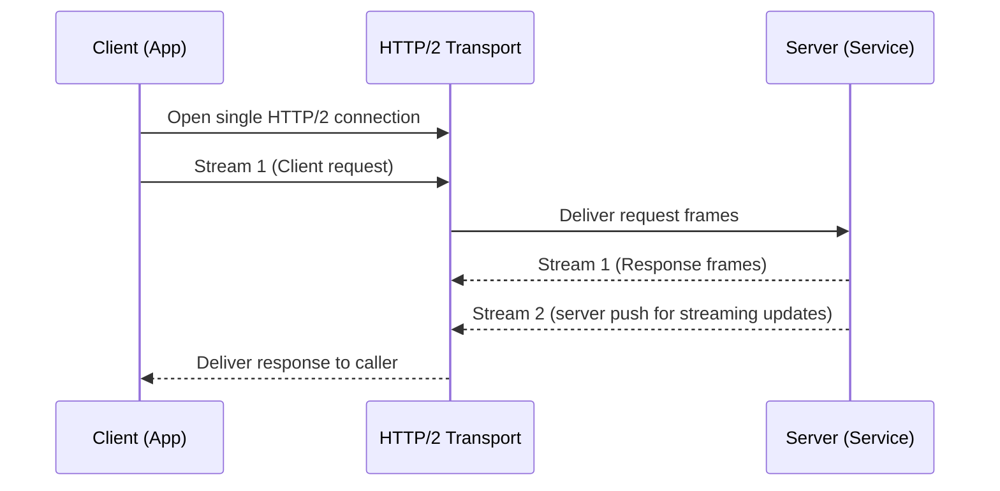
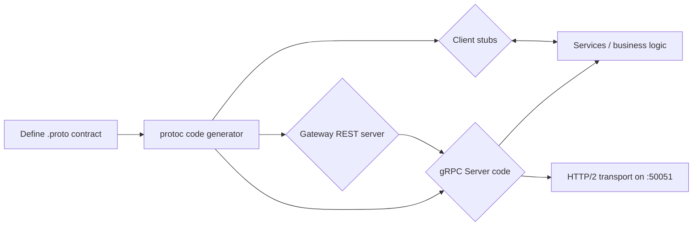

# gRPC Essentials: A Practical Guide to High-Performance Remote Procedure Calls

Distributed systems are the backbone of modern software, but moving data between services has always been a balancing act between speed, developer ergonomics, and reliability. For years, REST over HTTP/1.1 reigned supreme. Yet as services proliferated and latency budgets shrank, its downsides — verbose JSON payloads, sequential HTTP/1.1 connections, and untyped contracts — began to hurt at scale. Enter **gRPC**, a high-performance, open-source RPC framework originally developed by Google that has become the de facto standard for internal service-to-service communication.

This guide walks through everything you need to confidently adopt gRPC: what it is, how Protocol Buffers define contracts, how HTTP/2 powers its performance, the four streaming paradigms, error handling, and migration strategies. By the end, you will know exactly when gRPC is a great fit and when you should probably stick with REST.


## Table of Contents

- [Why Remote Procedure Calls Matter](#why-remote-procedure-calls-matter)
- [What Is gRPC?](#what-is-grpc)
- [The Foundation: Protocol Buffers](#the-foundation-protocol-buffers)
- [Why gRPC Uses HTTP/2](#why-grpc-uses-http2)
- [The Four gRPC Communication Patterns](#the-four-grpc-communication-patterns)
- [Working with Streams](#working-with-streams)
- [Error Handling and Deadlines](#error-handling-and-deadlines)
- [Interceptors: Middleware for gRPC](#interceptors-middleware-for-grpc)
- [A Real-World Example: Building a Product Service](#real-world-example-building-a-kitty-catalog-service)
- [gRPC vs REST: Choosing Wisely](#grpc-vs-rest-choosing-wisely)
- [Greening Interfaces: The Browser Problem](#the-browser-problem-and-grpc-web)
- [Key Takeaways](#key-takeaways)
- [Frequently Asked Questions](#frequently-asked-questions)
- [Related Articles](#related-articles)

## Why Remote Procedure Calls Matter

When two services need to exchange data, a developer writes what *looks like* a local function call, but the work happens across a network. The RPC abstraction hides the messy details — serialization, framing, connection handling, and encoding — behind a clean function signature.

The appeal is powerful: you define an interface once and both the client and server can use it as though the service lives in the same process. However, the complexity that RPC hides is real. Network calls are slow, flaky, and non-deterministic. The frameworks that manage those challenges well become the difference between an application that hums along and one that crashes under load.

> **Caveat**: RPC gives local-call ergonomics, but a network call can fail or take seconds. Never treat a remote call as if it were a blocking local method — always apply timeouts, retries, and cancellation.

## What Is gRPC

gRPC (pronounced *gee-arr-pee-see*) is a modern open-source RPC framework first open-sourced by Google in 2015. It builds on two mature standards:

- **HTTP/2** as the transport, providing multiplexing, compression, and bidirectional streaming.
- **Protocol Buffers (protobuf)** as the Interface Definition Language (IDL) and serialization format.

Its standout characteristics:

- **Strongly typed contracts** — the interface is defined in a `.proto` file and shared across services.
- **Language agnostic** — client and server can be written in different languages (Go, Java, Python, C++, Node.js, C#, and more) yet interoperate seamlessly.
- **Bidirectional streaming** — client and server can push data to each other over a single connection.
- **Code generation** — the `protoc` compiler and language plugins generate boilerplate client/server classes for you, matching the interface to your language's idioms.

Because interfaces are described once and compiled, both sides are guaranteed to agree on the shape of messages. This erases an entire class of bugs that plague hand-written JSON clients.


## The Foundation: Protocol Buffers

Before two services can talk, they must agree on what the request and response look like. Protocol Buffers is that contract. You author a `.proto` file that describes messages (data structures) and RPC methods.

Here is a minimal definition:

```proto
syntax = "proto3";

package shop.v1;

service ProductService {
  rpc GetProduct (GetProductRequest) returns (Product);
  rpc ListProducts (ListProductsRequest) returns (stream Product);
}

message GetProductRequest {
  string id = 1;
}

message Product {
  string id = 1;
  string name = 2;
  double price = 3;
  string category = 4;
  repeated string tags = 5;
}
```

A few things stand out:

- Every field has a **type**, a **name**, and a **field number**.
- Field numbers (`id = 1`) identify a field on the wire. They should never be renamed because the wire format keys on these numbers, not names.
- `repeated` declares an array-like list.
- `service` blocks group related RPCs together.

When this file is run through `protoc`, it generates a client stub and a server skeleton in your chosen language. For example, generating the Go and Python code is shown below.

```bash
# Generate Go code
protoc --go_out=. --go-grpc_out=. --go-grpc_opt=paths=source_relative product.proto

# Generate Python code
python -m grpc_tools.protoc -I. --python_out=. --grpc_python_out=. product.proto
```

Protocol Buffers are space-efficient compared to text formats. Encoding numbers with varint, and emitting a fixed binary layout, keeps payloads small in contrast to verbose JSON dictionaries.

### Data Types and Field Options

The protobuf type system covers scalars (`int32`, `int64`, `float`, `double`, `bool`, `string`, `bytes`) as well as composite types like `enum`, `message`, `repeated`, and `map`.

```proto
enum StockLevel {
  OUT_OF_STOCK = 0;
  LOW = 1;
  IN_STOCK = 2;
}

message Stock {
  map<string, int32> by_warehouse = 1;
  StockLevel level = 2;
}
```

> **Caution**: By default, `proto3` treats every field as optional in the sense that a missing field defaults to its zero value (e.g. `0`, `""`, `false`). If your business logic needs to distinguish "empty" from "unset", prefer `optional` fields or use wrapper types like `google.protobuf.StringValue`.

## Why gRPC Uses HTTP/2

gRPC does not reinvent transport — it rides on HTTP/2, a protocol that fundamentally improved on HTTP/1.1. The key wins:

- **Multiplexing**: Many requests and responses share a single TCP connection through multiple streams. HTTP/1.1 needed one connection (or a large connection pool) because it processed one request at a time per connection.
- **Header compression** with HPACK — repeated header names and values are compressed, cutting out substantial overhead.
- **Binary framing**: Data is transmitted in binary frames rather than plain gzip text, which is more compact and easier to parse in parallel.
- **Server push and priorities** for smarter resource delivery.

Because HTTP/2 supports bidirectional multiplexed streams, it becomes the natural transport for gRPC's streaming features.



## The Four gRPC Communication Types

gRPC supports four call patterns, generated by the `rpc` signature in the `.proto` file:

| Pattern | Signature | Use case | Example |
| --- | --- | --- | --- |
| **Unary** | `rpc A(req) returns (res)` | One request, one response — like a classic REST call | Get a single product |
| **Server streaming** | `rpc A(req) returns (stream res)` | Client sends one request, server responds with a stream | Live search suggestions |
| **Client streaming** | `rpc A(stream req) returns (res)` | Client sends multiple messages, server returns a single response | Uploading a file in chunks |
| **Bidirectional streaming** | `rpc A(stream req) returns (stream res)` | Both sides send messages over time | A chat application |

```proto
service StreamingService {
  rpc Count(CountRequest) returns (stream CountResponse);   // server streaming
  rpc Upload(stream UploadRequest) returns (UploadStatus);   // client streaming
  rpc Chat(stream ChatMessage) returns (stream ChatMessage); // bidi streaming
}
```

## Working with Streams

Streaming is where gRPC shines and where most novices get tripped up. For a bidi stream, the client holds open a channel and sends messages whenever they occur, the server reads them as they arrive and replies independently.

A typical Node.js bidirectional client loop:

```javascript
const call = client.chat();

call.on('data', (message) => {
  console.log('received:', message.text);
});
call.on('error', (error) => {
  console.error('stream error:', error);
});

await call.write({ user: 'alice', message: 'hello' });
call.end(); // signal that no more messages will be written
```

Concurrency, backpressure, and partial failures can all surprise you in streaming. Always:

- Listen to the `error` and `close` events.
- Respect backpressure — do not overrun the connection with an unlimited batch.
- Cancel cleanly when a stream is no longer wanted, to free up server resources.

## Error Handling and Deadlines

Networks fail, servers overload, and timeouts happen. gRPC gives you a structured way to signal that:

- **gRPC status codes** mirror HTTP status but are fine-grained for RPC concerns, for example `UNKNOWN`, `DEADLINE_EXCEEDED`, `NOT_FOUND`, `CANCELLED`, `UNAVAILABLE`, `UNAUTHENTICATED`, and `INTERNAL`.
- **Deadlines** set an overall upper bound for a call. Deadlines propagate downstream, so a downstream service knows it need not continue.
- **Metadata** on an RPC carry caller-provided identity or tracing and can be sent with the request.

```python
# Python — set a 5s timeout
response = stub.GetProduct(request, timeout=5, metadata=[('x-trace-id', 'abc-123')])
```

> **Important**: Always set a deadline on every outbound call. A missing deadline means a slow backend can hold a client thread forever, silently degrading or cascading failures across a service mesh.

## Interceptors: Middleware for gRPC

gRPC has interceptors (also called middlewares) that wrap RPC calls to apply cross-cutting concerns — authentication, logging, metrics, rate limiting, and tracing. They are the gRPC analog of REST middleware or HTTP handlers in a web framework.

```go
func loggingInterceptor(ctx context.Context, req any, info *grpc.UnaryServerInfo, handler grpc.UnaryHandler) (any, error) {
  start := time.Now()
  resp, err := handler(ctx, req)
  log.Printf("method=%s elapsed=%s", info.FullMethod, time.Since(start))
  return resp, err
}
```

Registering that on the server:

```go
server := grpc.NewServer(grpc.UnaryInterceptor(loggingInterceptor))
```

With interceptors you can build auth checks, request logging, load-balancing hints, retries, and rich tracing without touching your business logic.

## Real-World Example: Transcoding a Product Catalog Service

Let's see everything in action — imagine building a `ProductService` that returns a catalog, and giving it two faces: a gRPC service for internal consumers, and a REST/JSON gateway for exposing to the outside world.

The `.proto` defines our contract and a `google.api.http` annotation enables HTTP-agnostic mapping to REST:

```proto
import "google/api/annotations.proto";

service ProductService {
  rpc GetProduct(GetProductRequest) returns (Product) {
    option (google.api.http) = {
      get: "/v1/products/{id}"
    };
  }
}

message GetProductRequest {
  string id = 1;
  string fields = 2;
}
```

Compiling this with `protoc-gen-grpc-gateway` produces a JSON/REST gateway you can deploy beside the gRPC server. Internal callers use the native protobuf directly over HTTP/2; the gateway serves the same operation as `/v1/products/{id}` to web clients.


The whole pipeline — from contract to deployed gateway — is easy to model:



This "one contract, two APIs" pattern lets teams marshal the speed of gRPC internally while still publishing graceful, cacheable REST endpoints for frontends and third parties.

## When REST, When gRPC?

There is no universal answer — ask what the traffic looks like and who consumes the API.

| Consideration | Prefer gRPC | Prefer REST/JSON |
| --- | --- | --- |
| Payload size & throughput | High use heavy traffic | Light query |
| Nature of interface | Long-lived closed ecosystem | Public, browsable, versioned niches |
| Streaming | Heavy real-time data | Rare, use SSE/WebSocket |
| Tooling & debuggability | CLI/proto, but narrower | curl + browser). |
| Web browsers | Needs gRPC-Web proxy | Native fetch |

The general guidance: use gRPC **inside** your network edge (between microservices, data pipelines, low-latency real-time systems). Prefer REST over the public perimeter where ecosystem breadth, caching, and GUIs matter.

## The Browser Problem and gRPC-Web

Browsers cannot speak raw HTTP/2 gRPC — the binary framing and trailers are not available to `fetch` or `XMLHttpRequest`. The solution is **gRPC-Web**, which uses an intermediary (most commonly the Envoy proxy) that transcodes protobuf into a browser-friendly JSON or binary stream over HTTP/1.1 or HTTP/2.


This gives you protobuf's type safety for the frontend while keeping a unified contract across the stack. The tradeoff is you lose true bidirectional streaming (WebStreams aside) — so heavy real-time browser work may still favor WebSockets.

> **Reminder**: If your frontend's live stream to a full duplex experience, weigh the added value of gRPC-Web (transcoding, typed contracts) against using WebSockets natively.

## Key Takeaways

- gRPC combines **Protocol Buffers** (typed, compact, codegen contracts) with **HTTP/2** (multiplexed, bidirectional, compressed) for fast, type-safe remote calls.
- A `.proto` file is the single source of truth — write once, generate clients and servers for every language.
- It supports **four call patterns**: unary, server streaming, client streaming, and bidirectional streaming.
- Always set **deadlines** and model **status codes** and metadata; treat oddity and cancellations as first-class concerns.
- Apply **interceptors** for cross-cutting concerns like auth, logging, metrics, and retries.
- Use **grpc-gateway** to expose the same RPC as a REST/JSON API for browser and third-party consumers.
- Choose gRPC for internal, high-throughput, low-latency systems; keep REST at the public edge where ecosystem breadth and debuggability matter more.

## Frequently Asked Questions

**Is gRPC faster than REST?**
For internal service-to-service workloads, frequently yes. The compact binary Protobuf encoding, HTTP/2 header compression, and connection reuse cut wire bytes and round-trips significantly. But end-to-end latency for a single quick call may not feel dramatically different — measure with your real data on a bench between them.

**Do I have to use Protocol Buffers with gRPC?**
gRPC defaults to Protobuf, chosen for its small wire format and codegen tooling. It can be configured to use a custom encoder like FlatBuffers, but Protobuf is the standard and what almost everyone uses.

**Will gRPC call into my existing JSON API?**
Not natively. If you want a unified contract, choose `grpc-gateway`, which generates a REST-facing server from the same `.proto`, letting you serve both gRPC/Protobuf and JSON/REST from one definition.

**Is gRPC-Web production-ready?**
Yes, for many teams, especially with an Envoy proxy and proper versioning/discipline. The one limitation is real-time bidirectional streaming over the browser — if that dominates your workload, consider WebSockets or SSE alongside.

**Where do field numbers matter?**
Field numbers identify a field on the wire, not its name. Once you ship a message, never renumber or reuse a field number — that silently corrupts data compatibility across running services.

## Related Articles

- [Understanding the TCP Three-Way Handshake: A Comprehensive Guide](https://example.com/tcp-three-way-handshake)
- [The Comprehensive Guide to DevOps: Principles, Practices, and Tools](https://example.com/devops-principles-practices-tools)
- [System Design Handbook: A Practical Guide to Scalable Architectures](https://example.com/system-design-handbook)
