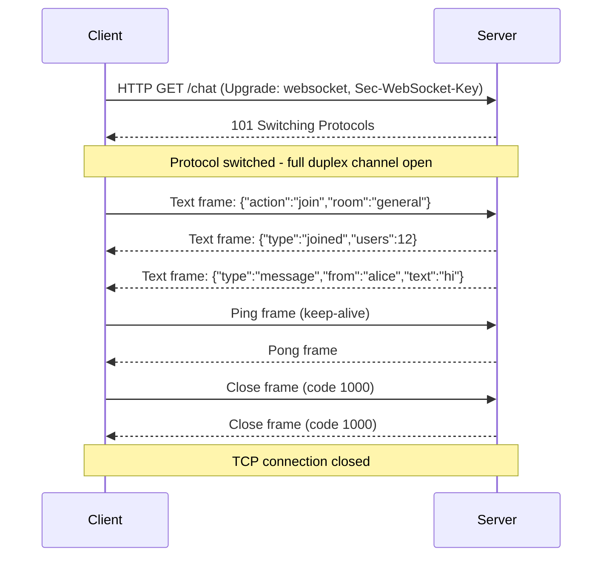
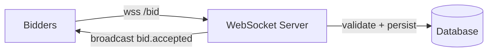
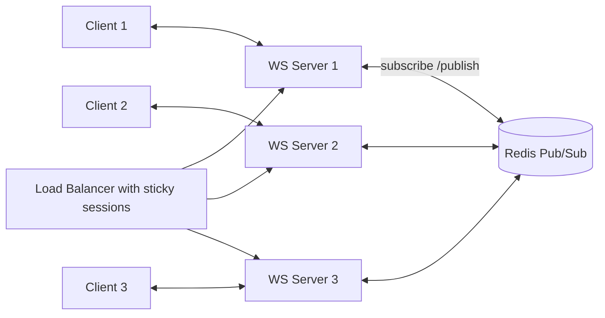

# WebSockets Explained: A Complete Guide to Real-Time Communication

Chat messages that appear instantly, collaborative documents that sync without a page reload, stock tickers that update every second, and multiplayer games that never show a spinner — all of these experiences share one foundation: a persistent, two-way network connection between client and server. For decades, HTTP made that kind of interaction awkward, forcing developers to poll, fake responses, or chain half-open requests. WebSockets changed the story by giving web applications a true full-duplex channel over a single TCP connection.

If you have worked with REST APIs, gRPC, or the TCP handshake but never dug into WebSockets, this guide is for you. We will walk through how the protocol works under the hood, what a WebSocket frame really looks like, how to build a real-time application from scratch, and how to scale and secure it in production. By the end, you will understand not only *how* to use WebSockets but *when* they are the right tool — and when HTTP polling or Server-Sent Events (SSE) would serve you better.

## Table of Contents

- [What Are WebSockets and Why Do They Matter?](#what-are-websockets-and-why-do-they-matter)
- [How the WebSocket Upgrade Handshake Works](#how-the-websocket-upgrade-handshake-works)
- [Anatomy of a WebSocket Frame](#anatomy-of-a-websocket-frame)
- [Opening and Closing a Connection](#opening-and-closing-a-connection)
- [Building a Real-Time Chat with WebSockets](#building-a-real-time-chat-with-websockets)
- [WebSockets vs Server-Sent Events vs HTTP Polling](#websockets-vs-server-sent-events-vs-http-polling)
- [Scaling WebSocket Servers in Production](#scaling-websocket-servers-in-production)
- [Reconnection, Heartbeats, and Resuming](#reconnection-heartbeats-and-resuming)
- [Security and Best Practices](#security-and-best-practices)
- [Key Takeaways](#key-takeaways)
- [Frequently Asked Questions](#frequently-asked-questions)
- [Related Articles](#related-articles)

## What Are WebSockets and Why Do They Matter?

A WebSocket is a communication protocol that provides full-duplex communication over a single, long-lived TCP connection. Unlike HTTP — where each request/response cycle is independent and short-lived — a WebSocket connection stays open and lets **either side push messages at any time**. That small architectural difference unlocks an entirely new class of applications.


The protocol was standardized by the IETF as **RFC 6455** in 2011, with a compression extension arriving later. Browser support landed in every major browser by the early 2010s, and it has since become the de facto standard for real-time web features.

### A brief history: why HTTP alone is not enough

Before WebSockets existed, developers faked real-time behavior with workarounds:

1. **Short polling** — Asking "anything new?" over plain HTTP every few seconds. Simple, but wasteful and slow.
2. **Long polling** — Holding a request open until new data exists, then responding. Fewer round trips, but still a fresh HTTP request per event and heavy connection-pool churn.
3. **Comet and hidden iframes** — Fragile streaming tricks that never standardized.

All of these are *unidirectional request/response* at heart. WebSockets skip the dance: after one HTTP handshake, the protocol switches to a binary framing layer where both sides speak freely, with low latency and minimal per-message overhead.

### The core properties worth remembering

- **Full-duplex** — Client and server can send messages simultaneously without waiting.
- **Persistent** — One TCP connection stays open for the lifetime of the session.
- **Low overhead** — After the handshake, messages are just small frames with a 2-byte header, not full HTTP headers.
- **Text and binary** — The payload can carry UTF-8 text or raw binary (blobs, buffers).
- **Works over the same ports** — `ws://` uses port 80 and `wss://` (TLS-encrypted) uses port 443, so it behaves like HTTPS traffic through firewalls and proxies.

## How the WebSocket Upgrade Handshake Works

Even though WebSockets are not HTTP, they *start* as an HTTP request. This is a deliberate design choice: the connection begins on port 80 or 443, is validated by origin, and only then does the protocol "upgrade" from HTTP to the WebSocket framing layer.

### The HTTP Upgrade request

The client opens a TCP connection (which itself begins with the TCP three-way handshake) and sends a request that looks like this:

```http
GET /chat HTTP/1.1
Host: example.com
Upgrade: websocket
Connection: Upgrade
Sec-WebSocket-Key: dGhlIHNhbXBsZSBub25jZQ==
Sec-WebSocket-Version: 13
Origin: https://example.com
```

The important parts are the `Upgrade: websocket` header, `Sec-WebSocket-Version: 13` (the current specification version), and `Sec-WebSocket-Key` — a base64-encoded random 16-byte value used to prove the server actually understands the protocol.

### The server response

If the server accepts, it replies with a `101 Switching Protocols` status:

```http
HTTP/1.1 101 Switching Protocols
Upgrade: websocket
Connection: Upgrade
Sec-WebSocket-Accept: s3pPLMBiTxaQ9EtyT0HyG82dDQo=
```

The `Sec-WebSocket-Accept` value is not random. It is computed as:

```
Sec-WebSocket-Accept = base64( SHA-1( Sec-WebSocket-Key + "258EAFA5-E914-47DA-95CA-C5AB0DC85B11" ) )
```

The GUID `258EAFA5-E914-47DA-95CA-C5AB0DC85B11` is a fixed magic string defined by RFC 6455. Because it is a cryptographic hash of the client's key, it proves the server genuinely supports the protocol and prevents accidental upgrades by proxies or caches. From this moment on, the TCP connection is no longer HTTP — both sides speak the WebSocket framing protocol.


Here is the whole conversation, including the messaging that follows, as a Mermaid sequence diagram:



## Anatomy of a WebSocket Frame

Once the upgrade completes, every message travels as a **frame**. A frame is a compact binary structure — usually just a few bytes of header followed by a payload. The layout is defined precisely by the RFC:

```
 0                   1                   2                   3
 0 1 2 3 4 5 6 7 8 9 0 1 2 3 4 5 6 7 8 9 0 1 2 3 4 5 6 7 8 9 0 1
+-+-+-+-+-------+-+-------------+-------------------------------+
|F|R|R|R| opcode|M| Payload len |    Extended payload length    |
|I|S|S|S|  (4)  |A|     (7)     |             (16/64)           |
|N|V|V|V|       |S|             |   (if payload len==126/127)   |
| |1|2|3|       |K|             |                               |
+-+-+-+-+-------+-+-------------+ - - - - - - - - - - - - - - - +
|     Extended payload length continued, if payload len == 127  |
+ - - - - - - - - - - - - - - - +-------------------------------+
|                               | Masking-key, if MASK set to 1  |
+-------------------------------+-------------------------------+
| Masking-key (continued)       |           Payload Data         |
+-------------------------------- - - - - - - - - - - - - - - - +
```

The key fields to understand:

| Field | Size | Purpose |
| --- | --- | --- |
| FIN | 1 bit | Set to 1 if this is the last frame of a fragmented message |
| RSV1–RSV3 | 1 bit each | Reserved for extensions (e.g. permessage-deflate compression) |
| Opcode | 4 bits | What kind of frame this is (text, binary, close, ping, pong, continuation) |
| MASK | 1 bit | Whether the payload is masked |
| Payload length | 7 bits (extendable) | 0–125 directly; 126 means the next 2 bytes hold the length; 127 means the next 8 bytes hold it |
| Masking key | 32 bits | 4-byte random key XORed into the payload (client-to-server only) |

### Opcodes you will actually see

| Opcode | Name | Meaning |
| --- | --- | --- |
| 0x0 | Continuation | A follow-up fragment of a fragmented message |
| 0x1 | Text | UTF-8 encoded text data |
| 0x2 | Binary | Raw binary data (images, buffers, protocol buffers) |
| 0x8 | Close | Initiates the closing handshake with an optional code and reason |
| 0x9 | Ping | Liveness probe; the peer must reply with a Pong |
| 0xA | Pong | Response to a Ping |

**One rule worth internalizing:** every frame sent **from the client to the server MUST be masked**, and **frames from the server MUST NOT be masked**. Masking (XORing the payload with a 4-byte key) exists to prevent a subtle cache-poisoning attack described in the RFC, not for secrecy. Most developers never touch this — the browser's `WebSocket` object and server libraries like `ws` handle masking automatically.

## Opening and Closing a Connection

### Opening in a browser

The browser API could not be simpler — five events and two methods cover almost everything:

```javascript
const socket = new WebSocket('wss://example.com/chat');

socket.addEventListener('open', () => {
  console.log('connected');
  socket.send(JSON.stringify({ action: 'join', room: 'general' }));
});

socket.addEventListener('message', (event) => {
  const data = JSON.parse(event.data);
  console.log('received:', data);
});

socket.addEventListener('close', ({ code, reason }) => {
  console.log(`closed with code ${code} and reason "${reason}"`);
});

socket.addEventListener('error', () => {
  console.error('connection error');
});
```

Note that `wss://` is the TLS-encrypted variant and should be used everywhere outside local development — plain `ws://` sends message payloads in cleartext.

### Closing gracefully

Either side can close the connection by sending a Close frame. The closing handshake is simple: one side sends a Close frame, the peer replies with its own Close frame, and the TCP connection is torn down. Every close carries a numeric **close code** that tells the other side *why* it ended:

| Close code | Name | Meaning |
| --- | --- | --- |
| 1000 | Normal closure | The purpose was fulfilled, intentional shutdown |
| 1001 | Going away | Page navigated away or server shutting down |
| 1002 | Protocol error | Malformed data / protocol violation |
| 1003 | Unsupported data | Received a data type it cannot handle |
| 1005 | No status received | Placeholder (never sent on the wire) |
| 1006 | Abnormal closure | Connection dropped without a Close frame (e.g., network loss) |
| 1008 | Policy violation | Message violated a policy (content, authorization) |
| 1009 | Message too big | Payload exceeded the maximum allowed size |
| 1011 | Server error | Unexpected server-side condition |
| 1015 | TLS handshake failure | Reserved; never sent by a behaved endpoint |

> **Blockquote — browser behaviour:** When a TCP connection dies without a Close frame — a dropped Wi-Fi link, a proxy that times out, a server crash — browsers never get the 1000 code; they fire `close` with **1006 (Abnormal closure)**. Your reconnect logic must treat 1006 as a retry signal, not a reason to give up.

## Building a Real-Time Chat with WebSockets

Theory is nice, but the best way to solidify the concepts is to build something real. Let's wire up a minimal real-time chat: a Node.js server using the `ws` library and a browser client.

### Server side with Node.js and `ws`

```javascript
const { WebSocketServer } = require('ws');

const wss = new WebSocketServer({ port: 8080 });
const clients = new Set();

wss.on('connection', (ws, req) => {
  clients.add(ws);
  console.log(`client connected from ${req.socket.remoteAddress}`);

  ws.on('message', (data, isBinary) => {
    // Broadcast every message to every other connected client
    for (const client of clients) {
      if (client !== ws && client.readyState === client.OPEN) {
        client.send(data, { binary: isBinary });
      }
    }
  });

  ws.on('close', () => {
    clients.delete(ws);
    console.log('client disconnected');
  });

  ws.on('error', () => {
    clients.delete(ws);
  });
});
```

### Client side

```javascript
const socket = new WebSocket('wss://example.com/chat');
const messages = document.querySelector('#messages');
const input = document.querySelector('#message-input');

socket.addEventListener('message', ({ data }) => {
  const el = document.createElement('li');
  el.textContent = data;
  messages.appendChild(el);
});

document.querySelector('#send').addEventListener('click', () => {
  socket.send(input.value);
  input.value = '';
});
```

That is a working chat in under a dozen meaningful lines. The simplicity is the point: the browser handles masking, framing, handshake, and backpressure; your code just speaks strings over the socket.

### Real-world example: a live auction feed

To see the pattern stretched, imagine a **live auction platform**. Every bid must reach all bidders within milliseconds, and ordering matters.

The flow goes like this:

1. A bidder clicks "Place bid" → the browser validates locally, then sends `{"type":"bid","item":42,"amount":350}` over the socket.
2. The server validates against the current high bid, writes the new bid to the database (for durability), and only then broadcasts `{"type":"bid.accepted","amount":350,"bidder":"alice"}`.
3. Every connected client — including the bidder who placed it — updates the ticker immediately.



The critical design lesson: **the server, not the client, is the source of truth.** Clients never broadcast directly to each other (peer-to-peer, or the *broken* pattern of one client talking to another client's socket) — every message flows through the server, which validates, orders, and persists before publishing.

## WebSockets vs Server-Sent Events vs HTTP Polling

WebSockets are not always the right tool. Real-time needs range from "push occasional updates" to "full two-way interaction," and each technique has a sweet spot.

| Property | HTTP Polling | Server-Sent Events (SSE) | WebSockets |
| --- | --- | --- | --- |
| Direction | Client → Server only (updates are pull-based) | Server → Client (one-way push) | Full-duplex (both ways) |
| Protocol | HTTP/1.1, HTTP/2 | HTTP/1.1, HTTP/2 | WS/WSS over TCP (RFC 6455) |
| Transport | New TCP/TLS connection per request (or reuse) | Single long-lived HTTP connection | Single long-lived TCP connection |
| Data format | Any (HTTP body) | UTF-8 text only | Text and binary |
| Auto-reconnect | Not needed (each poll is fresh) | Built in via the `EventSource` API | Must be implemented by you |
| Message overhead | Full HTTP headers every time | Small; headers sent once | Small; 2-byte frame header |
| Browser concurrency | Depends on connection reuse | Unbounded | Browsers limit persistent connections (historically ~6 per origin) |
| Firewall / proxy friendly | Yes | Yes | Mostly (uses ports 80/443, but some proxies still interfere) |

Decide with these heuristics:

- If you need **client → server** messages too (chat, games, live editing), use **WebSockets**.
- If you only need **server → client** pushes (live scores, notification feed, log streaming) and want automatic reconnection with zero code, use **SSE**.
- If updates are infrequent, small, and latency-tolerant, a simple **short poll** is often the most robust and cheapest option — adding WebSockets is engineering you may not need.

## Scaling WebSocket Servers in Production

WebSockets are delightful at small scale and humbling at large scale, because the architecture changes. A REST API can sit behind any number of stateless load-balanced instances — every request is independent. A WebSocket connection, by contrast, is *stateful*: it lives on one server instance for its entire lifetime, and a client's connection is glued to wherever the handshake landed.

### Sticky sessions and the load balancer problem

The first scaling concern is that a client that established a socket on instance A must keep talking to instance A. Load balancers handle this with **sticky sessions** (cookie-based or IP-hash routing). More importantly, you must set generous **idle timeouts** — WebSocket connections are long-lived and mostly silent, so anything lower than a couple of minutes will silently kill idle users.

The deeper problem is **global awareness**: if Alice is connected to instance 1 and Bob is connected to instance 2, a message from Alice must still reach Bob. Each instance only knows its own sockets.

### Broadcasting with a Redis pub/sub layer

The standard solution is a shared **pub/sub message bus** (Redis Pub/Sub, Redis Streams, or a message broker like RabbitMQ/Kafka). Every server instance subscribes to channels; when a client sends a message, the server publishes it to the bus, and *every* instance — including the originator — re-broadcasts it to its own local sockets.



A rule of thumb: introduce the bus *before* fan-out exceeds a single server — retrofitting it onto a naive broadcast loop later is a common source of real-time outages. For very high fan-out (thousands of rooms, millions of clients), teams typically move to adapted frameworks like Socket.IO, managed WebSocket services, or per-connection publish over the bus.

## Reconnection, Heartbeats, and Resuming

WebSockets give you a persistent connection, but the network will not hold up its end of the bargain. Mobile coverage dips, proxies idle-out, and servers restart. Production-grade client code must assume the connection will break and needs a strategy around three tools.

### Heartbeats (ping/pong)

A silent connection can die without either side noticing. Nearly every server uses a **ping/pong heartbeat**: the server pings every N seconds (commonly 30s), and if the client does not respond with a pong within a timeout window, the server closes the socket and cleans up the dead connection.

```javascript
// server: heartbeat every 30s, kill unresponsive clients after 35s
const interval = setInterval(() => {
  ws.ping();
  if (ws.isAlive === false) return ws.terminate();
  ws.isAlive = false;
}, 30000);

ws.on('pong', () => {
  ws.isAlive = true;
});
```

### Reconnection with exponential backoff

The client should reconnect automatically, but hammering a recovering server with instant retries is exactly how you turn a restart into an outage. Use **exponential backoff** with a jittered delay: 1s, then 2s, 4s, 8s… capped at 30–60 seconds.

```mermaid
flowchart TD
    A[WebSocket opens] --> B{Connection lost?}
    B -- No --> C[Message flow resumes]
    C --> B
    B -- Yes --> D[Wait: min(backoff * 2, 30s)]
    D --> E[Attempt reconnect]
    E -- Fail --> F[Add random jitter, increase backoff]
    F --> D
    E -- Success --> A
```

### Resuming state

Finally, plan for **state loss**. When a client reconnects after dying, does it know the room list, the last message, the current auction price? The robust pattern is: reconnect → send an `identity`/`resume` message → the server replays missed events or the latest snapshot. Do not rely on the socket itself to remember anything.

## Security and Best Practices

Because a WebSocket connection is long-lived and can be abused as a powerful little bot, security deserves its own section.

> **Blockquote — caution with origin checks:** The browser's Same-Origin Policy only applies to HTTP requests; WebSocket handshakes from a browser *can* include an `Origin` header. Verify that `Origin` against your allow-list on the server. If you skip this, a malicious site can open a socket to your server from any visitor's browser and perform actions as that user — classic **Cross-Site WebSocket Hijacking**.

The checklist that covers the majority of real-world mistakes:

1. **Use `wss://` everywhere except localhost.** Message payloads are NOT encrypted by the protocol.
2. **Authenticate in the handshake**, not after. Accept a short-lived token (cookie or `Sec-WebSocket-Protocol` bearer) and validate it *before* the `101` status is sent where possible; otherwise reject immediately after.
3. **Authorize every message** — re-check permissions per action. Do not assume a socket that was valid at connect time is still valid an hour later.
4. **Validate and size-limits your payloads.** Set a maximum message size server-side (1009 rejection) or an attacker streams gigabytes into your RAM.
5. **Add rate limiting** — per-user message throttling prevents a spammer from flooding the fan-out to every user.
6. **Never trust `event.data`.** Treat every received message as untrusted input; JSON.parse it defensively, escape before rendering, and avoid dangerous sinks like `innerHTML`.
7. **Careful with proxies and TLS termination** — they can buffer or kill long-lived connections; configure idle timeouts and reconnection accordingly.
8. **Close handshakes on authentication expiry** — when token expiry or logout occurs, send a deliberate close with a policy code so clients reconnect cleanly.

## Key Takeaways

- WebSockets provide **full-duplex, persistent communication** over a single TCP connection, standardized in RFC 6455, solving the latency and overhead problems of HTTP polling and long polling.
- The protocol begins as an **HTTP Upgrade handshake**; the server proves protocol support by responding with `Sec-WebSocket-Accept`, which is a SHA-1 hash of the client key plus a fixed magic GUID.
- All traffic after the handshake is **binary frames** with an opcode-driven design — text, binary, close, ping, and pong. Client-to-server frames are masked; server-to-client frames are not.
- Closing is graceful by design: a Close frame with a numeric **close code** explains why the connection ended, but network failures surface as code 1006, which must trigger reconnection.
- **Choose your transport deliberately:** full-duplex needs WebSockets, one-way push is often simpler with SSE, and sporadic updates may not need either — plain polling often wins on simplicity.
- In production, plan for **sticky sessions, a pub/sub bus (e.g. Redis) for cross-instance fan-out, heartbeat ping/pong, exponential-backoff reconnection, and origin-plus-token security checks** — these decide whether your real-time feature survives real users.

## Frequently Asked Questions

**What is the difference between WebSocket and HTTP?**
HTTP is a request/response protocol: a client asks and a server answers, then the interaction is over. A WebSocket connection is upgraded from HTTP and then stays open, allowing both sides to send messages at any time without a new request each time.

**Can I use cookies with WebSockets?**
Yes — the initial handshake is an HTTP request, so cookies are sent with it and can be used for authentication. Note that `SameSite` cookie policies and cross-origin setups can affect whether cookies reach the server, which is one reason token-based auth in a custom header (or the `Sec-WebSocket-Protocol`) is popular.

**Why do WebSocket messages sometimes arrive out of order or late?**
A single WebSocket connection preserves message order unless you open multiple connections. Out-of-order symptoms usually come from application-level pipelining, proxy buffering, or missing server-side sequencing — it is often safer to include a sequence number or timestamp in your message schema than to rely on transport ordering across reconnects.

**Is WebSocket binary or text?**
WebSockets support both. Text frames carry UTF-8 strings; binary frames carry arbitrary bytes (photos, audio, protobuf payloads). Libraries commonly expose these as strings and Blobs/Buffers respectively.

**Do WebSocket connections count against HTTP/1.1's six-connection limit?**
With HTTP/1.1, browsers limit the number of *concurrent* connections per origin, historically about six, and a single WebSocket consumes one of them. This is one reason to keep WebSockets to one or two connections per app, and why HTTP/2 removes the traditional limit but is less straightforward to use with WebSockets.

## Related Articles

- Understanding the TCP Three-Way Handshake: A Comprehensive Guide
- gRPC Essentials: A Practical Guide to High-Performance Remote Procedure Calls
- System Design Handbook: A Practical Guide to Scalable Architectures
- A Comprehensive Guide to SQL: The Language for Database Communication
