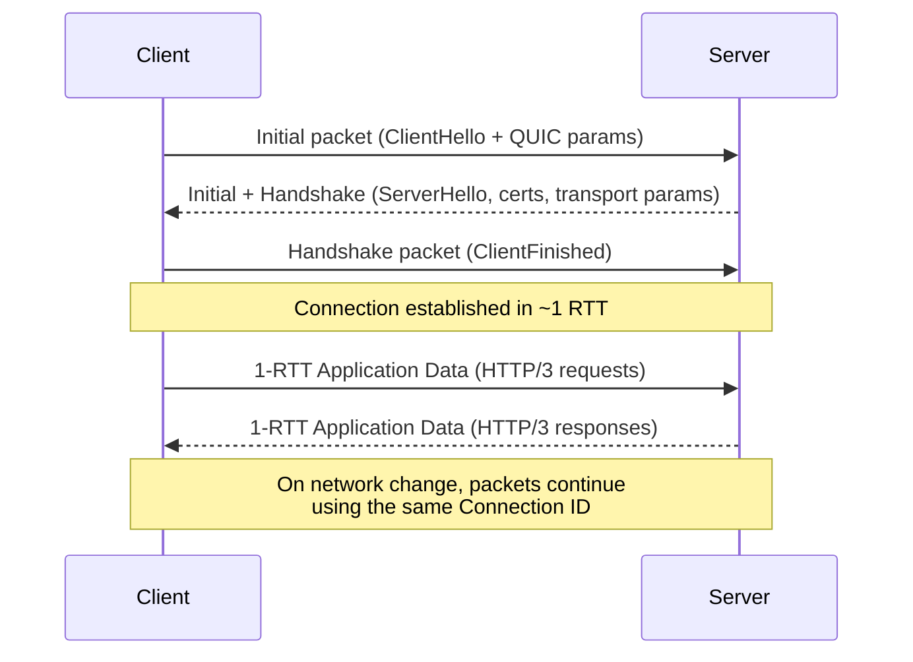

# HTTP/3 and QUIC Explained: The Next-Generation Web Transport Protocol

Every time you open a modern website, there is a quiet revolution happening between your browser and the server. For two decades, the web ran on HTTP/1.1 carried over TCP — a pairing designed in the 1990s when pages were small, connections were scarce, and latency was an afterthought. Today, the web runs on **HTTP/3**, the first major HTTP version built on a brand-new transport protocol called **QUIC**, which ditches TCP entirely and rides on top of UDP.

HTTP/3 is not just a faster HTTP/2. It fixes problems that TCP structurally cannot fix: head-of-line blocking that stalls an entire page when one packet is lost, connection setup that takes multiple round trips, and connections that break the moment you switch from Wi-Fi to mobile data. By 2026, all major browsers enable HTTP/3 by default, and a large and growing share of internet traffic is already served over it.

This guide explains how HTTP/3 and QUIC actually work: why the web outgrew TCP, how the QUIC handshake achieves secure connections in a single round trip, how multiplexed streams eliminate blocking, and how to deploy and measure HTTP/3 in your own stack.

## Table of Contents

- [Why the Web Needed a New Transport](#why-the-web-needed-a-new-transport)
- [What Is QUIC?](#what-is-quic)
- [The HTTP/3 Protocol Stack](#the-http3-protocol-stack)
- [The Problems HTTP/3 Solves](#the-problems-http3-solves)
- [The QUIC Connection Lifecycle](#the-quic-connection-lifecycle)
- [Core HTTP/3 Features](#core-http3-features)
- [HTTP/3 Frames and Streams](#http3-frames-and-streams)
- [Real-World Example: Deploying HTTP/3](#real-world-example-deploying-http3)
- [Adoption, Measurement, and Caveats](#adoption-measurement-and-caveats)
- [Key Takeaways](#key-takeaways)
- [Frequently Asked Questions](#frequently-asked-questions)
- [Related Articles](#related-articles)

## Why the Web Needed a New Transport

The story of HTTP/3 starts with TCP's success. TCP gave the internet reliable, ordered byte streams, congestion control, and flow control. Those properties made the web work. But they were also the ceiling.

Each major HTTP version tried to work around TCP's constraints:

1. **HTTP/1.1 (1997)** opened one connection per request, so browsers had to open many parallel connections (and later use domain sharding) to load a page with dozens of resources. Each new connection paid a full TCP + TLS handshake.
2. **HTTP/2 (2015)** multiplexed many requests over a single TCP connection, fixing the connection-per-request problem — but it inherited a new one. Because TCP delivers bytes in strict order, one lost packet at the transport layer delays every stream sharing that connection. That is *transport-level head-of-line (HOL) blocking*.
3. **HTTP/3 (2022)** sidesteps TCP entirely. It runs on QUIC, a user-space transport protocol over UDP that brings back per-stream reliability and multiplexing without the ordered-byte-stream bottleneck.


The diagram above shows the layered reality: HTTP/1.1 and HTTP/2 both depend on TCP + TLS in the kernel, while HTTP/3 collapses transport and security into QUIC, which itself sits directly on UDP.

## What Is QUIC?

QUIC (pronounced "quick", from *Quick UDP Internet Connections*) is a transport protocol originally developed at Google and standardized by the IETF. The core QUIC specification is **RFC 9000** (published May 2021), with TLS 1.3 integration in **RFC 9001** and loss detection and congestion control in **RFC 9002**. QUIC version 2, **RFC 9369**, followed later to ease protocol evolution.

QUIC provides the guarantees applications expect from TCP — reliability, ordered delivery per stream, congestion control, flow control — but implemented in **user space** over UDP, with encryption built in.

### Why UDP and Not a New TCP?

You might wonder: why not just fix TCP? Because TCP is effectively frozen by the network. TCP runs in the kernel of every host and passes through decades of middleboxes — firewalls, NATs, load balancers, DPI devices — many of which reject anything that does not look like "normal" TCP. Features such as TCP Fast Open and Multipath TCP exist but see limited deployment for exactly this reason.

UDP is different. Middleboxes generally pass UDP through unmodified, which gives protocol designers a clean slate. QUIC layers its own headers, its own handshake, its own packet numbering, and its own congestion control on top of UDP — all implemented in the application, upgradeable by shipping software rather than new network gear.

> **Key idea:** QUIC treats UDP as a raw carrier. Everything TCP does in the kernel, QUIC re-implements in user space — which is precisely why it can evolve far faster than TCP ever could.

## The HTTP/3 Protocol Stack

HTTP/3 is the mapping of HTTP semantics onto QUIC, standardized in **RFC 9114** (June 2022). The relationship between the layers is summarized in the table below.

| Layer | HTTP/1.1 + TCP | HTTP/2 + TCP | HTTP/3 + QUIC |
| --- | --- | --- | --- |
| Application | HTTP/1.1 | HTTP/2 | HTTP/3 |
| Security | TLS (separate handshake) | TLS (separate handshake) | TLS 1.3 (integrated into QUIC) |
| Transport | TCP (kernel) | TCP (kernel) | QUIC over UDP (user space) |
| Connection setup | TCP 1 RTT + TLS 1-2 RTT | TCP 1 RTT + TLS 1 RTT | QUIC+TLS 1 RTT (0 RTT resumed) |
| Multiplexing | None (one request per connection) | Streams over one TCP connection | Independent streams, no HOL blocking |
| Connection migration | No | No | Yes, via connection IDs |

Two consequences of this design are worth absorbing:

- **TLS is not optional.** Every QUIC connection is encrypted. There is no "plaintext HTTP/3", because QUIC's framing and packet protection are inseparable from TLS 1.3. This dramatically shrinks the attack surface for spying and tampering.
- **The handshake is fused.** TCP's three-way handshake and the TLS handshake happen in one combined exchange, so the encrypted connection is ready in a single round trip.

## The Problems HTTP/3 Solves

### 1. Transport-Level Head-of-Line Blocking

When an HTTP/2 page shares a single TCP connection, TCP must deliver all bytes in order. If packet 3 of a video file is lost, the TCP receiver holds back everything after it until retransmission arrives — even packets belonging to an unrelated request that succeeded. The entire page stalls waiting for one packet.

QUIC splits the connection into multiple **independent streams**. Each stream has its own reliability and ordering. A lost packet on the video stream delays only that stream; the CSS, JavaScript, and image streams continue flowing. For lossy mobile networks, this can be the single biggest performance win.

### 2. Slow Connection Setup

A first-time TLS connection over TCP costs roughly two round trips:

1. TCP three-way handshake: 1 RTT
2. TLS 1.3 handshake: 1 RTT

Over a 100 ms RTT connection, that is 200 ms of pure setup before a single byte of request is sent. QUIC collapses this into **one round trip** because the TLS handshake and transport handshake are combined. Returning clients can even send requests immediately with **0-RTT resumption** (see below).

### 3. Connections That Break on Network Change

TCP ties a connection to the *four-tuple*: source IP, source port, destination IP, destination port. Walk out of your Wi-Fi's range and your phone switches to cellular — your IP changes and every in-flight TCP connection is torn down, forcing the app to re-handshake and re-download in-flight data.

QUIC identifies a connection with a randomly generated **Connection ID** that is independent of IP and port. When your network changes, the client simply sends packets from the new address carrying the same Connection ID, and the server seamlessly continues the session.

## The QUIC Connection Lifecycle

A QUIC connection passes through distinct phases. Understanding them explains why it is fast and how it stays reliable.

1. **Initial.** The client sends an *Initial* packet containing a ClientHello with QUIC transport parameters and TLS 1.3 key material.
2. **Handshake.** The server responds with *Initial* and *Handshake* packets carrying ServerHello, its certificate chain, and its transport parameters. Both sides derive keys.
3. **1-RTT.** The client sends a *Handshake* packet completing the TLS exchange, and the connection moves to the 1-RTT phase where both sides exchange application data (HTTP/3 requests and responses) in *1-RTT* packets.
4. **Resumption (optional).** Returning clients use the previously cached session to send data in the very first flight — the 0-RTT path.
5. **Idle and Close.** Idle connections are closed with a `CONNECTION_CLOSE` frame or an idle timeout.



Each phase uses a distinct packet type with different keys, so a capture that shows an *Initial* packet can never be confused with protected application data — another reason QUIC is difficult to tamper with.

## Core HTTP/3 Features

### Streams That Don't Block Each Other

QUIC streams come in two flavors:

- **Bidirectional streams**, used for HTTP/3 requests and responses.
- **Unidirectional streams**, used for control data and extensions such as QPACK instruction streams and push promises.

Each stream is identified by a stream ID, and streams are unlimited in number (bounded only by `MAX_STREAMS` flow-control frames). Because reliability and ordering are enforced *per stream* rather than per connection, one slow resource no longer holds the page hostage.

### Connection IDs and Migration

A QUIC packet's header carries a connection ID chosen by the client and one chosen by the server. Middleboxes never see stable identifiers tied to a user's IP, and neither endpoint needs to re-handshake when the address changes. This powers seamless handoff between Wi-Fi and cellular, and makes load balancers able to route a session without inspecting TCP state.

### 0-RTT Resumption

With a cached TLS session, a client can send HTTP requests in its very first packet — **zero round trips**. This is a dramatic win for repeat visits, especially on high-latency mobile networks.

> **Caution:** 0-RTT data is replayable. A captured 0-RTT request can, in principle, be re-sent by an attacker, so servers must only accept idempotent requests (like `GET` or `PUT`) over 0-RTT and apply replay protection. Never accept non-idempotent side-effecting requests on this path.

### QPACK Header Compression

HTTP/2's HPACK header compression depended on ordered streams, which conflicted with QUIC's out-of-order delivery. QPACK (RFC 9204) replaces it with a design where the dynamic table is synchronized via dedicated unidirectional streams, tolerating reordering. Headers stay small even on lossy links.

### Pluggable Congestion Control

TCP's congestion control lives in the kernel and is hard to change. QUIC's lives in user space, so algorithms such as Cubic, Reno, NewReno, and BBR can be selected or updated by simply shipping new application code. QUIC also exposes richer signals — per-stream flow control, explicit loss detection, and ECN — giving implementers better tools than TCP ever offered.

| Feature | What it does | Why it matters |
| --- | --- | --- |
| Independent streams | Per-stream reliability and ordering | Eliminates transport HOL blocking |
| Connection IDs | Identity decoupled from IP:port | Seamless network migration |
| 0-RTT resumption | Requests in the first flight | Instant repeat-visit loads |
| Integrated TLS 1.3 | Mandatory encryption | Privacy and integrity by default |
| QPACK | Reorder-tolerant header compression | Small headers, fast parsing |
| User-space congestion control | Swappable algorithms | Rapid innovation, better tuning |

## HTTP/3 Frames and Streams

HTTP/3 carries messages as a sequence of frames over QUIC streams. Every frame has a simple structure:

```
Frame = Frame Type (variable-length integer) | Length (variable-length integer) | Payload
```

HTTP/3 defines its own frame types on top of QUIC's stream types:

- `HEADERS` — carries compressed (QPACK) header block.
- `DATA` — carries the message body.
- `SETTINGS`, `GOAWAY`, `MAX_PUSH_ID` — connection-level control.
- `PUSH_PROMISE` — enables HTTP/3 server push (less common than in HTTP/2).

To try it yourself, most recent `curl` builds ship with HTTP/3 support:

```bash
# Force HTTP/3 (fails if the server doesn't support it)
curl --http3-only -I https://www.cloudflare.com

# Prefer HTTP/3, fall back if unavailable
curl --http3 -I https://www.google.com

# See which version was negotiated
curl --http3 -v -o /dev/null https://www.cloudflare.com 2>&1 | grep -i "HTTP/"
```

The version line will read `HTTP/3` rather than `HTTP/2` or `HTTP/1.1` when the negotiation succeeds.

## Real-World Example: Deploying HTTP/3

Deploying HTTP/3 is usually a matter of configuration, not rewriting your application — the HTTP semantics are identical, so your existing routes, handlers, and caching all work unchanged.

### Option 1: Use a CDN

The fastest path is a CDN or managed front that supports HTTP/3 (Cloudflare, Fastly, and others have supported it for years). Enable HTTP/3 in the dashboard, and the edge terminates QUIC connections while your origin can keep speaking HTTP/2 over TCP. Users on the open internet get HTTP/3, and you barely change your origin infrastructure.

### Option 2: Self-Host with nginx

nginx added native HTTP/3 support in version 1.25.1. A minimal HTTPS server that negotiates both HTTP/2 and HTTP/3 looks like this:

```nginx
http {
    server {
        listen 443 quic reuseport;
        listen 443 ssl;
        http2 on;
        http3 on;

        ssl_protocols TLSv1.3;
        ssl_certificate     /etc/nginx/tls/fullchain.pem;
        ssl_certificate_key /etc/nginx/tls/privkey.pem;

        add_header Alt-Svc 'h3=":443"; ma=86400' always;
        add_header alt-svc 'h3=":443"; ma=86400' always;
    }
}
```

The `Alt-Svc` response header advertises that HTTP/3 is available on port 443, telling clients to upgrade. Without it, browsers will not discover HTTP/3 even when the server supports it. Also remember that QUIC needs UDP port 443 open, not just TCP 443 — many firewalls silently drop UDP, so verify your network path.

### Verifying and Measuring

Beyond `curl --http3`, you can:

- Open DevTools in Chrome or Firefox and inspect the **Protocol** column — it will show `h3` for HTTP/3 requests.
- Use `chrome://net-internals` to inspect active QUIC sessions and handshake details.
- Use `tshark` with the QUIC dissector (`tshark -f "udp port 443"`) to see QUIC packets directly.

## Adoption, Measurement, and Caveats

### Where Things Stand

HTTP/3 has been enabled by default in Chrome, Firefox, and Safari since the early 2020s, and major platforms now serve a substantial share of their traffic over it. Cloudflare, Google, Meta, and most large content providers run it in production. In 2026, HTTP/3 is the default expectation for any serious public-facing web property, not an exotic experiment.

### Caveats and Gotchas

- **UDP can be blocked.** Some corporate networks and older NATs throttle or drop UDP, so always keep an HTTP/2 fallback. The `Alt-Svc` mechanism handles this automatically.
- **Observability blind spots.** Many metric pipelines, packet captures, and intrusion-detection systems were written for TCP. QUIC packets can silently bypass them, so update your monitoring and DPI rules for `udp/443`.
- **Load balancing changes.** QUIC requires consistent hashing on Connection IDs, and NAT rebinding on mobile networks changes client addresses frequently; session-affinity logic must not key solely on IP:port.
- **0-RTT replay risk.** As noted above, servers must constrain what is accepted over 0-RTT.

> **Caution for operations teams:** if your existing dashboards only count TCP connections, you will undercount real user traffic once HTTP/3 is enabled. Add UDP-based metrics for port 443 before rollout, or your capacity planning will be wrong.

## Key Takeaways

- HTTP/3 is HTTP over QUIC, a user-space transport protocol that runs on UDP and integrates TLS 1.3, standardized in RFC 9000 and RFC 9114.
- QUIC eliminates transport-level head-of-line blocking with independent, per-stream reliability and ordering.
- The fused QUIC + TLS handshake reaches a usable encrypted connection in one round trip, and 0-RTT resumption lets returning clients send requests immediately.
- Connection IDs decouple sessions from IP addresses and ports, enabling seamless migration between networks without reconnecting.
- HTTP/3 is enabled by default in all major browsers and is now the standard expectation for production web traffic.
- Deploying it is largely configuration — via a CDN toggle or nginx directives — but requires opening UDP 443 and updating observability and load-balancing practices.

## Frequently Asked Questions

**Is HTTP/3 the same as QUIC?**
No. QUIC is the transport protocol that provides streams, encryption, and reliability over UDP. HTTP/3 is the mapping of HTTP semantics onto QUIC. You can think of QUIC as the "TCP replacement" and HTTP/3 as the "HTTP/2 replacement" that rides on it.

**Do I still need HTTP/2 if I use HTTP/3?**
Yes. Keep HTTP/2 (and even HTTP/1.1) enabled as a fallback, because some networks block UDP. The `Alt-Svc` header lets clients upgrade to HTTP/3 when the network path supports it.

**Is QUIC slower on reliable networks?**
In raw throughput, HTTP/3 and HTTP/2 are comparable on clean, low-loss networks; the wins are clearest on high-latency, lossy, or mobile connections where HOL blocking and reconnection costs dominate. The setup-time savings (1 RTT vs 2 RTT, plus 0-RTT resumption) benefit everyone.

**How do I check if my site is served over HTTP/3?**
Open DevTools and look at the Protocol column for `h3`, or run `curl --http3 -v -o /dev/null https://your-site.com` and inspect the HTTP version line.

**Does HTTP/3 work with server push or WebSockets?**
HTTP/3 server push exists but is rarely used. WebSockets over HTTP/3 were not part of the initial standard; newer mechanisms such as HTTP Datagrams (RFC 9298) and WebTransport provide related real-time capabilities. If you need plain WebSockets, HTTP/2 or a direct TCP path remains the pragmatic choice.

## Related Articles

- Understanding the TCP Three-Way Handshake: A Comprehensive Guide
- WebSockets Explained: A Complete Guide to Real-Time Communication
- gRPC Essentials: A Practical Guide to High-Performance Remote Procedure Calls
- System Design Handbook: A Practical Guide to Scalable Architectures
