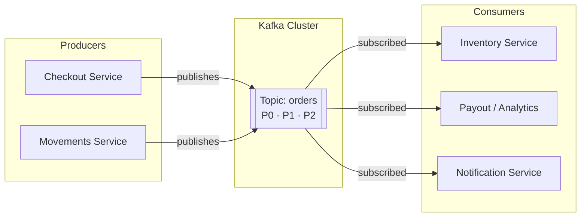
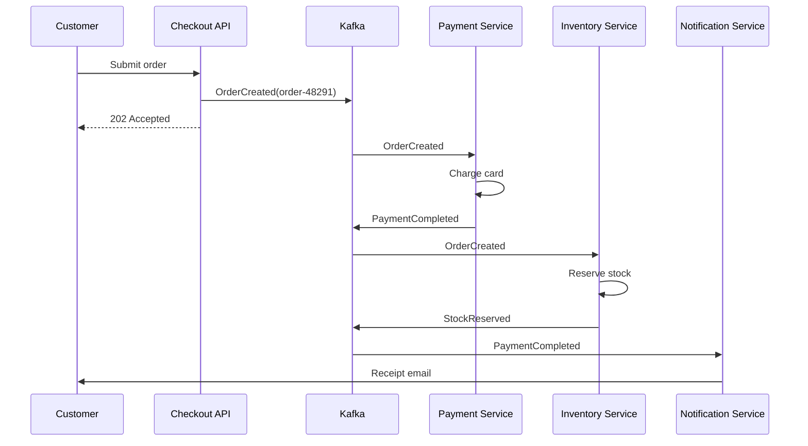

# Apache Kafka and Event-Driven Architecture — A Practical Guide to Building Event-Streaming Systems

Every time you place an online order, stream a video, or tap a payment card, dozens of systems react in the background: payments are captured, inventory is reserved, receipts are emailed, fraud checks run, analytics pipelines light up. Wiring all of those systems together with direct, synchronous API calls quickly becomes brittle — one slow service stalls the entire checkout flow. Event-driven architecture (EDA) flips the model: services publish *events* when something happens, and other services subscribe to the events they care about. Apache Kafka has become the de facto backbone for this style of system because it can move enormous volumes of events reliably, in order where it matters, and with replayable history.

In this guide, we will unpack what event-driven architecture really means, how Kafka models events internally, which delivery guarantees you can choose from, and how the pieces come together in a realistic e-commerce order pipeline. By the end, you should be able to reason about partitions, consumer groups, and offsets well enough to design your first event-backed service.


## Table of Contents

- [What Is Event-Driven Architecture?](#what-is-event-driven-architecture)
- [Why Apache Kafka?](#why-apache-kafka)
- [Inside Kafka: Topics, Partitions, and Consumer Groups](#inside-kafka-topics-partitions-and-consumer-groups)
- [Delivery Semantics](#delivery-semantics)
- [Hands-On: Producing and Consuming Events](#hands-on-producing-and-consuming-events)
- [Real-World Example: An E-Commerce Order Pipeline](#real-world-example-an-e-commerce-order-pipeline)
- [Common Pitfalls and Best Practices](#common-pitfalls-and-best-practices)
- [Key Takeaways](#key-takeaways)
- [Frequently Asked Questions](#frequently-asked-questions)

## What Is Event-Driven Architecture?

Event-driven architecture is an integration style in which components communicate by producing and reacting to **events** — immutable facts about something that happened, such as `OrderCreated` or `PaymentFailed`. Instead of service A calling service B directly and waiting for a response, service A publishes an event to a broker and moves on. Any number of interested services consume that event independently, at their own pace.

### From Request-Response to Events

The traditional request-response model (think REST over HTTP) is ideal when a caller genuinely needs an immediate answer: *What is this user's current balance?* But many workflows do not need synchronous answers — they need downstream reactions:

1. A customer submits an order.
2. Payment, inventory, shipping, notification, and analytics systems each need to know about that order.
3. None of them needs to block the checkout page while the others finish.

With direct HTTP integrations, step 2 becomes a chain of calls: fragile, slow under load, and painful to extend — every new consumer means editing the producer. In an event-driven design, the checkout service publishes a single `OrderCreated` event, and every consumer subscribes on its own. Adding a new consumer requires zero changes to the producer. This is the core decoupling win of EDA.

### The Building Blocks

An event-driven system has four essential parts:

| Component | Role | Example |
| --- | --- | --- |
| **Event** | An immutable record of something that happened | `{ "eventType": "OrderCreated", ... }` |
| **Producer** | Emits events to a broker | Checkout service publishing `OrderCreated` |
| **Broker** | Stores and routes events between producers and consumers | Apache Kafka cluster |
| **Consumer** | Subscribes to events and reacts | Inventory service reserving stock |

Events themselves usually follow a simple envelope convention — an identifier, a type, a timestamp, a payload, and metadata such as a correlation ID. Keeping the payload self-describing makes events consumable by teams that did not write the producer.

The following diagram shows the overall shape of the system:



Notice what is *not* in the diagram: no direct connections between checkout, inventory, and notifications. The topic is the contract; the services never need to know about each other.

## Why Apache Kafka?

Kafka began as an internal project at LinkedIn, was open-sourced in 2011, and became an Apache Software Foundation project shortly after. It is now used across industries for log collection, change-data-capture, microservice integration, and streaming analytics. Several design decisions explain its popularity:

- **Append-only log storage.** Kafka stores events as an ordered, append-only log on disk rather than holding them in memory until consumed. Sequential disk writes are extremely fast, which is why Kafka sustains very high throughput on ordinary hardware.
- **Retention and replay.** Events stay in the log for a configured retention period even after consumers have processed them. A new or recovering consumer can rewind and reprocess history — invaluable for debugging and backfills.
- **Horizontal scalability.** Throughput scales by adding partitions across brokers; consumers scale by adding members to a group.
- **Durability through replication.** Each partition is replicated across multiple brokers, so a broker failure does not lose data.
- **A rich ecosystem.** Connectors (Kafka Connect), stream processing (Kafka Streams, and engines like Flink), and schema management tools form a mature platform around the core broker.

None of this means Kafka is always the right choice — a small application that needs simple background jobs may be better served by a lightweight queue. But for high-volume, multi-consumer, replayable event streams, Kafka is hard to beat.

## Inside Kafka: Topics, Partitions, and Consumer Groups

Three concepts do most of the heavy lifting in Kafka's model: topics, partitions, and consumer groups. Understanding how they interact explains almost every practical behavior you will encounter.

### Topics and Partitions

A **topic** is a named, logically grouped stream of events — `orders`, `clicks`, `payments.settled`. Physically, each topic is split into one or more **partitions**. Each partition is its own append-only log, and every event within a partition gets a sequential number called an **offset**.

Two consequences follow immediately:

1. **Ordering is guaranteed only within a partition**, not across a whole topic.
2. **Parallelism is bounded by partition count.** If a topic has six partitions, at most six consumers in a single group can process it concurrently.

Producers choose the target partition per message: explicitly via a key, round-robin, or custom logic. Records with the same key (for example, `orderId`) always land on the same partition, so all events for one order arrive in order — exactly the guarantee most business logic needs.

> **Caution:** Partition count is easy to set too low and awkward to raise later, because increasing partitions breaks key-to-partition mapping for existing keys. Plan for peak throughput up front rather than defaulting to a handful of partitions.

### Replication

Each partition has one designated **leader** replica and zero or more **follower** replicas distributed across brokers. Producers and consumers talk to the leader; followers continuously copy new records. If the leader fails, a follower is promoted. How strongly producers wait for replication is controlled by acknowledgement settings (`acks`), which trades latency against durability — more on that below.


### Consumer Groups

A **consumer group** is a set of consumers that jointly processes a topic. Partitions are assigned exclusively within the group: if a topic has 6 partitions and the group has 6 consumers, each handles one; add a seventh consumer and it sits idle. Different groups, however, each receive the full stream independently — that is how five different services can all consume `orders` without interfering with each other.

Each consumer tracks its position in each assigned partition using **offsets**, which Kafka persists in an internal topic. When a consumer crashes and restarts, it resumes from its last committed offset. Committing offsets *after* processing (rather than before) is the lever that turns Kafka into an at-least-once delivery system.

| Concept | What it does | Why it matters |
| --- | --- | --- |
| Topic | Named event stream (`orders`) | The integration contract between services |
| Partition | Ordered, parallel shard of a topic | Provides ordering per key and horizontal scale |
| Offset | Position marker inside a partition | Enables resume, replay, and rewind |
| Producer acks | How firmly a producer waits for replication | Trades latency vs. durability |
| Consumer group | Team of consumers sharing a topic | Scales processing without duplicate work |

## Delivery Semantics

Kafka lets you pick how carefully events are delivered. There is no free lunch — each level trades effort or latency for stronger guarantees:

1. **At-most-once.** Offsets are committed before processing. If the consumer dies mid-batch, the unprocessed messages are skipped. Fast, but lossy.
2. **At-least-once.** Offsets are committed after processing succeeds. Failures cause redelivery, so duplicates are possible. This is the workhorse choice, paired with idempotent consumers.
3. **Effectively-once.** Combines idempotent producers, transactions spanning produce-and-commit operations, and idempotent processing on the consumer side, so side effects happen once even across failures. Strongest guarantee, highest complexity.

| Guarantee | How it is achieved | Risk | Typical use |
| --- | --- | --- | --- |
| At-most-once | Commit offset before processing | Message loss on crash | Metrics sampling, loss-tolerant telemetry |
| At-least-once | Process, then commit offset | Duplicates after retry | Most business pipelines |
| Effectively-once | Idempotent producer + transactions + idempotent handlers | Complexity, throughput cost | Financial ledgers, billing |

> **Note:** No transport layer can make your business effects idempotent for you. Even with effectively-once settings, design handlers so that applying the same event twice produces no additional effect — for example, by tracking processed event IDs or using conditional database writes.

## Hands-On: Producing and Consuming Events

The fastest way to internalize these concepts is to run them locally. With a local Kafka installation (or a container image), create a topic and exchange some messages from the command line:

```bash
# Create a topic with 6 partitions, replication factor 3
bin/kafka-topics.sh --create \
  --topic orders \
  --partitions 6 \
  --replication-factor 3 \
  --bootstrap-server localhost:9092

# Describe it: leaders, replicas, ISR per partition
bin/kafka-topics.sh --describe \
  --topic orders \
  --bootstrap-server localhost:9092

# Produce a few messages interactively
bin/kafka-console-producer.sh --topic orders \
  --bootstrap-server localhost:9092

# Consume from the beginning as part of a group
bin/kafka-console-consumer.sh --topic orders \
  --from-beginning \
  --group audit-service \
  --bootstrap-server localhost:9092
```

A production event payload should carry enough context to be understood on its own. A typical envelope looks like this:

```json
{
  "eventId": "b7c9d1e0-4a2e-4f6a-9a3c-5d7e8f1a2b3c",
  "eventType": "OrderCreated",
  "occurredAt": "2026-08-24T09:15:32Z",
  "aggregateId": "order-48291",
  "payload": {
    "customerId": "cust-1024",
    "items": [{ "sku": "KB-750", "quantity": 1 }],
    "totalAmount": 79.99,
    "currency": "USD"
  },
  "metadata": {
    "correlationId": "web-checkout-9931",
    "schemaVersion": "1.2"
  }
}
```

Consumers then process the stream with standard client libraries. This minimal Python example commits offsets only after successful handling, giving at-least-once semantics:

```python
from kafka import KafkaConsumer
import json

consumer = KafkaConsumer(
    "orders",
    bootstrap_servers=["localhost:9092"],
    group_id="inventory-service",
    auto_offset_reset="earliest",
    enable_auto_commit=False,
    value_deserializer=lambda m: json.loads(m.decode("utf-8")),
)

for msg in consumer:
    order = msg.value
    reserve_stock(order["aggregateId"], order["payload"]["items"])
    consumer.commit()  # commit AFTER processing → at-least-once
```

If `reserve_stock` throws, the offset is never committed, the consumer loop retries, and the event will be redelivered — which is precisely why the handler must be safe to run twice.

## Real-World Example: An E-Commerce Order Pipeline

To see everything working together, consider an online store that processes orders through several cooperating services.

**The scenario:** A customer completes checkout. Within seconds, payment must be captured, stock reserved, a confirmation email sent, and analytics updated — yet the customer's browser must not wait for any of those steps beyond order creation itself.

**Step by step:**

1. The **Checkout API** validates the cart, writes the order to its database, and publishes `OrderCreated` to the `orders` topic.
2. The **Payment Service** consumes `OrderCreated`, charges the card, and publishes `PaymentCompleted` (or `PaymentFailed`).
3. The **Inventory Service** consumes `OrderCreated`, reserves items, and publishes `StockReserved`.
4. The **Notification Service** consumes `PaymentCompleted` and emails the receipt.
5. An **Analytics Sink** consumes everything into a warehouse for dashboards.



Now imagine the Notification Service goes down for ten minutes during a sale. Nothing else notices: `OrderCreated` and `PaymentCompleted` events accumulate in its partition backlog, and when the service restarts it catches up from its committed offsets. Payments were not blocked, customers were not affected, and no events were lost — this failure isolation is the payoff of the architecture.

The same design also handles load spikes gracefully. During a flash sale, the checkout path stays fast because publishing an event takes milliseconds; slower consumers simply lag behind and drain their backlogs afterward.


## Common Pitfalls and Best Practices

Teams new to EDA tend to hit the same obstacles. A short checklist of habits avoids most of them:

1. **Treat schemas as contracts.** Use a schema registry and evolve payloads with backward-compatible changes (add optional fields, never remove or repurpose existing ones).
2. **Make consumers idempotent.** Redelivery is normal, not exceptional. Deduplicate on `eventId` or use upsert-style writes.
3. **Monitor consumer lag.** Lag — the gap between the latest offset and a group's committed offset — is the health metric for streaming systems; alert on sustained growth.
4. **Model events as past-tense facts.** `OrderCancelled` describes reality; commands like `CancelOrder` belong in a request-response channel instead.
5. **Size partitions deliberately.** Match partition count to expected peak throughput and desired consumer parallelism.
6. **Correlate across hops.** Propagate a `correlationId` in event metadata so a single user action can be traced end to end through every consuming service.

## Key Takeaways

- Event-driven architecture decouples producers from consumers: services publish immutable facts about what happened, and subscribers react independently at their own pace.
- Kafka implements this with an append-only, replicated log — giving high throughput, configurable durability, and replayable history that traditional queues do not offer.
- Ordering is guaranteed only within a partition; keying events by entity ID (such as `orderId`) gives you per-entity ordering plus parallelism.
- Delivery semantics are a spectrum — at-most-once, at-least-once, effectively-once — and at-least-once with idempotent handlers is the pragmatic default for most business systems.
- Consumer groups let many services share one topic while scaling workers horizontally; committed offsets provide automatic resume after failures.
- Monitor consumer lag, version your event schemas, and propagate correlation IDs to keep the system observable as it grows.

## Frequently Asked Questions

**Q1: Is Kafka a queue or a database?**
Neither exactly — it is a distributed, replicated *event log*. Like a queue it transports messages, but unlike a classic queue it retains them after consumption for a configured period, letting consumers rewind and replay. Like a database it durably stores ordered records on disk, but it offers no querying beyond reads by offset.

**Q2: When should I prefer Kafka over RabbitMQ or a cloud queue?**
As a rule of thumb: choose Kafka when many consumers need the same stream at high volume, when replay matters, or when you plan stream processing. Simpler queues often fit better for point-to-point task distribution with modest throughput. Evaluate both against your specific latency, ordering, and retention needs rather than assuming one size fits all.

**Q3: What happens if a consumer falls far behind?**
Its lag grows, but nothing is lost as long as events remain within the topic's retention window. The consumer keeps processing from its committed offset and eventually catches up. If it might fall outside retention, increase retention or give the group more parallelism (more partitions and consumers).

**Q4: Do I lose message ordering with many partitions?**
Only global ordering across the topic is lost — which most business domains do not actually require. Ordering per key is preserved: all events sharing a key go to the same partition and are consumed in order there. Keying by aggregate ID is the standard solution.

**Q5: Can Kafka deliver messages strictly once?**
Kafka supports effectively-once processing within Kafka-to-Kafka pipelines using idempotent producers and transactional consume-transform-produce loops. End-to-end exactly-once effects that include external systems still depend on idempotency in those systems' handlers.

## Related Articles

- gRPC Essentials: A Practical Guide to High-Performance Remote Procedure Calls
- WebSockets Explained: A Complete Guide to Real-Time Communication
- System Design Handbook: A Practical Guide to Scalable Architectures
- Production-Grade Architecture: The Complete Code-to-Cloud Lifecycle with AWS
- Contract Testing Explained: Consumer-Driven Contracts for Microservices
